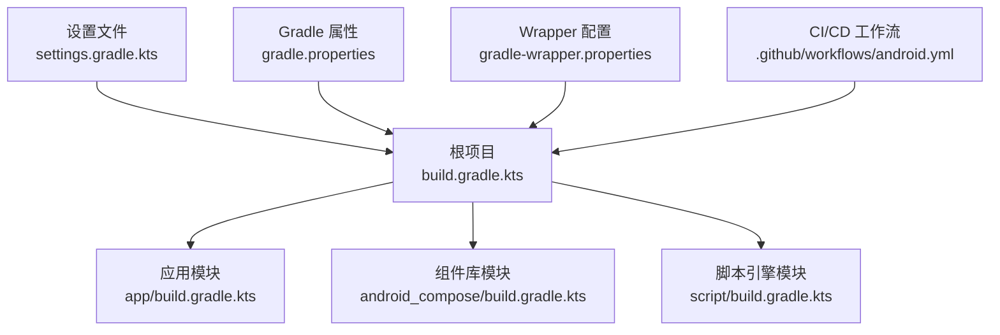
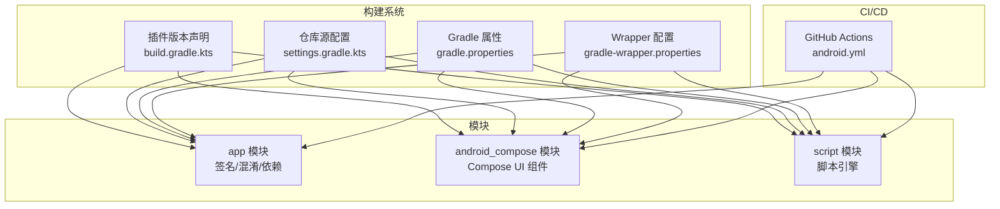
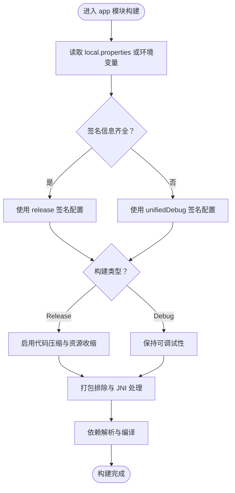
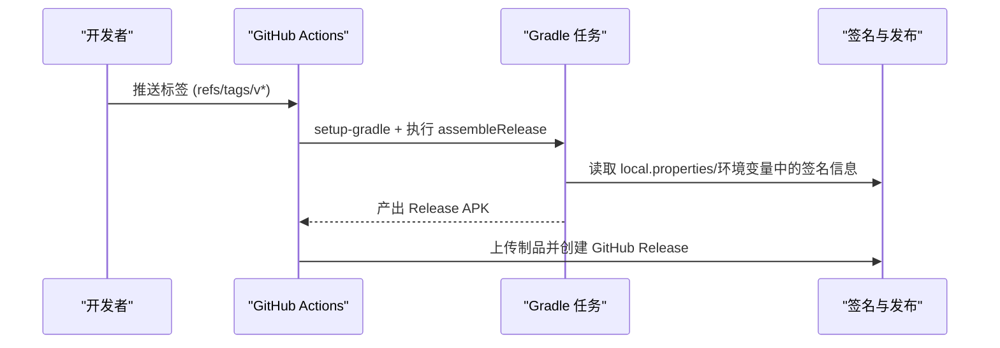
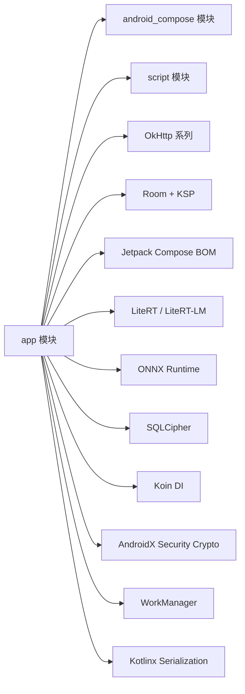

# 构建与部署

<cite>
**本文引用的文件**
- [根构建脚本 build.gradle.kts](file://build.gradle.kts)
- [设置文件 settings.gradle.kts](file://settings.gradle.kts)
- [Gradle 属性 gradle.properties](file://gradle.properties)
- [Gradle Wrapper 配置 gradle-wrapper.properties](file://gradle/wrapper/gradle-wrapper.properties)
- [CI/CD 工作流 android.yml](file://.github/workflows/android.yml)
- [应用模块构建脚本 app/build.gradle.kts](file://app/build.gradle.kts)
- [Compose 组件库构建脚本 android_compose/build.gradle.kts](file://android_compose/build.gradle.kts)
- [脚本引擎模块构建脚本 script/build.gradle.kts](file://script/build.gradle.kts)
- [应用混淆规则 app/proguard-rules.pro](file://app/proguard-rules.pro)
- [Sherpa-ONNX 下载脚本 scripts/download-sherpa-onnx.sh](file://scripts/download-sherpa-onnx.sh)
- [端到端测试脚本 scripts/e2e-test.sh](file://scripts/e2e-test.sh)
- [项目总览 PROJECT.md](file://PROJECT.md)
- [项目说明 README.md](file://README.md)
- [Sherpa 集成说明 SHERPA_INTEGRATION.md](file://SHERPA_INTEGRATION.md)
</cite>

## 目录
1. [简介](#简介)
2. [项目结构](#项目结构)
3. [核心组件](#核心组件)
4. [架构总览](#架构总览)
5. [详细组件分析](#详细组件分析)
6. [依赖关系分析](#依赖关系分析)
7. [性能考量](#性能考量)
8. [故障排查指南](#故障排查指南)
9. [结论](#结论)
10. [附录](#附录)

## 简介
本文件面向构建与部署工程师，系统梳理该 Android 项目的 Gradle 构建体系、多模块依赖关系、代码签名与发布渠道、CI/CD 流水线、构建优化与增量编译策略、构建脚本编写与维护要点，并提供常见问题诊断与不同环境部署策略。文档以仓库现有配置为依据，辅以可视化图表帮助理解。

## 项目结构
该项目采用多模块结构，包含应用主模块、Compose 组件库模块与脚本引擎模块。根级构建脚本集中声明插件版本，settings 文件统一仓库源与模块包含，gradle.properties 开启并行、缓存与配置缓存，CI/CD 使用 GitHub Actions 在 Ubuntu Runner 上执行测试与打包。

**图表来源**
- [根构建脚本 build.gradle.kts:1-9](file://build.gradle.kts#L1-L9)
- [设置文件 settings.gradle.kts:21-24](file://settings.gradle.kts#L21-L24)
- [Gradle 属性 gradle.properties:8-11](file://gradle.properties#L8-L11)
- [Gradle Wrapper 配置 gradle-wrapper.properties:1-5](file://gradle/wrapper/gradle-wrapper.properties#L1-L5)
- [CI/CD 工作流 android.yml:1-130](file://.github/workflows/android.yml#L1-L130)

**章节来源**
- [根构建脚本 build.gradle.kts:1-9](file://build.gradle.kts#L1-L9)
- [设置文件 settings.gradle.kts:1-24](file://settings.gradle.kts#L1-L24)
- [Gradle 属性 gradle.properties:1-11](file://gradle.properties#L1-L11)
- [Gradle Wrapper 配置 gradle-wrapper.properties:1-5](file://gradle/wrapper/gradle-wrapper.properties#L1-L5)
- [CI/CD 工作流 android.yml:1-130](file://.github/workflows/android.yml#L1-L130)

## 核心组件
- 根构建脚本：集中声明 Android 应用、Kotlin、Kotlin 序列化、Compose、KSP 插件版本，避免子模块重复声明。
- 设置文件：统一插件仓库与依赖仓库源，包含 app、android_compose、script 三个模块。
- Gradle 属性：开启并行构建、构建缓存、配置缓存，设置 JVM 参数与 AndroidX、非传递 R 类等。
- Wrapper：指定 Gradle 8.9，使用国内镜像加速下载。
- CI/CD：定义测试、Debug 构建、Release 构建与发布流程，使用 GitHub Secrets 注入签名信息。

**章节来源**
- [根构建脚本 build.gradle.kts:2-8](file://build.gradle.kts#L2-L8)
- [设置文件 settings.gradle.kts:1-19](file://settings.gradle.kts#L1-L19)
- [Gradle 属性 gradle.properties:3-10](file://gradle.properties#L3-L10)
- [Gradle Wrapper 配置 gradle-wrapper.properties:3-3](file://gradle/wrapper/gradle-wrapper.properties#L3-L3)
- [CI/CD 工作流 android.yml:11-130](file://.github/workflows/android.yml#L11-L130)

## 架构总览
下图展示构建系统在多模块间的协作关系与关键配置点：

**图表来源**
- [根构建脚本 build.gradle.kts:2-8](file://build.gradle.kts#L2-L8)
- [设置文件 settings.gradle.kts:1-19](file://settings.gradle.kts#L1-L19)
- [Gradle 属性 gradle.properties:8-10](file://gradle.properties#L8-L10)
- [Gradle Wrapper 配置 gradle-wrapper.properties:3-3](file://gradle/wrapper/gradle-wrapper.properties#L3-L3)
- [CI/CD 工作流 android.yml:11-130](file://.github/workflows/android.yml#L11-L130)

## 详细组件分析

### Gradle 根配置与仓库管理
- 插件版本集中声明于根构建脚本，子模块通过 apply false 引用，避免重复。
- settings 文件统一插件与依赖仓库源，包含阿里云、Google、MavenCentral 与 Gradle 插件门户。
- 仓库模式 FAIL_ON_PROJECT_REPOS 确保依赖来源可控。

**章节来源**
- [根构建脚本 build.gradle.kts:2-8](file://build.gradle.kts#L2-L8)
- [设置文件 settings.gradle.kts:1-19](file://settings.gradle.kts#L1-L19)

### Gradle 属性与构建优化
- 并行构建、构建缓存、配置缓存开启，显著缩短增量构建时间。
- JVM 参数与 AndroidX、非传递 R 类等配置提升稳定性与体积控制。
- Wrapper 使用国内镜像，降低网络波动影响。

**章节来源**
- [Gradle 属性 gradle.properties:3-10](file://gradle.properties#L3-L10)
- [Gradle Wrapper 配置 gradle-wrapper.properties:3-3](file://gradle/wrapper/gradle-wrapper.properties#L3-L3)

### 应用模块构建配置
- 签名配置：优先从 local.properties 读取，其次从环境变量；提供统一调试签名用于跨平台一致性。
- 构建类型：Release 启用代码压缩与资源收缩，Debug 保持可调试性；两者均配置 Compose 与 Kotlin 编译选项。
- 依赖管理：集中引入 Jetpack Compose、OkHttp、Room、WorkManager、LiteRT、ONNX Runtime、SQLCipher、Koin 等。
- 打包排除与 JNI Lib 处理：排除无关 META-INF 文件，保留 libc++_shared.so 以适配多运行时。

**图表来源**
- [应用模块构建脚本 app/build.gradle.kts:11-124](file://app/build.gradle.kts#L11-L124)

**章节来源**
- [应用模块构建脚本 app/build.gradle.kts:11-124](file://app/build.gradle.kts#L11-L124)

### 组件库模块与脚本引擎模块
- android_compose：启用 Compose 与 Kotlin 编译选项，提供 UI 组件与测试依赖。
- script：最小化配置，依赖核心运行时与 QuickJS 引擎，便于独立迭代与测试。

**章节来源**
- [Compose 组件库构建脚本 android_compose/build.gradle.kts:1-84](file://android_compose/build.gradle.kts#L1-L84)
- [脚本引擎模块构建脚本 script/build.gradle.kts:1-41](file://script/build.gradle.kts#L1-L41)

### 代码签名与发布渠道
- Release 签名：从 local.properties 或环境变量读取 keystore 与密钥信息，支持 CI 注入。
- Debug 签名：统一调试 keystore，保证 Windows 与 WSL2 签名一致。
- 发布渠道：CI 在打标签时触发 Release 构建，上传产物并通过 GitHub Releases 发布。

**图表来源**
- [CI/CD 工作流 android.yml:79-130](file://.github/workflows/android.yml#L79-L130)
- [应用模块构建脚本 app/build.gradle.kts:49-91](file://app/build.gradle.kts#L49-L91)

**章节来源**
- [CI/CD 工作流 android.yml:79-130](file://.github/workflows/android.yml#L79-L130)
- [应用模块构建脚本 app/build.gradle.kts:49-91](file://app/build.gradle.kts#L49-L91)

### CI/CD 流水线与自动化部署
- 触发条件：master/main 推送与 PR，以及 Release 创建。
- 测试阶段：设置 JDK 17，执行单元测试与 Lint。
- 构建阶段：分别构建 Debug 与 Release APK，上传制品。
- 发布阶段：基于标签触发，解码 keystore 并创建 GitHub Release。

**章节来源**
- [CI/CD 工作流 android.yml:1-130](file://.github/workflows/android.yml#L1-L130)

### 构建优化与增量编译策略
- 并行与缓存：gradle.properties 开启并行、缓存与配置缓存，减少重复工作。
- ABI 优化：仅保留 arm64-v8a，缩小安装包体积。
- 资源与代码压缩：Release 启用 shrink 与资源收缩，配合 ProGuard 规则。
- 依赖版本统一：通过 Compose BOM 与插件版本集中管理，降低冲突风险。

**章节来源**
- [Gradle 属性 gradle.properties:8-10](file://gradle.properties#L8-L10)
- [应用模块构建脚本 app/build.gradle.kts:38-41](file://app/build.gradle.kts#L38-L41)
- [应用模块构建脚本 app/build.gradle.kts:76-82](file://app/build.gradle.kts#L76-L82)

### 构建脚本编写与维护指导
- 插件版本：统一在根构建脚本声明，子模块按需引用，避免分散配置。
- 仓库源：settings 文件集中管理，确保国内网络可用性。
- 签名配置：优先使用 local.properties，CI 使用环境变量注入，避免硬编码。
- 依赖管理：使用 BOM 与固定版本，定期同步升级。
- 脚本化辅助：提供 Sherpa-ONNX 下载脚本与端到端测试脚本，便于本地验证。

**章节来源**
- [根构建脚本 build.gradle.kts:2-8](file://build.gradle.kts#L2-L8)
- [设置文件 settings.gradle.kts:1-19](file://settings.gradle.kts#L1-L19)
- [Sherpa-ONNX 下载脚本 scripts/download-sherpa-onnx.sh:1-63](file://scripts/download-sherpa-onnx.sh#L1-L63)
- [端到端测试脚本 scripts/e2e-test.sh:1-108](file://scripts/e2e-test.sh#L1-L108)

### 不同环境的部署策略与配置管理
- 开发环境：使用统一调试 keystore，避免签名差异导致的安装冲突。
- 测试环境：通过 CI 执行测试与 Debug 构建，便于快速反馈。
- 生产环境：Release 构建启用压缩与签名，CI 自动上传至 GitHub Releases。
- 配置管理：敏感信息通过 local.properties 与环境变量注入，避免提交到仓库。

**章节来源**
- [应用模块构建脚本 app/build.gradle.kts:60-71](file://app/build.gradle.kts#L60-L71)
- [CI/CD 工作流 android.yml:98-114](file://.github/workflows/android.yml#L98-L114)

## 依赖关系分析
应用模块对组件库与脚本引擎模块存在编译期与运行期依赖，同时引入大量第三方库以支撑 UI、网络、机器学习与安全等功能。

**图表来源**
- [应用模块构建脚本 app/build.gradle.kts:126-216](file://app/build.gradle.kts#L126-L216)
- [Compose 组件库构建脚本 android_compose/build.gradle.kts:41-76](file://android_compose/build.gradle.kts#L41-L76)
- [脚本引擎模块构建脚本 script/build.gradle.kts:27-40](file://script/build.gradle.kts#L27-L40)

**章节来源**
- [应用模块构建脚本 app/build.gradle.kts:126-216](file://app/build.gradle.kts#L126-L216)
- [Compose 组件库构建脚本 android_compose/build.gradle.kts:41-76](file://android_compose/build.gradle.kts#L41-L76)
- [脚本引擎模块构建脚本 script/build.gradle.kts:27-40](file://script/build.gradle.kts#L27-L40)

## 性能考量
- 构建性能：开启并行、缓存与配置缓存，减少重复编译时间。
- 二进制体积：仅保留 arm64-v8a，启用代码与资源压缩，配合 ProGuard 规则。
- 依赖体积：通过 BOM 与精简依赖，避免重复与冗余。
- 本地语音引擎：Sherpa-ONNX 模型较大，建议在 WiFi 环境下载，避免影响安装包体积。

**章节来源**
- [Gradle 属性 gradle.properties:8-10](file://gradle.properties#L8-L10)
- [应用模块构建脚本 app/build.gradle.kts:38-41](file://app/build.gradle.kts#L38-L41)
- [应用模块构建脚本 app/build.gradle.kts:76-82](file://app/build.gradle.kts#L76-L82)
- [Sherpa 集成说明 SHERPA_INTEGRATION.md:147-152](file://SHERPA_INTEGRATION.md#L147-L152)

## 故障排查指南
- 本地语音引擎功能异常
  - 现象：功能测试无法使用 Sherpa-ONNX。
  - 原因：当前项目包含 stub AAR，需下载真实 AAR。
  - 处理：执行下载脚本，或手动下载 AAR 至 app/libs/，并清理缓存后重试。
  - 参考：[Sherpa-ONNX 下载脚本:19-30](file://scripts/download-sherpa-onnx.sh#L19-L30)，[Sherpa 集成说明:34-50](file://SHERPA_INTEGRATION.md#L34-L50)

- Release 构建签名失败
  - 现象：assembleRelease 报错，提示缺少 keystore 或密码。
  - 原因：local.properties 或环境变量未正确配置。
  - 处理：在本地创建 local.properties，或在 CI 中设置对应 Secrets。
  - 参考：[CI/CD 工作流:98-114](file://.github/workflows/android.yml#L98-L114)，[应用模块签名配置:11-24](file://app/build.gradle.kts#L11-L24)

- 依赖冲突或版本不匹配
  - 现象：编译报错或运行时异常。
  - 处理：统一使用 Compose BOM 与插件版本，核对依赖版本，必要时降级或升级。
  - 参考：[应用模块依赖:126-216](file://app/build.gradle.kts#L126-L216)，[设置文件仓库源:1-19](file://settings.gradle.kts#L1-L19)

- CI 构建失败
  - 现象：测试或构建阶段中断。
  - 处理：检查 JDK 版本、网络连通性与 GitHub Secrets 是否正确配置。
  - 参考：[CI/CD 工作流:20-43](file://.github/workflows/android.yml#L20-L43)

**章节来源**
- [Sherpa-ONNX 下载脚本 scripts/download-sherpa-onnx.sh:19-30](file://scripts/download-sherpa-onnx.sh#L19-L30)
- [Sherpa 集成说明 SHERPA_INTEGRATION.md:34-50](file://SHERPA_INTEGRATION.md#L34-L50)
- [CI/CD 工作流 android.yml:98-114](file://.github/workflows/android.yml#L98-L114)
- [应用模块构建脚本 app/build.gradle.kts:11-24](file://app/build.gradle.kts#L11-L24)
- [应用模块构建脚本 app/build.gradle.kts:126-216](file://app/build.gradle.kts#L126-L216)
- [设置文件 settings.gradle.kts:1-19](file://settings.gradle.kts#L1-L19)

## 结论
该构建与部署体系以多模块为核心，根级统一插件与仓库配置，配合 Gradle 属性优化与 CI/CD 自动化，实现了稳定高效的开发与发布流程。建议持续关注依赖版本演进、签名配置安全与构建缓存策略，以进一步提升效率与安全性。

## 附录
- 项目总览与技术栈：[PROJECT.md:81-102](file://PROJECT.md#L81-L102)
- 快速构建命令与测试：[PROJECT.md:544-572](file://PROJECT.md#L544-L572)
- 项目说明与签名策略：[README.md:162-180](file://README.md#L162-L180)