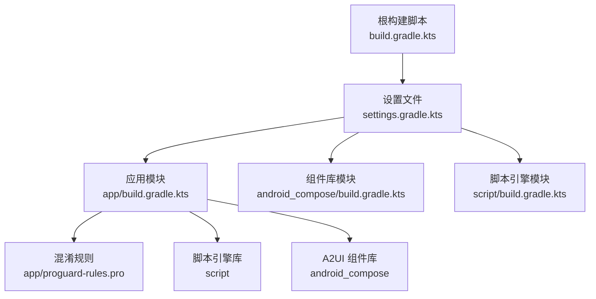
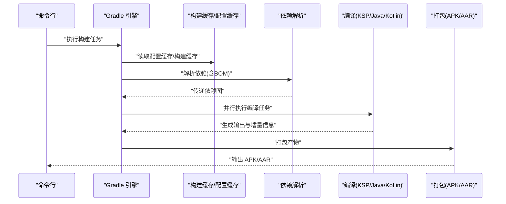
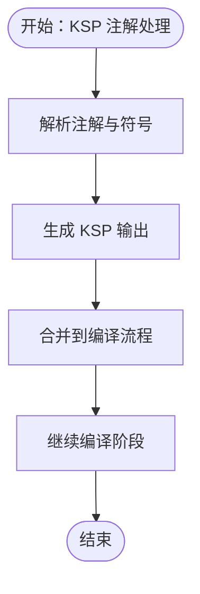
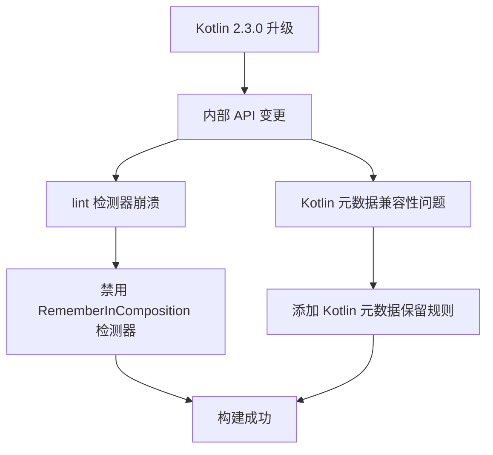
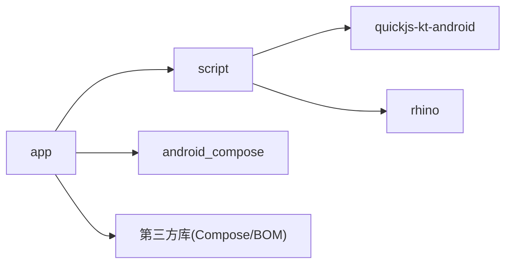

# 构建优化

<cite>
**本文引用的文件**
- [根构建脚本 build.gradle.kts](file://build.gradle.kts)
- [Gradle 属性 gradle.properties](file://gradle.properties)
- [设置文件 settings.gradle.kts](file://settings.gradle.kts)
- [应用模块构建脚本 app/build.gradle.kts](file://app/build.gradle.kts)
- [应用模块混淆规则 app/proguard-rules.pro](file://app/proguard-rules.pro)
- [Compose 组件库构建脚本 android_compose/build.gradle.kts](file://android_compose/build.gradle.kts)
- [脚本引擎库构建脚本 script/build.gradle.kts](file://script/build.gradle.kts)
- [Gradle 包装器属性 gradle-wrapper.properties](file://gradle/wrapper/gradle-wrapper.properties)
- [A2UI 渲染优化 RenderOptimization.kt](file://android_compose/src/main/java/org/a2ui/compose/charts/performance/RenderOptimization.kt)
- [脚本引擎能力桥接 CapabilityBridge.kt](file://script/src/main/java/ai/openclaw/script/CapabilityBridge.kt)
- [脚本引擎脚手架 ScriptEngine.kt](file://script/src/main/java/ai/openclaw/script/ScriptEngine.kt)
- [脚本引擎编排 ScriptOrchestrator.kt](file://script/src/main/java/ai/openclaw/script/ScriptOrchestrator.kt)
</cite>

## 目录
1. [引言](#引言)
2. [项目结构](#项目结构)
3. [核心组件](#核心组件)
4. [架构总览](#架构总览)
5. [详细组件分析](#详细组件分析)
6. [依赖关系分析](#依赖关系分析)
7. [性能考量](#性能考量)
8. [故障排查指南](#故障排查指南)
9. [结论](#结论)
10. [附录](#附录)

## 引言
本文件面向构建工程师与高级开发者，系统性梳理本项目的构建优化策略与最佳实践，涵盖并行构建、增量编译、依赖管理与版本对齐、资源优化与 APK 大小控制、编译期注解处理（KSP）的性能影响与优化、内存配置与构建缓存调优、大型项目构建时间优化技巧、构建问题诊断与性能分析方法，以及高效本地开发构建环境的搭建建议。文中所有结论均基于仓库现有配置与实现进行归纳总结，并提供对应的文件来源定位。

## 项目结构
本项目采用多模块结构：根级构建脚本统一声明插件版本；settings 文件集中管理仓库源与模块包含；各模块独立维护自身构建配置与依赖。应用模块 app 作为最终产物，集成脚本引擎库与 A2UI 组件库；脚本引擎库负责 JS 能力桥接；组件库提供高性能渲染与性能监控工具。

图示来源
- [根构建脚本 build.gradle.kts](file://build.gradle.kts)
- [设置文件 settings.gradle.kts](file://settings.gradle.kts)
- [应用模块构建脚本 app/build.gradle.kts](file://app/build.gradle.kts)
- [应用模块混淆规则 app/proguard-rules.pro](file://app/proguard-rules.pro)
- [Compose 组件库构建脚本 android_compose/build.gradle.kts](file://android_compose/build.gradle.kts)
- [脚本引擎库构建脚本 script/build.gradle.kts](file://script/build.gradle.kts)

章节来源
- [根构建脚本 build.gradle.kts](file://build.gradle.kts)
- [设置文件 settings.gradle.kts](file://settings.gradle.kts)

## 核心组件
- 插件与工具链版本：根级统一声明 Android 应用、Kotlin、Kotlin 序列化、Kotlin Compose、KSP 插件版本，确保全工程一致性。
- 并行与缓存：全局开启并行构建、构建缓存与配置缓存，显著缩短增量构建时间。
- 依赖与版本对齐：使用 BOM 管理 Compose 版本，避免隐式版本漂移；Room 使用 KSP 进行注解处理。
- 资源与体积：Release 启用代码压缩与资源收缩；按 ABI 过滤仅保留 arm64-v8a；排除无用元数据与重复资源。
- 编译期注解处理：KSP 替代 KAPT，提升增量编译与并发效率；合理配置 KSP 参数以减少不必要的处理。
- 内存与 JVM：固定 JBR 路径与 JVM 堆大小，避免默认 GC 行为差异导致的构建波动。
- 包装器与镜像：Gradle 包装器使用国内镜像源，降低网络波动对首次下载的影响。
- Kotlin 版本兼容性：针对 Kotlin 2.3.0 升级后的内部 API 变更，通过 lint 禁用特定检测器来解决兼容性问题。

章节来源
- [根构建脚本 build.gradle.kts](file://build.gradle.kts)
- [Gradle 属性 gradle.properties](file://gradle.properties)
- [应用模块构建脚本 app/build.gradle.kts](file://app/build.gradle.kts)
- [应用模块混淆规则 app/proguard-rules.pro](file://app/proguard-rules.pro)
- [Compose 组件库构建脚本 android_compose/build.gradle.kts](file://android_compose/build.gradle.kts)
- [脚本引擎库构建脚本 script/build.gradle.kts](file://script/build.gradle.kts)
- [Gradle 包装器属性 gradle-wrapper.properties](file://gradle/wrapper/gradle-wrapper.properties)

## 架构总览
下图展示构建阶段的关键路径与优化点：从 Gradle 启动到任务执行，贯穿并行与缓存、依赖解析、编译与打包等环节。

图示来源
- [Gradle 属性 gradle.properties](file://gradle.properties)
- [设置文件 settings.gradle.kts](file://settings.gradle.kts)
- [应用模块构建脚本 app/build.gradle.kts](file://app/build.gradle.kts)
- [Compose 组件库构建脚本 android_compose/build.gradle.kts](file://android_compose/build.gradle.kts)
- [脚本引擎库构建脚本 script/build.gradle.kts](file://script/build.gradle.kts)

## 详细组件分析

### 并行构建与增量编译配置
- 全局并行：开启 org.gradle.parallel=true，提升多模块任务并发度。
- 构建缓存：开启 org.gradle.caching=true，跨机器共享编译产物，加速冷启动与 CI。
- 配置缓存：开启 org.gradle.configuration-cache=true，避免重复配置阶段开销。
- JVM 与 JBR：固定 org.gradle.java.home 与 JVM 堆大小，减少因默认 GC 或 JDK 差异导致的构建抖动。
- 包装器镜像：使用国内镜像源，降低首次下载耗时与失败概率。

章节来源
- [Gradle 属性 gradle.properties](file://gradle.properties)
- [Gradle 包装器属性 gradle-wrapper.properties](file://gradle/wrapper/gradle-wrapper.properties)

### 依赖管理与版本对齐
- Compose 版本对齐：通过 platform("androidx.compose:compose-bom:...") 统一管理 Compose 生态版本，避免隐式版本漂移。
- Room 与 KSP：implementation(project(":script")) 与 ksp("androidx.room:room-compiler:...") 明确注解处理器链路，保证增量编译与并发安全。
- 第三方库版本：集中声明核心库版本（如 OkHttp、Coroutines、SQLCipher、LiteRT/LiteRT-LM、ONNX Runtime、QuickJS/Rhino），便于升级与审计。
- 仓库源：settings 中统一配置阿里云与 Maven Central/GMaven，确保依赖解析稳定与速度。

章节来源
- [应用模块构建脚本 app/build.gradle.kts](file://app/build.gradle.kts)
- [Compose 组件库构建脚本 android_compose/build.gradle.kts](file://android_compose/build.gradle.kts)
- [脚本引擎库构建脚本 script/build.gradle.kts](file://script/build.gradle.kts)
- [设置文件 settings.gradle.kts](file://settings.gradle.kts)

### 资源优化与 APK 大小控制
- Release 启用代码压缩与资源收缩，减少发布包体积。
- ABI 过滤：仅保留 arm64-v8a，移除 x86/x86_64，显著降低原生库体积与安装包大小。
- 排除元数据与重复资源：排除 /META-INF 无用许可文件与重复资源，避免冗余。
- JNI 库策略：保留 libc++_shared.so 的 pickFirst，避免冲突。
- 混淆规则：针对 Kotlinx Serialization、OkHttp、Room、Sherpa-ONNX、Kotlin 元数据等进行白名单保留，确保运行时反射与序列化正常工作。

章节来源
- [应用模块构建脚本 app/build.gradle.kts](file://app/build.gradle.kts)
- [应用模块混淆规则 app/proguard-rules.pro](file://app/proguard-rules.pro)

### 编译期注解处理（KSP）的性能影响与优化
- KSP 替代 KAPT：在 Room 与脚本引擎模块中使用 KSP，提升增量编译与并发效率，减少全量编译概率。
- 注解处理参数：在 app 模块中对 Room 使用 KSP，避免 KAPT 的额外开销；脚本引擎模块未使用 KSP，需关注其编译时成本。
- 能力桥接与绑定：脚本引擎通过 CapabilityBridge 抽象桥接不同 JS 引擎模式（Rhino/QuickJS），减少编译期复杂度与运行时切换成本。

图示来源
- [应用模块构建脚本 app/build.gradle.kts](file://app/build.gradle.kts)
- [脚本引擎库构建脚本 script/build.gradle.kts](file://script/build.gradle.kts)
- [脚本引擎能力桥接 CapabilityBridge.kt](file://script/src/main/java/ai/openclaw/script/CapabilityBridge.kt)

章节来源
- [应用模块构建脚本 app/build.gradle.kts](file://app/build.gradle.kts)
- [脚本引擎库构建脚本 script/build.gradle.kts](file://script/build.gradle.kts)
- [脚本引擎能力桥接 CapabilityBridge.kt](file://script/src/main/java/ai/openclaw/script/CapabilityBridge.kt)

### 内存配置与构建缓存调优
- 固定 JBR 与堆大小：org.gradle.java.home 指向 Android Studio JBR，org.gradle.jvmargs 设置 -Xmx 与编码，确保构建过程内存稳定。
- 构建缓存：org.gradle.caching=true，建议配合 CI 使用共享缓存目录，进一步缩短构建时间。
- 配置缓存：org.gradle.configuration-cache=true，适用于大多数场景，注意避免在构建脚本中使用不兼容 API。

章节来源
- [Gradle 属性 gradle.properties](file://gradle.properties)

### 大型项目的构建时间优化技巧
- 模块拆分：将脚本引擎与组件库独立为模块，减少无关变更对主应用的影响。
- 依赖隔离：通过 BOM 对齐版本，避免跨模块版本冲突引发的全量重建。
- 任务粒度：利用并行与增量编译，尽量避免串行或阻塞任务。
- 仓库镜像：settings 与包装器均使用国内镜像，降低网络因素对构建时长的影响。

章节来源
- [设置文件 settings.gradle.kts](file://settings.gradle.kts)
- [Gradle 包装器属性 gradle-wrapper.properties](file://gradle/wrapper/gradle-wrapper.properties)
- [应用模块构建脚本 app/build.gradle.kts](file://app/build.gradle.kts)

### Kotlin 2.3.0 兼容性问题处理
**新增** 针对 Kotlin 2.3.0 升级后的内部 API 变更，项目已采取以下兼容性处理措施：

- lint 检测器兼容性：在 app 模块的 lint 配置中禁用了 "RememberInComposition" 检测器，该检测器在 Kotlin 2.3.0 内部 API 变更后会出现崩溃问题
- Kotlin 元数据兼容性：在混淆规则中添加了对 Kotlin 2.3.0 相关内部类的兼容性处理，包括 kotlin.** 和 kotlin.reflect.jvm.internal.** 类的保留规则
- 插件版本同步：根级构建脚本中统一声明了所有 Kotlin 相关插件版本为 2.3.0，确保编译器、序列化插件和 Compose 插件的版本一致性

图示来源
- [应用模块构建脚本 app/build.gradle.kts:96-99](file://app/build.gradle.kts#L96-L99)
- [应用模块混淆规则 app/proguard-rules.pro:39-44](file://app/proguard-rules.pro#L39-L44)
- [根构建脚本 build.gradle.kts:2-8](file://build.gradle.kts#L2-L8)

**章节来源**
- [应用模块构建脚本 app/build.gradle.kts:96-99](file://app/build.gradle.kts#L96-L99)
- [应用模块混淆规则 app/proguard-rules.pro:39-44](file://app/proguard-rules.pro#L39-L44)
- [根构建脚本 build.gradle.kts:2-8](file://build.gradle.kts#L2-L8)

### 构建问题的诊断工具与性能分析方法
- 配置缓存诊断：当配置缓存导致问题时，可通过禁用配置缓存定位具体脚本不兼容项。
- 构建扫描：建议在 CI 中启用构建扫描，查看任务耗时与缓存命中情况。
- 依赖冲突：使用 dependencyInsight 或 --info 日志观察依赖解析路径，结合 BOM 定位版本偏差。
- 体积分析：Release 包体积异常时，结合资源收缩日志与 ABI 过滤策略排查。
- Kotlin 版本兼容性诊断：当遇到 Kotlin 2.3.0 相关的 lint 或编译问题时，首先检查是否正确应用了兼容性处理措施。

章节来源
- [Gradle 属性 gradle.properties](file://gradle.properties)
- [应用模块构建脚本 app/build.gradle.kts](file://app/build.gradle.kts)
- [应用模块混淆规则 app/proguard-rules.pro](file://app/proguard-rules.pro)

### 高效本地开发构建环境
- 本地签名：统一调试签名（unifiedDebug）跨平台一致，避免签名不一致导致的重打包。
- 仓库源：settings 中统一配置阿里云与 Maven Central，提升解析稳定性。
- 包装器镜像：gradle-wrapper 使用国内镜像，降低首次下载失败概率。
- 并行与缓存：本地开启并行与缓存，充分利用磁盘缓存减少重复编译。
- Kotlin 版本一致性：确保本地开发环境与 CI 环境使用相同的 Kotlin 版本，避免兼容性问题。

章节来源
- [应用模块构建脚本 app/build.gradle.kts](file://app/build.gradle.kts)
- [设置文件 settings.gradle.kts](file://settings.gradle.kts)
- [Gradle 包装器属性 gradle-wrapper.properties](file://gradle/wrapper/gradle-wrapper.properties)

## 依赖关系分析

图示来源
- [应用模块构建脚本 app/build.gradle.kts](file://app/build.gradle.kts)
- [脚本引擎库构建脚本 script/build.gradle.kts](file://script/build.gradle.kts)
- [Compose 组件库构建脚本 android_compose/build.gradle.kts](file://android_compose/build.gradle.kts)

章节来源
- [应用模块构建脚本 app/build.gradle.kts](file://app/build.gradle.kts)
- [脚本引擎库构建脚本 script/build.gradle.kts](file://script/build.gradle.kts)
- [Compose 组件库构建脚本 android_compose/build.gradle.kts](file://android_compose/build.gradle.kts)

## 性能考量
- 渲染性能监控：A2UI 组件库提供 RenderPerformanceMonitor 与 MemoryMonitor，用于运行时性能与内存压力评估，指导 UI 侧优化。
- 数据采样与虚拟化：VirtualizedRenderer、LayeredRenderManager、CanvasCacheManager 与 DataSampler 提供大数据集渲染的分层、缓存与采样策略，降低 UI 渲染成本。
- 构建侧优化：KSP、并行、缓存与配置缓存共同作用，显著缩短增量构建时间；ABI 过滤与资源收缩有效控制 APK 体积；Kotlin 2.3.0 兼容性处理确保构建稳定性。

章节来源
- [A2UI 渲染优化 RenderOptimization.kt](file://android_compose/src/main/java/org/a2ui/compose/charts/performance/RenderOptimization.kt)
- [应用模块构建脚本 app/build.gradle.kts](file://app/build.gradle.kts)

## 故障排查指南
- 构建失败或不稳定：检查 org.gradle.java.home 与 JVM 堆大小设置，确认 JBR 与 Gradle 版本匹配。
- 依赖解析失败：核对 settings 中仓库源顺序与可用性，优先使用阿里云与 Google/MavenCentral。
- 混淆导致运行时异常：核对 app/proguard-rules.pro 中对 Kotlinx Serialization、OkHttp、Room、Sherpa-ONNX、Kotlin 元数据的保留规则。
- 脚本引擎能力缺失：确认 CapabilityBridge 的 registerBindings 实现与 QuickJS/Rhino 模式注入逻辑正确。
- Kotlin 2.3.0 兼容性问题：检查 lint 配置中是否正确禁用了受影响的检测器，确认混淆规则中是否包含了必要的 Kotlin 元数据保留规则。

**更新** 新增 Kotlin 2.3.0 兼容性问题的故障排查指南

章节来源
- [Gradle 属性 gradle.properties](file://gradle.properties)
- [设置文件 settings.gradle.kts](file://settings.gradle.kts)
- [应用模块混淆规则 app/proguard-rules.pro](file://app/proguard-rules.pro)
- [脚本引擎能力桥接 CapabilityBridge.kt](file://script/src/main/java/ai/openclaw/script/CapabilityBridge.kt)
- [脚本引擎脚手架 ScriptEngine.kt](file://script/src/main/java/ai/openclaw/script/ScriptEngine.kt)
- [脚本引擎编排 ScriptOrchestrator.kt](file://script/src/main/java/ai/openclaw/script/ScriptOrchestrator.kt)
- [应用模块构建脚本 app/build.gradle.kts:96-99](file://app/build.gradle.kts#L96-L99)

## 结论
本项目在构建层面已具备较完善的优化基础：统一插件版本、并行与缓存、配置缓存、ABI 过滤与资源收缩、KSP 注解处理、JBR 与 JVM 堆大小固定、国内镜像源与包装器。针对 Kotlin 2.3.0 升级，项目已通过禁用兼容性问题检测器和添加元数据保留规则来确保构建稳定性。建议在 CI 中启用构建扫描与共享缓存，在本地开发中保持并行与缓存开启，并持续通过 BOM 与模块拆分维持依赖一致性与增量编译效率。UI 侧可结合 A2UI 的性能监控与渲染优化工具，进一步降低运行时开销。

## 附录
- 关键优化开关与位置
  - 并行与缓存：[gradle.properties](file://gradle.properties)
  - 配置缓存：[gradle.properties](file://gradle.properties)
  - JBR 与 JVM 堆：[gradle.properties](file://gradle.properties)
  - 仓库源与模块包含：[settings.gradle.kts](file://settings.gradle.kts)
  - 包装器镜像：[gradle-wrapper.properties](file://gradle/wrapper/gradle-wrapper.properties)
  - ABI 过滤与资源排除：[app/build.gradle.kts](file://app/build.gradle.kts)
  - 混淆规则：[app/proguard-rules.pro](file://app/proguard-rules.pro)
  - KSP 与 Room：[app/build.gradle.kts](file://app/build.gradle.kts)
  - Compose BOM：[android_compose/build.gradle.kts](file://android_compose/build.gradle.kts)
  - 脚本引擎能力桥接：[script/build.gradle.kts](file://script/build.gradle.kts)
  - Kotlin 2.3.0 兼容性处理：[app/build.gradle.kts:96-99](file://app/build.gradle.kts#L96-L99)、[app/proguard-rules.pro:39-44](file://app/proguard-rules.pro#L39-L44)、[build.gradle.kts:2-8](file://build.gradle.kts#L2-L8)