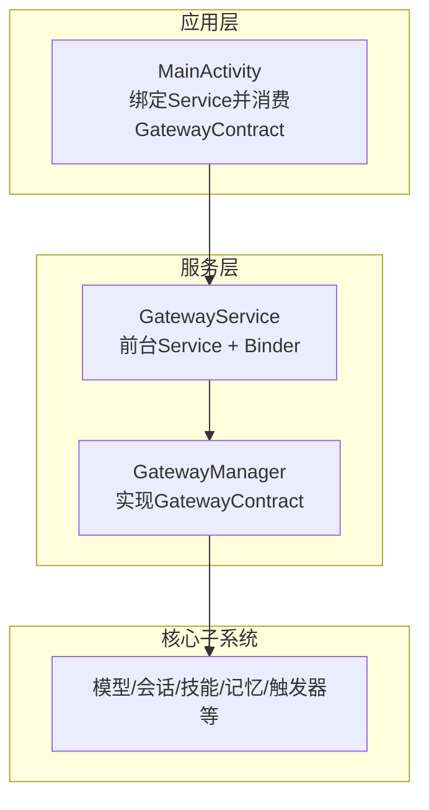
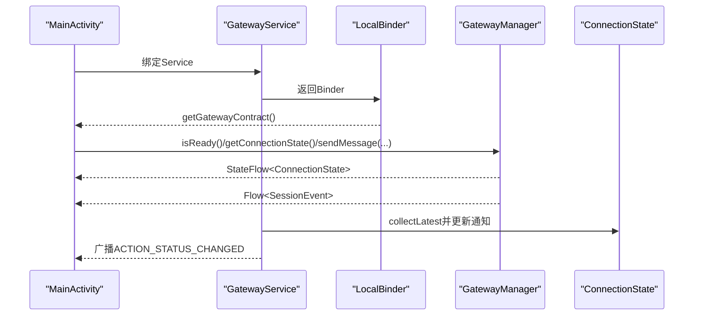
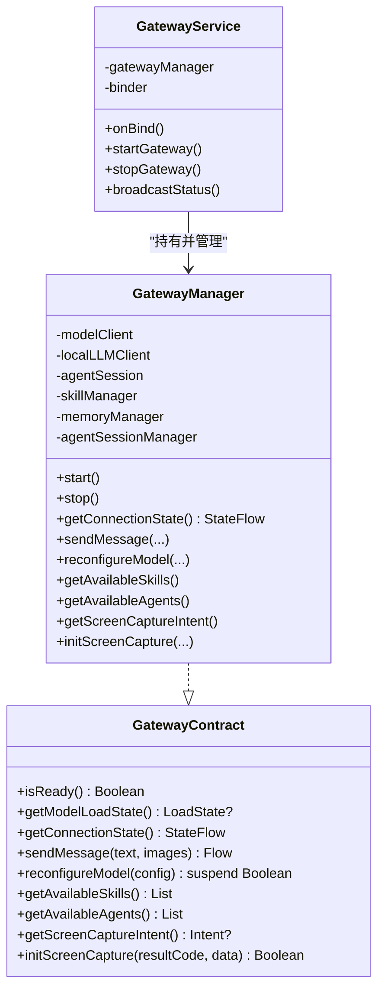
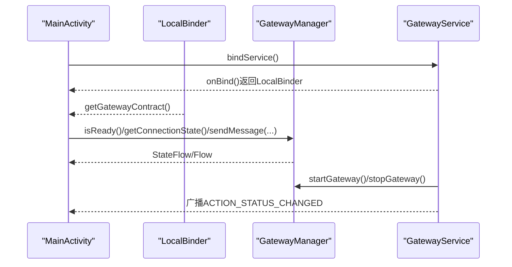
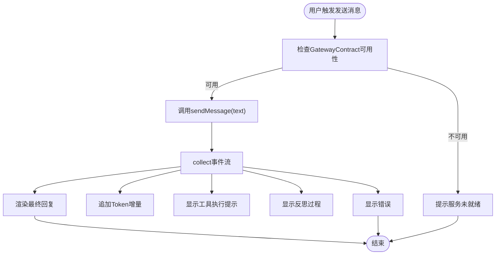
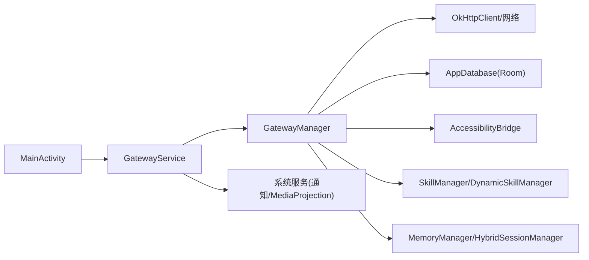

# API边界设计

<cite>
**本文引用的文件列表**
- [GatewayContract.kt](file://app/src/main/java/ai/openclaw/android/GatewayContract.kt)
- [GatewayManager.kt](file://app/src/main/java/ai/openclaw/android/GatewayManager.kt)
- [GatewayService.kt](file://app/src/main/java/ai/openclaw/android/GatewayService.kt)
- [MainActivity.kt](file://app/src/main/java/ai/openclaw/android/MainActivity.kt)
- [LogManager.kt](file://app/src/main/java/ai/openclaw/android/LogManager.kt)
- [AndroidManifest.xml](file://app/src/main/AndroidManifest.xml)
- [README.md](file://README.md)
</cite>

## 目录
1. [简介](#简介)
2. [项目结构](#项目结构)
3. [核心组件](#核心组件)
4. [架构总览](#架构总览)
5. [详细组件分析](#详细组件分析)
6. [依赖关系分析](#依赖关系分析)
7. [性能考量](#性能考量)
8. [故障排查指南](#故障排查指南)
9. [结论](#结论)
10. [附录](#附录)

## 简介
本文件围绕OpenClaw-Android的API边界设计进行系统化技术说明，重点阐述GatewayContract接口的设计理念、Activity与Service之间通过Binder实现的清洁API边界、接口方法定义与参数/返回值处理机制、跨进程通信的安全考虑（权限验证、数据序列化、异常处理）、接口版本兼容性与向后兼容的API演进策略、接口调用的性能优化（异步处理、缓存策略、批量操作），并给出最佳实践、错误处理模式与调试技巧，以及扩展与自定义的安全指导原则。

## 项目结构
OpenClaw-Android采用“单源真相”架构：GatewayService持有所有核心组件的唯一实例，并通过Binder对外暴露GatewayContract接口给Activity使用。该设计确保模型生命周期独立于Activity，便于未来演进到真正的跨进程Service。

图表来源
- [README.md:9-27](file://README.md#L9-L27)
- [GatewayService.kt:31-88](file://app/src/main/java/ai/openclaw/android/GatewayService.kt#L31-L88)
- [GatewayManager.kt:65-108](file://app/src/main/java/ai/openclaw/android/GatewayManager.kt#L65-L108)

章节来源
- [README.md:5-41](file://README.md#L5-L41)
- [GatewayService.kt:31-88](file://app/src/main/java/ai/openclaw/android/GatewayService.kt#L31-L88)

## 核心组件
- GatewayContract：Activity仅依赖的契约接口，屏蔽内部实现细节，为未来跨进程留退路。
- GatewayManager：实现GatewayContract，聚合模型、会话、技能、记忆、触发器等子系统。
- GatewayService：前台Service，负责生命周期管理、通知、广播状态变化，并通过Binder提供GatewayContract实例。
- MainActivity：UI入口，绑定Service获取GatewayContract，发起消息发送、配置重载、屏幕捕获等调用。
- LogManager：集中日志管理，提供StateFlow供UI订阅，便于调试与监控。

章节来源
- [GatewayContract.kt:10-34](file://app/src/main/java/ai/openclaw/android/GatewayContract.kt#L10-L34)
- [GatewayManager.kt:65-108](file://app/src/main/java/ai/openclaw/android/GatewayManager.kt#L65-L108)
- [GatewayService.kt:31-88](file://app/src/main/java/ai/openclaw/android/GatewayService.kt#L31-L88)
- [MainActivity.kt:75-120](file://app/src/main/java/ai/openclaw/android/MainActivity.kt#L75-L120)
- [LogManager.kt:16-45](file://app/src/main/java/ai/openclaw/android/LogManager.kt#L16-L45)

## 架构总览
下图展示Activity与Service之间的Binder交互与数据流，以及状态变更的广播机制。

图表来源
- [GatewayService.kt:107-120](file://app/src/main/java/ai/openclaw/android/GatewayService.kt#L107-L120)
- [GatewayService.kt:183-208](file://app/src/main/java/ai/openclaw/android/GatewayService.kt#L183-L208)
- [GatewayManager.kt:100-108](file://app/src/main/java/ai/openclaw/android/GatewayManager.kt#L100-L108)

章节来源
- [GatewayService.kt:107-120](file://app/src/main/java/ai/openclaw/android/GatewayService.kt#L107-L120)
- [GatewayService.kt:183-208](file://app/src/main/java/ai/openclaw/android/GatewayService.kt#L183-L208)
- [MainActivity.kt:107-120](file://app/src/main/java/ai/openclaw/android/MainActivity.kt#L107-L120)

## 详细组件分析

### GatewayContract接口设计
- 设计目标
  - Activity只依赖接口，不直接访问GatewayManager内部组件，保证API边界清晰。
  - 为将来改为远程Service（真正跨进程）预留空间。
- 方法族
  - 运行状态与连接状态：isReady()、getModelLoadState()、getConnectionState()
  - 会话交互：sendMessage(text, images)返回Flow<SessionEvent>
  - 配置重载：suspend reconfigureModel(config)返回Boolean
  - 资源查询：getAvailableSkills()、getAvailableAgents()
  - 屏幕捕获：getScreenCaptureIntent()、initScreenCapture(resultCode, data)
- 参数与返回值
  - sendMessage：文本输入与可选图片列表；返回事件流，包含Token增量、工具执行、反思过程、完整回复、错误等事件类型。
  - reconfigureModel：suspend函数，内部可能释放旧模型、初始化新模型、重建AgentSession、重连内存子系统等；返回是否成功。
  - 屏幕捕获：前者返回Intent供Activity startActivityForResult；后者接收回调并委托给无障碍服务初始化MediaProjection。
- 版本兼容性
  - 通过ConnectionState枚举抽象连接状态，支持新增状态而不破坏现有调用方。
  - sendMessage同时支持多代理路由路径与单代理回退路径，保障向后兼容。

章节来源
- [GatewayContract.kt:10-34](file://app/src/main/java/ai/openclaw/android/GatewayContract.kt#L10-L34)
- [GatewayManager.kt:112-128](file://app/src/main/java/ai/openclaw/android/GatewayManager.kt#L112-L128)
- [GatewayManager.kt:281-295](file://app/src/main/java/ai/openclaw/android/GatewayManager.kt#L281-L295)
- [GatewayManager.kt:299-322](file://app/src/main/java/ai/openclaw/android/GatewayManager.kt#L299-L322)

### GatewayManager实现与子系统集成
- 子系统聚合
  - 模型客户端、本地LLM客户端、Agent会话、代理注册表、技能管理、动态技能、Feishu客户端、触发系统、数据库、嵌入服务、记忆管理、混合会话管理、无障碍桥等。
- 生命周期与状态
  - start()：初始化组件、建立连接状态流、进入Connected。
  - stop()：释放资源、清理技能、停止触发器、复位状态。
  - getConnectionState()：返回StateFlow，供UI与Service监听。
- 会话与工具执行
  - sendMessage优先走多代理路由，否则回退到单代理；工具执行由本地LLM回调SkillManager或AccessibilityBridge执行。
- 内存与脚本桥接
  - 根据模型加载状态选择记忆提取器（LLM或回退），注入HybridSessionManager与MemoryManager，打通脚本技能与记忆系统。
- 动态技能与生成技能
  - 初始化DynamicSkillManager，注册GenerateSkillTool与GenerateSkillSkill，动态刷新工具集并同步到AgentSession。

图表来源
- [GatewayContract.kt:15-34](file://app/src/main/java/ai/openclaw/android/GatewayContract.kt#L15-L34)
- [GatewayManager.kt:65-108](file://app/src/main/java/ai/openclaw/android/GatewayManager.kt#L65-L108)
- [GatewayService.kt:65-88](file://app/src/main/java/ai/openclaw/android/GatewayService.kt#L65-L88)

章节来源
- [GatewayManager.kt:65-108](file://app/src/main/java/ai/openclaw/android/GatewayManager.kt#L65-L108)
- [GatewayManager.kt:326-383](file://app/src/main/java/ai/openclaw/android/GatewayManager.kt#L326-L383)
- [GatewayManager.kt:392-561](file://app/src/main/java/ai/openclaw/android/GatewayManager.kt#L392-L561)
- [GatewayManager.kt:563-613](file://app/src/main/java/ai/openclaw/android/GatewayManager.kt#L563-L613)

### GatewayService与Binder机制
- Binder实现
  - LocalBinder提供getService()与getGatewayContract()，Activity通过bindService获取GatewayContract。
- 生命周期与前台服务
  - startForeground()显示通知；onStartCommand根据ACTION_START/STOP启动/停止GatewayManager；onDestroy统一清理。
- 状态广播
  - broadcastStatus()发送ACTION_STATUS_CHANGED广播，携带is_running与state，供UI感知服务状态变化。
- 通知与日志
  - 创建通知渠道，更新通知内容；LogManager集中记录日志并提供StateFlow供UI订阅。

图表来源
- [GatewayService.kt:107-120](file://app/src/main/java/ai/openclaw/android/GatewayService.kt#L107-L120)
- [GatewayService.kt:170-211](file://app/src/main/java/ai/openclaw/android/GatewayService.kt#L170-L211)
- [MainActivity.kt:107-120](file://app/src/main/java/ai/openclaw/android/MainActivity.kt#L107-L120)

章节来源
- [GatewayService.kt:65-120](file://app/src/main/java/ai/openclaw/android/GatewayService.kt#L65-L120)
- [GatewayService.kt:170-211](file://app/src/main/java/ai/openclaw/android/GatewayService.kt#L170-L211)
- [MainActivity.kt:107-120](file://app/src/main/java/ai/openclaw/android/MainActivity.kt#L107-L120)

### Activity端调用流程与UI集成
- 绑定与可用性检测
  - MainActivity在onCreate中启动GatewayService并bindService，从LocalBinder获取GatewayContract；LaunchedEffect延迟后检查isReady()或ConfigManager状态。
- 发送消息与事件流
  - sendMessage(text)返回Flow<SessionEvent>，UI逐条收集并更新消息列表；支持Token增量、工具执行、反思、完成与错误事件。
- 配置重载与屏幕捕获
  - SettingsScreen中调用reconfigureModel(ModelConfig)保存并重载模型；屏幕捕获通过getScreenCaptureIntent()与ActivityResult回调初始化MediaProjection。
- 权限与特殊权限处理
  - 使用ActivityResultContracts.RequestMultiplePermissions与特殊权限页面跳转，结合PermissionManager统一调度。

图表来源
- [MainActivity.kt:378-455](file://app/src/main/java/ai/openclaw/android/MainActivity.kt#L378-L455)

章节来源
- [MainActivity.kt:122-141](file://app/src/main/java/ai/openclaw/android/MainActivity.kt#L122-L141)
- [MainActivity.kt:378-455](file://app/src/main/java/ai/openclaw/android/MainActivity.kt#L378-L455)
- [MainActivity.kt:611-676](file://app/src/main/java/ai/openclaw/android/MainActivity.kt#L611-L676)

## 依赖关系分析
- 组件耦合与内聚
  - GatewayContract高内聚地封装了Activity所需的所有能力，降低Activity对内部实现的耦合。
  - GatewayManager作为门面，聚合多个子系统，保持良好的模块边界。
- 外部依赖与集成点
  - Android系统服务：Notification、MediaProjection、AccessibilityService、NotificationListenerService等。
  - 第三方网络库：OkHttpClient用于Feishu客户端。
  - Room数据库：AppDatabase提供持久化能力。
- 权限与导出控制
  - GatewayService与MyAccessibilityService均声明exported=false，避免外部直接绑定。
  - Manifest中声明必要权限，如INTERNET、FOREGROUND_SERVICE、BIND_NOTIFICATION_LISTENER_SERVICE等。

图表来源
- [AndroidManifest.xml:51-121](file://app/src/main/AndroidManifest.xml#L51-L121)
- [GatewayService.kt:31-88](file://app/src/main/java/ai/openclaw/android/GatewayService.kt#L31-L88)
- [GatewayManager.kt:392-561](file://app/src/main/java/ai/openclaw/android/GatewayManager.kt#L392-L561)

章节来源
- [AndroidManifest.xml:51-121](file://app/src/main/AndroidManifest.xml#L51-L121)
- [GatewayService.kt:31-88](file://app/src/main/java/ai/openclaw/android/GatewayService.kt#L31-L88)
- [GatewayManager.kt:392-561](file://app/src/main/java/ai/openclaw/android/GatewayManager.kt#L392-L561)

## 性能考量
- 异步处理
  - GatewayManager与GatewayService均使用协程作用域（IO/Main），确保后台初始化与状态监听不阻塞主线程。
  - sendMessage返回Flow，UI侧按事件增量渲染，避免一次性大块数据传输。
- 缓存策略
  - ScriptEngine对成功执行的脚本进行缓存，减少重复执行开销。
  - RenderOptimization提供图形绘制缓存与清理策略，降低重复渲染成本。
  - BatchDataUpdater支持批量数据更新与定时刷新，平衡吞吐与延迟。
- 批量操作
  - DataBufferManager支持批量写入与压缩阈值，避免频繁I/O。
- 资源释放
  - stop()与cleanup()确保在Service销毁或停止时释放模型、技能、触发器等资源，防止内存泄漏。

章节来源
- [GatewayManager.kt:326-383](file://app/src/main/java/ai/openclaw/android/GatewayManager.kt#L326-L383)
- [GatewayService.kt:170-211](file://app/src/main/java/ai/openclaw/android/GatewayService.kt#L170-L211)
- [ScriptEngine.kt:75-118](file://script/src/main/java/ai/openclaw/script/ScriptEngine.kt#L75-L118)
- [RenderOptimization.kt:104-162](file://android_compose/src/main/java/org/a2ui/compose/charts/performance/RenderOptimization.kt#L104-L162)
- [StreamingData.kt:212-242](file://android_compose/src/main/java/org/a2ui/compose/charts/data/StreamingData.kt#L212-L242)

## 故障排查指南
- 日志与状态
  - 使用LogManager集中记录INFO/WARN/ERROR级别日志，并通过StateFlow供UI展示；Service在状态变化时更新通知。
- 错误事件处理
  - sendMessage事件流包含SessionEvent.Error，UI应将其转换为可读提示并记录日志。
- 权限问题
  - 若屏幕捕获失败，检查MediaProjection权限与无障碍服务状态；SettingsScreen提供一键请求入口。
- 配置问题
  - reconfigureModel失败时，检查模型提供商、API Key、模型名与BaseURL；Service会将错误状态写入ConnectionState并广播。
- 广播监听
  - MainActivity监听ACTION_STATUS_CHANGED广播以同步服务运行状态。

章节来源
- [LogManager.kt:16-45](file://app/src/main/java/ai/openclaw/android/LogManager.kt#L16-L45)
- [GatewayService.kt:183-208](file://app/src/main/java/ai/openclaw/android/GatewayService.kt#L183-L208)
- [GatewayManager.kt:143-274](file://app/src/main/java/ai/openclaw/android/GatewayManager.kt#L143-L274)
- [MainActivity.kt:666-672](file://app/src/main/java/ai/openclaw/android/MainActivity.kt#L666-L672)

## 结论
通过GatewayContract与GatewayService/Binder的组合，OpenClaw-Android实现了清晰的API边界：Activity仅依赖契约接口，不直接接触内部实现；Service承担生命周期与状态管理，提供稳定的异步事件流与配置重载能力。该设计兼顾安全性（权限与导出控制）、可扩展性（子系统聚合与动态技能）、可观测性（集中日志与状态广播），并为未来跨进程演进预留空间。配合协程异步、缓存与批量策略，整体具备良好的性能表现与可维护性。

## 附录

### 接口方法定义与参数/返回值一览
- isReady(): Boolean
  - 用途：判断AgentSession是否已就绪
- getModelLoadState(): LocalLLMClient.LoadState?
  - 用途：查询本地模型加载状态
- getConnectionState(): StateFlow<GatewayManager.ConnectionState>
  - 用途：订阅连接状态变化
- sendMessage(text: String, images: List<ImageContent>?): Flow<SessionEvent>
  - 用途：发送消息并流式接收事件
- reconfigureModel(config: ModelConfig): suspend Boolean
  - 用途：重载模型配置并重建会话
- getAvailableSkills(): List<SkillInfo>
  - 用途：查询可用技能清单
- getAvailableAgents(): List<AgentInfo>
  - 用途：查询可用代理清单
- getScreenCaptureIntent(): Intent?
  - 用途：获取屏幕捕获Intent
- initScreenCapture(resultCode: Int, data: Intent): Boolean
  - 用途：初始化MediaProjection

章节来源
- [GatewayContract.kt:15-34](file://app/src/main/java/ai/openclaw/android/GatewayContract.kt#L15-L34)

### 跨进程通信与安全考虑
- Binder与本地绑定
  - 当前为本地Service绑定，exported=false，避免外部直接绑定；若未来迁移到跨进程，需在Manifest中声明exported=true并增加权限校验。
- 权限验证
  - 屏幕捕获依赖MediaProjection与无障碍服务；权限通过系统界面申请，MainActivity统一处理。
- 数据序列化
  - 事件流使用Kotlin Flow，事件对象通过序列化框架传输；注意避免传输过大对象，建议分片或延迟加载。
- 异常处理
  - GatewayManager在start()与reconfigureModel()中捕获异常并写入ConnectionState.Error，Service广播状态变化，Activity据此提示用户。

章节来源
- [AndroidManifest.xml:75-94](file://app/src/main/AndroidManifest.xml#L75-L94)
- [GatewayService.kt:183-208](file://app/src/main/java/ai/openclaw/android/GatewayService.kt#L183-L208)
- [GatewayManager.kt:326-344](file://app/src/main/java/ai/openclaw/android/GatewayManager.kt#L326-L344)
- [MainActivity.kt:666-672](file://app/src/main/java/ai/openclaw/android/MainActivity.kt#L666-L672)

### 版本兼容性与API演进
- 状态抽象
  - ConnectionState枚举支持新增状态（如Connecting/Connected/Disconnected/Error），不影响调用方。
- 方法演进
  - sendMessage同时支持多代理路由与单代理回退，确保向后兼容。
  - reconfigureModel内部可逐步引入新子系统（如触发器、脚本引擎），对外保持一致签名。
- 配置迁移
  - ConfigManager集中管理模型提供商、API Key、模型名与BaseURL，支持运行时重载。

章节来源
- [GatewayManager.kt:100-108](file://app/src/main/java/ai/openclaw/android/GatewayManager.kt#L100-L108)
- [GatewayManager.kt:112-128](file://app/src/main/java/ai/openclaw/android/GatewayManager.kt#L112-L128)
- [GatewayManager.kt:143-274](file://app/src/main/java/ai/openclaw/android/GatewayManager.kt#L143-L274)

### 最佳实践与扩展指导
- 最佳实践
  - Activity仅通过GatewayContract调用，避免直接访问内部组件。
  - 使用StateFlow与Flow进行状态与事件传播，UI侧及时取消收集以避免内存泄漏。
  - 对耗时操作（模型加载、网络请求）使用协程与超时控制。
- 扩展与自定义
  - 新增技能：通过SkillManager.registerSkill()注册；动态技能通过DynamicSkillManager管理。
  - 新增代理：AgentConfigManager管理代理配置，GatewayManager自动路由。
  - 屏幕捕获：遵循权限流程，初始化MediaProjection后交由无障碍服务处理。
- 安全指导
  - 严格限制Service导出与权限；对敏感参数（API Key）进行加密存储与最小化暴露。
  - 对工具调用进行安全审查（幂等性、用户偏好），必要时弹窗确认。

章节来源
- [GatewayManager.kt:175-225](file://app/src/main/java/ai/openclaw/android/GatewayManager.kt#L175-L225)
- [GatewayManager.kt:446-474](file://app/src/main/java/ai/openclaw/android/GatewayManager.kt#L446-L474)
- [GatewayManager.kt:299-322](file://app/src/main/java/ai/openclaw/android/GatewayManager.kt#L299-L322)
- [AndroidManifest.xml:75-94](file://app/src/main/AndroidManifest.xml#L75-L94)