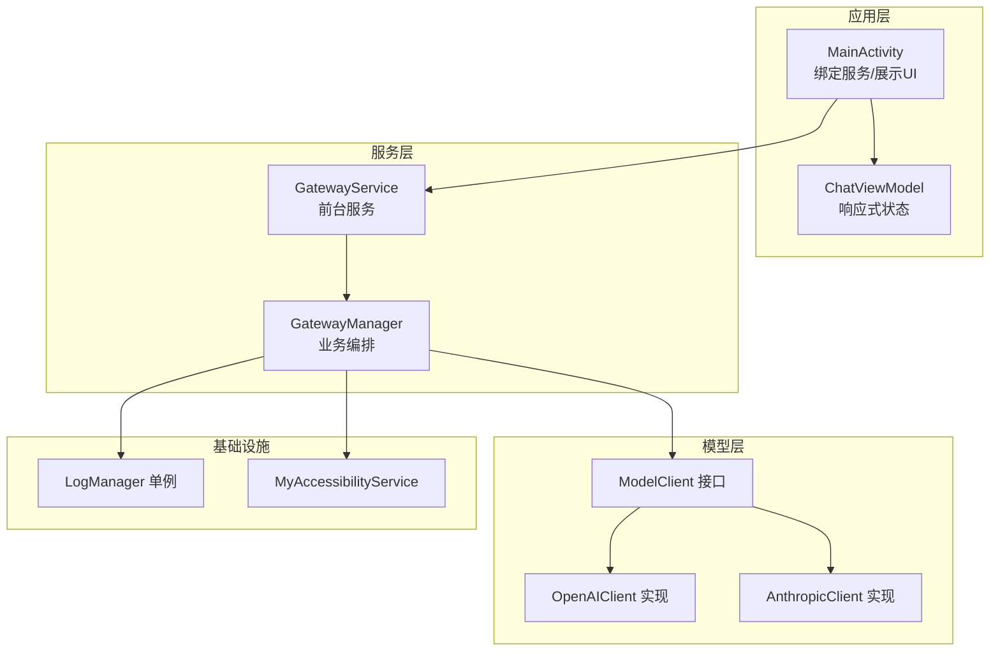
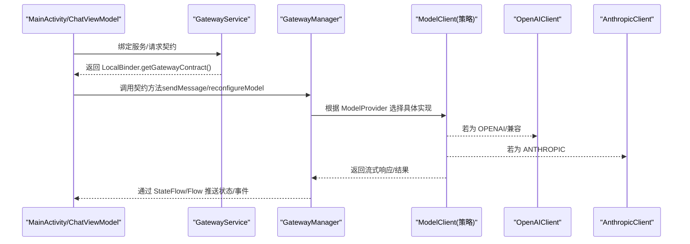
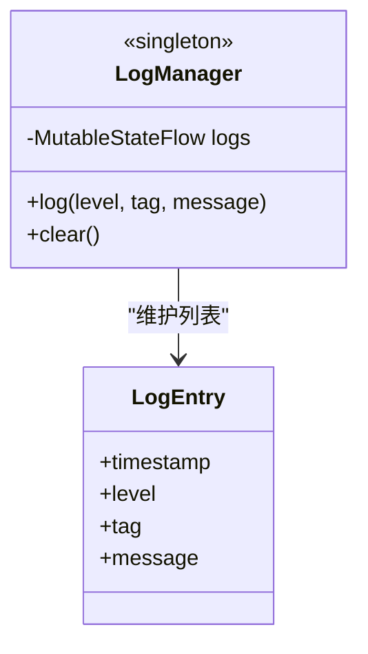
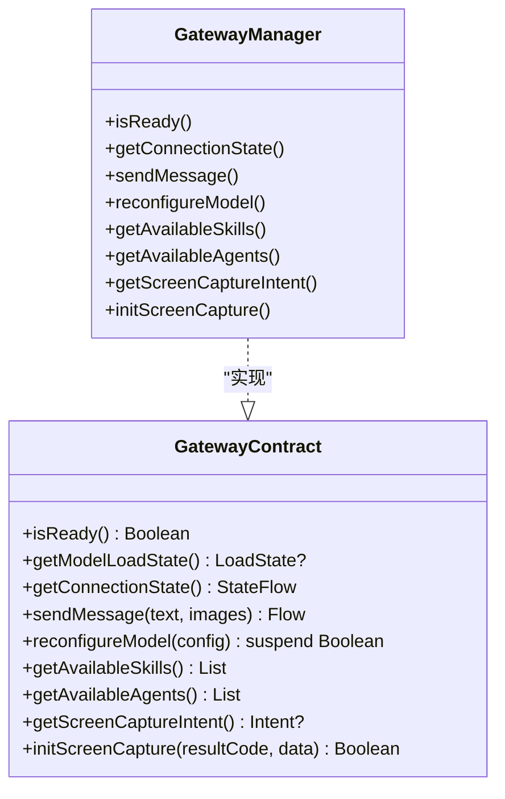
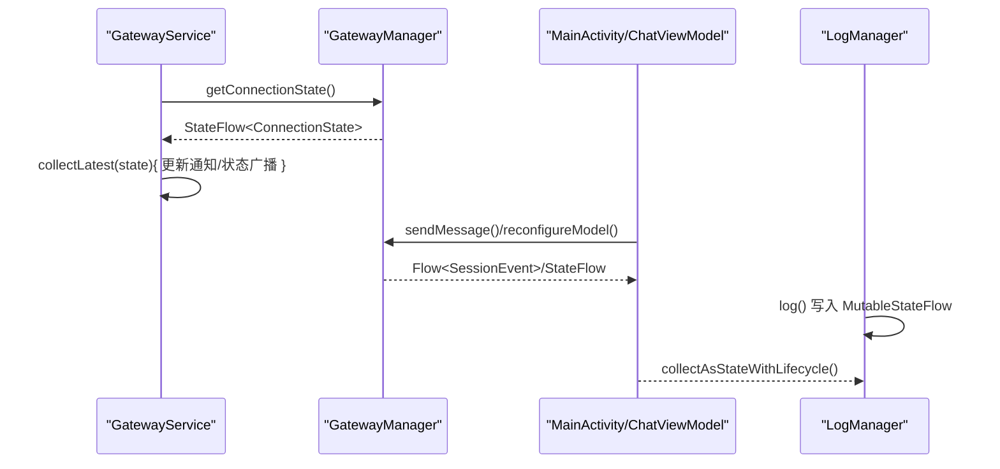
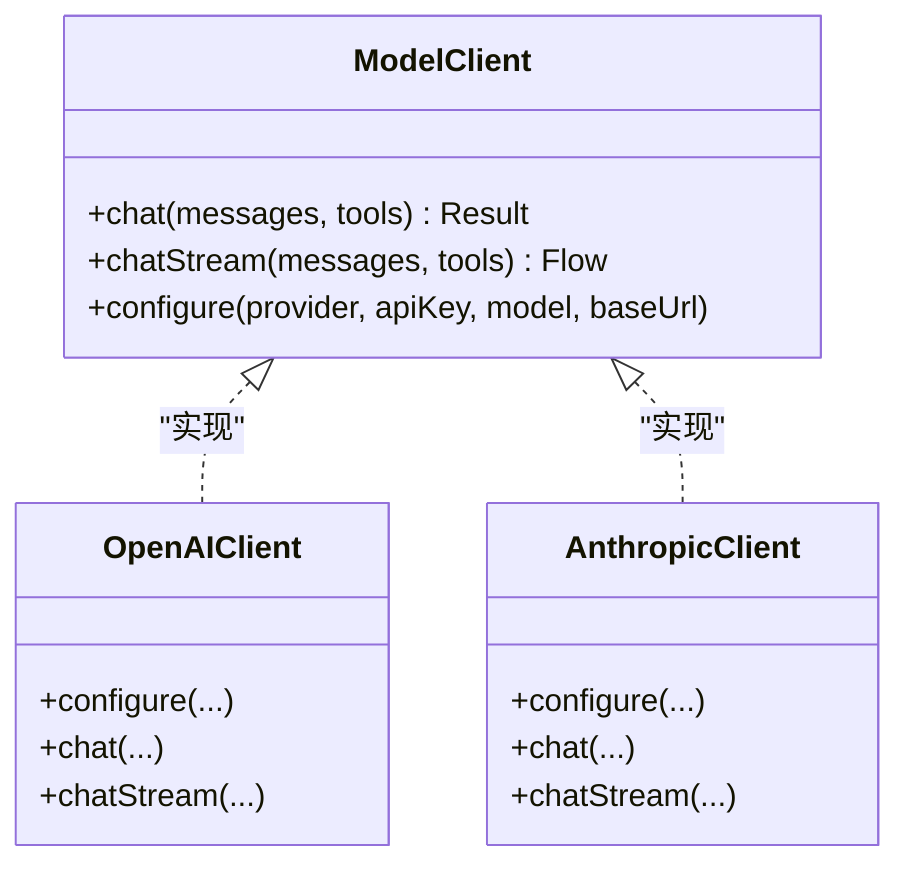
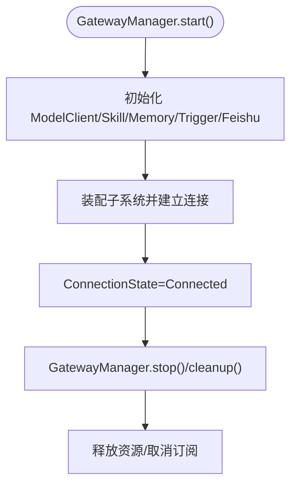
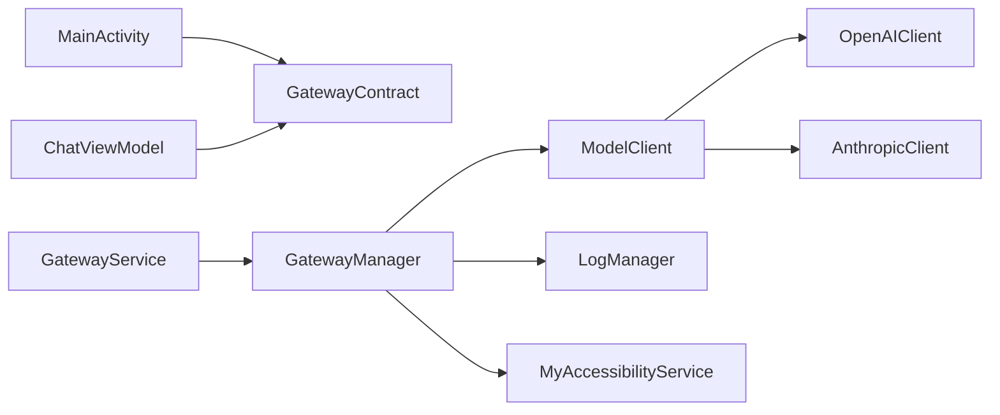

# 架构模式应用

<cite>
**本文引用的文件**
- [GatewayService.kt](file://app/src/main/java/ai/openclaw/android/GatewayService.kt)
- [GatewayManager.kt](file://app/src/main/java/ai/openclaw/android/GatewayManager.kt)
- [GatewayContract.kt](file://app/src/main/java/ai/openclaw/android/GatewayContract.kt)
- [LogManager.kt](file://app/src/main/java/ai/openclaw/android/LogManager.kt)
- [MainActivity.kt](file://app/src/main/java/ai/openclaw/android/MainActivity.kt)
- [ChatViewModel.kt](file://app/src/main/java/ai/openclaw/android/viewmodel/ChatViewModel.kt)
- [ModelClient.kt](file://app/src/main/java/ai/openclaw/android/model/ModelClient.kt)
- [OpenAIClient.kt](file://app/src/main/java/ai/openclaw/android/model/OpenAIClient.kt)
- [AnthropicClient.kt](file://app/src/main/java/ai/openclaw/android/model/AnthropicClient.kt)
- [MyAccessibilityService.kt](file://app/src/main/java/ai/openclaw/android/MyAccessibilityService.kt)
</cite>

## 目录
1. [引言](#引言)
2. [项目结构](#项目结构)
3. [核心组件](#核心组件)
4. [架构总览](#架构总览)
5. [详细组件分析](#详细组件分析)
6. [依赖分析](#依赖分析)
7. [性能考量](#性能考量)
8. [故障排查指南](#故障排查指南)
9. [结论](#结论)
10. [附录](#附录)

## 引言
本文件面向架构师与高级开发者，系统梳理 OpenClaw-Android 中的架构模式应用，重点覆盖以下设计模式：
- 单例模式：用于集中日志管理（LogManager.shared）
- 外观模式：对外暴露统一契约接口（GatewayContract），隐藏内部复杂性
- 观察者模式：基于 Kotlin Flow 的响应式更新（StateFlow、collectLatest）
- 策略模式：多 LLM 提供商切换（ModelProvider 与 ModelClient 实现）

同时，本文阐述这些模式之间的协作关系，说明如何通过组合模式实现灵活的系统架构，并从可维护性、可扩展性、可测试性三个维度评估其影响，给出模式选择的决策因素、权衡与替代方案，以及最佳实践与常见陷阱。

## 项目结构
OpenClaw-Android 采用分层与功能域结合的组织方式：
- 应用层：MainActivity、视图模型 ChatViewModel、UI 组件
- 服务层：GatewayService（前台服务）、GatewayManager（业务编排）
- 模型层：ModelClient 接口及 OpenAI/Anthropic 实现
- 基础设施：LogManager（日志）、MyAccessibilityService（无障碍自动化）
- 数据与领域：AgentSession、SkillManager、MemoryManager、Trigger 系统等

**图表来源**
- [MainActivity.kt:122-141](file://app/src/main/java/ai/openclaw/android/MainActivity.kt#L122-L141)
- [GatewayService.kt:75-120](file://app/src/main/java/ai/openclaw/android/GatewayService.kt#L75-L120)
- [GatewayManager.kt:65-108](file://app/src/main/java/ai/openclaw/android/GatewayManager.kt#L65-L108)
- [ModelClient.kt:10-32](file://app/src/main/java/ai/openclaw/android/model/ModelClient.kt#L10-L32)
- [OpenAIClient.kt:30-58](file://app/src/main/java/ai/openclaw/android/model/OpenAIClient.kt#L30-L58)
- [AnthropicClient.kt:37-66](file://app/src/main/java/ai/openclaw/android/model/AnthropicClient.kt#L37-L66)
- [LogManager.kt:16-54](file://app/src/main/java/ai/openclaw/android/LogManager.kt#L16-L54)
- [MyAccessibilityService.kt:38-99](file://app/src/main/java/ai/openclaw/android/MyAccessibilityService.kt#L38-L99)

**章节来源**
- [MainActivity.kt:122-141](file://app/src/main/java/ai/openclaw/android/MainActivity.kt#L122-L141)
- [GatewayService.kt:75-120](file://app/src/main/java/ai/openclaw/android/GatewayService.kt#L75-L120)
- [GatewayManager.kt:65-108](file://app/src/main/java/ai/openclaw/android/GatewayManager.kt#L65-L108)

## 核心组件
- GatewayService：前台服务，负责生命周期、通知、广播状态、绑定 LocalBinder 获取 GatewayContract
- GatewayManager：实现 GatewayContract，封装多子系统（Agent、Skill、Memory、Trigger、Feishu 等），提供统一入口
- GatewayContract：对外契约接口，屏蔽内部实现细节，便于未来跨进程扩展
- LogManager：集中日志收集与 StateFlow 输出，体现单例与观察者模式
- ModelClient 及其实现：策略模式载体，支持 OpenAI/Anthropic/LOCAL 等不同提供商
- MainActivity/ChatViewModel：UI 层通过契约接口与服务交互，使用 StateFlow 响应式更新

**章节来源**
- [GatewayService.kt:31-120](file://app/src/main/java/ai/openclaw/android/GatewayService.kt#L31-L120)
- [GatewayManager.kt:65-108](file://app/src/main/java/ai/openclaw/android/GatewayManager.kt#L65-L108)
- [GatewayContract.kt:15-34](file://app/src/main/java/ai/openclaw/android/GatewayContract.kt#L15-L34)
- [LogManager.kt:16-54](file://app/src/main/java/ai/openclaw/android/LogManager.kt#L16-L54)
- [ModelClient.kt:10-32](file://app/src/main/java/ai/openclaw/android/model/ModelClient.kt#L10-L32)

## 架构总览
OpenClaw-Android 的核心是“服务 + 契约 + 策略”的组合架构：
- 服务层（GatewayService/GatewayManager）承担后台运行、状态管理与子系统编排
- 外观层（GatewayContract）隔离 UI 与内部复杂度，保证可演进性
- 观察者层（StateFlow/Flow）贯穿 UI 与服务，实现响应式更新
- 策略层（ModelClient + Provider）实现多提供商切换与替换

**图表来源**
- [MainActivity.kt:107-131](file://app/src/main/java/ai/openclaw/android/MainActivity.kt#L107-L131)
- [GatewayService.kt:70-73](file://app/src/main/java/ai/openclaw/android/GatewayService.kt#L70-L73)
- [GatewayManager.kt:116-128](file://app/src/main/java/ai/openclaw/android/GatewayManager.kt#L116-L128)
- [ModelClient.kt:10-32](file://app/src/main/java/ai/openclaw/android/model/ModelClient.kt#L10-L32)
- [OpenAIClient.kt:30-58](file://app/src/main/java/ai/openclaw/android/model/OpenAIClient.kt#L30-L58)
- [AnthropicClient.kt:37-66](file://app/src/main/java/ai/openclaw/android/model/AnthropicClient.kt#L37-L66)

## 详细组件分析

### 单例模式：LogManager
- 场景：集中日志收集与 UI 实时展示
- 实现：伴生对象持有唯一实例，内部使用 MutableStateFlow 暴露只读 StateFlow
- 好处：全局一致的日志入口，避免分散写 Logcat；UI 通过 StateFlow 订阅，无需手动轮询
- 注意：日志上限控制与线程安全（协程上下文与状态更新）

**图表来源**
- [LogManager.kt:16-54](file://app/src/main/java/ai/openclaw/android/LogManager.kt#L16-L54)

**章节来源**
- [LogManager.kt:16-54](file://app/src/main/java/ai/openclaw/android/LogManager.kt#L16-L54)

### 外观模式：GatewayContract
- 场景：Activity/ViewModel 不直接依赖内部组件，仅依赖契约接口
- 实现：GatewayManager 实现 GatewayContract，提供统一方法（连接状态、消息发送、技能/代理信息、屏幕截图等）
- 好处：降低耦合，便于未来跨进程改造；UI 与服务边界清晰
- 注意：契约方法签名需稳定，避免频繁变更

**图表来源**
- [GatewayContract.kt:15-34](file://app/src/main/java/ai/openclaw/android/GatewayContract.kt#L15-L34)
- [GatewayManager.kt:65-108](file://app/src/main/java/ai/openclaw/android/GatewayManager.kt#L65-L108)

**章节来源**
- [GatewayContract.kt:15-34](file://app/src/main/java/ai/openclaw/android/GatewayContract.kt#L15-L34)
- [GatewayManager.kt:110-295](file://app/src/main/java/ai/openclaw/android/GatewayManager.kt#L110-L295)

### 观察者模式：StateFlow/Flow 响应式更新
- 场景：UI 与服务之间以流式事件驱动，自动刷新
- 实现：
  - GatewayService 使用 collectLatest 订阅 GatewayManager 的 ConnectionState，动态更新通知
  - MainActivity/ChatViewModel 使用 StateFlow 管理消息、加载状态、富内容等
  - LogManager 使用 StateFlow 暴露日志流
- 好处：声明式 UI、自动订阅、减少样板代码
- 注意：正确取消订阅，避免内存泄漏；合理使用 flowOn/Dispatchers

**图表来源**
- [GatewayService.kt:183-208](file://app/src/main/java/ai/openclaw/android/GatewayService.kt#L183-L208)
- [GatewayManager.kt:100-101](file://app/src/main/java/ai/openclaw/android/GatewayManager.kt#L100-L101)
- [MainActivity.kt:398-448](file://app/src/main/java/ai/openclaw/android/MainActivity.kt#L398-L448)
- [ChatViewModel.kt:248-318](file://app/src/main/java/ai/openclaw/android/viewmodel/ChatViewModel.kt#L248-L318)
- [LogManager.kt:17-18](file://app/src/main/java/ai/openclaw/android/LogManager.kt#L17-L18)

**章节来源**
- [GatewayService.kt:183-208](file://app/src/main/java/ai/openclaw/android/GatewayService.kt#L183-L208)
- [MainActivity.kt:398-448](file://app/src/main/java/ai/openclaw/android/MainActivity.kt#L398-L448)
- [ChatViewModel.kt:248-318](file://app/src/main/java/ai/openclaw/android/viewmodel/ChatViewModel.kt#L248-L318)
- [LogManager.kt:17-18](file://app/src/main/java/ai/openclaw/android/LogManager.kt#L17-L18)

### 策略模式：多 LLM 提供商切换
- 场景：根据配置在 OpenAI/Anthropic/LOCAL 间切换
- 实现：
  - ModelClient 抽象接口定义统一行为（chat/chatStream/configure）
  - OpenAIClient/AnthropicClient 分别实现不同提供商协议
  - GatewayManager/ChatViewModel 在运行时根据 ModelProvider 选择具体实现
- 好处：易于新增提供商；配置即策略；便于灰度与回滚
- 注意：不同提供商的参数、认证头、流式格式差异较大，需抽象统一

**图表来源**
- [ModelClient.kt:10-32](file://app/src/main/java/ai/openclaw/android/model/ModelClient.kt#L10-L32)
- [OpenAIClient.kt:30-58](file://app/src/main/java/ai/openclaw/android/model/OpenAIClient.kt#L30-L58)
- [AnthropicClient.kt:37-66](file://app/src/main/java/ai/openclaw/android/model/AnthropicClient.kt#L37-L66)

**章节来源**
- [ModelClient.kt:10-32](file://app/src/main/java/ai/openclaw/android/model/ModelClient.kt#L10-L32)
- [OpenAIClient.kt:30-58](file://app/src/main/java/ai/openclaw/android/model/OpenAIClient.kt#L30-L58)
- [AnthropicClient.kt:37-66](file://app/src/main/java/ai/openclaw/android/model/AnthropicClient.kt#L37-L66)
- [GatewayManager.kt:143-274](file://app/src/main/java/ai/openclaw/android/GatewayManager.kt#L143-L274)
- [ChatViewModel.kt:137-172](file://app/src/main/java/ai/openclaw/android/viewmodel/ChatViewModel.kt#L137-L172)

### 组合模式：服务编排与模块化
- 场景：GatewayManager 将 Agent、Skill、Memory、Trigger、Feishu 等子系统组合为统一网关
- 实现：GatewayManager 内部聚合多个组件，对外仅暴露契约方法；UI 通过契约解耦
- 好处：高内聚低耦合；便于独立测试与替换子系统
- 注意：生命周期管理与资源释放（stop/cleanup）

**图表来源**
- [GatewayManager.kt:326-383](file://app/src/main/java/ai/openclaw/android/GatewayManager.kt#L326-L383)
- [GatewayManager.kt:392-561](file://app/src/main/java/ai/openclaw/android/GatewayManager.kt#L392-L561)

**章节来源**
- [GatewayManager.kt:326-383](file://app/src/main/java/ai/openclaw/android/GatewayManager.kt#L326-L383)
- [GatewayManager.kt:392-561](file://app/src/main/java/ai/openclaw/android/GatewayManager.kt#L392-L561)

## 依赖分析
- UI 依赖契约接口（GatewayContract），不直接依赖 GatewayManager
- GatewayService 依赖 GatewayManager 并通过 LocalBinder 暴露契约
- GatewayManager 依赖 ModelClient 抽象，运行时注入具体实现
- LogManager 作为全局单例被各层共享
- MyAccessibilityService 提供无障碍自动化能力，由 GatewayManager 注入工具执行器

**图表来源**
- [MainActivity.kt:107-131](file://app/src/main/java/ai/openclaw/android/MainActivity.kt#L107-L131)
- [GatewayService.kt:70-73](file://app/src/main/java/ai/openclaw/android/GatewayService.kt#L70-L73)
- [GatewayManager.kt:65-108](file://app/src/main/java/ai/openclaw/android/GatewayManager.kt#L65-L108)
- [ModelClient.kt:10-32](file://app/src/main/java/ai/openclaw/android/model/ModelClient.kt#L10-L32)
- [OpenAIClient.kt:30-58](file://app/src/main/java/ai/openclaw/android/model/OpenAIClient.kt#L30-L58)
- [AnthropicClient.kt:37-66](file://app/src/main/java/ai/openclaw/android/model/AnthropicClient.kt#L37-L66)
- [LogManager.kt:16-54](file://app/src/main/java/ai/openclaw/android/LogManager.kt#L16-L54)
- [MyAccessibilityService.kt:38-99](file://app/src/main/java/ai/openclaw/android/MyAccessibilityService.kt#L38-L99)

**章节来源**
- [MainActivity.kt:107-131](file://app/src/main/java/ai/openclaw/android/MainActivity.kt#L107-L131)
- [GatewayService.kt:70-73](file://app/src/main/java/ai/openclaw/android/GatewayService.kt#L70-L73)
- [GatewayManager.kt:65-108](file://app/src/main/java/ai/openclaw/android/GatewayManager.kt#L65-L108)

## 性能考量
- 协程与调度：大量 IO 操作使用 Dispatchers.IO，避免阻塞主线程
- 流式处理：使用 Flow/StateFlow 进行增量更新，减少全量重绘
- 资源释放：stop/cleanup 显式释放模型、技能、会话与订阅
- 日志上限：LogManager 控制日志数量，避免内存膨胀
- 策略切换成本：Provider 切换涉及模型初始化/释放，建议在合适时机进行

[本节为通用指导，无需特定文件引用]

## 故障排查指南
- 服务未就绪：检查 GatewayService 是否启动、是否成功绑定、契约是否可用
- 连接状态异常：关注 ConnectionState 的 Error 事件与日志
- LLM 调用失败：检查 API Key、Base URL、模型名与提供商匹配
- 屏幕截图权限：确保 MediaProjection 初始化成功
- 日志定位：通过 LogManager 的 StateFlow 查看最近日志条目

**章节来源**
- [GatewayService.kt:90-110](file://app/src/main/java/ai/openclaw/android/GatewayService.kt#L90-L110)
- [GatewayManager.kt:334-344](file://app/src/main/java/ai/openclaw/android/GatewayManager.kt#L334-L344)
- [LogManager.kt:23-44](file://app/src/main/java/ai/openclaw/android/LogManager.kt#L23-L44)
- [MyAccessibilityService.kt:489-513](file://app/src/main/java/ai/openclaw/android/MyAccessibilityService.kt#L489-L513)

## 结论
OpenClaw-Android 通过“单例 + 外观 + 观察者 + 策略”的组合模式，构建了高内聚、低耦合且具备良好可演进性的系统架构。单例 LogManager 提供统一日志入口；GatewayContract 作为外观隔离 UI 与内部复杂度；StateFlow/Flow 实现响应式更新；策略模式使多提供商切换变得简单可控。这些模式协同工作，显著提升了系统的可维护性、可扩展性与可测试性。

[本节为总结，无需特定文件引用]

## 附录

### 模式选择与权衡
- 单例（LogManager）：优点是全局一致与易用；缺点是全局状态可能带来测试复杂度；建议在不影响测试的前提下保留
- 外观（GatewayContract）：优点是解耦与可演进；缺点是增加一层间接；建议保持接口稳定
- 观察者（StateFlow/Flow）：优点是声明式与自动刷新；缺点是订阅管理与上下文切换；建议配合生命周期管理
- 策略（ModelClient）：优点是易于扩展与替换；缺点是不同提供商差异大；建议抽象统一但允许差异化配置

### 最佳实践与常见陷阱
- 最佳实践
  - 使用 StateFlow/Flow 管理 UI 状态，避免手动轮询
  - 通过契约接口解耦 UI 与服务，便于单元测试
  - 在 stop/cleanup 中释放资源，防止内存泄漏
  - Provider 切换时做好降级与回滚
- 常见陷阱
  - 忘记取消订阅导致内存泄漏
  - 在主线程执行耗时 IO
  - 直接依赖内部实现而非契约接口
  - Provider 配置不一致导致调用失败

[本节为通用指导，无需特定文件引用]