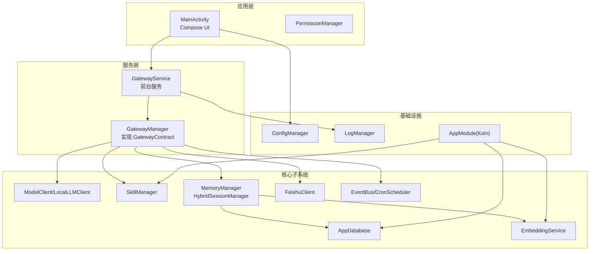
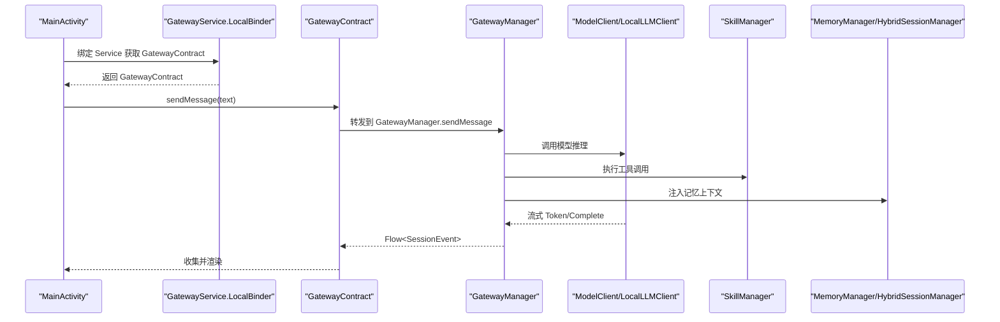
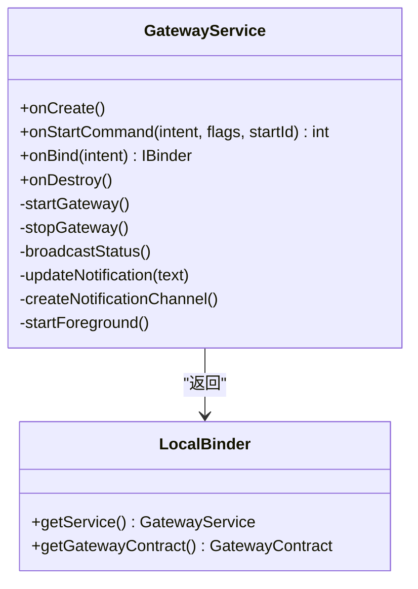
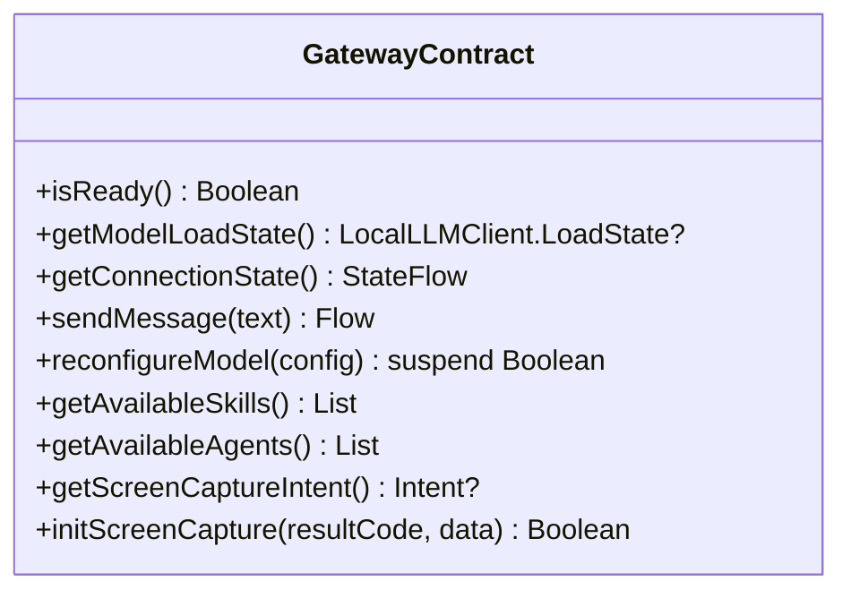
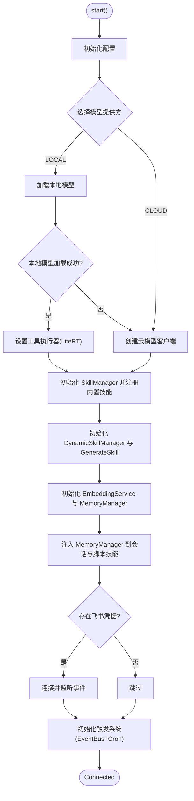
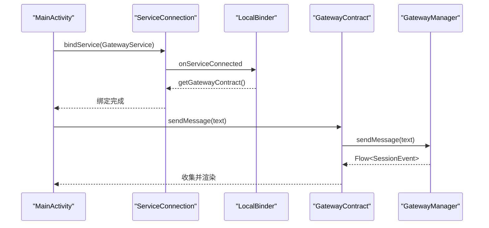
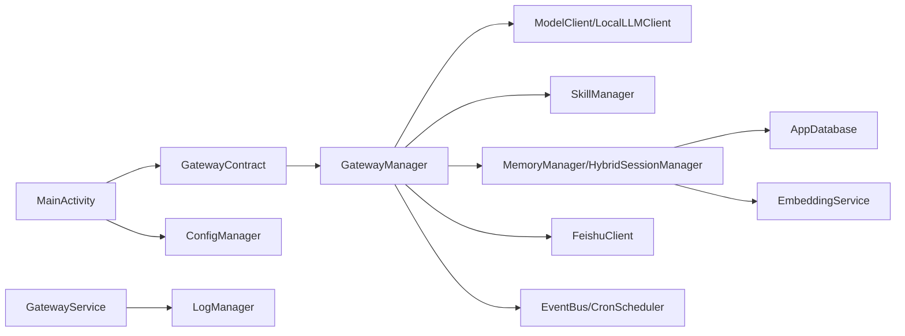

# 架构设计

<cite>
**本文引用的文件**
- [GatewayService.kt](file://app/src/main/java/ai/openclaw/android/GatewayService.kt)
- [GatewayContract.kt](file://app/src/main/java/ai/openclaw/android/GatewayContract.kt)
- [GatewayManager.kt](file://app/src/main/java/ai/openclaw/android/GatewayManager.kt)
- [MainActivity.kt](file://app/src/main/java/ai/openclaw/android/MainActivity.kt)
- [OpenClawApplication.kt](file://app/src/main/java/ai/openclaw/android/OpenClawApplication.kt)
- [AppModule.kt](file://app/src/main/java/ai/openclaw/android/di/AppModule.kt)
- [ConfigManager.kt](file://app/src/main/java/ai/openclaw/android/ConfigManager.kt)
- [LogManager.kt](file://app/src/main/java/ai/openclaw/android/LogManager.kt)
- [README.md](file://README.md)
- [PROJECT.md](file://PROJECT.md)
- [CURRENT-STATUS-2026-04-21.md](file://docs/CURRENT-STATUS-2026-04-21.md)
</cite>

## 目录
1. [简介](#简介)
2. [项目结构](#项目结构)
3. [核心组件](#核心组件)
4. [架构总览](#架构总览)
5. [详细组件分析](#详细组件分析)
6. [依赖关系分析](#依赖关系分析)
7. [性能考量](#性能考量)
8. [故障排查指南](#故障排查指南)
9. [结论](#结论)
10. [附录](#附录)

## 简介
本文件面向架构师与高级开发者，系统化阐述 OpenClaw-Android 的 Gateway Service Pattern v2.0 设计理念与实现细节。该模式以“单一真实来源”为核心，通过 GatewayService 统一持有并管理所有核心组件实例，Activity 仅通过 GatewayContract 接口进行交互，从而实现：
- 单一模型实例：避免重复加载，节省内存与启动时间
- 零重载时间：Activity 销毁/重建不影响模型状态
- 资源共享：UI 与后台消息通道共享同一 AgentSession
- 职责分离：Activity 纯 UI，Service 承担业务中枢

同时，GatewayContract 为 Activity 与 Service 之间提供清晰的 API 边界，为未来迁移到远程/AIDL 服务预留空间。

## 项目结构
- 应用入口与前台服务：GatewayService（前台服务，绑定生命周期）
- 服务中枢：GatewayManager（实现 GatewayContract，编排所有子系统）
- 清洁 API：GatewayContract（Activity 仅依赖接口）
- UI 层：MainActivity（绑定 Service 获取 GatewayContract，驱动 Compose UI）
- 应用上下文：OpenClawApplication（提供权限管理器等全局资源）
- 配置与日志：ConfigManager、LogManager
- 依赖注入：AppModule（Koin 模块，集中管理单例）

图表来源
- [GatewayService.kt:31-120](file://app/src/main/java/ai/openclaw/android/GatewayService.kt#L31-L120)
- [GatewayManager.kt:64-107](file://app/src/main/java/ai/openclaw/android/GatewayManager.kt#L64-L107)
- [MainActivity.kt:107-141](file://app/src/main/java/ai/openclaw/android/MainActivity.kt#L107-L141)
- [AppModule.kt:24-79](file://app/src/main/java/ai/openclaw/android/di/AppModule.kt#L24-L79)

章节来源
- [README.md:7-48](file://README.md#L7-L48)
- [PROJECT.md:105-175](file://PROJECT.md#L105-L175)

## 核心组件
- GatewayService：前台服务，负责生命周期管理、通知、广播状态、Binder 返回 GatewayContract。
- GatewayManager：实现 GatewayContract，编排模型、技能、记忆、会话、触发器、飞书等子系统。
- GatewayContract：Activity 仅依赖的接口，屏蔽内部实现细节，便于未来迁移。
- MainActivity：绑定 Service 获取 GatewayContract，驱动聊天、通知、设置等 UI。
- OpenClawApplication：提供全局 PermissionManager。
- ConfigManager：加密配置存储与服务状态。
- LogManager：集中日志收集与 UI 实时展示。
- AppModule：Koin 依赖注入模块，集中管理单例。

章节来源
- [GatewayService.kt:31-120](file://app/src/main/java/ai/openclaw/android/GatewayService.kt#L31-L120)
- [GatewayContract.kt:14-33](file://app/src/main/java/ai/openclaw/android/GatewayContract.kt#L14-L33)
- [GatewayManager.kt:64-107](file://app/src/main/java/ai/openclaw/android/GatewayManager.kt#L64-L107)
- [MainActivity.kt:107-141](file://app/src/main/java/ai/openclaw/android/MainActivity.kt#L107-L141)
- [OpenClawApplication.kt:7-19](file://app/src/main/java/ai/openclaw/android/OpenClawApplication.kt#L7-L19)
- [ConfigManager.kt:11-52](file://app/src/main/java/ai/openclaw/android/ConfigManager.kt#L11-L52)
- [LogManager.kt:16-54](file://app/src/main/java/ai/openclaw/android/LogManager.kt#L16-L54)
- [AppModule.kt:24-79](file://app/src/main/java/ai/openclaw/android/di/AppModule.kt#L24-L79)

## 架构总览
Gateway Service Pattern v2.0 的核心在于“单一真实来源”。GatewayService 作为唯一逻辑中心，持有并管理所有核心组件实例，Activity 仅通过 GatewayContract 接口与其交互。该设计带来四大优势：
- 单一模型实例：避免重复加载，节省内存与启动时间
- 零重载时间：Activity 销毁/重建不影响模型状态
- 资源共享：UI 与后台消息通道共享同一 AgentSession
- 职责分离：Activity 纯 UI，Service 承担业务中枢

图表来源
- [GatewayService.kt:112-113](file://app/src/main/java/ai/openclaw/android/GatewayService.kt#L112-L113)
- [GatewayContract.kt:14-33](file://app/src/main/java/ai/openclaw/android/GatewayContract.kt#L14-L33)
- [GatewayManager.kt:115-127](file://app/src/main/java/ai/openclaw/android/GatewayManager.kt#L115-L127)
- [MainActivity.kt:378-455](file://app/src/main/java/ai/openclaw/android/MainActivity.kt#L378-L455)

章节来源
- [README.md:7-48](file://README.md#L7-L48)
- [PROJECT.md:518-541](file://PROJECT.md#L518-L541)

## 详细组件分析

### GatewayService：前台服务与 Binder
- 生命周期：onCreate 初始化 ConfigManager、通知通道；onStartCommand 处理启动/停止；onBind 返回 LocalBinder。
- LocalBinder：提供 getService()/getGatewayContract()，Activity 通过绑定获取 GatewayContract。
- 通知与广播：启动前台服务、更新通知、广播服务状态变化。
- 协程作用域：使用 SupervisorJob + Dispatchers.Main 管理生命周期。

图表来源
- [GatewayService.kt:31-120](file://app/src/main/java/ai/openclaw/android/GatewayService.kt#L31-L120)

章节来源
- [GatewayService.kt:75-120](file://app/src/main/java/ai/openclaw/android/GatewayService.kt#L75-L120)

### GatewayContract：清洁 API 边界
- 定义 Activity 与 Service 之间的稳定契约：连接状态、消息流、模型重配、技能/代理信息、屏幕捕获等。
- 为未来迁移到远程/AIDL 服务提供接口抽象，Activity 无需感知底层实现。

图表来源
- [GatewayContract.kt:14-33](file://app/src/main/java/ai/openclaw/android/GatewayContract.kt#L14-L33)

章节来源
- [GatewayContract.kt:9-33](file://app/src/main/java/ai/openclaw/android/GatewayContract.kt#L9-L33)

### GatewayManager：单一真实来源中枢
- 组件编排：模型客户端、AgentSession、SkillManager、MemoryManager、HybridSessionManager、FeishuClient、触发系统等。
- 生命周期：start()/stop()/cleanup()，异常保护与资源回收。
- 模型重配：reconfigureModel() 支持本地/云模型切换，热更新工具执行器与技能注册。
- 内存子系统：根据模型能力选择 LLM 提取器或回退提取器，注入 HybridSessionManager 与 AgentSession。
- 触发系统：EventBus + CronScheduler，规则持久化与调度。

图表来源
- [GatewayManager.kt:325-382](file://app/src/main/java/ai/openclaw/android/GatewayManager.kt#L325-L382)
- [GatewayManager.kt:391-560](file://app/src/main/java/ai/openclaw/android/GatewayManager.kt#L391-L560)
- [GatewayManager.kt:562-612](file://app/src/main/java/ai/openclaw/android/GatewayManager.kt#L562-L612)

章节来源
- [GatewayManager.kt:64-107](file://app/src/main/java/ai/openclaw/android/GatewayManager.kt#L64-L107)
- [GatewayManager.kt:325-382](file://app/src/main/java/ai/openclaw/android/GatewayManager.kt#L325-L382)
- [GatewayManager.kt:391-560](file://app/src/main/java/ai/openclaw/android/GatewayManager.kt#L391-L560)
- [GatewayManager.kt:562-612](file://app/src/main/java/ai/openclaw/android/GatewayManager.kt#L562-L612)

### MainActivity：纯 UI 层与 Binder 交互
- 绑定 Service：ServiceConnection 获取 LocalBinder，进而拿到 GatewayContract。
- UI 驱动：聊天消息通过 GatewayContract.sendMessage 收集 SessionEvent，解析并路由到 UI。
- 屏幕捕获：通过 GatewayContract.getScreenCaptureIntent 与 initScreenCapture 配合 MediaProjection。
- 设置页：调用 reconfigureModel 切换模型提供方与参数。

图表来源
- [MainActivity.kt:107-141](file://app/src/main/java/ai/openclaw/android/MainActivity.kt#L107-L141)
- [MainActivity.kt:378-455](file://app/src/main/java/ai/openclaw/android/MainActivity.kt#L378-L455)

章节来源
- [MainActivity.kt:107-141](file://app/src/main/java/ai/openclaw/android/MainActivity.kt#L107-L141)
- [MainActivity.kt:378-455](file://app/src/main/java/ai/openclaw/android/MainActivity.kt#L378-L455)

### 配置与日志：ConfigManager 与 LogManager
- ConfigManager：加密存储模型 API Key、提供商、模型名、BaseURL、服务启用状态等，并提供 isConfigured() 与 getEffectiveBaseUrl()。
- LogManager：集中日志收集，通过 StateFlow 暴露给 UI 实时展示，支持级别过滤与最大容量限制。

章节来源
- [ConfigManager.kt:11-52](file://app/src/main/java/ai/openclaw/android/ConfigManager.kt#L11-L52)
- [ConfigManager.kt:129-149](file://app/src/main/java/ai/openclaw/android/ConfigManager.kt#L129-L149)
- [LogManager.kt:16-54](file://app/src/main/java/ai/openclaw/android/LogManager.kt#L16-L54)

### 依赖注入：AppModule
- 集中管理单例：SecurityKeyManager、AppDatabase、SkillManager、PermissionManager、EmbeddingService、BM25Index、HybridSearchEngine、LogManager、ColdStartManager。
- 为 ViewModel 提供依赖注入入口。

章节来源
- [AppModule.kt:24-79](file://app/src/main/java/ai/openclaw/android/di/AppModule.kt#L24-L79)

## 依赖关系分析
- Activity 仅依赖 GatewayContract，不直接访问 GatewayManager 内部组件，降低耦合。
- GatewayService 通过 LocalBinder 暴露 GatewayContract，实现 IPC 边界。
- GatewayManager 内部聚合多个子系统，对外只暴露 GatewayContract。
- ConfigManager 与 LogManager 作为横切关注点被各层共享。

图表来源
- [GatewayService.kt:112-113](file://app/src/main/java/ai/openclaw/android/GatewayService.kt#L112-L113)
- [GatewayContract.kt:14-33](file://app/src/main/java/ai/openclaw/android/GatewayContract.kt#L14-L33)
- [GatewayManager.kt:64-107](file://app/src/main/java/ai/openclaw/android/GatewayManager.kt#L64-L107)
- [MainActivity.kt:107-141](file://app/src/main/java/ai/openclaw/android/MainActivity.kt#L107-L141)

章节来源
- [GatewayService.kt:112-113](file://app/src/main/java/ai/openclaw/android/GatewayService.kt#L112-L113)
- [GatewayContract.kt:14-33](file://app/src/main/java/ai/openclaw/android/GatewayContract.kt#L14-L33)
- [GatewayManager.kt:64-107](file://app/src/main/java/ai/openclaw/android/GatewayManager.kt#L64-L107)
- [MainActivity.kt:107-141](file://app/src/main/java/ai/openclaw/android/MainActivity.kt#L107-L141)

## 性能考量
- 单一模型实例：避免重复加载，显著减少内存占用与启动时间。
- 零重载时间：Activity 销毁/重建不影响模型状态，提升用户体验。
- 资源共享：UI 与后台消息通道共享同一 AgentSession，减少上下文切换成本。
- 职责分离：Activity 纯 UI，Service 承担业务中枢，降低主线程压力。
- 日志与监控：LogManager 提供集中日志，便于性能分析与问题定位。

[本节为通用性能讨论，无需特定文件引用]

## 故障排查指南
- 服务未就绪：检查 ConfigManager.isConfigured() 与 GatewayManager.getConnectionState()，确认模型与凭据配置。
- 模型加载失败：查看 LocalLLMClient 初始化与 fallback 逻辑，确认模型文件与硬件加速可用性。
- 屏幕捕获失败：确认 MediaProjection 权限与初始化流程，检查 AccessibilityService 是否运行。
- 日志定位：通过 LogManager.logs 实时查看服务日志，结合 Logcat 过滤关键字。

章节来源
- [GatewayManager.kt:325-382](file://app/src/main/java/ai/openclaw/android/GatewayManager.kt#L325-L382)
- [GatewayManager.kt:614-623](file://app/src/main/java/ai/openclaw/android/GatewayManager.kt#L614-L623)
- [LogManager.kt:16-54](file://app/src/main/java/ai/openclaw/android/LogManager.kt#L16-L54)

## 结论
Gateway Service Pattern v2.0 通过“单一真实来源”实现了模型、技能、记忆、会话等核心能力的统一管理，配合 GatewayContract 的清洁 API 边界，有效提升了系统的稳定性、可维护性与可扩展性。该模式为后续迁移到远程/AIDL 服务奠定了坚实基础，同时为多轮反思、触发系统、脚本引擎等高级能力提供了统一的运行时环境。

[本节为总结性内容，无需特定文件引用]

## 附录

### 未来迁移到远程/AIDL 服务的可能性
- GatewayContract 作为稳定接口，屏蔽实现细节，为跨进程迁移提供可能。
- 当前 Binder 方式已满足本地进程内通信需求；若迁移到 AIDL，仅需替换绑定方式与进程边界，Activity 代码无需改动。
- 建议在 GatewayContract 中明确序列化/不可变数据结构，确保跨进程安全。

章节来源
- [GatewayContract.kt:14-33](file://app/src/main/java/ai/openclaw/android/GatewayContract.kt#L14-L33)
- [README.md:7-48](file://README.md#L7-L48)

### 多轮反思集成对架构的影响
- 反思策略通过 AgentSessionManager 注入到 AgentSession，UI 通过 SessionEvent.ReflectionStart/Complete 呈现状态。
- 架构上无需改动，仅在会话层增加反思逻辑，保持单一真实来源不变。

章节来源
- [CURRENT-STATUS-2026-04-21.md:5-26](file://docs/CURRENT-STATUS-2026-04-21.md#L5-L26)