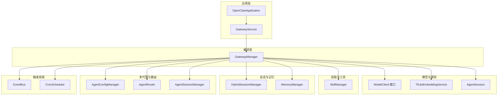
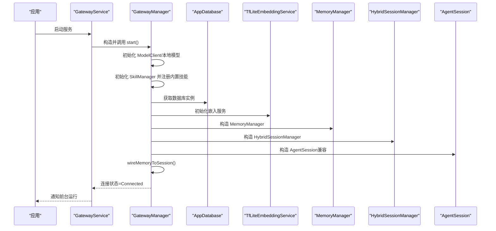
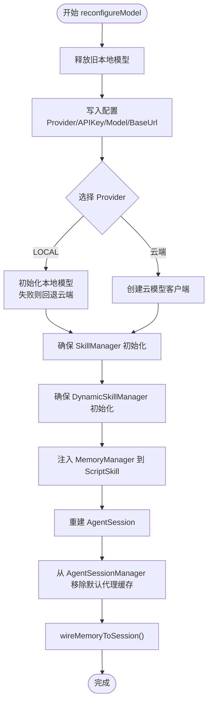
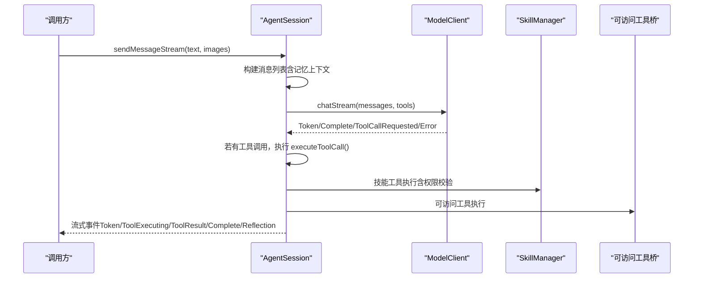
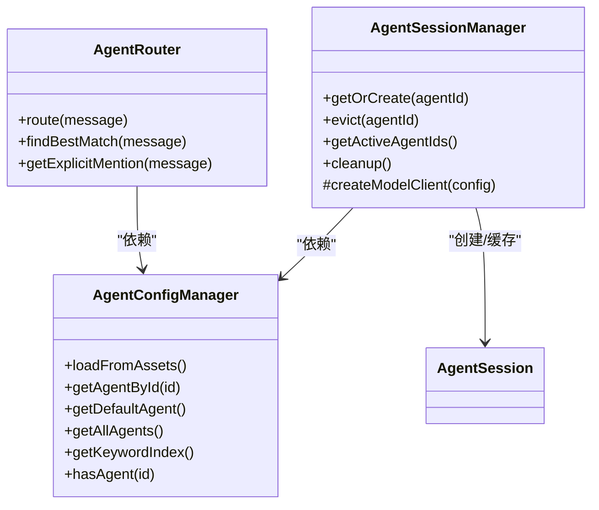
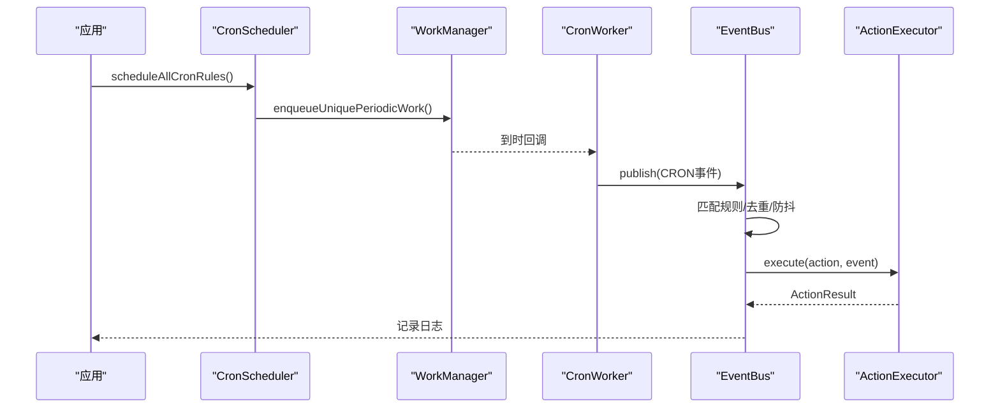
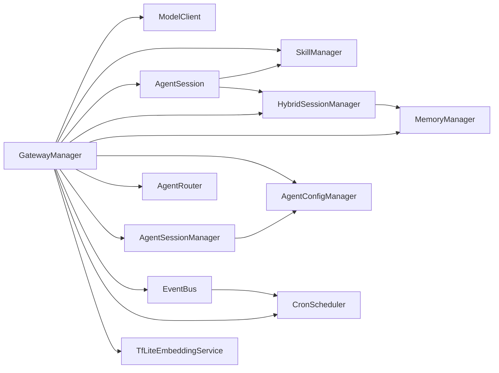

# 组件管理架构

<cite>
**本文引用的文件**
- [GatewayManager.kt](file://app/src/main/java/ai/openclaw/android/GatewayManager.kt)
- [AppModule.kt](file://app/src/main/java/ai/openclaw/android/di/AppModule.kt)
- [AgentSession.kt](file://app/src/main/java/ai/openclaw/android/agent/AgentSession.kt)
- [MemoryManager.kt](file://app/src/main/java/ai/openclaw/android/domain/memory/MemoryManager.kt)
- [ModelClient.kt](file://app/src/main/java/ai/openclaw/android/model/ModelClient.kt)
- [SkillManager.kt](file://app/src/main/java/ai/openclaw/android/skill/SkillManager.kt)
- [HybridSessionManager.kt](file://app/src/main/java/ai/openclaw/android/domain/session/HybridSessionManager.kt)
- [AgentSessionManager.kt](file://app/src/main/java/ai/openclaw/android/domain/agent/AgentSessionManager.kt)
- [AgentRouter.kt](file://app/src/main/java/ai/openclaw/android/domain/agent/AgentRouter.kt)
- [AgentConfigManager.kt](file://app/src/main/java/ai/openclaw/android/domain/agent/AgentConfigManager.kt)
- [EventBus.kt](file://app/src/main/java/ai/openclaw/android/trigger/EventBus.kt)
- [CronScheduler.kt](file://app/src/main/java/ai/openclaw/android/trigger/scheduler/CronScheduler.kt)
- [TfLiteEmbeddingService.kt](file://app/src/main/java/ai/openclaw/android/ml/TfLiteEmbeddingService.kt)
- [OpenClawApplication.kt](file://app/src/main/java/ai/openclaw/android/OpenClawApplication.kt)
- [GatewayService.kt](file://app/src/main/java/ai/openclaw/android/GatewayService.kt)
</cite>

## 目录
1. [简介](#简介)
2. [项目结构](#项目结构)
3. [核心组件](#核心组件)
4. [架构总览](#架构总览)
5. [详细组件分析](#详细组件分析)
6. [依赖分析](#依赖分析)
7. [性能考虑](#性能考虑)
8. [故障排查指南](#故障排查指南)
9. [结论](#结论)
10. [附录](#附录)

## 简介
本文件面向OpenClaw-Android的组件管理架构，聚焦GatewayManager如何统一编排与管理核心子系统，包括AgentSession、SkillManager、MemoryManager、ModelClient、Trigger子系统、多代理路由与会话管理等。文档同时解析依赖注入模式在AppModule中的应用、组件间通信机制（状态同步、事件传递、数据共享）、懒加载与延迟初始化策略、内存与资源清理、监控与健康检查、故障隔离设计，并提供扩展与定制的最佳实践。

## 项目结构
- 应用入口与生命周期
  - GatewayService作为前台服务承载生命周期与通知，内部持有GatewayManager并订阅其连接状态流。
  - OpenClawApplication负责全局单例（如权限管理器）的初始化。
- 组件编排中心
  - GatewayManager集中初始化与编排所有子系统，提供对外API（发送消息、模型重配、技能枚举、屏幕捕获等），并维护统一的连接状态。
- 子系统分层
  - 模型层：ModelClient接口及其实现（本地/云端），配合TfLiteEmbeddingService进行嵌入。
  - 技能层：SkillManager统一注册与执行内置/动态技能，支持权限校验与工具暴露。
  - 会话与记忆：AgentSession负责对话与工具调用；HybridSessionManager负责会话持久化、压缩与记忆注入；MemoryManager负责向量化与检索。
  - 多代理与路由：AgentConfigManager加载配置，AgentRouter基于@提及与关键词路由，AgentSessionManager按需创建与LRU缓存。
  - 触发系统：EventBus事件总线+CronScheduler定时调度，支持规则匹配、防抖与去重。

图表来源
- [GatewayService.kt:31-234](file://app/src/main/java/ai/openclaw/android/GatewayService.kt#L31-L234)
- [GatewayManager.kt:65-677](file://app/src/main/java/ai/openclaw/android/GatewayManager.kt#L65-L677)
- [AgentSession.kt:35-819](file://app/src/main/java/ai/openclaw/android/agent/AgentSession.kt#L35-L819)
- [SkillManager.kt:8-193](file://app/src/main/java/ai/openclaw/android/skill/SkillManager.kt#L8-L193)
- [HybridSessionManager.kt:31-457](file://app/src/main/java/ai/openclaw/android/domain/session/HybridSessionManager.kt#L31-L457)
- [MemoryManager.kt:10-116](file://app/src/main/java/ai/openclaw/android/domain/memory/MemoryManager.kt#L10-L116)
- [AgentConfigManager.kt:12-88](file://app/src/main/java/ai/openclaw/android/domain/agent/AgentConfigManager.kt#L12-L88)
- [AgentRouter.kt:12-100](file://app/src/main/java/ai/openclaw/android/domain/agent/AgentRouter.kt#L12-L100)
- [AgentSessionManager.kt:32-196](file://app/src/main/java/ai/openclaw/android/domain/agent/AgentSessionManager.kt#L32-L196)
- [EventBus.kt:27-239](file://app/src/main/java/ai/openclaw/android/trigger/EventBus.kt#L27-L239)
- [CronScheduler.kt:18-193](file://app/src/main/java/ai/openclaw/android/trigger/scheduler/CronScheduler.kt#L18-L193)
- [TfLiteEmbeddingService.kt:13-97](file://app/src/main/java/ai/openclaw/android/ml/TfLiteEmbeddingService.kt#L13-L97)

章节来源
- [GatewayService.kt:31-234](file://app/src/main/java/ai/openclaw/android/GatewayService.kt#L31-L234)
- [GatewayManager.kt:65-677](file://app/src/main/java/ai/openclaw/android/GatewayManager.kt#L65-L677)

## 核心组件
- GatewayManager：组件编排与生命周期控制中心，负责初始化、重配、清理与状态上报。
- AgentSession：对话与工具调用执行器，支持流式输出、反射优化与历史裁剪。
- SkillManager：技能注册与执行，统一暴露工具签名，执行前进行权限校验。
- MemoryManager：记忆持久化、向量化与检索，支持降级嵌入与清理策略。
- HybridSessionManager：会话持久化、压缩与记忆注入，提供摘要缓存与跨会话记忆抽取。
- AgentSessionManager：多代理会话的懒创建、LRU缓存与共享本地模型复用。
- AgentRouter：@提及与关键词路由，回退至默认代理。
- EventBus + CronScheduler：事件总线与基于WorkManager的定时调度，支持规则匹配、防抖与去重。
- TfLiteEmbeddingService：本地嵌入模型服务，提供维度、就绪态与批量嵌入能力。
- GatewayService：前台服务承载，广播状态，驱动GatewayManager生命周期。
- OpenClawApplication：全局单例初始化。

章节来源
- [GatewayManager.kt:65-677](file://app/src/main/java/ai/openclaw/android/GatewayManager.kt#L65-L677)
- [AgentSession.kt:35-819](file://app/src/main/java/ai/openclaw/android/agent/AgentSession.kt#L35-L819)
- [SkillManager.kt:8-193](file://app/src/main/java/ai/openclaw/android/skill/SkillManager.kt#L8-L193)
- [MemoryManager.kt:10-116](file://app/src/main/java/ai/openclaw/android/domain/memory/MemoryManager.kt#L10-L116)
- [HybridSessionManager.kt:31-457](file://app/src/main/java/ai/openclaw/android/domain/session/HybridSessionManager.kt#L31-L457)
- [AgentSessionManager.kt:32-196](file://app/src/main/java/ai/openclaw/android/domain/agent/AgentSessionManager.kt#L32-L196)
- [AgentRouter.kt:12-100](file://app/src/main/java/ai/openclaw/android/domain/agent/AgentRouter.kt#L12-L100)
- [EventBus.kt:27-239](file://app/src/main/java/ai/openclaw/android/trigger/EventBus.kt#L27-L239)
- [CronScheduler.kt:18-193](file://app/src/main/java/ai/openclaw/android/trigger/scheduler/CronScheduler.kt#L18-L193)
- [TfLiteEmbeddingService.kt:13-97](file://app/src/main/java/ai/openclaw/android/ml/TfLiteEmbeddingService.kt#L13-L97)
- [GatewayService.kt:31-234](file://app/src/main/java/ai/openclaw/android/GatewayService.kt#L31-L234)
- [OpenClawApplication.kt:7-19](file://app/src/main/java/ai/openclaw/android/OpenClawApplication.kt#L7-L19)

## 架构总览
GatewayManager作为“门面”，在start()中串行初始化各子系统，随后在reconfigureModel()中可热重配模型与技能，同时确保会话与记忆子系统正确注入。GatewayService负责前台运行与状态广播，贯穿整个生命周期。

图表来源
- [GatewayService.kt:170-211](file://app/src/main/java/ai/openclaw/android/GatewayService.kt#L170-L211)
- [GatewayManager.kt:326-561](file://app/src/main/java/ai/openclaw/android/GatewayManager.kt#L326-L561)

章节来源
- [GatewayService.kt:170-211](file://app/src/main/java/ai/openclaw/android/GatewayService.kt#L170-L211)
- [GatewayManager.kt:326-561](file://app/src/main/java/ai/openclaw/android/GatewayManager.kt#L326-L561)

## 详细组件分析

### GatewayManager：组件编排与生命周期
- 生命周期
  - start()：异步初始化，设置连接状态流，捕获异常并进入错误态。
  - stop()/cleanup()：释放本地模型、技能清理、会话与触发系统清理、状态归零。
- 模型重配
  - reconfigureModel()：释放旧模型、更新配置、创建新模型（本地优先，失败回退云端）、重建AgentSession并注入内存上下文。
- 会话与多代理
  - sendMessage()：优先走多代理路由与会话管理器；回退到单AgentSession。
  - sendMessageToAgent()/listAgents()：直接路由到指定代理或列出代理。
- 屏幕捕获
  - 提供Intent与初始化流程，依赖无障碍服务。
- 内存与会话注入
  - wireMemoryToSession()：根据本地模型可用性选择记忆提取器，构建MemoryManager与HybridSessionManager，注入AgentSession与多代理默认会话。

图表来源
- [GatewayManager.kt:143-274](file://app/src/main/java/ai/openclaw/android/GatewayManager.kt#L143-L274)
- [GatewayManager.kt:563-613](file://app/src/main/java/ai/openclaw/android/GatewayManager.kt#L563-L613)

章节来源
- [GatewayManager.kt:65-677](file://app/src/main/java/ai/openclaw/android/GatewayManager.kt#L65-L677)

### AgentSession：对话与工具执行
- 工具体系
  - setToolsWithSkills()：合并可访问工具与技能工具，支持前缀过滤；refreshTools()在动态技能变更后刷新。
  - executeToolCall()：区分技能工具与可访问工具，执行前进行权限校验与请求。
- 流式与非流式交互
  - handleMessageStream()：实时发射Token、工具执行事件与最终Complete；支持反思（Reflection）阶段的A2UI保护与超时控制。
  - handleMessage()：同步模式，循环工具调用直至结束或达到最大轮次。
- 记忆与会话
  - setMemoryContextProvider()/setSessionManager()：注入HybridSessionManager以提供记忆上下文与消息持久化。
- 历史与令牌
  - buildMessages()：拼装系统提示、设备能力、记忆上下文与历史；trimHistoryByTokens()按估算令牌数裁剪。

图表来源
- [AgentSession.kt:451-556](file://app/src/main/java/ai/openclaw/android/agent/AgentSession.kt#L451-L556)
- [AgentSession.kt:582-639](file://app/src/main/java/ai/openclaw/android/agent/AgentSession.kt#L582-L639)

章节来源
- [AgentSession.kt:35-819](file://app/src/main/java/ai/openclaw/android/agent/AgentSession.kt#L35-L819)

### SkillManager：技能注册与执行
- 注册与发现
  - loadBuiltinSkills()：注册天气、日历、位置、联系人、短信、通知、脚本、设置、文件、应用启动器等内置技能。
  - getAllTools()：将技能ID与工具名组合为“技能ID_工具名”的规范工具名，便于AgentSession统一调度。
- 权限与执行
  - checkSkillPermissions()：基于Android权限清单判断与请求。
  - executeTool()：解析工具全名，定位技能与工具，执行并返回结果。
- 动态技能集成
  - 由GatewayManager在初始化时注入GenerateSkillSkill与GenerateSkillTool，使AgentSession具备动态生成新技能的能力。

章节来源
- [SkillManager.kt:8-193](file://app/src/main/java/ai/openclaw/android/skill/SkillManager.kt#L8-L193)
- [GatewayManager.kt:446-474](file://app/src/main/java/ai/openclaw/android/GatewayManager.kt#L446-L474)

### MemoryManager：记忆持久化与检索
- 存储
  - store()：若嵌入服务可用则生成向量，否则生成伪向量；分别持久化记忆与向量。
- 检索
  - search()：查询向量与所有向量计算余弦相似度，按阈值与限制返回排序结果。
- 提取与清理
  - extractAndStore()/addManual()：从对话或用户输入提取并存储记忆。
  - cleanup()：按时间与访问频次清理陈旧记忆。

章节来源
- [MemoryManager.kt:10-116](file://app/src/main/java/ai/openclaw/android/domain/memory/MemoryManager.kt#L10-L116)

### HybridSessionManager：会话持久化与压缩
- 初始化与切换
  - initialize()：恢复最新会话或创建新会话；switchToSession()支持切换。
- 消息持久化与压缩
  - addMessage()：记录消息、更新会话统计、触发压缩；compressIfNeeded()/performCompression()：基于令牌阈值与配置进行摘要压缩。
- 记忆注入
  - getMemoryContext()：提供重要记忆文本供AgentSession注入；handleMemoryTriggers()：检测手动标记与延迟自动提取。
- 跨会话记忆抽取
  - extractMemoriesFromSummary()：从摘要中识别偏好、决策、任务等类型并存入记忆系统。

章节来源
- [HybridSessionManager.kt:31-457](file://app/src/main/java/ai/openclaw/android/domain/session/HybridSessionManager.kt#L31-L457)

### 多代理路由与会话管理
- AgentConfigManager：从assets加载agents.json，构建关键词索引，提供默认代理与查询。
- AgentRouter：@提及优先、关键词匹配、默认代理回退。
- AgentSessionManager：按agentId懒创建AgentSession，支持共享本地模型复用与LRU缓存；getOrCreate()返回缓存或新建实例；evict()/cleanup()管理缓存。

图表来源
- [AgentConfigManager.kt:12-88](file://app/src/main/java/ai/openclaw/android/domain/agent/AgentConfigManager.kt#L12-L88)
- [AgentRouter.kt:12-100](file://app/src/main/java/ai/openclaw/android/domain/agent/AgentRouter.kt#L12-L100)
- [AgentSessionManager.kt:32-196](file://app/src/main/java/ai/openclaw/android/domain/agent/AgentSessionManager.kt#L32-L196)

章节来源
- [AgentConfigManager.kt:12-88](file://app/src/main/java/ai/openclaw/android/domain/agent/AgentConfigManager.kt#L12-L88)
- [AgentRouter.kt:12-100](file://app/src/main/java/ai/openclaw/android/domain/agent/AgentRouter.kt#L12-L100)
- [AgentSessionManager.kt:32-196](file://app/src/main/java/ai/openclaw/android/domain/agent/AgentSessionManager.kt#L32-L196)

### 触发系统：EventBus与CronScheduler
- EventBus
  - 单例初始化，发布事件后匹配规则、去重（LRU+TTL）、防抖（冷却时间），执行ActionExecutor并记录日志。
- CronScheduler
  - 基于WorkManager的周期任务，将CRON规则转换为PeriodicWorkRequest；CronWorker触发EventBus发布CRON事件。

图表来源
- [CronScheduler.kt:77-92](file://app/src/main/java/ai/openclaw/android/trigger/scheduler/CronScheduler.kt#L77-L92)
- [CronScheduler.kt:169-192](file://app/src/main/java/ai/openclaw/android/trigger/scheduler/CronScheduler.kt#L169-L192)
- [EventBus.kt:82-104](file://app/src/main/java/ai/openclaw/android/trigger/EventBus.kt#L82-L104)
- [EventBus.kt:167-201](file://app/src/main/java/ai/openclaw/android/trigger/EventBus.kt#L167-L201)

章节来源
- [EventBus.kt:27-239](file://app/src/main/java/ai/openclaw/android/trigger/EventBus.kt#L27-L239)
- [CronScheduler.kt:18-193](file://app/src/main/java/ai/openclaw/android/trigger/scheduler/CronScheduler.kt#L18-L193)

### 依赖注入模式与AppModule
- AppModule采用Koin DSL定义单例与ViewModel绑定：
  - 安全密钥管理器、数据库、权限管理器、嵌入服务（懒加载）、BM25索引、混合搜索引擎、日志管理器、冷启动管理器。
  - ViewModel层注入技能管理器、权限管理器、数据库、嵌入服务与混合搜索引擎。
- 依赖注入优势
  - 统一生命周期管理、解耦组件构造、便于测试替换与作用域隔离。
- 与GatewayManager的关系
  - GatewayManager在应用层负责关键子系统的初始化与编排；AppModule在框架层提供通用依赖；两者互补，前者面向业务编排，后者面向基础设施。

章节来源
- [AppModule.kt:24-79](file://app/src/main/java/ai/openclaw/android/di/AppModule.kt#L24-L79)

### 组件间通信机制
- 状态同步
  - GatewayService订阅GatewayManager.getConnectionState()，通过通知与广播同步运行状态。
- 事件传递
  - AgentSession通过流式事件（Token/ToolExecuting/ToolResult/Complete/Reflection）向外传递中间态。
  - EventBus提供规则驱动的事件分发与动作执行。
- 数据共享
  - MemoryManager与HybridSessionManager通过DAO与嵌入服务共享数据；AgentSession通过setter注入会话管理器与记忆上下文提供者。

章节来源
- [GatewayService.kt:184-208](file://app/src/main/java/ai/openclaw/android/GatewayService.kt#L184-L208)
- [AgentSession.kt:451-556](file://app/src/main/java/ai/openclaw/android/agent/AgentSession.kt#L451-L556)
- [EventBus.kt:82-104](file://app/src/main/java/ai/openclaw/android/trigger/EventBus.kt#L82-L104)

### 懒加载与延迟初始化
- 模型与嵌入
  - TfLiteEmbeddingService.initialize()在首次使用时加载模型与词表；GatewayManager在wireMemoryToSession()中按需初始化。
- 技能与动态技能
  - SkillManager在GatewayManager初始化时创建并注册内置技能；DynamicSkillManager在首次需要时创建并加载已保存技能。
- 多代理会话
  - AgentSessionManager.getOrCreate()按需创建，LRU缓存避免无限增长。

章节来源
- [TfLiteEmbeddingService.kt:27-48](file://app/src/main/java/ai/openclaw/android/ml/TfLiteEmbeddingService.kt#L27-L48)
- [GatewayManager.kt:563-613](file://app/src/main/java/ai/openclaw/android/GatewayManager.kt#L563-L613)
- [AgentSessionManager.kt:72-113](file://app/src/main/java/ai/openclaw/android/domain/agent/AgentSessionManager.kt#L72-L113)

### 内存管理与资源清理
- 本地模型
  - GatewayManager.stop()显式释放LocalLLMClient；TfLiteEmbeddingService.release()关闭Interpreter与释放资源。
- 技能与会话
  - stop()遍历技能调用cleanup()；AgentSessionManager.cleanup()清空缓存；EventBus.cleanupCooldowns()/cleanupLogs()清理状态与日志。
- 会话与记忆
  - HybridSessionManager.endCurrentSession()取消提取任务；MemoryManager.cleanup()清理陈旧记忆。

章节来源
- [GatewayManager.kt:347-383](file://app/src/main/java/ai/openclaw/android/GatewayManager.kt#L347-L383)
- [TfLiteEmbeddingService.kt:91-97](file://app/src/main/java/ai/openclaw/android/ml/TfLiteEmbeddingService.kt#L91-L97)
- [AgentSessionManager.kt:132-136](file://app/src/main/java/ai/openclaw/android/domain/agent/AgentSessionManager.kt#L132-L136)
- [EventBus.kt:222-237](file://app/src/main/java/ai/openclaw/android/trigger/EventBus.kt#L222-L237)
- [HybridSessionManager.kt:452-456](file://app/src/main/java/ai/openclaw/android/domain/session/HybridSessionManager.kt#L452-L456)
- [MemoryManager.kt:87-95](file://app/src/main/java/ai/openclaw/android/domain/memory/MemoryManager.kt#L87-L95)

### 监控、健康检查与故障隔离
- 监控与日志
  - GatewayService广播状态；LogManager集中日志；各组件记录关键事件（路由、反射、规则执行、压缩、清理）。
- 健康检查
  - ModelClient/LocalLLMClient提供isReady/isModelLoaded；TfLiteEmbeddingService.isReady；GatewayManager.getConnectionState()。
- 故障隔离
  - SupervisorJob隔离协程异常；工具执行加互斥锁；反射阶段保护A2UI格式与空内容；规则执行失败可重试（WorkManager指数退避）。

章节来源
- [GatewayService.kt:184-208](file://app/src/main/java/ai/openclaw/android/GatewayService.kt#L184-L208)
- [GatewayManager.kt:100-108](file://app/src/main/java/ai/openclaw/android/GatewayManager.kt#L100-L108)
- [AgentSession.kt:725-789](file://app/src/main/java/ai/openclaw/android/agent/AgentSession.kt#L725-L789)
- [CronScheduler.kt:184-190](file://app/src/main/java/ai/openclaw/android/trigger/scheduler/CronScheduler.kt#L184-L190)

### 扩展与定制最佳实践
- 新增技能
  - 在SkillManager注册新技能；AgentSession将自动通过setToolsWithSkills暴露工具；如需权限，请在getRequiredPermissionsForSkill声明。
- 新增代理
  - 在agents.json中添加配置；AgentConfigManager会构建关键词索引；AgentRouter自动参与路由；AgentSessionManager按需创建会话。
- 自定义模型
  - 通过ModelClient接口实现新Provider；在GatewayManager.reconfigureModel()中接入；必要时在AgentSessionManager中共享本地模型实例。
- 触发规则
  - 在数据库中配置TriggerRule；CronScheduler自动调度；EventBus匹配过滤器并执行ActionExecutor。
- 性能优化
  - 启用HybridSessionManager压缩；合理设置最大上下文令牌；使用LRU缓存多代理会话；延迟初始化嵌入服务。

章节来源
- [SkillManager.kt:119-138](file://app/src/main/java/ai/openclaw/android/skill/SkillManager.kt#L119-L138)
- [AgentConfigManager.kt:25-36](file://app/src/main/java/ai/openclaw/android/domain/agent/AgentConfigManager.kt#L25-L36)
- [AgentSessionManager.kt:142-175](file://app/src/main/java/ai/openclaw/android/domain/agent/AgentSessionManager.kt#L142-L175)
- [CronScheduler.kt:32-64](file://app/src/main/java/ai/openclaw/android/trigger/scheduler/CronScheduler.kt#L32-L64)
- [HybridSessionManager.kt:236-299](file://app/src/main/java/ai/openclaw/android/domain/session/HybridSessionManager.kt#L236-L299)

## 依赖分析
- 组件耦合
  - GatewayManager高扇出：依赖模型、技能、会话、记忆、触发、多代理与嵌入服务。
  - AgentSession对SkillManager与ModelClient强依赖；对HybridSessionManager与MemoryManager弱依赖（通过setter注入）。
  - AgentSessionManager对AgentConfigManager与AgentSession弱耦合，通过工厂方法创建。
  - EventBus与CronScheduler通过DAO与ActionExecutor解耦。
- 依赖链
  - GatewayManager → ModelClient/LocalLLMClient → SkillManager → ActionExecutor → 技能实现。
  - GatewayManager → MemoryManager → HybridSessionManager → AgentSession。
  - GatewayManager → AgentConfigManager → AgentRouter → AgentSessionManager → AgentSession。
- 外部依赖
  - WorkManager（CronScheduler）、OkHttp（FeishuClient）、Room（DAO）、TensorFlow Lite（TfLiteEmbeddingService）。

图表来源
- [GatewayManager.kt:65-677](file://app/src/main/java/ai/openclaw/android/GatewayManager.kt#L65-L677)
- [AgentSession.kt:35-819](file://app/src/main/java/ai/openclaw/android/agent/AgentSession.kt#L35-L819)
- [AgentSessionManager.kt:32-196](file://app/src/main/java/ai/openclaw/android/domain/agent/AgentSessionManager.kt#L32-L196)
- [EventBus.kt:27-239](file://app/src/main/java/ai/openclaw/android/trigger/EventBus.kt#L27-L239)
- [CronScheduler.kt:18-193](file://app/src/main/java/ai/openclaw/android/trigger/scheduler/CronScheduler.kt#L18-L193)

章节来源
- [GatewayManager.kt:65-677](file://app/src/main/java/ai/openclaw/android/GatewayManager.kt#L65-L677)

## 性能考虑
- 令牌估算与历史裁剪：AgentSession按字符集估算令牌并裁剪历史，避免上下文溢出。
- 会话压缩：HybridSessionManager在阈值触发时生成摘要并删除旧消息，降低后续调用成本。
- 嵌入延迟：TfLiteEmbeddingService懒初始化，避免冷启动开销；降级路径在不可用时仍可工作。
- 协程隔离：SupervisorJob隔离异常，避免单点崩溃影响整体；IO调度器分离耗时操作。
- 缓存策略：摘要LRU缓存、会话LRU缓存、规则冷却与事件去重，减少重复计算与网络调用。

## 故障排查指南
- 启动失败
  - 检查ConfigManager配置；查看GatewayManager连接状态与错误信息；确认模型初始化（本地/云端）。
- 技能执行失败
  - 检查权限是否授予；查看SkillManager的checkSkillPermissions返回；确认工具名前缀与技能ID匹配。
- 记忆检索异常
  - 检查TfLiteEmbeddingService是否就绪；确认MemoryManager向量维度与cosine相似度阈值；清理陈旧记忆。
- 触发规则无效
  - 检查EventBus匹配过滤器与去重键；确认Cron表达式与WorkManager约束；查看日志记录。
- 会话压缩异常
  - 检查LLM可用性与摘要生成；确认消息DAO与摘要DAO一致性；关注跨会话记忆抽取日志。

章节来源
- [GatewayManager.kt:340-344](file://app/src/main/java/ai/openclaw/android/GatewayManager.kt#L340-L344)
- [SkillManager.kt:89-107](file://app/src/main/java/ai/openclaw/android/skill/SkillManager.kt#L89-L107)
- [TfLiteEmbeddingService.kt:75-77](file://app/src/main/java/ai/openclaw/android/ml/TfLiteEmbeddingService.kt#L75-L77)
- [EventBus.kt:167-201](file://app/src/main/java/ai/openclaw/android/trigger/EventBus.kt#L167-L201)
- [HybridSessionManager.kt:345-398](file://app/src/main/java/ai/openclaw/android/domain/session/HybridSessionManager.kt#L345-L398)

## 结论
GatewayManager通过清晰的生命周期管理、可插拔的模型与技能体系、完善的会话与记忆子系统、以及事件驱动的触发机制，构建了稳定、可扩展且易于维护的组件管理架构。结合AppModule的依赖注入与Koin的作用域管理，开发者可以快速扩展新功能、接入新代理与新技能，并在保证性能与可靠性的同时实现灵活的定制化。

## 附录
- 关键接口与类概览
  - ModelClient：统一模型调用接口，支持流式与非流式。
  - TfLiteEmbeddingService：本地嵌入服务，提供维度与就绪态。
  - SkillManager：技能注册与执行，权限校验与工具暴露。
  - AgentSession：对话与工具执行，流式事件与反思优化。
  - MemoryManager：记忆持久化与检索，降级与清理。
  - HybridSessionManager：会话持久化、压缩与记忆注入。
  - AgentConfigManager/AgentRouter/AgentSessionManager：多代理路由与会话管理。
  - EventBus/CronScheduler：事件总线与定时调度。
  - GatewayService/GatewayManager：前台服务与组件编排。