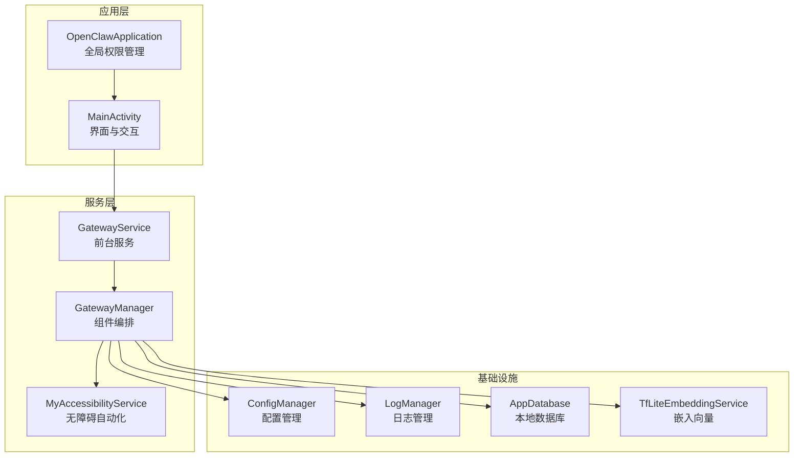
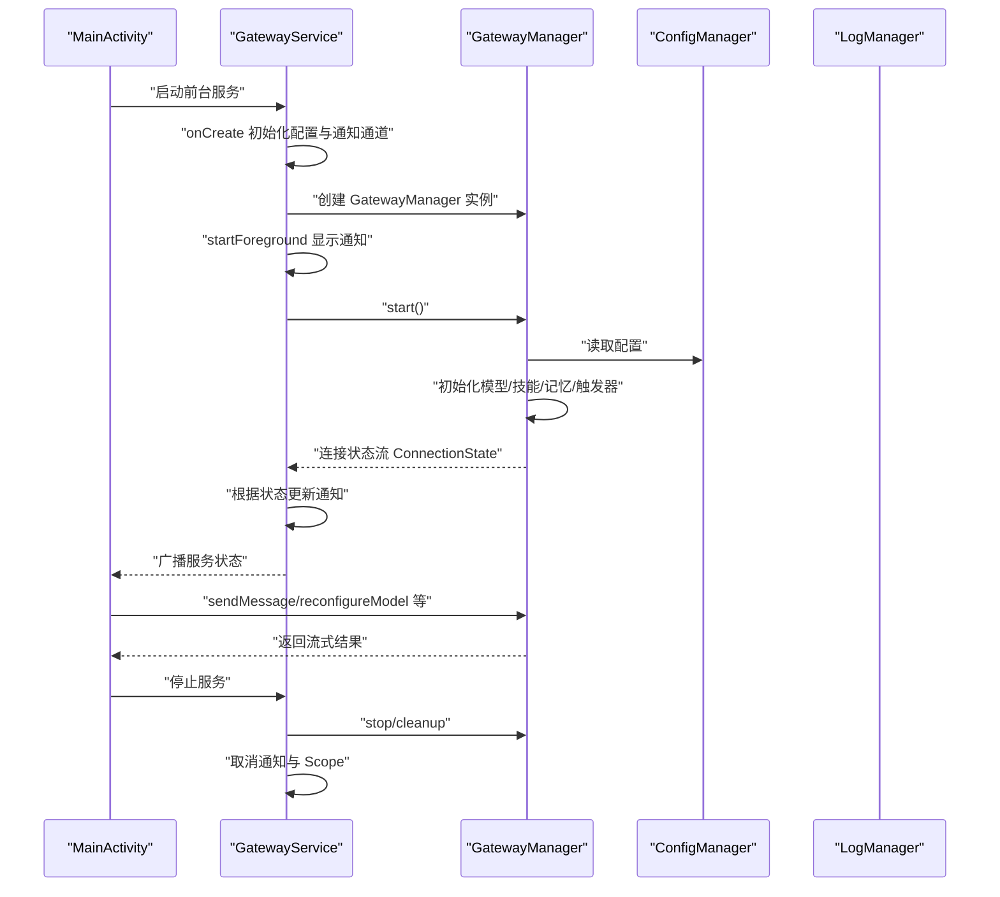
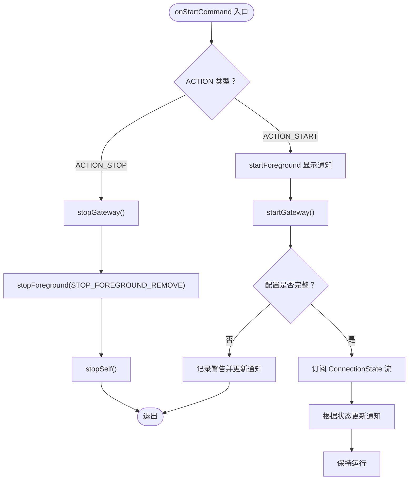
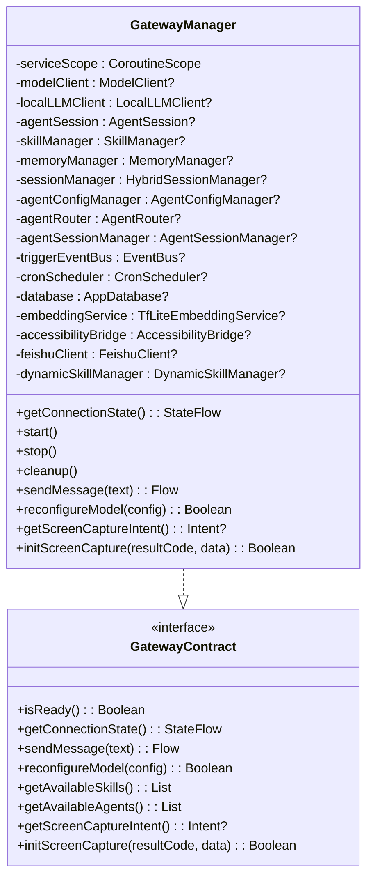
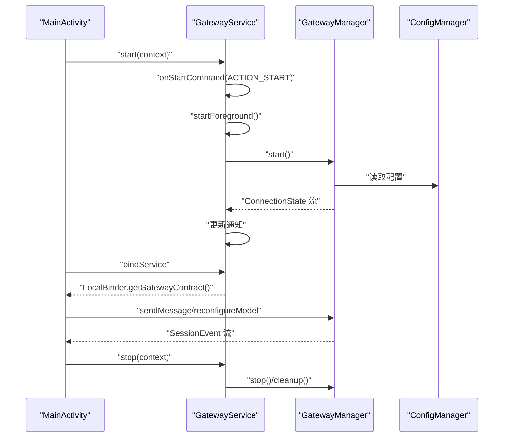
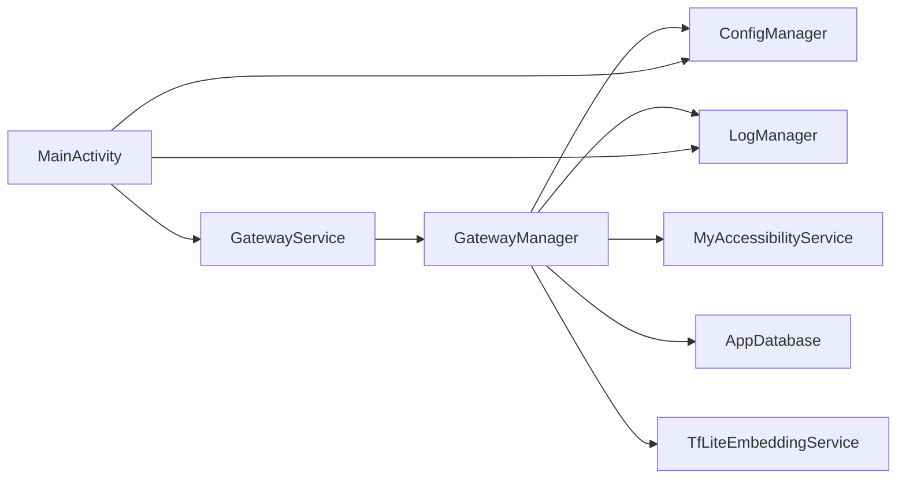

# 网关服务模式

<cite>
**本文引用的文件列表**
- [GatewayService.kt](file://app/src/main/java/ai/openclaw/android/GatewayService.kt)
- [GatewayManager.kt](file://app/src/main/java/ai/openclaw/android/GatewayManager.kt)
- [GatewayContract.kt](file://app/src/main/java/ai/openclaw/android/GatewayContract.kt)
- [MainActivity.kt](file://app/src/main/java/ai/openclaw/android/MainActivity.kt)
- [OpenClawApplication.kt](file://app/src/main/java/ai/openclaw/android/OpenClawApplication.kt)
- [ConfigManager.kt](file://app/src/main/java/ai/openclaw/android/ConfigManager.kt)
- [LogManager.kt](file://app/src/main/java/ai/openclaw/android/LogManager.kt)
- [MyAccessibilityService.kt](file://app/src/main/java/ai/openclaw/android/MyAccessibilityService.kt)
- [AndroidManifest.xml](file://app/src/main/AndroidManifest.xml)
</cite>

## 目录
1. [引言](#引言)
2. [项目结构](#项目结构)
3. [核心组件](#核心组件)
4. [架构总览](#架构总览)
5. [详细组件分析](#详细组件分析)
6. [依赖关系分析](#依赖关系分析)
7. [性能考量](#性能考量)
8. [故障排查指南](#故障排查指南)
9. [结论](#结论)
10. [附录](#附录)

## 引言
本文件面向架构师与高级开发者，系统化阐述 OpenClaw-Android 的“网关服务模式”（Gateway Service Pattern）。该模式以单一真实来源（Single Source of Truth）为核心理念，通过 GatewayService 作为前台服务统一管理应用内所有核心组件实例，确保状态一致性、可观察性与可恢复性。本文将深入解析：
- 单一真实来源架构的设计动机与落地方式
- GatewayService 如何作为应用的唯一真相来源管理核心组件
- 前台服务的通知管理、生命周期与资源分配策略
- 服务启动、停止与状态监控的完整流程
- CoroutineScope 与 SupervisorJob 的使用模式及优雅重启与错误恢复
- 服务状态广播机制、配置管理集成与日志记录策略
- 架构可扩展性与性能优化指导原则

## 项目结构
从代码组织看，应用采用“领域驱动 + 层次清晰”的结构：
- 应用入口与绑定：MainActivity 负责启动服务、绑定服务并消费 GatewayContract 接口
- 前台服务：GatewayService 提供前台服务能力，负责通知、生命周期与状态广播
- 组件编排：GatewayManager 作为“网关大脑”，集中初始化与编排模型、技能、记忆、触发器等子系统
- 配置与日志：ConfigManager 与 LogManager 分别承担配置持久化与日志收集
- 辅助能力：MyAccessibilityService 提供无障碍自动化能力，支撑本地模型工具执行与屏幕截图

图表来源
- [MainActivity.kt:122-141](file://app/src/main/java/ai/openclaw/android/MainActivity.kt#L122-L141)
- [GatewayService.kt:31-120](file://app/src/main/java/ai/openclaw/android/GatewayService.kt#L31-L120)
- [GatewayManager.kt:64-107](file://app/src/main/java/ai/openclaw/android/GatewayManager.kt#L64-L107)
- [MyAccessibilityService.kt:38-99](file://app/src/main/java/ai/openclaw/android/MyAccessibilityService.kt#L38-L99)
- [ConfigManager.kt:11-52](file://app/src/main/java/ai/openclaw/android/ConfigManager.kt#L11-L52)
- [LogManager.kt:16-54](file://app/src/main/java/ai/openclaw/android/LogManager.kt#L16-L54)

章节来源
- [MainActivity.kt:122-141](file://app/src/main/java/ai/openclaw/android/MainActivity.kt#L122-L141)
- [GatewayService.kt:31-120](file://app/src/main/java/ai/openclaw/android/GatewayService.kt#L31-L120)
- [GatewayManager.kt:64-107](file://app/src/main/java/ai/openclaw/android/GatewayManager.kt#L64-L107)
- [AndroidManifest.xml:47-104](file://app/src/main/AndroidManifest.xml#L47-L104)

## 核心组件
- GatewayService：前台服务，负责通知、生命周期、状态广播与与 GatewayManager 的协作
- GatewayManager：组件编排者，集中初始化模型、技能、记忆、触发器、多智能体路由等子系统，并暴露 GatewayContract 接口
- GatewayContract：服务契约接口，Activity 仅依赖此接口，便于未来跨进程扩展
- ConfigManager：配置管理，含加密存储与服务状态持久化
- LogManager：集中日志管理，支持 UI 实时展示
- MyAccessibilityService：无障碍自动化，支撑本地模型工具执行与屏幕截图
- OpenClawApplication：应用级全局对象，提供权限管理入口

章节来源
- [GatewayService.kt:31-120](file://app/src/main/java/ai/openclaw/android/GatewayService.kt#L31-L120)
- [GatewayManager.kt:64-107](file://app/src/main/java/ai/openclaw/android/GatewayManager.kt#L64-L107)
- [GatewayContract.kt:9-33](file://app/src/main/java/ai/openclaw/android/GatewayContract.kt#L9-L33)
- [ConfigManager.kt:11-52](file://app/src/main/java/ai/openclaw/android/ConfigManager.kt#L11-L52)
- [LogManager.kt:16-54](file://app/src/main/java/ai/openclaw/android/LogManager.kt#L16-L54)
- [MyAccessibilityService.kt:38-99](file://app/src/main/java/ai/openclaw/android/MyAccessibilityService.kt#L38-L99)
- [OpenClawApplication.kt:7-18](file://app/src/main/java/ai/openclaw/android/OpenClawApplication.kt#L7-L18)

## 架构总览
网关服务模式以 GatewayService 为中心，通过 GatewayContract 对外提供统一接口；GatewayManager 负责内部组件的初始化、状态流转与资源回收。配置与日志贯穿全链路，确保可观察性与可恢复性。

图表来源
- [MainActivity.kt:122-141](file://app/src/main/java/ai/openclaw/android/MainActivity.kt#L122-L141)
- [GatewayService.kt:90-120](file://app/src/main/java/ai/openclaw/android/GatewayService.kt#L90-L120)
- [GatewayManager.kt:325-382](file://app/src/main/java/ai/openclaw/android/GatewayManager.kt#L325-L382)

## 详细组件分析

### GatewayService：前台服务与单一真实来源
- 前台服务设计
  - 通知通道创建与通知构建，确保低优先级且持续显示
  - Android UPSIDE_DOWN_CAKE 及以下版本的兼容处理
  - 使用 FOREGROUND_SERVICE_TYPE_DATA_SYNC 类型声明
- 生命周期管理
  - onCreate：初始化 ConfigManager、通知通道、GatewayManager
  - onStartCommand：根据 ACTION_START/ACTION_STOP 执行启动/停止逻辑
  - onDestroy：停止 Gateway、取消 CoroutineScope
- 广播机制
  - 通过 ACTION_STATUS_CHANGED 广播服务运行状态，携带 is_running 与 state
- 状态监控
  - 订阅 GatewayManager 的 ConnectionState 流，动态更新通知文本与 ConfigManager 的服务启用状态

图表来源
- [GatewayService.kt:90-120](file://app/src/main/java/ai/openclaw/android/GatewayService.kt#L90-L120)
- [GatewayService.kt:170-211](file://app/src/main/java/ai/openclaw/android/GatewayService.kt#L170-L211)
- [GatewayService.kt:221-233](file://app/src/main/java/ai/openclaw/android/GatewayService.kt#L221-L233)

章节来源
- [GatewayService.kt:31-120](file://app/src/main/java/ai/openclaw/android/GatewayService.kt#L31-L120)
- [GatewayService.kt:122-168](file://app/src/main/java/ai/openclaw/android/GatewayService.kt#L122-L168)
- [GatewayService.kt:170-233](file://app/src/main/java/ai/openclaw/android/GatewayService.kt#L170-L233)
- [AndroidManifest.xml:71-76](file://app/src/main/AndroidManifest.xml#L71-L76)

### GatewayManager：组件编排与契约实现
- 设计要点
  - 以 GatewayContract 为对外接口，屏蔽内部复杂度
  - 使用 SupervisorJob + Dispatchers.IO 的服务级作用域，隔离异常传播
  - 将模型、技能、记忆、触发器、多智能体路由等子系统集中初始化与注入
- 关键职责
  - 初始化模型客户端（本地/云端），注册技能，建立工具执行链
  - 构建记忆子系统（向量化、混合检索、会话管理）
  - 初始化触发系统（事件总线、定时调度器、规则持久化）
  - 多智能体路由与会话管理，兼容单智能体路径
  - 屏幕捕获（MediaProjection）与无障碍桥接
- 状态管理
  - ConnectionState 流：Disconnected/Connecting/Connected/Error
  - 通过 ConfigManager.setServiceEnabled 控制服务启用状态

图表来源
- [GatewayManager.kt:64-107](file://app/src/main/java/ai/openclaw/android/GatewayManager.kt#L64-L107)
- [GatewayContract.kt:9-33](file://app/src/main/java/ai/openclaw/android/GatewayContract.kt#L9-L33)

章节来源
- [GatewayManager.kt:64-107](file://app/src/main/java/ai/openclaw/android/GatewayManager.kt#L64-L107)
- [GatewayManager.kt:325-382](file://app/src/main/java/ai/openclaw/android/GatewayManager.kt#L325-L382)
- [GatewayManager.kt:391-560](file://app/src/main/java/ai/openclaw/android/GatewayManager.kt#L391-L560)
- [GatewayManager.kt:562-612](file://app/src/main/java/ai/openclaw/android/GatewayManager.kt#L562-L612)

### MainActivity：绑定与契约消费
- 绑定服务与获取 GatewayContract
  - 通过 ServiceConnection 获取 LocalBinder，再由其提供 GatewayContract
- 服务控制
  - 通过 GatewayService.start/stop 切换服务运行状态
- 会话与配置
  - 通过 contract.sendMessage 发送消息，消费流式事件
  - 通过 contract.reconfigureModel 动态切换模型提供商与参数

图表来源
- [MainActivity.kt:122-141](file://app/src/main/java/ai/openclaw/android/MainActivity.kt#L122-L141)
- [MainActivity.kt:378-455](file://app/src/main/java/ai/openclaw/android/MainActivity.kt#L378-L455)
- [GatewayService.kt:90-120](file://app/src/main/java/ai/openclaw/android/GatewayService.kt#L90-L120)
- [GatewayManager.kt:325-382](file://app/src/main/java/ai/openclaw/android/GatewayManager.kt#L325-L382)

章节来源
- [MainActivity.kt:107-120](file://app/src/main/java/ai/openclaw/android/MainActivity.kt#L107-L120)
- [MainActivity.kt:122-141](file://app/src/main/java/ai/openclaw/android/MainActivity.kt#L122-L141)
- [MainActivity.kt:378-455](file://app/src/main/java/ai/openclaw/android/MainActivity.kt#L378-L455)

### CoroutineScope 与 SupervisorJob：优雅重启与错误恢复
- 作用域策略
  - GatewayService：SupervisorJob + Dispatchers.Main，用于 UI 主线程协程
  - GatewayManager：SupervisorJob + Dispatchers.IO，用于后台任务
- 错误传播与隔离
  - SupervisorJob 保证一个子任务失败不影响其他子任务，便于局部重试与降级
- 优雅重启
  - 在 GatewayService 中，当 ConnectionState 进入 Error 时，通过 ConfigManager.setServiceEnabled(false) 与通知更新提示用户
  - 用户可通过 SettingsScreen 触发 reconfigureModel，GatewayManager 重新初始化组件后，ConnectionState 自动回到 Connected

章节来源
- [GatewayService.kt:65-67](file://app/src/main/java/ai/openclaw/android/GatewayService.kt#L65-L67)
- [GatewayManager.kt:70-70](file://app/src/main/java/ai/openclaw/android/GatewayManager.kt#L70-L70)
- [GatewayManager.kt:333-343](file://app/src/main/java/ai/openclaw/android/GatewayManager.kt#L333-L343)

### 服务状态广播机制与配置管理集成
- 广播机制
  - GatewayService 在启动/停止时广播 ACTION_STATUS_CHANGED，携带 is_running 与 state
  - MainActivity 通过广播感知服务状态变化，更新 UI 与服务开关
- 配置管理
  - ConfigManager 负责模型提供商、密钥、基础 URL、服务启用状态等配置的持久化与读取
  - GatewayService/GatewayManager 在启动前检查 isConfigured，若不完整则进入 Error 状态并提示用户完善配置

章节来源
- [GatewayService.kt:221-227](file://app/src/main/java/ai/openclaw/android/GatewayService.kt#L221-L227)
- [MainActivity.kt:613-620](file://app/src/main/java/ai/openclaw/android/MainActivity.kt#L613-L620)
- [ConfigManager.kt:129-136](file://app/src/main/java/ai/openclaw/android/ConfigManager.kt#L129-L136)
- [GatewayManager.kt:328-331](file://app/src/main/java/ai/openclaw/android/GatewayManager.kt#L328-L331)

### 日志记录策略
- LogManager
  - 以 StateFlow 暴露日志流，最多保留 100 条，支持 UI 实时展示
  - 同步写入 Android Logcat，按级别输出
- 使用场景
  - GatewayService/GatewayManager 在关键节点记录 INFO/WARN/ERROR 级别日志
  - MainActivity 在调试场景接收广播消息并记录

章节来源
- [LogManager.kt:16-54](file://app/src/main/java/ai/openclaw/android/LogManager.kt#L16-L54)
- [GatewayService.kt:77-78](file://app/src/main/java/ai/openclaw/android/GatewayService.kt#L77-L78)
- [GatewayManager.kt:335-342](file://app/src/main/java/ai/openclaw/android/GatewayManager.kt#L335-L342)

### 前台服务设计考虑
- 通知管理
  - 低优先级、持续显示、可点击跳转到 MainActivity
  - 根据 ConnectionState 更新通知内容
- 生命周期管理
  - onStartCommand 返回 START_STICKY，确保被系统杀死后能自动重启
  - onDestroy 中取消通知与作用域，避免泄漏
- 资源分配策略
  - 使用 Dispatchers.IO 处理耗时任务，避免阻塞主线程
  - 通过 SupervisorJob 隔离异常，防止全局崩溃

章节来源
- [GatewayService.kt:136-168](file://app/src/main/java/ai/openclaw/android/GatewayService.kt#L136-L168)
- [GatewayService.kt:90-110](file://app/src/main/java/ai/openclaw/android/GatewayService.kt#L90-L110)
- [GatewayService.kt:114-120](file://app/src/main/java/ai/openclaw/android/GatewayService.kt#L114-L120)

## 依赖关系分析
- 组件耦合
  - GatewayService 仅依赖 GatewayManager 的契约接口，降低耦合
  - GatewayManager 内部依赖大量子系统，但通过契约对外暴露最小接口
- 外部依赖
  - Android 前台服务与通知系统
  - OkHttp 用于云模型客户端
  - Room 数据库与嵌入向量服务
  - AccessibilityService 与 MediaProjection 用于屏幕捕获与自动化

图表来源
- [GatewayService.kt:86-87](file://app/src/main/java/ai/openclaw/android/GatewayService.kt#L86-L87)
- [GatewayManager.kt:391-560](file://app/src/main/java/ai/openclaw/android/GatewayManager.kt#L391-L560)
- [MainActivity.kt:122-141](file://app/src/main/java/ai/openclaw/android/MainActivity.kt#L122-L141)

章节来源
- [GatewayService.kt:86-87](file://app/src/main/java/ai/openclaw/android/GatewayService.kt#L86-L87)
- [GatewayManager.kt:391-560](file://app/src/main/java/ai/openclaw/android/GatewayManager.kt#L391-L560)
- [MainActivity.kt:122-141](file://app/src/main/java/ai/openclaw/android/MainActivity.kt#L122-L141)

## 性能考量
- 协程调度
  - IO 线程池用于模型推理与网络请求，避免阻塞主线程
  - 使用 SupervisorJob 隔离异常，减少连锁失败
- 内存与资源
  - 本地模型加载失败时自动回退云端模型，提升可用性
  - 动态技能管理器在启动时执行一次性维护任务，避免运行期抖动
- I/O 与网络
  - 云模型客户端按需创建，配置变更时重建，确保参数一致性
- UI 体验
  - ConnectionState 流驱动通知与 UI 状态，避免轮询带来的功耗

[本节为通用性能建议，不直接分析具体文件]

## 故障排查指南
- 服务无法启动
  - 检查 ConfigManager.isConfigured 是否为真；若为假，查看通知与日志提示
  - 确认前台服务类型与通知权限已在清单与系统设置中授予
- 连接状态异常
  - 观察 ConnectionState 流与通知文本；若为 Error，查看日志中的错误信息
  - 通过 SettingsScreen 触发 reconfigureModel 重试
- 技能执行失败
  - 检查 MyAccessibilityService 是否已启动；无障碍权限是否授予
  - 查看技能注册与工具执行链是否正确注入
- 日志与广播
  - 通过 LogManager.logs 与 MainActivity 的广播接收器定位问题

章节来源
- [ConfigManager.kt:129-136](file://app/src/main/java/ai/openclaw/android/ConfigManager.kt#L129-L136)
- [GatewayService.kt:176-208](file://app/src/main/java/ai/openclaw/android/GatewayService.kt#L176-L208)
- [LogManager.kt:23-44](file://app/src/main/java/ai/openclaw/android/LogManager.kt#L23-L44)
- [MainActivity.kt:458-471](file://app/src/main/java/ai/openclaw/android/MainActivity.kt#L458-L471)

## 结论
OpenClaw-Android 的网关服务模式通过 GatewayService 与 GatewayManager 的协同，实现了以单一真实来源为核心的可观察、可恢复、可扩展的后台服务架构。该模式在保证用户体验的同时，为未来的跨进程扩展与大规模组件演进提供了坚实基础。

[本节为总结性内容，不直接分析具体文件]

## 附录
- 清单与权限
  - 前台服务声明与数据同步类型
  - 通知监听、无障碍、存储、网络等权限
- 应用级全局对象
  - OpenClawApplication 提供权限管理入口

章节来源
- [AndroidManifest.xml:71-104](file://app/src/main/AndroidManifest.xml#L71-L104)
- [OpenClawApplication.kt:7-18](file://app/src/main/java/ai/openclaw/android/OpenClawApplication.kt#L7-L18)