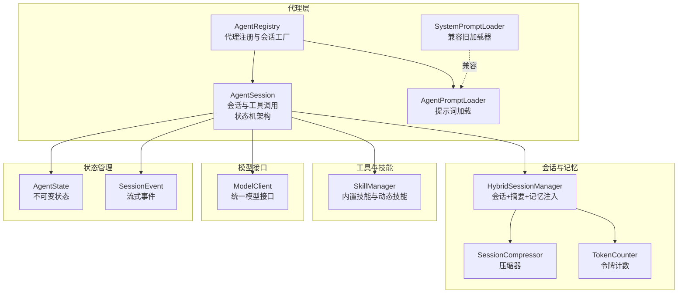
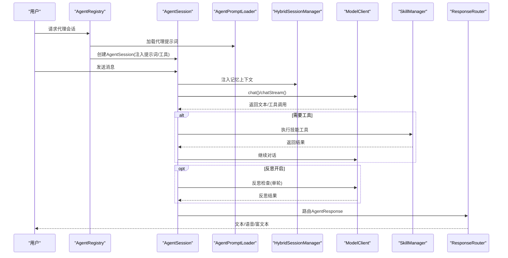
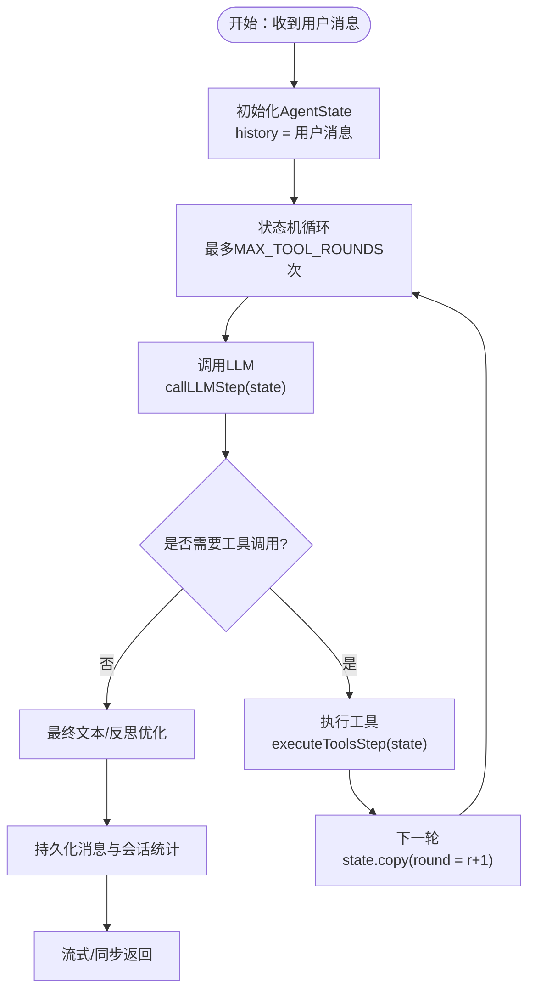
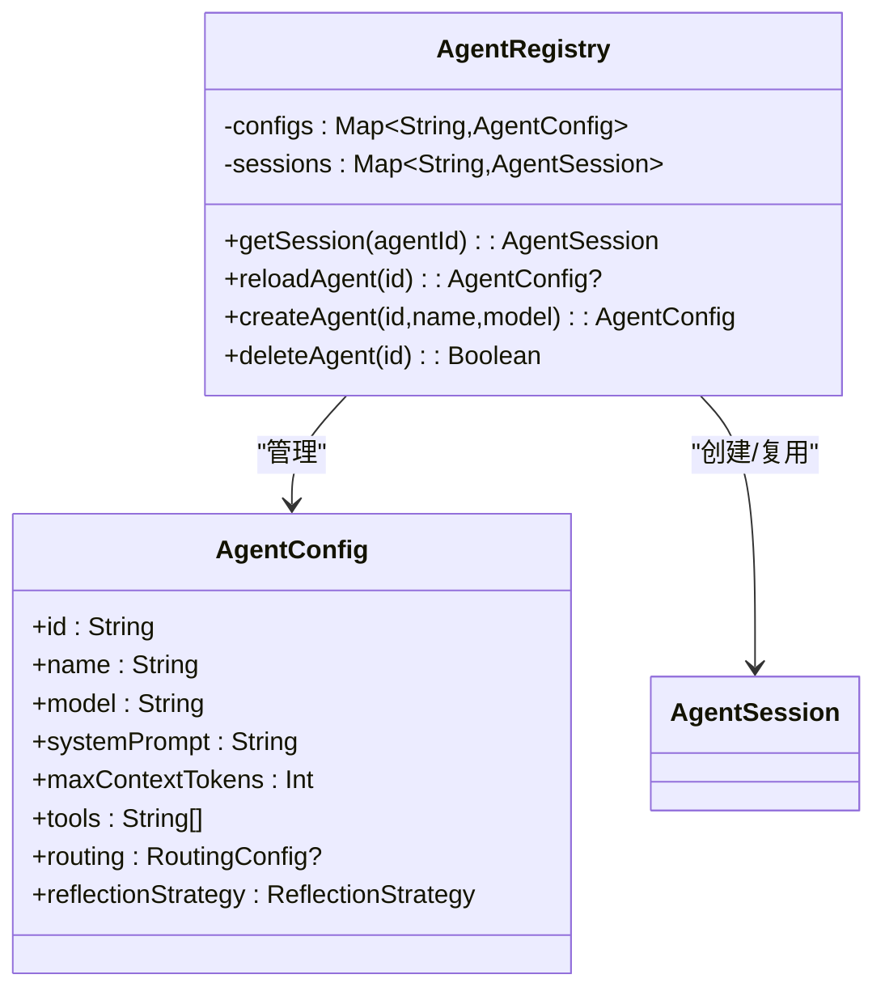
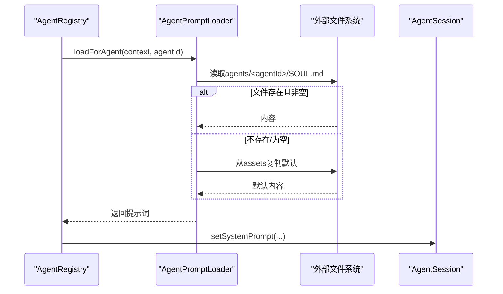
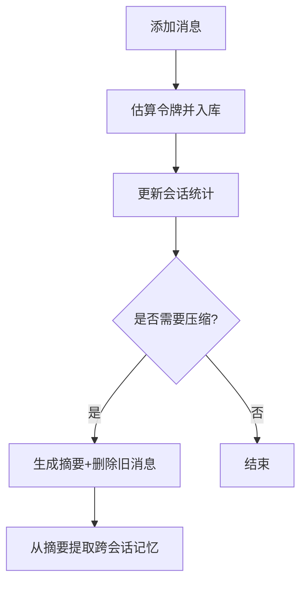
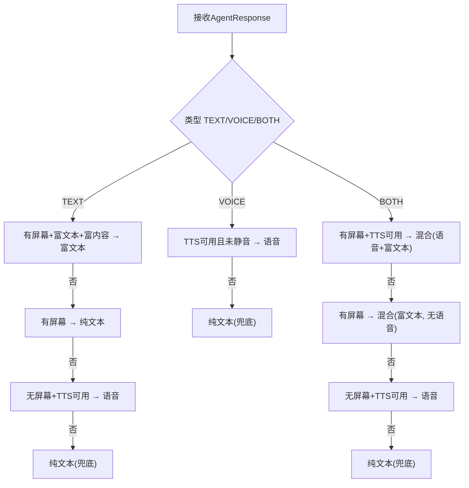
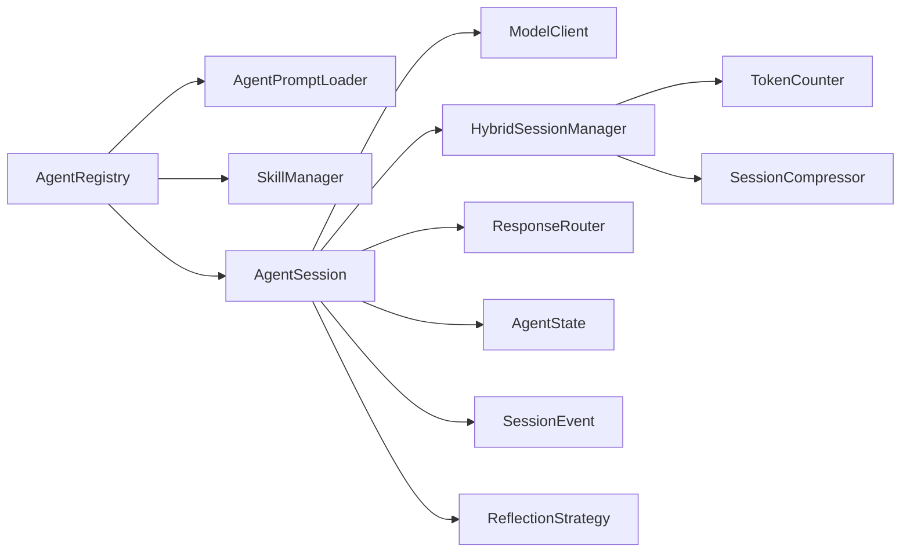

# AI对话系统

<cite>
**本文引用的文件**
- [AgentSession.kt](file://app/src/main/java/ai/openclaw/android/agent/AgentSession.kt)
- [AgentPromptLoader.kt](file://app/src/main/java/ai/openclaw/android/agent/AgentPromptLoader.kt)
- [SystemPromptLoader.kt](file://app/src/main/java/ai/openclaw/android/agent/SystemPromptLoader.kt)
- [AgentRegistry.kt](file://app/src/main/java/ai/openclaw/android/agent/AgentRegistry.kt)
- [AgentConfig.kt](file://app/src/main/java/ai/openclaw/android/config/AgentConfig.kt)
- [AgentResponse.kt](file://app/src/main/java/ai/openclaw/android/domain/AgentResponse.kt)
- [ResponseRouter.kt](file://app/src/main/java/ai/openclaw/android/domain/ResponseRouter.kt)
- [HybridSessionManager.kt](file://app/src/main/java/ai/openclaw/android/domain/session/HybridSessionManager.kt)
- [SessionCompressor.kt](file://app/src/main/java/ai/openclaw/android/domain/session/SessionCompressor.kt)
- [TokenCounter.kt](file://app/src/main/java/ai/openclaw/android/domain/session/TokenCounter.kt)
- [SkillManager.kt](file://app/src/main/java/ai/openclaw/android/skill/SkillManager.kt)
- [ModelClient.kt](file://app/src/main/java/ai/openclaw/android/model/ModelClient.kt)
- [ReflectionStrategy.kt](file://app/src/main/java/ai/openclaw/android/domain/ReflectionStrategy.kt)
</cite>

## 更新摘要
**变更内容**
- 新增AgentState不可变状态管理架构，替代原有的可变状态变量
- 重构AgentSession状态机，实现完整的状态跟踪和调试支持
- 改进调试和错误报告机制，提供详细的轮次状态追踪
- 新增SessionEvent事件系统，支持流式API的状态事件传递
- 优化工具执行和反思阶段的状态管理

## 目录
1. [简介](#简介)
2. [项目结构](#项目结构)
3. [核心组件](#核心组件)
4. [架构总览](#架构总览)
5. [详细组件分析](#详细组件分析)
6. [依赖关系分析](#依赖关系分析)
7. [性能考量](#性能考量)
8. [故障排查指南](#故障排查指南)
9. [结论](#结论)
10. [附录](#附录)

## 简介
本文件面向开发者与产品人员，系统化梳理AI对话系统的核心模块与实现细节，重点覆盖：
- AgentSession的对话上下文管理、工具调用解析机制、多轮对话状态维护
- AgentConfig配置系统、AgentPromptLoader提示词加载机制、SystemPromptLoader系统提示词管理
- AgentRegistry代理注册表的设计模式与生命周期管理
- AgentResponse响应处理流程与ResponseRouter路由机制
- 对话压缩优化、令牌计数策略与性能监控方法
- 实际代码示例路径与扩展定制的最佳实践

**更新** 本次更新重点关注AgentSession状态机架构的重大重构，引入不可变状态管理机制，显著提升了系统的可调试性和稳定性。

## 项目结构
对话系统主要由"代理层""会话层""记忆与压缩层""工具与技能层""模型接口层"构成，采用分层解耦与可插拔设计。

**图表来源**
- [AgentRegistry.kt:21-246](file://app/src/main/java/ai/openclaw/android/agent/AgentRegistry.kt#L21-L246)
- [AgentSession.kt:943-995](file://app/src/main/java/ai/openclaw/android/agent/AgentSession.kt#L943-L995)
- [AgentPromptLoader.kt:19-284](file://app/src/main/java/ai/openclaw/android/agent/AgentPromptLoader.kt#L19-L284)
- [SystemPromptLoader.kt:11-42](file://app/src/main/java/ai/openclaw/android/agent/SystemPromptLoader.kt#L11-L42)
- [HybridSessionManager.kt:31-457](file://app/src/main/java/ai/openclaw/android/domain/session/HybridSessionManager.kt#L31-L457)
- [SessionCompressor.kt:13-83](file://app/src/main/java/ai/openclaw/android/domain/session/SessionCompressor.kt#L13-L83)
- [TokenCounter.kt:3-25](file://app/src/main/java/ai/openclaw/android/domain/session/TokenCounter.kt#L3-L25)
- [SkillManager.kt:8-193](file://app/src/main/java/ai/openclaw/android/skill/SkillManager.kt#L8-L193)
- [ModelClient.kt:10-59](file://app/src/main/java/ai/openclaw/android/model/ModelClient.kt#L10-L59)

**章节来源**
- [AgentRegistry.kt:21-246](file://app/src/main/java/ai/openclaw/android/agent/AgentRegistry.kt#L21-L246)
- [AgentSession.kt:35-819](file://app/src/main/java/ai/openclaw/android/agent/AgentSession.kt#L35-L819)
- [AgentPromptLoader.kt:19-284](file://app/src/main/java/ai/openclaw/android/agent/AgentPromptLoader.kt#L19-L284)
- [SystemPromptLoader.kt:11-42](file://app/src/main/java/ai/openclaw/android/agent/SystemPromptLoader.kt#L11-L42)
- [HybridSessionManager.kt:31-457](file://app/src/main/java/ai/openclaw/android/domain/session/HybridSessionManager.kt#L31-L457)
- [SessionCompressor.kt:13-83](file://app/src/main/java/ai/openclaw/android/domain/session/SessionCompressor.kt#L13-L83)
- [TokenCounter.kt:3-25](file://app/src/main/java/ai/openclaw/android/domain/session/TokenCounter.kt#L3-L25)
- [SkillManager.kt:8-193](file://app/src/main/java/ai/openclaw/android/skill/SkillManager.kt#L8-L193)
- [ModelClient.kt:10-59](file://app/src/main/java/ai/openclaw/android/model/ModelClient.kt#L10-L59)

## 核心组件
- AgentSession：负责构建消息历史、调用模型、执行工具、反射优化、流式输出与持久化。**更新** 现已采用不可变状态管理模式，通过AgentState跟踪每一轮的状态变化。
- AgentRegistry：集中管理多代理配置与会话实例，支持动态创建、重载与清理。
- AgentPromptLoader/SystemPromptLoader：从外部文件或资源加载系统提示词，支持全局与按代理独立提示词。
- HybridSessionManager：会话生命周期管理、消息持久化、摘要缓存、记忆注入与压缩触发。
- SessionCompressor/TokenCounter：会话压缩与令牌估算策略。
- SkillManager：内置与动态技能注册、工具定义转换、权限校验与执行。
- ModelClient：统一的模型调用接口，支持同步与流式。
- ResponseRouter：基于设备能力的响应路由，自动降级。
- ReflectionStrategy：反思策略与配置，含超时、变更率阈值与A2UI保护。
- **新增** AgentState：不可变状态快照类，提供完整的调试信息和轮次追踪。
- **新增** SessionEvent：流式API事件系统，支持Token、ToolExecuting、ToolResult、Complete、Error等事件类型。

**章节来源**
- [AgentSession.kt:35-819](file://app/src/main/java/ai/openclaw/android/agent/AgentSession.kt#L35-L819)
- [AgentRegistry.kt:21-246](file://app/src/main/java/ai/openclaw/android/agent/AgentRegistry.kt#L21-L246)
- [AgentPromptLoader.kt:19-284](file://app/src/main/java/ai/openclaw/android/agent/AgentPromptLoader.kt#L19-L284)
- [SystemPromptLoader.kt:11-42](file://app/src/main/java/ai/openclaw/android/agent/SystemPromptLoader.kt#L11-L42)
- [HybridSessionManager.kt:31-457](file://app/src/main/java/ai/openclaw/android/domain/session/HybridSessionManager.kt#L31-L457)
- [SessionCompressor.kt:13-83](file://app/src/main/java/ai/openclaw/android/domain/session/SessionCompressor.kt#L13-L83)
- [TokenCounter.kt:3-25](file://app/src/main/java/ai/openclaw/android/domain/session/TokenCounter.kt#L3-L25)
- [SkillManager.kt:8-193](file://app/src/main/java/ai/openclaw/android/skill/SkillManager.kt#L8-L193)
- [ModelClient.kt:10-59](file://app/src/main/java/ai/openclaw/android/model/ModelClient.kt#L10-L59)
- [ResponseRouter.kt:31-118](file://app/src/main/java/ai/openclaw/android/domain/ResponseRouter.kt#L31-L118)
- [ReflectionStrategy.kt:18-175](file://app/src/main/java/ai/openclaw/android/domain/ReflectionStrategy.kt#L18-L175)
- [AgentSession.kt:943-995](file://app/src/main/java/ai/openclaw/android/agent/AgentSession.kt#L943-L995)

## 架构总览
下图展示了从用户输入到最终交付的端到端流程，涵盖提示词加载、会话构建、工具调用、反思优化与响应路由。**更新** 新增了AgentState状态跟踪和SessionEvent事件流。

**图表来源**
- [AgentRegistry.kt:193-213](file://app/src/main/java/ai/openclaw/android/agent/AgentRegistry.kt#L193-L213)
- [AgentSession.kt:400-556](file://app/src/main/java/ai/openclaw/android/agent/AgentSession.kt#L400-L556)
- [AgentPromptLoader.kt:107-138](file://app/src/main/java/ai/openclaw/android/agent/AgentPromptLoader.kt#L107-L138)
- [HybridSessionManager.kt:155-202](file://app/src/main/java/ai/openclaw/android/domain/session/HybridSessionManager.kt#L155-L202)
- [ModelClient.kt:15-32](file://app/src/main/java/ai/openclaw/android/model/ModelClient.kt#L15-L32)
- [SkillManager.kt:62-83](file://app/src/main/java/ai/openclaw/android/skill/SkillManager.kt#L62-L83)
- [ResponseRouter.kt:39-98](file://app/src/main/java/ai/openclaw/android/domain/ResponseRouter.kt#L39-L98)

## 详细组件分析

### AgentSession：状态机架构重构
**更新** AgentSession已完全重构为基于不可变状态的架构，引入了AgentState类来跟踪每一轮的状态变化。

- **不可变状态管理**
  - AgentState类提供完整的状态快照，包含历史记录、当前工具调用、轮次编号、A2UI响应、反思应用状态和最终内容。
  - 每次状态变更都通过copy()方法创建新状态，避免可变变量的复杂性。
  - 提供dump()方法用于调试，显示完整的状态信息。
- **状态机循环**
  - handleMessage()和handleMessageStream()都采用相同的状态机逻辑，但流式版本通过SessionEvent提供实时事件。
  - 每轮循环都会记录状态快照，便于调试和问题追踪。
- **工具执行状态**
  - executeToolsStep()方法返回新的AgentState，确保工具执行结果正确反映在状态中。
  - 工具执行完成后清除currentToolCalls，表示该轮工具执行完成。
- **反思阶段状态**
  - applyReflection()方法接收AgentState并返回更新后的状态。
  - 反思完成后设置reflectionApplied标志，便于后续状态追踪。

**图表来源**
- [AgentSession.kt:406-428](file://app/src/main/java/ai/openclaw/android/agent/AgentSession.kt#L406-L428)
- [AgentSession.kt:462-496](file://app/src/main/java/ai/openclaw/android/agent/AgentSession.kt#L462-L496)
- [AgentSession.kt:499-521](file://app/src/main/java/ai/openclaw/android/agent/AgentSession.kt#L499-L521)
- [AgentSession.kt:954-977](file://app/src/main/java/ai/openclaw/android/agent/AgentSession.kt#L954-L977)

**章节来源**
- [AgentSession.kt:35-819](file://app/src/main/java/ai/openclaw/android/agent/AgentSession.kt#L35-L819)
- [AgentSession.kt:943-995](file://app/src/main/java/ai/openclaw/android/agent/AgentSession.kt#L943-L995)

### AgentState：不可变状态管理
**新增** AgentState是本次重构的核心组件，提供不可变的状态快照功能。

- **状态字段**
  - history：完整的消息历史列表
  - currentToolCalls：当前待执行的工具调用列表
  - round：当前轮次编号
  - a2uiResponse：A2UI格式的响应内容
  - reflectionApplied：是否已应用反思优化
  - finalContent：最终的对话内容
- **便利属性**
  - isFinalAnswer：判断是否为最终回答（无工具调用且有最终内容）
  - needsToolExecution：判断是否需要执行工具调用
- **调试支持**
  - dump()方法提供完整的状态转储，包含轮次、历史大小、工具调用列表、A2UI状态、反思应用状态和最终内容摘要。
  - 每轮循环都会记录状态快照，便于问题诊断和性能分析。

**章节来源**
- [AgentSession.kt:943-995](file://app/src/main/java/ai/openclaw/android/agent/AgentSession.kt#L943-L995)

### SessionEvent：流式事件系统
**新增** SessionEvent是流式API的核心事件系统，提供实时的状态反馈。

- **事件类型**
  - Token：流式输出的文本片段
  - ToolExecuting：开始执行某个工具
  - ToolResult：工具执行结果
  - Complete：完整响应完成
  - Error：发生错误
  - ReflectionStart：反思阶段开始
  - ReflectionComplete：反思阶段完成
- **流式API集成**
  - handleMessageStream()使用SessionEvent提供实时事件反馈
  - 每个事件都对应特定的状态变化，便于前端实时渲染
- **事件驱动的调试**
  - 通过观察事件序列可以清楚地了解对话过程的状态变化

**章节来源**
- [AgentSession.kt:982-995](file://app/src/main/java/ai/openclaw/android/agent/AgentSession.kt#L982-L995)

### AgentConfig与AgentRegistry：配置与生命周期
- AgentConfig
  - 包含代理标识、名称、模型、系统提示词、最大上下文令牌、工具白名单、路由配置与反思策略。
- AgentRegistry
  - 从外部文件系统加载各代理的config.yaml与SOUL.md，支持默认代理(main)与自定义代理目录结构。
  - 提供会话获取、列表、默认代理、创建/删除代理、重载配置与会话重建。
  - 会话创建时注入系统提示词与工具集（含无障碍工具与技能工具）。

**图表来源**
- [AgentConfig.kt:5-21](file://app/src/main/java/ai/openclaw/android/config/AgentConfig.kt#L5-L21)
- [AgentRegistry.kt:21-246](file://app/src/main/java/ai/openclaw/android/agent/AgentRegistry.kt#L21-L246)

**章节来源**
- [AgentConfig.kt:5-21](file://app/src/main/java/ai/openclaw/android/config/AgentConfig.kt#L5-L21)
- [AgentRegistry.kt:21-246](file://app/src/main/java/ai/openclaw/android/agent/AgentRegistry.kt#L21-L246)

### AgentPromptLoader与SystemPromptLoader：提示词加载
- AgentPromptLoader
  - 全局system_prompt.md与按代理SOUL.md双通道加载，支持首次从assets复制默认模板、缓存与热更新。
  - 提供强制重载与路径查询。
- SystemPromptLoader
  - 为兼容旧版本保留，直接委托AgentPromptLoader。

**图表来源**
- [AgentPromptLoader.kt:107-138](file://app/src/main/java/ai/openclaw/android/agent/AgentPromptLoader.kt#L107-L138)
- [AgentRegistry.kt:193-213](file://app/src/main/java/ai/openclaw/android/agent/AgentRegistry.kt#L193-L213)

**章节来源**
- [AgentPromptLoader.kt:19-284](file://app/src/main/java/ai/openclaw/android/agent/AgentPromptLoader.kt#L19-L284)
- [SystemPromptLoader.kt:11-42](file://app/src/main/java/ai/openclaw/android/agent/SystemPromptLoader.kt#L11-L42)
- [AgentRegistry.kt:193-213](file://app/src/main/java/ai/openclaw/android/agent/AgentRegistry.kt#L193-L213)

### HybridSessionManager：会话与记忆
- 会话初始化/恢复、消息持久化与令牌计数更新。
- 记忆注入：从摘要缓存与重要记忆中拼接system消息注入。
- 压缩触发：超过阈值或显式调用performCompression，支持增量摘要合并。
- 自动提取：用户消息延时触发记忆提取，跨会话形成偏好/决策/任务记忆。

**图表来源**
- [HybridSessionManager.kt:70-110](file://app/src/main/java/ai/openclaw/android/domain/session/HybridSessionManager.kt#L70-L110)
- [HybridSessionManager.kt:236-299](file://app/src/main/java/ai/openclaw/android/domain/session/HybridSessionManager.kt#L236-L299)
- [HybridSessionManager.kt:304-338](file://app/src/main/java/ai/openclaw/android/domain/session/HybridSessionManager.kt#L304-L338)

**章节来源**
- [HybridSessionManager.kt:31-457](file://app/src/main/java/ai/openclaw/android/domain/session/HybridSessionManager.kt#L31-L457)

### SessionCompressor与TokenCounter：压缩与计数
- SessionCompressor
  - 当LLM可用时调用本地模型生成摘要；否则使用简单截断摘要。
  - 支持超时保护与可选的LLM就绪回调。
- TokenCounter
  - 粗估：中文约0.67字符/token，英文约0.25字符/token；可扩展精确计数。

**章节来源**
- [SessionCompressor.kt:13-83](file://app/src/main/java/ai/openclaw/android/domain/session/SessionCompressor.kt#L13-L83)
- [TokenCounter.kt:3-25](file://app/src/main/java/ai/openclaw/android/domain/session/TokenCounter.kt#L3-L25)

### SkillManager：工具与权限
- 注册内置技能（天气、日历、联系人、短信、通知、脚本等），动态生成工具定义。
- 工具执行前进行权限校验，必要时引导用户授权。
- 支持工具名解析（最长匹配技能ID）与执行结果封装。

**章节来源**
- [SkillManager.kt:8-193](file://app/src/main/java/ai/openclaw/android/skill/SkillManager.kt#L8-L193)

### ModelClient：统一模型接口
- 定义chat与chatStream两个核心方法，支持工具参数传递与流式事件。
- 流式事件类型：Token、ToolCallRequested、Complete、Error。

**章节来源**
- [ModelClient.kt:10-59](file://app/src/main/java/ai/openclaw/android/model/ModelClient.kt#L10-L59)

### ResponseRouter：响应路由
- 根据设备能力（屏幕/TTS/静音）与响应类型（文本/语音/混合）自动降级路由。
- 输出统一的可交付对象（纯文本/语音/富文本/混合）。

**图表来源**
- [ResponseRouter.kt:39-98](file://app/src/main/java/ai/openclaw/android/domain/ResponseRouter.kt#L39-L98)

**章节来源**
- [ResponseRouter.kt:31-118](file://app/src/main/java/ai/openclaw/android/domain/ResponseRouter.kt#L31-L118)

### 反思策略与配置：ReflectionStrategy
- 默认关闭，按需开启；单轮超时、最小变更率早停、A2UI格式保护。
- 提供自动选择策略（基于问题关键词与长度）。

**章节来源**
- [ReflectionStrategy.kt:18-175](file://app/src/main/java/ai/openclaw/android/domain/ReflectionStrategy.kt#L18-L175)

## 依赖关系分析
- AgentRegistry依赖AgentPromptLoader与SkillManager，创建AgentSession并注入系统提示词与工具。
- AgentSession依赖ModelClient、SkillManager、HybridSessionManager、ResponseRouter与反射工具。
- **更新** AgentSession现在依赖AgentState进行状态管理，通过SessionEvent提供流式事件反馈。
- HybridSessionManager依赖TokenCounter、SessionCompressor与记忆管理器，提供上下文拼接与压缩。
- SkillManager依赖OkHttp客户端与权限系统，提供工具执行与权限校验。
- ModelClient为抽象接口，具体实现由不同提供商（OpenAI/Anthropic/本地）提供。

**图表来源**
- [AgentRegistry.kt:193-213](file://app/src/main/java/ai/openclaw/android/agent/AgentRegistry.kt#L193-L213)
- [AgentSession.kt:35-819](file://app/src/main/java/ai/openclaw/android/agent/AgentSession.kt#L35-L819)
- [HybridSessionManager.kt:31-457](file://app/src/main/java/ai/openclaw/android/domain/session/HybridSessionManager.kt#L31-L457)
- [SessionCompressor.kt:13-83](file://app/src/main/java/ai/openclaw/android/domain/session/SessionCompressor.kt#L13-L83)
- [TokenCounter.kt:3-25](file://app/src/main/java/ai/openclaw/android/domain/session/TokenCounter.kt#L3-L25)
- [SkillManager.kt:8-193](file://app/src/main/java/ai/openclaw/android/skill/SkillManager.kt#L8-L193)
- [ModelClient.kt:10-59](file://app/src/main/java/ai/openclaw/android/model/ModelClient.kt#L10-L59)
- [ReflectionStrategy.kt:54-71](file://app/src/main/java/ai/openclaw/android/domain/ReflectionStrategy.kt#L54-L71)

**章节来源**
- [AgentRegistry.kt:21-246](file://app/src/main/java/ai/openclaw/android/agent/AgentRegistry.kt#L21-L246)
- [AgentSession.kt:35-819](file://app/src/main/java/ai/openclaw/android/agent/AgentSession.kt#L35-L819)
- [HybridSessionManager.kt:31-457](file://app/src/main/java/ai/openclaw/android/domain/session/HybridSessionManager.kt#L31-L457)
- [SessionCompressor.kt:13-83](file://app/src/main/java/ai/openclaw/android/domain/session/SessionCompressor.kt#L13-L83)
- [TokenCounter.kt:3-25](file://app/src/main/java/ai/openclaw/android/domain/session/TokenCounter.kt#L3-L25)
- [SkillManager.kt:8-193](file://app/src/main/java/ai/openclaw/android/skill/SkillManager.kt#L8-L193)
- [ModelClient.kt:10-59](file://app/src/main/java/ai/openclaw/android/model/ModelClient.kt#L10-L59)
- [ReflectionStrategy.kt:54-71](file://app/src/main/java/ai/openclaw/android/domain/ReflectionStrategy.kt#L54-L71)

## 性能考量
- **令牌估算与裁剪**
  - 使用字符语言特征加权估算，避免全量分词带来的开销；在历史过长时主动裁剪。
- **压缩与摘要**
  - 会话压缩阈值触发，支持增量摘要合并；LLM不可用时采用简单摘要兜底。
- **流式输出**
  - 流式接口实时发射Token，降低首帧延迟；工具执行阶段逐个串行，避免并发锁竞争。
- **反思保护**
  - 单轮超时、变更率早停与A2UI保护，防止无效计算与格式破坏。
- **记忆注入**
  - 重要记忆以system消息形式注入，减少重复检索成本；摘要缓存LRU控制内存占用。
- **状态管理优化**
  - **更新** 不可变状态管理减少了状态竞争和竞态条件，提升了并发安全性。
  - **更新** AgentState的dump()方法提供了高效的调试信息收集，无需额外的调试开销。

**章节来源**
- [AgentSession.kt:667-683](file://app/src/main/java/ai/openclaw/android/agent/AgentSession.kt#L667-L683)
- [HybridSessionManager.kt:236-299](file://app/src/main/java/ai/openclaw/android/domain/session/HybridSessionManager.kt#L236-L299)
- [SessionCompressor.kt:42-51](file://app/src/main/java/ai/openclaw/android/domain/session/SessionCompressor.kt#L42-L51)
- [TokenCounter.kt:8-15](file://app/src/main/java/ai/openclaw/android/domain/session/TokenCounter.kt#L8-L15)
- [ReflectionStrategy.kt:72-92](file://app/src/main/java/ai/openclaw/android/domain/ReflectionStrategy.kt#L72-L92)

## 故障排查指南
- **工具执行失败**
  - 检查工具过滤白名单与技能权限；确认权限管理器已注入并可弹窗授权。
- **流式异常**
  - 关注流式事件中的Error类型；确保ModelClient实现正确上报。
  - **更新** 通过观察SessionEvent序列可以精确定位问题发生的具体轮次。
- **提示词加载失败**
  - 检查外部文件是否存在与可读；必要时强制重载或回退到assets默认。
- **会话压缩失败**
  - 检查LLM是否可用与模型加载状态；查看摘要生成日志。
- **反思未生效**
  - 确认反思策略与阈值配置；检查A2UI标签完整性。
- **状态追踪困难**
  - **新增** 使用AgentState.dump()输出完整的状态信息，包含轮次、工具调用、A2UI状态等关键信息。
  - **新增** 通过观察状态快照的变化可以清楚地了解对话过程中的状态演进。

**章节来源**
- [AgentSession.kt:582-639](file://app/src/main/java/ai/openclaw/android/agent/AgentSession.kt#L582-L639)
- [AgentPromptLoader.kt:69-77](file://app/src/main/java/ai/openclaw/android/agent/AgentPromptLoader.kt#L69-L77)
- [HybridSessionManager.kt:344-398](file://app/src/main/java/ai/openclaw/android/domain/session/HybridSessionManager.kt#L344-L398)
- [ReflectionStrategy.kt:72-92](file://app/src/main/java/ai/openclaw/android/domain/ReflectionStrategy.kt#L72-L92)

## 结论
该对话系统通过清晰的分层与可插拔设计，在保证灵活性的同时兼顾性能与稳定性。**更新** 本次重构引入的不可变状态管理模式显著提升了系统的可调试性和稳定性，通过AgentState和SessionEvent提供了完整的状态追踪和事件反馈机制。

AgentSession作为核心协调者，结合AgentPromptLoader、AgentRegistry、HybridSessionManager与SkillManager，实现了从提示词加载、上下文管理、工具调用到反思优化与响应路由的完整闭环。**更新** 新的状态机架构使得系统能够更好地处理复杂的多轮对话场景，同时提供了强大的调试和监控能力。

建议在生产环境中：
- 明确代理配置与工具白名单，启用必要的反思策略与压缩阈值。
- 通过流式接口优化用户体验，配合权限管理器提升安全性。
- 借助摘要与记忆注入提升长对话质量，同时关注令牌估算与裁剪策略。
- **新增** 利用AgentState的dump()功能进行问题诊断，通过SessionEvent事件流进行实时监控。

## 附录
- 实际代码示例路径（不含具体代码内容）
  - 会话创建与消息处理：[AgentRegistry.kt:45-53](file://app/src/main/java/ai/openclaw/android/agent/AgentRegistry.kt#L45-L53)，[AgentSession.kt:400-443](file://app/src/main/java/ai/openclaw/android/agent/AgentSession.kt#L400-L443)
  - 工具调用解析与执行：[AgentSession.kt:582-639](file://app/src/main/java/ai/openclaw/android/agent/AgentSession.kt#L582-L639)，[SkillManager.kt:62-83](file://app/src/main/java/ai/openclaw/android/skill/SkillManager.kt#L62-L83)
  - 提示词加载与缓存：[AgentPromptLoader.kt:107-138](file://app/src/main/java/ai/openclaw/android/agent/AgentPromptLoader.kt#L107-L138)，[AgentPromptLoader.kt:40-77](file://app/src/main/java/ai/openclaw/android/agent/AgentPromptLoader.kt#L40-L77)
  - 会话压缩与摘要：[HybridSessionManager.kt:236-299](file://app/src/main/java/ai/openclaw/android/domain/session/HybridSessionManager.kt#L236-L299)，[SessionCompressor.kt:18-60](file://app/src/main/java/ai/openclaw/android/domain/session/SessionCompressor.kt#L18-L60)
  - 令牌计数策略：[TokenCounter.kt:8-15](file://app/src/main/java/ai/openclaw/android/domain/session/TokenCounter.kt#L8-L15)
  - 响应路由决策：[ResponseRouter.kt:39-98](file://app/src/main/java/ai/openclaw/android/domain/ResponseRouter.kt#L39-L98)
  - 反思策略与保护：[ReflectionStrategy.kt:72-92](file://app/src/main/java/ai/openclaw/android/domain/ReflectionStrategy.kt#L72-L92)，[AgentSession.kt:725-789](file://app/src/main/java/ai/openclaw/android/agent/AgentSession.kt#L725-L789)
  - **新增** 不可变状态管理：[AgentSession.kt:943-995](file://app/src/main/java/ai/openclaw/android/agent/AgentSession.kt#L943-L995)
  - **新增** 流式事件系统：[AgentSession.kt:982-995](file://app/src/main/java/ai/openclaw/android/agent/AgentSession.kt#L982-L995)
  - **新增** 状态机循环：[AgentSession.kt:406-428](file://app/src/main/java/ai/openclaw/android/agent/AgentSession.kt#L406-L428)