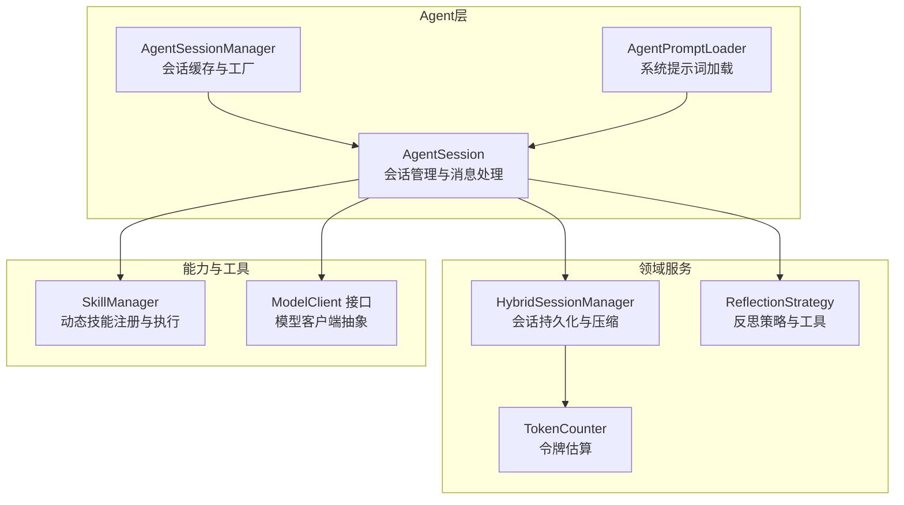
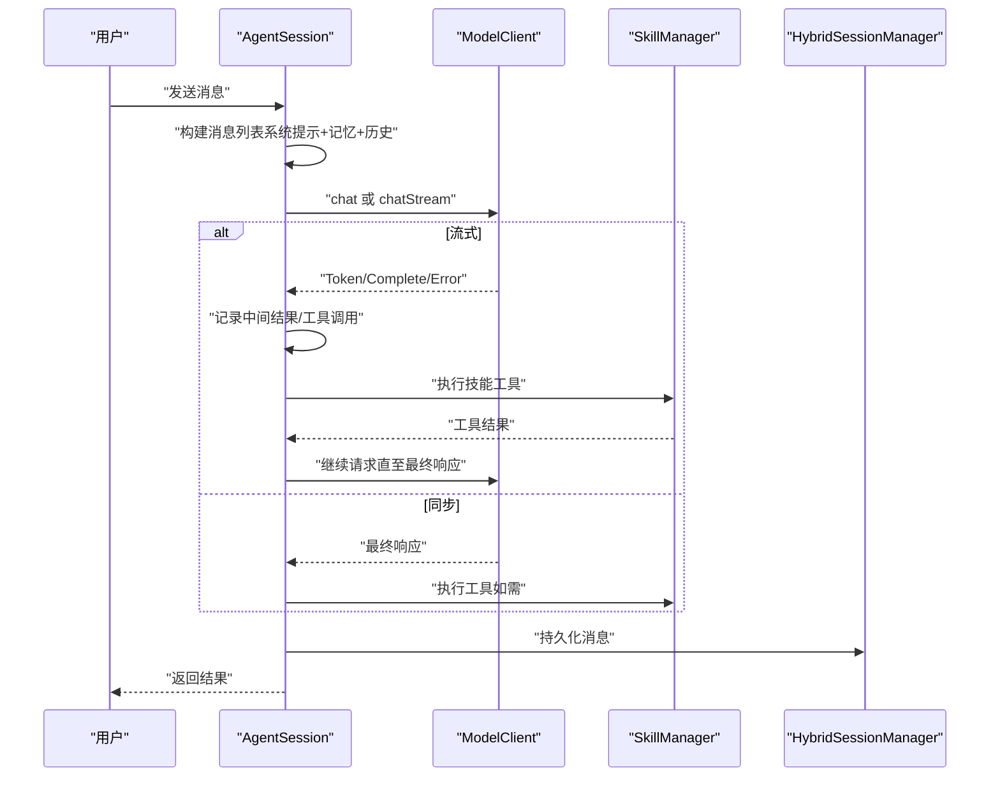
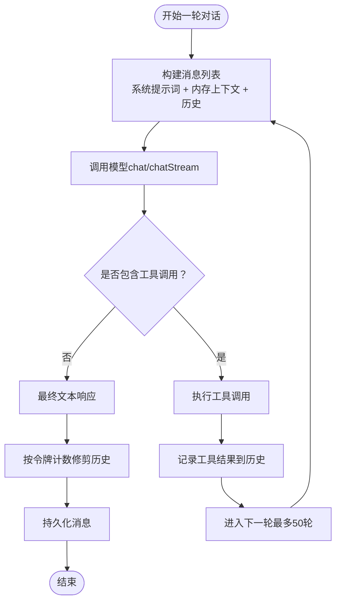
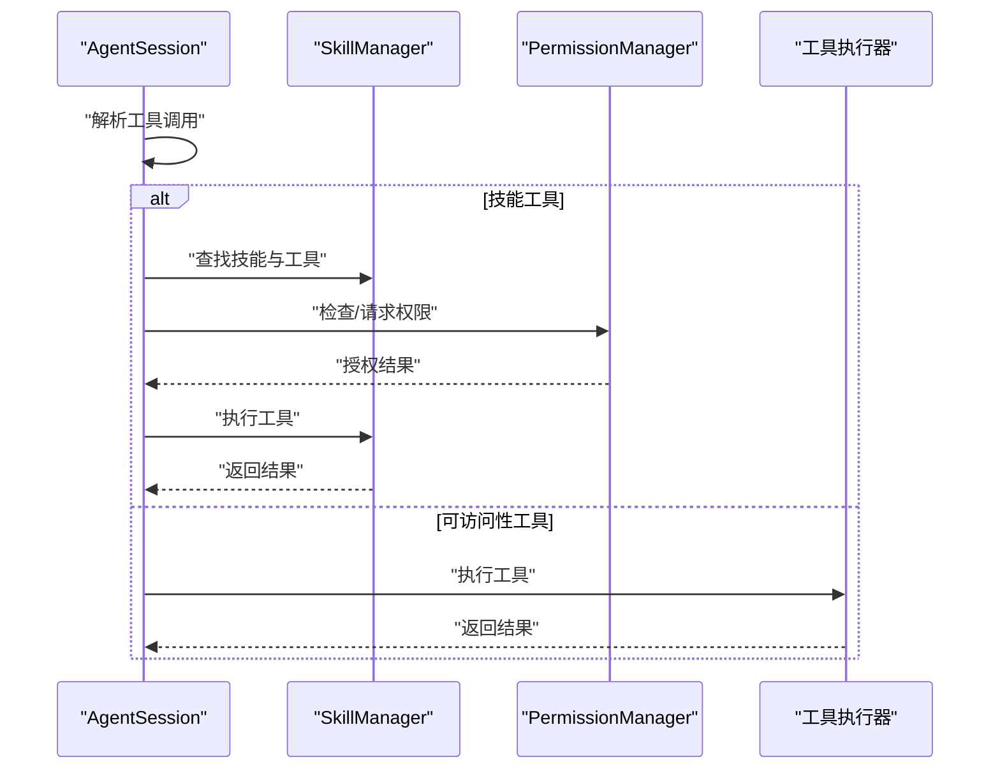
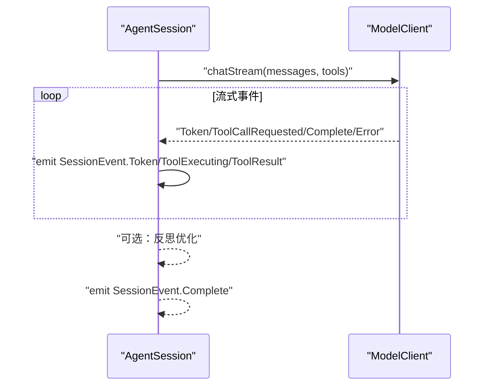
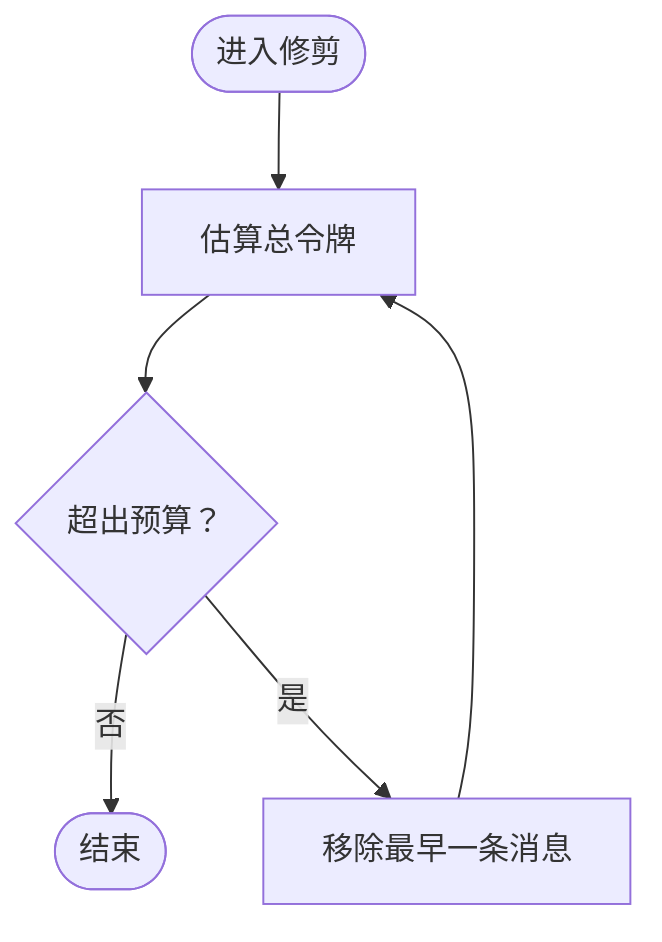
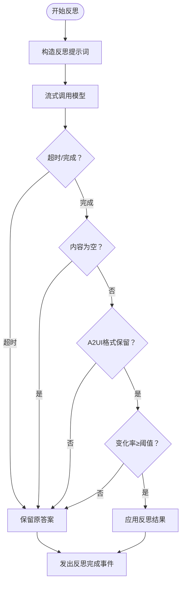
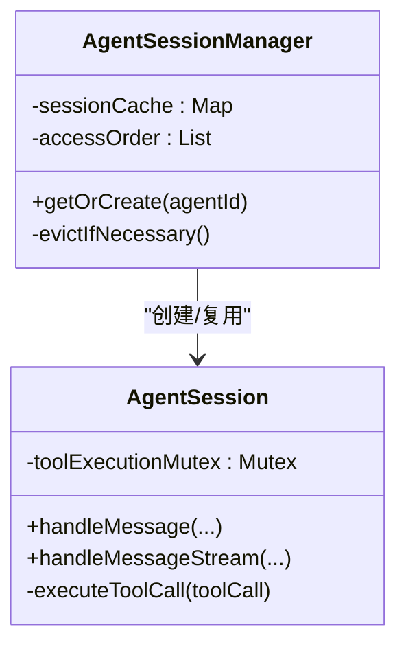
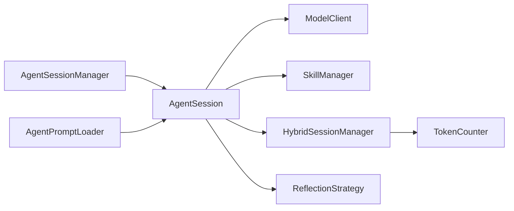

# AgentSession核心实现

<cite>
**本文引用的文件**
- [AgentSession.kt](file://app/src/main/java/ai/openclaw/android/agent/AgentSession.kt)
- [HybridSessionManager.kt](file://app/src/main/java/ai/openclaw/android/domain/session/HybridSessionManager.kt)
- [ReflectionStrategy.kt](file://app/src/main/java/ai/openclaw/android/domain/ReflectionStrategy.kt)
- [TokenCounter.kt](file://app/src/main/java/ai/openclaw/android/domain/session/TokenCounter.kt)
- [AgentSessionManager.kt](file://app/src/main/java/ai/openclaw/android/domain/agent/AgentSessionManager.kt)
- [SkillManager.kt](file://app/src/main/java/ai/openclaw/android/skill/SkillManager.kt)
- [AgentPromptLoader.kt](file://app/src/main/java/ai/openclaw/android/agent/AgentPromptLoader.kt)
- [ModelClient.kt](file://app/src/main/java/ai/openclaw/android/model/ModelClient.kt)
- [AgentSessionTest.kt](file://app/src/androidTest/java/ai/openclaw/android/agent/AgentSessionTest.kt)
- [AgentSessionFactoryTest.kt](file://app/src/test/java/ai/openclaw/android/agent/AgentSessionFactoryTest.kt)
- [MainActivity.kt](file://app/src/main/java/ai/openclaw/android/MainActivity.kt)
</cite>

## 目录
1. [简介](#简介)
2. [项目结构](#项目结构)
3. [核心组件](#核心组件)
4. [架构总览](#架构总览)
5. [详细组件分析](#详细组件分析)
6. [依赖关系分析](#依赖关系分析)
7. [性能考量](#性能考量)
8. [故障排查指南](#故障排查指南)
9. [结论](#结论)
10. [附录](#附录)

## 简介
本文件面向开发者与技术文档读者，系统化梳理 AgentSession 的核心实现与运行机制。重点涵盖：
- 对话历史管理与消息构建
- 工具调用执行流程与权限控制
- 同步与流式两种消息处理模式的差异与适用场景
- 对话状态机与最大轮次限制、令牌计数策略、历史修剪机制
- 反射机制（多轮自我改进）的实现与保护策略（超时、A2UI格式保护、变更阈值）
- 线程安全与互斥锁使用、协程调度策略
- 会话创建、消息处理、工具调用的具体实现路径
- 扩展 AgentSession 功能的最佳实践

## 项目结构
AgentSession 位于应用层 agent 包中，围绕会话生命周期、工具调用、内存与持久化、反思优化等模块协作运行。

图表来源
- [AgentSession.kt:35-106](file://app/src/main/java/ai/openclaw/android/agent/AgentSession.kt#L35-L106)
- [AgentSessionManager.kt:32-113](file://app/src/main/java/ai/openclaw/android/domain/agent/AgentSessionManager.kt#L32-L113)
- [HybridSessionManager.kt:31-41](file://app/src/main/java/ai/openclaw/android/domain/session/HybridSessionManager.kt#L31-L41)
- [ReflectionStrategy.kt:54-71](file://app/src/main/java/ai/openclaw/android/domain/ReflectionStrategy.kt#L54-L71)
- [SkillManager.kt:8-50](file://app/src/main/java/ai/openclaw/android/skill/SkillManager.kt#L8-L50)
- [ModelClient.kt:10-32](file://app/src/main/java/ai/openclaw/android/model/ModelClient.kt#L10-L32)

章节来源
- [AgentSession.kt:35-106](file://app/src/main/java/ai/openclaw/android/agent/AgentSession.kt#L35-L106)
- [AgentSessionManager.kt:32-113](file://app/src/main/java/ai/openclaw/android/domain/agent/AgentSessionManager.kt#L32-L113)

## 核心组件
- AgentSession：会话核心，负责消息构建、工具调用、历史修剪、反思优化、同步/流式处理。
- AgentSessionManager：多会话缓存与工厂，支持 LRU 淘汰、按 agentId 懒创建、共享本地模型客户端。
- HybridSessionManager：会话持久化、压缩、摘要缓存、记忆注入、上下文拼装。
- SkillManager：动态技能注册、工具参数转换、权限校验与执行。
- ModelClient：统一的模型接口，支持非流式 chat 与流式 chatStream。
- ReflectionStrategy：反思策略、配置与工具函数（超时、A2UI保护、变更率）。
- TokenCounter：粗略令牌估算，支撑历史修剪与会话压缩。
- AgentPromptLoader：系统提示词与代理“灵魂”提示词的外部文件加载与缓存。

章节来源
- [AgentSession.kt:299-362](file://app/src/main/java/ai/openclaw/android/agent/AgentSession.kt#L299-L362)
- [AgentSessionManager.kt:32-113](file://app/src/main/java/ai/openclaw/android/domain/agent/AgentSessionManager.kt#L32-L113)
- [HybridSessionManager.kt:31-110](file://app/src/main/java/ai/openclaw/android/domain/session/HybridSessionManager.kt#L31-L110)
- [SkillManager.kt:8-83](file://app/src/main/java/ai/openclaw/android/skill/SkillManager.kt#L8-L83)
- [ModelClient.kt:10-32](file://app/src/main/java/ai/openclaw/android/model/ModelClient.kt#L10-L32)
- [ReflectionStrategy.kt:54-92](file://app/src/main/java/ai/openclaw/android/domain/ReflectionStrategy.kt#L54-L92)
- [TokenCounter.kt:3-25](file://app/src/main/java/ai/openclaw/android/domain/session/TokenCounter.kt#L3-L25)
- [AgentPromptLoader.kt:19-77](file://app/src/main/java/ai/openclaw/android/agent/AgentPromptLoader.kt#L19-L77)

## 架构总览
AgentSession 作为会话中枢，串联模型客户端、技能管理器、会话持久化与反思策略，并通过工具过滤与权限控制保障安全性与可控性。

图表来源
- [AgentSession.kt:400-443](file://app/src/main/java/ai/openclaw/android/agent/AgentSession.kt#L400-L443)
- [AgentSession.kt:451-556](file://app/src/main/java/ai/openclaw/android/agent/AgentSession.kt#L451-L556)
- [ModelClient.kt:10-32](file://app/src/main/java/ai/openclaw/android/model/ModelClient.kt#L10-L32)
- [SkillManager.kt:62-83](file://app/src/main/java/ai/openclaw/android/skill/SkillManager.kt#L62-L83)
- [HybridSessionManager.kt:70-110](file://app/src/main/java/ai/openclaw/android/domain/session/HybridSessionManager.kt#L70-L110)

## 详细组件分析

### 会话状态机与消息构建
- 状态机由历史列表与当前轮次控制，最大轮次限制防止无限循环。
- 消息构建顺序：系统提示词（可自定义+设备能力增强）→ 内存上下文 → 历史消息。
- 令牌计数策略用于历史修剪与会话压缩，确保上下文长度在预算内。

图表来源
- [AgentSession.kt:410-443](file://app/src/main/java/ai/openclaw/android/agent/AgentSession.kt#L410-L443)
- [AgentSession.kt:460-556](file://app/src/main/java/ai/openclaw/android/agent/AgentSession.kt#L460-L556)
- [AgentSession.kt:643-661](file://app/src/main/java/ai/openclaw/android/agent/AgentSession.kt#L643-L661)
- [AgentSession.kt:667-683](file://app/src/main/java/ai/openclaw/android/agent/AgentSession.kt#L667-L683)

章节来源
- [AgentSession.kt:410-443](file://app/src/main/java/ai/openclaw/android/agent/AgentSession.kt#L410-L443)
- [AgentSession.kt:460-556](file://app/src/main/java/ai/openclaw/android/agent/AgentSession.kt#L460-L556)
- [AgentSession.kt:643-683](file://app/src/main/java/ai/openclaw/android/agent/AgentSession.kt#L643-L683)

### 工具调用执行流程与权限控制
- 工具类型区分：以“技能ID_工具名”的形式由 SkillManager 提供；其余工具走可访问性工具执行器。
- 权限检查：若为技能工具，先检查所需权限，必要时通过 PermissionManager 请求授权。
- 并发安全：工具执行使用互斥锁，确保同一时刻仅有一个工具执行，避免竞态。

图表来源
- [AgentSession.kt:582-639](file://app/src/main/java/ai/openclaw/android/agent/AgentSession.kt#L582-L639)
- [SkillManager.kt:89-107](file://app/src/main/java/ai/openclaw/android/skill/SkillManager.kt#L89-L107)

章节来源
- [AgentSession.kt:582-639](file://app/src/main/java/ai/openclaw/android/agent/AgentSession.kt#L582-L639)
- [SkillManager.kt:89-107](file://app/src/main/java/ai/openclaw/android/skill/SkillManager.kt#L89-L107)

### 同步与流式两种消息处理模式
- 同步模式（handleMessage）：适合一次性返回、简单交互，内部循环直到无工具调用或达到最大轮次。
- 流式模式（handleMessageStream）：实时产出 Token、工具执行事件与最终 Complete，适合长文本与工具链反馈。
- 两者均支持反思优化（当启用时），并在流式模式中提供反思开始/完成事件。

图表来源
- [AgentSession.kt:451-556](file://app/src/main/java/ai/openclaw/android/agent/AgentSession.kt#L451-L556)
- [ModelClient.kt:37-49](file://app/src/main/java/ai/openclaw/android/model/ModelClient.kt#L37-L49)

章节来源
- [AgentSession.kt:400-443](file://app/src/main/java/ai/openclaw/android/agent/AgentSession.kt#L400-L443)
- [AgentSession.kt:451-556](file://app/src/main/java/ai/openclaw/android/agent/AgentSession.kt#L451-L556)

### 对话状态机、最大轮次与历史修剪
- 最大轮次：单次会话最多 50 轮工具调用，防止死循环。
- 历史修剪：基于令牌估算（CJK≈1.3 tokens/字符，ASCII≈0.25 tokens/字符）逐条移除最旧消息，直到不超过预算。
- 令牌计数：会话持久化与压缩同样使用 TokenCounter 估算，保障数据库与摘要长度可控。

图表来源
- [AgentSession.kt:667-683](file://app/src/main/java/ai/openclaw/android/agent/AgentSession.kt#L667-L683)
- [TokenCounter.kt:8-15](file://app/src/main/java/ai/openclaw/android/domain/session/TokenCounter.kt#L8-L15)
- [HybridSessionManager.kt:236-299](file://app/src/main/java/ai/openclaw/android/domain/session/HybridSessionManager.kt#L236-L299)

章节来源
- [AgentSession.kt:667-683](file://app/src/main/java/ai/openclaw/android/agent/AgentSession.kt#L667-L683)
- [TokenCounter.kt:8-15](file://app/src/main/java/ai/openclaw/android/domain/session/TokenCounter.kt#L8-L15)
- [HybridSessionManager.kt:236-299](file://app/src/main/java/ai/openclaw/android/domain/session/HybridSessionManager.kt#L236-L299)

### 反射机制（多轮自我改进）与保护策略
- 策略枚举：NONE/LIGHT，默认关闭，按需开启。
- 配置项：超时（毫秒）、最小变化率阈值、A2UI 格式保护开关。
- 实现要点：
  - 单轮超时保护：使用 withTimeoutOrNull。
  - 空内容拒绝：拒绝将空字符串覆盖已有答案。
  - A2UI 格式保护：对比反思前后是否保留 [A2UI]/[/A2UI] 标记。
  - 变化率早停：低于阈值直接返回原答案。
- 事件：流式模式下发出反思开始/完成事件，便于 UI 呈现。

图表来源
- [ReflectionStrategy.kt:54-92](file://app/src/main/java/ai/openclaw/android/domain/ReflectionStrategy.kt#L54-L92)
- [AgentSession.kt:725-789](file://app/src/main/java/ai/openclaw/android/agent/AgentSession.kt#L725-L789)

章节来源
- [ReflectionStrategy.kt:54-92](file://app/src/main/java/ai/openclaw/android/domain/ReflectionStrategy.kt#L54-L92)
- [AgentSession.kt:725-789](file://app/src/main/java/ai/openclaw/android/agent/AgentSession.kt#L725-L789)

### 线程安全、互斥锁与协程调度
- 工具执行互斥：使用 Mutex 保证并发安全，避免工具竞争。
- 协程调度：工具执行切换至 IO 上下文，流式处理使用默认调度器。
- 会话缓存：AgentSessionManager 使用 LRU 策略，避免内存膨胀。

图表来源
- [AgentSession.kt:262](file://app/src/main/java/ai/openclaw/android/agent/AgentSession.kt#L262)
- [AgentSession.kt:582-639](file://app/src/main/java/ai/openclaw/android/agent/AgentSession.kt#L582-L639)
- [AgentSessionManager.kt:62-113](file://app/src/main/java/ai/openclaw/android/domain/agent/AgentSessionManager.kt#L62-L113)

章节来源
- [AgentSession.kt:262](file://app/src/main/java/ai/openclaw/android/agent/AgentSession.kt#L262)
- [AgentSession.kt:582-639](file://app/src/main/java/ai/openclaw/android/agent/AgentSession.kt#L582-L639)
- [AgentSessionManager.kt:62-113](file://app/src/main/java/ai/openclaw/android/domain/agent/AgentSessionManager.kt#L62-L113)

### 会话创建、消息处理与工具调用示例路径
- 会话创建与初始化
  - 通过 AgentSessionManager 按 agentId 获取或创建会话，设置系统提示词与工具集。
  - 示例路径：[AgentSessionManager.kt:72-113](file://app/src/main/java/ai/openclaw/android/domain/agent/AgentSessionManager.kt#L72-L113)
- 同步消息处理
  - 调用 handleMessage，内部循环工具调用直至结束。
  - 示例路径：[AgentSession.kt:400-443](file://app/src/main/java/ai/openclaw/android/agent/AgentSession.kt#L400-L443)
- 流式消息处理
  - 调用 handleMessageStream，实时发射事件并支持反思。
  - 示例路径：[AgentSession.kt:451-556](file://app/src/main/java/ai/openclaw/android/agent/AgentSession.kt#L451-L556)
- 工具调用执行
  - executeToolCall 内部区分技能工具与可访问性工具，权限检查与互斥执行。
  - 示例路径：[AgentSession.kt:582-639](file://app/src/main/java/ai/openclaw/android/agent/AgentSession.kt#L582-L639)
- UI 事件消费
  - MainActivity 中消费 SessionEvent，更新消息列表与 UI。
  - 示例路径：[MainActivity.kt:399-422](file://app/src/main/java/ai/openclaw/android/MainActivity.kt#L399-L422)

章节来源
- [AgentSessionManager.kt:72-113](file://app/src/main/java/ai/openclaw/android/domain/agent/AgentSessionManager.kt#L72-L113)
- [AgentSession.kt:400-443](file://app/src/main/java/ai/openclaw/android/agent/AgentSession.kt#L400-L443)
- [AgentSession.kt:451-556](file://app/src/main/java/ai/openclaw/android/agent/AgentSession.kt#L451-L556)
- [AgentSession.kt:582-639](file://app/src/main/java/ai/openclaw/android/agent/AgentSession.kt#L582-L639)
- [MainActivity.kt:399-422](file://app/src/main/java/ai/openclaw/android/MainActivity.kt#L399-L422)

## 依赖关系分析
- 组件耦合
  - AgentSession 依赖 ModelClient、SkillManager、HybridSessionManager、ReflectionStrategy、TokenCounter。
  - AgentSessionManager 作为工厂与缓存中心，解耦上层对具体会话实例的管理。
- 外部集成点
  - ModelClient 抽象屏蔽不同提供商（OpenAI/Anthropic/本地）差异。
  - AgentPromptLoader 提供外部可编辑的系统提示词，便于快速迭代。

图表来源
- [AgentSessionManager.kt:32-113](file://app/src/main/java/ai/openclaw/android/domain/agent/AgentSessionManager.kt#L32-L113)
- [AgentSession.kt:35-106](file://app/src/main/java/ai/openclaw/android/agent/AgentSession.kt#L35-L106)
- [HybridSessionManager.kt:31-41](file://app/src/main/java/ai/openclaw/android/domain/session/HybridSessionManager.kt#L31-L41)
- [ReflectionStrategy.kt:54-71](file://app/src/main/java/ai/openclaw/android/domain/ReflectionStrategy.kt#L54-L71)
- [AgentPromptLoader.kt:19-77](file://app/src/main/java/ai/openclaw/android/agent/AgentPromptLoader.kt#L19-L77)

章节来源
- [AgentSessionManager.kt:32-113](file://app/src/main/java/ai/openclaw/android/domain/agent/AgentSessionManager.kt#L32-L113)
- [AgentSession.kt:35-106](file://app/src/main/java/ai/openclaw/android/agent/AgentSession.kt#L35-L106)
- [HybridSessionManager.kt:31-41](file://app/src/main/java/ai/openclaw/android/domain/session/HybridSessionManager.kt#L31-L41)
- [ReflectionStrategy.kt:54-71](file://app/src/main/java/ai/openclaw/android/domain/ReflectionStrategy.kt#L54-L71)
- [AgentPromptLoader.kt:19-77](file://app/src/main/java/ai/openclaw/android/agent/AgentPromptLoader.kt#L19-L77)

## 性能考量
- 令牌估算与历史修剪：在消息进入前进行内存上下文刷新与令牌估算，避免越界。
- 会话压缩：HybridSessionManager 基于摘要与最近消息组合，减少数据库压力。
- 流式处理：边生成边输出，降低首帧延迟，提升交互体验。
- 工具执行互斥：避免并发工具竞争带来的额外开销与不确定性。

## 故障排查指南
- 流式无 Complete：若流结束但未收到 Complete 事件，AgentSession 仍会以已接收 Token 作为最终文本并发出 Complete。
  - 参考路径：[AgentSession.kt:484-496](file://app/src/main/java/ai/openclaw/android/agent/AgentSession.kt#L484-L496)
- 模型错误传播：流式过程中出现错误事件会直接发出 Error，上层应捕获并提示用户。
  - 参考路径：[AgentSession.kt:474-477](file://app/src/main/java/ai/openclaw/android/agent/AgentSession.kt#L474-L477)
- 工具执行失败：技能工具返回错误信息或权限不足时，AgentSession 会记录日志并继续流程。
  - 参考路径：[AgentSession.kt:617-624](file://app/src/main/java/ai/openclaw/android/agent/AgentSession.kt#L617-L624)
- 反思异常：反思过程中抛出异常将回退到原答案，确保稳定性。
  - 参考路径：[AgentSession.kt:785-788](file://app/src/main/java/ai/openclaw/android/agent/AgentSession.kt#L785-L788)

章节来源
- [AgentSession.kt:484-496](file://app/src/main/java/ai/openclaw/android/agent/AgentSession.kt#L484-L496)
- [AgentSession.kt:474-477](file://app/src/main/java/ai/openclaw/android/agent/AgentSession.kt#L474-L477)
- [AgentSession.kt:617-624](file://app/src/main/java/ai/openclaw/android/agent/AgentSession.kt#L617-L624)
- [AgentSession.kt:785-788](file://app/src/main/java/ai/openclaw/android/agent/AgentSession.kt#L785-L788)

## 结论
AgentSession 通过清晰的状态机、严谨的历史修剪与令牌计数、完善的工具执行与权限控制、以及可选的反思优化，实现了稳定高效的多轮对话能力。其与 HybridSessionManager、SkillManager、ReflectionStrategy 等模块协同，既满足了移动端资源约束下的性能需求，又提供了灵活的扩展空间。

## 附录

### 最佳实践建议
- 工具过滤：通过 AgentConfig 的 tools 字段限制工具前缀，避免过度开放。
  - 参考路径：[AgentSessionFactoryTest.kt:48-89](file://app/src/test/java/ai/openclaw/android/agent/AgentSessionFactoryTest.kt#L48-L89)
- 反思策略：默认关闭，仅在高价值场景启用 LIGHT 策略，并合理设置超时与阈值。
  - 参考路径：[ReflectionStrategy.kt:54-71](file://app/src/main/java/ai/openclaw/android/domain/ReflectionStrategy.kt#L54-L71)
- 线程安全：工具执行务必使用互斥锁；耗时操作置于 IO 调度器。
  - 参考路径：[AgentSession.kt:582-639](file://app/src/main/java/ai/openclaw/android/agent/AgentSession.kt#L582-L639)
- 会话缓存：合理设置 AgentSessionManager 的缓存上限，避免内存占用过高。
  - 参考路径：[AgentSessionManager.kt:62-113](file://app/src/main/java/ai/openclaw/android/domain/agent/AgentSessionManager.kt#L62-L113)
- 提示词管理：使用 AgentPromptLoader 从外部文件加载提示词，便于快速迭代。
  - 参考路径：[AgentPromptLoader.kt:19-77](file://app/src/main/java/ai/openclaw/android/agent/AgentPromptLoader.kt#L19-L77)