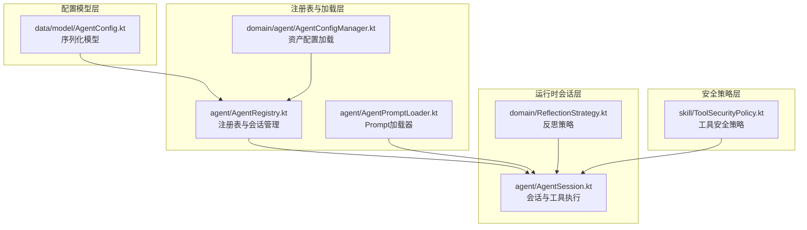
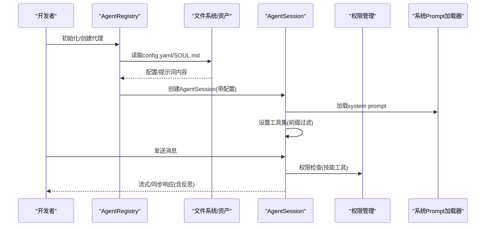
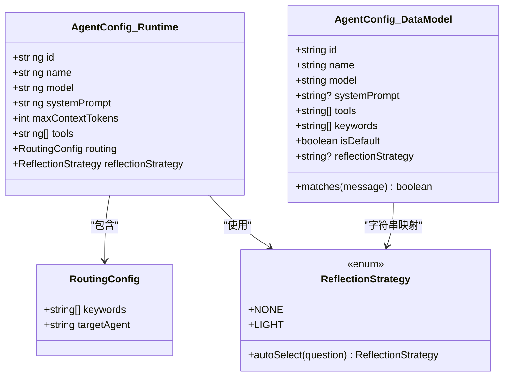
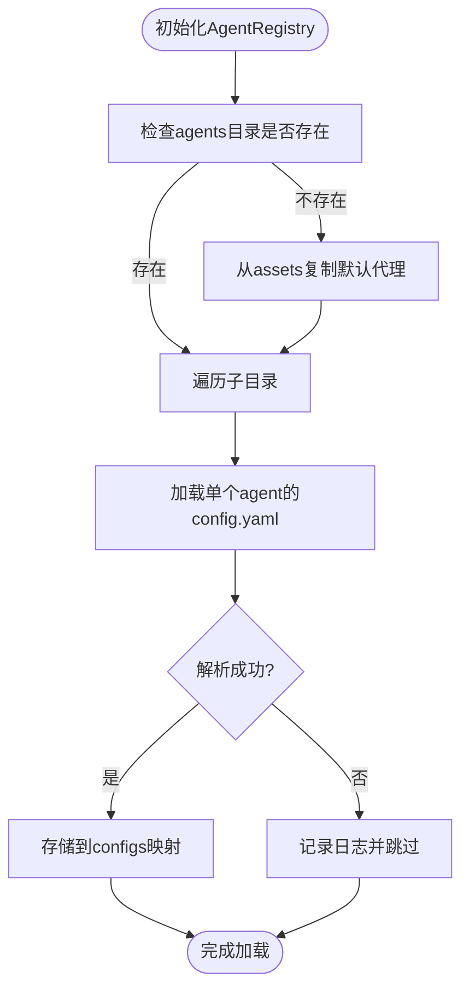
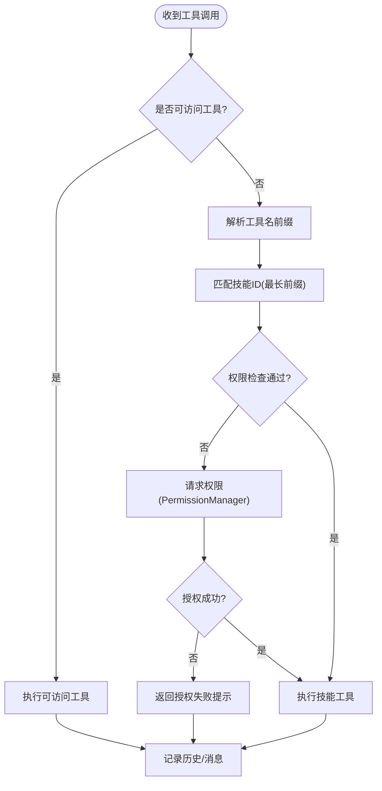
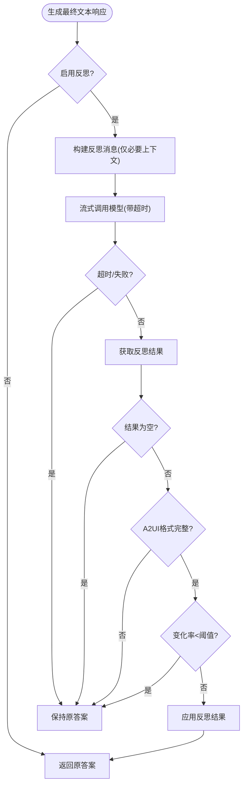
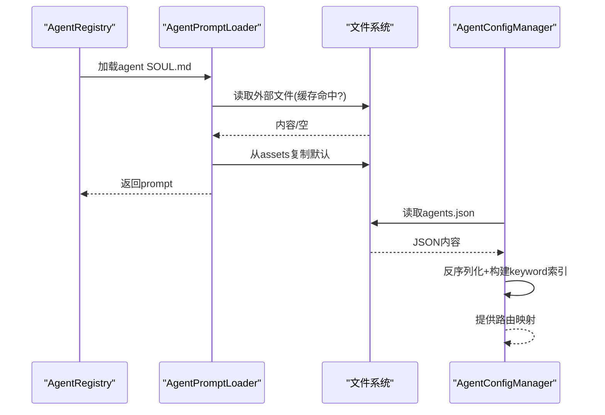
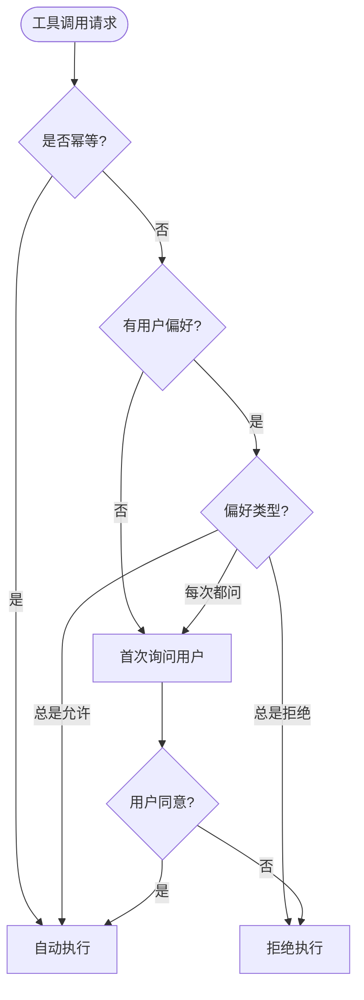
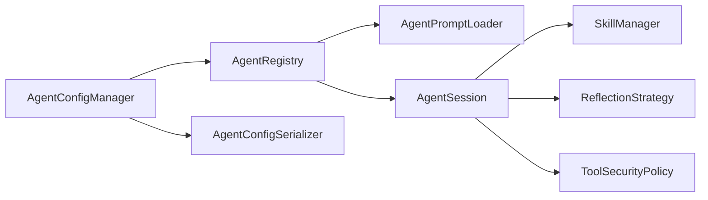

# Agent配置系统

<cite>
**本文档引用的文件**
- [AgentConfig.kt](file://app/src/main/java/ai/openclaw/android/config/AgentConfig.kt)
- [AgentRegistry.kt](file://app/src/main/java/ai/openclaw/android/agent/AgentRegistry.kt)
- [AgentConfigManager.kt](file://app/src/main/java/ai/openclaw/android/domain/agent/AgentConfigManager.kt)
- [ReflectionStrategy.kt](file://app/src/main/java/ai/openclaw/android/domain/ReflectionStrategy.kt)
- [AgentSession.kt](file://app/src/main/java/ai/openclaw/android/agent/AgentSession.kt)
- [AgentConfig.kt](file://app/src/main/java/ai/openclaw/android/data/model/AgentConfig.kt)
- [AgentPromptLoader.kt](file://app/src/main/java/ai/openclaw/android/agent/AgentPromptLoader.kt)
- [ToolSecurityPolicy.kt](file://app/src/main/java/ai/openclaw/android/skill/ToolSecurityPolicy.kt)
- [config.yaml](file://app/src/main/assets/agents/main/config.yaml)
- [AgentConfigTest.kt](file://app/src/test/java/ai/openclaw/android/data/model/AgentConfigTest.kt)
</cite>

## 目录
1. [简介](#简介)
2. [项目结构](#项目结构)
3. [核心组件](#核心组件)
4. [架构总览](#架构总览)
5. [详细组件分析](#详细组件分析)
6. [依赖关系分析](#依赖关系分析)
7. [性能考量](#性能考量)
8. [故障排查指南](#故障排查指南)
9. [结论](#结论)
10. [附录](#附录)

## 简介
本文件系统性阐述OpenClaw Android项目中的Agent配置系统，涵盖AgentConfig数据结构设计与配置项、工具权限控制、上下文令牌限制、反射策略配置；AgentRegistry代理注册表的实现原理（代理实例管理、生命周期控制、动态配置更新机制）；配置文件加载与验证流程（默认值设置、参数校验、错误处理策略）；工具前缀过滤机制及其安全考虑；配置示例与最佳实践；以及热更新实现方式与注意事项。

## 项目结构
Agent配置系统主要分布在以下模块：
- 配置模型层：定义AgentConfig与AgentRegistry的序列化模型
- 运行时会话层：AgentSession负责对话、工具执行、反射策略
- 注册表与加载层：AgentRegistry负责配置加载、会话创建与热更新；AgentPromptLoader负责system prompt加载
- 反射策略层：ReflectionStrategy定义反思策略与配置
- 安全策略层：ToolSecurityPolicy定义工具安全策略与用户审批偏好

**图表来源**
- [AgentConfig.kt:1-57](file://app/src/main/java/ai/openclaw/android/data/model/AgentConfig.kt#L1-L57)
- [AgentRegistry.kt:1-246](file://app/src/main/java/ai/openclaw/android/agent/AgentRegistry.kt#L1-L246)
- [AgentSession.kt:1-819](file://app/src/main/java/ai/openclaw/android/agent/AgentSession.kt#L1-L819)
- [AgentPromptLoader.kt:1-284](file://app/src/main/java/ai/openclaw/android/agent/AgentPromptLoader.kt#L1-L284)
- [AgentConfigManager.kt:1-88](file://app/src/main/java/ai/openclaw/android/domain/agent/AgentConfigManager.kt#L1-L88)
- [ReflectionStrategy.kt:1-175](file://app/src/main/java/ai/openclaw/android/domain/ReflectionStrategy.kt#L1-L175)
- [ToolSecurityPolicy.kt:1-72](file://app/src/main/java/ai/openclaw/android/skill/ToolSecurityPolicy.kt#L1-L72)

**章节来源**
- [AgentRegistry.kt:1-246](file://app/src/main/java/ai/openclaw/android/agent/AgentRegistry.kt#L1-L246)
- [AgentSession.kt:1-819](file://app/src/main/java/ai/openclaw/android/agent/AgentSession.kt#L1-L819)
- [AgentConfig.kt:1-57](file://app/src/main/java/ai/openclaw/android/data/model/AgentConfig.kt#L1-L57)
- [AgentPromptLoader.kt:1-284](file://app/src/main/java/ai/openclaw/android/agent/AgentPromptLoader.kt#L1-L284)
- [AgentConfigManager.kt:1-88](file://app/src/main/java/ai/openclaw/android/domain/agent/AgentConfigManager.kt#L1-L88)
- [ReflectionStrategy.kt:1-175](file://app/src/main/java/ai/openclaw/android/domain/ReflectionStrategy.kt#L1-L175)
- [ToolSecurityPolicy.kt:1-72](file://app/src/main/java/ai/openclaw/android/skill/ToolSecurityPolicy.kt#L1-L72)

## 核心组件
- AgentConfig（运行时配置）：包含id、name、model、systemPrompt、maxContextTokens、tools、routing、reflectionStrategy等字段，用于描述单个代理的行为与约束。
- AgentConfig（数据模型）：用于资产配置agents.json的序列化模型，包含id、name、model、systemPrompt、tools、keywords、isDefault、reflectionStrategy等字段。
- AgentRegistry：负责从磁盘/资产加载配置、创建AgentSession、管理会话生命周期、支持热重载。
- AgentSession：承载一次对话的上下文、工具集、权限检查、反射策略执行、历史修剪与持久化。
- ReflectionStrategy：定义反思策略枚举、配置与工具函数，确保反思过程的安全与可控。
- AgentPromptLoader：从外部文件或资产加载system prompt与agent soul prompt，支持缓存与热更新。
- ToolSecurityPolicy：定义工具安全策略与用户审批偏好，支撑工具执行前的安全审查。

**章节来源**
- [AgentConfig.kt:5-21](file://app/src/main/java/ai/openclaw/android/config/AgentConfig.kt#L5-L21)
- [AgentConfig.kt:10-34](file://app/src/main/java/ai/openclaw/android/data/model/AgentConfig.kt#L10-L34)
- [AgentRegistry.kt:21-246](file://app/src/main/java/ai/openclaw/android/agent/AgentRegistry.kt#L21-L246)
- [AgentSession.kt:35-103](file://app/src/main/java/ai/openclaw/android/agent/AgentSession.kt#L35-L103)
- [ReflectionStrategy.kt:18-49](file://app/src/main/java/ai/openclaw/android/domain/ReflectionStrategy.kt#L18-L49)
- [AgentPromptLoader.kt:19-138](file://app/src/main/java/ai/openclaw/android/agent/AgentPromptLoader.kt#L19-L138)
- [ToolSecurityPolicy.kt:6-72](file://app/src/main/java/ai/openclaw/android/skill/ToolSecurityPolicy.kt#L6-L72)

## 架构总览
Agent配置系统围绕“配置加载—会话创建—运行时执行—反思优化—持久化”的主链路展开。配置既可来自磁盘YAML（AgentRegistry），也可来自资产JSON（AgentConfigManager）。运行时AgentSession根据配置进行工具过滤、权限检查、反思策略执行与历史修剪。

**图表来源**
- [AgentRegistry.kt:146-213](file://app/src/main/java/ai/openclaw/android/agent/AgentRegistry.kt#L146-L213)
- [AgentSession.kt:299-362](file://app/src/main/java/ai/openclaw/android/agent/AgentSession.kt#L299-L362)
- [AgentPromptLoader.kt:107-138](file://app/src/main/java/ai/openclaw/android/agent/AgentPromptLoader.kt#L107-L138)

## 详细组件分析

### AgentConfig数据结构与配置项
- 运行时配置（config/AgentConfig.kt）：包含id、name、model、systemPrompt、maxContextTokens、tools、routing、reflectionStrategy。其中tools为空列表表示禁用工具，包含"all"表示不限制；reflectionStrategy默认NONE。
- 数据模型（data/model/AgentConfig.kt）：用于agents.json的序列化模型，包含id、name、model、systemPrompt、tools、keywords、isDefault、reflectionStrategy。tools默认为["all"]，keywords用于路由匹配。

**图表来源**
- [AgentConfig.kt:5-21](file://app/src/main/java/ai/openclaw/android/config/AgentConfig.kt#L5-L21)
- [AgentConfig.kt:10-34](file://app/src/main/java/ai/openclaw/android/data/model/AgentConfig.kt#L10-L34)
- [ReflectionStrategy.kt:18-49](file://app/src/main/java/ai/openclaw/android/domain/ReflectionStrategy.kt#L18-L49)

**章节来源**
- [AgentConfig.kt:5-21](file://app/src/main/java/ai/openclaw/android/config/AgentConfig.kt#L5-L21)
- [AgentConfig.kt:10-34](file://app/src/main/java/ai/openclaw/android/data/model/AgentConfig.kt#L10-L34)

### AgentRegistry代理注册表
- 目录结构：/sdcard/Android/data/<pkg>/files/agents/<agentId>/config.yaml与SOUL.md。
- 加载流程：首次启动若目录不存在则从assets复制默认代理；遍历agents目录加载每个agent的config.yaml。
- 会话管理：getSession按需创建AgentSession；reloadAll与reloadAgent支持热重载；deleteAgent防止删除默认代理。
- 创建代理：createAgent生成默认config.yaml与SOUL.md，并加入内存配置。

**图表来源**
- [AgentRegistry.kt:146-191](file://app/src/main/java/ai/openclaw/android/agent/AgentRegistry.kt#L146-L191)

**章节来源**
- [AgentRegistry.kt:21-246](file://app/src/main/java/ai/openclaw/android/agent/AgentRegistry.kt#L21-L246)

### AgentSession会话与工具前缀过滤
- 工具前缀过滤：当_agentAllowedToolPrefixes为null时不进行过滤（兼容"all"），否则仅保留以指定前缀开头的工具名。
- 技能工具执行：根据工具名最长前缀匹配技能ID，检查权限并通过PermissionManager请求授权。
- 反射策略：根据配置与问题复杂度选择策略，执行前轻量检查，超时保护、A2UI格式保护、早停阈值。
- 历史修剪：按token估算进行上下文修剪，保证maxContextTokens上限。

**图表来源**
- [AgentSession.kt:582-639](file://app/src/main/java/ai/openclaw/android/agent/AgentSession.kt#L582-L639)

**章节来源**
- [AgentSession.kt:299-362](file://app/src/main/java/ai/openclaw/android/agent/AgentSession.kt#L299-L362)
- [AgentSession.kt:582-639](file://app/src/main/java/ai/openclaw/android/agent/AgentSession.kt#L582-L639)

### 反射策略配置与执行
- 策略枚举：NONE（默认）、LIGHT（轻量反思）。
- 自动选择：根据问题长度与关键词自动选择策略，避免对简单查询进行反思。
- 配置项：timeoutMs（单轮超时）、minChangeRate（最小变化率阈值）、protectA2UI（A2UI格式保护）。
- 执行保护：空内容拒绝、A2UI完整性检查、变化率早停、异常回退原答案。

**图表来源**
- [AgentSession.kt:500-556](file://app/src/main/java/ai/openclaw/android/agent/AgentSession.kt#L500-L556)
- [ReflectionStrategy.kt:54-92](file://app/src/main/java/ai/openclaw/android/domain/ReflectionStrategy.kt#L54-L92)

**章节来源**
- [ReflectionStrategy.kt:18-49](file://app/src/main/java/ai/openclaw/android/domain/ReflectionStrategy.kt#L18-L49)
- [AgentSession.kt:500-556](file://app/src/main/java/ai/openclaw/android/agent/AgentSession.kt#L500-L556)

### Prompt加载与热更新
- 全局system prompt：优先从外部文件加载，不存在则从assets复制默认；支持reload强制刷新。
- Agent soul prompt：按agentId加载SOUL.md，支持缓存与热更新。
- 资产配置加载：AgentConfigManager从assets读取agents.json，构建keyword索引用于路由。

**图表来源**
- [AgentPromptLoader.kt:40-138](file://app/src/main/java/ai/openclaw/android/agent/AgentPromptLoader.kt#L40-L138)
- [AgentConfigManager.kt:25-86](file://app/src/main/java/ai/openclaw/android/domain/agent/AgentConfigManager.kt#L25-L86)

**章节来源**
- [AgentPromptLoader.kt:19-138](file://app/src/main/java/ai/openclaw/android/agent/AgentPromptLoader.kt#L19-L138)
- [AgentConfigManager.kt:12-86](file://app/src/main/java/ai/openclaw/android/domain/agent/AgentConfigManager.kt#L12-L86)

### 工具安全策略与权限控制
- ToolSecurityPolicy：AUTO_EXECUTE（幂等）、ASK_USER（首次询问）、DENY（拒绝）。
- 用户审批偏好：ALWAYS_APPROVE、ALWAYS_DENY、ASK_EVERY_TIME。
- SecurityReview：综合工具幂等性与用户偏好决定执行策略。
- AgentSession：对技能工具执行前进行权限检查，必要时请求授权。

**图表来源**
- [ToolSecurityPolicy.kt:44-71](file://app/src/main/java/ai/openclaw/android/skill/ToolSecurityPolicy.kt#L44-L71)
- [AgentSession.kt:598-615](file://app/src/main/java/ai/openclaw/android/agent/AgentSession.kt#L598-L615)

**章节来源**
- [ToolSecurityPolicy.kt:6-72](file://app/src/main/java/ai/openclaw/android/skill/ToolSecurityPolicy.kt#L6-L72)
- [AgentSession.kt:598-615](file://app/src/main/java/ai/openclaw/android/agent/AgentSession.kt#L598-L615)

## 依赖关系分析
- AgentRegistry依赖AgentPromptLoader加载system prompt、SnakeYAML解析config.yaml、AgentSession工厂方法创建会话。
- AgentSession依赖SkillManager获取技能工具、PermissionManager进行权限检查、ReflectionStrategy执行反思。
- AgentConfigManager依赖AgentConfigSerializer与AgentRegistry进行资产配置加载与路由索引构建。
- ToolSecurityPolicy作为横切关注点被AgentSession与SkillManager共同使用。

**图表来源**
- [AgentRegistry.kt:21-26](file://app/src/main/java/ai/openclaw/android/agent/AgentRegistry.kt#L21-L26)
- [AgentSession.kt:35-40](file://app/src/main/java/ai/openclaw/android/agent/AgentSession.kt#L35-L40)
- [AgentConfigManager.kt:12-29](file://app/src/main/java/ai/openclaw/android/domain/agent/AgentConfigManager.kt#L12-L29)

**章节来源**
- [AgentRegistry.kt:21-26](file://app/src/main/java/ai/openclaw/android/agent/AgentRegistry.kt#L21-L26)
- [AgentSession.kt:35-40](file://app/src/main/java/ai/openclaw/android/agent/AgentSession.kt#L35-L40)
- [AgentConfigManager.kt:12-29](file://app/src/main/java/ai/openclaw/android/domain/agent/AgentConfigManager.kt#L12-L29)

## 性能考量
- 工具过滤：前缀匹配在技能工具较多时仍具备线性复杂度，建议合理划分工具前缀以减少匹配成本。
- 历史修剪：按字符估算token，CJK与ASCII估算不同，建议结合实际模型tokenizer进行更精确估计。
- 反射策略：单轮超时与早停阈值有效控制反思开销，避免对简单问题进行反思。
- Prompt缓存：AgentPromptLoader对全局与agent级prompt均做缓存，减少IO开销。
- 热更新：reloadAll与reloadAgent会清理现有会话并重建，注意在活跃会话期间谨慎使用。

[本节为通用指导，无需特定文件来源]

## 故障排查指南
- 配置解析失败：AgentRegistry在解析config.yaml时捕获异常并返回null，检查YAML格式与字段类型。
- 代理不存在：getSession找不到agentId时回退默认代理，若默认也不存在则抛出异常，检查agents目录与config.yaml。
- Prompt加载失败：AgentPromptLoader优先外部文件，不存在则从assets复制默认；若assets也缺失则使用兜底prompt。
- 工具执行失败：AgentSession在执行技能工具前进行权限检查，若未授权返回提示；检查权限管理与工具前缀配置。
- 反射异常：runReflectionWithProtection对空内容、A2UI完整性、变化率与异常进行保护，确保不覆盖原答案。

**章节来源**
- [AgentRegistry.kt:176-191](file://app/src/main/java/ai/openclaw/android/agent/AgentRegistry.kt#L176-L191)
- [AgentSession.kt:598-615](file://app/src/main/java/ai/openclaw/android/agent/AgentSession.kt#L598-L615)
- [AgentPromptLoader.kt:69-134](file://app/src/main/java/ai/openclaw/android/agent/AgentPromptLoader.kt#L69-L134)

## 结论
Agent配置系统通过清晰的分层设计实现了灵活的代理管理与运行时控制。AgentRegistry负责配置加载与会话生命周期，AgentSession承载对话与工具执行，ReflectionStrategy提供安全可控的反思机制，Prompt加载器支持热更新与多代理独立提示词。工具前缀过滤与安全策略共同保障了执行安全与性能平衡。建议在生产环境中配合严格的权限控制与监控，持续优化反思策略与历史修剪策略以提升用户体验与系统稳定性。

[本节为总结，无需特定文件来源]

## 附录

### 配置文件示例与说明
- 运行时配置（YAML）：位于agents/<agentId>/config.yaml，包含id、name、model、maxContextTokens、tools等字段。
- 资产配置（JSON）：位于assets/agents.json，包含agents数组，每项包含id、name、model、systemPrompt、tools、keywords、isDefault、reflectionStrategy等字段。
- 示例参考：main代理配置展示了常用工具列表与上下文令牌限制。

**章节来源**
- [config.yaml:1-11](file://app/src/main/assets/agents/main/config.yaml#L1-L11)
- [AgentConfigTest.kt:53-92](file://app/src/test/java/ai/openclaw/android/data/model/AgentConfigTest.kt#L53-L92)

### 配置热更新实现与注意事项
- AgentRegistry：reloadAll清空configs与sessions并重新加载；reloadAgent仅重载指定agent并移除旧会话。
- AgentPromptLoader：load与loadForAgent支持缓存，reload/reloadAgent强制刷新缓存。
- 注意事项：热更新会重建AgentSession，可能中断正在进行的对话；建议在低峰时段或用户确认后执行。

**章节来源**
- [AgentRegistry.kt:126-142](file://app/src/main/java/ai/openclaw/android/agent/AgentRegistry.kt#L126-L142)
- [AgentPromptLoader.kt:82-146](file://app/src/main/java/ai/openclaw/android/agent/AgentPromptLoader.kt#L82-L146)

### 最佳实践与安全建议
- 工具权限：优先使用幂等工具；对非幂等工具配置用户审批策略，首次执行前询问用户。
- 工具前缀：合理规划工具前缀，避免冲突；使用"all"时需谨慎评估安全风险。
- 反射策略：默认关闭反思，仅在高价值场景开启；设置合理的超时与早停阈值。
- Prompt管理：通过外部文件管理prompt，便于快速迭代；定期备份与版本控制。
- 上下文令牌：根据模型与设备性能调整maxContextTokens，避免OOM与延迟过高。

[本节为通用指导，无需特定文件来源]