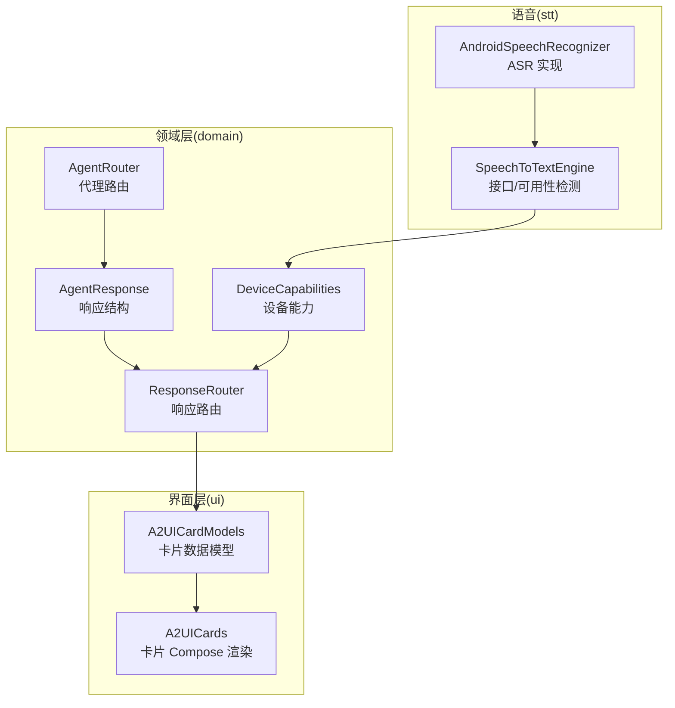
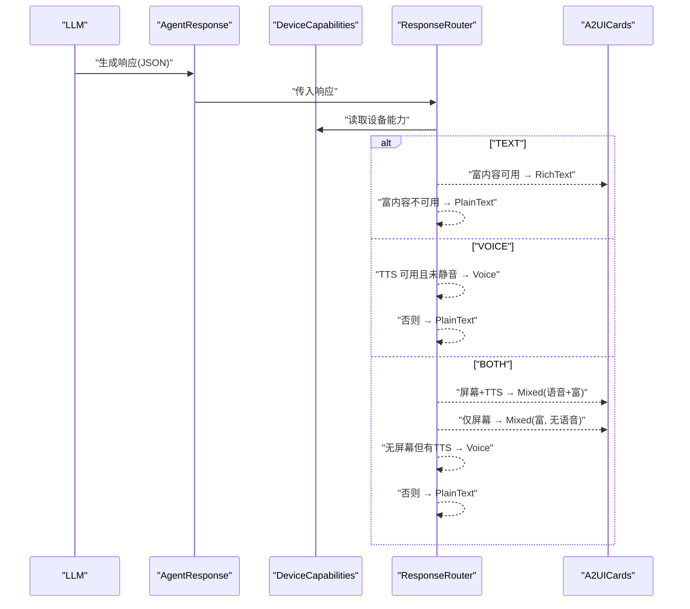
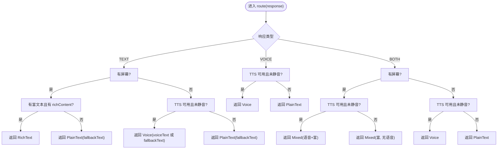
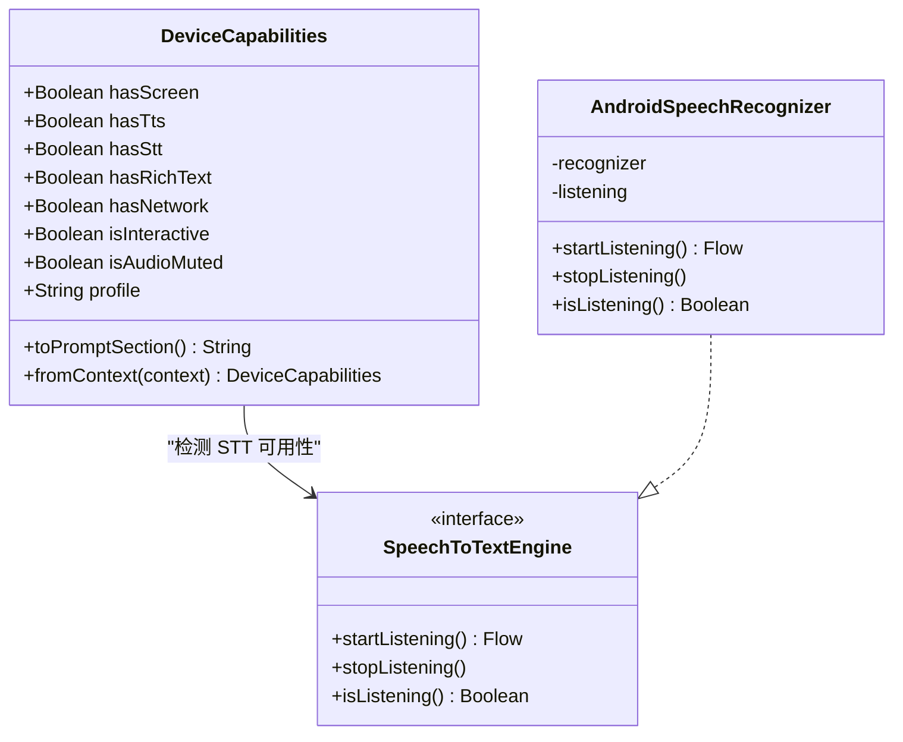
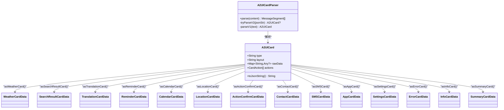
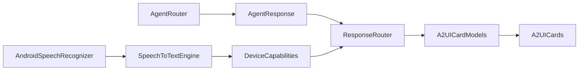

# 响应路由系统

<cite>
**本文引用的文件**
- [ResponseRouter.kt](file://app/src/main/java/ai/openclaw/android/domain/ResponseRouter.kt)
- [DeviceCapabilities.kt](file://app/src/main/java/ai/openclaw/android/domain/DeviceCapabilities.kt)
- [AgentResponse.kt](file://app/src/main/java/ai/openclaw/android/domain/AgentResponse.kt)
- [A2UICardModels.kt](file://app/src/main/java/ai/openclaw/android/ui/A2UICardModels.kt)
- [A2UICards.kt](file://app/src/main/java/ai/openclaw/android/ui/A2UICards.kt)
- [AndroidSpeechRecognizer.kt](file://app/src/main/java/ai/openclaw/android/voice/stt/AndroidSpeechRecognizer.kt)
- [SpeechToTextEngine.kt](file://app/src/main/java/ai/openclaw/android/voice/stt/SpeechToTextEngine.kt)
- [AgentRouter.kt](file://app/src/main/java/ai/openclaw/android/domain/agent/AgentRouter.kt)
</cite>

## 目录
1. [简介](#简介)
2. [项目结构](#项目结构)
3. [核心组件](#核心组件)
4. [架构总览](#架构总览)
5. [详细组件分析](#详细组件分析)
6. [依赖关系分析](#依赖关系分析)
7. [性能考虑](#性能考虑)
8. [故障排查指南](#故障排查指南)
9. [结论](#结论)
10. [附录](#附录)

## 简介
本文件面向开发者与产品工程师，系统化阐述 OpenClaw-Android 中“响应路由系统”的设计与实现，重点覆盖以下主题：
- ResponseRouter 的路由决策机制：基于设备能力的自动降级与多模态选择
- DeviceCapabilities 的结构设计与能力评估算法：屏幕、TTS/STT、网络、静音等
- 响应格式与内容适配策略：A2UI 卡片渲染、文本、语音、混合交付
- 设备能力提示词的生成与注入：动态能力描述、格式化输出、兼容性保证
- 路由策略配置与自定义：阈值与回退策略
- 性能优化与监控指标
- 扩展与定制化实践建议

## 项目结构
响应路由系统主要分布在 domain 与 ui 两个包中：
- domain：负责响应结构、设备能力检测与路由决策
- ui：负责 A2UI 卡片的数据模型与 Compose 渲染
- voice/stt：提供 STT 可用性检测工具
- domain/agent：消息到代理的路由（与响应路由协同）

**图表来源**
- [ResponseRouter.kt:31-99](file://app/src/main/java/ai/openclaw/android/domain/ResponseRouter.kt#L31-L99)
- [DeviceCapabilities.kt:17-110](file://app/src/main/java/ai/openclaw/android/domain/DeviceCapabilities.kt#L17-L110)
- [AgentResponse.kt:9-55](file://app/src/main/java/ai/openclaw/android/domain/AgentResponse.kt#L9-L55)
- [A2UICardModels.kt:83-140](file://app/src/main/java/ai/openclaw/android/ui/A2UICardModels.kt#L83-L140)
- [A2UICards.kt:1-120](file://app/src/main/java/ai/openclaw/android/ui/A2UICards.kt#L1-L120)
- [SpeechToTextEngine.kt:13-19](file://app/src/main/java/ai/openclaw/android/voice/stt/SpeechToTextEngine.kt#L13-L19)
- [AndroidSpeechRecognizer.kt:24-92](file://app/src/main/java/ai/openclaw/android/voice/stt/AndroidSpeechRecognizer.kt#L24-L92)
- [AgentRouter.kt:12-50](file://app/src/main/java/ai/openclaw/android/domain/agent/AgentRouter.kt#L12-L50)

**章节来源**
- [ResponseRouter.kt:1-118](file://app/src/main/java/ai/openclaw/android/domain/ResponseRouter.kt#L1-L118)
- [DeviceCapabilities.kt:1-112](file://app/src/main/java/ai/openclaw/android/domain/DeviceCapabilities.kt#L1-L112)
- [AgentResponse.kt:1-56](file://app/src/main/java/ai/openclaw/android/domain/AgentResponse.kt#L1-L56)
- [A2UICardModels.kt:1-638](file://app/src/main/java/ai/openclaw/android/ui/A2UICardModels.kt#L1-L638)
- [A2UICards.kt:1-800](file://app/src/main/java/ai/openclaw/android/ui/A2UICards.kt#L1-L800)
- [SpeechToTextEngine.kt:1-47](file://app/src/main/java/ai/openclaw/android/voice/stt/SpeechToTextEngine.kt#L1-L47)
- [AndroidSpeechRecognizer.kt:1-114](file://app/src/main/java/ai/openclaw/android/voice/stt/AndroidSpeechRecognizer.kt#L1-L114)
- [AgentRouter.kt:1-100](file://app/src/main/java/ai/openclaw/android/domain/agent/AgentRouter.kt#L1-L100)

## 核心组件
- AgentResponse：LLM 输出的标准化响应结构，包含类型、语音文本、富内容与回退文本
- DeviceCapabilities：运行时检测设备能力，并生成系统提示词段落
- ResponseRouter：根据设备能力与响应类型进行路由，支持自动降级
- A2UICardModels / A2UICards：A2UI 卡片数据模型与 Compose 渲染
- SpeechToTextEngine / AndroidSpeechRecognizer：STT 可用性检测与识别流
- AgentRouter：消息到代理的路由（与响应路由协同）

**章节来源**
- [AgentResponse.kt:9-55](file://app/src/main/java/ai/openclaw/android/domain/AgentResponse.kt#L9-L55)
- [DeviceCapabilities.kt:17-110](file://app/src/main/java/ai/openclaw/android/domain/DeviceCapabilities.kt#L17-L110)
- [ResponseRouter.kt:31-99](file://app/src/main/java/ai/openclaw/android/domain/ResponseRouter.kt#L31-L99)
- [A2UICardModels.kt:83-140](file://app/src/main/java/ai/openclaw/android/ui/A2UICardModels.kt#L83-L140)
- [A2UICards.kt:1-120](file://app/src/main/java/ai/openclaw/android/ui/A2UICards.kt#L1-L120)
- [SpeechToTextEngine.kt:13-19](file://app/src/main/java/ai/openclaw/android/voice/stt/SpeechToTextEngine.kt#L13-L19)
- [AndroidSpeechRecognizer.kt:24-92](file://app/src/main/java/ai/openclaw/android/voice/stt/AndroidSpeechRecognizer.kt#L24-L92)
- [AgentRouter.kt:12-50](file://app/src/main/java/ai/openclaw/android/domain/agent/AgentRouter.kt#L12-L50)

## 架构总览
响应路由系统围绕“设备能力”与“响应类型”展开，形成如下闭环：
- LLM 产出 AgentResponse（含 type、voiceText、richContent、fallbackText）
- ResponseRouter 基于 DeviceCapabilities 进行路由决策
- 若存在富内容且设备具备渲染能力，则走 A2UI 卡片渲染；否则回退为纯文本或语音
- 设备能力通过 DeviceCapabilities 动态生成系统提示词，确保 LLM 在不同设备上输出一致的可解析 JSON

**图表来源**
- [ResponseRouter.kt:39-98](file://app/src/main/java/ai/openclaw/android/domain/ResponseRouter.kt#L39-L98)
- [DeviceCapabilities.kt:36-71](file://app/src/main/java/ai/openclaw/android/domain/DeviceCapabilities.kt#L36-L71)
- [AgentResponse.kt:9-14](file://app/src/main/java/ai/openclaw/android/domain/AgentResponse.kt#L9-L14)
- [A2UICardModels.kt:83-140](file://app/src/main/java/ai/openclaw/android/ui/A2UICardModels.kt#L83-L140)
- [A2UICards.kt:1-120](file://app/src/main/java/ai/openclaw/android/ui/A2UICards.kt#L1-L120)

## 详细组件分析

### ResponseRouter：路由决策与自动降级
- 决策入口：route(response) 根据 AgentResponse.type 分派至 routeText/routeVoice/routeBoth
- TEXT 流程：
  - 有屏幕且具备富文本渲染与 richContent → 返回 RichText
  - 否则返回 PlainText（使用 fallbackText）
  - 无屏幕且 TTS 可用且未静音 → 返回 Voice（优先 voiceText，否则回退）
- VOICE 流程：
  - TTS 可用且未静音 → Voice
  - 否则 PlainText
- BOTH 流程：
  - 有屏幕：TTS 可用且未静音 → Mixed(语音+富)，否则 Mixed(富, 无语音)
  - 无屏幕：TTS 可用且未静音 → Voice，否则 PlainText

**图表来源**
- [ResponseRouter.kt:39-98](file://app/src/main/java/ai/openclaw/android/domain/ResponseRouter.kt#L39-L98)

**章节来源**
- [ResponseRouter.kt:39-99](file://app/src/main/java/ai/openclaw/android/domain/ResponseRouter.kt#L39-L99)

### DeviceCapabilities：能力检测与提示词生成
- 结构字段：
  - hasScreen、hasTts、hasStt、hasRichText、hasNetwork、isInteractive、isAudioMuted
- 能力评估算法：
  - TTS：创建 TextToSpeech 并 shutdown，成功即可用
  - STT：调用 isSpeechRecognitionAvailable(context)
  - 网络：ConnectivityManager 获取 activeNetwork 的网络能力，检查是否具备 INTERNET 能力
- 设备 profile 生成：根据屏幕/TTS/STT/富文本/网络组合映射为 FULL/MIXED/SCREEN_ONLY/VOICE_ONLY/MINIMAL
- 提示词注入：toPromptSection 生成人类可读的能力清单与 JSON 输出约束，供 LLM 使用

**图表来源**
- [DeviceCapabilities.kt:17-110](file://app/src/main/java/ai/openclaw/android/domain/DeviceCapabilities.kt#L17-L110)
- [SpeechToTextEngine.kt:13-19](file://app/src/main/java/ai/openclaw/android/voice/stt/SpeechToTextEngine.kt#L13-L19)
- [AndroidSpeechRecognizer.kt:24-92](file://app/src/main/java/ai/openclaw/android/voice/stt/AndroidSpeechRecognizer.kt#L24-L92)

**章节来源**
- [DeviceCapabilities.kt:17-110](file://app/src/main/java/ai/openclaw/android/domain/DeviceCapabilities.kt#L17-L110)
- [SpeechToTextEngine.kt:13-19](file://app/src/main/java/ai/openclaw/android/voice/stt/SpeechToTextEngine.kt#L13-L19)
- [AndroidSpeechRecognizer.kt:24-92](file://app/src/main/java/ai/openclaw/android/voice/stt/AndroidSpeechRecognizer.kt#L24-L92)

### 响应格式与内容适配：A2UI 卡片渲染
- 数据模型：A2UICard 采用统一 JSON 结构 {"type","layout","data","actions"}，并提供多种类型安全访问器
- 兼容性：支持 v1 旧格式（Map<String,String>）自动回退为 LegacyCard
- 解析器：A2UICardParser 支持 [A2UI]...[/A2UI] 包裹的富内容解析，优先 v2 JSON，失败回退 v1
- 渲染：A2UICards 提供多种卡片 Compose 组件（天气、搜索结果、翻译、提醒、日历、位置、操作确认、联系人、短信、应用、设置、错误、信息、摘要等），并提供通用操作按钮栏

**图表来源**
- [A2UICardModels.kt:83-140](file://app/src/main/java/ai/openclaw/android/ui/A2UICardModels.kt#L83-L140)
- [A2UICardModels.kt:541-637](file://app/src/main/java/ai/openclaw/android/ui/A2UICardModels.kt#L541-L637)

**章节来源**
- [A2UICardModels.kt:83-140](file://app/src/main/java/ai/openclaw/android/ui/A2UICardModels.kt#L83-L140)
- [A2UICardModels.kt:541-637](file://app/src/main/java/ai/openclaw/android/ui/A2UICardModels.kt#L541-L637)
- [A2UICards.kt:1-120](file://app/src/main/java/ai/openclaw/android/ui/A2UICards.kt#L1-L120)

### 设备能力提示词生成与注入机制
- 动态能力描述：toPromptSection 输出设备能力清单与 profile
- 格式化输出：要求 LLM 输出 JSON，包含 type、voice_text、rich_content、fallback_text
- 决策规则：简短确认 → VOICE；列表/表格/代码/链接 → TEXT；摘要+详情 → BOTH；voice_text 简短适合朗读；fallback_text 包含完整信息
- 兼容性保证：即使设备能力有限，fallbackText 也能确保信息完整传递

**章节来源**
- [DeviceCapabilities.kt:36-71](file://app/src/main/java/ai/openclaw/android/domain/DeviceCapabilities.kt#L36-L71)

### 路由策略配置与自定义
- 能力阈值设置：可通过自定义 DeviceCapabilities 构造参数或 fromContext 的实现扩展更多能力字段（如 CPU/GPU/传感器等）
- 回退策略配置：在 ResponseRouter 中可调整优先级与回退分支，例如：
  - 优先富文本渲染，否则语音，最后纯文本
  - 无屏幕时强制语音播报
- LLM 系统提示词：通过 DeviceCapabilities.toPromptSection 注入，确保输出格式与设备能力匹配

**章节来源**
- [ResponseRouter.kt:39-98](file://app/src/main/java/ai/openclaw/android/domain/ResponseRouter.kt#L39-L98)
- [DeviceCapabilities.kt:36-71](file://app/src/main/java/ai/openclaw/android/domain/DeviceCapabilities.kt#L36-L71)

## 依赖关系分析
- ResponseRouter 依赖 DeviceCapabilities 与 AgentResponse
- A2UICardModels 与 A2UICards 之间强耦合，前者定义数据结构，后者负责渲染
- STT 可用性检测通过 SpeechToTextEngine 接口抽象，AndroidSpeechRecognizer 实现具体逻辑
- AgentRouter 与 ResponseRouter 协同：前者决定“发给哪个代理”，后者决定“如何交付给用户”

**图表来源**
- [ResponseRouter.kt:31-99](file://app/src/main/java/ai/openclaw/android/domain/ResponseRouter.kt#L31-L99)
- [DeviceCapabilities.kt:17-110](file://app/src/main/java/ai/openclaw/android/domain/DeviceCapabilities.kt#L17-L110)
- [AgentResponse.kt:9-55](file://app/src/main/java/ai/openclaw/android/domain/AgentResponse.kt#L9-L55)
- [A2UICardModels.kt:83-140](file://app/src/main/java/ai/openclaw/android/ui/A2UICardModels.kt#L83-L140)
- [A2UICards.kt:1-120](file://app/src/main/java/ai/openclaw/android/ui/A2UICards.kt#L1-L120)
- [SpeechToTextEngine.kt:13-19](file://app/src/main/java/ai/openclaw/android/voice/stt/SpeechToTextEngine.kt#L13-L19)
- [AndroidSpeechRecognizer.kt:24-92](file://app/src/main/java/ai/openclaw/android/voice/stt/AndroidSpeechRecognizer.kt#L24-L92)
- [AgentRouter.kt:12-50](file://app/src/main/java/ai/openclaw/android/domain/agent/AgentRouter.kt#L12-L50)

**章节来源**
- [ResponseRouter.kt:31-99](file://app/src/main/java/ai/openclaw/android/domain/ResponseRouter.kt#L31-L99)
- [DeviceCapabilities.kt:17-110](file://app/src/main/java/ai/openclaw/android/domain/DeviceCapabilities.kt#L17-L110)
- [AgentResponse.kt:9-55](file://app/src/main/java/ai/openclaw/android/domain/AgentResponse.kt#L9-L55)
- [A2UICardModels.kt:83-140](file://app/src/main/java/ai/openclaw/android/ui/A2UICardModels.kt#L83-L140)
- [A2UICards.kt:1-120](file://app/src/main/java/ai/openclaw/android/ui/A2UICards.kt#L1-L120)
- [SpeechToTextEngine.kt:13-19](file://app/src/main/java/ai/openclaw/android/voice/stt/SpeechToTextEngine.kt#L13-L19)
- [AndroidSpeechRecognizer.kt:24-92](file://app/src/main/java/ai/openclaw/android/voice/stt/AndroidSpeechRecognizer.kt#L24-L92)
- [AgentRouter.kt:12-50](file://app/src/main/java/ai/openclaw/android/domain/agent/AgentRouter.kt#L12-L50)

## 性能考虑
- 能力检测开销控制：DeviceCapabilities.fromContext 仅执行轻量级检测（TTS 初始化、STT 可用性、网络能力查询），避免阻塞主线程
- 解析与渲染优化：A2UICardParser 优先尝试 v2 JSON，失败再回退 v1，减少异常路径开销
- UI 渲染优化：A2UICards 使用懒加载与水平滚动组件，限制长列表渲染成本
- 日志与可观测性：ResponseRouter 在关键分支记录日志，便于定位路由问题

[本节为通用性能讨论，不直接分析具体文件]

## 故障排查指南
- 无富文本渲染：检查 hasRichText 与 richContent 是否为空；确认 A2UICardModels 解析是否成功
- 语音播报异常：检查 hasTts 与 isAudioMuted；确认 TTS 引擎初始化是否成功
- STT 不可用：确认 isSpeechRecognitionAvailable 返回值；检查设备是否安装识别服务
- 网络能力误判：ConnectivityManager 查询异常时默认视为可用，需关注异常捕获逻辑
- LLM 输出格式不符：核对 DeviceCapabilities.toPromptSection 的提示词是否被正确注入，以及 LLM 是否遵循 JSON 约束

**章节来源**
- [ResponseRouter.kt:39-98](file://app/src/main/java/ai/openclaw/android/domain/ResponseRouter.kt#L39-L98)
- [DeviceCapabilities.kt:84-109](file://app/src/main/java/ai/openclaw/android/domain/DeviceCapabilities.kt#L84-L109)
- [SpeechToTextEngine.kt:13-19](file://app/src/main/java/ai/openclaw/android/voice/stt/SpeechToTextEngine.kt#L13-L19)
- [AndroidSpeechRecognizer.kt:24-92](file://app/src/main/java/ai/openclaw/android/voice/stt/AndroidSpeechRecognizer.kt#L24-L92)

## 结论
响应路由系统以“设备能力为中心”，通过 ResponseRouter 的自动降级策略与 DeviceCapabilities 的动态提示词注入，实现了在多模态场景下的稳定交付。配合 A2UI 卡片体系，系统能够在不同硬件条件下提供一致的用户体验。开发者可在不破坏现有流程的前提下，按需扩展能力检测维度与路由优先级，以满足更复杂的业务需求。

[本节为总结性内容，不直接分析具体文件]

## 附录
- 关键流程参考路径
  - [路由主流程:39-45](file://app/src/main/java/ai/openclaw/android/domain/ResponseRouter.kt#L39-L45)
  - [TEXT 分支:47-63](file://app/src/main/java/ai/openclaw/android/domain/ResponseRouter.kt#L47-L63)
  - [VOICE 分支:65-73](file://app/src/main/java/ai/openclaw/android/domain/ResponseRouter.kt#L65-L73)
  - [BOTH 分支:75-98](file://app/src/main/java/ai/openclaw/android/domain/ResponseRouter.kt#L75-L98)
  - [能力检测:84-109](file://app/src/main/java/ai/openclaw/android/domain/DeviceCapabilities.kt#L84-L109)
  - [提示词注入:36-71](file://app/src/main/java/ai/openclaw/android/domain/DeviceCapabilities.kt#L36-L71)
  - [A2UI 解析:541-637](file://app/src/main/java/ai/openclaw/android/ui/A2UICardModels.kt#L541-L637)
  - [STT 可用性:13-19](file://app/src/main/java/ai/openclaw/android/voice/stt/SpeechToTextEngine.kt#L13-L19)