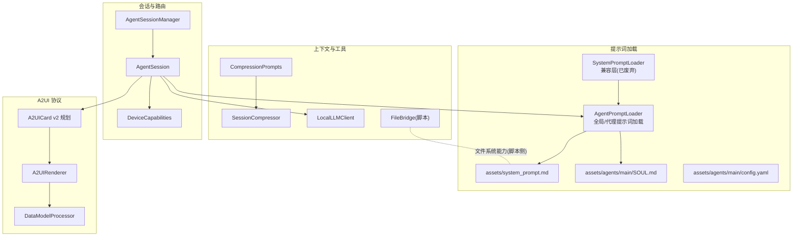
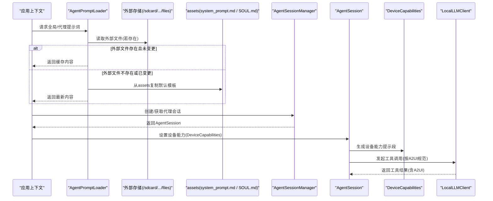
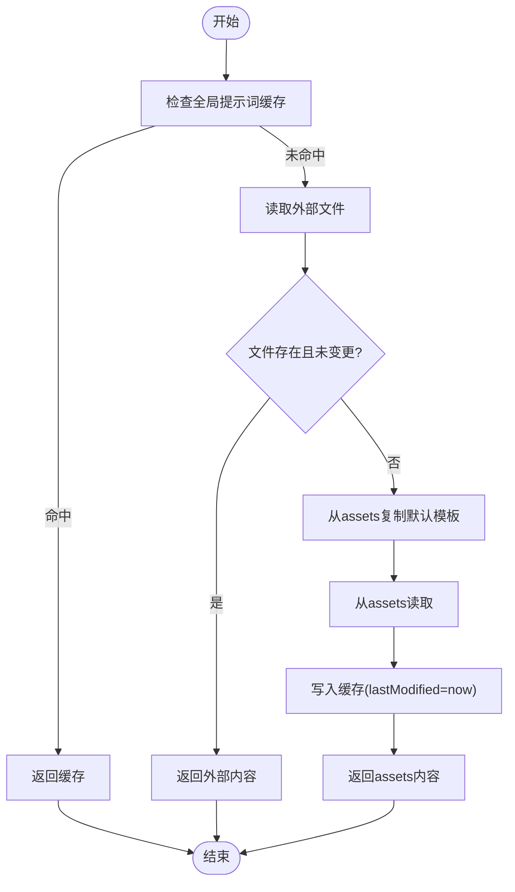
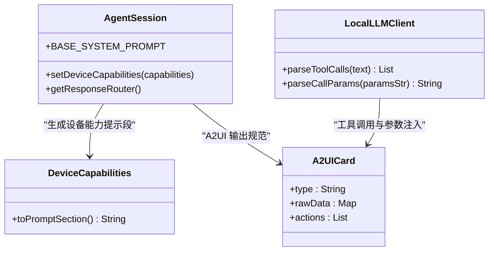
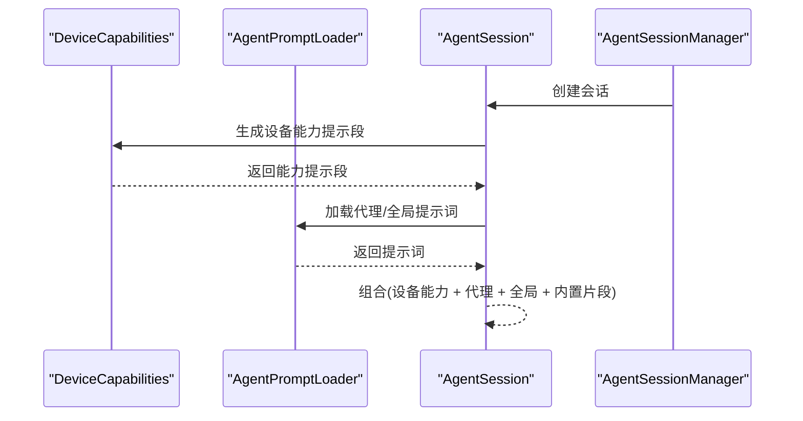
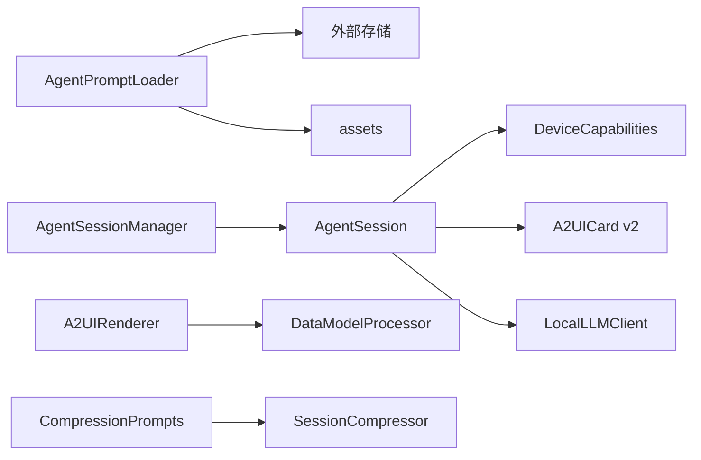

# 提示词管理系统

<cite>
**本文引用的文件**
- [AgentPromptLoader.kt](file://app/src/main/java/ai/openclaw/android/agent/AgentPromptLoader.kt)
- [SystemPromptLoader.kt](file://app/src/main/java/ai/openclaw/android/agent/SystemPromptLoader.kt)
- [system_prompt.md](file://app/src/main/assets/system_prompt.md)
- [SOUL.md](file://app/src/main/assets/agents/main/SOUL.md)
- [config.yaml](file://app/src/main/assets/agents/main/config.yaml)
- [AgentSessionManager.kt](file://app/src/main/java/ai/openclaw/android/domain/agent/AgentSessionManager.kt)
- [AgentSession.kt](file://app/src/main/java/ai/openclaw/android/agent/AgentSession.kt)
- [DeviceCapabilities.kt](file://app/src/main/java/ai/openclaw/android/domain/DeviceCapabilities.kt)
- [A2UICard 系统 v2 规划](file://docs/plans/2026-04-14-a2ui-card-system-v2.md)
- [A2UIRenderer.kt](file://android_compose/src/main/java/org/a2ui/compose/rendering/A2UIRenderer.kt)
- [DataModelProcessor.kt](file://android_compose/src/main/java/org/a2ui/compose/data/DataModelProcessor.kt)
- [CompressionPrompts.kt](file://app/src/main/java/ai/openclaw/android/util/CompressionPrompts.kt)
- [SessionCompressor.kt](file://app/src/main/java/ai/openclaw/android/domain/session/SessionCompressor.kt)
- [LocalLLMClient.kt](file://app/src/main/java/ai/openclaw/android/model/LocalLLMClient.kt)
- [FileBridge.kt](file://script/src/main/java/ai/openclaw/script/bridge/FileBridge.kt)
</cite>

## 目录
1. [简介](#简介)
2. [项目结构](#项目结构)
3. [核心组件](#核心组件)
4. [架构总览](#架构总览)
5. [详细组件分析](#详细组件分析)
6. [依赖关系分析](#依赖关系分析)
7. [性能考量](#性能考量)
8. [故障排查指南](#故障排查指南)
9. [结论](#结论)
10. [附录](#附录)

## 简介
本文件面向提示词管理系统，聚焦于 AgentPromptLoader 与 SystemPromptLoader 的实现原理与使用方式，涵盖提示词文件加载、缓存与热重载、动态更新策略；系统提示词结构设计（基础规则、A2UI 输出规范、工具调用指导）；自定义提示词加载流程（文件解析、参数注入、版本兼容）；提示词优先级与组合策略（系统提示词、代理特定提示词、设备能力提示词）；以及编写指南、最佳实践、热重载与故障恢复机制。

## 项目结构
提示词管理涉及以下关键模块与文件：
- 加载器：AgentPromptLoader（全局与代理级）、SystemPromptLoader（兼容层）
- 默认模板：assets 中的 system_prompt.md 与 agents/main/SOUL.md
- 配置：agents/main/config.yaml
- 会话与路由：AgentSessionManager、AgentSession、DeviceCapabilities
- A2UI 协议与渲染：A2UICard 数据模型、A2UIRenderer、DataModelProcessor
- 压缩与上下文控制：CompressionPrompts、SessionCompressor
- 工具调用与参数解析：LocalLLMClient
- 文件桥接与热编辑：FileBridge（脚本沙箱文件能力）

**图表来源**
- [AgentPromptLoader.kt:1-284](file://app/src/main/java/ai/openclaw/android/agent/AgentPromptLoader.kt#L1-L284)
- [SystemPromptLoader.kt:1-43](file://app/src/main/java/ai/openclaw/android/agent/SystemPromptLoader.kt#L1-L43)
- [system_prompt.md:1-52](file://app/src/main/assets/system_prompt.md#L1-L52)
- [SOUL.md:1-71](file://app/src/main/assets/agents/main/SOUL.md#L1-L71)
- [config.yaml:1-11](file://app/src/main/assets/agents/main/config.yaml#L1-L11)
- [AgentSessionManager.kt:1-196](file://app/src/main/java/ai/openclaw/android/domain/agent/AgentSessionManager.kt#L1-L196)
- [AgentSession.kt:1-200](file://app/src/main/java/ai/openclaw/android/agent/AgentSession.kt#L1-L200)
- [DeviceCapabilities.kt:47-71](file://app/src/main/java/ai/openclaw/android/domain/DeviceCapabilities.kt#L47-L71)
- [A2UICard 系统 v2 规划:19-573](file://docs/plans/2026-04-14-a2ui-card-system-v2.md#L19-L573)
- [A2UIRenderer.kt:238-291](file://android_compose/src/main/java/org/a2ui/compose/rendering/A2UIRenderer.kt#L238-L291)
- [DataModelProcessor.kt:272-298](file://android_compose/src/main/java/org/a2ui/compose/data/DataModelProcessor.kt#L272-L298)
- [CompressionPrompts.kt:1-31](file://app/src/main/java/ai/openclaw/android/util/CompressionPrompts.kt#L1-L31)
- [SessionCompressor.kt:42-83](file://app/src/main/java/ai/openclaw/android/domain/session/SessionCompressor.kt#L42-L83)
- [LocalLLMClient.kt:596-658](file://app/src/main/java/ai/openclaw/android/model/LocalLLMClient.kt#L596-L658)
- [FileBridge.kt:1-51](file://script/src/main/java/ai/openclaw/script/bridge/FileBridge.kt#L1-L51)

**章节来源**
- [AgentPromptLoader.kt:1-284](file://app/src/main/java/ai/openclaw/android/agent/AgentPromptLoader.kt#L1-L284)
- [SystemPromptLoader.kt:1-43](file://app/src/main/java/ai/openclaw/android/agent/SystemPromptLoader.kt#L1-L43)
- [system_prompt.md:1-52](file://app/src/main/assets/system_prompt.md#L1-L52)
- [SOUL.md:1-71](file://app/src/main/assets/agents/main/SOUL.md#L1-L71)
- [config.yaml:1-11](file://app/src/main/assets/agents/main/config.yaml#L1-L11)

## 核心组件
- AgentPromptLoader：负责从外部存储与 assets 加载全局 system prompt 与代理 SOUL.md，内置缓存与热重载能力，支持首次启动自动复制默认模板。
- SystemPromptLoader：兼容层，已废弃，仅委托给 AgentPromptLoader。
- AgentSessionManager：管理多个 AgentSession，负责会话缓存与 LRU 淘汰，间接影响提示词使用与上下文长度控制。
- AgentSession：承载单个代理的会话上下文，内置基础系统提示词片段与 A2UI 输出规范，结合设备能力进行响应路由。
- DeviceCapabilities：将设备能力转换为可注入的提示词段落，用于指导模型输出富文本或语音播报等格式。
- A2UICard v2：统一卡片数据模型与解析器，支撑 A2UI 协议的标准化输出。
- LocalLLMClient：负责工具调用解析与参数注入，确保工具调用符合 A2UI 输出预期。
- FileBridge：为脚本沙箱提供受限文件系统能力，便于提示词热编辑与持久化。

**章节来源**
- [AgentPromptLoader.kt:1-284](file://app/src/main/java/ai/openclaw/android/agent/AgentPromptLoader.kt#L1-L284)
- [SystemPromptLoader.kt:1-43](file://app/src/main/java/ai/openclaw/android/agent/SystemPromptLoader.kt#L1-L43)
- [AgentSessionManager.kt:1-196](file://app/src/main/java/ai/openclaw/android/domain/agent/AgentSessionManager.kt#L1-L196)
- [AgentSession.kt:108-200](file://app/src/main/java/ai/openclaw/android/agent/AgentSession.kt#L108-L200)
- [DeviceCapabilities.kt:47-71](file://app/src/main/java/ai/openclaw/android/domain/DeviceCapabilities.kt#L47-L71)
- [A2UICard 系统 v2 规划:19-573](file://docs/plans/2026-04-14-a2ui-card-system-v2.md#L19-L573)
- [LocalLLMClient.kt:596-658](file://app/src/main/java/ai/openclaw/android/model/LocalLLMClient.kt#L596-L658)
- [FileBridge.kt:1-51](file://script/src/main/java/ai/openclaw/script/bridge/FileBridge.kt#L1-L51)

## 架构总览
提示词加载与使用的关键流程如下：

**图表来源**
- [AgentPromptLoader.kt:40-138](file://app/src/main/java/ai/openclaw/android/agent/AgentPromptLoader.kt#L40-L138)
- [AgentSessionManager.kt:72-113](file://app/src/main/java/ai/openclaw/android/domain/agent/AgentSessionManager.kt#L72-L113)
- [AgentSession.kt:56-66](file://app/src/main/java/ai/openclaw/android/agent/AgentSession.kt#L56-L66)
- [DeviceCapabilities.kt:50-71](file://app/src/main/java/ai/openclaw/android/domain/DeviceCapabilities.kt#L50-L71)
- [LocalLLMClient.kt:596-658](file://app/src/main/java/ai/openclaw/android/model/LocalLLMClient.kt#L596-L658)

## 详细组件分析

### AgentPromptLoader 实现原理
- 文件定位与路径
  - 全局提示词：外部存储根目录下的 system_prompt.md
  - 代理提示词：agents/{agentId}/SOUL.md
- 加载策略
  - 外部文件优先：若存在且未变更则直接返回缓存
  - 首次启动：自动从 assets 复制默认模板
  - 回退兜底：assets 也失败时使用内置兜底提示词
- 缓存机制
  - 全局提示词：内存缓存 + 最后修改时间戳
  - 代理提示词：按 agentId 维度缓存，独立维护 lastModified
- 动态更新
  - reload/reloadAgent：强制清空缓存并重新加载
  - 文件变更检测：基于 lastModified 判断是否命中缓存
- 日志与错误处理
  - 成功/警告/错误均有日志记录，异常时回退至兜底提示词

**图表来源**
- [AgentPromptLoader.kt:40-77](file://app/src/main/java/ai/openclaw/android/agent/AgentPromptLoader.kt#L40-L77)
- [AgentPromptLoader.kt:107-138](file://app/src/main/java/ai/openclaw/android/agent/AgentPromptLoader.kt#L107-L138)

**章节来源**
- [AgentPromptLoader.kt:1-284](file://app/src/main/java/ai/openclaw/android/agent/AgentPromptLoader.kt#L1-L284)

### SystemPromptLoader（兼容层）
- 已废弃，仅作为向后兼容的代理，内部直接委托给 AgentPromptLoader
- 建议迁移至 AgentPromptLoader

**章节来源**
- [SystemPromptLoader.kt:1-43](file://app/src/main/java/ai/openclaw/android/agent/SystemPromptLoader.kt#L1-L43)

### 系统提示词结构设计
- 基础规则
  - 工具调用优先：先调用真实数据源，再以 A2UI 格式呈现
  - 语言一致性：与用户语言一致
  - 简单问候无需工具与 A2UI
- A2UI 输出规范
  - 支持标准协议与遗留格式
  - 组件清单与卡片类型丰富
  - 明确动作按钮样式与风险级别
- 工具调用指导
  - 严格遵循工具签名与参数格式
  - 参数注入支持多种键值格式
  - 错误时解析 JSON 形式的工具调用

**图表来源**
- [AgentSession.kt:108-200](file://app/src/main/java/ai/openclaw/android/agent/AgentSession.kt#L108-L200)
- [DeviceCapabilities.kt:50-71](file://app/src/main/java/ai/openclaw/android/domain/DeviceCapabilities.kt#L50-L71)
- [A2UICard 系统 v2 规划:19-573](file://docs/plans/2026-04-14-a2ui-card-system-v2.md#L19-L573)
- [LocalLLMClient.kt:596-658](file://app/src/main/java/ai/openclaw/android/model/LocalLLMClient.kt#L596-L658)

**章节来源**
- [AgentSession.kt:108-200](file://app/src/main/java/ai/openclaw/android/agent/AgentSession.kt#L108-L200)
- [DeviceCapabilities.kt:47-71](file://app/src/main/java/ai/openclaw/android/domain/DeviceCapabilities.kt#L47-L71)
- [A2UICard 系统 v2 规划:19-573](file://docs/plans/2026-04-14-a2ui-card-system-v2.md#L19-L573)
- [LocalLLMClient.kt:596-658](file://app/src/main/java/ai/openclaw/android/model/LocalLLMClient.kt#L596-L658)

### 自定义提示词加载流程
- 文件解析
  - 全局：system_prompt.md（assets 默认模板）
  - 代理：agents/{agentId}/SOUL.md（assets 默认模板）
- 参数注入
  - 设备能力提示段：DeviceCapabilities.toPromptSection() 生成人类可读段落，注入到系统提示词中
  - A2UI 输出：AgentSession 内置基础系统提示词片段，配合 A2UICard v2 规范
- 版本兼容
  - A2UI 支持标准协议与遗留格式
  - 兜底提示词包含标准协议示例与组件清单

**章节来源**
- [AgentPromptLoader.kt:107-138](file://app/src/main/java/ai/openclaw/android/agent/AgentPromptLoader.kt#L107-L138)
- [system_prompt.md:1-52](file://app/src/main/assets/system_prompt.md#L1-L52)
- [SOUL.md:1-71](file://app/src/main/assets/agents/main/SOUL.md#L1-L71)
- [DeviceCapabilities.kt:50-71](file://app/src/main/java/ai/openclaw/android/domain/DeviceCapabilities.kt#L50-L71)
- [AgentSession.kt:108-200](file://app/src/main/java/ai/openclaw/android/agent/AgentSession.kt#L108-L200)
- [A2UICard 系统 v2 规划:19-573](file://docs/plans/2026-04-14-a2ui-card-system-v2.md#L19-L573)

### 提示词优先级与组合策略
- 优先级顺序（从高到低）
  1) 设备能力提示段（DeviceCapabilities.toPromptSection）
  2) 代理特定提示词（agents/{agentId}/SOUL.md）
  3) 全局系统提示词（system_prompt.md）
  4) AgentSession 内置基础系统提示词片段
- 组合规则
  - 设备能力提示段作为“前缀”注入，确保模型了解当前设备能力
  - 代理提示词覆盖全局提示词中的代理相关规则
  - A2UI 输出规范与组件清单在系统提示词中统一约定
- 上下文控制
  - 会话缓存与 LRU 淘汰由 AgentSessionManager 管理
  - 压缩提示与会话压缩由 CompressionPrompts 与 SessionCompressor 控制

**图表来源**
- [DeviceCapabilities.kt:50-71](file://app/src/main/java/ai/openclaw/android/domain/DeviceCapabilities.kt#L50-L71)
- [AgentPromptLoader.kt:107-138](file://app/src/main/java/ai/openclaw/android/agent/AgentPromptLoader.kt#L107-L138)
- [AgentSession.kt:108-200](file://app/src/main/java/ai/openclaw/android/agent/AgentSession.kt#L108-L200)
- [AgentSessionManager.kt:72-113](file://app/src/main/java/ai/openclaw/android/domain/agent/AgentSessionManager.kt#L72-L113)

**章节来源**
- [AgentSessionManager.kt:62-113](file://app/src/main/java/ai/openclaw/android/domain/agent/AgentSessionManager.kt#L62-L113)
- [CompressionPrompts.kt:1-31](file://app/src/main/java/ai/openclaw/android/util/CompressionPrompts.kt#L1-L31)
- [SessionCompressor.kt:42-83](file://app/src/main/java/ai/openclaw/android/domain/session/SessionCompressor.kt#L42-L83)

### 提示词编写指南与最佳实践
- 格式规范
  - 使用清晰的标题层级与分节（规则、A2UI 格式、卡片输出指引、动态技能）
  - A2UI 输出必须遵循标准协议或遗留格式之一
  - 组件清单与卡片类型需与前端渲染器一致
- 安全考虑
  - 严格限制工具调用范围，避免越权操作
  - 参数注入需校验与清洗，防止注入攻击
  - 设备能力提示段应准确反映实际能力，避免误导模型
- 性能优化
  - 合理利用缓存，减少重复 IO
  - 控制提示词长度，避免超出模型上下文上限
  - 使用会话压缩与上下文裁剪，保持高效对话

**章节来源**
- [A2UICard 系统 v2 规划:19-573](file://docs/plans/2026-04-14-a2ui-card-system-v2.md#L19-L573)
- [LocalLLMClient.kt:596-658](file://app/src/main/java/ai/openclaw/android/model/LocalLLMClient.kt#L596-L658)
- [CompressionPrompts.kt:1-31](file://app/src/main/java/ai/openclaw/android/util/CompressionPrompts.kt#L1-L31)
- [SessionCompressor.kt:42-83](file://app/src/main/java/ai/openclaw/android/domain/session/SessionCompressor.kt#L42-L83)

### 提示词热重载与故障恢复
- 热重载
  - 文件变更检测：基于 lastModified 时间戳判断是否需要刷新
  - 强制刷新：reload()/reloadAgent() 清空缓存并重新加载
  - 首次启动：自动从 assets 复制默认模板到外部存储
- 故障恢复
  - 外部文件为空：回退到 assets 默认模板
  - assets 也失败：使用内置兜底提示词
  - 日志记录：详细记录加载过程与异常，便于诊断

**章节来源**
- [AgentPromptLoader.kt:40-77](file://app/src/main/java/ai/openclaw/android/agent/AgentPromptLoader.kt#L40-L77)
- [AgentPromptLoader.kt:107-138](file://app/src/main/java/ai/openclaw/android/agent/AgentPromptLoader.kt#L107-L138)

### 开发者扩展与定制化指导
- 新增代理提示词
  - 在 agents/{agentId}/SOUL.md 中编写专属规则与输出规范
  - 首次运行会自动复制 assets 默认模板
- 设备能力定制
  - 通过 DeviceCapabilities.toPromptSection() 注入能力提示段
  - 确保前端渲染器支持新增组件与卡片类型
- 工具调用增强
  - 使用 LocalLLMClient 的工具调用解析与参数注入能力
  - 为新工具补充参数校验与安全策略
- 文件热编辑
  - 通过 FileBridge（脚本沙箱）或文件管理器直接编辑提示词文件
  - 修改后立即生效（下次加载时检测到变更）

**章节来源**
- [SOUL.md:1-71](file://app/src/main/assets/agents/main/SOUL.md#L1-L71)
- [DeviceCapabilities.kt:50-71](file://app/src/main/java/ai/openclaw/android/domain/DeviceCapabilities.kt#L50-L71)
- [LocalLLMClient.kt:596-658](file://app/src/main/java/ai/openclaw/android/model/LocalLLMClient.kt#L596-L658)
- [FileBridge.kt:1-51](file://script/src/main/java/ai/openclaw/script/bridge/FileBridge.kt#L1-L51)

## 依赖关系分析
- AgentPromptLoader 依赖 Android 上下文与文件系统，同时依赖 assets 资源
- AgentSessionManager 依赖 AgentConfigManager、SkillManager、权限与无障碍桥接
- AgentSession 依赖 DeviceCapabilities、A2UICard v2、LocalLLMClient
- A2UIRenderer 与 DataModelProcessor 负责协议解析与数据模型更新
- 压缩模块与会话压缩共同控制上下文长度

**图表来源**
- [AgentPromptLoader.kt:1-284](file://app/src/main/java/ai/openclaw/android/agent/AgentPromptLoader.kt#L1-L284)
- [AgentSessionManager.kt:1-196](file://app/src/main/java/ai/openclaw/android/domain/agent/AgentSessionManager.kt#L1-L196)
- [AgentSession.kt:1-200](file://app/src/main/java/ai/openclaw/android/agent/AgentSession.kt#L1-L200)
- [A2UICard 系统 v2 规划:19-573](file://docs/plans/2026-04-14-a2ui-card-system-v2.md#L19-L573)
- [A2UIRenderer.kt:238-291](file://android_compose/src/main/java/org/a2ui/compose/rendering/A2UIRenderer.kt#L238-L291)
- [DataModelProcessor.kt:272-298](file://android_compose/src/main/java/org/a2ui/compose/data/DataModelProcessor.kt#L272-L298)
- [CompressionPrompts.kt:1-31](file://app/src/main/java/ai/openclaw/android/util/CompressionPrompts.kt#L1-L31)
- [SessionCompressor.kt:42-83](file://app/src/main/java/ai/openclaw/android/domain/session/SessionCompressor.kt#L42-L83)

**章节来源**
- [AgentSessionManager.kt:1-196](file://app/src/main/java/ai/openclaw/android/domain/agent/AgentSessionManager.kt#L1-L196)
- [AgentSession.kt:1-200](file://app/src/main/java/ai/openclaw/android/agent/AgentSession.kt#L1-L200)

## 性能考量
- 缓存策略
  - 全局与代理提示词分别缓存，基于 lastModified 判断命中
  - 避免频繁 IO，提升启动与切换代理时的响应速度
- 上下文控制
  - 使用 CompressionPrompts 与 SessionCompressor 控制对话历史长度
  - 合理设置 maxContextTokens，避免超出模型上下文
- 渲染与解析
  - A2UIRenderer 对组件数量进行限制，防止过度渲染
  - DataModelProcessor 支持动态值解析，减少重复计算

**章节来源**
- [AgentPromptLoader.kt:25-30](file://app/src/main/java/ai/openclaw/android/agent/AgentPromptLoader.kt#L25-L30)
- [CompressionPrompts.kt:1-31](file://app/src/main/java/ai/openclaw/android/util/CompressionPrompts.kt#L1-L31)
- [SessionCompressor.kt:42-83](file://app/src/main/java/ai/openclaw/android/domain/session/SessionCompressor.kt#L42-L83)
- [A2UIRenderer.kt:238-291](file://android_compose/src/main/java/org/a2ui/compose/rendering/A2UIRenderer.kt#L238-L291)
- [DataModelProcessor.kt:272-298](file://android_compose/src/main/java/org/a2ui/compose/data/DataModelProcessor.kt#L272-L298)

## 故障排查指南
- 提示词未生效
  - 检查外部文件是否存在且非空
  - 使用 reload()/reloadAgent() 强制刷新缓存
  - 查看日志中关于 assets 复制与加载的记录
- A2UI 输出异常
  - 确认输出格式符合标准协议或遗留格式
  - 检查 A2UICard 类型与字段映射
- 工具调用失败
  - 校验工具签名与参数格式
  - 使用 LocalLLMClient 的参数解析能力进行调试
- 设备能力不匹配
  - 检查 DeviceCapabilities.toPromptSection() 生成的内容
  - 确保前端渲染器支持相应组件

**章节来源**
- [AgentPromptLoader.kt:69-76](file://app/src/main/java/ai/openclaw/android/agent/AgentPromptLoader.kt#L69-L76)
- [A2UICard 系统 v2 规划:479-565](file://docs/plans/2026-04-14-a2ui-card-system-v2.md#L479-L565)
- [LocalLLMClient.kt:596-658](file://app/src/main/java/ai/openclaw/android/model/LocalLLMClient.kt#L596-L658)
- [DeviceCapabilities.kt:50-71](file://app/src/main/java/ai/openclaw/android/domain/DeviceCapabilities.kt#L50-L71)

## 结论
提示词管理系统通过 AgentPromptLoader 提供灵活的外部文件加载与缓存机制，结合 SystemPromptLoader 的兼容层与 AgentSession 的设备能力注入，实现了可热重载、可定制、可扩展的提示词体系。配合 A2UI 协议与渲染器、工具调用解析与上下文压缩，系统在保证输出质量的同时兼顾性能与安全性。建议在生产环境中充分利用缓存与热重载能力，并持续完善提示词模板与工具调用规范。

## 附录
- 提示词文件位置
  - 全局：/sdcard/Android/data/<package>/files/system_prompt.md
  - 代理：/sdcard/Android/data/<package>/files/agents/<agentId>/SOUL.md
- 默认模板来源
  - assets/system_prompt.md
  - assets/agents/main/SOUL.md
- 代理配置
  - assets/agents/main/config.yaml

**章节来源**
- [AgentPromptLoader.kt:91-93](file://app/src/main/java/ai/openclaw/android/agent/AgentPromptLoader.kt#L91-L93)
- [AgentPromptLoader.kt:151-153](file://app/src/main/java/ai/openclaw/android/agent/AgentPromptLoader.kt#L151-L153)
- [system_prompt.md:1-52](file://app/src/main/assets/system_prompt.md#L1-L52)
- [SOUL.md:1-71](file://app/src/main/assets/agents/main/SOUL.md#L1-L71)
- [config.yaml:1-11](file://app/src/main/assets/agents/main/config.yaml#L1-L11)