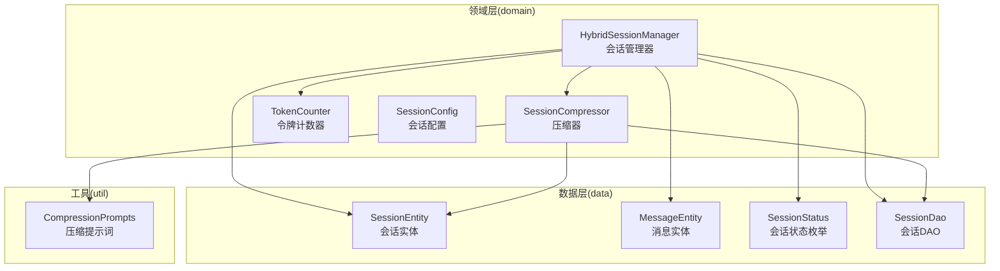
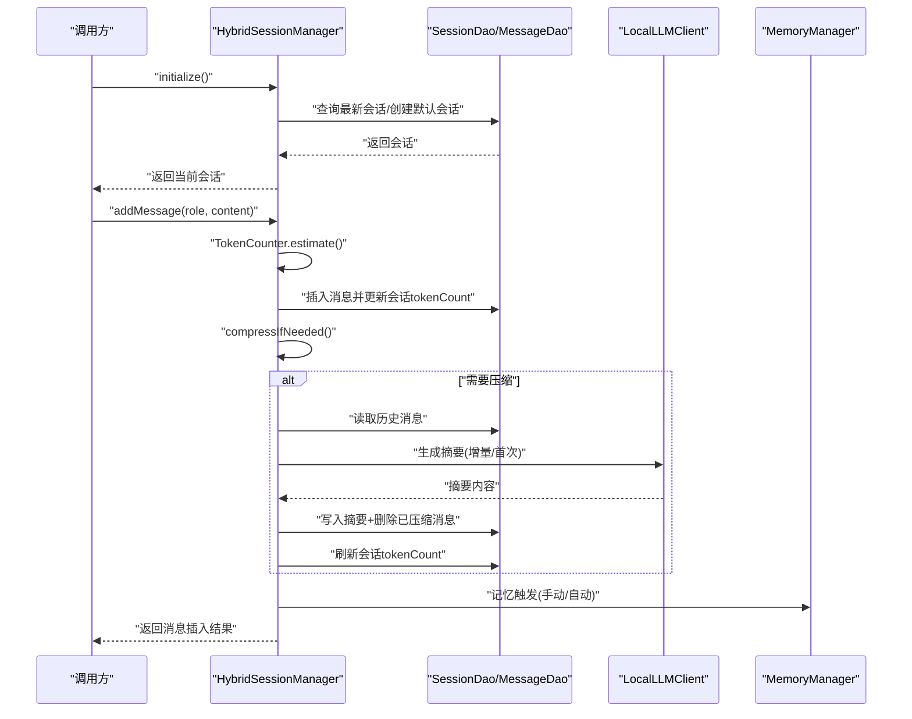
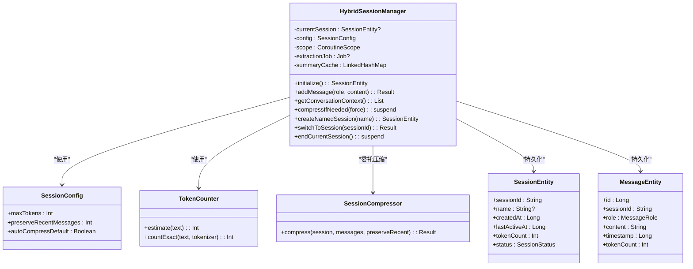
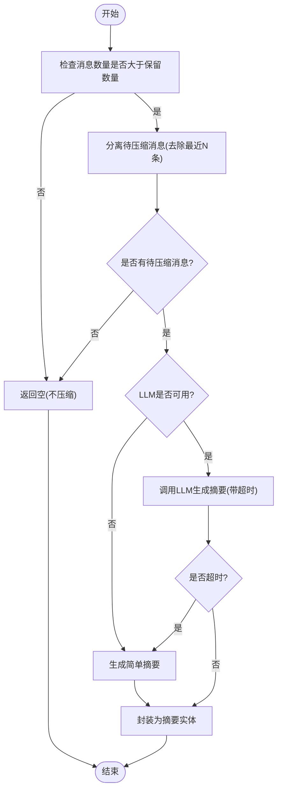
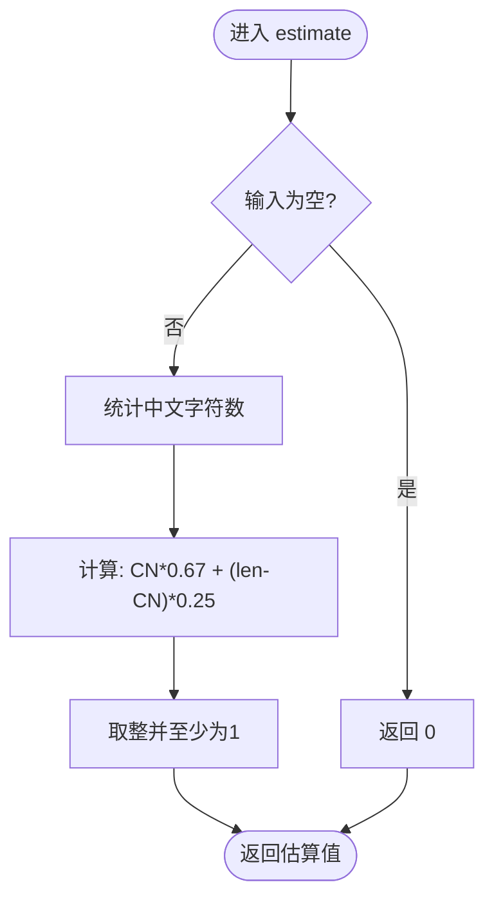
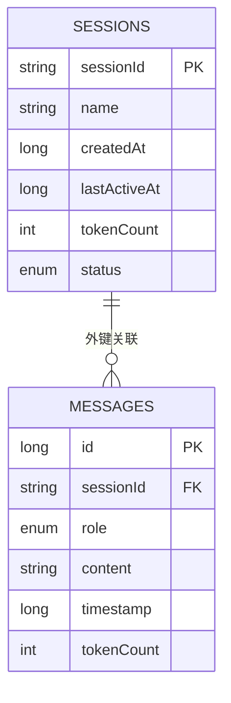
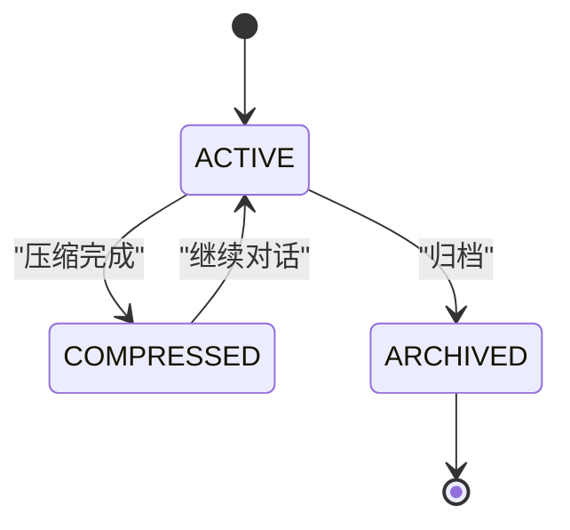
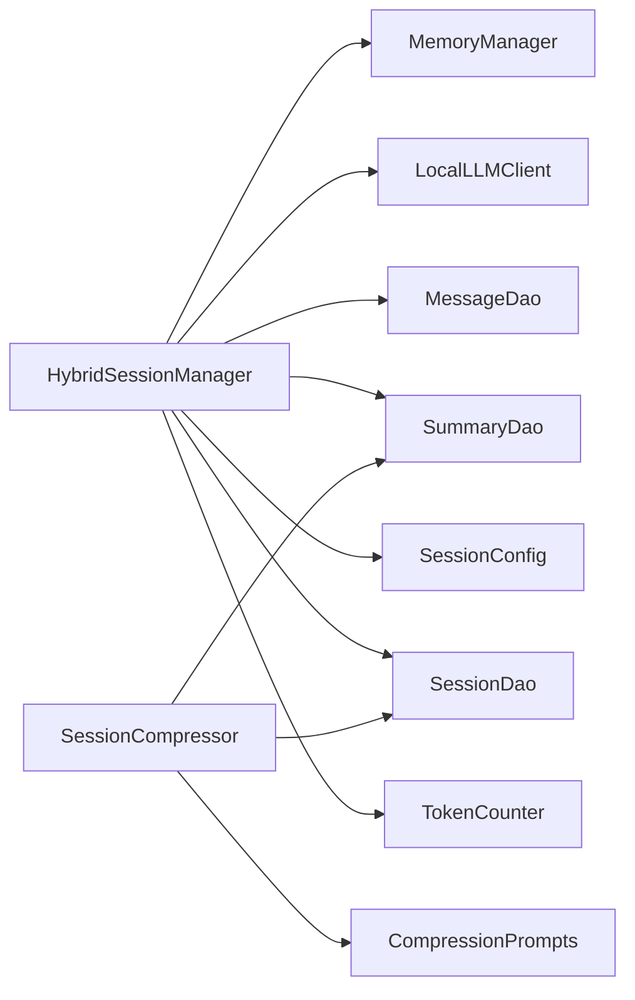

# 会话管理系统

<cite>
**本文引用的文件**
- [HybridSessionManager.kt](file://app/src/main/java/ai/openclaw/android/domain/session/HybridSessionManager.kt)
- [SessionCompressor.kt](file://app/src/main/java/ai/openclaw/android/domain/session/SessionCompressor.kt)
- [TokenCounter.kt](file://app/src/main/java/ai/openclaw/android/domain/session/TokenCounter.kt)
- [SessionConfig.kt](file://app/src/main/java/ai/openclaw/android/domain/model/SessionConfig.kt)
- [SessionEntity.kt](file://app/src/main/java/ai/openclaw/android/data/model/SessionEntity.kt)
- [MessageEntity.kt](file://app/src/main/java/ai/openclaw/android/data/model/MessageEntity.kt)
- [SessionStatus.kt](file://app/src/main/java/ai/openclaw/android/data/model/SessionStatus.kt)
- [CompressionPrompts.kt](file://app/src/main/java/ai/openclaw/android/util/CompressionPrompts.kt)
- [SessionDao.kt](file://app/src/main/java/ai/openclaw/android/data/local/SessionDao.kt)
- [HybridSessionManagerTest.kt](file://app/src/androidTest/java/ai/openclaw/android/domain/session/HybridSessionManagerTest.kt)
- [SessionCompressorTest.kt](file://app/src/test/java/ai/openclaw/android/domain/session/SessionCompressorTest.kt)
- [TokenCounterTest.kt](file://app/src/test/java/ai/openclaw/android/domain/session/TokenCounterTest.kt)
- [agent-session-optimization.md](file://docs/agent-session-optimization.md)
</cite>

## 目录
1. [简介](#简介)
2. [项目结构](#项目结构)
3. [核心组件](#核心组件)
4. [架构总览](#架构总览)
5. [详细组件分析](#详细组件分析)
6. [依赖关系分析](#依赖关系分析)
7. [性能考量](#性能考量)
8. [故障排查指南](#故障排查指南)
9. [结论](#结论)
10. [附录](#附录)

## 简介
本文件面向开发者与架构师，系统化阐述会话管理子系统的整体设计与实现细节，重点覆盖：
- HybridSessionManager 混合会话管理器：会话创建、状态管理、生命周期控制与资源清理
- SessionCompressor 会话压缩器：令牌优化策略与上下文精简算法
- TokenCounter 令牌计数器：估算精度与成本控制机制
- SessionConfig 会话配置：参数调优与性能影响
- SessionEntity 会话实体：数据模型与持久化策略
- 会话状态转换图、压缩算法流程图、令牌计算示例
- 优化配置模板、性能监控指标与内存使用分析
- 最佳实践、错误处理策略与扩展开发指导

## 项目结构
会话管理相关代码主要位于 domain/session 与 data/model、data/local、util 下，并配套单元/集成测试验证行为。

图表来源
- [HybridSessionManager.kt:1-457](file://app/src/main/java/ai/openclaw/android/domain/session/HybridSessionManager.kt#L1-L457)
- [SessionCompressor.kt:1-83](file://app/src/main/java/ai/openclaw/android/domain/session/SessionCompressor.kt#L1-L83)
- [TokenCounter.kt:1-25](file://app/src/main/java/ai/openclaw/android/domain/session/TokenCounter.kt#L1-L25)
- [SessionConfig.kt:1-10](file://app/src/main/java/ai/openclaw/android/domain/model/SessionConfig.kt#L1-L10)
- [SessionEntity.kt:1-14](file://app/src/main/java/ai/openclaw/android/data/model/SessionEntity.kt#L1-L14)
- [MessageEntity.kt:1-25](file://app/src/main/java/ai/openclaw/android/data/model/MessageEntity.kt#L1-L25)
- [SessionStatus.kt:1-7](file://app/src/main/java/ai/openclaw/android/data/model/SessionStatus.kt#L1-L7)
- [CompressionPrompts.kt:1-31](file://app/src/main/java/ai/openclaw/android/util/CompressionPrompts.kt#L1-L31)
- [SessionDao.kt:1-31](file://app/src/main/java/ai/openclaw/android/data/local/SessionDao.kt#L1-L31)

章节来源
- [HybridSessionManager.kt:1-457](file://app/src/main/java/ai/openclaw/android/domain/session/HybridSessionManager.kt#L1-L457)
- [SessionCompressor.kt:1-83](file://app/src/main/java/ai/openclaw/android/domain/session/SessionCompressor.kt#L1-L83)
- [TokenCounter.kt:1-25](file://app/src/main/java/ai/openclaw/android/domain/session/TokenCounter.kt#L1-L25)
- [SessionConfig.kt:1-10](file://app/src/main/java/ai/openclaw/android/domain/model/SessionConfig.kt#L1-L10)
- [SessionEntity.kt:1-14](file://app/src/main/java/ai/openclaw/android/data/model/SessionEntity.kt#L1-L14)
- [MessageEntity.kt:1-25](file://app/src/main/java/ai/openclaw/android/data/model/MessageEntity.kt#L1-L25)
- [SessionStatus.kt:1-7](file://app/src/main/java/ai/openclaw/android/data/model/SessionStatus.kt#L1-L7)
- [CompressionPrompts.kt:1-31](file://app/src/main/java/ai/openclaw/android/util/CompressionPrompts.kt#L1-L31)
- [SessionDao.kt:1-31](file://app/src/main/java/ai/openclaw/android/data/local/SessionDao.kt#L1-L31)

## 核心组件
- HybridSessionManager：负责会话生命周期、消息写入、上下文构建、自动压缩、记忆触发与跨会话记忆抽取、摘要缓存与清理等。
- SessionCompressor：独立的压缩器，支持 LLM 压缩与降级的简单摘要；可作为外部模块复用。
- TokenCounter：提供粗略估算与精确计数（基于外部 tokenizer）能力，支撑上下文裁剪与压缩阈值判断。
- SessionConfig：集中式配置，控制最大 token 阈值、最近消息保留数量与自动压缩开关。
- SessionEntity/MessageEntity：Room 实体定义，承载会话与消息的持久化结构。
- CompressionPrompts：压缩阶段的系统提示词模板，规范摘要结构与长度约束。

章节来源
- [HybridSessionManager.kt:28-457](file://app/src/main/java/ai/openclaw/android/domain/session/HybridSessionManager.kt#L28-L457)
- [SessionCompressor.kt:13-83](file://app/src/main/java/ai/openclaw/android/domain/session/SessionCompressor.kt#L13-L83)
- [TokenCounter.kt:3-25](file://app/src/main/java/ai/openclaw/android/domain/session/TokenCounter.kt#L3-L25)
- [SessionConfig.kt:6-10](file://app/src/main/java/ai/openclaw/android/domain/model/SessionConfig.kt#L6-L10)
- [SessionEntity.kt:6-14](file://app/src/main/java/ai/openclaw/android/data/model/SessionEntity.kt#L6-L14)
- [MessageEntity.kt:8-25](file://app/src/main/java/ai/openclaw/android/data/model/MessageEntity.kt#L8-L25)
- [CompressionPrompts.kt:5-31](file://app/src/main/java/ai/openclaw/android/util/CompressionPrompts.kt#L5-L31)

## 架构总览
会话管理以 HybridSessionManager 为核心协调器，围绕 Room 数据层与可选的本地 LLM 客户端协作，形成“写入-评估-压缩-持久化”的闭环。

图表来源
- [HybridSessionManager.kt:59-110](file://app/src/main/java/ai/openclaw/android/domain/session/HybridSessionManager.kt#L59-L110)
- [HybridSessionManager.kt:236-299](file://app/src/main/java/ai/openclaw/android/domain/session/HybridSessionManager.kt#L236-L299)
- [SessionDao.kt:9-31](file://app/src/main/java/ai/openclaw/android/data/local/SessionDao.kt#L9-L31)

## 详细组件分析

### HybridSessionManager 混合会话管理器
- 设计理念
  - 单例式会话持有与生命周期管理：通过 currentSession 维护当前会话，支持初始化、切换、结束。
  - 写入即评估：消息写入时即时估算 token 并更新会话 tokenCount，触发压缩检查。
  - 上下文构建：优先使用摘要缓存，其次回退数据库；结合最近消息与重要记忆注入，形成稳定上下文。
  - 压缩策略：阈值驱动（SessionConfig.maxTokens），保留最近 N 条（SessionConfig.preserveRecentMessages），支持增量摘要合并。
  - 记忆系统：手动触发与延迟自动提取相结合，跨会话抽取偏好、决策、任务等关键事实。
  - 资源清理：结束会话时取消自动提取任务，释放内存占用。

- 关键流程
  - 会话初始化与创建
  - 消息写入与 token 估算
  - 上下文构建（摘要+最近消息+记忆注入）
  - 压缩执行（LLM 生成摘要或降级策略）
  - 记忆抽取与跨会话关联
  - 会话切换与结束

- 状态管理
  - 会话状态枚举：ACTIVE、COMPRESSED、ARCHIVED，用于 UI 与业务层状态展示与控制。

- 性能与可靠性
  - 摘要 LRU 缓存：减少重复查询，提升上下文构建效率。
  - 自动提取延迟：避免高频触发，降低后台压力。
  - 异常兜底：压缩与记忆提取均包裹异常捕获，保证主流程稳定。

章节来源
- [HybridSessionManager.kt:28-457](file://app/src/main/java/ai/openclaw/android/domain/session/HybridSessionManager.kt#L28-L457)
- [SessionStatus.kt:3-7](file://app/src/main/java/ai/openclaw/android/data/model/SessionStatus.kt#L3-L7)

#### 类关系图

图表来源
- [HybridSessionManager.kt:31-457](file://app/src/main/java/ai/openclaw/android/domain/session/HybridSessionManager.kt#L31-L457)
- [SessionCompressor.kt:13-83](file://app/src/main/java/ai/openclaw/android/domain/session/SessionCompressor.kt#L13-L83)
- [TokenCounter.kt:3-25](file://app/src/main/java/ai/openclaw/android/domain/session/TokenCounter.kt#L3-L25)
- [SessionConfig.kt:6-10](file://app/src/main/java/ai/openclaw/android/domain/model/SessionConfig.kt#L6-L10)
- [SessionEntity.kt:6-14](file://app/src/main/java/ai/openclaw/android/data/model/SessionEntity.kt#L6-L14)
- [MessageEntity.kt:8-25](file://app/src/main/java/ai/openclaw/android/data/model/MessageEntity.kt#L8-L25)

### SessionCompressor 会话压缩器
- 设计目标
  - 在 LLM 可用时生成高质量摘要；不可用时提供快速降级策略，确保系统可用性。
  - 支持保留最近 N 条消息，避免上下文丢失关键信息。
  - 提供可复用的压缩能力，便于在其他场景中使用。

- 算法流程
  - 输入：会话、消息列表、保留最近条数
  - 判断消息数量是否满足压缩条件
  - 若 LLM 可用：构造提示词，调用 LLM 生成摘要；超时则降级
  - 若 LLM 不可用：生成简单摘要（前若干条消息的片段拼接）
  - 输出：摘要实体（包含范围与时间戳）

图表来源
- [SessionCompressor.kt:18-60](file://app/src/main/java/ai/openclaw/android/domain/session/SessionCompressor.kt#L18-L60)

章节来源
- [SessionCompressor.kt:13-83](file://app/src/main/java/ai/openclaw/android/domain/session/SessionCompressor.kt#L13-L83)
- [CompressionPrompts.kt:5-31](file://app/src/main/java/ai/openclaw/android/util/CompressionPrompts.kt#L5-L31)

### TokenCounter 令牌计数器
- 估算策略
  - 中文字符权重：约 1 个字符 ≈ 0.67 token
  - 非中文字符（英文等）权重：约 1 词 ≈ 0.25 token
  - 最终取整并至少为 1，避免零 token 导致的边界问题
- 精确计数
  - 支持传入外部 tokenizer，若可用则走精确路径；否则回退到估算
- 成本控制
  - 通过估算值参与阈值判断，避免上下文过大导致模型拒绝或性能下降

图表来源
- [TokenCounter.kt:8-15](file://app/src/main/java/ai/openclaw/android/domain/session/TokenCounter.kt#L8-L15)

章节来源
- [TokenCounter.kt:3-25](file://app/src/main/java/ai/openclaw/android/domain/session/TokenCounter.kt#L3-L25)

### SessionConfig 会话配置
- 关键参数
  - maxTokens：触发压缩的 token 阈值
  - preserveRecentMessages：压缩时保留的最近消息数量
  - autoCompressDefault：是否默认开启自动压缩
- 调优建议
  - 较大阈值：适合长对话，但内存与 IO 压力上升
  - 较小阈值：更频繁压缩，节省空间但增加 LLM 调用频率
  - 保留数量：直接影响上下文新鲜度与检索效果
- 影响范围
  - 与 HybridSessionManager 的 compressIfNeeded、getConversationContext 等逻辑强耦合

章节来源
- [SessionConfig.kt:6-10](file://app/src/main/java/ai/openclaw/android/domain/model/SessionConfig.kt#L6-L10)
- [HybridSessionManager.kt:40, 163, 240:40-40](file://app/src/main/java/ai/openclaw/android/domain/session/HybridSessionManager.kt#L40-L40)
- [HybridSessionManager.kt:163, 240:163-165](file://app/src/main/java/ai/openclaw/android/domain/session/HybridSessionManager.kt#L163-L165)
- [HybridSessionManager.kt:253, 254:253-255](file://app/src/main/java/ai/openclaw/android/domain/session/HybridSessionManager.kt#L253-L255)

### SessionEntity 会话实体与数据模型
- 数据模型
  - 主键：sessionId
  - 名称：可空，默认会话
  - 时间戳：创建时间、最后活跃时间
  - tokenCount：当前会话累计 token 估算值
  - 状态：ACTIVE/COMPRESSED/ARCHIVED
- 持久化策略
  - Room 实体，配合 SessionDao 进行 CRUD
  - 与 MessageEntity 通过 sessionId 外键关联，删除会话时级联删除消息
- 索引与约束
  - 会话表按 lastActiveAt 排序查询
  - 消息表按 sessionId 建索引，加速按会话查询

图表来源
- [SessionEntity.kt:6-14](file://app/src/main/java/ai/openclaw/android/data/model/SessionEntity.kt#L6-L14)
- [MessageEntity.kt:8-25](file://app/src/main/java/ai/openclaw/android/data/model/MessageEntity.kt#L8-L25)
- [SessionDao.kt:26-31](file://app/src/main/java/ai/openclaw/android/data/local/SessionDao.kt#L26-L31)

章节来源
- [SessionEntity.kt:6-14](file://app/src/main/java/ai/openclaw/android/data/model/SessionEntity.kt#L6-L14)
- [MessageEntity.kt:8-25](file://app/src/main/java/ai/openclaw/android/data/model/MessageEntity.kt#L8-L25)
- [SessionDao.kt:9-31](file://app/src/main/java/ai/openclaw/android/data/local/SessionDao.kt#L9-L31)

### 会话状态转换图

图表来源
- [SessionStatus.kt:3-7](file://app/src/main/java/ai/openclaw/android/data/model/SessionStatus.kt#L3-L7)
- [HybridSessionManager.kt:419](file://app/src/main/java/ai/openclaw/android/domain/session/HybridSessionManager.kt#L419)

## 依赖关系分析
- 组件内聚与耦合
  - HybridSessionManager 内聚度高，协调 DAO、LLM、MemoryManager、TokenCounter、SessionConfig 等，职责清晰
  - SessionCompressor 与 CompressionPrompts 解耦，便于替换提示词或外部模型
  - TokenCounter 与具体 tokenizer 解耦，支持未来接入精确计数
- 外部依赖
  - Room 数据层（SessionDao/MessageDao/SummaryDao）
  - 可选 LocalLLMClient（模型加载状态、聊天接口）
  - MemoryManager（记忆抽取与存储）
- 潜在风险
  - LLM 不可用时的降级路径需保证稳定性
  - 大会话压缩的 IO 与 CPU 压力，需结合配置与监控

图表来源
- [HybridSessionManager.kt:31-457](file://app/src/main/java/ai/openclaw/android/domain/session/HybridSessionManager.kt#L31-L457)
- [SessionCompressor.kt:13-83](file://app/src/main/java/ai/openclaw/android/domain/session/SessionCompressor.kt#L13-L83)
- [CompressionPrompts.kt:5-31](file://app/src/main/java/ai/openclaw/android/util/CompressionPrompts.kt#L5-L31)

章节来源
- [HybridSessionManager.kt:31-457](file://app/src/main/java/ai/openclaw/android/domain/session/HybridSessionManager.kt#L31-L457)
- [SessionCompressor.kt:13-83](file://app/src/main/java/ai/openclaw/android/domain/session/SessionCompressor.kt#L13-L83)

## 性能考量
- 令牌估算与阈值
  - 通过 TokenCounter 估算消息 token，结合 SessionConfig.maxTokens 决定压缩时机
  - 估算公式兼顾中英文字符特性，避免过度压缩或不足
- 上下文裁剪
  - 保留最近 N 条消息，平衡上下文新鲜度与长度
  - 摘要缓存减少数据库访问，提升构建速度
- 压缩策略
  - LLM 压缩质量高但成本较高；降级策略保证可用性
  - 增量摘要合并，减少重复信息，提高摘要稳定性
- 记忆抽取
  - 自动延迟提取避免频繁 IO；跨会话抽取关键事实增强长期记忆
- 监控与指标
  - 建议采集：会话 tokenCount、压缩次数/耗时、摘要长度、LLM 调用成功率、内存占用、CPU 占用
  - 参考文档中的 Token 用量统计建议，可扩展到会话管理侧

章节来源
- [TokenCounter.kt:8-15](file://app/src/main/java/ai/openclaw/android/domain/session/TokenCounter.kt#L8-L15)
- [SessionConfig.kt:6-10](file://app/src/main/java/ai/openclaw/android/domain/model/SessionConfig.kt#L6-L10)
- [HybridSessionManager.kt:44, 163, 240, 260:44-47](file://app/src/main/java/ai/openclaw/android/domain/session/HybridSessionManager.kt#L44-L47)
- [agent-session-optimization.md:143-144](file://docs/agent-session-optimization.md#L143-L144)

## 故障排查指南
- 常见问题
  - LLM 不可用导致压缩失败：检查 isModelLoaded 状态与降级逻辑
  - 压缩后 tokenCount 未更新：确认消息删除与重新统计流程
  - 记忆提取异常：检查 MemoryManager 可用性与异常日志
  - 上下文构建为空：确认当前会话是否存在、摘要缓存是否命中
- 调试建议
  - 打开日志级别，观察压缩触发点与摘要生成
  - 使用测试用例验证 TokenCounter 估算与 SessionCompressor 降级行为
  - 集成测试验证 HybridSessionManager 的初始化、消息写入与上下文构建

章节来源
- [HybridSessionManagerTest.kt:50-78](file://app/src/androidTest/java/ai/openclaw/android/domain/session/HybridSessionManagerTest.kt#L50-L78)
- [SessionCompressorTest.kt:50-80](file://app/src/test/java/ai/openclaw/android/domain/session/SessionCompressorTest.kt#L50-L80)
- [TokenCounterTest.kt:9-45](file://app/src/test/java/ai/openclaw/android/domain/session/TokenCounterTest.kt#L9-L45)

## 结论
会话管理系统以 HybridSessionManager 为核心，结合 TokenCounter、SessionConfig、SessionCompressor 与数据模型，形成了从“写入-评估-压缩-持久化”的完整闭环。通过合理的阈值与保留策略、摘要缓存与降级机制，系统在保证上下文质量的同时，有效控制了内存与 IO 压力。建议在生产环境中持续监控关键指标，并根据业务场景调整配置参数，以获得最佳的性能与体验平衡。

## 附录

### 会话优化配置模板
- 基础模板
  - maxTokens：建议 1800（可根据模型上下文长度调整）
  - preserveRecentMessages：建议 10（兼顾新鲜度与长度）
  - autoCompressDefault：建议 true（保障长期会话稳定性）
- 场景化建议
  - 长对话助手：增大 maxTokens，适度增加保留数量
  - 资源受限设备：减小 maxTokens，缩短保留数量，强化降级策略
  - 高频短期交互：较小阈值与保留数量，降低压缩频率

章节来源
- [SessionConfig.kt:6-10](file://app/src/main/java/ai/openclaw/android/domain/model/SessionConfig.kt#L6-L10)

### 性能监控指标清单
- 会话维度
  - tokenCount、会话时长、压缩次数、平均压缩耗时
- 上下文维度
  - 上下文长度、摘要长度、最近消息占比
- LLM 维度
  - 摘要生成成功率、LLM 调用耗时、降级比例
- 资源维度
  - 内存占用、CPU 占用、数据库 IO 次数

章节来源
- [agent-session-optimization.md:143-144](file://docs/agent-session-optimization.md#L143-L144)

### 令牌计算示例（路径参考）
- 示例路径
  - 中文文本估算：[TokenCounter.estimate:8-15](file://app/src/main/java/ai/openclaw/android/domain/session/TokenCounter.kt#L8-L15)
  - 混合文本估算：[TokenCounter.estimate:8-15](file://app/src/main/java/ai/openclaw/android/domain/session/TokenCounter.kt#L8-L15)
  - 精确计数回退：[TokenCounter.countExact:18-24](file://app/src/main/java/ai/openclaw/android/domain/session/TokenCounter.kt#L18-L24)
- 测试验证
  - 中文估算范围：[TokenCounterTest.estimate_chineseText:10-15](file://app/src/test/java/ai/openclaw/android/domain/session/TokenCounterTest.kt#L10-L15)
  - 英文估算范围：[TokenCounterTest.estimate_englishText:17-23](file://app/src/test/java/ai/openclaw/android/domain/session/TokenCounterTest.kt#L17-L23)
  - 混合文本估算：[TokenCounterTest.estimate_mixedText:26-30](file://app/src/test/java/ai/openclaw/android/domain/session/TokenCounterTest.kt#L26-L30)
  - 空串处理：[TokenCounterTest.estimate_emptyString:33-36](file://app/src/test/java/ai/openclaw/android/domain/session/TokenCounterTest.kt#L33-L36)
  - 精确计数回退：[TokenCounterTest.countExact_withNullTokenizer:39-44](file://app/src/test/java/ai/openclaw/android/domain/session/TokenCounterTest.kt#L39-L44)

### 最佳实践与扩展开发指导
- 最佳实践
  - 合理设置 maxTokens 与保留数量，避免频繁压缩或上下文过长
  - 使用摘要缓存与降级策略，提升系统鲁棒性
  - 在消息写入时统一估算 token，确保阈值判断一致
  - 对压缩与记忆提取进行异步处理，避免阻塞主线程
- 扩展开发
  - 新增外部 tokenizer：在 TokenCounter 中接入精确计数
  - 替换压缩提示词：通过 CompressionPrompts 模板化管理
  - 自定义压缩器：实现独立压缩器接口，适配不同模型或策略
  - 增强记忆抽取：引入更细粒度的记忆类型与抽取规则

章节来源
- [TokenCounter.kt:18-24](file://app/src/main/java/ai/openclaw/android/domain/session/TokenCounter.kt#L18-L24)
- [CompressionPrompts.kt:5-31](file://app/src/main/java/ai/openclaw/android/util/CompressionPrompts.kt#L5-L31)
- [HybridSessionManager.kt:136-150](file://app/src/main/java/ai/openclaw/android/domain/session/HybridSessionManager.kt#L136-L150)