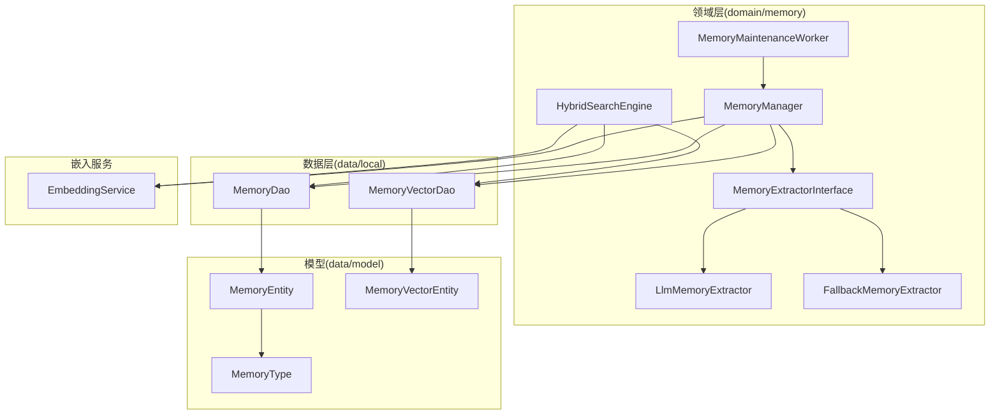
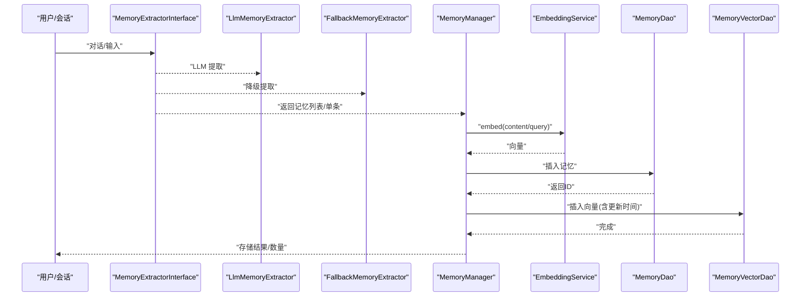
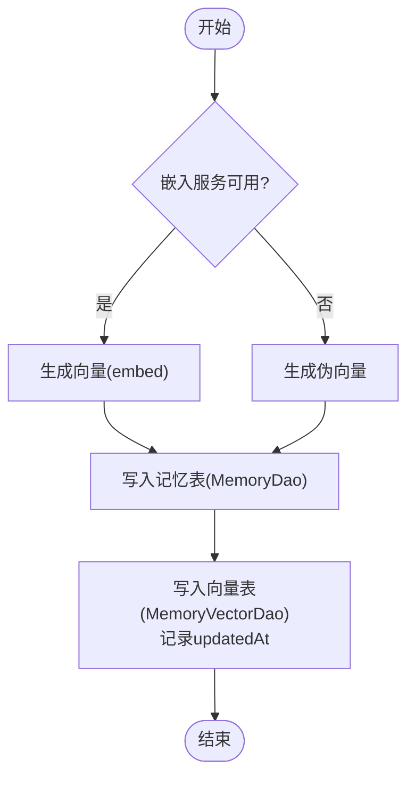
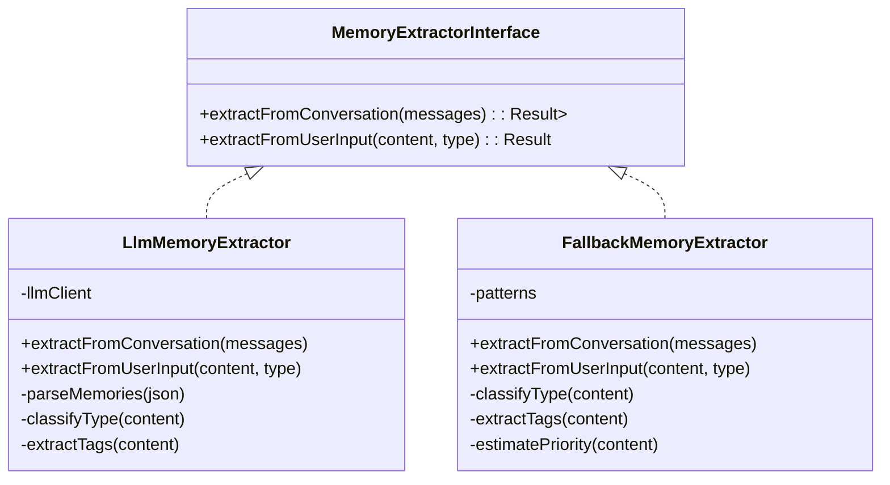
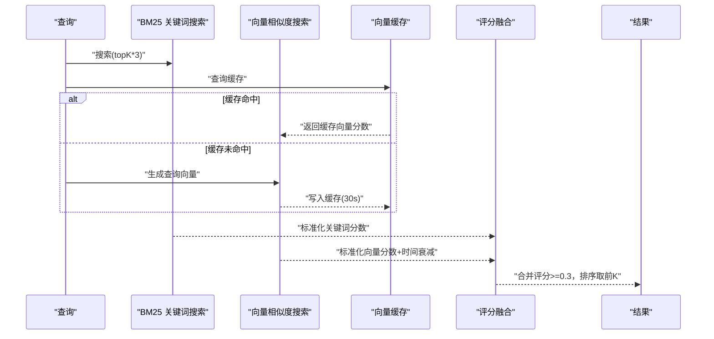
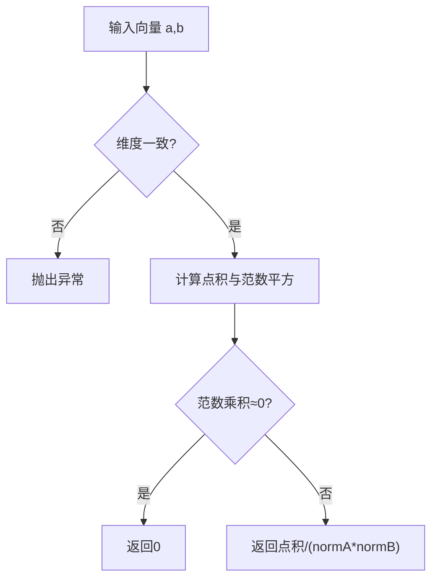
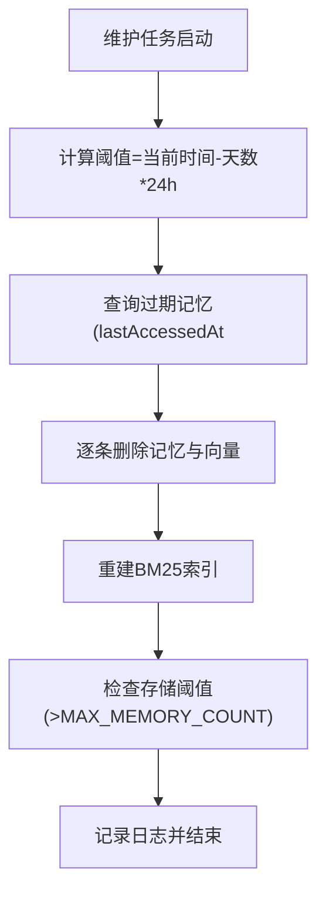
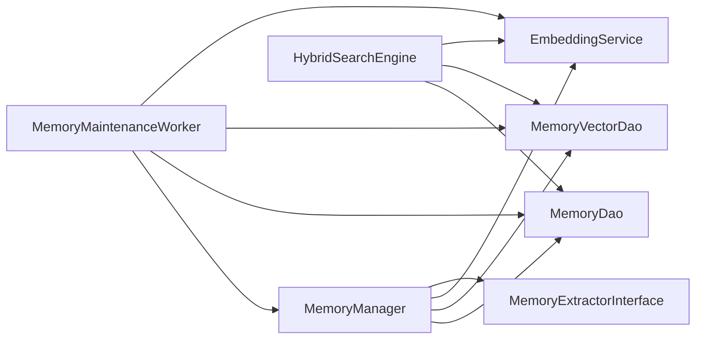
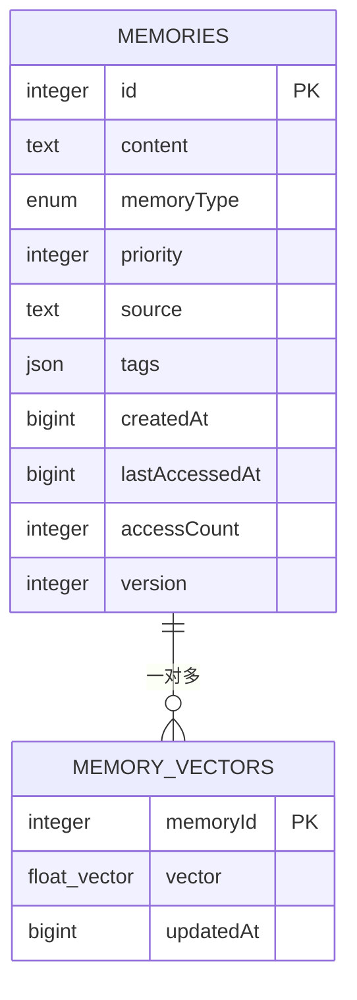

# 内存管理器

<cite>
**本文引用的文件**
- [MemoryManager.kt](file://app/src/main/java/ai/openclaw/android/domain/memory/MemoryManager.kt)
- [MemoryExtractor.kt](file://app/src/main/java/ai/openclaw/android/domain/memory/MemoryExtractor.kt)
- [FallbackMemoryExtractor.kt](file://app/src/main/java/ai/openclaw/android/domain/memory/FallbackMemoryExtractor.kt)
- [MemoryExtractorInterface.kt](file://app/src/main/java/ai/openclaw/android/domain/memory/MemoryExtractorInterface.kt)
- [MemoryDao.kt](file://app/src/main/java/ai/openclaw/android/data/local/MemoryDao.kt)
- [MemoryVectorDao.kt](file://app/src/main/java/ai/openclaw/android/data/local/MemoryVectorDao.kt)
- [MemoryEntity.kt](file://app/src/main/java/ai/openclaw/android/data/model/MemoryEntity.kt)
- [MemoryVectorEntity.kt](file://app/src/main/java/ai/openclaw/android/data/model/MemoryVectorEntity.kt)
- [MemorySearchResult.kt](file://app/src/main/java/ai/openclaw/android/domain/memory/MemorySearchResult.kt)
- [MemoryMaintenanceWorker.kt](file://app/src/main/java/ai/openclaw/android/domain/memory/MemoryMaintenanceWorker.kt)
- [HybridSearchEngine.kt](file://app/src/main/java/ai/openclaw/android/domain/memory/HybridSearchEngine.kt)
- [EmbeddingService.kt](file://app/src/main/java/ai/openclaw/android/domain/memory/EmbeddingService.kt)
- [MemoryType.kt](file://app/src/main/java/ai/openclaw/android/data/model/MemoryType.kt)
- [MemoryExtractionPrompts.kt](file://app/src/main/java/ai/openclaw/android/util/MemoryExtractionPrompts.kt)
</cite>

## 目录
1. [简介](#简介)
2. [项目结构](#项目结构)
3. [核心组件](#核心组件)
4. [架构总览](#架构总览)
5. [详细组件分析](#详细组件分析)
6. [依赖关系分析](#依赖关系分析)
7. [性能考量](#性能考量)
8. [故障排查指南](#故障排查指南)
9. [结论](#结论)
10. [附录](#附录)

## 简介
本文件系统性阐述内存管理器（MemoryManager）的技术设计与实现细节，覆盖记忆的存储、检索、提取与清理机制；解析从内容提取、向量生成到数据库持久化的完整流程；说明 MemoryExtractor 接口的设计理念及“标准提取器”与“降级提取器”的使用场景；详解余弦相似度计算的数学原理与性能优化；给出内存清理策略（基于访问时间与访问频率）与最佳实践（存储优化、查询性能调优、内存泄漏防护），并提供可直接定位到源码的路径指引。

## 项目结构
围绕内存管理的关键模块分布于 domain/memory 与 data/local 层，配合嵌入服务与混合检索引擎协同工作：
- domain/memory：内存管理器、提取器接口与实现、混合检索引擎、维护任务
- data/local：Room DAO（记忆与向量）、实体模型
- data/model：领域模型（记忆、向量、类型等）
- util：提示词模板（用于LLM提取）

图示来源
- [MemoryManager.kt:10-116](file://app/src/main/java/ai/openclaw/android/domain/memory/MemoryManager.kt#L10-L116)
- [MemoryExtractorInterface.kt:7-11](file://app/src/main/java/ai/openclaw/android/domain/memory/MemoryExtractorInterface.kt#L7-L11)
- [MemoryExtractor.kt:16-99](file://app/src/main/java/ai/openclaw/android/domain/memory/MemoryExtractor.kt#L16-L99)
- [FallbackMemoryExtractor.kt:7-83](file://app/src/main/java/ai/openclaw/android/domain/memory/FallbackMemoryExtractor.kt#L7-L83)
- [HybridSearchEngine.kt:18-227](file://app/src/main/java/ai/openclaw/android/domain/memory/HybridSearchEngine.kt#L18-L227)
- [MemoryMaintenanceWorker.kt:16-70](file://app/src/main/java/ai/openclaw/android/domain/memory/MemoryMaintenanceWorker.kt#L16-L70)
- [MemoryDao.kt:12-48](file://app/src/main/java/ai/openclaw/android/data/local/MemoryDao.kt#L12-L48)
- [MemoryVectorDao.kt:10-25](file://app/src/main/java/ai/openclaw/android/data/local/MemoryVectorDao.kt#L10-L25)
- [MemoryEntity.kt:7-18](file://app/src/main/java/ai/openclaw/android/data/model/MemoryEntity.kt#L7-L18)
- [MemoryVectorEntity.kt:7-19](file://app/src/main/java/ai/openclaw/android/data/model/MemoryVectorEntity.kt#L7-L19)
- [MemoryType.kt:3-5](file://app/src/main/java/ai/openclaw/android/data/model/MemoryType.kt#L3-L5)
- [EmbeddingService.kt:3-8](file://app/src/main/java/ai/openclaw/android/domain/memory/EmbeddingService.kt#L3-L8)

章节来源
- [MemoryManager.kt:10-116](file://app/src/main/java/ai/openclaw/android/domain/memory/MemoryManager.kt#L10-L116)
- [MemoryDao.kt:12-48](file://app/src/main/java/ai/openclaw/android/data/local/MemoryDao.kt#L12-L48)
- [MemoryVectorDao.kt:10-25](file://app/src/main/java/ai/openclaw/android/data/local/MemoryVectorDao.kt#L10-L25)

## 核心组件
- MemoryManager：统一编排记忆的存储、检索、提取与清理，内置余弦相似度计算与阈值过滤。
- MemoryExtractorInterface 及其实现：定义从对话或用户输入中抽取记忆的标准接口，提供 LLM 提取器与降级提取器两种实现。
- HybridSearchEngine：融合 BM25 关键词检索、向量相似度与时间衰减的混合检索，支持并发与缓存。
- MemoryMaintenanceWorker：周期性维护任务，执行过期清理、重建索引与容量控制。
- DAO 与实体：MemoryDao/MemoryVectorDao 负责持久化；MemoryEntity/MemoryVectorEntity 描述数据结构。

章节来源
- [MemoryManager.kt:10-116](file://app/src/main/java/ai/openclaw/android/domain/memory/MemoryManager.kt#L10-L116)
- [MemoryExtractorInterface.kt:7-11](file://app/src/main/java/ai/openclaw/android/domain/memory/MemoryExtractorInterface.kt#L7-L11)
- [HybridSearchEngine.kt:18-227](file://app/src/main/java/ai/openclaw/android/domain/memory/HybridSearchEngine.kt#L18-L227)
- [MemoryMaintenanceWorker.kt:16-70](file://app/src/main/java/ai/openclaw/android/domain/memory/MemoryMaintenanceWorker.kt#L16-L70)
- [MemoryDao.kt:12-48](file://app/src/main/java/ai/openclaw/android/data/local/MemoryDao.kt#L12-L48)
- [MemoryVectorDao.kt:10-25](file://app/src/main/java/ai/openclaw/android/data/local/MemoryVectorDao.kt#L10-L25)

## 架构总览
下图展示从消息到记忆存储、向量生成与持久化的端到端流程，以及检索阶段的混合搜索与缓存策略。

图示来源
- [MemoryManager.kt:16-36](file://app/src/main/java/ai/openclaw/android/domain/memory/MemoryManager.kt#L16-L36)
- [MemoryExtractor.kt:18-34](file://app/src/main/java/ai/openclaw/android/domain/memory/MemoryExtractor.kt#L18-L34)
- [FallbackMemoryExtractor.kt:17-42](file://app/src/main/java/ai/openclaw/android/domain/memory/FallbackMemoryExtractor.kt#L17-L42)
- [EmbeddingService.kt:3-8](file://app/src/main/java/ai/openclaw/android/domain/memory/EmbeddingService.kt#L3-L8)
- [MemoryDao.kt:13-14](file://app/src/main/java/ai/openclaw/android/data/local/MemoryDao.kt#L13-L14)
- [MemoryVectorDao.kt:11-12](file://app/src/main/java/ai/openclaw/android/data/local/MemoryVectorDao.kt#L11-L12)

## 详细组件分析

### MemoryManager：存储、检索、提取与清理
- 存储流程
  - 若嵌入服务可用则生成向量，否则生成伪向量作为降级方案。
  - 先写入记忆表，再写入向量表，向量记录包含更新时间戳。
- 检索流程
  - 查询时同样支持嵌入服务可用/不可用两种路径，生成查询向量。
  - 暴力遍历所有向量，计算余弦相似度，按阈值过滤与排序，限制返回数量。
  - 同时通过向量 ID 获取对应记忆实体，封装为检索结果。
- 提取与存储
  - 从对话批量提取记忆后逐条存储；手动输入也可直接提取并存储。
- 访问追踪
  - 触摸接口更新最近访问时间与访问计数，用于后续清理策略。
- 清理策略
  - 基于“最后访问时间早于阈值且访问次数小于最小值”的条件筛选过期记忆，删除记忆与其向量。
- 余弦相似度
  - 自带实现，包含维度校验、范数归一化与分母极小值保护。

图示来源
- [MemoryManager.kt:16-36](file://app/src/main/java/ai/openclaw/android/domain/memory/MemoryManager.kt#L16-L36)
- [MemoryDao.kt:13-14](file://app/src/main/java/ai/openclaw/android/data/local/MemoryDao.kt#L13-L14)
- [MemoryVectorDao.kt:11-12](file://app/src/main/java/ai/openclaw/android/data/local/MemoryVectorDao.kt#L11-L12)

章节来源
- [MemoryManager.kt:16-95](file://app/src/main/java/ai/openclaw/android/domain/memory/MemoryManager.kt#L16-L95)
- [MemorySearchResult.kt:5-8](file://app/src/main/java/ai/openclaw/android/domain/memory/MemorySearchResult.kt#L5-L8)

### MemoryExtractor 接口与实现
- 接口职责
  - 定义从对话批量提取记忆与从用户输入提取单条记忆的两个抽象方法。
- 标准提取器（LlmMemoryExtractor）
  - 使用本地 LLM 客户端，结合提示词模板生成 JSON 结构的记忆数组，解析后转换为 MemoryEntity 列表。
  - 支持关键词分类与标签抽取，自动估算优先级。
- 降级提取器（FallbackMemoryExtractor）
  - 在 LLM 不可用时启用，基于关键词模式匹配进行快速抽取，限定每轮最多产出若干条记忆。
  - 同样支持类型分类、标签抽取与优先级估算。

图示来源
- [MemoryExtractorInterface.kt:7-11](file://app/src/main/java/ai/openclaw/android/domain/memory/MemoryExtractorInterface.kt#L7-L11)
- [MemoryExtractor.kt:16-99](file://app/src/main/java/ai/openclaw/android/domain/memory/MemoryExtractor.kt#L16-L99)
- [FallbackMemoryExtractor.kt:7-83](file://app/src/main/java/ai/openclaw/android/domain/memory/FallbackMemoryExtractor.kt#L7-L83)
- [MemoryExtractionPrompts.kt:3-27](file://app/src/main/java/ai/openclaw/android/util/MemoryExtractionPrompts.kt#L3-L27)

章节来源
- [MemoryExtractorInterface.kt:7-11](file://app/src/main/java/ai/openclaw/android/domain/memory/MemoryExtractorInterface.kt#L7-L11)
- [MemoryExtractor.kt:16-99](file://app/src/main/java/ai/openclaw/android/domain/memory/MemoryExtractor.kt#L16-L99)
- [FallbackMemoryExtractor.kt:7-83](file://app/src/main/java/ai/openclaw/android/domain/memory/FallbackMemoryExtractor.kt#L7-L83)
- [MemoryExtractionPrompts.kt:3-27](file://app/src/main/java/ai/openclaw/android/util/MemoryExtractionPrompts.kt#L3-L27)

### 混合检索引擎（HybridSearchEngine）
- 组成与权重
  - 关键词分数（BM25）占比 35%，向量相似度占比 55%，时间衰减占比 10%。
  - 最低合并阈值 0.3，确保召回质量。
- 时间衰减
  - 基于指数衰减模型，半衰期为 30 天，越新的记忆得分越高。
- 并发与缓存
  - 关键词与向量两条路径并发执行；向量相似度结果按查询字符串缓存，TTL 30 秒。
- 搜索范围
  - 默认回溯 90 天内的向量参与向量搜索，若无近期向量则回退到全量向量集合。
- 返回结构
  - 支持标准结果与带明细评分的双返回值，便于诊断与调试。

图示来源
- [HybridSearchEngine.kt:173-225](file://app/src/main/java/ai/openclaw/android/domain/memory/HybridSearchEngine.kt#L173-L225)
- [MemoryManager.kt:101-114](file://app/src/main/java/ai/openclaw/android/domain/memory/MemoryManager.kt#L101-L114)

章节来源
- [HybridSearchEngine.kt:18-227](file://app/src/main/java/ai/openclaw/android/domain/memory/HybridSearchEngine.kt#L18-L227)

### 余弦相似度算法与性能优化
- 数学原理
  - 向量点积除以各自范数乘积，当任一向量范数接近零时返回 0。
- 性能优化
  - 使用原生循环累加，避免额外分配；在混合检索中对候选向量设置最小阈值（如 0.1）以减少无效计算。
  - 通过缓存查询向量的相似度结果，降低重复查询成本。

图示来源
- [MemoryManager.kt:101-114](file://app/src/main/java/ai/openclaw/android/domain/memory/MemoryManager.kt#L101-L114)
- [HybridSearchEngine.kt:162-166](file://app/src/main/java/ai/openclaw/android/domain/memory/HybridSearchEngine.kt#L162-L166)

章节来源
- [MemoryManager.kt:101-114](file://app/src/main/java/ai/openclaw/android/domain/memory/MemoryManager.kt#L101-L114)
- [HybridSearchEngine.kt:148-170](file://app/src/main/java/ai/openclaw/android/domain/memory/HybridSearchEngine.kt#L148-L170)

### 内存清理策略与维护任务
- 清理策略
  - 基于“最后访问时间阈值”和“最小访问次数”筛选过期记忆，删除其在记忆表与向量表中的记录。
  - 提供默认天数与最小访问次数参数，可在业务侧调整。
- 维护任务（MemoryMaintenanceWorker）
  - 周期性执行：清理过期记忆、重建 BM25 索引、检查存储阈值。
  - 使用 Koin 注入 DAO、向量 DAO、嵌入服务与 BM25 索引，构造 MemoryManager 执行清理。

图示来源
- [MemoryManager.kt:87-95](file://app/src/main/java/ai/openclaw/android/domain/memory/MemoryManager.kt#L87-L95)
- [MemoryMaintenanceWorker.kt:25-68](file://app/src/main/java/ai/openclaw/android/domain/memory/MemoryMaintenanceWorker.kt#L25-L68)
- [MemoryDao.kt:43-44](file://app/src/main/java/ai/openclaw/android/data/local/MemoryDao.kt#L43-L44)
- [MemoryVectorDao.kt:20-21](file://app/src/main/java/ai/openclaw/android/data/local/MemoryVectorDao.kt#L20-L21)

章节来源
- [MemoryManager.kt:87-95](file://app/src/main/java/ai/openclaw/android/domain/memory/MemoryManager.kt#L87-L95)
- [MemoryMaintenanceWorker.kt:25-68](file://app/src/main/java/ai/openclaw/android/domain/memory/MemoryMaintenanceWorker.kt#L25-L68)
- [MemoryDao.kt:43-44](file://app/src/main/java/ai/openclaw/android/data/local/MemoryDao.kt#L43-L44)
- [MemoryVectorDao.kt:20-21](file://app/src/main/java/ai/openclaw/android/data/local/MemoryVectorDao.kt#L20-L21)

## 依赖关系分析
- MemoryManager 依赖
  - 数据访问：MemoryDao、MemoryVectorDao
  - 嵌入服务：EmbeddingService（用于生成向量与降级伪向量）
  - 提取器：MemoryExtractorInterface（具体实现为 LLM 或降级提取器）
- HybridSearchEngine 依赖
  - BM25 索引、MemoryDao、MemoryVectorDao、EmbeddingService
- 维护任务依赖
  - 通过 Koin 获取上述组件实例，执行清理与索引重建

图示来源
- [MemoryManager.kt:10-15](file://app/src/main/java/ai/openclaw/android/domain/memory/MemoryManager.kt#L10-L15)
- [HybridSearchEngine.kt:18-23](file://app/src/main/java/ai/openclaw/android/domain/memory/HybridSearchEngine.kt#L18-L23)
- [MemoryMaintenanceWorker.kt:29-34](file://app/src/main/java/ai/openclaw/android/domain/memory/MemoryMaintenanceWorker.kt#L29-L34)

章节来源
- [MemoryManager.kt:10-15](file://app/src/main/java/ai/openclaw/android/domain/memory/MemoryManager.kt#L10-L15)
- [HybridSearchEngine.kt:18-23](file://app/src/main/java/ai/openclaw/android/domain/memory/HybridSearchEngine.kt#L18-L23)
- [MemoryMaintenanceWorker.kt:29-34](file://app/src/main/java/ai/openclaw/android/domain/memory/MemoryMaintenanceWorker.kt#L29-L34)

## 性能考量
- 检索性能
  - MemoryManager 的暴力遍历适合中小规模数据；大规模场景建议优先使用 HybridSearchEngine 的并发与缓存策略。
  - 向量搜索设置最小阈值（如 0.1）与时间窗口（默认 90 天）减少无效计算。
- 缓存策略
  - 向量相似度缓存 TTL 30 秒，显著降低重复查询开销；定期清理过期缓存。
- 存储与索引
  - 定期重建 BM25 索引，保持关键词检索效果；维护任务检查存储上限，避免无限增长。
- 嵌入服务可用性
  - 嵌入服务不可用时自动生成伪向量，保证系统可用性但可能影响检索精度。

## 故障排查指南
- 常见问题
  - 向量维度不匹配：余弦相似度实现要求两向量维度一致，否则抛出异常。请确认嵌入服务维度与向量一致。
  - LLM 提取失败：检查提示词模板与 LLM 客户端响应格式，确保 JSON 结构正确。
  - 检索结果为空：确认嵌入服务可用性、向量是否成功写入、阈值设置是否合理。
  - 清理未生效：检查清理参数（天数、最小访问次数）与访问时间戳更新逻辑。
- 日志与可观测性
  - 维护任务与混合检索引擎均输出 INFO/WARN/ERROR 级日志，便于定位问题。

章节来源
- [MemoryManager.kt:101-114](file://app/src/main/java/ai/openclaw/android/domain/memory/MemoryManager.kt#L101-L114)
- [MemoryExtractor.kt:54-80](file://app/src/main/java/ai/openclaw/android/domain/memory/MemoryExtractor.kt#L54-L80)
- [MemoryMaintenanceWorker.kt:25-68](file://app/src/main/java/ai/openclaw/android/domain/memory/MemoryMaintenanceWorker.kt#L25-L68)
- [HybridSearchEngine.kt:172-225](file://app/src/main/java/ai/openclaw/android/domain/memory/HybridSearchEngine.kt#L172-L225)

## 结论
该内存管理系统通过 MemoryManager 统一编排提取、存储与检索，结合 MemoryExtractor 的两种实现保障在不同运行环境下的稳定性；HybridSearchEngine 将关键词、向量与时间因素融合，兼顾召回质量与性能；MemoryMaintenanceWorker 提供自动化清理与索引维护。整体设计在可用性与扩展性之间取得平衡，适合在移动端资源受限环境下稳定运行。

## 附录

### 数据模型与实体

图示来源
- [MemoryEntity.kt:7-18](file://app/src/main/java/ai/openclaw/android/data/model/MemoryEntity.kt#L7-L18)
- [MemoryVectorEntity.kt:7-19](file://app/src/main/java/ai/openclaw/android/data/model/MemoryVectorEntity.kt#L7-L19)
- [MemoryType.kt:3-5](file://app/src/main/java/ai/openclaw/android/data/model/MemoryType.kt#L3-L5)

### 配置参数与常量
- MemoryManager
  - 最大记忆数：用于维护任务后的容量检查
  - 最小保留数：清理策略的下限
  - 检索阈值与返回数量：search 方法的 threshold 与 limit
- HybridSearchEngine
  - 权重：关键词 35%、向量 55%、时间 10%
  - 最低合并分数：0.3
  - 默认搜索天数：90 天
  - 向量缓存 TTL：30 秒
  - 半衰期（时间衰减）：30 天
- 维护任务
  - 清理天数与最小访问次数：cleanup 方法参数
  - 存储上限：超过后记录警告日志

章节来源
- [MemoryManager.kt:97-114](file://app/src/main/java/ai/openclaw/android/domain/memory/MemoryManager.kt#L97-L114)
- [HybridSearchEngine.kt:24-35](file://app/src/main/java/ai/openclaw/android/domain/memory/HybridSearchEngine.kt#L24-L35)
- [MemoryMaintenanceWorker.kt:55-60](file://app/src/main/java/ai/openclaw/android/domain/memory/MemoryMaintenanceWorker.kt#L55-L60)