# 内存系统

<cite>
**本文引用的文件**
- [MemoryManager.kt](file://app/src/main/java/ai/openclaw/android/domain/memory/MemoryManager.kt)
- [HybridSearchEngine.kt](file://app/src/main/java/ai/openclaw/android/domain/memory/HybridSearchEngine.kt)
- [EmbeddingService.kt](file://app/src/main/java/ai/openclaw/android/domain/memory/EmbeddingService.kt)
- [ColdStartManager.kt](file://app/src/main/java/ai/openclaw/android/domain/memory/ColdStartManager.kt)
- [DiffSyncManager.kt](file://app/src/main/java/ai/openclaw/android/domain/memory/DiffSyncManager.kt)
- [BM25Index.kt](file://app/src/main/java/ai/openclaw/android/data/local/BM25Index.kt)
- [MemoryDao.kt](file://app/src/main/java/ai/openclaw/android/data/local/MemoryDao.kt)
- [MemoryVectorDao.kt](file://app/src/main/java/ai/openclaw/android/data/local/MemoryVectorDao.kt)
- [MemoryEntity.kt](file://app/src/main/java/ai/openclaw/android/data/model/MemoryEntity.kt)
- [MemoryExtractorInterface.kt](file://app/src/main/java/ai/openclaw/android/domain/memory/MemoryExtractorInterface.kt)
- [MemoryExtractor.kt](file://app/src/main/java/ai/openclaw/android/domain/memory/MemoryExtractor.kt)
- [TfLiteEmbeddingService.kt](file://app/src/main/java/ai/openclaw/android/ml/TfLiteEmbeddingService.kt)
</cite>

## 目录
1. [简介](#简介)
2. [项目结构](#项目结构)
3. [核心组件](#核心组件)
4. [架构总览](#架构总览)
5. [详细组件分析](#详细组件分析)
6. [依赖关系分析](#依赖关系分析)
7. [性能考量](#性能考量)
8. [故障排除指南](#故障排除指南)
9. [结论](#结论)
10. [附录](#附录)

## 简介
本文件面向开发者与技术文档读者，系统化阐述内存系统的整体设计与实现细节，覆盖以下主题：
- MemoryManager 内存管理器：存储、检索、同步与维护机制
- HybridSearchEngine 混合检索引擎：BM25 关键词搜索、向量语义搜索与时间衰减融合策略
- EmbeddingService 嵌入服务：向量化处理与相似度计算
- ColdStartManager 冷启动管理器：初始化阶段的轻量化策略
- DiffSyncManager 差异同步管理器：本地与远端的增量同步与冲突解决
- 并配套内存检索流程图、混合搜索算法图与数据同步时序图
- 提供内存优化配置示例、性能调优建议与故障排除方法
- 给出扩展、索引优化与大规模数据处理的最佳实践

## 项目结构
内存系统主要由“领域层”和“数据层”组成：
- 领域层（domain/memory）：MemoryManager、HybridSearchEngine、EmbeddingService 接口、ColdStartManager、DiffSyncManager、MemoryExtractor 及其接口
- 数据层（data/local）：BM25Index、MemoryDao、MemoryVectorDao
- 模型层（data/model）：MemoryEntity、MemoryVectorEntity 等
- 机器学习层（ml）：TfLiteEmbeddingService 实现 EmbeddingService 接口

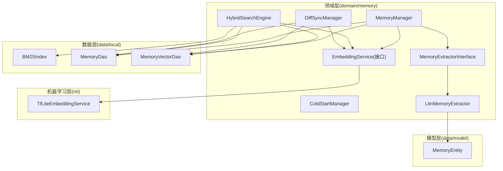

图表来源
- [MemoryManager.kt:10-116](file://app/src/main/java/ai/openclaw/android/domain/memory/MemoryManager.kt#L10-L116)
- [HybridSearchEngine.kt:18-227](file://app/src/main/java/ai/openclaw/android/domain/memory/HybridSearchEngine.kt#L18-L227)
- [EmbeddingService.kt:3-8](file://app/src/main/java/ai/openclaw/android/domain/memory/EmbeddingService.kt#L3-L8)
- [BM25Index.kt:14-203](file://app/src/main/java/ai/openclaw/android/data/local/BM25Index.kt#L14-L203)
- [MemoryDao.kt:12-49](file://app/src/main/java/ai/openclaw/android/data/local/MemoryDao.kt#L12-L49)
- [MemoryVectorDao.kt:9-26](file://app/src/main/java/ai/openclaw/android/data/local/MemoryVectorDao.kt#L9-L26)
- [MemoryEntity.kt:6-19](file://app/src/main/java/ai/openclaw/android/data/model/MemoryEntity.kt#L6-L19)
- [MemoryExtractorInterface.kt:7-11](file://app/src/main/java/ai/openclaw/android/domain/memory/MemoryExtractorInterface.kt#L7-L11)
- [MemoryExtractor.kt:16-99](file://app/src/main/java/ai/openclaw/android/domain/memory/MemoryExtractor.kt#L16-L99)
- [TfLiteEmbeddingService.kt:13-97](file://app/src/main/java/ai/openclaw/android/ml/TfLiteEmbeddingService.kt#L13-L97)

章节来源
- [MemoryManager.kt:10-116](file://app/src/main/java/ai/openclaw/android/domain/memory/MemoryManager.kt#L10-L116)
- [HybridSearchEngine.kt:18-227](file://app/src/main/java/ai/openclaw/android/domain/memory/HybridSearchEngine.kt#L18-L227)
- [BM25Index.kt:14-203](file://app/src/main/java/ai/openclaw/android/data/local/BM25Index.kt#L14-L203)
- [MemoryDao.kt:12-49](file://app/src/main/java/ai/openclaw/android/data/local/MemoryDao.kt#L12-L49)
- [MemoryVectorDao.kt:9-26](file://app/src/main/java/ai/openclaw/android/data/local/MemoryVectorDao.kt#L9-L26)
- [MemoryEntity.kt:6-19](file://app/src/main/java/ai/openclaw/android/data/model/MemoryEntity.kt#L6-L19)
- [MemoryExtractorInterface.kt:7-11](file://app/src/main/java/ai/openclaw/android/domain/memory/MemoryExtractorInterface.kt#L7-L11)
- [MemoryExtractor.kt:16-99](file://app/src/main/java/ai/openclaw/android/domain/memory/MemoryExtractor.kt#L16-L99)
- [TfLiteEmbeddingService.kt:13-97](file://app/src/main/java/ai/openclaw/android/ml/TfLiteEmbeddingService.kt#L13-L97)

## 核心组件
- MemoryManager：负责记忆的存储、检索、类型筛选、热度更新、批量提取与清理；内置余弦相似度计算
- HybridSearchEngine：融合 BM25 关键词、向量相似度与时间衰减，支持并发搜索与缓存
- EmbeddingService：向量嵌入接口，TfLiteEmbeddingService 提供具体实现
- ColdStartManager：冷启动阶段（前72小时）的模式控制，限制资源消耗
- DiffSyncManager：双向增量同步，按版本号解决冲突
- BM25Index：纯 Kotlin 实现的倒排索引，支持中文（双字符）+英文分词与时间桶过滤
- MemoryDao/MemoryVectorDao：Room DAO，支撑持久化与检索
- MemoryExtractor/LlmMemoryExtractor：从对话或用户输入中抽取记忆

章节来源
- [MemoryManager.kt:10-116](file://app/src/main/java/ai/openclaw/android/domain/memory/MemoryManager.kt#L10-L116)
- [HybridSearchEngine.kt:18-227](file://app/src/main/java/ai/openclaw/android/domain/memory/HybridSearchEngine.kt#L18-L227)
- [EmbeddingService.kt:3-8](file://app/src/main/java/ai/openclaw/android/domain/memory/EmbeddingService.kt#L3-L8)
- [ColdStartManager.kt:14-61](file://app/src/main/java/ai/openclaw/android/domain/memory/ColdStartManager.kt#L14-L61)
- [DiffSyncManager.kt:20-132](file://app/src/main/java/ai/openclaw/android/domain/memory/DiffSyncManager.kt#L20-L132)
- [BM25Index.kt:14-203](file://app/src/main/java/ai/openclaw/android/data/local/BM25Index.kt#L14-L203)
- [MemoryDao.kt:12-49](file://app/src/main/java/ai/openclaw/android/data/local/MemoryDao.kt#L12-L49)
- [MemoryVectorDao.kt:9-26](file://app/src/main/java/ai/openclaw/android/data/local/MemoryVectorDao.kt#L9-L26)
- [MemoryExtractorInterface.kt:7-11](file://app/src/main/java/ai/openclaw/android/domain/memory/MemoryExtractorInterface.kt#L7-L11)
- [MemoryExtractor.kt:16-99](file://app/src/main/java/ai/openclaw/android/domain/memory/MemoryExtractor.kt#L16-L99)
- [TfLiteEmbeddingService.kt:13-97](file://app/src/main/java/ai/openclaw/android/ml/TfLiteEmbeddingService.kt#L13-L97)

## 架构总览
下图展示内存系统在运行期的关键交互：应用通过 MemoryManager 存储记忆；HybridSearchEngine 融合 BM25 与向量搜索；EmbeddingService 提供向量；BM25Index 作为关键词索引；DiffSyncManager 负责与远端同步。

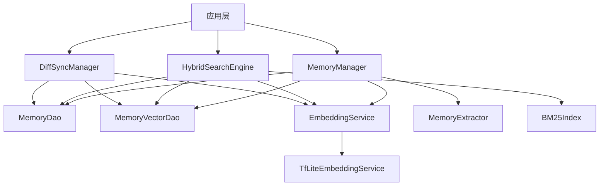

图表来源
- [MemoryManager.kt:10-116](file://app/src/main/java/ai/openclaw/android/domain/memory/MemoryManager.kt#L10-L116)
- [HybridSearchEngine.kt:18-227](file://app/src/main/java/ai/openclaw/android/domain/memory/HybridSearchEngine.kt#L18-L227)
- [BM25Index.kt:14-203](file://app/src/main/java/ai/openclaw/android/data/local/BM25Index.kt#L14-L203)
- [MemoryDao.kt:12-49](file://app/src/main/java/ai/openclaw/android/data/local/MemoryDao.kt#L12-L49)
- [MemoryVectorDao.kt:9-26](file://app/src/main/java/ai/openclaw/android/data/local/MemoryVectorDao.kt#L9-L26)
- [DiffSyncManager.kt:20-132](file://app/src/main/java/ai/openclaw/android/domain/memory/DiffSyncManager.kt#L20-L132)
- [EmbeddingService.kt:3-8](file://app/src/main/java/ai/openclaw/android/domain/memory/EmbeddingService.kt#L3-L8)
- [TfLiteEmbeddingService.kt:13-97](file://app/src/main/java/ai/openclaw/android/ml/TfLiteEmbeddingService.kt#L13-L97)

## 详细组件分析

### MemoryManager：存储、检索、维护与提取
- 存储流程：若嵌入服务就绪则生成向量，否则使用内容哈希伪向量；先写入 MemoryDao，再写入 MemoryVectorDao，并记录更新时间
- 检索流程：生成查询向量后暴力遍历向量表，计算余弦相似度，过滤阈值并排序取前 K
- 类型筛选与高优先级检索：按类型与优先级查询
- 访问触达：更新最近访问时间与次数
- 批量提取与存储：从对话中抽取记忆并批量入库
- 清理策略：基于访问时间与访问频次的“陈旧记忆”清理

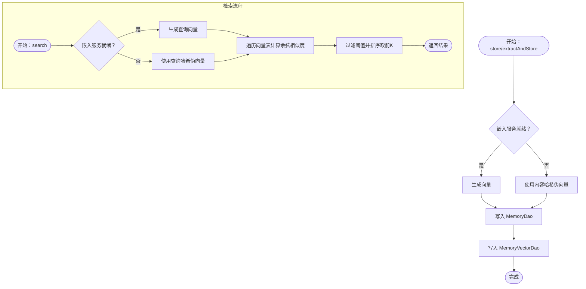

图表来源
- [MemoryManager.kt:16-95](file://app/src/main/java/ai/openclaw/android/domain/memory/MemoryManager.kt#L16-L95)

章节来源
- [MemoryManager.kt:10-116](file://app/src/main/java/ai/openclaw/android/domain/memory/MemoryManager.kt#L10-L116)

### HybridSearchEngine：BM25 + 向量 + 时间衰减融合
- 融合权重：关键词 0.35、向量 0.55、时间 0.10；最小合并分数 0.3
- 关键词搜索：BM25Index 搜索，返回候选集
- 向量搜索：可选缓存（30 秒 TTL），默认对近期向量进行相似度计算
- 时间衰减：以指数函数随天数衰减，半衰期 30 天
- 并发搜索：BM25 与向量路径并行执行
- 结果融合：归一化后加权合并，过滤阈值并排序

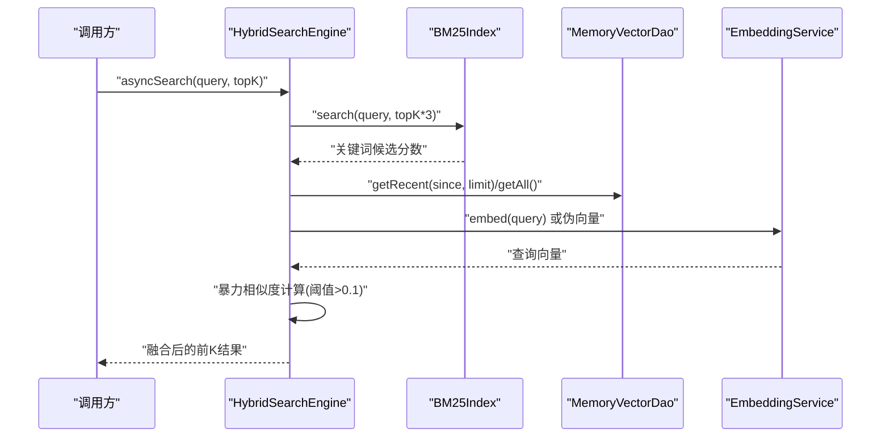

图表来源
- [HybridSearchEngine.kt:172-219](file://app/src/main/java/ai/openclaw/android/domain/memory/HybridSearchEngine.kt#L172-L219)
- [BM25Index.kt:140-178](file://app/src/main/java/ai/openclaw/android/data/local/BM25Index.kt#L140-L178)
- [MemoryVectorDao.kt:17-24](file://app/src/main/java/ai/openclaw/android/data/local/MemoryVectorDao.kt#L17-L24)
- [EmbeddingService.kt:3-8](file://app/src/main/java/ai/openclaw/android/domain/memory/EmbeddingService.kt#L3-L8)

章节来源
- [HybridSearchEngine.kt:18-227](file://app/src/main/java/ai/openclaw/android/domain/memory/HybridSearchEngine.kt#L18-L227)
- [BM25Index.kt:14-203](file://app/src/main/java/ai/openclaw/android/data/local/BM25Index.kt#L14-L203)
- [MemoryVectorDao.kt:9-26](file://app/src/main/java/ai/openclaw/android/data/local/MemoryVectorDao.kt#L9-L26)
- [EmbeddingService.kt:3-8](file://app/src/main/java/ai/openclaw/android/domain/memory/EmbeddingService.kt#L3-L8)

### EmbeddingService：向量化与相似度
- 接口职责：单条/批量向量化、维度查询、就绪状态
- TfLiteEmbeddingService 实现：BERT 分词 + TensorFlow Lite 推理，输出固定维度向量
- MemoryManager.cosineSimilarity：余弦相似度计算，用于向量检索

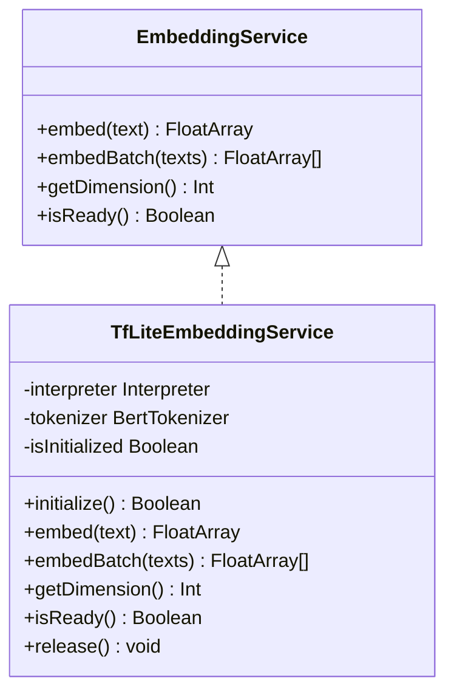

图表来源
- [EmbeddingService.kt:3-8](file://app/src/main/java/ai/openclaw/android/domain/memory/EmbeddingService.kt#L3-L8)
- [TfLiteEmbeddingService.kt:13-97](file://app/src/main/java/ai/openclaw/android/ml/TfLiteEmbeddingService.kt#L13-L97)

章节来源
- [EmbeddingService.kt:3-8](file://app/src/main/java/ai/openclaw/android/domain/memory/EmbeddingService.kt#L3-L8)
- [TfLiteEmbeddingService.kt:13-97](file://app/src/main/java/ai/openclaw/android/ml/TfLiteEmbeddingService.kt#L13-L97)
- [MemoryManager.kt:101-114](file://app/src/main/java/ai/openclaw/android/domain/memory/MemoryManager.kt#L101-L114)

### ColdStartManager：冷启动优化
- 模式：SENSORY_ONLY（前 72 小时）与 FULL（之后）
- 行为：首次启动记录时间戳；根据已过小时数切换模式；提供剩余小时数查询
- 作用：限制冷启动阶段的向量与索引开销，保障首帧体验

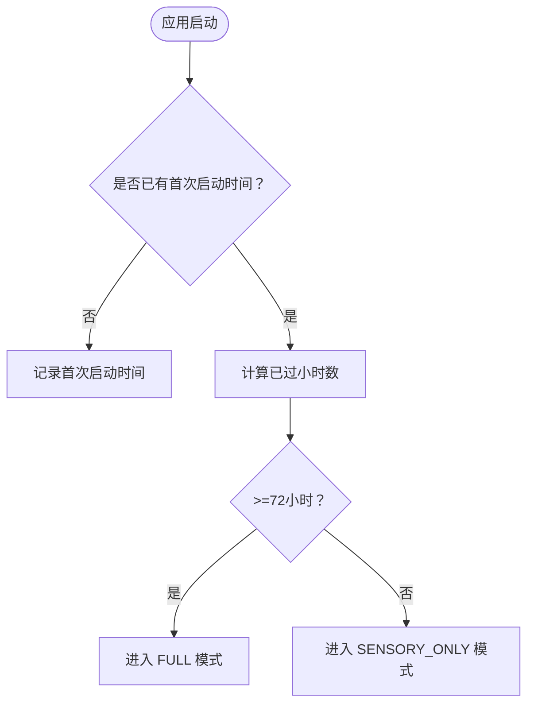

图表来源
- [ColdStartManager.kt:35-60](file://app/src/main/java/ai/openclaw/android/domain/memory/ColdStartManager.kt#L35-L60)

章节来源
- [ColdStartManager.kt:14-61](file://app/src/main/java/ai/openclaw/android/domain/memory/ColdStartManager.kt#L14-L61)

### DiffSyncManager：差异同步与一致性
- 双向增量同步：本地变更导出推送；远端变更拉取并按版本覆盖
- 冲突解决：以版本号更高者为准
- 向量重建：插入/更新时按需生成向量并写回

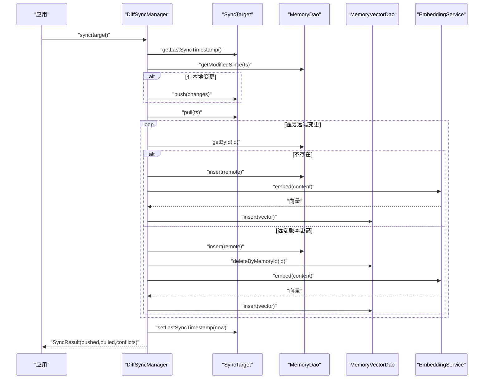

图表来源
- [DiffSyncManager.kt:47-91](file://app/src/main/java/ai/openclaw/android/domain/memory/DiffSyncManager.kt#L47-L91)
- [MemoryDao.kt:12-49](file://app/src/main/java/ai/openclaw/android/data/local/MemoryDao.kt#L12-L49)
- [MemoryVectorDao.kt:9-26](file://app/src/main/java/ai/openclaw/android/data/local/MemoryVectorDao.kt#L9-L26)
- [EmbeddingService.kt:3-8](file://app/src/main/java/ai/openclaw/android/domain/memory/EmbeddingService.kt#L3-L8)

章节来源
- [DiffSyncManager.kt:20-132](file://app/src/main/java/ai/openclaw/android/domain/memory/DiffSyncManager.kt#L20-L132)

### BM25Index：关键词索引与搜索
- 分词：中文双字符 + 英文小写单词；查询结果带缓存
- 倒排：term → Posting 列表（memoryId, tf）
- 文档长度与平均长度：O(1) 更新
- 时间桶：按天聚合，加速时间范围过滤
- 搜索：BM25 公式评分，支持时间范围候选集裁剪

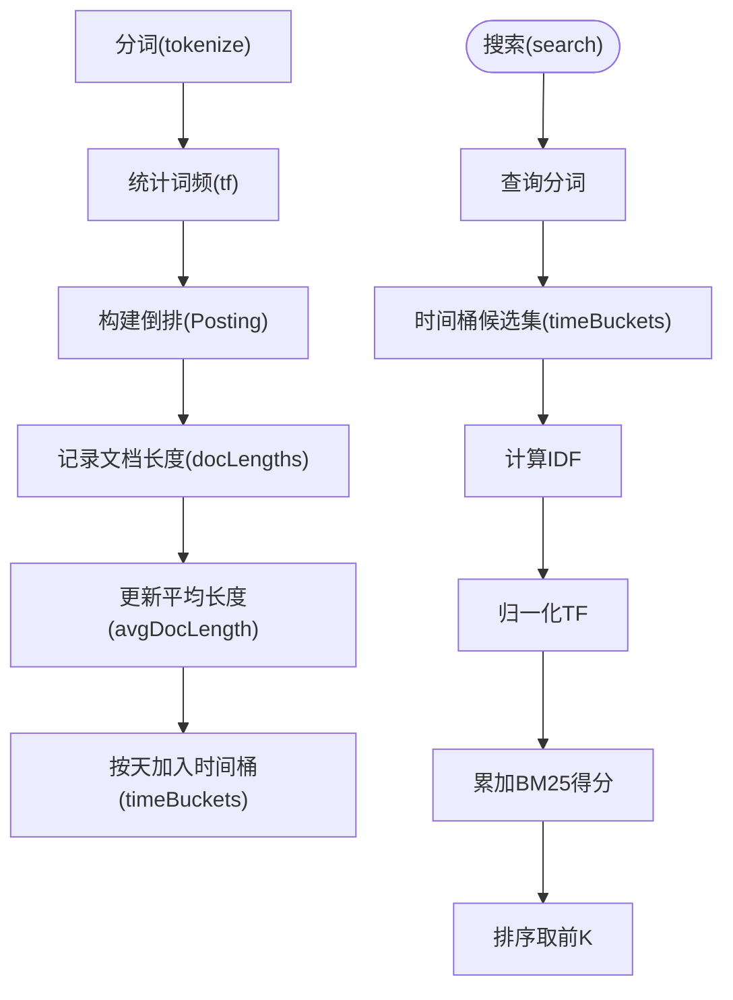

图表来源
- [BM25Index.kt:47-178](file://app/src/main/java/ai/openclaw/android/data/local/BM25Index.kt#L47-L178)

章节来源
- [BM25Index.kt:14-203](file://app/src/main/java/ai/openclaw/android/data/local/BM25Index.kt#L14-L203)

### 记忆提取与模型
- MemoryExtractorInterface：定义从对话与用户输入抽取记忆的接口
- LlmMemoryExtractor：基于本地 LLM 的 JSON 解析与类型分类，生成 MemoryEntity

章节来源
- [MemoryExtractorInterface.kt:7-11](file://app/src/main/java/ai/openclaw/android/domain/memory/MemoryExtractorInterface.kt#L7-L11)
- [MemoryExtractor.kt:16-99](file://app/src/main/java/ai/openclaw/android/domain/memory/MemoryExtractor.kt#L16-L99)
- [MemoryEntity.kt:6-19](file://app/src/main/java/ai/openclaw/android/data/model/MemoryEntity.kt#L6-L19)

## 依赖关系分析
- 耦合与内聚
  - MemoryManager 与 DAO、EmbeddingService、Extractor 高内聚，负责存储与检索主流程
  - HybridSearchEngine 对 BM25Index、VectorDao、EmbeddingService 松耦合，便于替换与扩展
  - DiffSyncManager 通过接口抽象 SyncTarget，实现传输无关的同步逻辑
- 外部依赖
  - TensorFlow Lite 模型与词表文件
  - Room 数据库（MemoryDao/MemoryVectorDao）
  - 日志与审计模块

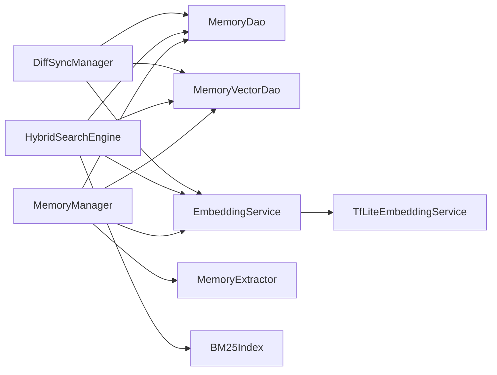

图表来源
- [MemoryManager.kt:10-116](file://app/src/main/java/ai/openclaw/android/domain/memory/MemoryManager.kt#L10-L116)
- [HybridSearchEngine.kt:18-227](file://app/src/main/java/ai/openclaw/android/domain/memory/HybridSearchEngine.kt#L18-L227)
- [DiffSyncManager.kt:20-132](file://app/src/main/java/ai/openclaw/android/domain/memory/DiffSyncManager.kt#L20-L132)
- [BM25Index.kt:14-203](file://app/src/main/java/ai/openclaw/android/data/local/BM25Index.kt#L14-L203)
- [MemoryDao.kt:12-49](file://app/src/main/java/ai/openclaw/android/data/local/MemoryDao.kt#L12-L49)
- [MemoryVectorDao.kt:9-26](file://app/src/main/java/ai/openclaw/android/data/local/MemoryVectorDao.kt#L9-L26)
- [EmbeddingService.kt:3-8](file://app/src/main/java/ai/openclaw/android/domain/memory/EmbeddingService.kt#L3-L8)
- [TfLiteEmbeddingService.kt:13-97](file://app/src/main/java/ai/openclaw/android/ml/TfLiteEmbeddingService.kt#L13-L97)

## 性能考量
- 向量检索复杂度
  - MemoryManager 暴力遍历：O(N·D)，其中 N 为向量数量，D 为维度；建议在向量规模较大时引入近似最近邻（ANN）替代
  - HybridSearchEngine 向量缓存：30 秒 TTL，减少重复计算
- BM25 索引
  - 倒排与平均长度在线维护，查询时按时间桶裁剪候选，降低扫描范围
- 并发搜索
  - BM25 与向量路径并行，提升响应速度
- 冷启动
  - ColdStartManager 在前 72 小时禁用向量与索引重建，显著降低 CPU/IO 开销
- 同步
  - DiffSyncManager 仅同步变更，冲突按版本号解决，避免全量同步

[本节为通用性能讨论，不直接分析特定文件]

## 故障排除指南
- 向量服务未初始化
  - 现象：调用 embed 抛出未初始化异常
  - 处理：确保在应用启动阶段调用 EmbeddingService.initialize 成功后再进行检索
- 检索结果为空
  - 关键词：确认 BM25Index 是否已重建；检查分词是否正确
  - 向量：确认向量表非空且维度一致；检查阈值设置
- 冷启动模式影响
  - 现象：某些类型记忆未被索引或向量未生成
  - 处理：等待超过 72 小时或手动触发索引重建
- 同步冲突
  - 现象：远端覆盖本地或反之
  - 处理：检查版本号字段与同步日志；必要时回滚或合并

章节来源
- [TfLiteEmbeddingService.kt:27-48](file://app/src/main/java/ai/openclaw/android/ml/TfLiteEmbeddingService.kt#L27-L48)
- [HybridSearchEngine.kt:172-219](file://app/src/main/java/ai/openclaw/android/domain/memory/HybridSearchEngine.kt#L172-L219)
- [DiffSyncManager.kt:47-91](file://app/src/main/java/ai/openclaw/android/domain/memory/DiffSyncManager.kt#L47-L91)
- [ColdStartManager.kt:35-60](file://app/src/main/java/ai/openclaw/android/domain/memory/ColdStartManager.kt#L35-L60)

## 结论
该内存系统以“关键词 + 向量 + 时间”的多模态融合为核心，结合冷启动优化与增量同步，兼顾了准确性、性能与可维护性。建议在生产环境中进一步引入 ANN、分布式索引与更细粒度的缓存策略，以支撑更大规模的数据与更高的并发需求。

[本节为总结性内容，不直接分析特定文件]

## 附录

### 内存检索流程图（概念示意）
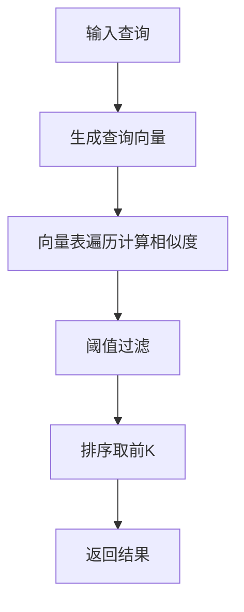

[此图为概念示意，无需图表来源]

### 混合搜索算法图（概念示意）
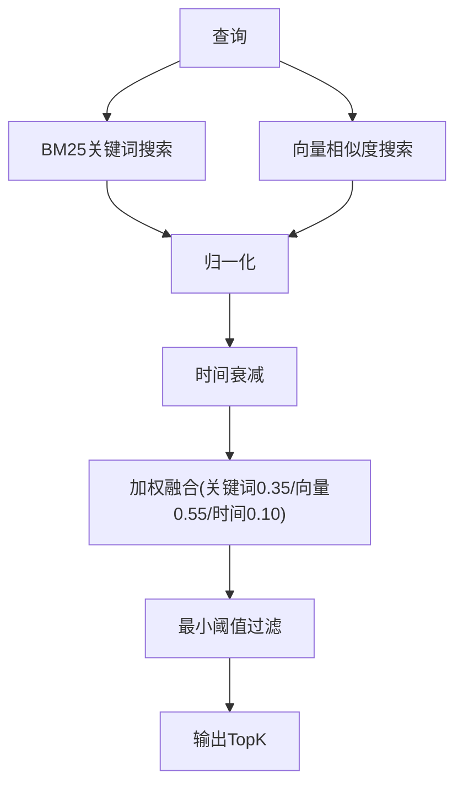

[此图为概念示意，无需图表来源]

### 数据同步时序图（概念示意）
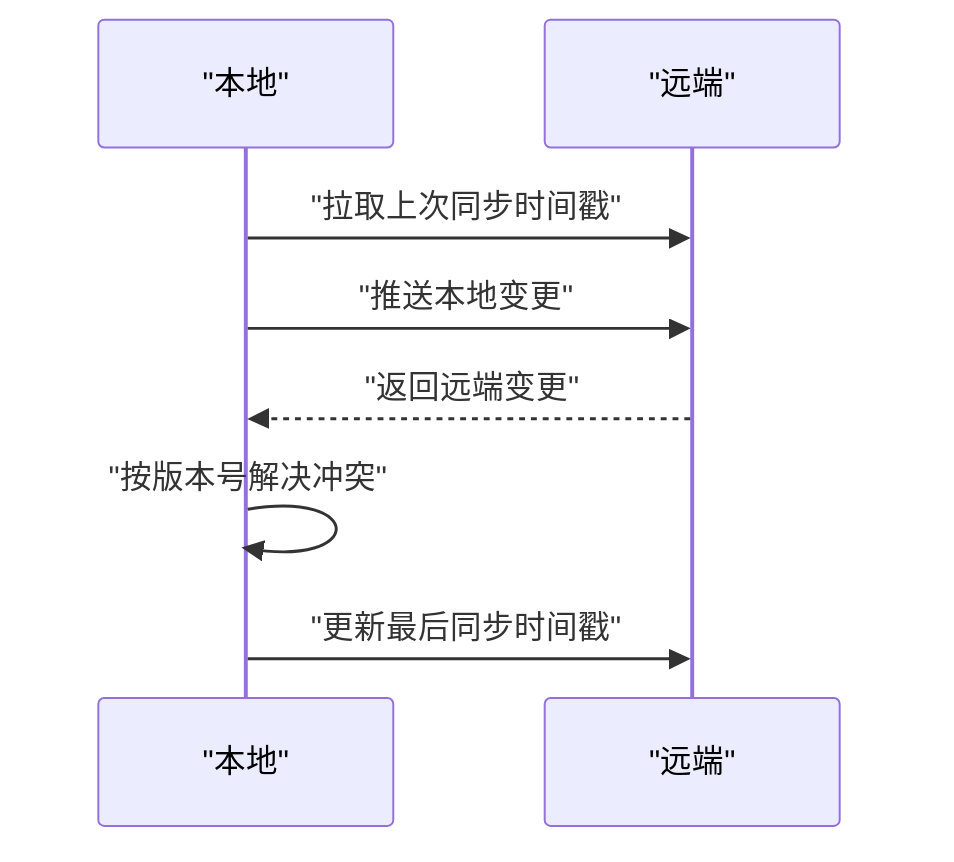

[此图为概念示意，无需图表来源]

### 内存优化配置示例（建议）
- 向量缓存 TTL：建议根据查询频率调整（如 30 秒）
- 最小合并分数：根据业务召回质量调参（如 0.3）
- 搜索时间窗口：默认 90 天，可根据场景缩短或延长
- 清理策略：定期清理陈旧记忆，保留最小留存数量
- 冷启动时长：建议 72 小时，确保系统稳定后再启用完整功能

[本节为通用建议，不直接分析特定文件]

### 性能调优建议
- 引入 ANN：在向量规模增长后，采用 FAISS/Flat/IVFFlat 等替代暴力搜索
- 索引预热：应用启动时预热 BM25 索引与向量缓存
- 批量处理：对批量存储与检索使用批处理接口
- I/O 优化：合理设置数据库写入批次与事务边界

[本节为通用建议，不直接分析特定文件]

### 故障排除清单
- 检查 EmbeddingService 初始化状态
- 校验 BM25Index 是否重建完成
- 确认向量维度与模型输出一致
- 查看冷启动模式是否影响当前行为
- 审核 DiffSyncManager 的版本号与冲突日志

[本节为通用建议，不直接分析特定文件]

### 扩展与最佳实践
- 扩展检索：新增相似度指标（如内积、余弦）或融合策略
- 索引优化：引入分片、倒排压缩与增量更新
- 大规模数据：分页检索、流式处理与远程索引
- 可观测性：埋点评分明细、缓存命中率与延迟分布

[本节为通用建议，不直接分析特定文件]