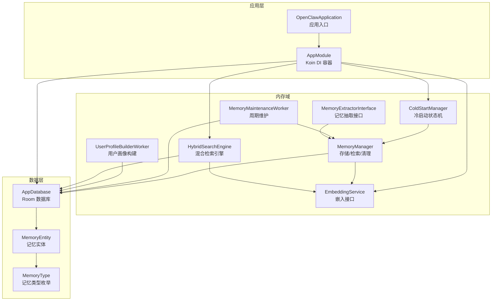
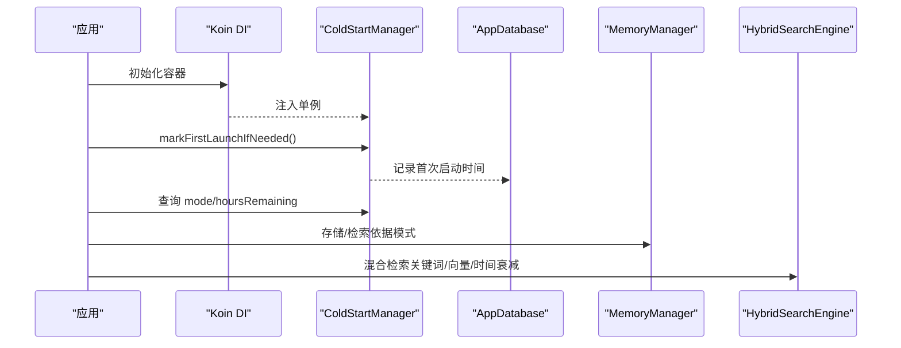
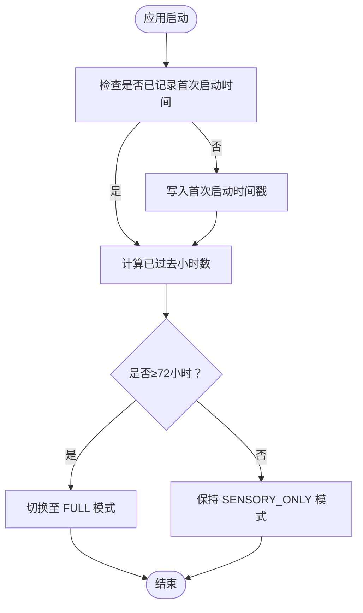
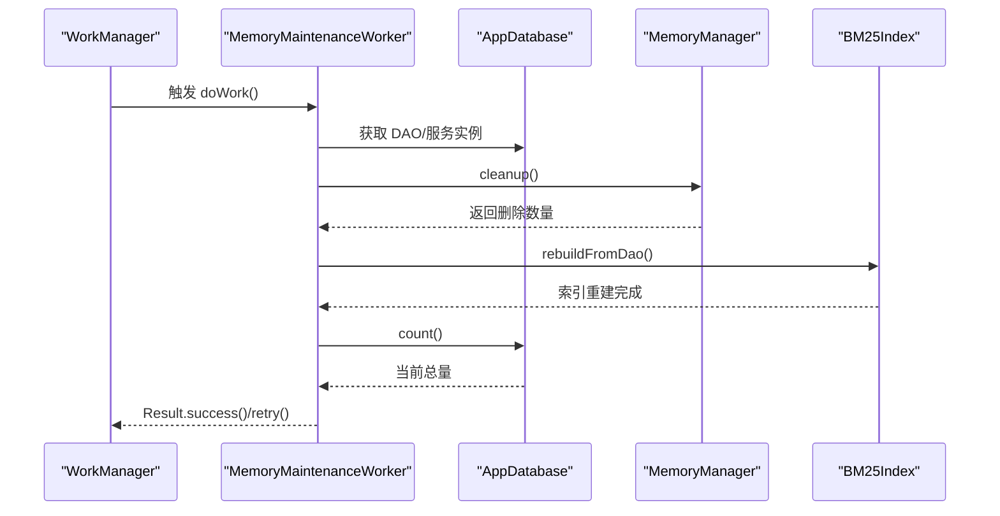
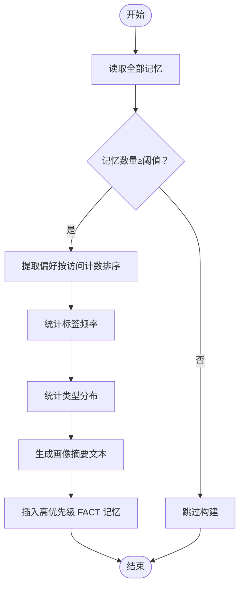
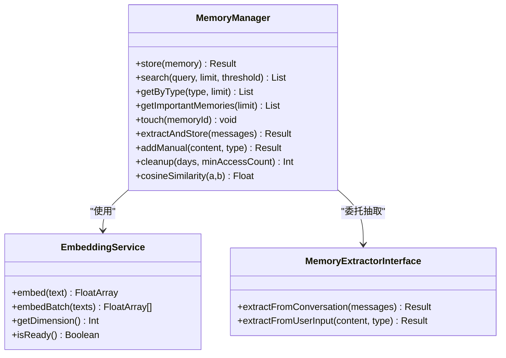
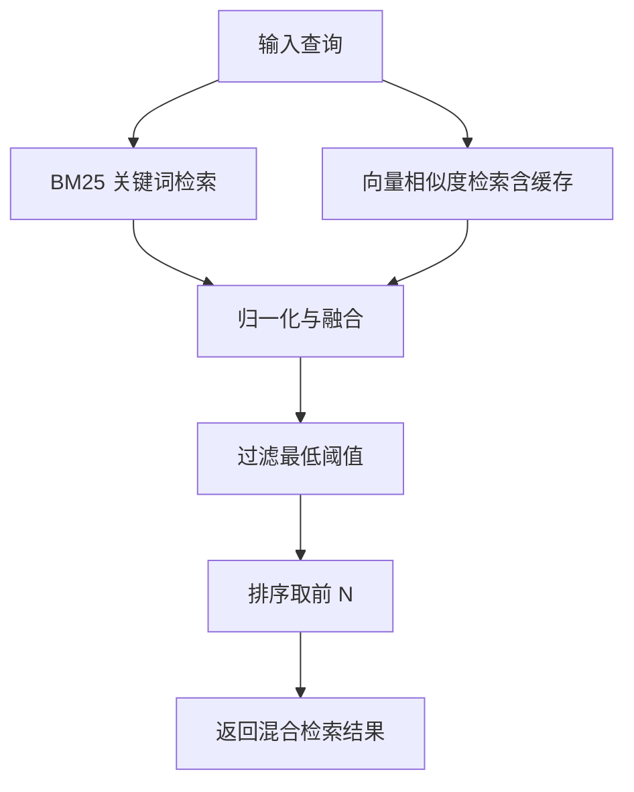
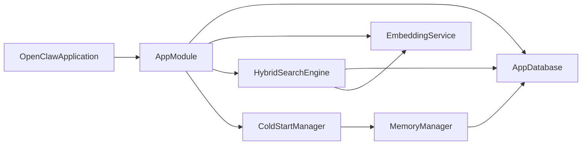
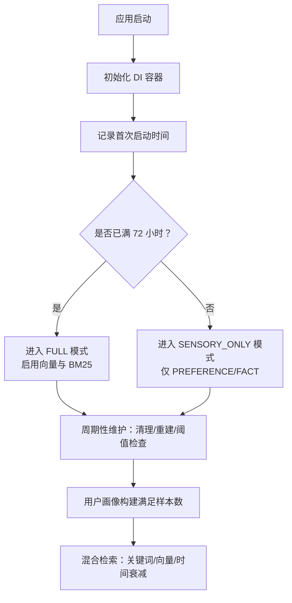

# 冷启动管理

<cite>
**本文引用的文件**
- [ColdStartManager.kt](file://app/src/main/java/ai/openclaw/android/domain/memory/ColdStartManager.kt)
- [MemoryMaintenanceWorker.kt](file://app/src/main/java/ai/openclaw/android/domain/memory/MemoryMaintenanceWorker.kt)
- [UserProfileBuilderWorker.kt](file://app/src/main/java/ai/openclaw/android/domain/memory/UserProfileBuilderWorker.kt)
- [MemoryManager.kt](file://app/src/main/java/ai/openclaw/android/domain/memory/MemoryManager.kt)
- [HybridSearchEngine.kt](file://app/src/main/java/ai/openclaw/android/domain/memory/HybridSearchEngine.kt)
- [EmbeddingService.kt](file://app/src/main/java/ai/openclaw/android/domain/memory/EmbeddingService.kt)
- [MemoryExtractorInterface.kt](file://app/src/main/java/ai/openclaw/android/domain/memory/MemoryExtractorInterface.kt)
- [AppDatabase.kt](file://app/src/main/java/ai/openclaw/android/data/local/AppDatabase.kt)
- [AppModule.kt](file://app/src/main/java/ai/openclaw/android/di/AppModule.kt)
- [OpenClawApplication.kt](file://app/src/main/java/ai/openclaw/android/OpenClawApplication.kt)
- [MemoryEntity.kt](file://app/src/main/java/ai/openclaw/android/data/model/MemoryEntity.kt)
- [MemoryType.kt](file://app/src/main/java/ai/openclaw/android/data/model/MemoryType.kt)
</cite>

## 目录
1. [简介](#简介)
2. [项目结构](#项目结构)
3. [核心组件](#核心组件)
4. [架构总览](#架构总览)
5. [详细组件分析](#详细组件分析)
6. [依赖关系分析](#依赖关系分析)
7. [性能考量](#性能考量)
8. [故障排除指南](#故障排除指南)
9. [结论](#结论)
10. [附录](#附录)

## 简介
本文件围绕冷启动管理展开，系统性阐述以下主题：
- ColdStartManager 的初始化与模式切换策略（72 小时轻量化模式与全功能模式）
- MemoryMaintenanceWorker 的周期性维护任务（过期记忆清理、BM25 索引重建、存储阈值控制）
- UserProfileBuilderWorker 的用户画像构建算法（偏好、标签频率、类型分布）
- 冷启动阶段的性能监控与质量评估方法
- 预填充策略（示例记忆与初始数据集）
- 冷启动优化最佳实践（资源分配、时间窗口管理、用户体验）

## 项目结构
冷启动管理相关代码主要位于 domain/memory 包中，并通过 DI 模块在应用启动时完成依赖注入与单例绑定；数据库层由 AppDatabase 提供 Room 数据库与 FTS 虚拟表支持。

图表来源
- [OpenClawApplication.kt:11-15](file://app/src/main/java/ai/openclaw/android/OpenClawApplication.kt#L11-L15)
- [AppModule.kt:24-79](file://app/src/main/java/ai/openclaw/android/di/AppModule.kt#L24-L79)
- [ColdStartManager.kt:14-60](file://app/src/main/java/ai/openclaw/android/domain/memory/ColdStartManager.kt#L14-L60)
- [MemoryManager.kt:10-116](file://app/src/main/java/ai/openclaw/android/domain/memory/MemoryManager.kt#L10-L116)
- [MemoryMaintenanceWorker.kt:16-70](file://app/src/main/java/ai/openclaw/android/domain/memory/MemoryMaintenanceWorker.kt#L16-L70)
- [UserProfileBuilderWorker.kt:21-99](file://app/src/main/java/ai/openclaw/android/domain/memory/UserProfileBuilderWorker.kt#L21-L99)
- [HybridSearchEngine.kt:18-227](file://app/src/main/java/ai/openclaw/android/domain/memory/HybridSearchEngine.kt#L18-L227)
- [EmbeddingService.kt:3-8](file://app/src/main/java/ai/openclaw/android/domain/memory/EmbeddingService.kt#L3-L8)
- [MemoryExtractorInterface.kt:7-11](file://app/src/main/java/ai/openclaw/android/domain/memory/MemoryExtractorInterface.kt#L7-L11)
- [AppDatabase.kt:31-158](file://app/src/main/java/ai/openclaw/android/data/local/AppDatabase.kt#L31-L158)
- [MemoryEntity.kt:6-19](file://app/src/main/java/ai/openclaw/android/data/model/MemoryEntity.kt#L6-L19)
- [MemoryType.kt:3-5](file://app/src/main/java/ai/openclaw/android/data/model/MemoryType.kt#L3-L5)

章节来源
- [OpenClawApplication.kt:11-15](file://app/src/main/java/ai/openclaw/android/OpenClawApplication.kt#L11-L15)
- [AppModule.kt:24-79](file://app/src/main/java/ai/openclaw/android/di/AppModule.kt#L24-L79)
- [AppDatabase.kt:31-158](file://app/src/main/java/ai/openclaw/android/data/local/AppDatabase.kt#L31-L158)

## 核心组件
- ColdStartManager：记录首次启动时间，基于 72 小时阈值决定当前内存模式（SENSORY_ONLY 或 FULL），并提供剩余小时数查询。
- MemoryMaintenanceWorker：周期性执行清理过期记忆、重建 BM25 索引、检查存储阈值。
- UserProfileBuilderWorker：从历史记忆中统计偏好、标签频率与类型分布，生成高优先级“用户画像”记忆。
- MemoryManager：统一的记忆存储、检索、清理与向量生成（含降级策略）。
- HybridSearchEngine：融合 BM25 关键词、向量相似度与时间衰减的混合检索，支持缓存与并发搜索。
- EmbeddingService：抽象嵌入服务接口，支持批量嵌入、维度查询与就绪状态判断。
- MemoryExtractorInterface：对话与用户输入到记忆实体的抽取接口。
- AppDatabase：Room 数据库，包含记忆表、向量表、FTS 虚拟表及迁移策略。

章节来源
- [ColdStartManager.kt:14-60](file://app/src/main/java/ai/openclaw/android/domain/memory/ColdStartManager.kt#L14-L60)
- [MemoryMaintenanceWorker.kt:16-70](file://app/src/main/java/ai/openclaw/android/domain/memory/MemoryMaintenanceWorker.kt#L16-L70)
- [UserProfileBuilderWorker.kt:21-99](file://app/src/main/java/ai/openclaw/android/domain/memory/UserProfileBuilderWorker.kt#L21-L99)
- [MemoryManager.kt:10-116](file://app/src/main/java/ai/openclaw/android/domain/memory/MemoryManager.kt#L10-L116)
- [HybridSearchEngine.kt:18-227](file://app/src/main/java/ai/openclaw/android/domain/memory/HybridSearchEngine.kt#L18-L227)
- [EmbeddingService.kt:3-8](file://app/src/main/java/ai/openclaw/android/domain/memory/EmbeddingService.kt#L3-L8)
- [MemoryExtractorInterface.kt:7-11](file://app/src/main/java/ai/openclaw/android/domain/memory/MemoryExtractorInterface.kt#L7-L11)
- [AppDatabase.kt:31-158](file://app/src/main/java/ai/openclaw/android/data/local/AppDatabase.kt#L31-L158)

## 架构总览
冷启动管理贯穿应用启动、初始化与运行期维护三个阶段：
- 启动阶段：应用初始化 DI，持久化记录首次启动时间，进入冷启动模式。
- 运行阶段：根据模式选择存储策略（仅轻量类型或启用向量与 BM25）。
- 维护阶段：周期性任务清理与重建，保障检索质量与存储健康。

图表来源
- [OpenClawApplication.kt:11-15](file://app/src/main/java/ai/openclaw/android/OpenClawApplication.kt#L11-L15)
- [AppModule.kt:58-59](file://app/src/main/java/ai/openclaw/android/di/AppModule.kt#L58-L59)
- [ColdStartManager.kt:36-60](file://app/src/main/java/ai/openclaw/android/domain/memory/ColdStartManager.kt#L36-L60)
- [AppDatabase.kt:31-158](file://app/src/main/java/ai/openclaw/android/data/local/AppDatabase.kt#L31-L158)
- [MemoryManager.kt:16-85](file://app/src/main/java/ai/openclaw/android/domain/memory/MemoryManager.kt#L16-L85)
- [HybridSearchEngine.kt:173-220](file://app/src/main/java/ai/openclaw/android/domain/memory/HybridSearchEngine.kt#L173-L220)

## 详细组件分析

### ColdStartManager：初始化与模式切换
- 初始化优化策略
  - 首次启动时间记录：仅在首次启动时写入时间戳，避免重复覆盖。
  - 模式判定：以 72 小时为界，未满 72 小时为 SENSORY_ONLY（限制为 PREFERENCE/FACT 类型，禁用昂贵向量操作），超过则进入 FULL。
  - 剩余小时：提供剩余小时数，便于 UI 与策略提示。
- 与 DI 的集成
  - 在 AppModule 中注册为单例，确保全局一致的状态读取。

图表来源
- [ColdStartManager.kt:36-60](file://app/src/main/java/ai/openclaw/android/domain/memory/ColdStartManager.kt#L36-L60)

章节来源
- [ColdStartManager.kt:14-60](file://app/src/main/java/ai/openclaw/android/domain/memory/ColdStartManager.kt#L14-L60)
- [AppModule.kt:58-59](file://app/src/main/java/ai/openclaw/android/di/AppModule.kt#L58-L59)

### MemoryMaintenanceWorker：定期维护任务
- 任务职责
  - 清理过期记忆：按访问次数与时间阈值删除陈旧记忆及其向量。
  - 重建 BM25 索引：从内存 DAO 全量重建 FTS/BM25 索引，提升检索准确性。
  - 存储阈值控制：统计总量并在超过上限时发出告警（保留兜底下限）。
- 异常处理
  - 失败时返回 retry，交由 WorkManager 自动指数退避重试。

图表来源
- [MemoryMaintenanceWorker.kt:25-68](file://app/src/main/java/ai/openclaw/android/domain/memory/MemoryMaintenanceWorker.kt#L25-L68)
- [MemoryManager.kt:87-95](file://app/src/main/java/ai/openclaw/android/domain/memory/MemoryManager.kt#L87-L95)

章节来源
- [MemoryMaintenanceWorker.kt:16-70](file://app/src/main/java/ai/openclaw/android/domain/memory/MemoryMaintenanceWorker.kt#L16-L70)
- [MemoryManager.kt:87-95](file://app/src/main/java/ai/openclaw/android/domain/memory/MemoryManager.kt#L87-L95)

### UserProfileBuilderWorker：用户画像构建算法
- 输入输出
  - 输入：所有记忆（需满足最低样本数）。
  - 输出：一条高优先级 FACT 类型记忆，内容为“用户画像摘要”，包含偏好、关注领域、类型分布与总数。
- 算法步骤
  - 偏好提取：筛选 PREFERENCE 类型，按访问计数排序取前若干项。
  - 标签频率：遍历所有记忆的标签，统计频次并取前若干项。
  - 类型分布：按记忆类型分组统计数量。
  - 存储：插入数据库，标记来源与标签，优先级设为较高值。
- 触发条件
  - 当记忆总数不足阈值时跳过，避免噪声。

图表来源
- [UserProfileBuilderWorker.kt:30-97](file://app/src/main/java/ai/openclaw/android/domain/memory/UserProfileBuilderWorker.kt#L30-L97)

章节来源
- [UserProfileBuilderWorker.kt:21-99](file://app/src/main/java/ai/openclaw/android/domain/memory/UserProfileBuilderWorker.kt#L21-L99)

### MemoryManager：存储、检索与清理
- 存储流程
  - 若嵌入服务可用则生成真实向量，否则使用降级伪向量。
  - 先写入记忆表，再写入向量表，保证一致性。
- 检索流程
  - 生成查询向量（可用时真实嵌入，否则伪向量）。
  - 暴力遍历向量表计算余弦相似度，过滤阈值后排序取前 N。
- 清理策略
  - 基于时间阈值与最小访问次数筛选陈旧记忆，删除对应记录与向量。
- 性能要点
  - 提供余弦相似度实现，便于快速评估与调试。
  - 设定最大记忆条目与最小保留条目，防止无限增长。

图表来源
- [MemoryManager.kt:10-116](file://app/src/main/java/ai/openclaw/android/domain/memory/MemoryManager.kt#L10-L116)
- [EmbeddingService.kt:3-8](file://app/src/main/java/ai/openclaw/android/domain/memory/EmbeddingService.kt#L3-L8)
- [MemoryExtractorInterface.kt:7-11](file://app/src/main/java/ai/openclaw/android/domain/memory/MemoryExtractorInterface.kt#L7-L11)

章节来源
- [MemoryManager.kt:10-116](file://app/src/main/java/ai/openclaw/android/domain/memory/MemoryManager.kt#L10-L116)

### HybridSearchEngine：混合检索与缓存
- 融合策略
  - 关键词权重 0.35、向量权重 0.55、时间衰减权重 0.10。
  - 最低合并分数阈值，仅保留高质量候选。
- 时间衰减
  - 使用指数衰减函数，半衰期参数可调，新鲜记忆得分更高。
- 缓存与并发
  - 向量结果缓存（TTL 可配置），减少重复计算。
  - 并发执行关键词与向量两条路径，提升吞吐。
- 诊断能力
  - 提供带明细评分的检索接口，便于定位问题。

图表来源
- [HybridSearchEngine.kt:83-135](file://app/src/main/java/ai/openclaw/android/domain/memory/HybridSearchEngine.kt#L83-L135)
- [HybridSearchEngine.kt:148-170](file://app/src/main/java/ai/openclaw/android/domain/memory/HybridSearchEngine.kt#L148-L170)
- [HybridSearchEngine.kt:203-219](file://app/src/main/java/ai/openclaw/android/domain/memory/HybridSearchEngine.kt#L203-L219)

章节来源
- [HybridSearchEngine.kt:18-227](file://app/src/main/java/ai/openclaw/android/domain/memory/HybridSearchEngine.kt#L18-L227)

## 依赖关系分析
- 应用启动与 DI
  - OpenClawApplication 在 onCreate 中初始化 PermissionManager，AppModule 注册数据库、嵌入服务、BM25 索引、混合检索引擎与 ColdStartManager 等单例。
- 冷启动与检索
  - ColdStartManager 决定模式，影响 MemoryManager 的存储策略与 HybridSearchEngine 的向量路径（可用时走真实嵌入，否则降级）。
- 维护与数据健康
  - MemoryMaintenanceWorker 依赖 AppDatabase、MemoryManager 与 BM25Index，确保索引与存储处于健康状态。

图表来源
- [OpenClawApplication.kt:11-15](file://app/src/main/java/ai/openclaw/android/OpenClawApplication.kt#L11-L15)
- [AppModule.kt:24-79](file://app/src/main/java/ai/openclaw/android/di/AppModule.kt#L24-L79)
- [AppDatabase.kt:31-158](file://app/src/main/java/ai/openclaw/android/data/local/AppDatabase.kt#L31-L158)

章节来源
- [AppModule.kt:24-79](file://app/src/main/java/ai/openclaw/android/di/AppModule.kt#L24-L79)
- [AppDatabase.kt:31-158](file://app/src/main/java/ai/openclaw/android/data/local/AppDatabase.kt#L31-L158)

## 性能考量
- 冷启动阶段性能目标
  - 降低 CPU/GPU 开销：仅启用 PREFERENCE/FACT 存储，延迟向量与 BM25。
  - 快速响应：HybridSearchEngine 在冷启动期间可使用降级向量，保证检索可用性。
- 检索性能
  - 向量缓存（TTL）减少重复计算；并发执行关键词与向量路径。
  - 归一化与阈值过滤减少无效候选，提高吞吐。
- 存储与索引
  - 定期清理过期记忆，避免向量表膨胀；重建 BM25 索引提升召回。
- 监控指标建议
  - 冷启动模式持续时间、检索命中率、平均响应时间、向量生成耗时、索引大小、存储使用率、UserProfile 构建耗时与成功率。

## 故障排除指南
- 冷启动模式异常
  - 现象：始终处于 FULL 或 SENSORY_ONLY。
  - 排查：确认首次启动时间是否正确写入；检查 SharedPreferences 键是否存在；核对当前时间与阈值。
- 检索质量下降
  - 现象：关键词召回差或向量相似度异常。
  - 排查：确认嵌入服务就绪状态；检查向量维度与降级向量一致性；查看缓存是否过期；核对融合权重与阈值。
- 维护任务失败
  - 现象：索引未重建或清理未生效。
  - 排查：查看日志错误堆栈；确认 DAO 实例与数据库连接；检查 WorkManager 重试策略与约束条件。
- 用户画像为空
  - 现象：未生成“用户画像”记忆。
  - 排查：确认记忆总数是否达到阈值；检查 PREFERENCE 类型与标签字段是否有效；核对插入逻辑与标签标记。

章节来源
- [ColdStartManager.kt:36-60](file://app/src/main/java/ai/openclaw/android/domain/memory/ColdStartManager.kt#L36-L60)
- [HybridSearchEngine.kt:148-170](file://app/src/main/java/ai/openclaw/android/domain/memory/HybridSearchEngine.kt#L148-L170)
- [MemoryMaintenanceWorker.kt:64-68](file://app/src/main/java/ai/openclaw/android/domain/memory/MemoryMaintenanceWorker.kt#L64-L68)
- [UserProfileBuilderWorker.kt:37-40](file://app/src/main/java/ai/openclaw/android/domain/memory/UserProfileBuilderWorker.kt#L37-L40)

## 结论
冷启动管理通过“时间阈值 + 模式切换 + 周期维护 + 降级策略”的组合，实现了在资源受限初期的稳定运行，并在 72 小时后平滑过渡到全功能检索体验。配合用户画像构建与性能监控，可进一步提升个性化与系统稳定性。

## 附录

### 冷启动流程图

图表来源
- [ColdStartManager.kt:36-60](file://app/src/main/java/ai/openclaw/android/domain/memory/ColdStartManager.kt#L36-L60)
- [MemoryMaintenanceWorker.kt:25-68](file://app/src/main/java/ai/openclaw/android/domain/memory/MemoryMaintenanceWorker.kt#L25-L68)
- [UserProfileBuilderWorker.kt:30-97](file://app/src/main/java/ai/openclaw/android/domain/memory/UserProfileBuilderWorker.kt#L30-L97)
- [HybridSearchEngine.kt:173-220](file://app/src/main/java/ai/openclaw/android/domain/memory/HybridSearchEngine.kt#L173-L220)

### 预填充策略（示例记忆与初始数据集）
- 示例记忆生成
  - 在冷启动早期，可通过内置脚本或静态数据生成少量 PREFERENCE/FACT 类型记忆，帮助模型快速建立基础语义框架。
- 初始数据集构建
  - 结合系统提示与默认配置，构造少量上下文片段，作为检索与嵌入的种子数据，加速索引收敛。
- 注意事项
  - 预填充应避免与用户隐私冲突；优先使用匿名化与去标识化数据；在 FULL 模式后逐步替换为真实用户数据。

### 冷启动优化最佳实践
- 资源分配
  - 冷启动期间限制后台线程与 GPU 使用；延迟非关键任务。
- 时间窗口管理
  - 以 72 小时为界进行模式切换；维护任务间隔与缓存 TTL 与业务负载匹配。
- 用户体验
  - 显示冷启动进度与剩余时间；在检索结果中提供“基于记忆的建议”以增强即时价值。
- 质量评估
  - 建立检索命中率、平均响应时间、索引大小与存储使用率等指标；定期回测混合检索融合权重。