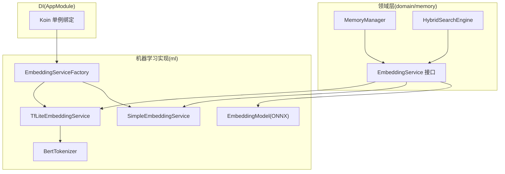
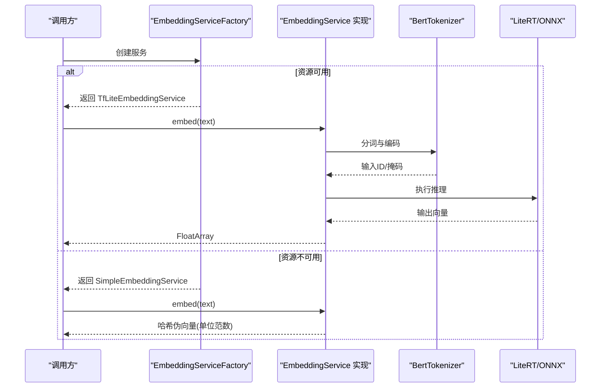
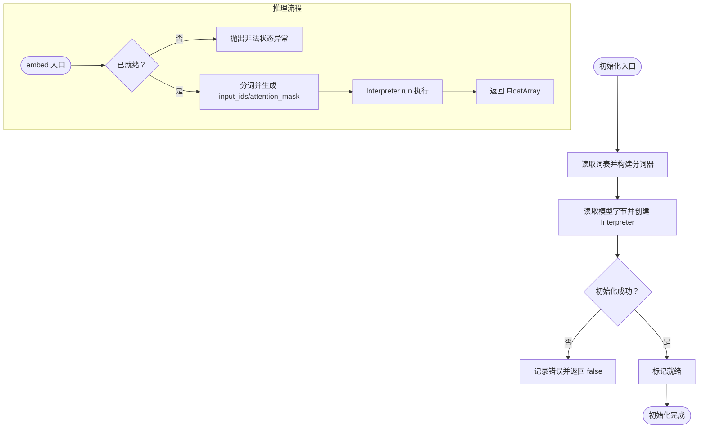
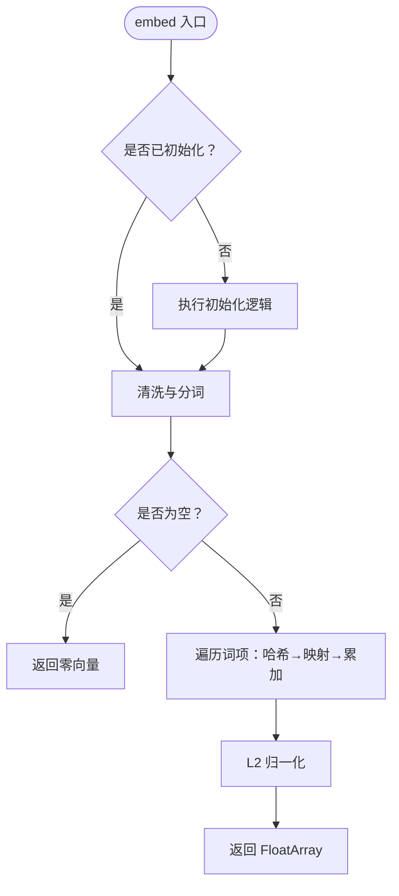
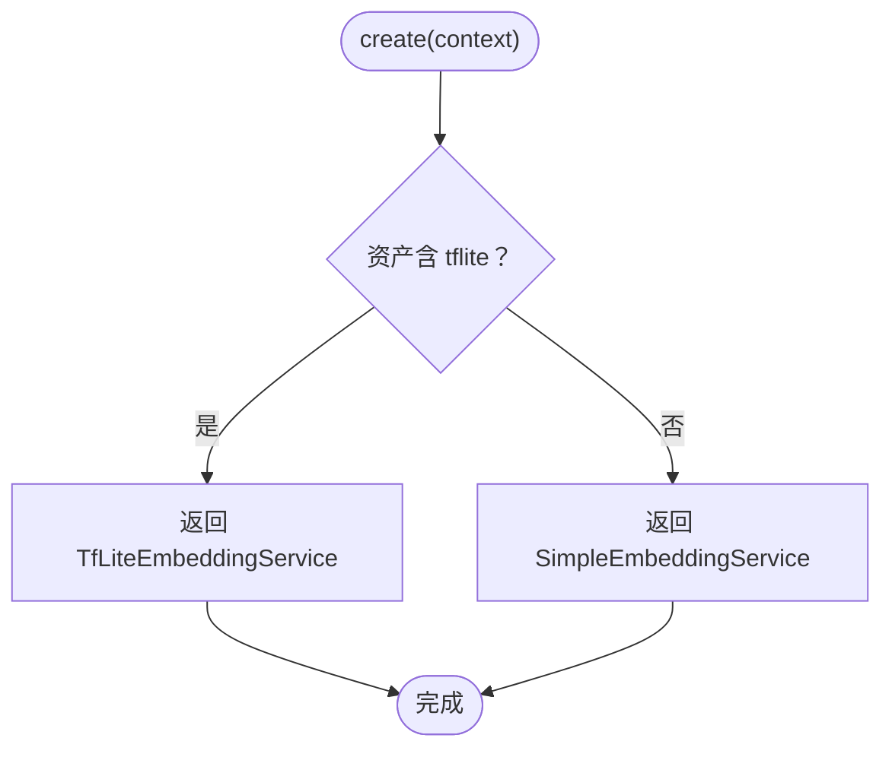
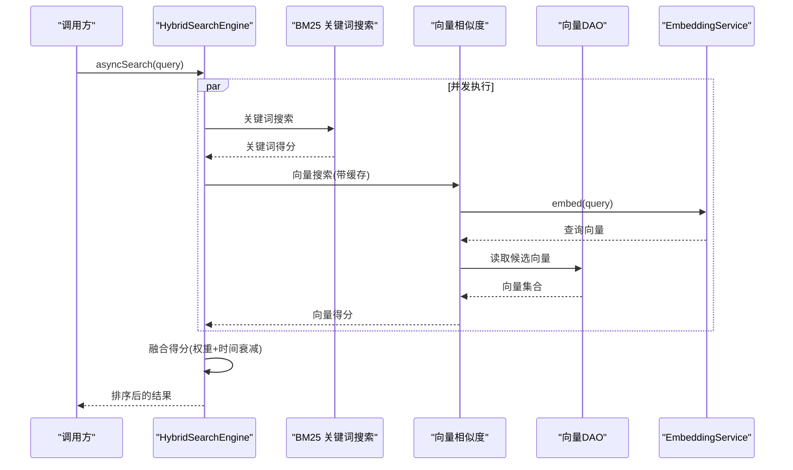
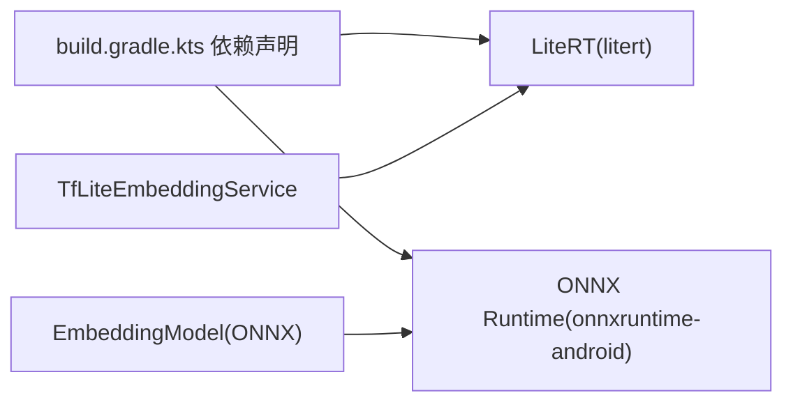

# 嵌入服务

<cite>
**本文引用的文件**
- [EmbeddingService.kt](file://app/src/main/java/ai/openclaw/android/domain/memory/EmbeddingService.kt)
- [TfLiteEmbeddingService.kt](file://app/src/main/java/ai/openclaw/android/ml/TfLiteEmbeddingService.kt)
- [SimpleEmbeddingService.kt](file://app/src/main/java/ai/openclaw/android/ml/SimpleEmbeddingService.kt)
- [EmbeddingServiceFactory.kt](file://app/src/main/java/ai/openclaw/android/ml/EmbeddingServiceFactory.kt)
- [EmbeddingModel.kt](file://app/src/main/java/ai/openclaw/android/ml/EmbeddingModel.kt)
- [BertTokenizer.kt](file://app/src/main/java/ai/openclaw/android/ml/BertTokenizer.kt)
- [AppModule.kt](file://app/src/main/java/ai/openclaw/android/di/AppModule.kt)
- [MemoryManager.kt](file://app/src/main/java/ai/openclaw/android/domain/memory/MemoryManager.kt)
- [HybridSearchEngine.kt](file://app/src/main/java/ai/openclaw/android/domain/memory/HybridSearchEngine.kt)
- [build.gradle.kts](file://app/build.gradle.kts)
- [SimpleEmbeddingServiceTest.kt](file://app/src/test/java/ai/openclaw/android/ml/SimpleEmbeddingServiceTest.kt)
</cite>

## 目录
1. [简介](#简介)
2. [项目结构](#项目结构)
3. [核心组件](#核心组件)
4. [架构总览](#架构总览)
5. [详细组件分析](#详细组件分析)
6. [依赖关系分析](#依赖关系分析)
7. [性能考量](#性能考量)
8. [故障排查指南](#故障排查指南)
9. [结论](#结论)
10. [附录](#附录)

## 简介
本文件系统性梳理嵌入服务在本项目中的设计与实现，覆盖以下要点：
- 接口设计理念与职责边界
- 多种实现策略：TFLite、简单哈希、ONNX Runtime
- 工厂模式的服务选择与运行时配置
- 向量维度管理、批量处理与并发搜索
- 部署配置、性能监控与故障恢复
- 使用示例与性能基准建议

## 项目结构
嵌入服务相关代码主要分布在 domain/memory（接口与上层使用）、ml（具体实现）与 DI 层（依赖注入），并配合构建脚本引入 LiteRT/ONNX Runtime 等运行时依赖。

图表来源
- [EmbeddingService.kt:1-8](file://app/src/main/java/ai/openclaw/android/domain/memory/EmbeddingService.kt#L1-L8)
- [TfLiteEmbeddingService.kt:1-97](file://app/src/main/java/ai/openclaw/android/ml/TfLiteEmbeddingService.kt#L1-L97)
- [SimpleEmbeddingService.kt:1-107](file://app/src/main/java/ai/openclaw/android/ml/SimpleEmbeddingService.kt#L1-L107)
- [EmbeddingModel.kt:1-134](file://app/src/main/java/ai/openclaw/android/ml/EmbeddingModel.kt#L1-L134)
- [BertTokenizer.kt:1-44](file://app/src/main/java/ai/openclaw/android/ml/BertTokenizer.kt#L1-L44)
- [EmbeddingServiceFactory.kt:1-45](file://app/src/main/java/ai/openclaw/android/ml/EmbeddingServiceFactory.kt#L1-L45)
- [AppModule.kt:1-79](file://app/src/main/java/ai/openclaw/android/di/AppModule.kt#L1-L79)
- [MemoryManager.kt:1-116](file://app/src/main/java/ai/openclaw/android/domain/memory/MemoryManager.kt#L1-L116)
- [HybridSearchEngine.kt:1-227](file://app/src/main/java/ai/openclaw/android/domain/memory/HybridSearchEngine.kt#L1-L227)

章节来源
- [AppModule.kt:37-40](file://app/src/main/java/ai/openclaw/android/di/AppModule.kt#L37-L40)

## 核心组件
- 接口层：统一抽象 embed/embedBatch/getDimension/isReady，屏蔽实现差异，便于切换与降级。
- 实现层：
  - TfLiteEmbeddingService：基于 LiteRT 的 MiniLM-L6-v2 推理，支持批处理与内存释放。
  - SimpleEmbeddingService：无模型的降级方案，基于哈希生成伪向量，保证单位范数。
  - EmbeddingModel(ONNX)：可选的 ONNX Runtime 实现，支持外部/内置模型加载与缓存。
- 工厂层：根据资源可用性动态选择最佳实现。
- 上层使用：MemoryManager 与 HybridSearchEngine 通过接口调用，自动适配当前实现。

章节来源
- [EmbeddingService.kt:3-8](file://app/src/main/java/ai/openclaw/android/domain/memory/EmbeddingService.kt#L3-L8)
- [TfLiteEmbeddingService.kt:13-97](file://app/src/main/java/ai/openclaw/android/ml/TfLiteEmbeddingService.kt#L13-L97)
- [SimpleEmbeddingService.kt:19-107](file://app/src/main/java/ai/openclaw/android/ml/SimpleEmbeddingService.kt#L19-L107)
- [EmbeddingModel.kt:20-134](file://app/src/main/java/ai/openclaw/android/ml/EmbeddingModel.kt#L20-L134)
- [EmbeddingServiceFactory.kt:21-45](file://app/src/main/java/ai/openclaw/android/ml/EmbeddingServiceFactory.kt#L21-L45)

## 架构总览
嵌入服务采用“接口 + 多实现 + 工厂 + DI”的解耦架构。运行时优先选择高性能的 TFLite 实现；若资源不足则自动回退到简单哈希实现；同时提供 ONNX Runtime 作为第三路径以满足不同部署需求。

图表来源
- [EmbeddingServiceFactory.kt:21-45](file://app/src/main/java/ai/openclaw/android/ml/EmbeddingServiceFactory.kt#L21-L45)
- [TfLiteEmbeddingService.kt:50-73](file://app/src/main/java/ai/openclaw/android/ml/TfLiteEmbeddingService.kt#L50-L73)
- [SimpleEmbeddingService.kt:43-78](file://app/src/main/java/ai/openclaw/android/ml/SimpleEmbeddingService.kt#L43-L78)
- [BertTokenizer.kt:21-43](file://app/src/main/java/ai/openclaw/android/ml/BertTokenizer.kt#L21-L43)

## 详细组件分析

### 接口设计与职责
- 统一方法族：同步挂起式 embed/embedBatch，返回 FloatArray；维度与就绪状态查询。
- 设计目标：最小化上层差异，支持热切换与降级。

章节来源
- [EmbeddingService.kt:3-8](file://app/src/main/java/ai/openclaw/android/domain/memory/EmbeddingService.kt#L3-L8)

### TfLiteEmbeddingService（TensorFlow Lite 集成）
- 模型与资源
  - 模型文件：minilm-l6-v2.tflite（资产目录）
  - 词表：vocab.txt（资产目录）
  - 固定序列长度与嵌入维度常量
- 初始化流程
  - 从资产读取词表，构建分词器
  - 从资产读取模型字节，创建 Interpreter
  - 标记就绪状态
- 推理流程
  - 文本分词 → 生成 input_ids 与 attention_mask
  - 调用 Interpreter.run，输出固定维度向量
- 批处理
  - 默认顺序映射（可扩展为批量化执行）
- 内存管理
  - 提供 release 关闭 Interpreter 并清空引用
- 错误处理
  - 初始化异常记录日志；未就绪抛出非法状态

图表来源
- [TfLiteEmbeddingService.kt:27-48](file://app/src/main/java/ai/openclaw/android/ml/TfLiteEmbeddingService.kt#L27-L48)
- [TfLiteEmbeddingService.kt:50-73](file://app/src/main/java/ai/openclaw/android/ml/TfLiteEmbeddingService.kt#L50-L73)
- [BertTokenizer.kt:21-43](file://app/src/main/java/ai/openclaw/android/ml/BertTokenizer.kt#L21-L43)

章节来源
- [TfLiteEmbeddingService.kt:13-97](file://app/src/main/java/ai/openclaw/android/ml/TfLiteEmbeddingService.kt#L13-L97)
- [BertTokenizer.kt:1-44](file://app/src/main/java/ai/openclaw/android/ml/BertTokenizer.kt#L1-L44)

### SimpleEmbeddingService（降级策略与伪向量生成）
- 设计目标：在无模型或资源受限时提供可用的嵌入能力
- 算法要点
  - 文本清洗与分词（小写、去标点、按空白切分）
  - 对每个词进行 SHA-256 哈希，映射到 [-1,1] 区间生成伪向量
  - 向量维度由构造参数决定，默认 384
  - 对整体向量做 L2 归一化，确保单位范数
- 性能特征
  - 时间复杂度 O(n)，n 为文本字符数
  - 空间复杂度 O(d)，d 为维度
- 批处理
  - 默认顺序映射；可扩展为并行或批量化

图表来源
- [SimpleEmbeddingService.kt:31-41](file://app/src/main/java/ai/openclaw/android/ml/SimpleEmbeddingService.kt#L31-L41)
- [SimpleEmbeddingService.kt:43-78](file://app/src/main/java/ai/openclaw/android/ml/SimpleEmbeddingService.kt#L43-L78)

章节来源
- [SimpleEmbeddingService.kt:19-107](file://app/src/main/java/ai/openclaw/android/ml/SimpleEmbeddingService.kt#L19-L107)
- [SimpleEmbeddingServiceTest.kt:1-113](file://app/src/test/java/ai/openclaw/android/ml/SimpleEmbeddingServiceTest.kt#L1-L113)

### EmbeddingModel（ONNX Runtime 实现）
- 模型来源优先级：外部存储(models/minilm-l6-v2.onnx) > 资产(minilm-l6-v2.onnx)
- 初始化选项：启用 ALL_OPT 优化级别
- 推理流程：tokenizeSimple → OnnxTensor 创建 → session.run → 结果缓存
- 缓存策略：基于 LruCache 的文本到向量映射，提升重复查询性能
- 资源释放：release 关闭 session 与环境

章节来源
- [EmbeddingModel.kt:20-134](file://app/src/main/java/ai/openclaw/android/ml/EmbeddingModel.kt#L20-L134)

### EmbeddingServiceFactory（工厂模式与运行时配置）
- 选择策略
  - 若资产中存在 minilm-l6-v2.tflite，则返回 TfLiteEmbeddingService
  - 否则返回 SimpleEmbeddingService
- 日志与可观测性：选择时打印日志，便于诊断
- 可扩展性：新增 ONNX 实现时可在 hasTFLiteModel 判断后进一步分支

图表来源
- [EmbeddingServiceFactory.kt:21-45](file://app/src/main/java/ai/openclaw/android/ml/EmbeddingServiceFactory.kt#L21-L45)

章节来源
- [EmbeddingServiceFactory.kt:1-45](file://app/src/main/java/ai/openclaw/android/ml/EmbeddingServiceFactory.kt#L1-L45)

### 依赖注入与生命周期（Koin）
- 将 EmbeddingService 作为单例注入，延迟到首次使用时由工厂创建
- 与 HybridSearchEngine、MemoryManager 等上层模块解耦

章节来源
- [AppModule.kt:37-40](file://app/src/main/java/ai/openclaw/android/di/AppModule.kt#L37-L40)

### 上层使用：MemoryManager 与 HybridSearchEngine
- MemoryManager
  - 存储记忆时，若服务可用则调用 embed，否则生成伪向量
  - 余弦相似度工具方法用于检索与评分
- HybridSearchEngine
  - 关键词（BM25）与向量相似度并行融合
  - 异步搜索：利用协程并发执行关键词与向量路径
  - 向量结果缓存：30s TTL，减少重复计算
  - 时间衰减：基于访问时间指数衰减

图表来源
- [HybridSearchEngine.kt:202-219](file://app/src/main/java/ai/openclaw/android/domain/memory/HybridSearchEngine.kt#L202-L219)
- [HybridSearchEngine.kt:148-170](file://app/src/main/java/ai/openclaw/android/domain/memory/HybridSearchEngine.kt#L148-L170)
- [MemoryManager.kt:16-36](file://app/src/main/java/ai/openclaw/android/domain/memory/MemoryManager.kt#L16-L36)

章节来源
- [MemoryManager.kt:1-116](file://app/src/main/java/ai/openclaw/android/domain/memory/MemoryManager.kt#L1-L116)
- [HybridSearchEngine.kt:1-227](file://app/src/main/java/ai/openclaw/android/domain/memory/HybridSearchEngine.kt#L1-L227)

## 依赖关系分析
- 运行时依赖
  - LiteRT：on-device 推理，适合移动端部署
  - ONNX Runtime：跨平台推理，支持外部模型
- 构建脚本中明确引入 LiteRT 与 ONNX Runtime 依赖，确保运行时可用性

图表来源
- [build.gradle.kts:175-182](file://app/build.gradle.kts#L175-L182)

章节来源
- [build.gradle.kts:1-217](file://app/build.gradle.kts#L1-L217)

## 性能考量
- 维度管理
  - TFLite 与 ONNX 实现固定 384 维；Simple 实现可配置维度
  - 上层通过 getDimension 获取，避免硬编码
- 批处理与并发
  - 当前实现多为顺序映射；建议在高负载场景下引入批量化与并发执行
  - HybridSearchEngine 已使用协程并发执行关键词与向量路径
- 缓存策略
  - ONNX 实现内置 LruCache；HybridSearchEngine 对向量结果做 30s TTL 缓存
- I/O 与内存
  - 模型加载与分词器初始化在 IO 线程执行，避免阻塞主线程
  - 提供 release 方法释放资源，降低内存占用

章节来源
- [TfLiteEmbeddingService.kt:71-73](file://app/src/main/java/ai/openclaw/android/ml/TfLiteEmbeddingService.kt#L71-L73)
- [SimpleEmbeddingService.kt:100-102](file://app/src/main/java/ai/openclaw/android/ml/SimpleEmbeddingService.kt#L100-L102)
- [EmbeddingModel.kt:34](file://app/src/main/java/ai/openclaw/android/ml/EmbeddingModel.kt#L34)
- [HybridSearchEngine.kt:37-53](file://app/src/main/java/ai/openclaw/android/domain/memory/HybridSearchEngine.kt#L37-L53)

## 故障排查指南
- 初始化失败
  - 检查资产目录是否存在 minilm-l6-v2.tflite 与 vocab.txt
  - 查看日志中初始化错误堆栈
- 未就绪异常
  - 确保在调用 embed 前完成 initialize 或等待工厂创建完成
- 推理结果异常
  - 确认分词器是否正确加载
  - 检查模型文件完整性与版本兼容性
- 资源释放
  - 在不再使用时调用 release 释放 Interpreter/Session 环境
- 降级行为
  - 若无模型，Simple 实现会生成伪向量；可通过单元测试验证维度与归一化

章节来源
- [TfLiteEmbeddingService.kt:27-48](file://app/src/main/java/ai/openclaw/android/ml/TfLiteEmbeddingService.kt#L27-L48)
- [SimpleEmbeddingService.kt:31-41](file://app/src/main/java/ai/openclaw/android/ml/SimpleEmbeddingService.kt#L31-L41)
- [EmbeddingModel.kt:93-99](file://app/src/main/java/ai/openclaw/android/ml/EmbeddingModel.kt#L93-L99)

## 结论
本嵌入服务通过清晰的接口与多实现策略，在保证上层一致性的前提下，实现了从高性能到轻量降级的完整覆盖。工厂模式与 DI 解耦了选择逻辑，HybridSearchEngine 的并发与缓存提升了整体响应性能。建议在生产环境中结合设备能力选择合适实现，并持续监控推理耗时与内存占用。

## 附录

### 使用示例（路径指引）
- 获取服务实例（Koin 注入）
  - [AppModule.kt:37-40](file://app/src/main/java/ai/openclaw/android/di/AppModule.kt#L37-L40)
- 调用嵌入
  - [TfLiteEmbeddingService.kt:50-69](file://app/src/main/java/ai/openclaw/android/ml/TfLiteEmbeddingService.kt#L50-L69)
  - [SimpleEmbeddingService.kt:43-78](file://app/src/main/java/ai/openclaw/android/ml/SimpleEmbeddingService.kt#L43-L78)
- 批量嵌入
  - [TfLiteEmbeddingService.kt:71-73](file://app/src/main/java/ai/openclaw/android/ml/TfLiteEmbeddingService.kt#L71-L73)
  - [SimpleEmbeddingService.kt:100-102](file://app/src/main/java/ai/openclaw/android/ml/SimpleEmbeddingService.kt#L100-L102)
- 释放资源
  - [TfLiteEmbeddingService.kt:91-97](file://app/src/main/java/ai/openclaw/android/ml/TfLiteEmbeddingService.kt#L91-L97)
  - [EmbeddingModel.kt:93-99](file://app/src/main/java/ai/openclaw/android/ml/EmbeddingModel.kt#L93-L99)

### 性能基准建议（通用指导）
- 测试环境
  - 不同机型与系统版本下的延迟与吞吐
  - 冷启动与热启动对比
- 指标
  - 单次推理耗时、内存峰值、CPU 占用
  - 批量处理吞吐与尾延迟
- 场景
  - 端侧实时对话、离线检索、批量导入
- 优化方向
  - 模型量化/剪枝（如已有）
  - 批量化与并发
  - 结果缓存与预热

### 模型选择指南（通用指导）
- 精度优先：MiniLM-L6-v2（TFLite/ONNX）适合语义检索与混合搜索
- 资源受限：Simple 哈希实现可满足基础相似度需求
- 部署灵活性：ONNX 支持外部模型与多平台迁移
- 权衡建议
  - 高精度 + 高资源：TFLite/ONNX
  - 低资源 + 快速可用：Simple
  - 跨平台 + 易维护：ONNX