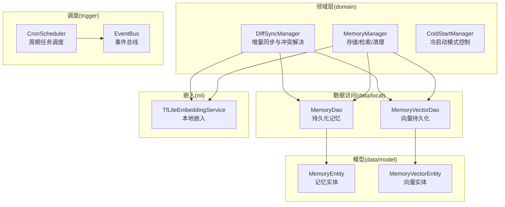
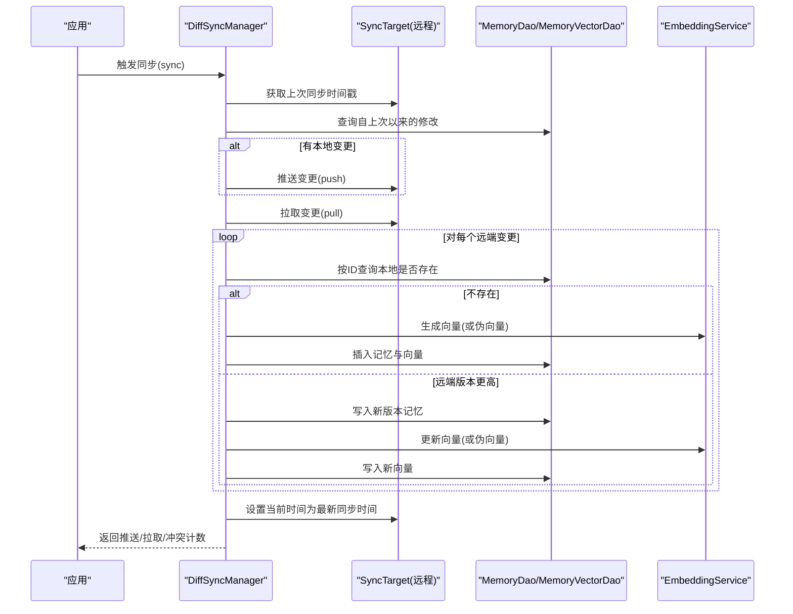
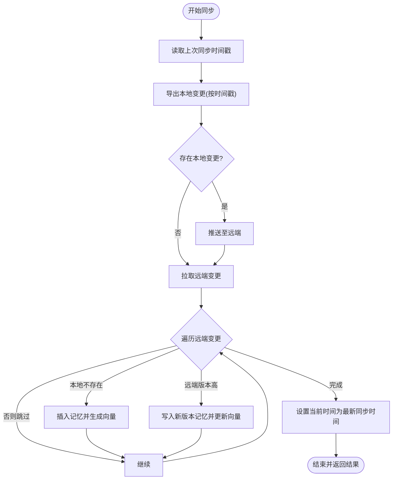
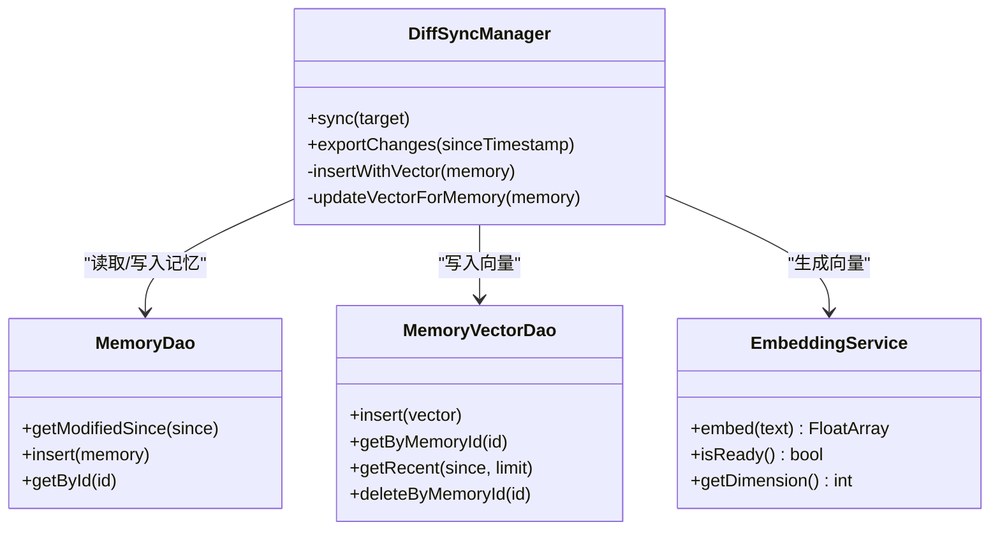
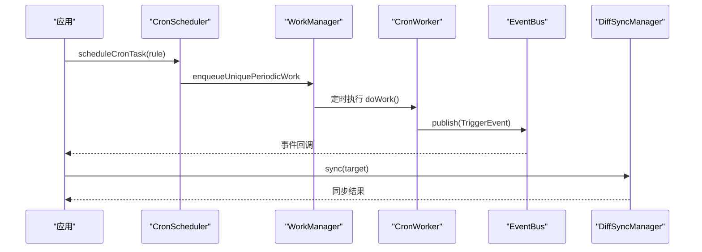
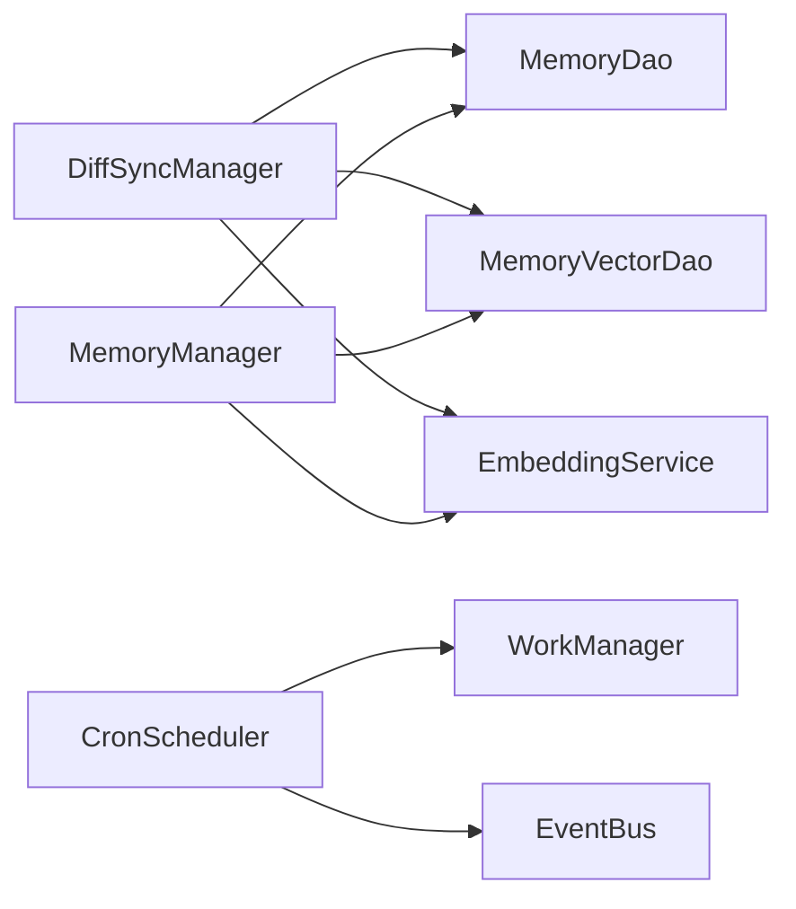

# 数据同步管理

<cite>
**本文引用的文件**
- [DiffSyncManager.kt](file://app/src/main/java/ai/openclaw/android/domain/memory/DiffSyncManager.kt)
- [MemoryDao.kt](file://app/src/main/java/ai/openclaw/android/data/local/MemoryDao.kt)
- [MemoryVectorDao.kt](file://app/src/main/java/ai/openclaw/android/data/local/MemoryVectorDao.kt)
- [MemoryVectorEntity.kt](file://app/src/main/java/ai/openclaw/android/data/model/MemoryVectorEntity.kt)
- [MemoryEntity.kt](file://app/src/main/java/ai/openclaw/android/data/model/MemoryEntity.kt)
- [MemoryManager.kt](file://app/src/main/java/ai/openclaw/android/domain/memory/MemoryManager.kt)
- [TfLiteEmbeddingService.kt](file://app/src/main/java/ai/openclaw/android/ml/TfLiteEmbeddingService.kt)
- [CronScheduler.kt](file://app/src/main/java/ai/openclaw/android/trigger/scheduler/CronScheduler.kt)
- [EventBus.kt](file://app/src/main/java/ai/openclaw/android/trigger/EventBus.kt)
- [backup_rules.xml](file://app/src/main/res/xml/backup_rules.xml)
- [data_extraction_rules.xml](file://app/src/main/res/xml/data_extraction_rules.xml)
</cite>

## 目录
1. [简介](#简介)
2. [项目结构](#项目结构)
3. [核心组件](#核心组件)
4. [架构总览](#架构总览)
5. [详细组件分析](#详细组件分析)
6. [依赖关系分析](#依赖关系分析)
7. [性能考虑](#性能考虑)
8. [故障排查指南](#故障排查指南)
9. [结论](#结论)
10. [附录](#附录)

## 简介
本文件围绕数据同步管理展开，重点解析 DiffSyncManager 的增量同步、冲突检测与版本控制策略，剖析差异计算与向量/索引同步机制，阐述分布式同步的冲突解决与最终一致性保障，梳理同步任务的调度方式（定时、事件驱动、手动），并给出备份与恢复、性能优化与实际使用示例。

## 项目结构
本项目采用领域驱动与分层架构，数据同步相关逻辑集中在 domain/memory 包中，数据访问通过 Room DAO 实现，嵌入向量由本地 TensorFlow Lite 模型提供，定时与事件驱动通过 WorkManager 与 EventBus 实现。

**图表来源**
- [DiffSyncManager.kt:1-132](file://app/src/main/java/ai/openclaw/android/domain/memory/DiffSyncManager.kt#L1-L132)
- [MemoryDao.kt:1-49](file://app/src/main/java/ai/openclaw/android/data/local/MemoryDao.kt#L1-L49)
- [MemoryVectorDao.kt:1-26](file://app/src/main/java/ai/openclaw/android/data/local/MemoryVectorDao.kt#L1-L26)
- [MemoryEntity.kt:1-19](file://app/src/main/java/ai/openclaw/android/data/model/MemoryEntity.kt#L1-L19)
- [MemoryVectorEntity.kt:1-19](file://app/src/main/java/ai/openclaw/android/data/model/MemoryVectorEntity.kt#L1-L19)
- [MemoryManager.kt:1-116](file://app/src/main/java/ai/openclaw/android/domain/memory/MemoryManager.kt#L1-L116)
- [TfLiteEmbeddingService.kt:1-97](file://app/src/main/java/ai/openclaw/android/ml/TfLiteEmbeddingService.kt#L1-L97)
- [CronScheduler.kt:1-192](file://app/src/main/java/ai/openclaw/android/trigger/scheduler/CronScheduler.kt#L1-L192)
- [EventBus.kt:46-83](file://app/src/main/java/ai/openclaw/android/trigger/EventBus.kt#L46-L83)

**章节来源**
- [DiffSyncManager.kt:1-132](file://app/src/main/java/ai/openclaw/android/domain/memory/DiffSyncManager.kt#L1-L132)
- [MemoryDao.kt:1-49](file://app/src/main/java/ai/openclaw/android/data/local/MemoryDao.kt#L1-L49)
- [MemoryVectorDao.kt:1-26](file://app/src/main/java/ai/openclaw/android/data/local/MemoryVectorDao.kt#L1-L26)
- [MemoryManager.kt:1-116](file://app/src/main/java/ai/openclaw/android/domain/memory/MemoryManager.kt#L1-L116)
- [TfLiteEmbeddingService.kt:1-97](file://app/src/main/java/ai/openclaw/android/ml/TfLiteEmbeddingService.kt#L1-L97)
- [CronScheduler.kt:1-192](file://app/src/main/java/ai/openclaw/android/trigger/scheduler/CronScheduler.kt#L1-L192)
- [EventBus.kt:46-83](file://app/src/main/java/ai/openclaw/android/trigger/EventBus.kt#L46-L83)

## 核心组件
- DiffSyncManager：负责双向增量同步，基于时间戳导出/导入变更，并以版本号解决冲突；同时在插入/更新记忆时同步维护向量索引。
- MemoryDao/MemoryVectorDao：Room DAO 层，提供按时间戳筛选修改项、最近向量查询、按 ID 删除等能力。
- MemoryManager：统一的记忆存储、检索与清理入口，封装向量生成与相似度计算。
- TfLiteEmbeddingService：本地嵌入服务，提供文本向量化能力，支持降级伪向量。
- CronScheduler/EventBus：WorkManager 定时任务与事件总线，支撑事件驱动的同步触发。

**章节来源**
- [DiffSyncManager.kt:1-132](file://app/src/main/java/ai/openclaw/android/domain/memory/DiffSyncManager.kt#L1-L132)
- [MemoryDao.kt:1-49](file://app/src/main/java/ai/openclaw/android/data/local/MemoryDao.kt#L1-L49)
- [MemoryVectorDao.kt:1-26](file://app/src/main/java/ai/openclaw/android/data/local/MemoryVectorDao.kt#L1-L26)
- [MemoryManager.kt:1-116](file://app/src/main/java/ai/openclaw/android/domain/memory/MemoryManager.kt#L1-L116)
- [TfLiteEmbeddingService.kt:1-97](file://app/src/main/java/ai/openclaw/android/ml/TfLiteEmbeddingService.kt#L1-L97)
- [CronScheduler.kt:1-192](file://app/src/main/java/ai/openclaw/android/trigger/scheduler/CronScheduler.kt#L1-L192)
- [EventBus.kt:46-83](file://app/src/main/java/ai/openclaw/android/trigger/EventBus.kt#L46-L83)

## 架构总览
下图展示从应用到数据库、向量索引与嵌入服务的整体交互，以及同步目标抽象如何解耦传输层。

**图表来源**
- [DiffSyncManager.kt:47-91](file://app/src/main/java/ai/openclaw/android/domain/memory/DiffSyncManager.kt#L47-L91)
- [MemoryDao.kt:31-32](file://app/src/main/java/ai/openclaw/android/data/local/MemoryDao.kt#L31-L32)
- [MemoryVectorDao.kt:11-21](file://app/src/main/java/ai/openclaw/android/data/local/MemoryVectorDao.kt#L11-L21)
- [TfLiteEmbeddingService.kt:50-77](file://app/src/main/java/ai/openclaw/android/ml/TfLiteEmbeddingService.kt#L50-L77)

## 详细组件分析

### DiffSyncManager：增量同步与冲突解决
- 同步阶段
  - 本地→远程：导出自上次同步以来的修改，推送至远端。
  - 远程→本地：拉取远端变更，逐条与本地对比，按版本覆盖。
- 版本控制与冲突
  - 使用 MemoryEntity.version 字段作为冲突仲裁依据，远端版本更高则覆盖本地。
  - 新增记录：若本地不存在，则直接插入并生成向量。
- 向量同步
  - 插入与更新记忆后，调用嵌入服务生成向量，写入 MemoryVectorDao。
  - 若嵌入服务不可用，使用基于内容哈希的伪向量作为降级方案。
- 结果统计
  - 返回推送数量、拉取数量与冲突数量，便于审计与监控。

**图表来源**
- [DiffSyncManager.kt:47-91](file://app/src/main/java/ai/openclaw/android/domain/memory/DiffSyncManager.kt#L47-L91)
- [MemoryVectorDao.kt:11-21](file://app/src/main/java/ai/openclaw/android/data/local/MemoryVectorDao.kt#L11-L21)
- [TfLiteEmbeddingService.kt:50-77](file://app/src/main/java/ai/openclaw/android/ml/TfLiteEmbeddingService.kt#L50-L77)

**章节来源**
- [DiffSyncManager.kt:11-91](file://app/src/main/java/ai/openclaw/android/domain/memory/DiffSyncManager.kt#L11-L91)
- [MemoryEntity.kt:7-18](file://app/src/main/java/ai/openclaw/android/data/model/MemoryEntity.kt#L7-L18)
- [MemoryVectorEntity.kt:7-11](file://app/src/main/java/ai/openclaw/android/data/model/MemoryVectorEntity.kt#L7-L11)

### 差异计算与向量/索引同步
- 内容变更检测
  - 通过 MemoryDao.getModifiedSince(sinceTimestamp) 获取增量变更集合。
- 向量更新
  - 插入与更新记忆后，调用 EmbeddingService.embed 生成向量；若不可用则生成伪向量。
  - 写入 MemoryVectorDao，包含 memoryId、向量数组与更新时间。
- 索引同步
  - 由于向量表为“向量索引”，通过 MemoryVectorDao 的查询接口（如按时间最近）参与检索融合。

**图表来源**
- [DiffSyncManager.kt:96-130](file://app/src/main/java/ai/openclaw/android/domain/memory/DiffSyncManager.kt#L96-L130)
- [MemoryDao.kt:31-32](file://app/src/main/java/ai/openclaw/android/data/local/MemoryDao.kt#L31-L32)
- [MemoryVectorDao.kt:11-21](file://app/src/main/java/ai/openclaw/android/data/local/MemoryVectorDao.kt#L11-L21)
- [TfLiteEmbeddingService.kt:50-77](file://app/src/main/java/ai/openclaw/android/ml/TfLiteEmbeddingService.kt#L50-L77)

**章节来源**
- [DiffSyncManager.kt:96-130](file://app/src/main/java/ai/openclaw/android/domain/memory/DiffSyncManager.kt#L96-L130)
- [MemoryDao.kt:31-32](file://app/src/main/java/ai/openclaw/android/data/local/MemoryDao.kt#L31-L32)
- [MemoryVectorDao.kt:11-21](file://app/src/main/java/ai/openclaw/android/data/local/MemoryVectorDao.kt#L11-L21)
- [MemoryVectorEntity.kt:7-11](file://app/src/main/java/ai/openclaw/android/data/model/MemoryVectorEntity.kt#L7-L11)
- [TfLiteEmbeddingService.kt:50-77](file://app/src/main/java/ai/openclaw/android/ml/TfLiteEmbeddingService.kt#L50-L77)

### 分布式同步与最终一致性
- 冲突解决策略
  - 基于版本号（version）的向量时钟式仲裁：远端版本更高即覆盖本地，避免并发写入导致的数据丢失。
- 最终一致性
  - 通过定期同步与事件驱动触发，确保远端与本地在一段时间内收敛至一致状态。
- 传输无关性
  - SyncTarget 抽象屏蔽了具体传输协议（文件、云、设备间），便于扩展。

**章节来源**
- [DiffSyncManager.kt:10-35](file://app/src/main/java/ai/openclaw/android/domain/memory/DiffSyncManager.kt#L10-L35)
- [MemoryEntity.kt:17-17](file://app/src/main/java/ai/openclaw/android/data/model/MemoryEntity.kt#L17-L17)

### 同步任务调度机制
- 定时同步
  - CronScheduler 基于 WorkManager 的 PeriodicWorkRequest，将 cron 表达式转换为周期任务，满足最小 15 分钟间隔约束。
- 事件驱动同步
  - EventBus 提供发布/订阅机制，CronWorker 通过 EventBus 发布 CRON 触发事件，可被上层逻辑监听并触发同步。
- 手动触发同步
  - 应用侧可直接调用 DiffSyncManager.sync(target) 执行一次性同步。

**图表来源**
- [CronScheduler.kt:29-84](file://app/src/main/java/ai/openclaw/android/trigger/scheduler/CronScheduler.kt#L29-L84)
- [CronScheduler.kt:169-191](file://app/src/main/java/ai/openclaw/android/trigger/scheduler/CronScheduler.kt#L169-L191)
- [EventBus.kt:82-83](file://app/src/main/java/ai/openclaw/android/trigger/EventBus.kt#L82-L83)
- [DiffSyncManager.kt:47-91](file://app/src/main/java/ai/openclaw/android/domain/memory/DiffSyncManager.kt#L47-L91)

**章节来源**
- [CronScheduler.kt:1-192](file://app/src/main/java/ai/openclaw/android/trigger/scheduler/CronScheduler.kt#L1-L192)
- [EventBus.kt:46-83](file://app/src/main/java/ai/openclaw/android/trigger/EventBus.kt#L46-L83)
- [DiffSyncManager.kt:47-91](file://app/src/main/java/ai/openclaw/android/domain/memory/DiffSyncManager.kt#L47-L91)

### 数据备份与恢复机制
- 全量备份
  - backup_rules.xml 指定共享偏好备份范围，排除特定设备文件，确保用户配置与状态可迁移。
- 云端提取
  - data_extraction_rules.xml 在云备份场景下声明包含/排除规则，配合系统备份框架进行云端数据提取。
- 恢复流程
  - 应用重新安装或迁移后，系统根据规则自动恢复共享偏好数据，从而恢复同步上下文（如最后同步时间戳）。

**章节来源**
- [backup_rules.xml:1-5](file://app/src/main/res/xml/backup_rules.xml#L1-L5)
- [data_extraction_rules.xml:1-7](file://app/src/main/res/xml/data_extraction_rules.xml#L1-L7)

### 性能优化策略
- 批处理
  - 同步阶段批量推送/批量写入，减少 IO 次数与事务开销。
- 并发控制
  - 使用协程与合适的 Dispatcher（IO）执行嵌入与数据库操作，避免阻塞主线程。
- 网络优化
  - WorkManager 自带退避策略与网络约束，降低弱网环境下的失败率。
- 向量计算降级
  - 当嵌入服务不可用时，使用伪向量维持基本功能，保证可用性。
- 检索优化
  - MemoryManager.cosineSimilarity 为纯 CPU 计算，建议在后台线程执行；结合向量缓存与阈值过滤减少无效计算。

**章节来源**
- [DiffSyncManager.kt:100-130](file://app/src/main/java/ai/openclaw/android/domain/memory/DiffSyncManager.kt#L100-L130)
- [MemoryManager.kt:101-114](file://app/src/main/java/ai/openclaw/android/domain/memory/MemoryManager.kt#L101-L114)
- [TfLiteEmbeddingService.kt:50-77](file://app/src/main/java/ai/openclaw/android/ml/TfLiteEmbeddingService.kt#L50-L77)
- [CronScheduler.kt:44-55](file://app/src/main/java/ai/openclaw/android/trigger/scheduler/CronScheduler.kt#L44-L55)

## 依赖关系分析
- 组件耦合
  - DiffSyncManager 依赖 MemoryDao/MemoryVectorDao 与 EmbeddingService，耦合清晰，职责单一。
  - MemoryManager 作为上层聚合器，进一步封装存储与检索。
- 外部依赖
  - Room 提供本地持久化；WorkManager 提供调度；EventBus 提供事件通信。
- 循环依赖
  - 未发现循环依赖，模块边界明确。

**图表来源**
- [DiffSyncManager.kt:20-24](file://app/src/main/java/ai/openclaw/android/domain/memory/DiffSyncManager.kt#L20-L24)
- [MemoryManager.kt:10-15](file://app/src/main/java/ai/openclaw/android/domain/memory/MemoryManager.kt#L10-L15)
- [CronScheduler.kt:18-21](file://app/src/main/java/ai/openclaw/android/trigger/scheduler/CronScheduler.kt#L18-L21)

**章节来源**
- [DiffSyncManager.kt:20-24](file://app/src/main/java/ai/openclaw/android/domain/memory/DiffSyncManager.kt#L20-L24)
- [MemoryManager.kt:10-15](file://app/src/main/java/ai/openclaw/android/domain/memory/MemoryManager.kt#L10-L15)
- [CronScheduler.kt:18-21](file://app/src/main/java/ai/openclaw/android/trigger/scheduler/CronScheduler.kt#L18-L21)

## 性能考虑
- 增量同步
  - 仅处理自上次同步以来的变更，显著降低网络与存储压力。
- 向量生成
  - 在嵌入服务就绪时使用真实向量；不可用时使用伪向量，保证功能可用性。
- 检索效率
  - 暴力遍历向量表进行相似度计算，适合中小规模数据；大规模场景建议引入专用向量索引（如 FAISS）并分页/采样。
- 线程与调度
  - 使用 Dispatchers.IO 执行嵌入与数据库操作；WorkManager 的退避与网络约束提升稳定性。

[本节为通用性能讨论，无需列出具体文件来源]

## 故障排查指南
- 同步无进展
  - 检查 SyncTarget 的 getLastSyncTimestamp/setLastSyncTimestamp 是否正确实现。
  - 确认 MemoryDao.getModifiedSince 返回预期结果。
- 冲突未生效
  - 核对 MemoryEntity.version 是否随远端更新而提高；确认 DiffSyncManager 的覆盖分支是否执行。
- 向量缺失或异常
  - 检查 EmbeddingService.isReady 与维度匹配；确认 MemoryVectorDao 插入/删除逻辑。
- 定时任务未触发
  - 查看 CronScheduler 的 cron 表达式解析与 WorkManager 的约束条件；确认 EventBus 初始化。

**章节来源**
- [DiffSyncManager.kt:47-91](file://app/src/main/java/ai/openclaw/android/domain/memory/DiffSyncManager.kt#L47-L91)
- [MemoryDao.kt:31-32](file://app/src/main/java/ai/openclaw/android/data/local/MemoryDao.kt#L31-L32)
- [MemoryVectorDao.kt:11-21](file://app/src/main/java/ai/openclaw/android/data/local/MemoryVectorDao.kt#L11-L21)
- [CronScheduler.kt:29-84](file://app/src/main/java/ai/openclaw/android/trigger/scheduler/CronScheduler.kt#L29-L84)
- [EventBus.kt:82-83](file://app/src/main/java/ai/openclaw/android/trigger/EventBus.kt#L82-L83)

## 结论
本系统通过 DiffSyncManager 实现可靠的双向增量同步，以版本号仲裁冲突，结合嵌入向量与 Room 持久化形成完整的记忆索引体系。借助 WorkManager 与 EventBus，系统支持定时与事件驱动的灵活触发。备份规则与恢复机制保障数据可移植性。未来可在检索与向量索引层面引入更高效的算法与工具，以支撑更大规模的数据同步与检索需求。

[本节为总结性内容，无需列出具体文件来源]

## 附录
- 实际使用示例（步骤说明）
  - 定时同步：配置 TriggerRule 的 cron 表达式，交由 CronScheduler 调度；CronWorker 通过 EventBus 发布事件，上层监听后调用 DiffSyncManager.sync。
  - 事件驱动同步：在业务事件发生时，直接调用 DiffSyncManager.sync，实现即时同步。
  - 手动触发同步：在设置界面提供“立即同步”按钮，调用 DiffSyncManager.sync。
- 关键实现参考路径
  - 增量同步与冲突解决：[DiffSyncManager.kt:47-91](file://app/src/main/java/ai/openclaw/android/domain/memory/DiffSyncManager.kt#L47-L91)
  - 变更导出与向量写入：[DiffSyncManager.kt:96-130](file://app/src/main/java/ai/openclaw/android/domain/memory/DiffSyncManager.kt#L96-L130)
  - 时间戳筛选与最近向量查询：[MemoryDao.kt:31-32](file://app/src/main/java/ai/openclaw/android/data/local/MemoryDao.kt#L31-L32), [MemoryVectorDao.kt:17-18](file://app/src/main/java/ai/openclaw/android/data/local/MemoryVectorDao.kt#L17-L18)
  - 向量相似度计算：[MemoryManager.kt:101-114](file://app/src/main/java/ai/openclaw/android/domain/memory/MemoryManager.kt#L101-L114)
  - 嵌入服务初始化与推理：[TfLiteEmbeddingService.kt:27-77](file://app/src/main/java/ai/openclaw/android/ml/TfLiteEmbeddingService.kt#L27-L77)
  - 定时任务与事件发布：[CronScheduler.kt:29-84](file://app/src/main/java/ai/openclaw/android/trigger/scheduler/CronScheduler.kt#L29-L84), [EventBus.kt:82-83](file://app/src/main/java/ai/openclaw/android/trigger/EventBus.kt#L82-L83)
  - 备份规则：[backup_rules.xml:1-5](file://app/src/main/res/xml/backup_rules.xml#L1-L5), [data_extraction_rules.xml:1-7](file://app/src/main/res/xml/data_extraction_rules.xml#L1-L7)

[本节为补充说明，无需列出具体文件来源]