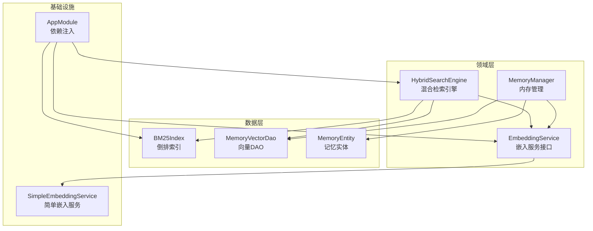
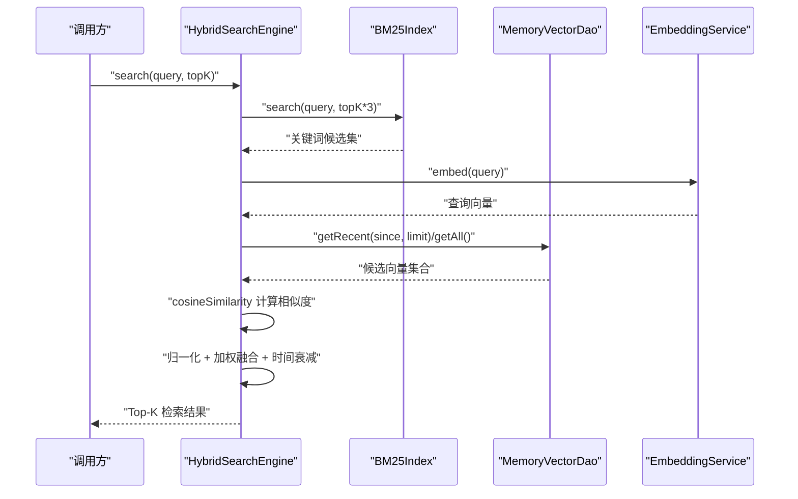
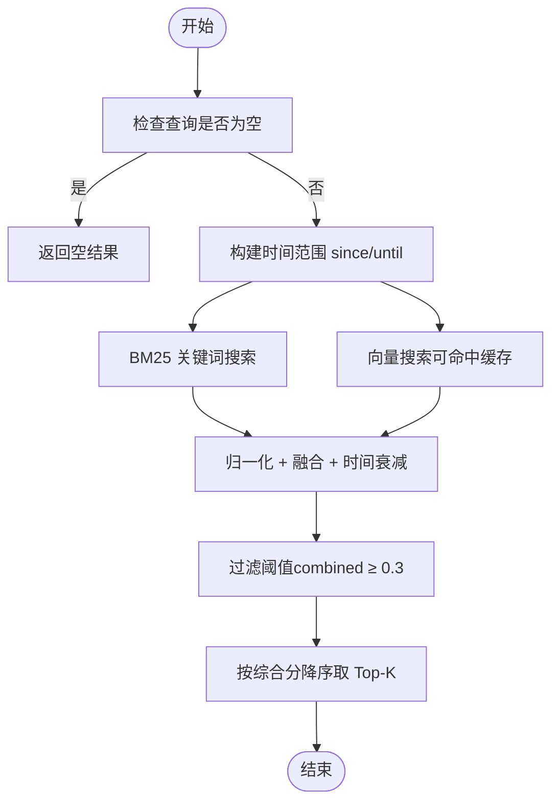
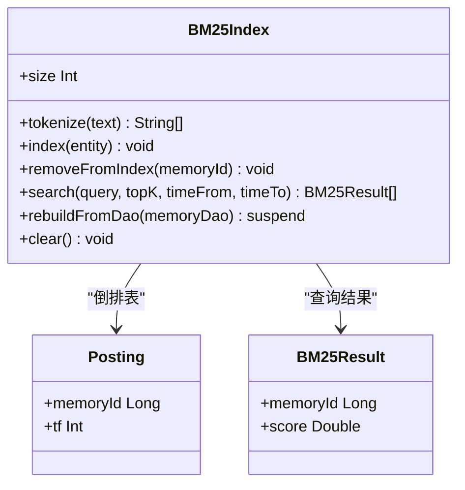
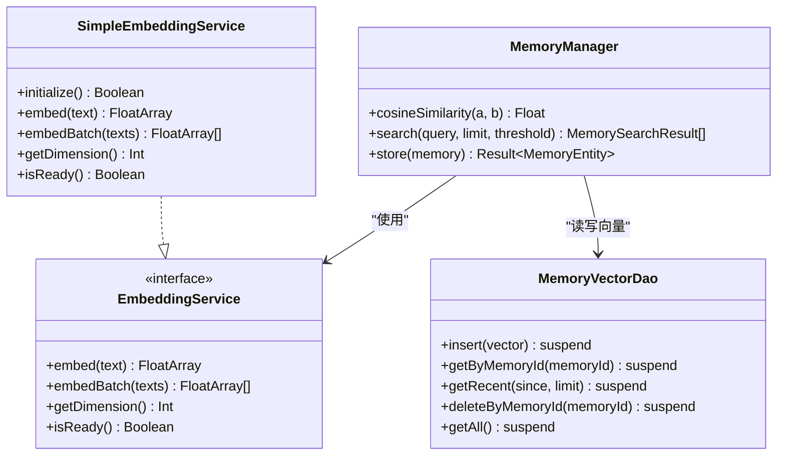
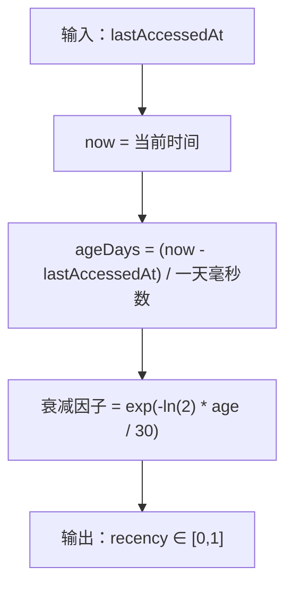
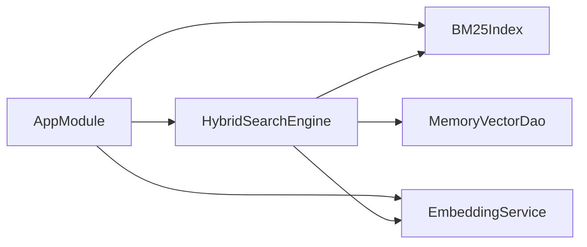

# 混合检索引擎

<cite>
**本文引用的文件**
- [HybridSearchEngine.kt](file://app/src/main/java/ai/openclaw/android/domain/memory/HybridSearchEngine.kt)
- [BM25Index.kt](file://app/src/main/java/ai/openclaw/android/data/local/BM25Index.kt)
- [MemoryManager.kt](file://app/src/main/java/ai/openclaw/android/domain/memory/MemoryManager.kt)
- [EmbeddingService.kt](file://app/src/main/java/ai/openclaw/android/domain/memory/EmbeddingService.kt)
- [SimpleEmbeddingService.kt](file://app/src/main/java/ai/openclaw/android/ml/SimpleEmbeddingService.kt)
- [MemoryVectorDao.kt](file://app/src/main/java/ai/openclaw/android/data/local/MemoryVectorDao.kt)
- [AppModule.kt](file://app/src/main/java/ai/openclaw/android/di/AppModule.kt)
- [MemoryEntity.kt](file://app/src/main/java/ai/openclaw/android/data/model/MemoryEntity.kt)
- [BM25Result.kt](file://app/src/main/java/ai/openclaw/android/data/model/BM25Result.kt)
- [VectorSearchTest.kt](file://app/src/test/java/ai/openclaw/android/domain/memory/VectorSearchTest.kt)
</cite>

## 目录
1. [简介](#简介)
2. [项目结构](#项目结构)
3. [核心组件](#核心组件)
4. [架构总览](#架构总览)
5. [详细组件分析](#详细组件分析)
6. [依赖关系分析](#依赖关系分析)
7. [性能考量](#性能考量)
8. [故障排查指南](#故障排查指南)
9. [结论](#结论)
10. [附录](#附录)

## 简介
本文件面向混合检索引擎的实现与使用，聚焦以下目标：
- 解释 HybridSearchEngine 的架构设计：BM25 关键词搜索、向量语义搜索与时间衰减的融合策略
- 深入分析 BM25Index 倒排索引的构建与查询优化机制
- 阐述向量相似度计算（余弦相似度）的实现原理与性能特征
- 说明时间衰减因子的计算公式及其对最终排序的影响
- 给出混合评分算法如何平衡关键词匹配度、语义相似度与时间相关性
- 提供检索性能优化策略：索引预热、缓存机制、并发查询处理
- 包含检索流程图、评分算法公式与实际使用示例

## 项目结构
混合检索引擎位于应用模块中，采用领域层与数据层分离的设计：
- 领域层负责检索策略与评分融合逻辑
- 数据层负责持久化与索引维护
- 通过依赖注入模块统一装配

图表来源
- [HybridSearchEngine.kt:18-226](file://app/src/main/java/ai/openclaw/android/domain/memory/HybridSearchEngine.kt#L18-L226)
- [BM25Index.kt:14-202](file://app/src/main/java/ai/openclaw/android/data/local/BM25Index.kt#L14-L202)
- [MemoryManager.kt:10-116](file://app/src/main/java/ai/openclaw/android/domain/memory/MemoryManager.kt#L10-L116)
- [AppModule.kt:24-79](file://app/src/main/java/ai/openclaw/android/di/AppModule.kt#L24-L79)

章节来源
- [AppModule.kt:24-79](file://app/src/main/java/ai/openclaw/android/di/AppModule.kt#L24-L79)

## 核心组件
- HybridSearchEngine：融合 BM25 关键词搜索、向量相似度与时间衰减，支持同步与异步两种执行路径，并提供带细节的评分分解输出
- BM25Index：纯 Kotlin 实现的倒排索引，支持中文（二元文）+ 英文小写词的分词，具备时间桶过滤与缓存优化
- MemoryManager：提供向量相似度搜索与存储能力，封装余弦相似度计算
- EmbeddingService：嵌入服务接口，SimpleEmbeddingService 提供基于哈希的降级实现
- MemoryVectorDao：向量持久化访问接口
- MemoryEntity：记忆实体模型，包含时间戳字段用于时间衰减

章节来源
- [HybridSearchEngine.kt:18-226](file://app/src/main/java/ai/openclaw/android/domain/memory/HybridSearchEngine.kt#L18-L226)
- [BM25Index.kt:14-202](file://app/src/main/java/ai/openclaw/android/data/local/BM25Index.kt#L14-L202)
- [MemoryManager.kt:10-116](file://app/src/main/java/ai/openclaw/android/domain/memory/MemoryManager.kt#L10-L116)
- [EmbeddingService.kt:3-8](file://app/src/main/java/ai/openclaw/android/domain/memory/EmbeddingService.kt#L3-L8)
- [SimpleEmbeddingService.kt:19-107](file://app/src/main/java/ai/openclaw/android/ml/SimpleEmbeddingService.kt#L19-L107)
- [MemoryVectorDao.kt:9-25](file://app/src/main/java/ai/openclaw/android/data/local/MemoryVectorDao.kt#L9-L25)
- [MemoryEntity.kt:6-18](file://app/src/main/java/ai/openclaw/android/data/model/MemoryEntity.kt#L6-L18)

## 架构总览
混合检索引擎采用“双路径召回 + 归一化融合”的架构：
- 关键词路径（BM25）：快速召回包含查询词的记忆片段
- 向量路径（语义）：对查询与候选向量计算余弦相似度
- 融合阶段：对两类分数进行归一化后加权求和，并叠加指数型时间衰减因子
- 输出：按综合得分降序返回 Top-K 结果

图表来源
- [HybridSearchEngine.kt:172-219](file://app/src/main/java/ai/openclaw/android/domain/memory/HybridSearchEngine.kt#L172-L219)
- [BM25Index.kt:140-178](file://app/src/main/java/ai/openclaw/android/data/local/BM25Index.kt#L140-L178)
- [MemoryManager.kt:101-114](file://app/src/main/java/ai/openclaw/android/domain/memory/MemoryManager.kt#L101-L114)

## 详细组件分析

### HybridSearchEngine：混合检索引擎
- 融合策略
  - 关键词分数归一化：以候选集中最大 BM25 分数为基准
  - 向量分数归一化：以候选集中最大余弦相似度为基准
  - 时间衰减：指数衰减因子，半衰期为 30 天
  - 综合评分：combined = 0.35·kw + 0.55·vec + 0.10·recency
  - 过滤阈值：仅保留 combined ≥ 0.3 的结果
- 查询路径
  - 同步：先做 BM25 搜索，再做向量搜索，最后融合
  - 异步：两路并行，使用协程并发执行，提升延迟表现
  - 详情模式：可输出每条候选的原始与归一化分数明细
- 缓存机制
  - 向量搜索结果缓存（LRU 风格），默认 TTL 30 秒，减少重复查询开销
- 索引重建
  - 支持从 DAO 全量重建 BM25 索引，便于批量更新或启动时预热

图表来源
- [HybridSearchEngine.kt:82-135](file://app/src/main/java/ai/openclaw/android/domain/memory/HybridSearchEngine.kt#L82-L135)
- [HybridSearchEngine.kt:172-219](file://app/src/main/java/ai/openclaw/android/domain/memory/HybridSearchEngine.kt#L172-L219)

章节来源
- [HybridSearchEngine.kt:18-226](file://app/src/main/java/ai/openclaw/android/domain/memory/HybridSearchEngine.kt#L18-L226)

### BM25Index：倒排索引与查询优化
- 分词策略
  - 中文：按字符大区范围识别 CJK 文本，提取连续段的二元组（bigram），并对短文本（2-4 字）保留原文
  - 英文：转小写单词
  - 查询词缓存：LRU 缓存常用查询的分词结果，降低重复分词成本
- 索引结构
  - 倒排表：term -> Posting 列表（memoryId, tf）
  - 文档长度映射：docLengths[docId] = tokenCount
  - 平均文档长度：avgDocLength = totalTokens / totalDocs
  - 时间桶：按天聚合记忆 ID，加速时间范围过滤
- 查询流程
  - 若指定时间范围，则先按天桶筛选候选集，再在候选内计算 BM25 分数
  - 对每个查询词，计算 IDF 与每个候选的 TF-IDF 归一化项之和
  - 返回按分数降序的前 K 结果
- 索引维护
  - 支持单条移除与重建（从 DAO 全量重建）

图表来源
- [BM25Index.kt:14-202](file://app/src/main/java/ai/openclaw/android/data/local/BM25Index.kt#L14-L202)
- [BM25Result.kt:3-6](file://app/src/main/java/ai/openclaw/android/data/model/BM25Result.kt#L3-L6)

章节来源
- [BM25Index.kt:14-202](file://app/src/main/java/ai/openclaw/android/data/local/BM25Index.kt#L14-L202)

### 向量相似度与嵌入服务
- 余弦相似度
  - 实现位于 MemoryManager.cosineSimilarity，计算向量点积与范数乘积的比值
  - 对零向量进行保护（分母极小值处理）
- 嵌入服务
  - 接口定义在 EmbeddingService，提供 embed/embedBatch/getDimension/isReady
  - SimpleEmbeddingService 提供基于 SHA-256 哈希的降级实现，保证在模型不可用时仍可工作
- 向量持久化
  - MemoryVectorDao 提供插入、按 ID 查询、最近向量查询与全量查询等接口

图表来源
- [MemoryManager.kt:101-114](file://app/src/main/java/ai/openclaw/android/domain/memory/MemoryManager.kt#L101-L114)
- [EmbeddingService.kt:3-8](file://app/src/main/java/ai/openclaw/android/domain/memory/EmbeddingService.kt#L3-L8)
- [SimpleEmbeddingService.kt:19-107](file://app/src/main/java/ai/openclaw/android/ml/SimpleEmbeddingService.kt#L19-L107)
- [MemoryVectorDao.kt:9-25](file://app/src/main/java/ai/openclaw/android/data/local/MemoryVectorDao.kt#L9-L25)

章节来源
- [MemoryManager.kt:101-114](file://app/src/main/java/ai/openclaw/android/domain/memory/MemoryManager.kt#L101-L114)
- [SimpleEmbeddingService.kt:19-107](file://app/src/main/java/ai/openclaw/android/ml/SimpleEmbeddingService.kt#L19-L107)
- [MemoryVectorDao.kt:9-25](file://app/src/main/java/ai/openclaw/android/data/local/MemoryVectorDao.kt#L9-L25)

### 时间衰减算法
- 定义
  - 使用指数衰减函数：衰减因子 = exp(-ln(2) · age / halfLife)，其中 halfLife = 30 天
  - 新鲜记忆（刚被访问）得分接近 1.0；半衰期后约为 0.5；随时间增长趋近于 0
- 在混合评分中的作用
  - 作为第三项权重 0.10 参与融合，抑制长期未访问的记忆，提升新鲜度相关性

图表来源
- [HybridSearchEngine.kt:74-80](file://app/src/main/java/ai/openclaw/android/domain/memory/HybridSearchEngine.kt#L74-L80)

章节来源
- [HybridSearchEngine.kt:74-80](file://app/src/main/java/ai/openclaw/android/domain/memory/HybridSearchEngine.kt#L74-L80)

### 混合评分算法与参数
- 归一化
  - 关键词分数：kw_norm = kw_score / max_kwscore
  - 向量分数：vec_norm = vec_score / max_vecscore
- 综合评分
  - combined = 0.35 · kw_norm + 0.55 · vec_norm + 0.10 · recency
- 过滤
  - 仅保留 combined ≥ 0.3 的候选

章节来源
- [HybridSearchEngine.kt:82-135](file://app/src/main/java/ai/openclaw/android/domain/memory/HybridSearchEngine.kt#L82-L135)

## 依赖关系分析
- 依赖注入
  - AppModule 将 BM25Index、EmbeddingService、HybridSearchEngine 等注册为单例，供上层模块使用
- 组件耦合
  - HybridSearchEngine 依赖 BM25Index、MemoryVectorDao、EmbeddingService 与 MemoryDao
  - MemoryManager 独立于 HybridSearchEngine，提供向量搜索与存储能力
- 外部依赖
  - 协程调度器用于并发执行
  - Room DAO 用于持久化

图表来源
- [AppModule.kt:24-79](file://app/src/main/java/ai/openclaw/android/di/AppModule.kt#L24-L79)
- [HybridSearchEngine.kt:18-23](file://app/src/main/java/ai/openclaw/android/domain/memory/HybridSearchEngine.kt#L18-L23)

章节来源
- [AppModule.kt:24-79](file://app/src/main/java/ai/openclaw/android/di/AppModule.kt#L24-L79)

## 性能考量
- 索引预热
  - 启动时调用 HybridSearchEngine.rebuildIndex，从 DAO 全量重建 BM25 索引，避免首次查询冷启动延迟
- 查询优化
  - BM25 查询支持时间桶过滤，缩小候选集规模
  - 查询词分词结果 LRU 缓存，减少重复分词
  - 向量搜索结果缓存（TTL 30 秒），降低重复查询成本
- 并发查询
  - asyncSearch 使用协程并发执行 BM25 与向量搜索，显著降低端到端延迟
- 向量相似度
  - 余弦相似度计算为 O(d)（d 为维度），建议控制维度大小与批量处理
- 降级策略
  - 当 EmbeddingService 不可用时，SimpleEmbeddingService 提供基于哈希的一致性伪向量，保证功能可用

章节来源
- [HybridSearchEngine.kt:221-225](file://app/src/main/java/ai/openclaw/android/domain/memory/HybridSearchEngine.kt#L221-L225)
- [BM25Index.kt:35-38](file://app/src/main/java/ai/openclaw/android/data/local/BM25Index.kt#L35-L38)
- [BM25Index.kt:140-178](file://app/src/main/java/ai/openclaw/android/data/local/BM25Index.kt#L140-L178)
- [HybridSearchEngine.kt:202-219](file://app/src/main/java/ai/openclaw/android/domain/memory/HybridSearchEngine.kt#L202-L219)
- [SimpleEmbeddingService.kt:19-107](file://app/src/main/java/ai/openclaw/android/ml/SimpleEmbeddingService.kt#L19-L107)

## 故障排查指南
- 向量相似度测试
  - 测试覆盖了相同向量相似度为 1、正交为 0、反向为 -1、零向量返回 0、维度不匹配抛异常、高维向量正确计算等场景
- 常见问题定位
  - 若检索结果为空：检查查询是否为空、BM25 索引是否已重建、向量表是否有数据
  - 若性能异常：确认是否启用缓存、是否使用 asyncSearch、BM25 时间范围是否合理
  - 若语义相关性差：确认 EmbeddingService 是否可用，或是否处于降级模式

章节来源
- [VectorSearchTest.kt:19-86](file://app/src/test/java/ai/openclaw/android/domain/memory/VectorSearchTest.kt#L19-L86)
- [VectorSearchTest.kt:194-291](file://app/src/test/java/ai/openclaw/android/domain/memory/VectorSearchTest.kt#L194-L291)

## 结论
该混合检索引擎通过“BM25 快速召回 + 语义相似度 + 时间衰减”的组合，在准确性和时效性之间取得良好平衡。其核心优势在于：
- 明确的评分融合与归一化策略
- 面向移动端的索引与缓存优化
- 并发查询与降级容错能力
建议在生产环境中配合索引预热、缓存策略与合理的阈值设置，持续监控检索质量与性能指标。

## 附录
- 实际使用示例（步骤说明）
  - 初始化：通过依赖注入获取 HybridSearchEngine 单例
  - 首次使用：调用 rebuildIndex 预热索引
  - 检索：调用 search 或 asyncSearch，传入查询字符串与期望返回数量
  - 诊断：如需查看评分明细，使用 searchWithDetails 获取每条候选的原始与归一化分数
- 评分算法公式
  - 归一化：kw_norm = kw_score / max_kwscore；vec_norm = vec_score / max_vecscore
  - 时间衰减：exp(-ln(2) · age_days / 30)
  - 综合评分：combined = 0.35 · kw_norm + 0.55 · vec_norm + 0.10 · recency
  - 过滤：仅保留 combined ≥ 0.3 的结果