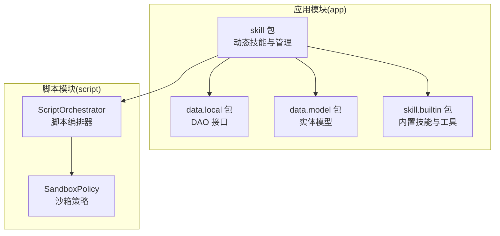
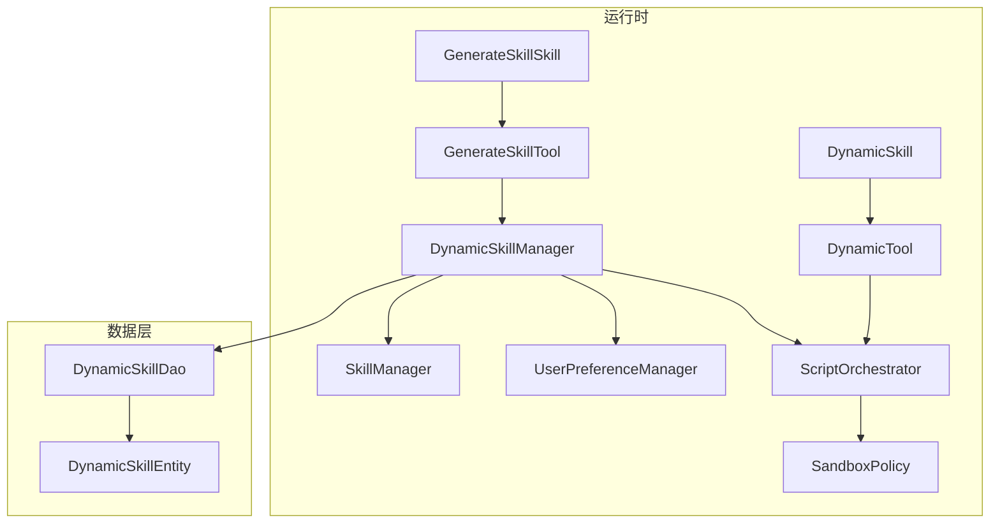
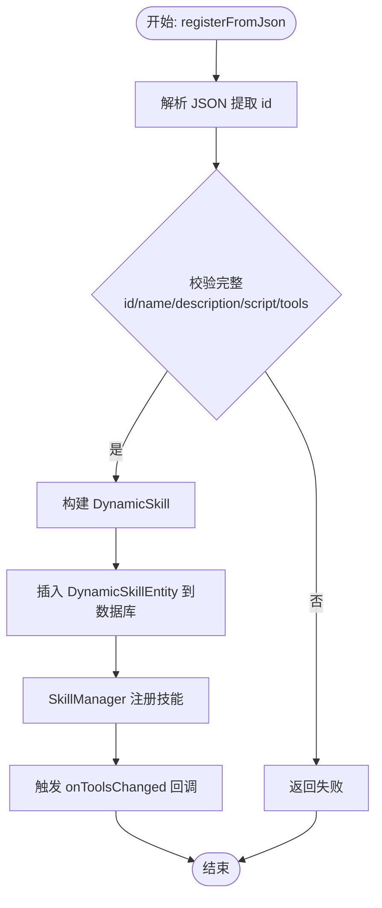
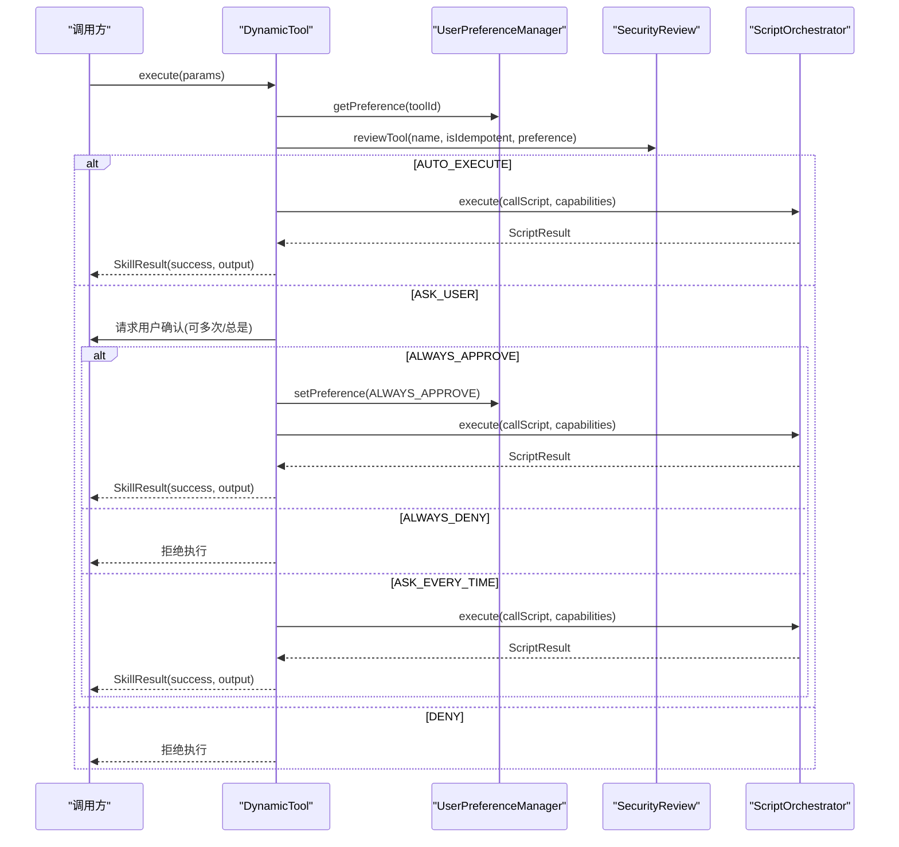
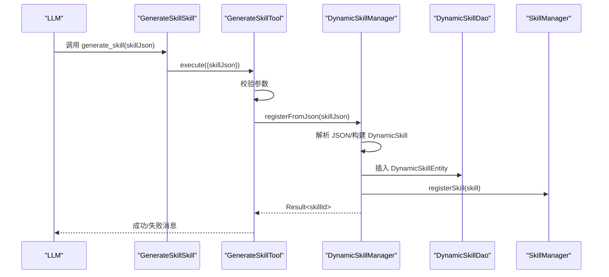
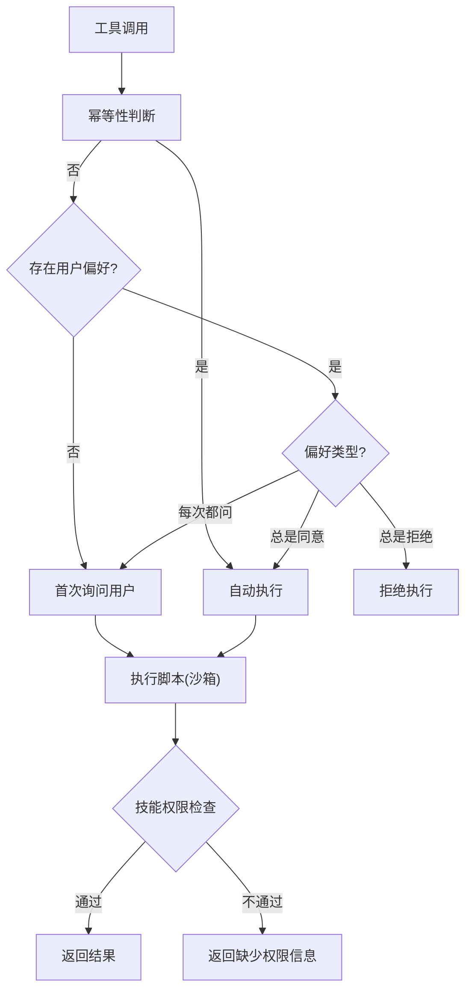
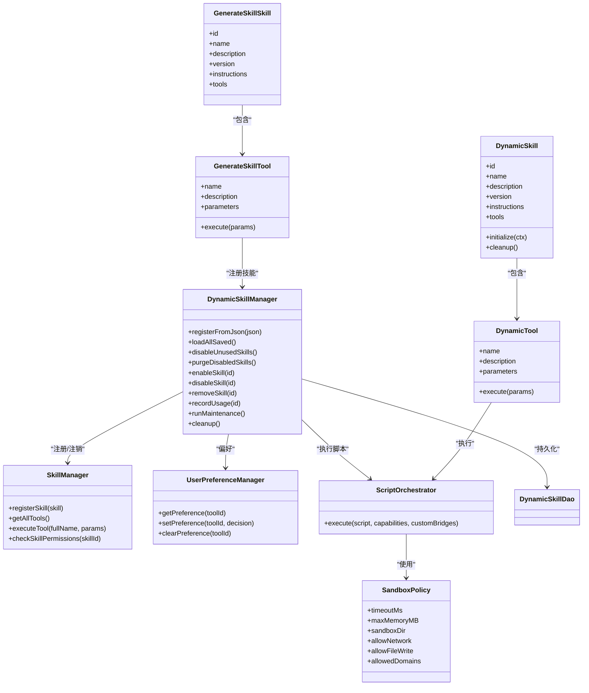

# 动态技能管理

<cite>
**本文引用的文件**
- [DynamicSkillManager.kt](file://app/src/main/java/ai/openclaw/android/skill/DynamicSkillManager.kt)
- [DynamicSkill.kt](file://app/src/main/java/ai/openclaw/android/skill/DynamicSkill.kt)
- [GenerateSkillSkill.kt](file://app/src/main/java/ai/openclaw/android/skill/builtin/GenerateSkillSkill.kt)
- [GenerateSkillTool.kt](file://app/src/main/java/ai/openclaw/android/skill/builtin/GenerateSkillTool.kt)
- [ToolSecurityPolicy.kt](file://app/src/main/java/ai/openclaw/android/skill/ToolSecurityPolicy.kt)
- [UserPreferenceManager.kt](file://app/src/main/java/ai/openclaw/android/skill/UserPreferenceManager.kt)
- [SkillManager.kt](file://app/src/main/java/ai/openclaw/android/skill/SkillManager.kt)
- [DynamicSkillDao.kt](file://app/src/main/java/ai/openclaw/android/data/local/DynamicSkillDao.kt)
- [DynamicSkillEntity.kt](file://app/src/main/java/ai/openclaw/android/data/model/DynamicSkillEntity.kt)
- [ScriptOrchestrator.kt](file://script/src/main/java/ai/openclaw/script/ScriptOrchestrator.kt)
- [SandboxPolicy.kt](file://script/src/main/java/ai/openclaw/script/SandboxPolicy.kt)
- [DynamicSkillManagerTest.kt](file://app/src/test/java/ai/openclaw/android/skill/DynamicSkillManagerTest.kt)
- [DynamicSkillTest.kt](file://app/src/test/java/ai/openclaw/android/skill/DynamicSkillTest.kt)
- [GenerateSkillToolTest.kt](file://app/src/test/java/ai/openclaw/android/skill/builtin/GenerateSkillToolTest.kt)
</cite>

## 目录
1. [简介](#简介)
2. [项目结构](#项目结构)
3. [核心组件](#核心组件)
4. [架构总览](#架构总览)
5. [详细组件分析](#详细组件分析)
6. [依赖关系分析](#依赖关系分析)
7. [性能考量](#性能考量)
8. [故障排查指南](#故障排查指南)
9. [结论](#结论)
10. [附录](#附录)

## 简介
本文件面向动态技能管理系统，围绕 DynamicSkillManager 动态技能管理器、DynamicSkill 动态技能模型、GenerateSkillSkill 技能生成工具进行系统性技术说明。内容涵盖：
- 动态技能的加载、执行与生命周期管理
- 动态技能定义、参数验证与执行机制
- 技能生成工具的工作原理与使用方法
- 安全策略、沙箱隔离与权限控制
- 加载流程图、技能生成流程图与执行监控机制
- 开发模板、安全配置示例与性能优化建议

## 项目结构
动态技能体系主要分布在 app 模块的 skill 包与 script 模块的脚本引擎中，数据持久化位于 app 模块的 data 层。

图表来源
- [DynamicSkillManager.kt:1-202](file://app/src/main/java/ai/openclaw/android/skill/DynamicSkillManager.kt#L1-L202)
- [DynamicSkill.kt:1-221](file://app/src/main/java/ai/openclaw/android/skill/DynamicSkill.kt#L1-L221)
- [GenerateSkillSkill.kt:1-27](file://app/src/main/java/ai/openclaw/android/skill/builtin/GenerateSkillSkill.kt#L1-L27)
- [GenerateSkillTool.kt:1-88](file://app/src/main/java/ai/openclaw/android/skill/builtin/GenerateSkillTool.kt#L1-L88)
- [DynamicSkillDao.kt:1-47](file://app/src/main/java/ai/openclaw/android/data/local/DynamicSkillDao.kt#L1-L47)
- [DynamicSkillEntity.kt:1-22](file://app/src/main/java/ai/openclaw/android/data/model/DynamicSkillEntity.kt#L1-L22)
- [ScriptOrchestrator.kt:1-55](file://script/src/main/java/ai/openclaw/script/ScriptOrchestrator.kt#L1-L55)
- [SandboxPolicy.kt:1-16](file://script/src/main/java/ai/openclaw/script/SandboxPolicy.kt#L1-L16)

章节来源
- [DynamicSkillManager.kt:1-202](file://app/src/main/java/ai/openclaw/android/skill/DynamicSkillManager.kt#L1-L202)
- [DynamicSkill.kt:1-221](file://app/src/main/java/ai/openclaw/android/skill/DynamicSkill.kt#L1-L221)
- [GenerateSkillSkill.kt:1-27](file://app/src/main/java/ai/openclaw/android/skill/builtin/GenerateSkillSkill.kt#L1-L27)
- [GenerateSkillTool.kt:1-88](file://app/src/main/java/ai/openclaw/android/skill/builtin/GenerateSkillTool.kt#L1-L88)
- [DynamicSkillDao.kt:1-47](file://app/src/main/java/ai/openclaw/android/data/local/DynamicSkillDao.kt#L1-L47)
- [DynamicSkillEntity.kt:1-22](file://app/src/main/java/ai/openclaw/android/data/model/DynamicSkillEntity.kt#L1-L22)
- [ScriptOrchestrator.kt:1-55](file://script/src/main/java/ai/openclaw/script/ScriptOrchestrator.kt#L1-L55)
- [SandboxPolicy.kt:1-16](file://script/src/main/java/ai/openclaw/script/SandboxPolicy.kt#L1-L16)

## 核心组件
- DynamicSkillManager：负责动态技能的注册、持久化、加载、启用/停用/删除以及生命周期维护（30天未使用停用、90天已停用删除），并提供工具变更通知回调。
- DynamicSkill：从 JSON 反序列化得到的动态技能对象，包含元数据与工具定义；其工具通过 ScriptOrchestrator 执行 JS 脚本。
- GenerateSkillSkill/GenerateSkillTool：提供“生成技能”能力，允许 LLM 以 JSON 定义创建新技能。
- SkillManager：全局技能管理器，负责内置技能加载、工具聚合与权限检查。
- UserPreferenceManager：用户审批偏好持久化（JSON 文件），支持自动执行/每次询问/总是拒绝等策略。
- ScriptOrchestrator：脚本执行入口，负责桥接能力（文件、网络等）、沙箱策略与执行调度。
- SandboxPolicy：脚本执行沙箱策略（超时、内存限制、目录隔离、网络/文件写入开关等）。
- DAO/Entity：Room 数据访问层，持久化动态技能元数据、启用状态、最后使用时间等。

章节来源
- [DynamicSkillManager.kt:13-28](file://app/src/main/java/ai/openclaw/android/skill/DynamicSkillManager.kt#L13-L28)
- [DynamicSkill.kt:22-46](file://app/src/main/java/ai/openclaw/android/skill/DynamicSkill.kt#L22-L46)
- [GenerateSkillSkill.kt:10-26](file://app/src/main/java/ai/openclaw/android/skill/builtin/GenerateSkillSkill.kt#L10-L26)
- [GenerateSkillTool.kt:10-87](file://app/src/main/java/ai/openclaw/android/skill/builtin/GenerateSkillTool.kt#L10-L87)
- [SkillManager.kt:8-38](file://app/src/main/java/ai/openclaw/android/skill/SkillManager.kt#L8-L38)
- [UserPreferenceManager.kt:16-98](file://app/src/main/java/ai/openclaw/android/skill/UserPreferenceManager.kt#L16-L98)
- [ScriptOrchestrator.kt:13-54](file://script/src/main/java/ai/openclaw/script/ScriptOrchestrator.kt#L13-L54)
- [SandboxPolicy.kt:8-15](file://script/src/main/java/ai/openclaw/script/SandboxPolicy.kt#L8-L15)
- [DynamicSkillDao.kt:7-46](file://app/src/main/java/ai/openclaw/android/data/local/DynamicSkillDao.kt#L7-L46)
- [DynamicSkillEntity.kt:6-21](file://app/src/main/java/ai/openclaw/android/data/model/DynamicSkillEntity.kt#L6-L21)

## 架构总览
动态技能系统采用“JSON 定义 + JS 脚本 + 沙箱执行”的模式，结合用户偏好与权限控制，形成可扩展、可审计、可维护的技能生态。

图表来源
- [DynamicSkillManager.kt:22-29](file://app/src/main/java/ai/openclaw/android/skill/DynamicSkillManager.kt#L22-L29)
- [SkillManager.kt:8-38](file://app/src/main/java/ai/openclaw/android/skill/SkillManager.kt#L8-L38)
- [UserPreferenceManager.kt:16-21](file://app/src/main/java/ai/openclaw/android/skill/UserPreferenceManager.kt#L16-L21)
- [GenerateSkillSkill.kt:10-26](file://app/src/main/java/ai/openclaw/android/skill/builtin/GenerateSkillSkill.kt#L10-L26)
- [GenerateSkillTool.kt:10-16](file://app/src/main/java/ai/openclaw/android/skill/builtin/GenerateSkillTool.kt#L10-L16)
- [DynamicSkill.kt:22-38](file://app/src/main/java/ai/openclaw/android/skill/DynamicSkill.kt#L22-L38)
- [DynamicSkill.kt:130-138](file://app/src/main/java/ai/openclaw/android/skill/DynamicSkill.kt#L130-L138)
- [ScriptOrchestrator.kt:13-39](file://script/src/main/java/ai/openclaw/script/ScriptOrchestrator.kt#L13-L39)
- [SandboxPolicy.kt:8-15](file://script/src/main/java/ai/openclaw/script/SandboxPolicy.kt#L8-L15)
- [DynamicSkillDao.kt:7-46](file://app/src/main/java/ai/openclaw/android/data/local/DynamicSkillDao.kt#L7-L46)
- [DynamicSkillEntity.kt:6-21](file://app/src/main/java/ai/openclaw/android/data/model/DynamicSkillEntity.kt#L6-L21)

## 详细组件分析

### DynamicSkillManager：动态技能管理器
职责与特性
- 注册：从 JSON 解析技能元数据与工具定义，持久化到数据库，同时在运行时注册到 SkillManager。
- 加载：启动时从数据库读取已启用技能，重建运行时技能实例。
- 生命周期：定期停用 30 天未使用技能；清理 90 天已停用技能。
- 手动管理：支持启用、停用、删除技能，并同步清理用户偏好。
- 使用记录：每次工具调用会更新 lastUsedAt，避免误判刚创建的技能。
- 工具变更通知：注册成功后触发 onToolsChanged 回调，便于 UI 或网关刷新工具列表。

关键流程图：动态技能注册与持久化

图表来源
- [DynamicSkillManager.kt:63-96](file://app/src/main/java/ai/openclaw/android/skill/DynamicSkillManager.kt#L63-L96)
- [DynamicSkill.kt:54-107](file://app/src/main/java/ai/openclaw/android/skill/DynamicSkill.kt#L54-L107)
- [DynamicSkillDao.kt:15-16](file://app/src/main/java/ai/openclaw/android/data/local/DynamicSkillDao.kt#L15-L16)

章节来源
- [DynamicSkillManager.kt:13-28](file://app/src/main/java/ai/openclaw/android/skill/DynamicSkillManager.kt#L13-L28)
- [DynamicSkillManager.kt:63-116](file://app/src/main/java/ai/openclaw/android/skill/DynamicSkillManager.kt#L63-L116)
- [DynamicSkillManager.kt:122-147](file://app/src/main/java/ai/openclaw/android/skill/DynamicSkillManager.kt#L122-L147)
- [DynamicSkillManager.kt:152-178](file://app/src/main/java/ai/openclaw/android/skill/DynamicSkillManager.kt#L152-L178)
- [DynamicSkillManager.kt:183-193](file://app/src/main/java/ai/openclaw/android/skill/DynamicSkillManager.kt#L183-L193)

### DynamicSkill：动态技能定义与执行
- JSON 解析：从 JSON 中提取 id、name、description、version、instructions、script、tools 等字段；tools 支持参数类型、必填、默认值等声明。
- 工具映射：每个工具定义映射为 DynamicTool，具备名称、描述、参数与入口函数名。
- 执行路径：DynamicTool.execute() 先进行安全审查，再通过 ScriptOrchestrator 执行 JS 脚本，最终封装为 SkillResult。

执行流程图：动态工具执行与安全审查

图表来源
- [DynamicSkill.kt:153-193](file://app/src/main/java/ai/openclaw/android/skill/DynamicSkill.kt#L153-L193)
- [ToolSecurityPolicy.kt:44-71](file://app/src/main/java/ai/openclaw/android/skill/ToolSecurityPolicy.kt#L44-L71)
- [UserPreferenceManager.kt:35-52](file://app/src/main/java/ai/openclaw/android/skill/UserPreferenceManager.kt#L35-L52)
- [ScriptOrchestrator.kt:31-39](file://script/src/main/java/ai/openclaw/script/ScriptOrchestrator.kt#L31-L39)

章节来源
- [DynamicSkill.kt:22-108](file://app/src/main/java/ai/openclaw/android/skill/DynamicSkill.kt#L22-L108)
- [DynamicSkill.kt:130-220](file://app/src/main/java/ai/openclaw/android/skill/DynamicSkill.kt#L130-L220)

### GenerateSkillSkill 与 GenerateSkillTool：技能生成工具
- GenerateSkillSkill：提供一个技能，内含 generate_skill 工具，用于接收 LLM 的 JSON 定义并注册为动态技能。
- GenerateSkillTool：校验参数 skillJson，调用 DynamicSkillManager.registerFromJson 完成注册。

技能生成流程图

图表来源
- [GenerateSkillSkill.kt:10-26](file://app/src/main/java/ai/openclaw/android/skill/builtin/GenerateSkillSkill.kt#L10-L26)
- [GenerateSkillTool.kt:63-86](file://app/src/main/java/ai/openclaw/android/skill/builtin/GenerateSkillTool.kt#L63-L86)
- [DynamicSkillManager.kt:63-96](file://app/src/main/java/ai/openclaw/android/skill/DynamicSkillManager.kt#L63-L96)

章节来源
- [GenerateSkillSkill.kt:10-26](file://app/src/main/java/ai/openclaw/android/skill/builtin/GenerateSkillSkill.kt#L10-L26)
- [GenerateSkillTool.kt:10-87](file://app/src/main/java/ai/openclaw/android/skill/builtin/GenerateSkillTool.kt#L10-L87)

### 安全策略、沙箱隔离与权限控制
- 安全策略：基于幂等性与用户偏好决定执行策略（自动执行/询问用户/拒绝）。幂等工具默认自动执行，非幂等工具根据用户偏好或每次询问。
- 用户偏好：持久化在 JSON 文件中，支持 ALWAYS_APPROVE、ALWAYS_DENY、ASK_EVERY_TIME。
- 沙箱隔离：ScriptOrchestrator 在独立沙箱目录下执行脚本，限制超时、内存、网络与文件写入；可通过能力列表选择性开放 fs/http 等能力。
- 权限控制：SkillManager 在执行工具前检查技能所需权限，若缺失则返回权限请求信息，避免越权操作。

安全策略与权限检查流程图

图表来源
- [ToolSecurityPolicy.kt:44-71](file://app/src/main/java/ai/openclaw/android/skill/ToolSecurityPolicy.kt#L44-L71)
- [UserPreferenceManager.kt:35-52](file://app/src/main/java/ai/openclaw/android/skill/UserPreferenceManager.kt#L35-L52)
- [ScriptOrchestrator.kt:31-39](file://script/src/main/java/ai/openclaw/script/ScriptOrchestrator.kt#L31-L39)
- [SkillManager.kt:89-107](file://app/src/main/java/ai/openclaw/android/skill/SkillManager.kt#L89-L107)

章节来源
- [ToolSecurityPolicy.kt:6-25](file://app/src/main/java/ai/openclaw/android/skill/ToolSecurityPolicy.kt#L6-L25)
- [ToolSecurityPolicy.kt:44-71](file://app/src/main/java/ai/openclaw/android/skill/ToolSecurityPolicy.kt#L44-L71)
- [UserPreferenceManager.kt:16-98](file://app/src/main/java/ai/openclaw/android/skill/UserPreferenceManager.kt#L16-L98)
- [ScriptOrchestrator.kt:13-54](file://script/src/main/java/ai/openclaw/script/ScriptOrchestrator.kt#L13-L54)
- [SandboxPolicy.kt:8-15](file://script/src/main/java/ai/openclaw/script/SandboxPolicy.kt#L8-L15)
- [SkillManager.kt:89-138](file://app/src/main/java/ai/openclaw/android/skill/SkillManager.kt#L89-L138)

## 依赖关系分析
- DynamicSkillManager 依赖 SkillManager（运行时注册/注销）、DynamicSkillDao（持久化）、ScriptOrchestrator（脚本执行）、UserPreferenceManager（安全偏好）。
- DynamicSkill 依赖 ScriptOrchestrator 执行脚本；其工具 DynamicTool 依赖 UserPreferenceManager 与 SecurityReview。
- SkillManager 统一管理所有技能（内置+动态），提供工具聚合与权限检查。
- ScriptOrchestrator 依赖 SandboxPolicy 与能力桥接（文件/网络等）。

图表来源
- [DynamicSkillManager.kt:22-29](file://app/src/main/java/ai/openclaw/android/skill/DynamicSkillManager.kt#L22-L29)
- [DynamicSkill.kt:22-38](file://app/src/main/java/ai/openclaw/android/skill/DynamicSkill.kt#L22-L38)
- [DynamicSkill.kt:130-138](file://app/src/main/java/ai/openclaw/android/skill/DynamicSkill.kt#L130-L138)
- [GenerateSkillSkill.kt:10-26](file://app/src/main/java/ai/openclaw/android/skill/builtin/GenerateSkillSkill.kt#L10-L26)
- [GenerateSkillTool.kt:10-16](file://app/src/main/java/ai/openclaw/android/skill/builtin/GenerateSkillTool.kt#L10-L16)
- [SkillManager.kt:8-38](file://app/src/main/java/ai/openclaw/android/skill/SkillManager.kt#L8-L38)
- [UserPreferenceManager.kt:16-21](file://app/src/main/java/ai/openclaw/android/skill/UserPreferenceManager.kt#L16-L21)
- [ScriptOrchestrator.kt:13-39](file://script/src/main/java/ai/openclaw/script/ScriptOrchestrator.kt#L13-L39)
- [SandboxPolicy.kt:8-15](file://script/src/main/java/ai/openclaw/script/SandboxPolicy.kt#L8-L15)

章节来源
- [DynamicSkillManager.kt:22-29](file://app/src/main/java/ai/openclaw/android/skill/DynamicSkillManager.kt#L22-L29)
- [DynamicSkill.kt:22-38](file://app/src/main/java/ai/openclaw/android/skill/DynamicSkill.kt#L22-L38)
- [GenerateSkillSkill.kt:10-26](file://app/src/main/java/ai/openclaw/android/skill/builtin/GenerateSkillSkill.kt#L10-L26)
- [GenerateSkillTool.kt:10-16](file://app/src/main/java/ai/openclaw/android/skill/builtin/GenerateSkillTool.kt#L10-L16)
- [SkillManager.kt:8-38](file://app/src/main/java/ai/openclaw/android/skill/SkillManager.kt#L8-L38)
- [UserPreferenceManager.kt:16-21](file://app/src/main/java/ai/openclaw/android/skill/UserPreferenceManager.kt#L16-L21)
- [ScriptOrchestrator.kt:13-39](file://script/src/main/java/ai/openclaw/script/ScriptOrchestrator.kt#L13-L39)
- [SandboxPolicy.kt:8-15](file://script/src/main/java/ai/openclaw/script/SandboxPolicy.kt#L8-L15)

## 性能考量
- 脚本执行：通过 ScriptOrchestrator 的 SandboxPolicy 控制超时与内存上限，避免长时间阻塞或内存泄漏。
- I/O 与并发：DynamicSkillManager 使用 IO 协程调度与 SupervisorJob，降低主线程压力；批量加载与停用/清理采用逐条处理，保证稳定性。
- 数据访问：DAO 查询按条件索引（enabled、lastUsedAt）执行，减少扫描成本。
- 工具聚合：SkillManager 聚合工具时避免重复遍历，命名规范（skillId_toolName）便于快速匹配。

## 故障排查指南
常见问题与定位要点
- 注册失败：检查 JSON 结构是否包含 id、name、description、script、tools；查看日志输出与异常堆栈。
- 加载失败：确认数据库中 toolsJson 是否有效；捕获异常并记录实体 id。
- 未生效：确认技能处于 enabled=true；检查 lastUsedAt 是否被正确更新。
- 安全策略异常：核对用户偏好文件是否存在、格式是否正确；确认 isIdempotent 标记是否合理。
- 权限不足：调用 executeTool 后返回“需要权限”，检查技能所需权限列表与设备授权状态。

章节来源
- [DynamicSkillManagerTest.kt:66-98](file://app/src/test/java/ai/openclaw/android/skill/DynamicSkillManagerTest.kt#L66-L98)
- [DynamicSkillTest.kt:106-143](file://app/src/test/java/ai/openclaw/android/skill/DynamicSkillTest.kt#L106-L143)
- [GenerateSkillToolTest.kt:52-104](file://app/src/test/java/ai/openclaw/android/skill/builtin/GenerateSkillToolTest.kt#L52-L104)
- [SkillManager.kt:89-107](file://app/src/main/java/ai/openclaw/android/skill/SkillManager.kt#L89-L107)

## 结论
动态技能系统通过“JSON 定义 + JS 脚本 + 沙箱执行 + 用户偏好 + 权限控制”的组合，实现了灵活、安全、可审计的技能扩展机制。DynamicSkillManager 负责生命周期与持久化，DynamicSkill 提供强类型的工具定义与执行，GenerateSkillSkill/Tool 支持 LLM 一键生成，SkillManager 统一调度与权限校验，ScriptOrchestrator 与 SandboxPolicy 提供安全边界。整体架构清晰、职责分明，适合持续演进与扩展。

## 附录

### 动态技能开发模板
- 技能 JSON 必备字段：id、name、description、version、instructions、script、tools
- 工具定义必备字段：name、description、entryPoint；parameters 为参数清单（type/description/required/default）
- 幂等标记：仅对只读/无副作用操作设为 true，提升用户体验
- 示例参考
  - [DynamicSkillTest.kt:16-42](file://app/src/test/java/ai/openclaw/android/skill/DynamicSkillTest.kt#L16-L42)
  - [GenerateSkillTool.kt:37-52](file://app/src/main/java/ai/openclaw/android/skill/builtin/GenerateSkillTool.kt#L37-L52)

### 安全配置示例
- 沙箱策略：限制超时、内存、网络与文件写入；必要时限定域名白名单
  - [SandboxPolicy.kt:8-15](file://script/src/main/java/ai/openclaw/script/SandboxPolicy.kt#L8-L15)
- 能力桥接：按需开启 fs/http/memory 等能力
  - [ScriptOrchestrator.kt:41-53](file://script/src/main/java/ai/openclaw/script/ScriptOrchestrator.kt#L41-L53)
- 用户偏好：通过 UserPreferenceManager 管理 ALWAYS_APPROVE/ALWAYS_DENY/ASK_EVERY_TIME
  - [UserPreferenceManager.kt:35-52](file://app/src/main/java/ai/openclaw/android/skill/UserPreferenceManager.kt#L35-L52)

### 性能优化建议
- 批量维护：利用 runMaintenance 定期停用/清理，降低运行时负担
  - [DynamicSkillManager.kt:190-193](file://app/src/main/java/ai/openclaw/android/skill/DynamicSkillManager.kt#L190-L193)
- 参数序列化：统一将参数转为 JSON 字符串传入脚本，减少类型转换开销
  - [DynamicSkill.kt:195-205](file://app/src/main/java/ai/openclaw/android/skill/DynamicSkill.kt#L195-L205)
- DAO 查询：确保按 enabled、lastUsedAt 等字段建立索引，减少扫描
  - [DynamicSkillDao.kt:9-37](file://app/src/main/java/ai/openclaw/android/data/local/DynamicSkillDao.kt#L9-L37)