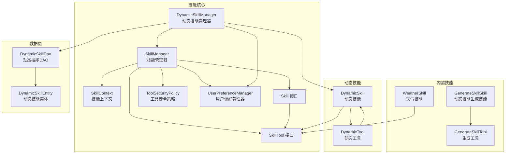
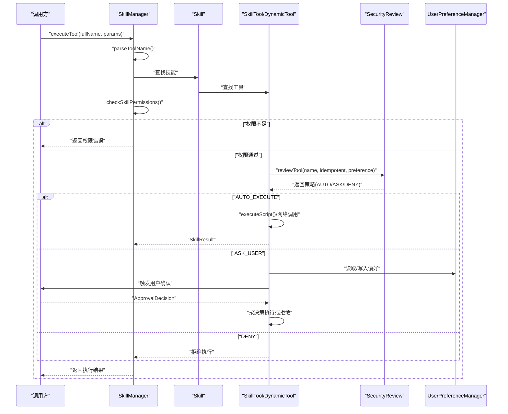
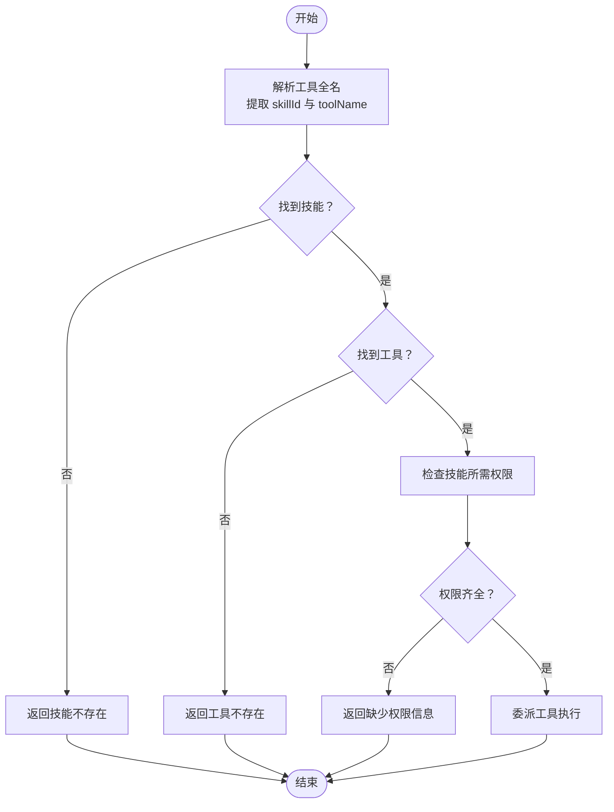
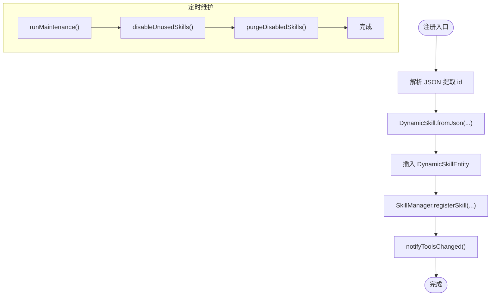
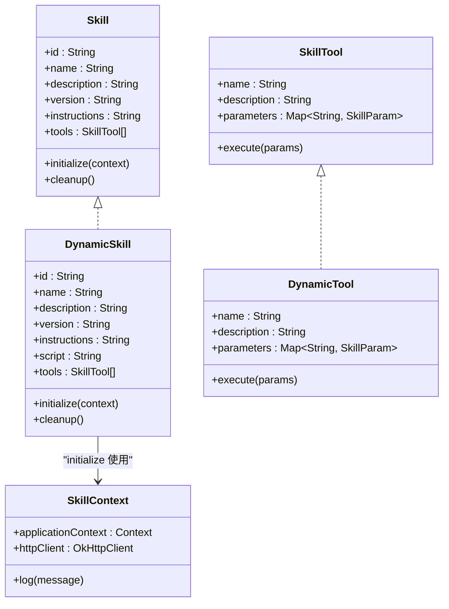
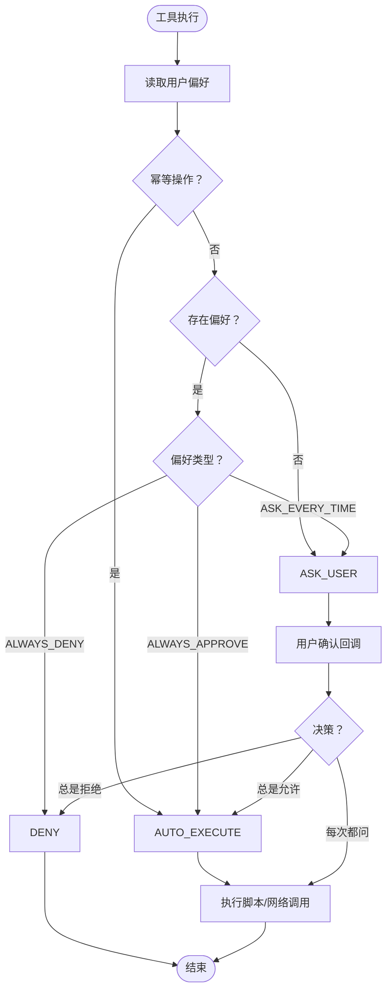
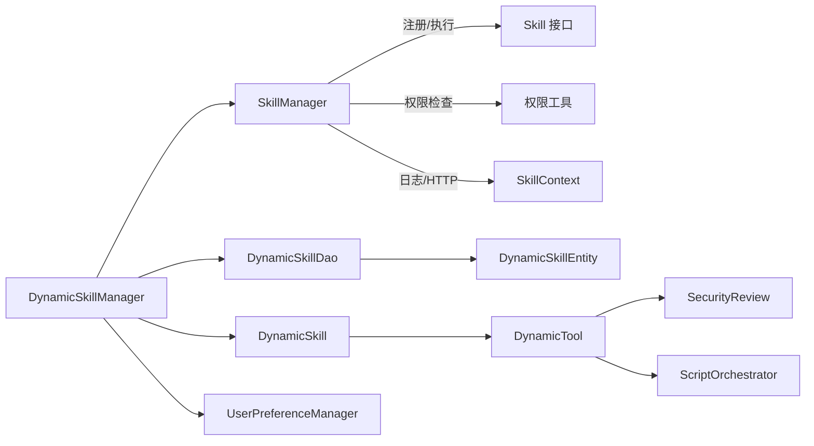
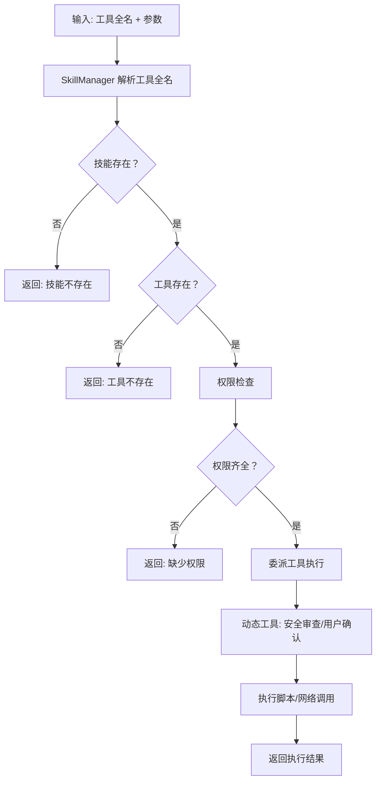
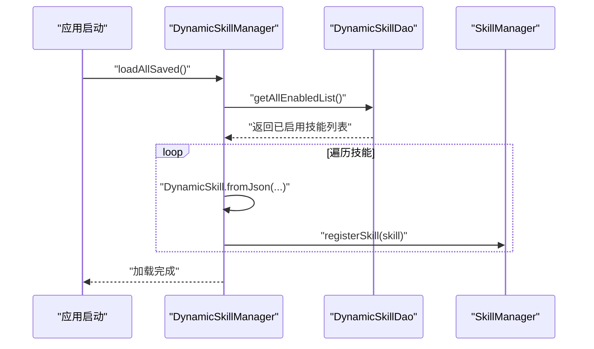

# 技能管理系统

<cite>
**本文引用的文件**
- [SkillManager.kt](file://app/src/main/java/ai/openclaw/android/skill/SkillManager.kt)
- [DynamicSkillManager.kt](file://app/src/main/java/ai/openclaw/android/skill/DynamicSkillManager.kt)
- [Skill.kt](file://app/src/main/java/ai/openclaw/android/skill/Skill.kt)
- [SkillContext.kt](file://app/src/main/java/ai/openclaw/android/skill/SkillContext.kt)
- [SkillTool.kt](file://app/src/main/java/ai/openclaw/android/skill/SkillTool.kt)
- [ToolSecurityPolicy.kt](file://app/src/main/java/ai/openclaw/android/skill/ToolSecurityPolicy.kt)
- [UserPreferenceManager.kt](file://app/src/main/java/ai/openclaw/android/skill/UserPreferenceManager.kt)
- [DynamicSkill.kt](file://app/src/main/java/ai/openclaw/android/skill/DynamicSkill.kt)
- [DynamicSkillEntity.kt](file://app/src/main/java/ai/openclaw/android/data/model/DynamicSkillEntity.kt)
- [DynamicSkillDao.kt](file://app/src/main/java/ai/openclaw/android/data/local/DynamicSkillDao.kt)
- [WeatherSkill.kt](file://app/src/main/java/ai/openclaw/android/skill/builtin/WeatherSkill.kt)
- [GenerateSkillSkill.kt](file://app/src/main/java/ai/openclaw/android/skill/builtin/GenerateSkillSkill.kt)
- [GenerateSkillTool.kt](file://app/src/main/java/ai/openclaw/android/skill/builtin/GenerateSkillTool.kt)
- [DynamicSkillManagerTest.kt](file://app/src/test/java/ai/openclaw/android/skill/DynamicSkillManagerTest.kt)
- [SecurityReviewTest.kt](file://app/src/test/java/ai/openclaw/android/skill/SecurityReviewTest.kt)
- [UserPreferenceManagerTest.kt](file://app/src/test/java/ai/openclaw/android/skill/UserPreferenceManagerTest.kt)
</cite>

## 目录
1. [简介](#简介)
2. [项目结构](#项目结构)
3. [核心组件](#核心组件)
4. [架构总览](#架构总览)
5. [详细组件分析](#详细组件分析)
6. [依赖关系分析](#依赖关系分析)
7. [性能考虑](#性能考虑)
8. [故障排查指南](#故障排查指南)
9. [结论](#结论)
10. [附录](#附录)

## 简介
本文件为技能管理系统的综合技术文档，围绕 SkillManager 技能管理器的架构设计展开，涵盖技能注册、发现、执行与生命周期管理；深入解析 Skill 接口设计与实现模式；阐述 DynamicSkillManager 动态技能管理机制；说明 SkillContext 技能上下文的作用与数据传递；解释 ToolSecurityPolicy 工具安全策略的实施与权限控制；介绍 UserPreferenceManager 用户偏好管理系统的个性化配置；并提供技能执行流程图、权限检查流程图、动态技能加载机制图、技能开发模板、安全策略配置示例与性能优化建议。

## 项目结构
技能管理相关代码主要位于 app/src/main/java/ai/openclaw/android/skill 及其子包 builtin 中，并配合数据库层 data/local 与 data/model 的动态技能持久化实体与 DAO。

图表来源
- [SkillManager.kt:1-193](file://app/src/main/java/ai/openclaw/android/skill/SkillManager.kt#L1-L193)
- [DynamicSkillManager.kt:1-202](file://app/src/main/java/ai/openclaw/android/skill/DynamicSkillManager.kt#L1-L202)
- [Skill.kt:1-13](file://app/src/main/java/ai/openclaw/android/skill/Skill.kt#L1-L13)
- [SkillTool.kt:1-22](file://app/src/main/java/ai/openclaw/android/skill/SkillTool.kt#L1-L22)
- [ToolSecurityPolicy.kt:1-72](file://app/src/main/java/ai/openclaw/android/skill/ToolSecurityPolicy.kt#L1-L72)
- [UserPreferenceManager.kt:1-100](file://app/src/main/java/ai/openclaw/android/skill/UserPreferenceManager.kt#L1-L100)
- [DynamicSkill.kt:1-221](file://app/src/main/java/ai/openclaw/android/skill/DynamicSkill.kt#L1-L221)
- [DynamicSkillEntity.kt:1-22](file://app/src/main/java/ai/openclaw/android/data/model/DynamicSkillEntity.kt#L1-L22)
- [DynamicSkillDao.kt:1-47](file://app/src/main/java/ai/openclaw/android/data/local/DynamicSkillDao.kt#L1-L47)
- [WeatherSkill.kt:1-399](file://app/src/main/java/ai/openclaw/android/skill/builtin/WeatherSkill.kt#L1-L399)
- [GenerateSkillSkill.kt:1-27](file://app/src/main/java/ai/openclaw/android/skill/builtin/GenerateSkillSkill.kt#L1-L27)
- [GenerateSkillTool.kt:1-88](file://app/src/main/java/ai/openclaw/android/skill/builtin/GenerateSkillTool.kt#L1-L88)

章节来源
- [SkillManager.kt:1-193](file://app/src/main/java/ai/openclaw/android/skill/SkillManager.kt#L1-L193)
- [DynamicSkillManager.kt:1-202](file://app/src/main/java/ai/openclaw/android/skill/DynamicSkillManager.kt#L1-L202)

## 核心组件
- SkillManager：负责内置技能的注册与加载、工具发现、权限校验、工具执行调度与技能注销。
- DynamicSkillManager：负责动态技能的 JSON 注册、持久化、启动时加载、生命周期维护（停用/清理）、手动启停删与使用记录。
- Skill/SkillTool：技能与工具的抽象接口，统一规范初始化、清理与执行协议。
- SkillContext：为技能注入应用上下文、HTTP 客户端与日志能力。
- ToolSecurityPolicy：定义工具安全策略与用户审批决策，结合 UserPreferenceManager 实现个性化安全控制。
- DynamicSkill/DynamicTool：基于 JSON 的动态技能与工具实现，通过 ScriptOrchestrator 执行脚本。
- 数据层：DynamicSkillEntity 与 DynamicSkillDao 提供动态技能的持久化与查询。

章节来源
- [Skill.kt:1-13](file://app/src/main/java/ai/openclaw/android/skill/Skill.kt#L1-L13)
- [SkillTool.kt:1-22](file://app/src/main/java/ai/openclaw/android/skill/SkillTool.kt#L1-L22)
- [SkillContext.kt:1-10](file://app/src/main/java/ai/openclaw/android/skill/SkillContext.kt#L1-L10)
- [ToolSecurityPolicy.kt:1-72](file://app/src/main/java/ai/openclaw/android/skill/ToolSecurityPolicy.kt#L1-L72)
- [UserPreferenceManager.kt:1-100](file://app/src/main/java/ai/openclaw/android/skill/UserPreferenceManager.kt#L1-L100)
- [DynamicSkill.kt:1-221](file://app/src/main/java/ai/openclaw/android/skill/DynamicSkill.kt#L1-L221)
- [DynamicSkillEntity.kt:1-22](file://app/src/main/java/ai/openclaw/android/data/model/DynamicSkillEntity.kt#L1-L22)
- [DynamicSkillDao.kt:1-47](file://app/src/main/java/ai/openclaw/android/data/local/DynamicSkillDao.kt#L1-L47)

## 架构总览
技能系统采用“静态内置技能 + 动态生成技能”的双轨架构。SkillManager 负责内置技能的生命周期与执行；DynamicSkillManager 负责动态技能的注册、持久化与生命周期维护；两者共享 Skill/SkillTool 抽象，保证统一的执行模型与安全策略。

图表来源
- [SkillManager.kt:62-83](file://app/src/main/java/ai/openclaw/android/skill/SkillManager.kt#L62-L83)
- [DynamicSkill.kt:153-193](file://app/src/main/java/ai/openclaw/android/skill/DynamicSkill.kt#L153-L193)
- [ToolSecurityPolicy.kt:44-71](file://app/src/main/java/ai/openclaw/android/skill/ToolSecurityPolicy.kt#L44-L71)
- [UserPreferenceManager.kt:16-99](file://app/src/main/java/ai/openclaw/android/skill/UserPreferenceManager.kt#L16-L99)

## 详细组件分析

### SkillManager 技能管理器
职责与特性
- 内置技能注册：集中注册内置技能，统一调用 initialize 创建 SkillContext。
- 工具发现：遍历已加载技能，聚合工具定义，形成工具清单。
- 权限检查：根据技能 ID 查询所需权限，结合 Context 检查权限状态。
- 工具执行：解析工具全名，定位技能与工具，执行前进行权限校验，再委派给工具执行。
- 生命周期管理：提供注销接口，触发技能 cleanup。

关键流程
- 工具执行流程参见“架构总览”序列图。
- 权限检查流程如下：

图表来源
- [SkillManager.kt:62-107](file://app/src/main/java/ai/openclaw/android/skill/SkillManager.kt#L62-L107)

章节来源
- [SkillManager.kt:1-193](file://app/src/main/java/ai/openclaw/android/skill/SkillManager.kt#L1-L193)

### DynamicSkillManager 动态技能管理器
职责与特性
- JSON 注册：从 JSON 解析动态技能，持久化到数据库，同时注册到 SkillManager。
- 启动加载：启动时从数据库加载已启用的动态技能并重新注册。
- 生命周期维护：30 天未使用自动停用，90 天已停用自动删除；支持手动启停删。
- 使用记录：工具被调用时回调更新 lastUsedAt。
- 通知机制：注册/启停删等变更触发 onToolsChanged 回调，便于 UI 刷新。

图表来源
- [DynamicSkillManager.kt:63-116](file://app/src/main/java/ai/openclaw/android/skill/DynamicSkillManager.kt#L63-L116)
- [DynamicSkillManager.kt:190-193](file://app/src/main/java/ai/openclaw/android/skill/DynamicSkillManager.kt#L190-L193)

章节来源
- [DynamicSkillManager.kt:1-202](file://app/src/main/java/ai/openclaw/android/skill/DynamicSkillManager.kt#L1-L202)
- [DynamicSkillDao.kt:1-47](file://app/src/main/java/ai/openclaw/android/data/local/DynamicSkillDao.kt#L1-L47)
- [DynamicSkillEntity.kt:1-22](file://app/src/main/java/ai/openclaw/android/data/model/DynamicSkillEntity.kt#L1-L22)

### Skill 接口设计与实现模式
- Skill：定义技能标识、名称、描述、版本、指令与工具集合；提供 initialize 与 cleanup 生命周期钩子。
- SkillTool：定义工具名称、描述、参数与异步执行接口。
- DynamicSkill/DynamicTool：基于 JSON 的动态实现，参数与脚本入口点在 JSON 中声明，执行时通过 ScriptOrchestrator 调用脚本函数。
- 内置技能示例：WeatherSkill 展示了如何在 initialize 中注入 HTTP 客户端，在工具中执行网络请求并返回结构化卡片输出。

图表来源
- [Skill.kt:1-13](file://app/src/main/java/ai/openclaw/android/skill/Skill.kt#L1-L13)
- [SkillTool.kt:1-22](file://app/src/main/java/ai/openclaw/android/skill/SkillTool.kt#L1-L22)
- [DynamicSkill.kt:22-46](file://app/src/main/java/ai/openclaw/android/skill/DynamicSkill.kt#L22-L46)
- [SkillContext.kt:1-10](file://app/src/main/java/ai/openclaw/android/skill/SkillContext.kt#L1-L10)

章节来源
- [Skill.kt:1-13](file://app/src/main/java/ai/openclaw/android/skill/Skill.kt#L1-L13)
- [SkillTool.kt:1-22](file://app/src/main/java/ai/openclaw/android/skill/SkillTool.kt#L1-L22)
- [DynamicSkill.kt:1-221](file://app/src/main/java/ai/openclaw/android/skill/DynamicSkill.kt#L1-L221)
- [WeatherSkill.kt:1-399](file://app/src/main/java/ai/openclaw/android/skill/builtin/WeatherSkill.kt#L1-L399)

### SkillContext 技能上下文
- 作用：为技能提供应用上下文、HTTP 客户端与日志能力，确保工具在执行时具备必要的运行时资源。
- 数据传递：SkillManager 在注册内置技能时创建 SkillContext 并传入，内置技能（如 WeatherSkill）在 initialize 中接收并注入到工具内部。

章节来源
- [SkillContext.kt:1-10](file://app/src/main/java/ai/openclaw/android/skill/SkillContext.kt#L1-L10)
- [SkillManager.kt:165-173](file://app/src/main/java/ai/openclaw/android/skill/SkillManager.kt#L165-L173)
- [WeatherSkill.kt:389-394](file://app/src/main/java/ai/openclaw/android/skill/builtin/WeatherSkill.kt#L389-L394)

### ToolSecurityPolicy 工具安全策略与权限控制
- 安全策略枚举：AUTO_EXECUTE（幂等自动执行）、ASK_USER（首次或每次询问用户）、DENY（用户已拒绝）。
- 用户决策：ALWAYS_APPROVE、ALWAYS_DENY、ASK_EVERY_TIME。
- 审查逻辑：SecurityReview.reviewTool 根据工具是否幂等与用户偏好决定策略。
- 动态工具执行：DynamicTool 在执行前进行安全审查，必要时触发用户确认回调并按决策执行或拒绝。

图表来源
- [ToolSecurityPolicy.kt:44-71](file://app/src/main/java/ai/openclaw/android/skill/ToolSecurityPolicy.kt#L44-L71)
- [DynamicSkill.kt:153-193](file://app/src/main/java/ai/openclaw/android/skill/DynamicSkill.kt#L153-L193)
- [UserPreferenceManager.kt:16-99](file://app/src/main/java/ai/openclaw/android/skill/UserPreferenceManager.kt#L16-L99)

章节来源
- [ToolSecurityPolicy.kt:1-72](file://app/src/main/java/ai/openclaw/android/skill/ToolSecurityPolicy.kt#L1-L72)
- [DynamicSkill.kt:1-221](file://app/src/main/java/ai/openclaw/android/skill/DynamicSkill.kt#L1-L221)
- [UserPreferenceManager.kt:1-100](file://app/src/main/java/ai/openclaw/android/skill/UserPreferenceManager.kt#L1-L100)

### UserPreferenceManager 用户偏好管理
- 存储：以 JSON 文件形式存储在应用数据目录，文件名为 skill_approval_prefs.json。
- 功能：支持查询、设置、清除单个工具偏好，清空全部偏好，以及跨实例持久化。
- 与安全策略联动：动态工具执行时读取偏好，影响安全审查策略。

章节来源
- [UserPreferenceManager.kt:1-100](file://app/src/main/java/ai/openclaw/android/skill/UserPreferenceManager.kt#L1-L100)
- [UserPreferenceManagerTest.kt:1-98](file://app/src/test/java/ai/openclaw/android/skill/UserPreferenceManagerTest.kt#L1-L98)

### 内置技能与动态技能生成
- 内置技能：如 WeatherSkill，展示如何在 initialize 中注入 HTTP 客户端并在工具中执行网络请求与卡片输出。
- 动态技能生成：GenerateSkillSkill 提供 generate_skill 工具，通过 GenerateSkillTool 调用 DynamicSkillManager.registerFromJson 完成动态技能注册。

章节来源
- [WeatherSkill.kt:1-399](file://app/src/main/java/ai/openclaw/android/skill/builtin/WeatherSkill.kt#L1-L399)
- [GenerateSkillSkill.kt:1-27](file://app/src/main/java/ai/openclaw/android/skill/builtin/GenerateSkillSkill.kt#L1-L27)
- [GenerateSkillTool.kt:1-88](file://app/src/main/java/ai/openclaw/android/skill/builtin/GenerateSkillTool.kt#L1-L88)

## 依赖关系分析
- SkillManager 依赖：Context、OkHttpClient、内置技能类、权限检查工具。
- DynamicSkillManager 依赖：Context、DynamicSkillDao、SkillManager、ScriptOrchestrator、UserPreferenceManager、用户确认回调。
- DynamicSkill/DynamicTool 依赖：ScriptOrchestrator、UserPreferenceManager、SecurityReview。
- 数据层：DynamicSkillEntity 与 DynamicSkillDao 提供动态技能的持久化与查询。

图表来源
- [SkillManager.kt:1-193](file://app/src/main/java/ai/openclaw/android/skill/SkillManager.kt#L1-L193)
- [DynamicSkillManager.kt:1-202](file://app/src/main/java/ai/openclaw/android/skill/DynamicSkillManager.kt#L1-L202)
- [DynamicSkillDao.kt:1-47](file://app/src/main/java/ai/openclaw/android/data/local/DynamicSkillDao.kt#L1-L47)
- [DynamicSkillEntity.kt:1-22](file://app/src/main/java/ai/openclaw/android/data/model/DynamicSkillEntity.kt#L1-L22)
- [DynamicSkill.kt:1-221](file://app/src/main/java/ai/openclaw/android/skill/DynamicSkill.kt#L1-L221)
- [ToolSecurityPolicy.kt:1-72](file://app/src/main/java/ai/openclaw/android/skill/ToolSecurityPolicy.kt#L1-L72)

章节来源
- [SkillManager.kt:1-193](file://app/src/main/java/ai/openclaw/android/skill/SkillManager.kt#L1-L193)
- [DynamicSkillManager.kt:1-202](file://app/src/main/java/ai/openclaw/android/skill/DynamicSkillManager.kt#L1-L202)

## 性能考虑
- 异步执行：工具执行采用 suspend 函数，避免阻塞主线程。
- 协程作用域：DynamicSkillManager 使用 IO 调度器与 SupervisorJob，降低异常传播风险并提升并发性能。
- 权限检查：SkillManager 在工具执行前进行权限检查，减少无效网络调用。
- 缓存与持久化：UserPreferenceManager 使用 JSON 文件缓存偏好，避免频繁数据库访问；DynamicSkillDao 提供查询与更新 lastUsedAt，支持生命周期维护。
- 网络优化：内置技能（如 WeatherSkill）在工具层进行网络回退与错误处理，减少外部依赖失败对整体系统的影响。

## 故障排查指南
- 工具执行失败
  - 检查工具全名是否正确，确认 skillId 与 toolName 匹配。
  - 查看权限检查结果，确认缺失权限并申请授权。
  - 对于动态工具，确认用户确认回调是否返回有效决策。
- 动态技能注册失败
  - 校验 JSON 结构是否包含 id、name、description、version、instructions、script、tools 等字段。
  - 确认 DynamicSkillDao 插入成功且 SkillManager 注册成功。
- 生命周期维护问题
  - 检查 lastUsedAt 是否正确更新；确认阈值计算与时间戳一致性。
  - 验证停用/删除条件与数据库状态一致。
- 安全策略异常
  - 核对 SecurityReview 的策略分支与用户偏好的一致性。
  - 确认 UserPreferenceManager 的文件读写是否正常。

章节来源
- [DynamicSkillManagerTest.kt:1-311](file://app/src/test/java/ai/openclaw/android/skill/DynamicSkillManagerTest.kt#L1-L311)
- [SecurityReviewTest.kt:1-48](file://app/src/test/java/ai/openclaw/android/skill/SecurityReviewTest.kt#L1-L48)
- [UserPreferenceManagerTest.kt:1-98](file://app/src/test/java/ai/openclaw/android/skill/UserPreferenceManagerTest.kt#L1-L98)

## 结论
技能管理系统通过 Skill/SkillTool 抽象实现了统一的技能与工具模型，SkillManager 负责内置技能的注册与执行，DynamicSkillManager 负责动态技能的注册、持久化与生命周期维护。配合 ToolSecurityPolicy 与 UserPreferenceManager，系统实现了灵活的安全策略与个性化控制。内置技能示例（如 WeatherSkill）展示了如何在工具层进行网络请求与结构化输出。整体架构清晰、职责分离明确，具备良好的扩展性与可维护性。

## 附录

### 技能执行流程图（补充）

图表来源
- [SkillManager.kt:62-83](file://app/src/main/java/ai/openclaw/android/skill/SkillManager.kt#L62-L83)
- [DynamicSkill.kt:153-193](file://app/src/main/java/ai/openclaw/android/skill/DynamicSkill.kt#L153-L193)

### 动态技能加载机制（补充）

图表来源
- [DynamicSkillManager.kt:101-116](file://app/src/main/java/ai/openclaw/android/skill/DynamicSkillManager.kt#L101-L116)
- [DynamicSkillDao.kt:12-13](file://app/src/main/java/ai/openclaw/android/data/local/DynamicSkillDao.kt#L12-L13)

### 技能开发模板
- 技能接口实现
  - 实现 Skill 接口，定义 id/name/description/version/instructions/tools。
  - 在 initialize 中接收 SkillContext，注入 HTTP 客户端等资源。
  - 在 cleanup 中释放资源。
- 工具实现
  - 实现 SkillTool 接口，定义 name/description/parameters。
  - 在 execute 中实现业务逻辑，返回 SkillResult。
- 动态技能 JSON
  - 必填字段：id、name、description、version、instructions、script、tools。
  - tools 数组中的每个工具需包含 name、description、parameters、entryPoint、idempotent。
- 安全策略
  - 对于非幂等操作，建议设置 idempotent=false，并在用户确认回调中处理 ASK_USER 策略。

章节来源
- [Skill.kt:1-13](file://app/src/main/java/ai/openclaw/android/skill/Skill.kt#L1-L13)
- [SkillTool.kt:1-22](file://app/src/main/java/ai/openclaw/android/skill/SkillTool.kt#L1-L22)
- [DynamicSkill.kt:54-107](file://app/src/main/java/ai/openclaw/android/skill/DynamicSkill.kt#L54-L107)
- [GenerateSkillTool.kt:18-53](file://app/src/main/java/ai/openclaw/android/skill/builtin/GenerateSkillTool.kt#L18-L53)

### 安全策略配置示例
- 幂等工具：设置 idempotent=true，自动执行（AUTO_EXECUTE）。
- 首次非幂等：无偏好时（ASK_USER），触发用户确认。
- 偏好设置：UserPreferenceManager 可设置 ALWAYS_APPROVE/ALWAYS_DENY/ASK_EVERY_TIME。
- 策略决策：SecurityReview.reviewTool 根据幂等性与偏好返回策略。

章节来源
- [ToolSecurityPolicy.kt:44-71](file://app/src/main/java/ai/openclaw/android/skill/ToolSecurityPolicy.kt#L44-L71)
- [UserPreferenceManager.kt:16-99](file://app/src/main/java/ai/openclaw/android/skill/UserPreferenceManager.kt#L16-L99)

### 性能优化建议
- 使用协程与合适的 Dispatcher（IO）执行网络与脚本调用。
- 对频繁访问的数据（如用户偏好）采用本地缓存与批量写入。
- 在工具层进行错误处理与回退策略，减少外部依赖失败的影响。
- 合理设置动态技能的生命周期阈值，平衡资源占用与用户体验。