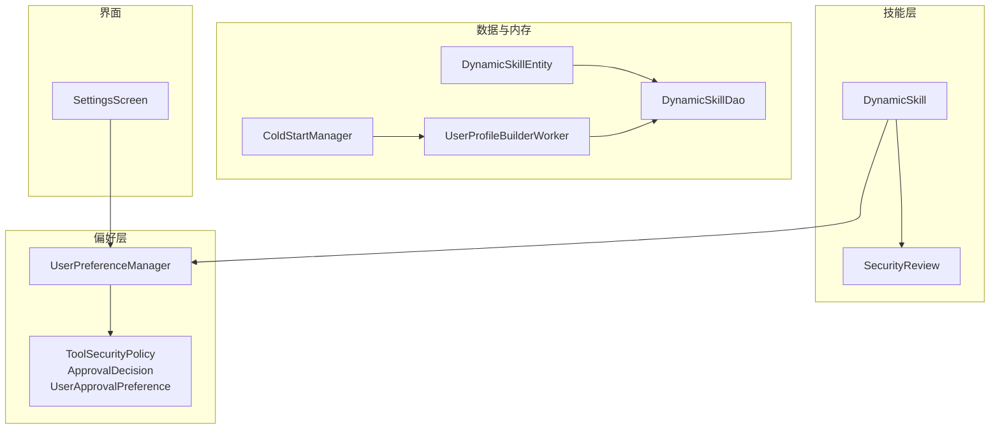
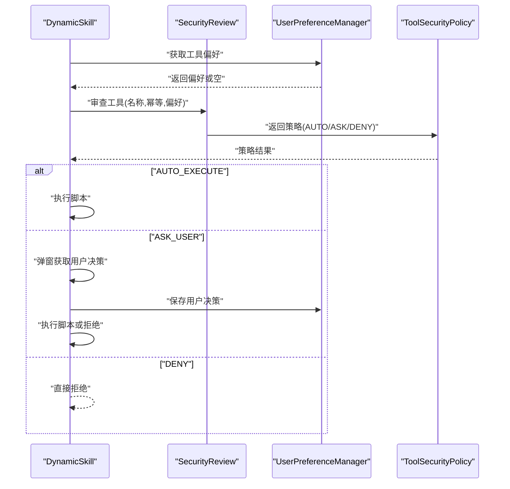
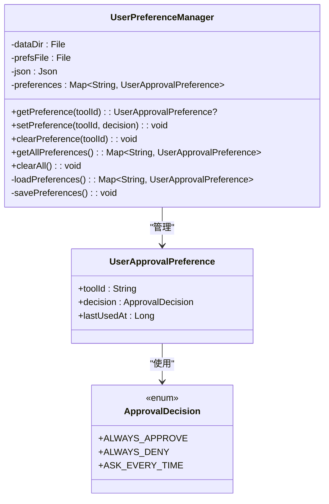
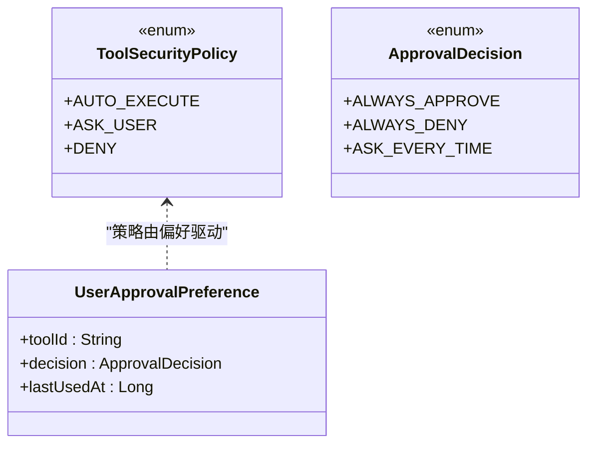
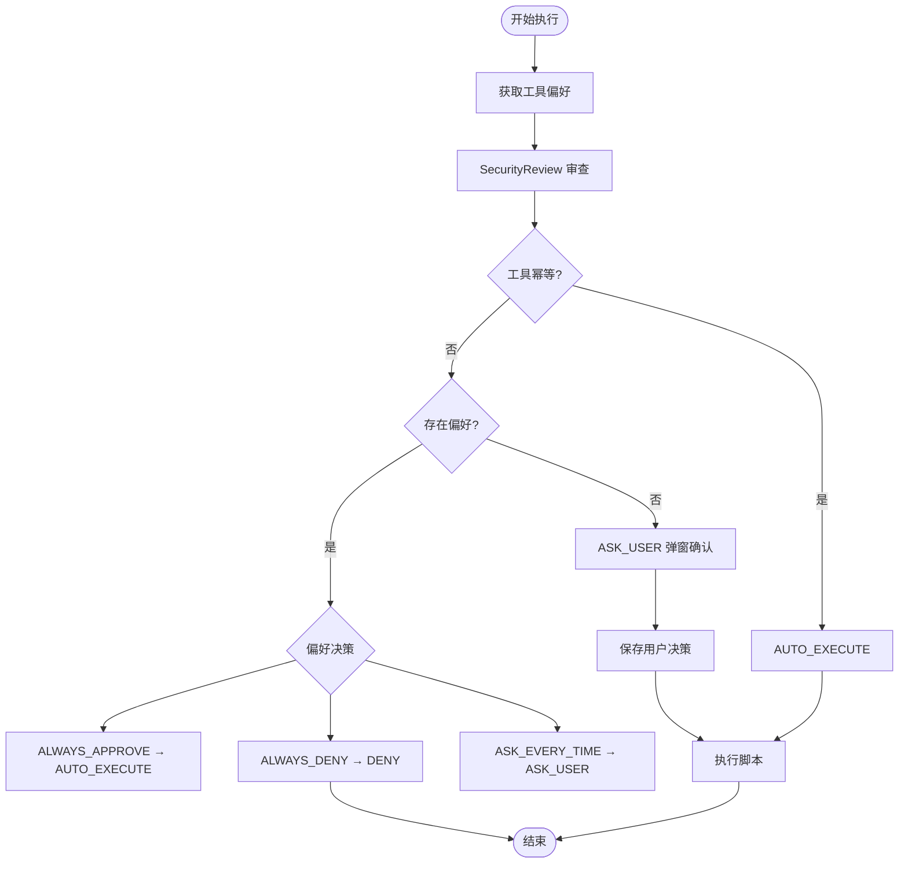
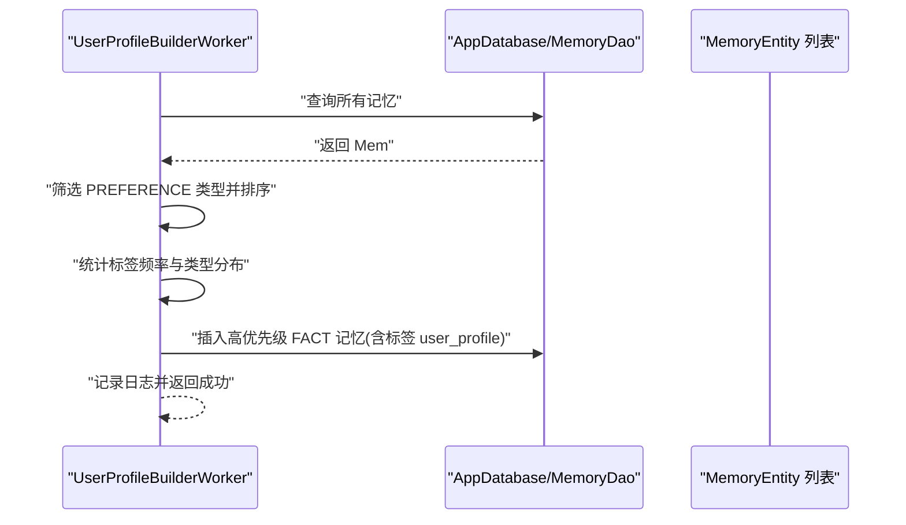
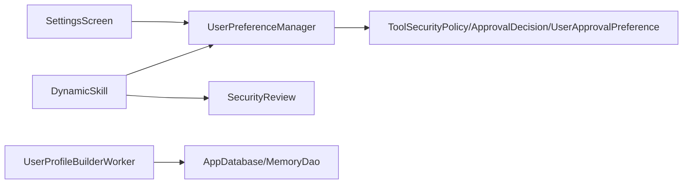
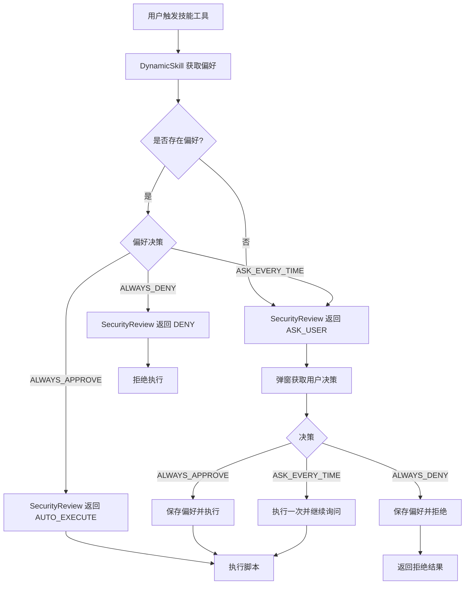

# 用户偏好管理

<cite>
**本文引用的文件**
- [UserPreferenceManager.kt](file://app/src/main/java/ai/openclaw/android/skill/UserPreferenceManager.kt)
- [ToolSecurityPolicy.kt](file://app/src/main/java/ai/openclaw/android/skill/ToolSecurityPolicy.kt)
- [DynamicSkill.kt](file://app/src/main/java/ai/openclaw/android/skill/DynamicSkill.kt)
- [UserPreferenceManagerTest.kt](file://app/src/test/java/ai/openclaw/android/skill/UserPreferenceManagerTest.kt)
- [SecurityReviewTest.kt](file://app/src/test/java/ai/openclaw/android/skill/SecurityReviewTest.kt)
- [UserProfileBuilderWorker.kt](file://app/src/main/java/ai/openclaw/android/domain/memory/UserProfileBuilderWorker.kt)
- [ColdStartManager.kt](file://app/src/main/java/ai/openclaw/android/domain/memory/ColdStartManager.kt)
- [SettingsScreen.kt](file://app/src/main/java/ai/openclaw/android/ui/SettingsScreen.kt)
- [DynamicSkillEntity.kt](file://app/src/main/java/ai/openclaw/android/data/model/DynamicSkillEntity.kt)
- [DynamicSkillDao.kt](file://app/src/main/java/ai/openclaw/android/data/local/DynamicSkillDao.kt)
</cite>

## 目录
1. [简介](#简介)
2. [项目结构](#项目结构)
3. [核心组件](#核心组件)
4. [架构总览](#架构总览)
5. [详细组件分析](#详细组件分析)
6. [依赖关系分析](#依赖关系分析)
7. [性能考量](#性能考量)
8. [故障排查指南](#故障排查指南)
9. [结论](#结论)
10. [附录](#附录)

## 简介
本文件面向开发者与产品团队，系统性阐述用户偏好管理子系统的设计与实现，重点覆盖以下方面：
- UserPreferenceManager 的设计架构与数据存储机制
- 用户偏好配置选项、个性化设置与技能偏好管理
- 偏好数据的持久化策略、缓存机制与同步更新
- 用户偏好对技能行为的影响与个性化定制
- 偏好配置流程图、数据存储结构与更新机制
- 偏好设置示例、配置模板与最佳实践
- 扩展建议、数据迁移与性能优化指导

## 项目结构
用户偏好管理涉及的核心模块与文件如下：
- 偏好管理器：UserPreferenceManager
- 安全策略与偏好模型：ToolSecurityPolicy
- 技能执行与安全审查：DynamicSkill、SecurityReview
- 用户画像与偏好关联：UserProfileBuilderWorker
- 冷启动与偏好影响：ColdStartManager
- 设置界面与偏好展示：SettingsScreen
- 动态技能实体与DAO（持久化动态技能及其偏好字段）：DynamicSkillEntity、DynamicSkillDao

**图表来源**
- [UserPreferenceManager.kt:1-99](file://app/src/main/java/ai/openclaw/android/skill/UserPreferenceManager.kt#L1-L99)
- [ToolSecurityPolicy.kt:1-72](file://app/src/main/java/ai/openclaw/android/skill/ToolSecurityPolicy.kt#L1-L72)
- [DynamicSkill.kt:140-221](file://app/src/main/java/ai/openclaw/android/skill/DynamicSkill.kt#L140-L221)
- [UserProfileBuilderWorker.kt:1-99](file://app/src/main/java/ai/openclaw/android/domain/memory/UserProfileBuilderWorker.kt#L1-L99)
- [ColdStartManager.kt:32-60](file://app/src/main/java/ai/openclaw/android/domain/memory/ColdStartManager.kt#L32-L60)
- [SettingsScreen.kt:1-200](file://app/src/main/java/ai/openclaw/android/ui/SettingsScreen.kt#L1-L200)
- [DynamicSkillEntity.kt:1-21](file://app/src/main/java/ai/openclaw/android/data/model/DynamicSkillEntity.kt#L1-L21)
- [DynamicSkillDao.kt:35-46](file://app/src/main/java/ai/openclaw/android/data/local/DynamicSkillDao.kt#L35-L46)

**章节来源**
- [UserPreferenceManager.kt:1-99](file://app/src/main/java/ai/openclaw/android/skill/UserPreferenceManager.kt#L1-L99)
- [ToolSecurityPolicy.kt:1-72](file://app/src/main/java/ai/openclaw/android/skill/ToolSecurityPolicy.kt#L1-L72)
- [DynamicSkill.kt:140-221](file://app/src/main/java/ai/openclaw/android/skill/DynamicSkill.kt#L140-L221)
- [UserProfileBuilderWorker.kt:1-99](file://app/src/main/java/ai/openclaw/android/domain/memory/UserProfileBuilderWorker.kt#L1-L99)
- [ColdStartManager.kt:32-60](file://app/src/main/java/ai/openclaw/android/domain/memory/ColdStartManager.kt#L32-L60)
- [SettingsScreen.kt:1-200](file://app/src/main/java/ai/openclaw/android/ui/SettingsScreen.kt#L1-L200)
- [DynamicSkillEntity.kt:1-21](file://app/src/main/java/ai/openclaw/android/data/model/DynamicSkillEntity.kt#L1-L21)
- [DynamicSkillDao.kt:35-46](file://app/src/main/java/ai/openclaw/android/data/local/DynamicSkillDao.kt#L35-L46)

## 核心组件
- UserPreferenceManager：负责用户审批偏好的加载、读取、写入与清理；采用 JSON 文件持久化，路径为应用数据目录下的 skill_approval_prefs.json。
- ToolSecurityPolicy/ApprovalDecision/UserApprovalPreference：定义安全策略枚举、用户决策枚举以及偏好数据模型。
- DynamicSkill：在执行前进行安全审查，依据偏好决定自动执行、弹窗确认或直接拒绝。
- SecurityReview：纯逻辑的安全审查器，根据工具是否幂等与用户偏好返回策略。
- UserProfileBuilderWorker：从记忆中提取偏好信息并生成用户画像记忆，用于后续个性化。
- ColdStartManager：冷启动模式控制，影响记忆与个性化行为。
- SettingsScreen：设置界面，用于展示与交互部分偏好与能力。
- DynamicSkillEntity/DynamicSkillDao：动态技能实体与DAO，支持动态技能的启用/禁用、最后使用时间与审批偏好字段。

**章节来源**
- [UserPreferenceManager.kt:1-99](file://app/src/main/java/ai/openclaw/android/skill/UserPreferenceManager.kt#L1-L99)
- [ToolSecurityPolicy.kt:1-72](file://app/src/main/java/ai/openclaw/android/skill/ToolSecurityPolicy.kt#L1-L72)
- [DynamicSkill.kt:140-221](file://app/src/main/java/ai/openclaw/android/skill/DynamicSkill.kt#L140-L221)
- [UserProfileBuilderWorker.kt:1-99](file://app/src/main/java/ai/openclaw/android/domain/memory/UserProfileBuilderWorker.kt#L1-L99)
- [ColdStartManager.kt:32-60](file://app/src/main/java/ai/openclaw/android/domain/memory/ColdStartManager.kt#L32-L60)
- [SettingsScreen.kt:1-200](file://app/src/main/java/ai/openclaw/android/ui/SettingsScreen.kt#L1-L200)
- [DynamicSkillEntity.kt:1-21](file://app/src/main/java/ai/openclaw/android/data/model/DynamicSkillEntity.kt#L1-L21)
- [DynamicSkillDao.kt:35-46](file://app/src/main/java/ai/openclaw/android/data/local/DynamicSkillDao.kt#L35-L46)

## 架构总览
用户偏好管理贯穿“策略判定—执行控制—持久化—可视化”的闭环：
- 策略判定：SecurityReview 基于工具幂等性与用户偏好返回策略。
- 执行控制：DynamicSkill 根据策略决定自动执行、弹窗确认或拒绝。
- 持久化：UserPreferenceManager 将偏好以 JSON 形式保存到文件。
- 可视化：SettingsScreen 展示与交互设置项。
- 个性化：UserProfileBuilderWorker 从记忆中提炼偏好，形成用户画像记忆。

**图表来源**
- [DynamicSkill.kt:140-221](file://app/src/main/java/ai/openclaw/android/skill/DynamicSkill.kt#L140-L221)
- [ToolSecurityPolicy.kt:41-71](file://app/src/main/java/ai/openclaw/android/skill/ToolSecurityPolicy.kt#L41-L71)
- [UserPreferenceManager.kt:1-99](file://app/src/main/java/ai/openclaw/android/skill/UserPreferenceManager.kt#L1-L99)

## 详细组件分析

### UserPreferenceManager 组件
- 设计要点
  - 使用 volatile 变量持有内存中的偏好映射，初始化时从 JSON 文件加载。
  - 提供按工具 ID 查询、设置、清除与清空全部偏好。
  - 采用 synchronized 保存方法，保证并发写入一致性。
  - JSON 解析忽略未知字段，便于未来字段演进。
- 数据存储
  - 文件名：skill_approval_prefs.json
  - 路径：dataDir/skill_approval_prefs.json
  - 结构：数组形式的 UserApprovalPreference 列表，按 toolId 建立索引。
- 生命周期
  - 构造函数支持 Context 或 File 目录两种方式。
  - 应用重启后通过 loadPreferences 重新加载。

**图表来源**
- [UserPreferenceManager.kt:1-99](file://app/src/main/java/ai/openclaw/android/skill/UserPreferenceManager.kt#L1-L99)
- [ToolSecurityPolicy.kt:18-39](file://app/src/main/java/ai/openclaw/android/skill/ToolSecurityPolicy.kt#L18-L39)

**章节来源**
- [UserPreferenceManager.kt:1-99](file://app/src/main/java/ai/openclaw/android/skill/UserPreferenceManager.kt#L1-L99)
- [UserPreferenceManagerTest.kt:1-97](file://app/src/test/java/ai/openclaw/android/skill/UserPreferenceManagerTest.kt#L1-L97)

### 安全策略与偏好模型
- ToolSecurityPolicy：AUTO_EXECUTE（幂等自动执行）、ASK_USER（首次或每次询问）、DENY（用户已拒绝）。
- ApprovalDecision：ALWAYS_APPROVE（总是允许）、ALWAYS_DENY（总是拒绝）、ASK_EVERY_TIME（每次都询问）。
- UserApprovalPreference：包含 toolId、decision、lastUsedAt 三个字段，序列化为 JSON。

**图表来源**
- [ToolSecurityPolicy.kt:1-72](file://app/src/main/java/ai/openclaw/android/skill/ToolSecurityPolicy.kt#L1-L72)

**章节来源**
- [ToolSecurityPolicy.kt:1-72](file://app/src/main/java/ai/openclaw/android/skill/ToolSecurityPolicy.kt#L1-L72)

### 动态技能执行与安全审查
- DynamicSkill 在执行前调用 SecurityReview.reviewTool，传入工具名称、幂等性与现有偏好。
- 根据策略分支：
  - AUTO_EXECUTE：直接执行脚本。
  - ASK_USER：弹窗获取用户决策，并将决策写回偏好管理器。
  - DENY：直接拒绝。
- 对幂等工具始终自动执行，降低误点风险。

**图表来源**
- [DynamicSkill.kt:140-221](file://app/src/main/java/ai/openclaw/android/skill/DynamicSkill.kt#L140-L221)
- [ToolSecurityPolicy.kt:41-71](file://app/src/main/java/ai/openclaw/android/skill/ToolSecurityPolicy.kt#L41-L71)

**章节来源**
- [DynamicSkill.kt:140-221](file://app/src/main/java/ai/openclaw/android/skill/DynamicSkill.kt#L140-L221)
- [SecurityReviewTest.kt:1-47](file://app/src/test/java/ai/openclaw/android/skill/SecurityReviewTest.kt#L1-L47)

### 用户画像与偏好关联
- UserProfileBuilderWorker 从数据库中读取记忆，统计 PREFERENCE 类型的记忆作为“偏好”，并生成用户画像记忆（FACT 类型，带标签 user_profile）。
- 该画像可用于后续个性化推荐与上下文增强。

**图表来源**
- [UserProfileBuilderWorker.kt:30-99](file://app/src/main/java/ai/openclaw/android/domain/memory/UserProfileBuilderWorker.kt#L30-L99)

**章节来源**
- [UserProfileBuilderWorker.kt:1-99](file://app/src/main/java/ai/openclaw/android/domain/memory/UserProfileBuilderWorker.kt#L1-L99)

### 冷启动与偏好影响
- ColdStartManager 通过 SharedPreferences 记录首次启动时间，计算当前内存模式（FULL 或 SENSORY_ONLY），并在剩余小时数归零后进入 FULL 模式。
- 冷启动模式会影响个性化与记忆构建策略，间接影响偏好对技能行为的影响强度。

**章节来源**
- [ColdStartManager.kt:32-60](file://app/src/main/java/ai/openclaw/android/domain/memory/ColdStartManager.kt#L32-L60)

### 设置界面与偏好展示
- SettingsScreen 提供设置项展示与交互入口，虽然不直接写偏好，但为用户提供了访问与理解偏好的界面。
- 偏好持久化由 UserPreferenceManager 负责，界面通过调用偏好管理器接口实现读写。

**章节来源**
- [SettingsScreen.kt:1-200](file://app/src/main/java/ai/openclaw/android/ui/SettingsScreen.kt#L1-L200)

### 动态技能实体与 DAO
- DynamicSkillEntity 支持 approvalPrefsJson 字段，用于持久化动态技能的审批偏好。
- DynamicSkillDao 提供更新 lastUsedAt、启用/禁用与删除等操作，便于技能生命周期管理。

**章节来源**
- [DynamicSkillEntity.kt:1-21](file://app/src/main/java/ai/openclaw/android/data/model/DynamicSkillEntity.kt#L1-L21)
- [DynamicSkillDao.kt:35-46](file://app/src/main/java/ai/openclaw/android/data/local/DynamicSkillDao.kt#L35-L46)

## 依赖关系分析
- UserPreferenceManager 依赖 ToolSecurityPolicy 中的枚举与模型，用于序列化/反序列化与策略判断。
- DynamicSkill 依赖 UserPreferenceManager 获取偏好，并依赖 SecurityReview 进行策略判定。
- UserProfileBuilderWorker 依赖 AppDatabase/MemoryDao 读取记忆，间接与偏好产生关联。
- SettingsScreen 与偏好管理器解耦，仅用于展示与交互。

**图表来源**
- [UserPreferenceManager.kt:1-99](file://app/src/main/java/ai/openclaw/android/skill/UserPreferenceManager.kt#L1-L99)
- [ToolSecurityPolicy.kt:1-72](file://app/src/main/java/ai/openclaw/android/skill/ToolSecurityPolicy.kt#L1-L72)
- [DynamicSkill.kt:140-221](file://app/src/main/java/ai/openclaw/android/skill/DynamicSkill.kt#L140-L221)
- [UserProfileBuilderWorker.kt:30-99](file://app/src/main/java/ai/openclaw/android/domain/memory/UserProfileBuilderWorker.kt#L30-L99)
- [SettingsScreen.kt:1-200](file://app/src/main/java/ai/openclaw/android/ui/SettingsScreen.kt#L1-L200)

**章节来源**
- [UserPreferenceManager.kt:1-99](file://app/src/main/java/ai/openclaw/android/skill/UserPreferenceManager.kt#L1-L99)
- [ToolSecurityPolicy.kt:1-72](file://app/src/main/java/ai/openclaw/android/skill/ToolSecurityPolicy.kt#L1-L72)
- [DynamicSkill.kt:140-221](file://app/src/main/java/ai/openclaw/android/skill/DynamicSkill.kt#L140-L221)
- [UserProfileBuilderWorker.kt:1-99](file://app/src/main/java/ai/openclaw/android/domain/memory/UserProfileBuilderWorker.kt#L1-L99)
- [SettingsScreen.kt:1-200](file://app/src/main/java/ai/openclaw/android/ui/SettingsScreen.kt#L1-L200)

## 性能考量
- I/O 模式
  - UserPreferenceManager 采用同步保存方法，写入为单线程串行，避免竞态；在高频写入场景下可能成为瓶颈，建议在上层聚合批量写入或引入异步队列。
- JSON 解析
  - 使用 Kotlinx Serialization，忽略未知字段提升兼容性；偏好列表规模通常较小，解析开销可接受。
- 缓存策略
  - preferences 为 volatile Map，读多写少场景下可满足需求；若写入频繁，建议引入读写锁或分层缓存（内存+延迟落盘）。
- 冷启动与个性化
  - ColdStartManager 控制内存模式，减少冷启动期的复杂个性化，有助于稳定首帧体验。

[本节为通用性能讨论，无需特定文件引用]

## 故障排查指南
- 偏好文件损坏
  - 现象：偏好无法加载或为空。
  - 排查：检查 skill_approval_prefs.json 是否存在且格式正确；UserPreferenceManager 的 loadPreferences 捕获异常并回退为空集。
- 写入失败
  - 现象：偏好变更未生效。
  - 排查：确认 savePreferences 是否抛出异常；确保 dataDir 可写；在测试环境中验证 JVM 日志输出。
- 安全策略不符合预期
  - 现象：幂等工具仍弹窗或非幂等工具被自动执行。
  - 排查：核对工具定义的 isIdempotent 标记与 SecurityReview 的策略分支；参考单元测试用例验证行为。
- 偏好持久化跨实例
  - 现象：应用重启后偏好丢失。
  - 排查：确认构造函数使用 Context 或自定义 dataDir；测试用例验证文件存在与内容恢复。

**章节来源**
- [UserPreferenceManager.kt:67-93](file://app/src/main/java/ai/openclaw/android/skill/UserPreferenceManager.kt#L67-L93)
- [UserPreferenceManagerTest.kt:82-97](file://app/src/test/java/ai/openclaw/android/skill/UserPreferenceManagerTest.kt#L82-L97)
- [SecurityReviewTest.kt:1-47](file://app/src/test/java/ai/openclaw/android/skill/SecurityReviewTest.kt#L1-L47)

## 结论
用户偏好管理通过“策略判定—执行控制—持久化—可视化”的闭环，实现了对动态技能的细粒度控制与个性化定制。UserPreferenceManager 以轻量 JSON 文件存储偏好，结合 SecurityReview 的纯逻辑策略，既保证了安全性，又兼顾了易用性。配合用户画像构建与冷启动控制，系统在不同阶段提供合适的个性化体验。

[本节为总结性内容，无需特定文件引用]

## 附录

### 偏好配置流程图

**图表来源**
- [DynamicSkill.kt:140-221](file://app/src/main/java/ai/openclaw/android/skill/DynamicSkill.kt#L140-L221)
- [ToolSecurityPolicy.kt:41-71](file://app/src/main/java/ai/openclaw/android/skill/ToolSecurityPolicy.kt#L41-L71)

### 数据存储结构
- 偏好文件：skill_approval_prefs.json
  - 结构：数组，元素为 UserApprovalPreference
  - 字段：toolId、decision、lastUsedAt
- 动态技能实体：DynamicSkillEntity
  - 字段：approvalPrefsJson（持久化审批偏好）

**章节来源**
- [UserPreferenceManager.kt:67-93](file://app/src/main/java/ai/openclaw/android/skill/UserPreferenceManager.kt#L67-L93)
- [ToolSecurityPolicy.kt:27-39](file://app/src/main/java/ai/openclaw/android/skill/ToolSecurityPolicy.kt#L27-L39)
- [DynamicSkillEntity.kt:1-21](file://app/src/main/java/ai/openclaw/android/data/model/DynamicSkillEntity.kt#L1-L21)

### 更新机制
- 加载：应用启动或首次访问时从 JSON 文件读取并建立内存映射。
- 写入：每次 setPreference 后同步保存至 JSON 文件。
- 清理：支持按工具清理与一键清空，均触发保存。
- 并发：保存方法加 synchronized，确保线程安全。

**章节来源**
- [UserPreferenceManager.kt:67-93](file://app/src/main/java/ai/openclaw/android/skill/UserPreferenceManager.kt#L67-L93)

### 偏好设置示例与配置模板
- 示例场景
  - 幂等工具（如查询天气）：建议 ALWAYS_APPROVE，提升体验。
  - 非幂等工具（如设置提醒）：建议 ASK_EVERY_TIME 或首次 ALWAYS_APPROVE，后续根据使用情况调整。
- 配置模板（JSON）
  - 偏好条目模板：包含 toolId、decision、lastUsedAt。
  - 动态技能模板：包含 id、name、description、version、instructions、script、tools、permissions、createdAt、lastUsedAt、enabled、approvalPrefsJson。

**章节来源**
- [ToolSecurityPolicy.kt:18-39](file://app/src/main/java/ai/openclaw/android/skill/ToolSecurityPolicy.kt#L18-L39)
- [DynamicSkillEntity.kt:1-21](file://app/src/main/java/ai/openclaw/android/data/model/DynamicSkillEntity.kt#L1-L21)

### 最佳实践
- 将幂等工具默认设为 ALWAYS_APPROVE，非幂等工具默认设为 ASK_EVERY_TIME。
- 在用户首次交互后，根据使用频率与错误率引导用户调整偏好。
- 对关键敏感操作（如联网/文件系统）保持谨慎，默认拒绝并引导用户确认。
- 定期清理过期偏好，避免历史偏差影响体验。

[本节为通用最佳实践，无需特定文件引用]

### 扩展与迁移建议
- 扩展
  - 新增偏好维度：在 UserApprovalPreference 中增加字段，并在 JSON 解析中兼容旧版本。
  - 引入异步保存：在高频写入场景下，将保存动作异步化并合并写入。
  - 多用户支持：为每个用户维护独立偏好文件或命名空间。
- 迁移
  - 从旧格式迁移到新格式时，保留 ignoreUnknownKeys 以兼容旧字段。
  - 迁移完成后，提供一次性转换脚本或启动时迁移逻辑，确保平滑过渡。
- 性能优化
  - 读写分离：热点偏好放入内存缓存，定期批量落盘。
  - 增量更新：仅在偏好变化时触发保存，避免频繁 I/O。

[本节为通用优化建议，无需特定文件引用]