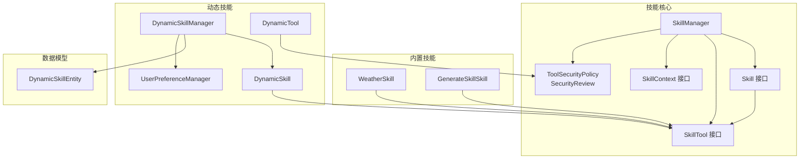
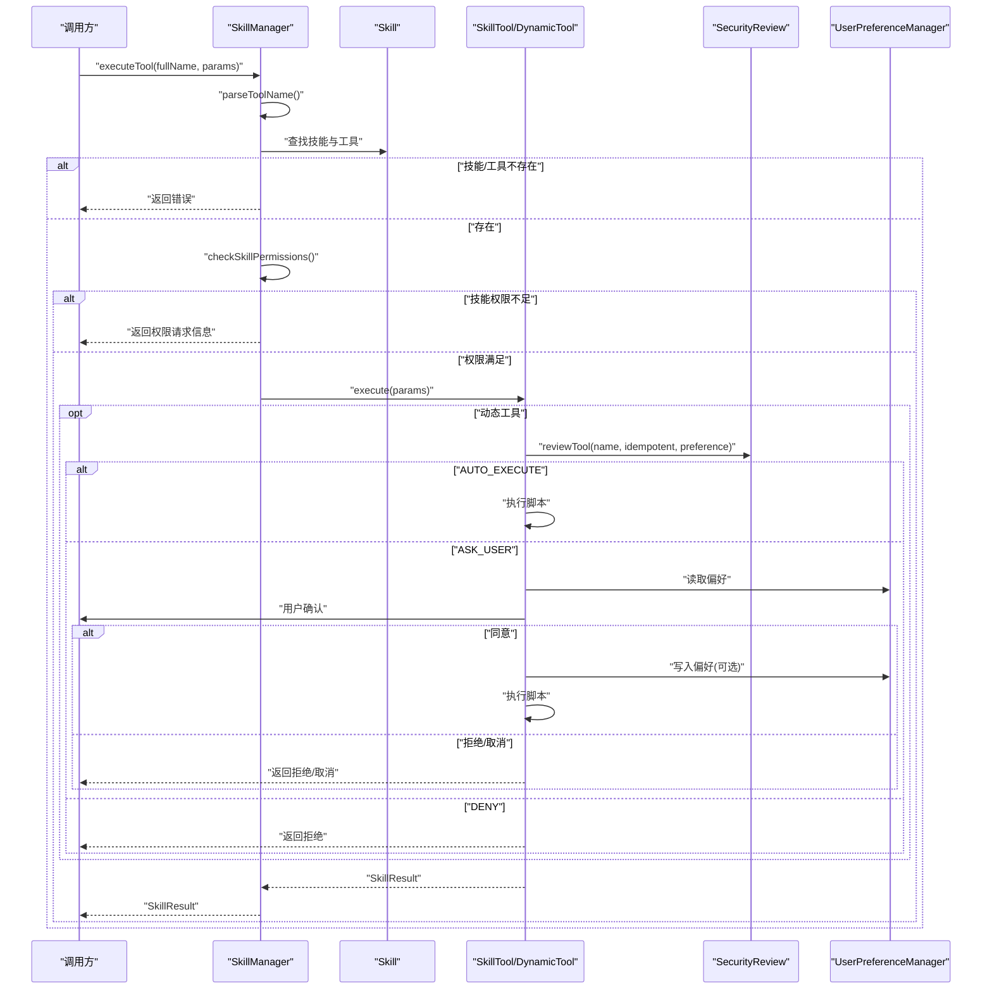
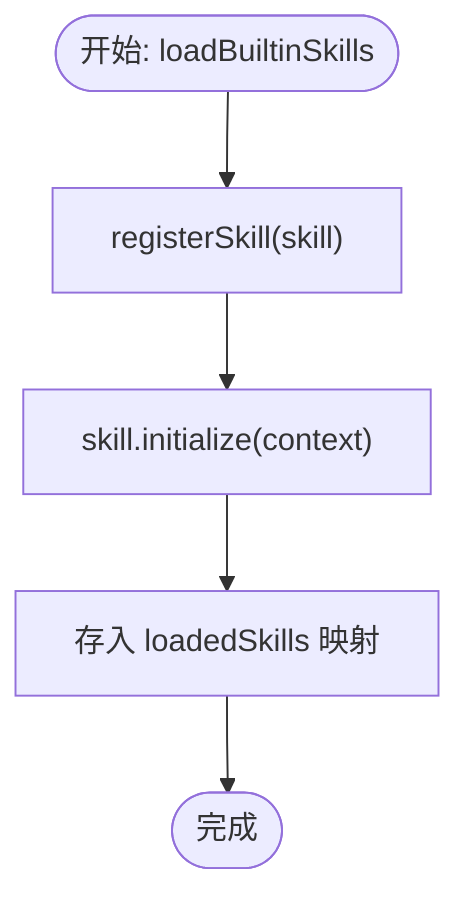
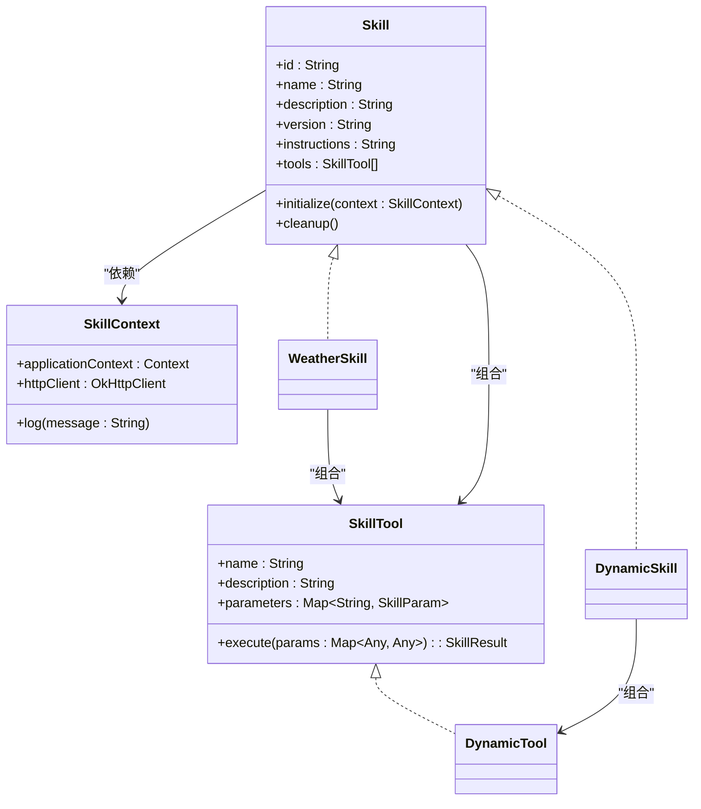
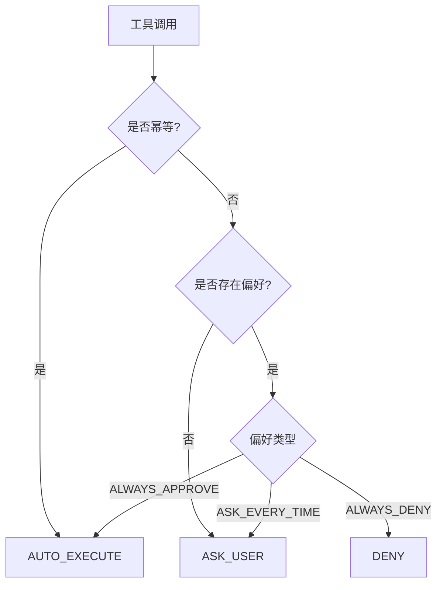
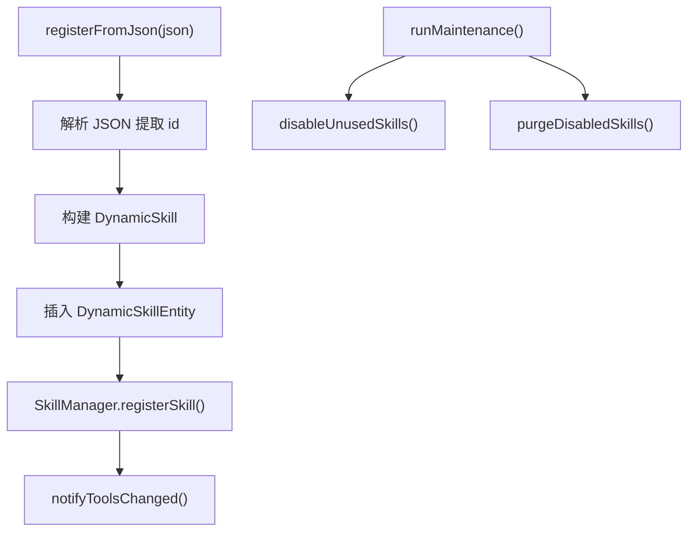
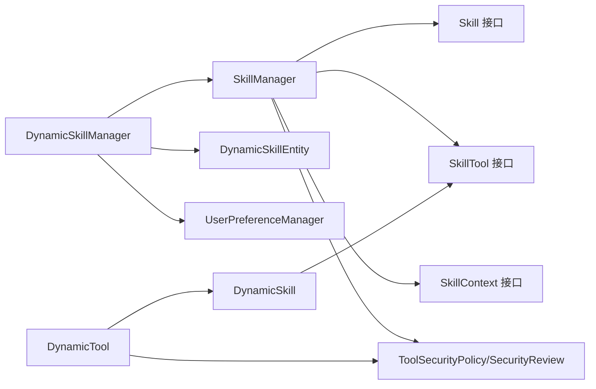
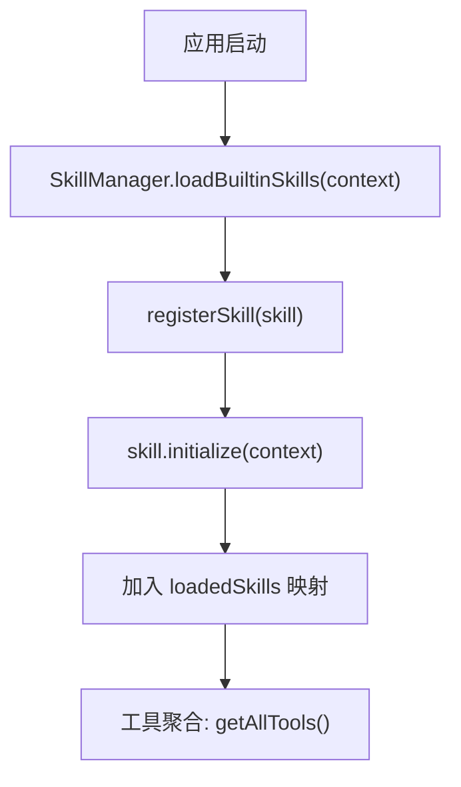
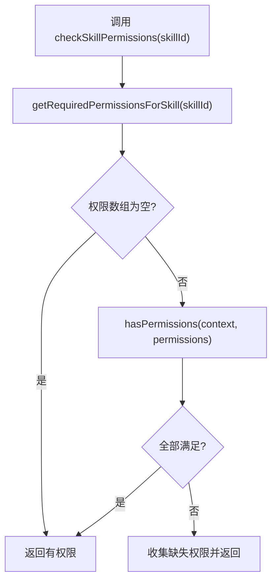
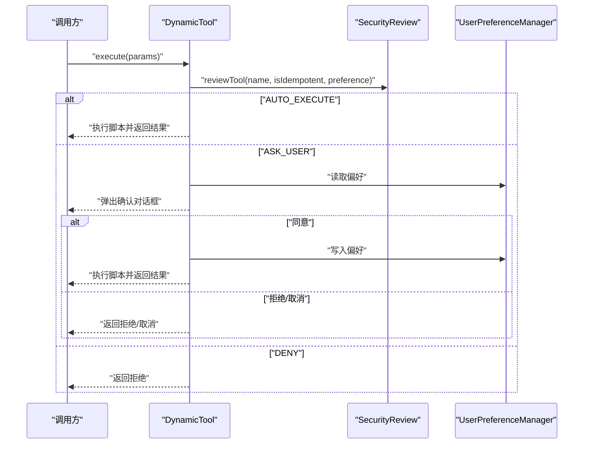

# 静态技能管理

<cite>
**本文引用的文件**
- [SkillManager.kt](file://app/src/main/java/ai/openclaw/android/skill/SkillManager.kt)
- [Skill.kt](file://app/src/main/java/ai/openclaw/android/skill/Skill.kt)
- [SkillContext.kt](file://app/src/main/java/ai/openclaw/android/skill/SkillContext.kt)
- [SkillTool.kt](file://app/src/main/java/ai/openclaw/android/skill/SkillTool.kt)
- [ToolSecurityPolicy.kt](file://app/src/main/java/ai/openclaw/android/skill/ToolSecurityPolicy.kt)
- [DynamicSkillManager.kt](file://app/src/main/java/ai/openclaw/android/skill/DynamicSkillManager.kt)
- [DynamicSkill.kt](file://app/src/main/java/ai/openclaw/android/skill/DynamicSkill.kt)
- [UserPreferenceManager.kt](file://app/src/main/java/ai/openclaw/android/skill/UserPreferenceManager.kt)
- [WeatherSkill.kt](file://app/src/main/java/ai/openclaw/android/skill/builtin/WeatherSkill.kt)
- [GenerateSkillSkill.kt](file://app/src/main/java/ai/openclaw/android/skill/builtin/GenerateSkillSkill.kt)
- [DynamicSkillEntity.kt](file://app/src/main/java/ai/openclaw/android/data/model/DynamicSkillEntity.kt)
- [SkillManagerTest.kt](file://app/src/test/java/ai/openclaw/android/skill/SkillManagerTest.kt)
- [SecurityReviewTest.kt](file://app/src/test/java/ai/openclaw/android/skill/SecurityReviewTest.kt)
</cite>

## 目录
1. [简介](#简介)
2. [项目结构](#项目结构)
3. [核心组件](#核心组件)
4. [架构总览](#架构总览)
5. [详细组件分析](#详细组件分析)
6. [依赖关系分析](#依赖关系分析)
7. [性能考虑](#性能考虑)
8. [故障排查指南](#故障排查指南)
9. [结论](#结论)
10. [附录](#附录)

## 简介
本文件面向开发者与集成者，系统性阐述静态技能管理系统的架构与实现细节，重点覆盖以下主题：
- SkillManager 的核心职责：技能注册、生命周期管理、工具发现与执行、权限检查与控制
- Skill 接口的设计模式与实现要求，SkillContext 的上下文数据传递机制
- 工具安全策略与权限控制体系：安全审查、权限映射、权限验证策略
- 技能加载流程、权限检查流程与工具执行流程的可视化说明
- 技能开发模板、权限配置示例与性能优化建议
- 错误处理与调试要点

## 项目结构
静态技能管理位于应用模块的 skill 包下，采用“接口 + 实现 + 上下文 + 安全策略”的分层组织方式；同时提供动态技能扩展能力，通过 DynamicSkillManager 与 DynamicSkill 支持运行时注册与持久化。

图表来源
- [SkillManager.kt:1-193](file://app/src/main/java/ai/openclaw/android/skill/SkillManager.kt#L1-L193)
- [Skill.kt:1-13](file://app/src/main/java/ai/openclaw/android/skill/Skill.kt#L1-L13)
- [SkillTool.kt:1-22](file://app/src/main/java/ai/openclaw/android/skill/SkillTool.kt#L1-L22)
- [ToolSecurityPolicy.kt:1-72](file://app/src/main/java/ai/openclaw/android/skill/ToolSecurityPolicy.kt#L1-L72)
- [DynamicSkillManager.kt:1-202](file://app/src/main/java/ai/openclaw/android/skill/DynamicSkillManager.kt#L1-L202)
- [DynamicSkill.kt:1-221](file://app/src/main/java/ai/openclaw/android/skill/DynamicSkill.kt#L1-L221)
- [UserPreferenceManager.kt:1-100](file://app/src/main/java/ai/openclaw/android/skill/UserPreferenceManager.kt#L1-L100)
- [DynamicSkillEntity.kt:1-22](file://app/src/main/java/ai/openclaw/android/data/model/DynamicSkillEntity.kt#L1-L22)
- [WeatherSkill.kt:1-399](file://app/src/main/java/ai/openclaw/android/skill/builtin/WeatherSkill.kt#L1-L399)
- [GenerateSkillSkill.kt:1-27](file://app/src/main/java/ai/openclaw/android/skill/builtin/GenerateSkillSkill.kt#L1-L27)

章节来源
- [SkillManager.kt:1-193](file://app/src/main/java/ai/openclaw/android/skill/SkillManager.kt#L1-L193)
- [DynamicSkillManager.kt:1-202](file://app/src/main/java/ai/openclaw/android/skill/DynamicSkillManager.kt#L1-L202)

## 核心组件
- Skill 接口：定义技能标识、元信息、工具集合与生命周期钩子，确保统一的初始化与清理流程。
- SkillTool 接口：定义工具名称、参数规范与异步执行接口，屏蔽底层实现差异。
- SkillContext 接口：提供应用上下文、HTTP 客户端与日志能力，作为技能注入的基础设施。
- SkillManager：负责内置技能注册、工具聚合、工具执行与权限检查；提供技能卸载与统计查询。
- ToolSecurityPolicy 与 SecurityReview：定义工具安全策略枚举与审查逻辑，结合用户偏好进行自动化或交互式决策。
- DynamicSkillManager：负责动态技能的运行时注册、持久化、生命周期维护（停用/清理）、手动启停与使用记录。
- DynamicSkill/DynamicTool：将 JSON 定义的工具路由到脚本引擎执行，内置安全策略与用户确认流程。
- UserPreferenceManager：以本地 JSON 文件存储用户审批偏好，支持增删改查与批量清空。
- 内置技能示例：WeatherSkill 展示网络请求与卡片输出；GenerateSkillSkill 展示动态技能生成入口。

章节来源
- [Skill.kt:1-13](file://app/src/main/java/ai/openclaw/android/skill/Skill.kt#L1-L13)
- [SkillTool.kt:1-22](file://app/src/main/java/ai/openclaw/android/skill/SkillTool.kt#L1-L22)
- [SkillContext.kt:1-10](file://app/src/main/java/ai/openclaw/android/skill/SkillContext.kt#L1-L10)
- [SkillManager.kt:1-193](file://app/src/main/java/ai/openclaw/android/skill/SkillManager.kt#L1-L193)
- [ToolSecurityPolicy.kt:1-72](file://app/src/main/java/ai/openclaw/android/skill/ToolSecurityPolicy.kt#L1-L72)
- [DynamicSkillManager.kt:1-202](file://app/src/main/java/ai/openclaw/android/skill/DynamicSkillManager.kt#L1-L202)
- [DynamicSkill.kt:1-221](file://app/src/main/java/ai/openclaw/android/skill/DynamicSkill.kt#L1-L221)
- [UserPreferenceManager.kt:1-100](file://app/src/main/java/ai/openclaw/android/skill/UserPreferenceManager.kt#L1-L100)
- [WeatherSkill.kt:1-399](file://app/src/main/java/ai/openclaw/android/skill/builtin/WeatherSkill.kt#L1-L399)
- [GenerateSkillSkill.kt:1-27](file://app/src/main/java/ai/openclaw/android/skill/builtin/GenerateSkillSkill.kt#L1-L27)

## 架构总览
静态技能管理采用“统一入口 + 可插拔实现 + 安全策略 + 动态扩展”的架构：
- 统一入口：SkillManager 负责技能注册、工具聚合与执行调度
- 可插拔实现：内置技能与动态技能均实现 Skill/SkillTool 接口，保持一致的调用契约
- 安全策略：通过 ToolSecurityPolicy 与 SecurityReview 对非幂等操作进行用户确认
- 动态扩展：DynamicSkillManager 负责动态技能的持久化、生命周期与启停控制

图表来源
- [SkillManager.kt:62-83](file://app/src/main/java/ai/openclaw/android/skill/SkillManager.kt#L62-L83)
- [DynamicSkill.kt:153-193](file://app/src/main/java/ai/openclaw/android/skill/DynamicSkill.kt#L153-L193)
- [ToolSecurityPolicy.kt:44-71](file://app/src/main/java/ai/openclaw/android/skill/ToolSecurityPolicy.kt#L44-L71)
- [UserPreferenceManager.kt:16-100](file://app/src/main/java/ai/openclaw/android/skill/UserPreferenceManager.kt#L16-L100)

## 详细组件分析

### SkillManager：技能注册、生命周期与工具发现
- 技能注册机制
  - 内置技能注册：通过 loadBuiltinSkills() 统一注册，内部调用 registerSkill() 完成初始化与登记
  - 注册流程：调用技能 initialize(context)，将 SkillContext 注入，随后存入内存映射表
- 生命周期管理
  - 提供 getLoadedSkills()/getSkillCount() 查询已加载技能
  - 提供 unregisterSkill(skillId) 卸载技能并调用 cleanup()
- 工具发现与命名空间
  - getAllTools() 将技能 ID 与工具名拼接为 “skillId_toolName”，便于全局唯一识别
  - executeTool(fullName, params) 解析工具名，匹配技能与工具，再执行
- 权限控制
  - checkSkillPermissions(skillId) 基于内置映射判断所需权限
  - hasPermissions(context, permissions) 统一校验 Android 权限
- 上下文注入
  - createSkillContext() 提供应用上下文、OkHttp 客户端与日志能力

图表来源
- [SkillManager.kt:13-48](file://app/src/main/java/ai/openclaw/android/skill/SkillManager.kt#L13-L48)

章节来源
- [SkillManager.kt:1-193](file://app/src/main/java/ai/openclaw/android/skill/SkillManager.kt#L1-L193)

### Skill 接口与实现要求
- 设计要点
  - 统一的元信息字段：id/name/description/version/instructions
  - tools 列表承载具体能力
  - initialize(context)/cleanup() 生命周期钩子
- 实现要求
  - 在 initialize 中完成资源绑定（如网络客户端、系统服务）
  - 在 cleanup 中释放资源，避免泄漏
  - 工具参数通过 SkillParam 描述，保证调用方参数校验与提示

图表来源
- [Skill.kt:1-13](file://app/src/main/java/ai/openclaw/android/skill/Skill.kt#L1-L13)
- [SkillTool.kt:1-22](file://app/src/main/java/ai/openclaw/android/skill/SkillTool.kt#L1-L22)
- [SkillContext.kt:1-10](file://app/src/main/java/ai/openclaw/android/skill/SkillContext.kt#L1-L10)
- [WeatherSkill.kt:11-399](file://app/src/main/java/ai/openclaw/android/skill/builtin/WeatherSkill.kt#L11-L399)
- [DynamicSkill.kt:22-109](file://app/src/main/java/ai/openclaw/android/skill/DynamicSkill.kt#L22-L109)

章节来源
- [Skill.kt:1-13](file://app/src/main/java/ai/openclaw/android/skill/Skill.kt#L1-L13)
- [SkillTool.kt:1-22](file://app/src/main/java/ai/openclaw/android/skill/SkillTool.kt#L1-L22)
- [SkillContext.kt:1-10](file://app/src/main/java/ai/openclaw/android/skill/SkillContext.kt#L1-L10)
- [WeatherSkill.kt:1-399](file://app/src/main/java/ai/openclaw/android/skill/builtin/WeatherSkill.kt#L1-L399)
- [DynamicSkill.kt:1-221](file://app/src/main/java/ai/openclaw/android/skill/DynamicSkill.kt#L1-L221)

### SkillContext：上下文数据传递机制
- 提供应用级 Context 与 OkHttpClient，供技能内工具发起网络请求与访问系统资源
- 提供 log(message) 方法，统一日志输出，便于调试与审计

章节来源
- [SkillContext.kt:1-10](file://app/src/main/java/ai/openclaw/android/skill/SkillContext.kt#L1-L10)
- [SkillManager.kt:165-173](file://app/src/main/java/ai/openclaw/android/skill/SkillManager.kt#L165-L173)

### 工具安全策略与权限控制系统
- 安全策略
  - AUTO_EXECUTE：幂等操作自动执行
  - ASK_USER：首次或按偏好需要用户确认
  - DENY：用户已拒绝，禁止执行
- 用户偏好
  - ALWAYS_APPROVE/ALWAYS_DENY/ASK_EVERY_TIME
  - UserPreferenceManager 以 JSON 文件持久化偏好
- 权限控制
  - 内置权限映射：日历、位置、通讯录、短信等
  - 运行时权限检查：统一通过 ContextCompat 校验
  - 动态技能权限：由 DynamicSkillManager 与 DynamicSkillEntity 持久化管理

图表来源
- [ToolSecurityPolicy.kt:44-71](file://app/src/main/java/ai/openclaw/android/skill/ToolSecurityPolicy.kt#L44-L71)
- [UserPreferenceManager.kt:16-100](file://app/src/main/java/ai/openclaw/android/skill/UserPreferenceManager.kt#L16-L100)

章节来源
- [ToolSecurityPolicy.kt:1-72](file://app/src/main/java/ai/openclaw/android/skill/ToolSecurityPolicy.kt#L1-L72)
- [UserPreferenceManager.kt:1-100](file://app/src/main/java/ai/openclaw/android/skill/UserPreferenceManager.kt#L1-L100)
- [SkillManager.kt:89-107](file://app/src/main/java/ai/openclaw/android/skill/SkillManager.kt#L89-L107)

### 动态技能管理：注册、生命周期与维护
- 注册与持久化
  - registerFromJson(json)：解析 JSON、持久化到数据库、运行时注册到 SkillManager
- 生命周期维护
  - disableUnusedSkills()：30 天未使用停用
  - purgeDisabledSkills()：90 天已停用删除
- 手动启停与删除
  - enableSkill/disableSkill/removeSkill
- 使用记录
  - recordUsage 更新 lastUsedAt，配合维护任务进行停用/清理

图表来源
- [DynamicSkillManager.kt:63-116](file://app/src/main/java/ai/openclaw/android/skill/DynamicSkillManager.kt#L63-L116)
- [DynamicSkillManager.kt:122-147](file://app/src/main/java/ai/openclaw/android/skill/DynamicSkillManager.kt#L122-L147)

章节来源
- [DynamicSkillManager.kt:1-202](file://app/src/main/java/ai/openclaw/android/skill/DynamicSkillManager.kt#L1-L202)
- [DynamicSkillEntity.kt:1-22](file://app/src/main/java/ai/openclaw/android/data/model/DynamicSkillEntity.kt#L1-L22)

### 内置技能示例：WeatherSkill
- 工具：get_weather，支持中文/英文城市名，双数据源回退
- 初始化：通过 SkillContext 注入 OkHttpClient
- 输出：标准化 A2UI 卡片 JSON，便于前端渲染

章节来源
- [WeatherSkill.kt:1-399](file://app/src/main/java/ai/openclaw/android/skill/builtin/WeatherSkill.kt#L1-L399)

### 动态技能示例：GenerateSkillSkill
- 工具：generate_skill，用于生成并注册新的动态技能
- 与 DynamicSkillManager 协作，完成运行时注册与持久化

章节来源
- [GenerateSkillSkill.kt:1-27](file://app/src/main/java/ai/openclaw/android/skill/builtin/GenerateSkillSkill.kt#L1-L27)
- [DynamicSkillManager.kt:63-96](file://app/src/main/java/ai/openclaw/android/skill/DynamicSkillManager.kt#L63-L96)

## 依赖关系分析
- 组件耦合
  - SkillManager 依赖 Skill/SkillTool/SkillContext/ToolSecurityPolicy
  - DynamicSkillManager 依赖 SkillManager、DynamicSkillDao、ScriptOrchestrator、UserPreferenceManager
  - DynamicSkill/DynamicTool 依赖 ScriptOrchestrator 与安全策略
- 外部依赖
  - Android 权限系统（ContextCompat.checkSelfPermission）
  - OkHttp 客户端（网络请求）
  - Room 数据库（动态技能持久化）

图表来源
- [SkillManager.kt:1-193](file://app/src/main/java/ai/openclaw/android/skill/SkillManager.kt#L1-L193)
- [DynamicSkillManager.kt:1-202](file://app/src/main/java/ai/openclaw/android/skill/DynamicSkillManager.kt#L1-L202)
- [DynamicSkill.kt:1-221](file://app/src/main/java/ai/openclaw/android/skill/DynamicSkill.kt#L1-L221)
- [DynamicSkillEntity.kt:1-22](file://app/src/main/java/ai/openclaw/android/data/model/DynamicSkillEntity.kt#L1-L22)
- [ToolSecurityPolicy.kt:1-72](file://app/src/main/java/ai/openclaw/android/skill/ToolSecurityPolicy.kt#L1-L72)

章节来源
- [SkillManager.kt:1-193](file://app/src/main/java/ai/openclaw/android/skill/SkillManager.kt#L1-L193)
- [DynamicSkillManager.kt:1-202](file://app/src/main/java/ai/openclaw/android/skill/DynamicSkillManager.kt#L1-L202)

## 性能考虑
- 工具命名解析
  - 优先按最长技能 ID 前缀匹配，避免短 ID 冲突导致的误判
- 权限检查
  - 使用 ContextCompat 批量检查，减少重复 I/O
- 动态技能维护
  - 定期任务（disableUnusedSkills/purgeDisabledSkills）降低无效技能占用
- 日志与网络
  - 仅在必要时输出详细日志；网络请求复用 OkHttpClient，避免频繁创建连接

## 故障排查指南
- 工具未找到
  - 检查工具名是否遵循 “skillId_toolName” 命名规范
  - 确认技能已通过 SkillManager.registerSkill() 注册
- 权限不足
  - 使用 getSkillRequiredPermissions(skillId) 获取所需权限
  - 通过 checkSkillPermissions(skillId) 检查当前权限状态
- 动态技能异常
  - registerFromJson() 返回失败时，检查 JSON 结构与必填字段
  - 使用 runMaintenance() 触发停用/清理，观察日志输出
- 安全策略问题
  - 确认工具 isIdempotent 标记正确
  - 检查 UserPreferenceManager 的偏好文件是否损坏

章节来源
- [SkillManagerTest.kt:114-147](file://app/src/test/java/ai/openclaw/android/skill/SkillManagerTest.kt#L114-L147)
- [SkillManagerTest.kt:177-222](file://app/src/test/java/ai/openclaw/android/skill/SkillManagerTest.kt#L177-L222)
- [SecurityReviewTest.kt:1-48](file://app/src/test/java/ai/openclaw/android/skill/SecurityReviewTest.kt#L1-L48)

## 结论
静态技能管理系统通过清晰的接口抽象、统一的上下文注入与严格的安全策略，实现了内置与动态技能的一致管理。SkillManager 提供了稳定的注册、发现与执行通道；DynamicSkillManager 则在运行时提供了灵活的扩展能力与生命周期治理。配合完善的权限控制与用户偏好机制，系统在安全性与可用性之间取得了良好平衡。

## 附录

### 技能开发模板
- 新建技能类，实现 Skill 接口
  - 在 initialize(context) 中绑定上下文资源（如网络客户端）
  - 在 cleanup() 中释放资源
  - 在 tools 中声明工具列表
- 新建工具类，实现 SkillTool 接口
  - 定义参数规范（SkillParam），标注类型、描述、是否必填与默认值
  - 在 execute(params) 中实现业务逻辑，返回 SkillResult
- 如需网络请求，使用 context.httpClient 发起请求
- 如需权限，通过 getRequiredPermissionsForSkill(skillId) 返回所需权限数组

章节来源
- [Skill.kt:1-13](file://app/src/main/java/ai/openclaw/android/skill/Skill.kt#L1-L13)
- [SkillTool.kt:1-22](file://app/src/main/java/ai/openclaw/android/skill/SkillTool.kt#L1-L22)
- [SkillContext.kt:1-10](file://app/src/main/java/ai/openclaw/android/skill/SkillContext.kt#L1-L10)
- [SkillManager.kt:119-138](file://app/src/main/java/ai/openclaw/android/skill/SkillManager.kt#L119-L138)

### 权限配置示例
- 内置权限映射
  - 日历：读取/写入日历
  - 位置：精确/粗略定位
  - 通讯录：读取联系人
  - 短信：发送/读取短信
- 动态技能权限
  - 通过 DynamicSkillEntity.permissions 字段持久化权限字符串
  - 在 DynamicSkillManager 中进行加载与维护

章节来源
- [SkillManager.kt:119-138](file://app/src/main/java/ai/openclaw/android/skill/SkillManager.kt#L119-L138)
- [DynamicSkillEntity.kt:1-22](file://app/src/main/java/ai/openclaw/android/data/model/DynamicSkillEntity.kt#L1-L22)

### 技能加载流程图

图表来源
- [SkillManager.kt:13-48](file://app/src/main/java/ai/openclaw/android/skill/SkillManager.kt#L13-L48)

### 权限检查流程图

图表来源
- [SkillManager.kt:89-107](file://app/src/main/java/ai/openclaw/android/skill/SkillManager.kt#L89-L107)
- [SkillManager.kt:119-147](file://app/src/main/java/ai/openclaw/android/skill/SkillManager.kt#L119-L147)

### 工具执行流程（含安全策略）

图表来源
- [DynamicSkill.kt:153-193](file://app/src/main/java/ai/openclaw/android/skill/DynamicSkill.kt#L153-L193)
- [ToolSecurityPolicy.kt:44-71](file://app/src/main/java/ai/openclaw/android/skill/ToolSecurityPolicy.kt#L44-L71)
- [UserPreferenceManager.kt:16-100](file://app/src/main/java/ai/openclaw/android/skill/UserPreferenceManager.kt#L16-L100)