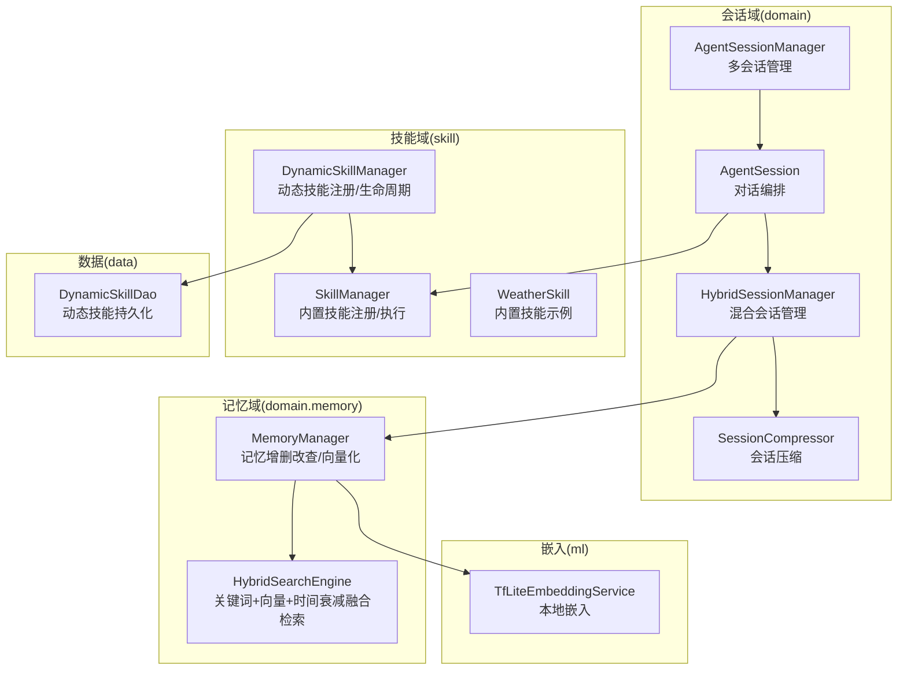
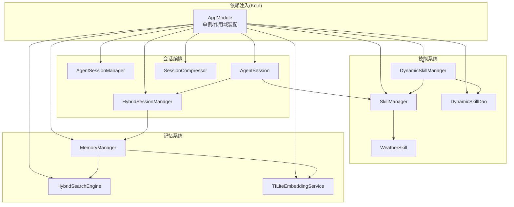
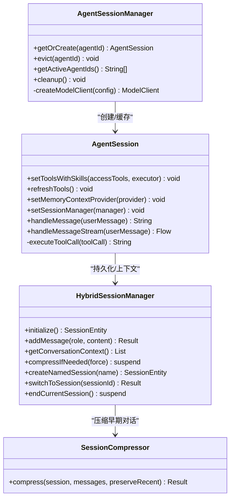
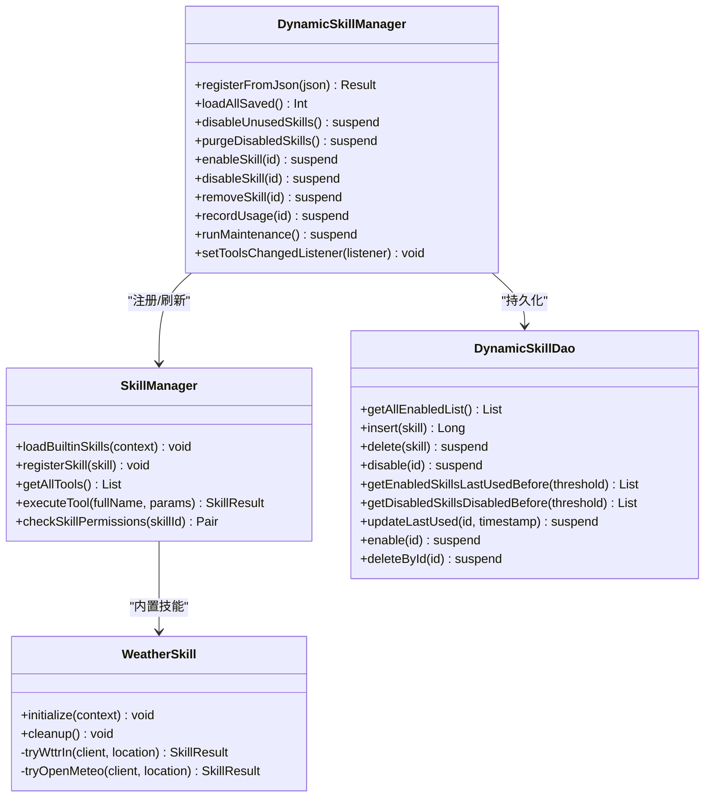
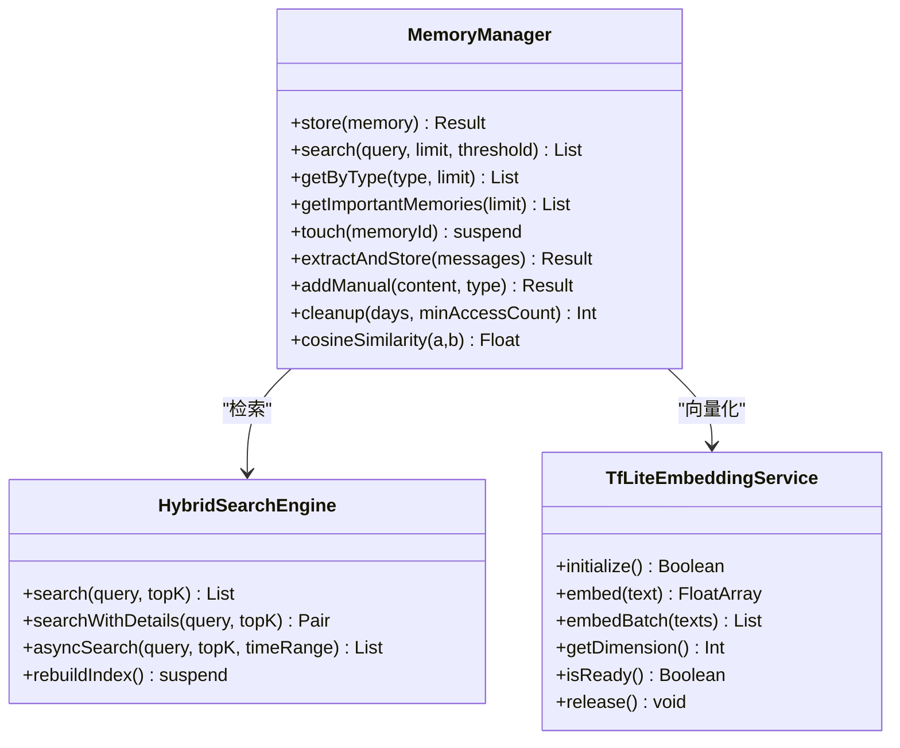
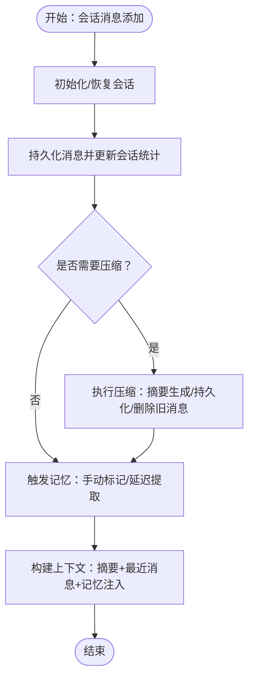
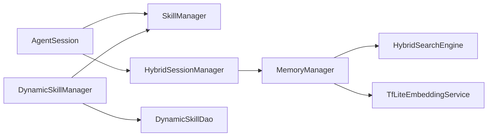

# 核心模块

<cite>
**本文引用的文件**
- [HybridSessionManager.kt](file://app/src/main/java/ai/openclaw/android/domain/session/HybridSessionManager.kt)
- [SessionCompressor.kt](file://app/src/main/java/ai/openclaw/android/domain/session/SessionCompressor.kt)
- [AgentSession.kt](file://app/src/main/java/ai/openclaw/android/agent/AgentSession.kt)
- [AgentSessionManager.kt](file://app/src/main/java/ai/openclaw/android/domain/agent/AgentSessionManager.kt)
- [SkillManager.kt](file://app/src/main/java/ai/openclaw/android/skill/SkillManager.kt)
- [DynamicSkillManager.kt](file://app/src/main/java/ai/openclaw/android/skill/DynamicSkillManager.kt)
- [WeatherSkill.kt](file://app/src/main/java/ai/openclaw/android/skill/builtin/WeatherSkill.kt)
- [MemoryManager.kt](file://app/src/main/java/ai/openclaw/android/domain/memory/MemoryManager.kt)
- [HybridSearchEngine.kt](file://app/src/main/java/ai/openclaw/android/domain/memory/HybridSearchEngine.kt)
- [TfLiteEmbeddingService.kt](file://app/src/main/java/ai/openclaw/android/ml/TfLiteEmbeddingService.kt)
- [AppModule.kt](file://app/src/main/java/ai/openclaw/android/di/AppModule.kt)
- [DynamicSkillDao.kt](file://app/src/main/java/ai/openclaw/android/data/local/DynamicSkillDao.kt)
- [SkillManagerTest.kt](file://app/src/test/java/ai/openclaw/android/skill/SkillManagerTest.kt)
</cite>

## 目录
1. [简介](#简介)
2. [项目结构](#项目结构)
3. [核心组件](#核心组件)
4. [架构总览](#架构总览)
5. [详细组件分析](#详细组件分析)
6. [依赖分析](#依赖分析)
7. [性能考虑](#性能考虑)
8. [故障排查指南](#故障排查指南)
9. [结论](#结论)
10. [附录](#附录)

## 简介
本文件面向OpenClaw-Android核心模块，系统性梳理AI会话系统、技能管理系统、内存系统与会话管理系统的架构设计与实现原理，解释模块间协作关系与数据流，阐述模块化设计如何支撑功能扩展与维护，并提供依赖关系图、交互时序图、使用示例与最佳实践，帮助开发者进行模块集成与二次开发。

## 项目结构
OpenClaw-Android采用按领域分层的组织方式：
- domain：会话、记忆、代理等核心业务域
- agent：会话编排与模型交互
- skill：内置与动态技能体系
- data/local：Room DAO与实体
- ml：嵌入模型与本地推理
- di：Koin依赖注入模块
- android_compose：UI与渲染组件（与核心模块协同）

**图表来源**
- [AgentSessionManager.kt:32-196](file://app/src/main/java/ai/openclaw/android/domain/agent/AgentSessionManager.kt#L32-L196)
- [AgentSession.kt:35-819](file://app/src/main/java/ai/openclaw/android/agent/AgentSession.kt#L35-L819)
- [HybridSessionManager.kt:31-457](file://app/src/main/java/ai/openclaw/android/domain/session/HybridSessionManager.kt#L31-L457)
- [SessionCompressor.kt:13-83](file://app/src/main/java/ai/openclaw/android/domain/session/SessionCompressor.kt#L13-L83)
- [SkillManager.kt:8-193](file://app/src/main/java/ai/openclaw/android/skill/SkillManager.kt#L8-L193)
- [DynamicSkillManager.kt:22-202](file://app/src/main/java/ai/openclaw/android/skill/DynamicSkillManager.kt#L22-L202)
- [WeatherSkill.kt:11-399](file://app/src/main/java/ai/openclaw/android/skill/builtin/WeatherSkill.kt#L11-L399)
- [MemoryManager.kt:10-116](file://app/src/main/java/ai/openclaw/android/domain/memory/MemoryManager.kt#L10-L116)
- [HybridSearchEngine.kt:18-227](file://app/src/main/java/ai/openclaw/android/domain/memory/HybridSearchEngine.kt#L18-L227)
- [TfLiteEmbeddingService.kt:13-97](file://app/src/main/java/ai/openclaw/android/ml/TfLiteEmbeddingService.kt#L13-L97)
- [DynamicSkillDao.kt:7-47](file://app/src/main/java/ai/openclaw/android/data/local/DynamicSkillDao.kt#L7-L47)

**章节来源**
- [AppModule.kt:24-79](file://app/src/main/java/ai/openclaw/android/di/AppModule.kt#L24-L79)

## 核心组件
- AI会话系统：以AgentSession为核心，负责消息历史构建、工具调用、流式输出、反思优化；通过AgentSessionManager实现多会话缓存与复用。
- 技能管理系统：SkillManager负责内置技能注册与工具聚合；DynamicSkillManager负责动态技能的运行时注册、持久化、生命周期管理与工具刷新。
- 内存系统：MemoryManager负责记忆的向量化存储与检索；HybridSearchEngine融合BM25关键词、向量相似度与时间衰减；TfLiteEmbeddingService提供本地嵌入能力。
- 会话管理系统：HybridSessionManager整合消息持久化、摘要压缩、记忆触发与上下文构建；SessionCompressor提供会话压缩能力。

**章节来源**
- [AgentSession.kt:35-819](file://app/src/main/java/ai/openclaw/android/agent/AgentSession.kt#L35-L819)
- [AgentSessionManager.kt:32-196](file://app/src/main/java/ai/openclaw/android/domain/agent/AgentSessionManager.kt#L32-L196)
- [SkillManager.kt:8-193](file://app/src/main/java/ai/openclaw/android/skill/SkillManager.kt#L8-L193)
- [DynamicSkillManager.kt:22-202](file://app/src/main/java/ai/openclaw/android/skill/DynamicSkillManager.kt#L22-L202)
- [MemoryManager.kt:10-116](file://app/src/main/java/ai/openclaw/android/domain/memory/MemoryManager.kt#L10-L116)
- [HybridSearchEngine.kt:18-227](file://app/src/main/java/ai/openclaw/android/domain/memory/HybridSearchEngine.kt#L18-L227)
- [TfLiteEmbeddingService.kt:13-97](file://app/src/main/java/ai/openclaw/android/ml/TfLiteEmbeddingService.kt#L13-L97)
- [HybridSessionManager.kt:31-457](file://app/src/main/java/ai/openclaw/android/domain/session/HybridSessionManager.kt#L31-L457)
- [SessionCompressor.kt:13-83](file://app/src/main/java/ai/openclaw/android/domain/session/SessionCompressor.kt#L13-L83)

## 架构总览
OpenClaw-Android采用“领域驱动 + 依赖注入”的架构：
- 依赖注入：通过Koin模块集中管理单例与作用域，确保组件生命周期与跨模块共享。
- 会话编排：AgentSessionManager按需创建AgentSession，统一注入工具集与反射策略；AgentSession负责消息构建、工具执行与流式输出。
- 记忆与检索：MemoryManager负责向量化与存储；HybridSearchEngine融合多种信号；TfLiteEmbeddingService提供本地推理。
- 技能扩展：SkillManager聚合内置技能；DynamicSkillManager支持动态技能注册与生命周期维护，支持工具刷新。

**图表来源**
- [AppModule.kt:24-79](file://app/src/main/java/ai/openclaw/android/di/AppModule.kt#L24-L79)
- [AgentSessionManager.kt:32-196](file://app/src/main/java/ai/openclaw/android/domain/agent/AgentSessionManager.kt#L32-L196)
- [AgentSession.kt:35-819](file://app/src/main/java/ai/openclaw/android/agent/AgentSession.kt#L35-L819)
- [HybridSessionManager.kt:31-457](file://app/src/main/java/ai/openclaw/android/domain/session/HybridSessionManager.kt#L31-L457)
- [SessionCompressor.kt:13-83](file://app/src/main/java/ai/openclaw/android/domain/session/SessionCompressor.kt#L13-L83)
- [SkillManager.kt:8-193](file://app/src/main/java/ai/openclaw/android/skill/SkillManager.kt#L8-L193)
- [DynamicSkillManager.kt:22-202](file://app/src/main/java/ai/openclaw/android/skill/DynamicSkillManager.kt#L22-L202)
- [DynamicSkillDao.kt:7-47](file://app/src/main/java/ai/openclaw/android/data/local/DynamicSkillDao.kt#L7-L47)
- [MemoryManager.kt:10-116](file://app/src/main/java/ai/openclaw/android/domain/memory/MemoryManager.kt#L10-L116)
- [HybridSearchEngine.kt:18-227](file://app/src/main/java/ai/openclaw/android/domain/memory/HybridSearchEngine.kt#L18-L227)
- [TfLiteEmbeddingService.kt:13-97](file://app/src/main/java/ai/openclaw/android/ml/TfLiteEmbeddingService.kt#L13-L97)

## 详细组件分析

### AI会话系统
- AgentSession：负责消息构建、工具调用、流式输出、反思优化与历史修剪；支持同步与流式两种模式；通过setToolsWithSkills聚合技能工具；支持设备能力路由与A2UI卡片输出。
- AgentSessionManager：按agentId缓存AgentSession，支持LRU淘汰；根据配置创建ModelClient（本地或云端），并注入反射策略。
- HybridSessionManager：负责会话初始化、消息持久化、摘要压缩、记忆触发与上下文构建；维护摘要缓存与延迟提取机制。
- SessionCompressor：在LLM不可用时提供简单摘要策略；在可用时基于提示词压缩早期对话。

**图表来源**
- [AgentSessionManager.kt:32-196](file://app/src/main/java/ai/openclaw/android/domain/agent/AgentSessionManager.kt#L32-L196)
- [AgentSession.kt:35-819](file://app/src/main/java/ai/openclaw/android/agent/AgentSession.kt#L35-L819)
- [HybridSessionManager.kt:31-457](file://app/src/main/java/ai/openclaw/android/domain/session/HybridSessionManager.kt#L31-L457)
- [SessionCompressor.kt:13-83](file://app/src/main/java/ai/openclaw/android/domain/session/SessionCompressor.kt#L13-L83)

**章节来源**
- [AgentSession.kt:35-819](file://app/src/main/java/ai/openclaw/android/agent/AgentSession.kt#L35-L819)
- [AgentSessionManager.kt:32-196](file://app/src/main/java/ai/openclaw/android/domain/agent/AgentSessionManager.kt#L32-L196)
- [HybridSessionManager.kt:31-457](file://app/src/main/java/ai/openclaw/android/domain/session/HybridSessionManager.kt#L31-L457)
- [SessionCompressor.kt:13-83](file://app/src/main/java/ai/openclaw/android/domain/session/SessionCompressor.kt#L13-L83)

### 技能管理系统
- SkillManager：注册内置技能，聚合工具定义，执行工具调用前进行权限校验；支持工具名解析（含下划线技能ID）。
- DynamicSkillManager：动态技能注册、持久化、启用/停用/删除、30/90天生命周期维护；与SkillManager联动刷新工具集；通过回调通知工具变更。
- DynamicSkillDao：Room DAO，提供动态技能的CRUD与状态查询。
- WeatherSkill：内置技能示例，展示工具参数定义、HTTP调用、A2UI卡片输出与回退策略。

**图表来源**
- [SkillManager.kt:8-193](file://app/src/main/java/ai/openclaw/android/skill/SkillManager.kt#L8-L193)
- [DynamicSkillManager.kt:22-202](file://app/src/main/java/ai/openclaw/android/skill/DynamicSkillManager.kt#L22-L202)
- [DynamicSkillDao.kt:7-47](file://app/src/main/java/ai/openclaw/android/data/local/DynamicSkillDao.kt#L7-L47)
- [WeatherSkill.kt:11-399](file://app/src/main/java/ai/openclaw/android/skill/builtin/WeatherSkill.kt#L11-L399)

**章节来源**
- [SkillManager.kt:8-193](file://app/src/main/java/ai/openclaw/android/skill/SkillManager.kt#L8-L193)
- [DynamicSkillManager.kt:22-202](file://app/src/main/java/ai/openclaw/android/skill/DynamicSkillManager.kt#L22-L202)
- [DynamicSkillDao.kt:7-47](file://app/src/main/java/ai/openclaw/android/data/local/DynamicSkillDao.kt#L7-L47)
- [WeatherSkill.kt:11-399](file://app/src/main/java/ai/openclaw/android/skill/builtin/WeatherSkill.kt#L11-L399)

### 内存系统
- MemoryManager：存储记忆实体与向量；支持暴力向量检索与余弦相似度；提供手动添加与自动抽取；清理过期记忆。
- HybridSearchEngine：融合BM25关键词、向量相似度与时间衰减；支持并发检索与缓存；提供评分明细诊断。
- TfLiteEmbeddingService：本地BERT风格嵌入模型，提供维度、批量嵌入与就绪状态检查。

**图表来源**
- [MemoryManager.kt:10-116](file://app/src/main/java/ai/openclaw/android/domain/memory/MemoryManager.kt#L10-L116)
- [HybridSearchEngine.kt:18-227](file://app/src/main/java/ai/openclaw/android/domain/memory/HybridSearchEngine.kt#L18-L227)
- [TfLiteEmbeddingService.kt:13-97](file://app/src/main/java/ai/openclaw/android/ml/TfLiteEmbeddingService.kt#L13-L97)

**章节来源**
- [MemoryManager.kt:10-116](file://app/src/main/java/ai/openclaw/android/domain/memory/MemoryManager.kt#L10-L116)
- [HybridSearchEngine.kt:18-227](file://app/src/main/java/ai/openclaw/android/domain/memory/HybridSearchEngine.kt#L18-L227)
- [TfLiteEmbeddingService.kt:13-97](file://app/src/main/java/ai/openclaw/android/ml/TfLiteEmbeddingService.kt#L13-L97)

### 会话管理系统
- HybridSessionManager：会话初始化与切换、消息持久化、摘要缓存、压缩策略、记忆触发与上下文构建。
- SessionCompressor：在LLM不可用时提供简单摘要；可用时基于提示词压缩早期对话。

**图表来源**
- [HybridSessionManager.kt:59-202](file://app/src/main/java/ai/openclaw/android/domain/session/HybridSessionManager.kt#L59-L202)
- [SessionCompressor.kt:18-60](file://app/src/main/java/ai/openclaw/android/domain/session/SessionCompressor.kt#L18-L60)

**章节来源**
- [HybridSessionManager.kt:59-202](file://app/src/main/java/ai/openclaw/android/domain/session/HybridSessionManager.kt#L59-L202)
- [SessionCompressor.kt:18-60](file://app/src/main/java/ai/openclaw/android/domain/session/SessionCompressor.kt#L18-L60)

## 依赖分析
- 组件耦合：AgentSession依赖SkillManager与HybridSessionManager；SkillManager与DynamicSkillManager相互协作；MemoryManager与HybridSearchEngine、TfLiteEmbeddingService形成检索链路。
- 外部依赖：OkHttp用于网络请求；Room用于数据持久化；Koin用于依赖注入；TensorFlow Lite用于本地嵌入。
- 循环依赖：模块间通过接口与抽象解耦，未发现循环依赖迹象。

**图表来源**
- [AgentSession.kt:35-819](file://app/src/main/java/ai/openclaw/android/agent/AgentSession.kt#L35-L819)
- [SkillManager.kt:8-193](file://app/src/main/java/ai/openclaw/android/skill/SkillManager.kt#L8-L193)
- [HybridSessionManager.kt:31-457](file://app/src/main/java/ai/openclaw/android/domain/session/HybridSessionManager.kt#L31-L457)
- [MemoryManager.kt:10-116](file://app/src/main/java/ai/openclaw/android/domain/memory/MemoryManager.kt#L10-L116)
- [HybridSearchEngine.kt:18-227](file://app/src/main/java/ai/openclaw/android/domain/memory/HybridSearchEngine.kt#L18-L227)
- [TfLiteEmbeddingService.kt:13-97](file://app/src/main/java/ai/openclaw/android/ml/TfLiteEmbeddingService.kt#L13-L97)
- [DynamicSkillManager.kt:22-202](file://app/src/main/java/ai/openclaw/android/skill/DynamicSkillManager.kt#L22-L202)
- [DynamicSkillDao.kt:7-47](file://app/src/main/java/ai/openclaw/android/data/local/DynamicSkillDao.kt#L7-L47)

**章节来源**
- [AppModule.kt:24-79](file://app/src/main/java/ai/openclaw/android/di/AppModule.kt#L24-L79)

## 性能考虑
- 会话压缩：HybridSessionManager与SessionCompressor在高token场景下显著降低上下文开销；摘要缓存减少重复查询。
- 检索融合：HybridSearchEngine对向量与关键词分别归一化后再加权融合，避免单一信号主导；向量结果缓存降低重复计算。
- 本地嵌入：TfLiteEmbeddingService在设备端运行，避免网络延迟；模型文件与词汇表懒加载，初始化后复用。
- 并发检索：HybridSearchEngine异步并行关键词与向量检索，提升响应速度。
- 工具执行：AgentSession对工具执行加锁，避免并发冲突；权限检查前置，减少无效调用。

[本节为通用性能建议，无需特定文件引用]

## 故障排查指南
- 技能权限问题：使用SkillManager.checkSkillPermissions检查缺失权限，结合PermissionManager发起运行时授权。
- 工具名解析：当技能ID含下划线时，确保使用“skillId_toolName”格式调用，避免“Skill not found”错误。
- 会话压缩失败：确认LocalLLMClient是否可用；若不可用，系统将回退至简单摘要策略。
- 记忆检索异常：检查EmbeddingService就绪状态与维度一致性；HybridSearchEngine提供评分明细便于诊断。
- 动态技能生命周期：定期调用DynamicSkillManager.runMaintenance进行停用与清理。

**章节来源**
- [SkillManager.kt:89-138](file://app/src/main/java/ai/openclaw/android/skill/SkillManager.kt#L89-L138)
- [SkillManagerTest.kt:113-147](file://app/src/test/java/ai/openclaw/android/skill/SkillManagerTest.kt#L113-L147)
- [HybridSessionManager.kt:345-398](file://app/src/main/java/ai/openclaw/android/domain/session/HybridSessionManager.kt#L345-L398)
- [HybridSearchEngine.kt:82-135](file://app/src/main/java/ai/openclaw/android/domain/memory/HybridSearchEngine.kt#L82-L135)
- [DynamicSkillManager.kt:122-147](file://app/src/main/java/ai/openclaw/android/skill/DynamicSkillManager.kt#L122-L147)

## 结论
OpenClaw-Android通过清晰的领域划分与依赖注入，实现了AI会话、技能、记忆与会话管理的高内聚低耦合架构。模块化设计支持内置与动态技能扩展、本地嵌入与混合检索、会话压缩与上下文控制，满足复杂场景下的可扩展性与可维护性需求。建议在二次开发中遵循现有接口契约与依赖注入约定，确保模块间协作顺畅。

[本节为总结性内容，无需特定文件引用]

## 附录

### 使用示例与最佳实践
- 会话管理
  - 初始化会话：调用HybridSessionManager.initialize创建或恢复会话。
  - 添加消息：使用addMessage记录用户与助手消息，系统自动触发压缩与记忆提取。
  - 获取上下文：调用getConversationContext构建包含摘要与记忆的对话上下文。
  - 压缩会话：compressIfNeeded在达到阈值时自动压缩，或显式传入force参数。
  - 参考路径：[HybridSessionManager.kt:59-202](file://app/src/main/java/ai/openclaw/android/domain/session/HybridSessionManager.kt#L59-L202)

- 技能系统
  - 注册内置技能：调用SkillManager.loadBuiltinSkills加载全部内置技能。
  - 执行工具：使用executeTool(fullName, params)执行技能工具，系统自动权限校验。
  - 动态技能：通过DynamicSkillManager.registerFromJson注册JSON定义的动态技能，系统自动持久化与运行时注册。
  - 刷新工具：当动态技能注册后，调用AgentSession.refreshTools以更新工具集。
  - 参考路径：[SkillManager.kt:13-83](file://app/src/main/java/ai/openclaw/android/skill/SkillManager.kt#L13-L83)，[DynamicSkillManager.kt:63-96](file://app/src/main/java/ai/openclaw/android/skill/DynamicSkillManager.kt#L63-L96)，[AgentSession.kt:334-362](file://app/src/main/java/ai/openclaw/android/agent/AgentSession.kt#L334-L362)

- 内存系统
  - 存储记忆：调用MemoryManager.store或addManual添加记忆。
  - 搜索记忆：使用HybridSearchEngine.search或searchWithDetails获取融合结果与评分明细。
  - 清理过期：定期调用MemoryManager.cleanup进行过期清理。
  - 参考路径：[MemoryManager.kt:16-95](file://app/src/main/java/ai/openclaw/android/domain/memory/MemoryManager.kt#L16-L95)，[HybridSearchEngine.kt:173-200](file://app/src/main/java/ai/openclaw/android/domain/memory/HybridSearchEngine.kt#L173-L200)

- 会话压缩
  - 使用SessionCompressor.compress在LLM可用时进行高质量摘要，在不可用时回退简单摘要。
  - 参考路径：[SessionCompressor.kt:18-60](file://app/src/main/java/ai/openclaw/android/domain/session/SessionCompressor.kt#L18-L60)

### 集成与二次开发指导
- 依赖注入：通过AppModule集中注册单例与作用域，确保组件生命周期一致。
- 接口契约：遵循Skill、SkillTool、SkillContext等接口定义，保证工具参数与执行流程一致。
- 模块扩展：新增技能时，先在SkillManager中注册，再在AgentSession中刷新工具集；动态技能通过DynamicSkillManager管理。
- 数据持久化：使用Room DAO进行数据持久化，注意状态字段与生命周期管理。
- 参考路径：[AppModule.kt:24-79](file://app/src/main/java/ai/openclaw/android/di/AppModule.kt#L24-L79)，[DynamicSkillDao.kt:7-47](file://app/src/main/java/ai/openclaw/android/data/local/DynamicSkillDao.kt#L7-L47)