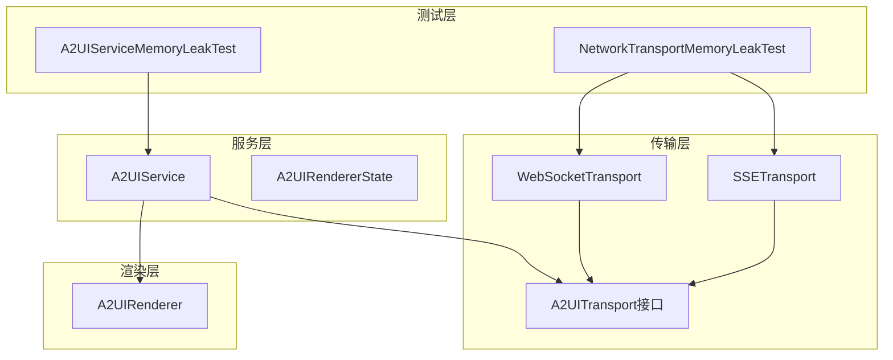
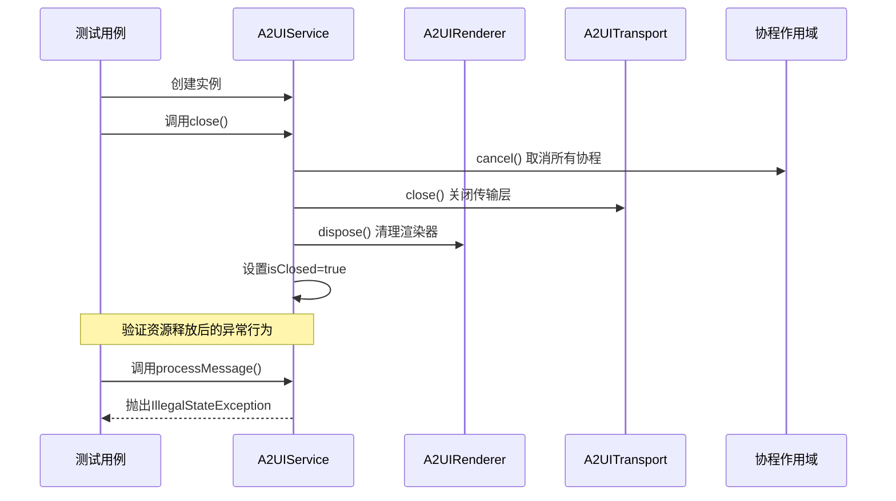
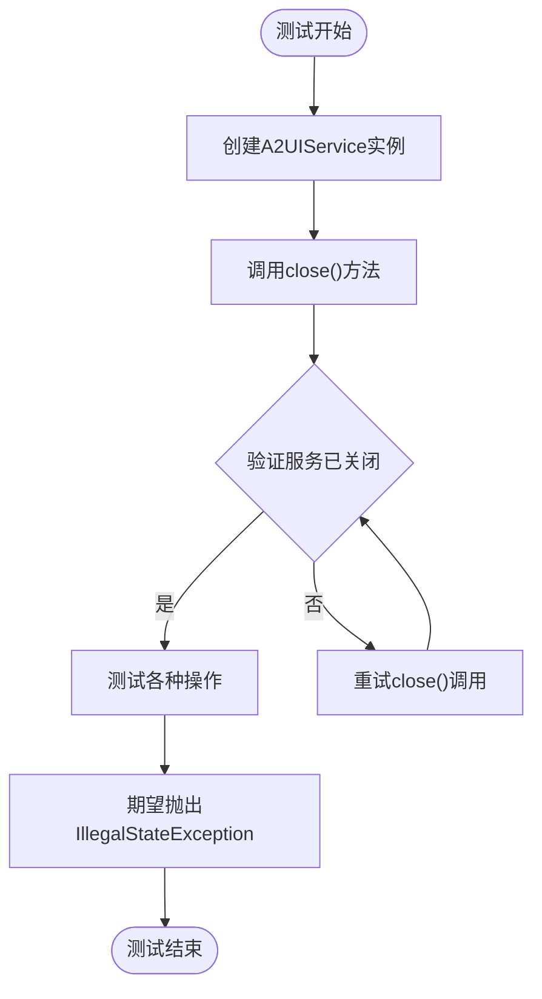
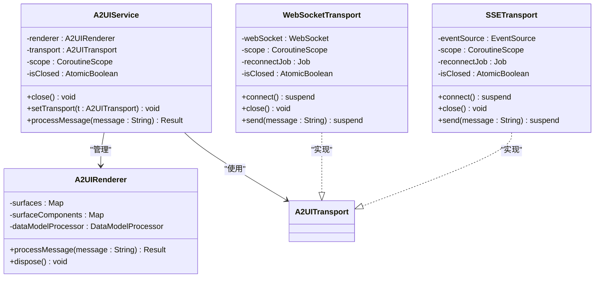
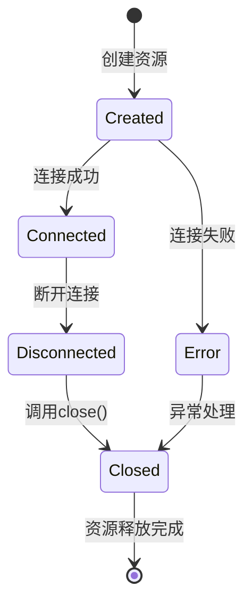
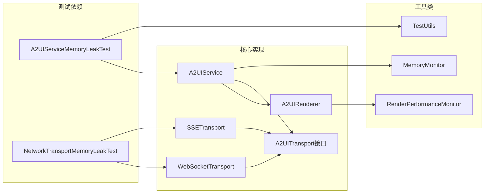

# 内存泄漏测试

<cite>
**本文档引用的文件**
- [A2UIServiceMemoryLeakTest.kt](file://android_compose/src/test/java/org/a2ui/compose/service/A2UIServiceMemoryLeakTest.kt)
- [NetworkTransportMemoryLeakTest.kt](file://android_compose/src/test/java/org/a2ui/compose/transport/NetworkTransportMemoryLeakTest.kt)
- [A2UIService.kt](file://android_compose/src/main/java/org/a2ui/compose/service/A2UIService.kt)
- [NetworkTransport.kt](file://android_compose/src/main/java/org/a2ui/compose/transport/NetworkTransport.kt)
- [A2UITransport.kt](file://android_compose/src/main/java/org/a2ui/compose/transport/A2UITransport.kt)
- [A2UIRenderer.kt](file://android_compose/src/main/java/org/a2ui/compose/rendering/A2UIRenderer.kt)
- [A2UIResourceManagementExample.kt](file://android_compose/src/main/java/org/a2ui/compose/example/A2UIResourceManagementExample.kt)
- [RenderOptimization.kt](file://android_compose/src/main/java/org/a2ui/compose/charts/performance/RenderOptimization.kt)
- [TestUtils.kt](file://app/src/androidTest/java/ai/openclaw/android/TestUtils.kt)
</cite>

## 目录
1. [简介](#简介)
2. [项目结构](#项目结构)
3. [核心组件](#核心组件)
4. [架构概览](#架构概览)
5. [详细组件分析](#详细组件分析)
6. [依赖关系分析](#依赖关系分析)
7. [性能考虑](#性能考虑)
8. [故障排除指南](#故障排除指南)
9. [结论](#结论)
10. [附录](#附录)

## 简介
本文件针对OpenClaw-Android项目中的内存泄漏测试进行全面技术文档化，重点涵盖以下方面：
- 内存泄漏检测与预防策略
- A2UIServiceMemoryLeakTest与NetworkTransportMemoryLeakTest专项测试的实现原理
- 内存使用监控与泄漏检测工具的使用方法
- 弱引用与生命周期管理最佳实践
- 内存压力测试与长时间运行测试实施方案
- 内存泄漏诊断工具与调试技巧
- 内存优化的性能基准与监控指标

## 项目结构
该项目采用模块化架构，内存泄漏测试主要集中在android_compose模块的测试目录中，涉及服务层、传输层和渲染层的资源管理与生命周期控制。

**图表来源**
- [A2UIServiceMemoryLeakTest.kt:1-149](file://android_compose/src/test/java/org/a2ui/compose/service/A2UIServiceMemoryLeakTest.kt#L1-L149)
- [NetworkTransportMemoryLeakTest.kt:1-231](file://android_compose/src/test/java/org/a2ui/compose/transport/NetworkTransportMemoryLeakTest.kt#L1-L231)
- [A2UIService.kt:1-232](file://android_compose/src/main/java/org/a2ui/compose/service/A2UIService.kt#L1-L232)
- [NetworkTransport.kt:1-341](file://android_compose/src/main/java/org/a2ui/compose/transport/NetworkTransport.kt#L1-L341)
- [A2UITransport.kt:1-41](file://android_compose/src/main/java/org/a2ui/compose/transport/A2UITransport.kt#L1-L41)
- [A2UIRenderer.kt:1-660](file://android_compose/src/main/java/org/a2ui/compose/rendering/A2UIRenderer.kt#L1-L660)

**章节来源**
- [A2UIServiceMemoryLeakTest.kt:1-149](file://android_compose/src/test/java/org/a2ui/compose/service/A2UIServiceMemoryLeakTest.kt#L1-L149)
- [NetworkTransportMemoryLeakTest.kt:1-231](file://android_compose/src/test/java/org/a2ui/compose/transport/NetworkTransportMemoryLeakTest.kt#L1-L231)

## 核心组件
本节深入分析内存泄漏测试相关的三个核心组件及其相互关系。

### A2UIService - 主要服务组件
A2UIService作为核心协调者，负责管理渲染器和传输层的生命周期，并实现了AutoCloseable接口以确保资源正确释放。

关键特性：
- 实现AutoCloseable接口，支持幂等关闭
- 使用AtomicBoolean防止并发关闭竞态
- 协程作用域管理，支持取消所有子任务
- 自动关闭旧传输层并清理渲染器

### WebSocketTransport - WebSocket传输实现
WebSocketTransport提供了完整的双向通信能力，包含自动重连机制和资源清理功能。

关键特性：
- 指数退避重连策略
- 状态流管理（Disconnected/Connecting/Connected/Error）
- 自动清理OkHttp客户端资源
- 支持心跳检测和超时配置

### NetworkTransportMemoryLeakTest - 传输层内存泄漏测试
该测试专门验证传输层的内存泄漏防护机制，包括协程取消、状态更新和资源释放。

**章节来源**
- [A2UIService.kt:112-222](file://android_compose/src/main/java/org/a2ui/compose/service/A2UIService.kt#L112-L222)
- [NetworkTransport.kt:28-178](file://android_compose/src/main/java/org/a2ui/compose/transport/NetworkTransport.kt#L28-L178)
- [NetworkTransportMemoryLeakTest.kt:1-231](file://android_compose/src/test/java/org/a2ui/compose/transport/NetworkTransportMemoryLeakTest.kt#L1-L231)

## 架构概览
下图展示了内存泄漏测试的整体架构和组件交互关系：

**图表来源**
- [A2UIServiceMemoryLeakTest.kt:12-27](file://android_compose/src/test/java/org/a2ui/compose/service/A2UIServiceMemoryLeakTest.kt#L12-L27)
- [A2UIService.kt:208-222](file://android_compose/src/main/java/org/a2ui/compose/service/A2UIService.kt#L208-L222)

## 详细组件分析

### A2UIServiceMemoryLeakTest专项测试
该测试覆盖了A2UIService的所有关键内存泄漏场景：

#### 关闭操作测试
- 验证close()方法的幂等性
- 确认多次调用close()不会抛出异常
- 验证关闭后无法再次使用服务

#### 传输层切换测试
- 验证setTransport()方法正确关闭旧传输层
- 确认旧传输层在新传输层设置后被正确释放
- 测试关闭状态下的传输层操作异常

#### 生命周期管理测试
- 验证use块模式的自动清理
- 测试异常情况下的资源释放
- 确认dispose()方法的兼容性

**图表来源**
- [A2UIServiceMemoryLeakTest.kt:11-147](file://android_compose/src/test/java/org/a2ui/compose/service/A2UIServiceMemoryLeakTest.kt#L11-L147)

**章节来源**
- [A2UIServiceMemoryLeakTest.kt:1-149](file://android_compose/src/test/java/org/a2ui/compose/service/A2UIServiceMemoryLeakTest.kt#L1-L149)

### NetworkTransportMemoryLeakTest专项测试
该测试专注于传输层的内存泄漏防护：

#### 协程取消测试
- 验证close()方法正确取消所有协程任务
- 确认重连作业和网络连接被正确清理
- 测试多次调用close()的安全性

#### 状态管理测试
- 验证关闭后状态正确更新为Disconnected
- 确认传输层状态流的正确行为
- 测试不同传输类型的一致性

#### 功能完整性测试
- WebSocket传输的发送/接收功能
- SSE传输的只读特性验证
- 异常情况下的错误处理

**图表来源**
- [A2UIService.kt:112-222](file://android_compose/src/main/java/org/a2ui/compose/service/A2UIService.kt#L112-L222)
- [NetworkTransport.kt:28-340](file://android_compose/src/main/java/org/a2ui/compose/transport/NetworkTransport.kt#L28-L340)
- [A2UIRenderer.kt:64-576](file://android_compose/src/main/java/org/a2ui/compose/rendering/A2UIRenderer.kt#L64-L576)

**章节来源**
- [NetworkTransportMemoryLeakTest.kt:1-231](file://android_compose/src/test/java/org/a2ui/compose/transport/NetworkTransportMemoryLeakTest.kt#L1-L231)

### 内存使用监控与泄漏检测工具
项目提供了多种内存监控和泄漏检测工具：

#### MemoryMonitor - 内存压力监控
- 基于Runtime.getRuntime()的内存使用率计算
- 支持LOW/MEDIUM/HIGH/CRITICAL四个压力级别
- 提供建议性GC触发机制

#### RenderPerformanceMonitor - 渲染性能监控
- 帧时间测量和FPS计算
- 帧时间方差分析用于检测卡顿
- 性能警告自动触发机制

#### 性能基准测试
- 帧时间样本窗口大小为60帧
- 平均帧时间计算精度到毫秒级
- 方差计算用于识别性能波动

**章节来源**
- [RenderOptimization.kt:487-523](file://android_compose/src/main/java/org/a2ui/compose/charts/performance/RenderOptimization.kt#L487-L523)

### 弱引用与生命周期管理最佳实践
项目提供了多种资源管理模式的最佳实践：

#### 生命周期观察者模式
- A2UILifecycleObserver替代finalize反模式
- 自动在onDestroy时清理资源
- 与Android生命周期系统集成

#### 协程作用域管理
- DisposableEffect在Composable销毁时清理
- rememberCoroutineScope管理异步任务
- 确保UI组件销毁时自动释放资源

#### 资源管理模式
- AutoCloseable接口的统一资源管理
- use块模式的自动清理
- finally块的异常安全资源释放

**图表来源**
- [A2UIResourceManagementExample.kt:266-290](file://android_compose/src/main/java/org/a2ui/compose/example/A2UIResourceManagementExample.kt#L266-L290)

**章节来源**
- [A2UIResourceManagementExample.kt:1-313](file://android_compose/src/main/java/org/a2ui/compose/example/A2UIResourceManagementExample.kt#L1-L313)

## 依赖关系分析

**图表来源**
- [A2UIServiceMemoryLeakTest.kt:1-149](file://android_compose/src/test/java/org/a2ui/compose/service/A2UIServiceMemoryLeakTest.kt#L1-L149)
- [NetworkTransportMemoryLeakTest.kt:1-231](file://android_compose/src/test/java/org/a2ui/compose/transport/NetworkTransportMemoryLeakTest.kt#L1-L231)
- [A2UIService.kt:1-232](file://android_compose/src/main/java/org/a2ui/compose/service/A2UIService.kt#L1-L232)
- [NetworkTransport.kt:1-341](file://android_compose/src/main/java/org/a2ui/compose/transport/NetworkTransport.kt#L1-L341)
- [RenderOptimization.kt:1-523](file://android_compose/src/main/java/org/a2ui/compose/charts/performance/RenderOptimization.kt#L1-L523)
- [TestUtils.kt:1-16](file://app/src/androidTest/java/ai/openclaw/android/TestUtils.kt#L1-L16)

**章节来源**
- [A2UIService.kt:1-232](file://android_compose/src/main/java/org/a2ui/compose/service/A2UIService.kt#L1-L232)
- [NetworkTransport.kt:1-341](file://android_compose/src/main/java/org/a2ui/compose/transport/NetworkTransport.kt#L1-L341)

## 性能考虑
内存泄漏测试不仅关注资源释放，还涉及整体性能影响：

### 协程管理性能
- SupervisorJob确保子任务异常不影响主协程
- Dispatchers.Main用于UI相关操作
- IO调度器用于网络操作

### 内存优化策略
- AtomicBoolean避免竞态条件的额外开销
- 及时清理状态映射和组件缓存
- 合理的重连延迟策略避免资源浪费

### 监控指标
- 内存使用率阈值：90%触发紧急处理
- 性能监控频率：每秒检查一次
- GC触发间隔：至少5秒一次

## 故障排除指南

### 常见内存泄漏问题
1. **未调用close()方法**
   - 现象：服务对象无法释放
   - 解决：确保在onDestroy或finally块中调用close()

2. **传输层资源未清理**
   - 现象：WebSocket连接持续占用
   - 解决：验证close()方法正确取消所有协程

3. **渲染器状态未清理**
   - 现象：组件映射和数据模型未释放
   - 解决：调用renderer.dispose()清理内部状态

### 调试技巧
- 使用TestUtils.dumpSemanticNodes()检查Compose语义树
- 监控MemoryMonitor.checkMemoryPressure()输出
- 通过RenderPerformanceMonitor.getFPS()评估性能影响

**章节来源**
- [TestUtils.kt:11-16](file://app/src/androidTest/java/ai/openclaw/android/TestUtils.kt#L11-L16)
- [RenderOptimization.kt:487-523](file://android_compose/src/main/java/org/a2ui/compose/charts/performance/RenderOptimization.kt#L487-L523)

## 结论
本内存泄漏测试文档全面覆盖了OpenClaw-Android项目中的资源管理策略和测试方法。通过A2UIServiceMemoryLeakTest和NetworkTransportMemoryLeakTest两个专项测试，结合MemoryMonitor和RenderPerformanceMonitor等监控工具，形成了完整的内存泄漏防护体系。项目采用的生命周期观察者模式、协程作用域管理和资源管理模式为Android应用的内存安全提供了坚实保障。

## 附录

### 内存压力测试实施方案
1. **短期压力测试**
   - 运行A2UIServiceMemoryLeakTest和NetworkTransportMemoryLeakTest
   - 监控MemoryMonitor.checkMemoryPressure()输出
   - 验证资源释放后的异常行为

2. **长时间运行测试**
   - 模拟1小时以上的连续连接和断开
   - 每分钟检查一次内存使用率
   - 监控RenderPerformanceMonitor.getFPS()稳定性

3. **内存压力模拟**
   - 使用高频率的消息发送和接收
   - 模拟网络不稳定环境
   - 验证自动重连机制的内存效率

### 内存优化监控指标
- **内存使用率**：目标<70%，预警>80%
- **FPS性能**：目标>60，预警<30
- **帧时间方差**：目标<10ms²，预警>25ms²
- **GC触发频率**：建议每5-10分钟一次