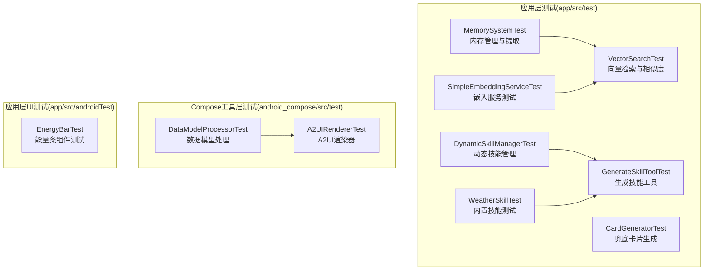
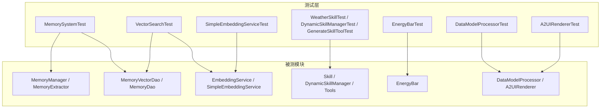
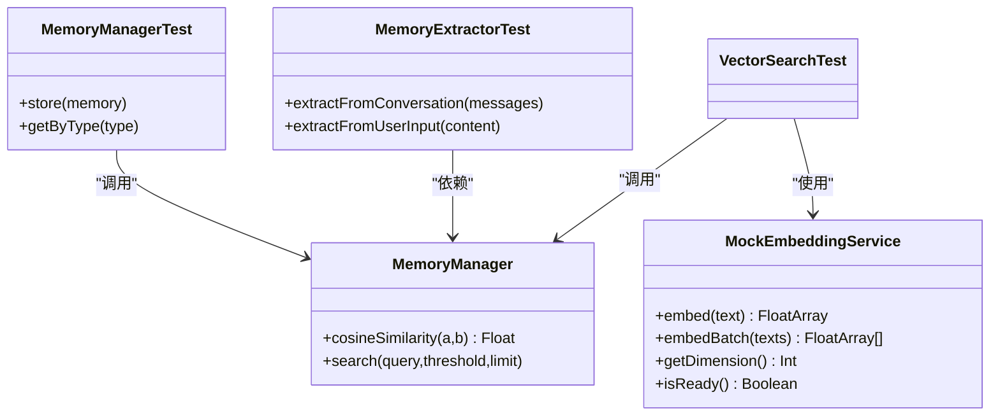
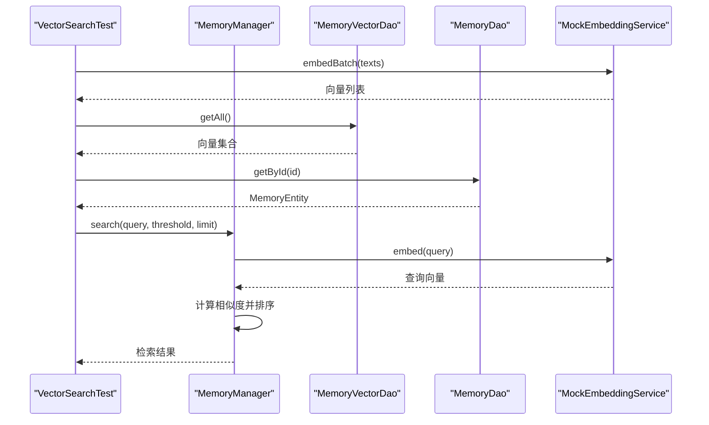
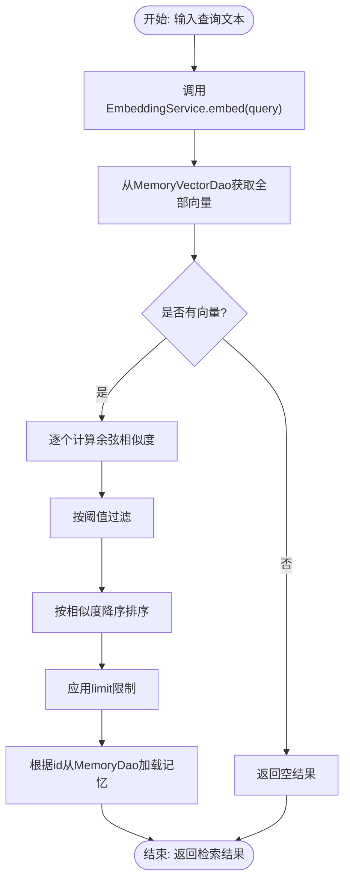
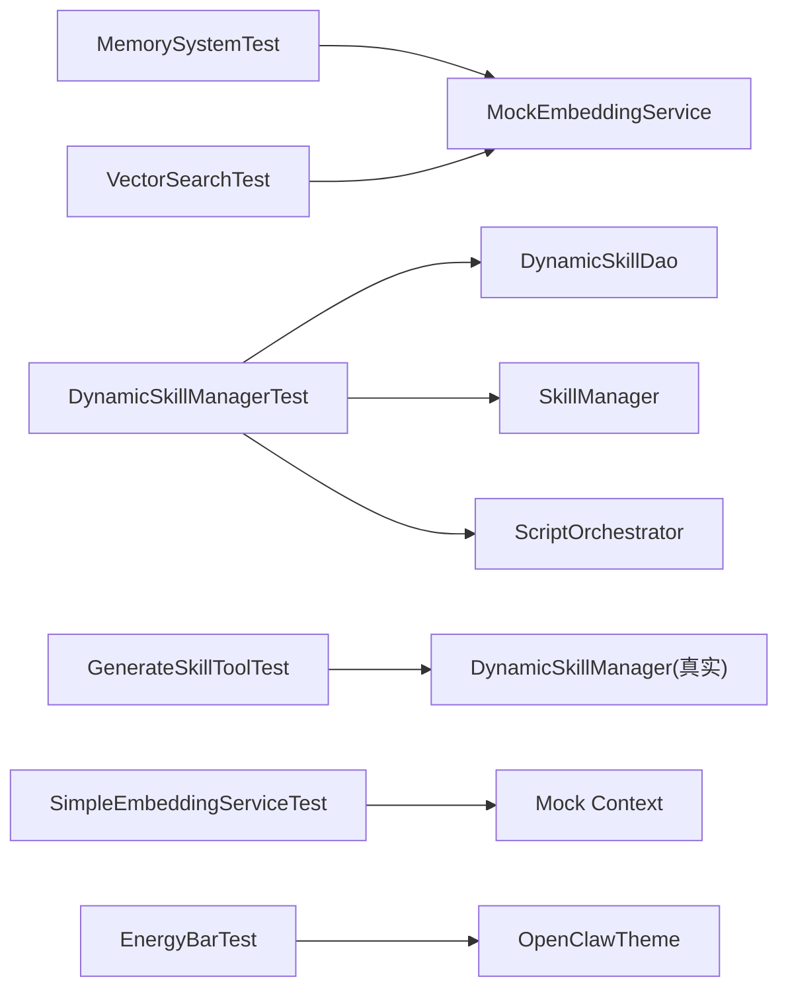

# 单元测试

<cite>
**本文引用的文件**
- [MemorySystemTest.kt](file://app/src/test/java/ai/openclaw/android/domain/memory/MemorySystemTest.kt)
- [VectorSearchTest.kt](file://app/src/test/java/ai/openclaw/android/domain/memory/VectorSearchTest.kt)
- [MockEmbeddingService.kt](file://app/src/test/java/ai/openclaw/android/domain/memory/MockEmbeddingService.kt)
- [SimpleEmbeddingServiceTest.kt](file://app/src/test/java/ai/openclaw/android/ml/SimpleEmbeddingServiceTest.kt)
- [WeatherSkillTest.kt](file://app/src/test/java/ai/openclaw/android/skill/builtin/WeatherSkillTest.kt)
- [DynamicSkillManagerTest.kt](file://app/src/test/java/ai/openclaw/android/skill/DynamicSkillManagerTest.kt)
- [GenerateSkillToolTest.kt](file://app/src/test/java/ai/openclaw/android/skill/builtin/GenerateSkillToolTest.kt)
- [CardGeneratorTest.kt](file://app/src/test/java/ai/openclaw/android/util/CardGeneratorTest.kt)
- [EnergyBarTest.kt](file://app/src/androidTest/java/ai/openclaw/android/ui/components/EnergyBarTest.kt)
- [DataModelProcessorTest.kt](file://android_compose/src/test/java/org/a2ui/compose/data/DataModelProcessorTest.kt)
- [A2UIRendererTest.kt](file://android_compose/src/test/java/org/a2ui/compose/rendering/A2UIRendererTest.kt)
</cite>

## 目录
1. [引言](#引言)
2. [项目结构](#项目结构)
3. [核心组件](#核心组件)
4. [架构总览](#架构总览)
5. [详细组件分析](#详细组件分析)
6. [依赖关系分析](#依赖关系分析)
7. [性能考量](#性能考量)
8. [故障排查指南](#故障排查指南)
9. [结论](#结论)
10. [附录](#附录)

## 引言
本文件系统性梳理并总结本仓库的单元测试与UI测试实现，重点覆盖以下方面：
- 核心模块测试：MemorySystemTest、VectorSearchTest、MockEmbeddingService
- 技能测试：WeatherSkillTest、DynamicSkillManagerTest、GenerateSkillToolTest
- ML模型测试：SimpleEmbeddingServiceTest
- UI组件测试：EnergyBarTest
- A2UI系统测试：DataModelProcessorTest、A2UIRendererTest
- Mock对象与测试数据准备策略
- 测试覆盖率与质量指标建议
- 最佳实践、调试技巧与命名规范

## 项目结构
测试代码主要分布在三个层次：
- 应用层（app/src/test）：领域逻辑、技能、ML、工具与UI组件的单元测试
- Compose工具层（android_compose/src/test）：A2UI数据模型与渲染器的单元测试
- 应用层UI集成测试（app/src/androidTest）：基于Compose的UI组件端到端测试

图表来源
- [MemorySystemTest.kt:1-104](file://app/src/test/java/ai/openclaw/android/domain/memory/MemorySystemTest.kt#L1-L104)
- [VectorSearchTest.kt:1-292](file://app/src/test/java/ai/openclaw/android/domain/memory/VectorSearchTest.kt#L1-L292)
- [SimpleEmbeddingServiceTest.kt:1-113](file://app/src/test/java/ai/openclaw/android/ml/SimpleEmbeddingServiceTest.kt#L1-L113)
- [WeatherSkillTest.kt:1-116](file://app/src/test/java/ai/openclaw/android/skill/builtin/WeatherSkillTest.kt#L1-L116)
- [DynamicSkillManagerTest.kt:1-311](file://app/src/test/java/ai/openclaw/android/skill/DynamicSkillManagerTest.kt#L1-L311)
- [GenerateSkillToolTest.kt:1-125](file://app/src/test/java/ai/openclaw/android/skill/builtin/GenerateSkillToolTest.kt#L1-L125)
- [CardGeneratorTest.kt:1-152](file://app/src/test/java/ai/openclaw/android/util/CardGeneratorTest.kt#L1-L152)
- [DataModelProcessorTest.kt:1-136](file://android_compose/src/test/java/org/a2ui/compose/data/DataModelProcessorTest.kt#L1-L136)
- [A2UIRendererTest.kt:1-315](file://android_compose/src/test/java/org/a2ui/compose/rendering/A2UIRendererTest.kt#L1-L315)
- [EnergyBarTest.kt:1-60](file://app/src/androidTest/java/ai/openclaw/android/ui/components/EnergyBarTest.kt#L1-L60)

章节来源
- [MemorySystemTest.kt:1-104](file://app/src/test/java/ai/openclaw/android/domain/memory/MemorySystemTest.kt#L1-L104)
- [VectorSearchTest.kt:1-292](file://app/src/test/java/ai/openclaw/android/domain/memory/VectorSearchTest.kt#L1-L292)
- [SimpleEmbeddingServiceTest.kt:1-113](file://app/src/test/java/ai/openclaw/android/ml/SimpleEmbeddingServiceTest.kt#L1-L113)
- [WeatherSkillTest.kt:1-116](file://app/src/test/java/ai/openclaw/android/skill/builtin/WeatherSkillTest.kt#L1-L116)
- [DynamicSkillManagerTest.kt:1-311](file://app/src/test/java/ai/openclaw/android/skill/DynamicSkillManagerTest.kt#L1-L311)
- [GenerateSkillToolTest.kt:1-125](file://app/src/test/java/ai/openclaw/android/skill/builtin/GenerateSkillToolTest.kt#L1-L125)
- [CardGeneratorTest.kt:1-152](file://app/src/test/java/ai/openclaw/android/util/CardGeneratorTest.kt#L1-L152)
- [DataModelProcessorTest.kt:1-136](file://android_compose/src/test/java/org/a2ui/compose/data/DataModelProcessorTest.kt#L1-L136)
- [A2UIRendererTest.kt:1-315](file://android_compose/src/test/java/org/a2ui/compose/rendering/A2UIRendererTest.kt#L1-L315)
- [EnergyBarTest.kt:1-60](file://app/src/androidTest/java/ai/openclaw/android/ui/components/EnergyBarTest.kt#L1-L60)

## 核心组件
本节聚焦关键测试模块的设计思路与策略。

- 内存系统与向量检索
  - MemoryExtractorTest：验证从对话或用户输入提取记忆实体的行为，确保空输入返回空列表且类型与优先级符合预期
  - MemoryManagerTest：验证存储流程（持久化与向量写入）、按类型查询的参数传递正确性
  - VectorSearchTest：覆盖余弦相似度计算边界条件、MockEmbeddingService的确定性向量生成、以及端到端检索流程（阈值过滤、排序、限制数量、缺失记忆的容错）
  - MockEmbeddingService：提供可配置维度、确定性归一化向量，便于稳定复现相似度测试

- ML嵌入服务
  - SimpleEmbeddingServiceTest：验证维度一致性、相同文本一致性、向量归一化、批处理、空文本处理、相似度范围约束等

- 技能体系
  - WeatherSkillTest：验证工具参数校验、HTTP客户端初始化状态、元数据正确性
  - DynamicSkillManagerTest：覆盖注册（解析+持久化+注册）、加载全部、停用/清理策略、启用/禁用/移除、使用记录、维护任务、回调触发等
  - GenerateSkillToolTest：验证工具参数校验、无效JSON处理、缺失字段处理、元数据正确性

- 工具与UI
  - CardGeneratorTest：验证兜底卡片格式、摘要截断、标题处理、动作按钮、包装与去重、特殊字符处理、JSON合法性
  - EnergyBarTest：验证组件渲染、状态变化下的动画与布局稳定性
  - DataModelProcessorTest / A2UIRendererTest：验证A2UI消息协议的解析、数据模型更新、主题与组件树构建、序列化/反序列化、异常场景

章节来源
- [MemorySystemTest.kt:15-103](file://app/src/test/java/ai/openclaw/android/domain/memory/MemorySystemTest.kt#L15-L103)
- [VectorSearchTest.kt:17-291](file://app/src/test/java/ai/openclaw/android/domain/memory/VectorSearchTest.kt#L17-L291)
- [MockEmbeddingService.kt:1-40](file://app/src/test/java/ai/openclaw/android/domain/memory/MockEmbeddingService.kt#L1-L40)
- [SimpleEmbeddingServiceTest.kt:1-113](file://app/src/test/java/ai/openclaw/android/ml/SimpleEmbeddingServiceTest.kt#L1-L113)
- [WeatherSkillTest.kt:15-115](file://app/src/test/java/ai/openclaw/android/skill/builtin/WeatherSkillTest.kt#L15-L115)
- [DynamicSkillManagerTest.kt:23-310](file://app/src/test/java/ai/openclaw/android/skill/DynamicSkillManagerTest.kt#L23-L310)
- [GenerateSkillToolTest.kt:28-124](file://app/src/test/java/ai/openclaw/android/skill/builtin/GenerateSkillToolTest.kt#L28-L124)
- [CardGeneratorTest.kt:12-151](file://app/src/test/java/ai/openclaw/android/util/CardGeneratorTest.kt#L12-L151)
- [EnergyBarTest.kt:15-59](file://app/src/androidTest/java/ai/openclaw/android/ui/components/EnergyBarTest.kt#L15-L59)
- [DataModelProcessorTest.kt:10-135](file://android_compose/src/test/java/org/a2ui/compose/data/DataModelProcessorTest.kt#L10-L135)
- [A2UIRendererTest.kt:7-314](file://android_compose/src/test/java/org/a2ui/compose/rendering/A2UIRendererTest.kt#L7-L314)

## 架构总览
下图展示测试层与被测模块之间的交互关系，突出Mock对象与测试数据准备策略：

图表来源
- [MemorySystemTest.kt:44-103](file://app/src/test/java/ai/openclaw/android/domain/memory/MemorySystemTest.kt#L44-L103)
- [VectorSearchTest.kt:159-291](file://app/src/test/java/ai/openclaw/android/domain/memory/VectorSearchTest.kt#L159-L291)
- [SimpleEmbeddingServiceTest.kt:14-112](file://app/src/test/java/ai/openclaw/android/ml/SimpleEmbeddingServiceTest.kt#L14-L112)
- [WeatherSkillTest.kt:15-115](file://app/src/test/java/ai/openclaw/android/skill/builtin/WeatherSkillTest.kt#L15-L115)
- [DynamicSkillManagerTest.kt:23-310](file://app/src/test/java/ai/openclaw/android/skill/DynamicSkillManagerTest.kt#L23-L310)
- [GenerateSkillToolTest.kt:28-124](file://app/src/test/java/ai/openclaw/android/skill/builtin/GenerateSkillToolTest.kt#L28-L124)
- [EnergyBarTest.kt:15-59](file://app/src/androidTest/java/ai/openclaw/android/ui/components/EnergyBarTest.kt#L15-L59)
- [DataModelProcessorTest.kt:10-135](file://android_compose/src/test/java/org/a2ui/compose/data/DataModelProcessorTest.kt#L10-L135)
- [A2UIRendererTest.kt:7-314](file://android_compose/src/test/java/org/a2ui/compose/rendering/A2UIRendererTest.kt#L7-L314)

## 详细组件分析

### 内存系统与向量检索测试
- 设计要点
  - 使用Mock对象隔离外部依赖（DAO、EmbeddingService、Extractor），确保测试可重复且快速
  - 通过MockEmbeddingService生成确定性向量，便于断言相似度与排序
  - 覆盖边界条件：零向量、正交向量、维度不匹配、高维向量、部分重叠向量
  - 端到端检索：阈值过滤、数量限制、缺失记忆容错、排序一致性

图表来源
- [MemorySystemTest.kt:44-103](file://app/src/test/java/ai/openclaw/android/domain/memory/MemorySystemTest.kt#L44-L103)
- [VectorSearchTest.kt:17-291](file://app/src/test/java/ai/openclaw/android/domain/memory/VectorSearchTest.kt#L17-L291)
- [MockEmbeddingService.kt:8-39](file://app/src/test/java/ai/openclaw/android/domain/memory/MockEmbeddingService.kt#L8-L39)

图表来源
- [VectorSearchTest.kt:194-291](file://app/src/test/java/ai/openclaw/android/domain/memory/VectorSearchTest.kt#L194-L291)

图表来源
- [VectorSearchTest.kt:194-291](file://app/src/test/java/ai/openclaw/android/domain/memory/VectorSearchTest.kt#L194-L291)

章节来源
- [MemorySystemTest.kt:15-103](file://app/src/test/java/ai/openclaw/android/domain/memory/MemorySystemTest.kt#L15-L103)
- [VectorSearchTest.kt:17-291](file://app/src/test/java/ai/openclaw/android/domain/memory/VectorSearchTest.kt#L17-L291)
- [MockEmbeddingService.kt:8-39](file://app/src/test/java/ai/openclaw/android/domain/memory/MockEmbeddingService.kt#L8-L39)

### ML嵌入服务测试
- 设计要点
  - 初始化后进行维度一致性检查
  - 相同文本应产生相同向量，不同文本应产生不同向量
  - 向量需归一化（L2范数接近1）
  - 批处理返回与单个一致
  - 空文本返回零向量
  - 相似度范围应在[-1,1]

章节来源
- [SimpleEmbeddingServiceTest.kt:14-112](file://app/src/test/java/ai/openclaw/android/ml/SimpleEmbeddingServiceTest.kt#L14-L112)

### 技能测试
- WeatherSkillTest
  - 参数校验：缺失/空位置参数返回错误
  - 初始化状态：HTTP客户端未初始化时返回错误
  - 元数据校验：技能与工具名称、版本、参数定义正确

- DynamicSkillManagerTest
  - 注册流程：JSON解析、持久化、注册、回调触发
  - 加载流程：从数据库恢复启用技能
  - 维护流程：30天未使用停用、90天已停用清理
  - 管理操作：启用/禁用/移除、使用记录更新
  - 容错：无效JSON跳过、不存在技能不崩溃

- GenerateSkillToolTest
  - 参数校验：缺失/空/空白skillJson返回错误
  - 无效JSON：解析失败返回错误
  - 元数据校验：工具名称、描述、参数定义正确

章节来源
- [WeatherSkillTest.kt:15-115](file://app/src/test/java/ai/openclaw/android/skill/builtin/WeatherSkillTest.kt#L15-L115)
- [DynamicSkillManagerTest.kt:23-310](file://app/src/test/java/ai/openclaw/android/skill/DynamicSkillManagerTest.kt#L23-L310)
- [GenerateSkillToolTest.kt:28-124](file://app/src/test/java/ai/openclaw/android/skill/builtin/GenerateSkillToolTest.kt#L28-L124)

### UI组件测试
- EnergyBarTest
  - 渲染测试：组件在主题包裹下可正常合成
  - 动画状态：焦点状态切换后组件仍可正常工作
  - 无崩溃验证：根节点打印用于确认合成路径

章节来源
- [EnergyBarTest.kt:15-59](file://app/src/androidTest/java/ai/openclaw/android/ui/components/EnergyBarTest.kt#L15-L59)

### A2UI系统测试
- DataModelProcessorTest
  - 表面创建/删除、数据模型更新、动态值解析（字面量、路径、函数）
  - 常用校验函数：required、email、url、phone、length、and、or
  - 清理：批量清空数据模型

- A2UIRendererTest
  - 消息协议：createSurface、updateComponents、updateDataModel、deleteSurface
  - 主题与组件树：主题属性、多组件树构建
  - 数据模型：复杂对象路径读取
  - 异常场景：非法消息、空消息、畸形JSON
  - 状态保存/恢复与释放

章节来源
- [DataModelProcessorTest.kt:10-135](file://android_compose/src/test/java/org/a2ui/compose/data/DataModelProcessorTest.kt#L10-L135)
- [A2UIRendererTest.kt:7-314](file://android_compose/src/test/java/org/a2ui/compose/rendering/A2UIRendererTest.kt#L7-L314)

## 依赖关系分析
- 测试耦合与内聚
  - MemorySystemTest与VectorSearchTest高度依赖MockEmbeddingService，确保相似度测试稳定
  - DynamicSkillManagerTest通过注入多个Mock（DAO、SkillManager、ScriptOrchestrator、UserPreferenceManager）实现高内聚测试
  - 技能工具测试（GenerateSkillToolTest）采用“真实管理器+Mock依赖”的组合，规避Mockk对Kotlin内联Result的兼容问题

- 外部依赖与集成点
  - ML嵌入服务依赖上下文与模型资源；测试通过Mock Context与固定维度保证可重复性
  - UI测试依赖Compose测试规则与主题环境

图表来源
- [VectorSearchTest.kt:159-176](file://app/src/test/java/ai/openclaw/android/domain/memory/VectorSearchTest.kt#L159-L176)
- [DynamicSkillManagerTest.kt:25-60](file://app/src/test/java/ai/openclaw/android/skill/DynamicSkillManagerTest.kt#L25-L60)
- [GenerateSkillToolTest.kt:30-49](file://app/src/test/java/ai/openclaw/android/skill/builtin/GenerateSkillToolTest.kt#L30-L49)
- [SimpleEmbeddingServiceTest.kt:9-9](file://app/src/test/java/ai/openclaw/android/ml/SimpleEmbeddingServiceTest.kt#L9-L9)
- [EnergyBarTest.kt:27-31](file://app/src/androidTest/java/ai/openclaw/android/ui/components/EnergyBarTest.kt#L27-L31)

章节来源
- [VectorSearchTest.kt:159-176](file://app/src/test/java/ai/openclaw/android/domain/memory/VectorSearchTest.kt#L159-L176)
- [DynamicSkillManagerTest.kt:25-60](file://app/src/test/java/ai/openclaw/android/skill/DynamicSkillManagerTest.kt#L25-L60)
- [GenerateSkillToolTest.kt:30-49](file://app/src/test/java/ai/openclaw/android/skill/builtin/GenerateSkillToolTest.kt#L30-L49)
- [SimpleEmbeddingServiceTest.kt:9-9](file://app/src/test/java/ai/openclaw/android/ml/SimpleEmbeddingServiceTest.kt#L9-L9)
- [EnergyBarTest.kt:27-31](file://app/src/androidTest/java/ai/openclaw/android/ui/components/EnergyBarTest.kt#L27-L31)

## 性能考量
- 测试执行效率
  - 使用Mock对象替代真实IO与模型推理，显著降低测试时间
  - VectorSearchTest通过MockEmbeddingService避免真实嵌入模型开销
- 内存与并发
  - 使用协程测试框架（runTest/runBlocking）确保异步测试的确定性
  - 避免在测试中创建大量真实对象，减少JVM内存压力

## 故障排查指南
- 常见问题与定位
  - 相似度断言失败：检查向量是否归一化、维度是否一致、查询文本是否为空
  - 技能工具报错：确认参数键名与必填项、HTTP客户端初始化状态
  - 动态技能注册失败：检查JSON结构完整性、必需字段是否存在
  - UI组件崩溃：确认主题包裹、状态变更后等待idle、根节点可合成
- 调试技巧
  - 在测试中打印中间状态（如向量维度、相似度、JSON片段）
  - 使用最小化用例复现问题，逐步增加复杂度
  - 对协程测试使用runTest并显式等待异步完成

章节来源
- [VectorSearchTest.kt:194-291](file://app/src/test/java/ai/openclaw/android/domain/memory/VectorSearchTest.kt#L194-L291)
- [WeatherSkillTest.kt:28-96](file://app/src/test/java/ai/openclaw/android/skill/builtin/WeatherSkillTest.kt#L28-L96)
- [DynamicSkillManagerTest.kt:65-98](file://app/src/test/java/ai/openclaw/android/skill/DynamicSkillManagerTest.kt#L65-L98)
- [EnergyBarTest.kt:25-59](file://app/src/androidTest/java/ai/openclaw/android/ui/components/EnergyBarTest.kt#L25-L59)

## 结论
本仓库的单元测试与UI测试覆盖了核心业务逻辑、ML嵌入、技能体系与A2UI系统的关键路径，采用Mock对象与确定性向量生成策略，确保测试的稳定性与可重复性。建议持续完善覆盖率统计与质量指标，保持测试命名与断言风格的一致性，进一步提升可维护性与回归保障能力。

## 附录

### 测试覆盖率与质量指标
- 建议指标
  - 行覆盖率、分支覆盖率、类覆盖率、方法覆盖率
  - 关键路径（内存检索、技能注册/执行、A2UI消息处理）的覆盖率目标
- 统计方式
  - 使用Gradle Jacoco插件或IDE覆盖率工具生成报告
  - 将覆盖率作为CI门禁指标之一

### 最佳实践与调试技巧
- 最佳实践
  - 使用“Arrange-Act-Assert”结构组织测试
  - 为每个边界条件与异常路径编写独立测试
  - 使用确定性Mock与固定种子/维度，避免随机性导致的不稳定
  - 对协程异步逻辑使用runTest并明确等待点
- 调试技巧
  - 在测试中输出关键中间值（向量维度、相似度、JSON片段）
  - 使用最小化用例快速定位问题
  - 对UI测试使用Compose测试规则的idle等待与根节点打印

### 测试命名规范
- 类命名：被测类名 + Test（如 MemorySystemTest、VectorSearchTest）
- 方法命名：用下划线分隔语义，包含“前置条件_动作_期望结果”（如 extractFromUserInput_should_correctly_create_MemoryEntity）