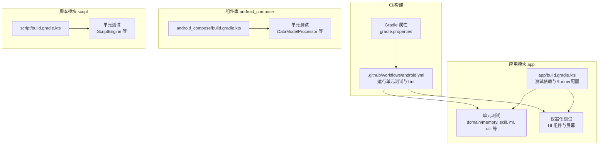
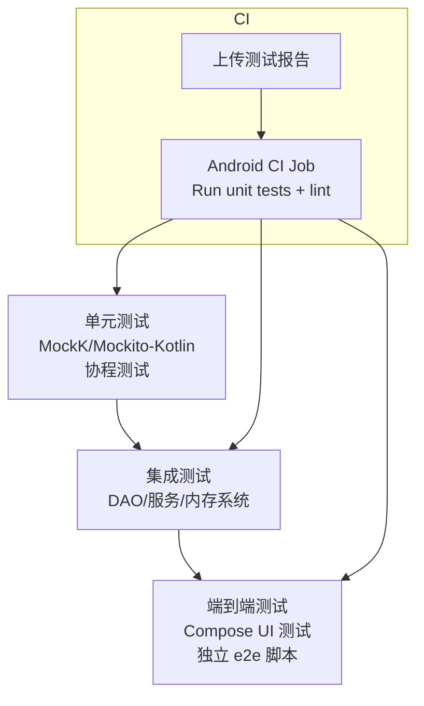
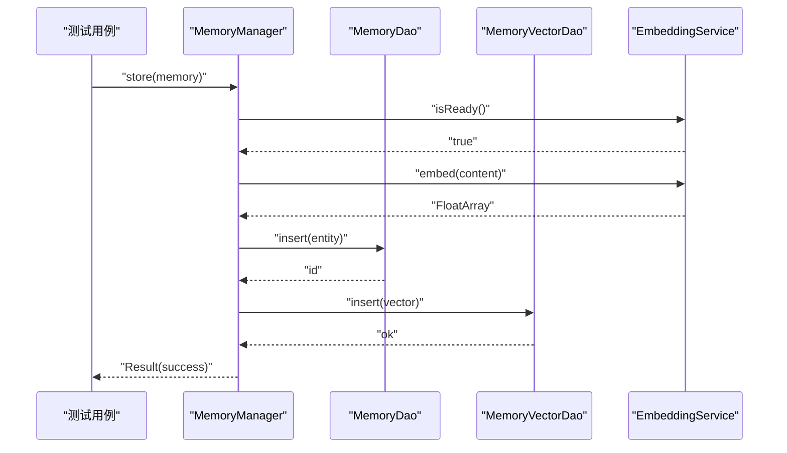
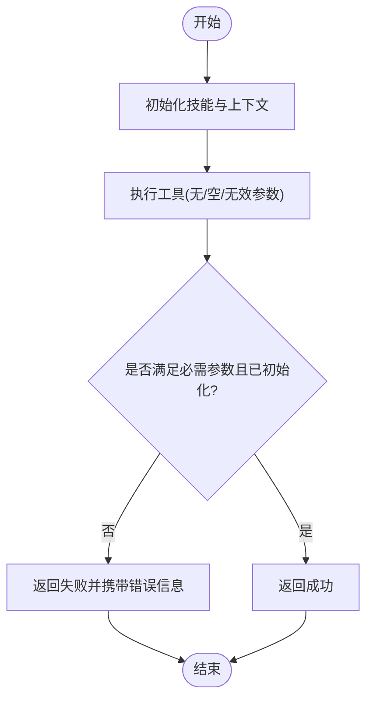
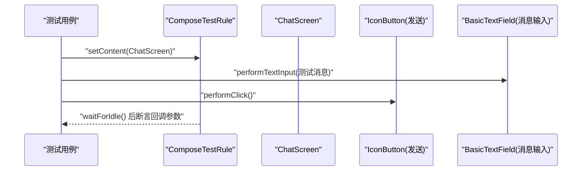
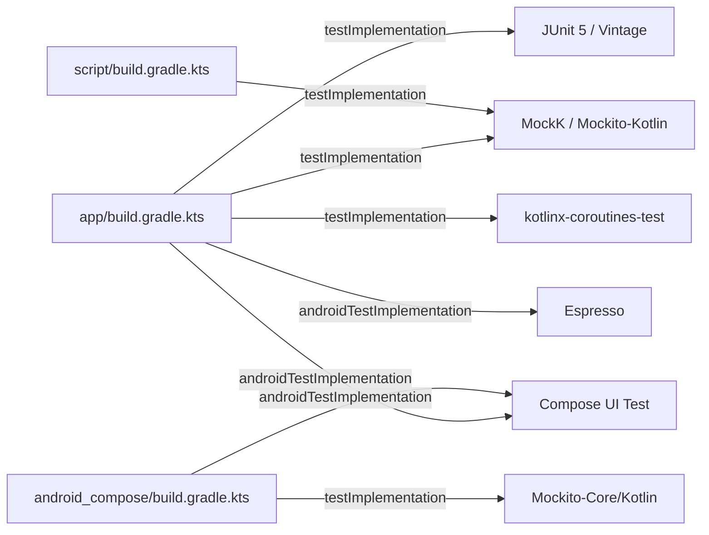

# 测试策略

<cite>
**本文引用的文件**
- [.github/workflows/android.yml](file://.github/workflows/android.yml)
- [app/build.gradle.kts](file://app/build.gradle.kts)
- [android_compose/build.gradle.kts](file://android_compose/build.gradle.kts)
- [script/build.gradle.kts](file://script/build.gradle.kts)
- [build.gradle.kts](file://build.gradle.kts)
- [gradle.properties](file://gradle.properties)
- [scripts/e2e-test.sh](file://scripts/e2e-test.sh)
- [app/src/test/java/ai/openclaw/android/domain/memory/MemorySystemTest.kt](file://app/src/test/java/ai/openclaw/android/domain/memory/MemorySystemTest.kt)
- [app/src/test/java/ai/openclaw/android/skill/builtin/WeatherSkillTest.kt](file://app/src/test/java/ai/openclaw/android/skill/builtin/WeatherSkillTest.kt)
- [app/src/test/java/ai/openclaw/android/ml/SimpleEmbeddingServiceTest.kt](file://app/src/test/java/ai/openclaw/android/ml/SimpleEmbeddingServiceTest.kt)
- [app/src/test/java/ai/openclaw/android/util/CardGeneratorTest.kt](file://app/src/test/java/ai/openclaw/android/util/CardGeneratorTest.kt)
- [android_compose/src/test/java/org/a2ui/compose/data/DataModelProcessorTest.kt](file://android_compose/src/test/java/org/a2ui/compose/data/DataModelProcessorTest.kt)
- [script/src/test/java/ai/openclaw/script/ScriptEngineTest.kt](file://script/src/test/java/ai/openclaw/script/ScriptEngineTest.kt)
- [app/src/androidTest/java/ai/openclaw/android/ui/components/EnergyBarTest.kt](file://app/src/androidTest/java/ai/openclaw/android/ui/components/EnergyBarTest.kt)
- [app/src/androidTest/java/ai/openclaw/android/ChatScreenTest.kt](file://app/src/androidTest/java/ai/openclaw/android/ChatScreenTest.kt)
</cite>

## 目录
1. [引言](#引言)
2. [项目结构](#项目结构)
3. [核心组件](#核心组件)
4. [架构总览](#架构总览)
5. [详细组件分析](#详细组件分析)
6. [依赖关系分析](#依赖关系分析)
7. [性能考量](#性能考量)
8. [故障排查指南](#故障排查指南)
9. [结论](#结论)
10. [附录](#附录)

## 引言
本文件系统化梳理 OpenClaw-Android 的测试策略与实现，覆盖单元测试、集成测试与端到端测试的实施方法；明确各模块的测试覆盖率目标与用例设计原则；阐述测试环境搭建、持续集成配置、Mock 对象与测试数据准备；给出测试自动化与回归策略建议，并总结测试最佳实践、调试技巧、测试报告生成与质量评估方法，最后提供测试驱动开发的指导与工具推荐。

## 项目结构
项目采用多模块结构：应用模块 app、A2UI 组件库 android_compose、脚本引擎模块 script。测试覆盖按模块分布：
- 单元测试：app 模块大量业务逻辑与工具类测试；android_compose 与 script 模块分别覆盖其领域模型与脚本引擎。
- 集成测试：app 模块内 DAO、内存系统、技能工具等跨层协作测试。
- 端到端测试：通过 Android Compose UI 测试与独立的 e2e 脚本进行真实设备验证。

图表来源
- [.github/workflows/android.yml:12-36](file://.github/workflows/android.yml#L12-L36)
- [app/build.gradle.kts:104-108](file://app/build.gradle.kts#L104-L108)
- [android_compose/build.gradle.kts](file://android_compose/build.gradle.kts#L14)
- [script/build.gradle.kts](file://script/build.gradle.kts#L12)

章节来源
- [.github/workflows/android.yml:12-36](file://.github/workflows/android.yml#L12-L36)
- [app/build.gradle.kts:104-108](file://app/build.gradle.kts#L104-L108)
- [android_compose/build.gradle.kts](file://android_compose/build.gradle.kts#L14)
- [script/build.gradle.kts](file://script/build.gradle.kts#L12)
- [gradle.properties:8-11](file://gradle.properties#L8-L11)

## 核心组件
- 单元测试框架与并发支持
  - JUnit 5 与 vintage 引擎、MockK、Mockito-Kotlin、协程测试库用于异步与并发场景。
  - 在 app 模块中开启默认返回值以简化桩件编写。
- 仪器化测试与 UI 测试
  - AndroidX Test Runner、Espresso、Compose UI Test JUnit4，用于界面渲染与交互验证。
- 脚本引擎与安全沙箱
  - QuickJS 与 Rhino 双引擎，配合沙箱策略与超时控制，确保执行安全与稳定性。
- 数据与内存系统
  - Room DAO、向量嵌入服务、内存提取器与管理器的组合测试，覆盖持久化与检索路径。

章节来源
- [app/build.gradle.kts:194-210](file://app/build.gradle.kts#L194-L210)
- [android_compose/build.gradle.kts:65-75](file://android_compose/build.gradle.kts#L65-L75)
- [script/build.gradle.kts:37-40](file://script/build.gradle.kts#L37-L40)
- [app/build.gradle.kts:104-108](file://app/build.gradle.kts#L104-L108)

## 架构总览
下图展示测试金字塔与各层级职责：单元测试优先保证逻辑正确性与边界条件；集成测试验证模块间协作；端到端测试在真实设备上验证用户主流程。

图表来源
- [.github/workflows/android.yml:12-43](file://.github/workflows/android.yml#L12-L43)
- [app/src/androidTest/java/.../EnergyBarTest.kt:15-59](file://app/src/androidTest/java/ai/openclaw/android/ui/components/EnergyBarTest.kt#L15-L59)
- [scripts/e2e-test.sh:1-108](file://scripts/e2e-test.sh#L1-L108)

## 详细组件分析

### 内存系统测试（集成/单元）
- 测试目标
  - 验证记忆提取器在空输入与用户输入下的行为；验证记忆管理器在嵌入就绪与向量写入场景下的存储与查询路径。
- 关键点
  - 使用协程测试运行器；对嵌入服务与 DAO 进行行为验证与调用断言。
  - 通过参数化与边界条件覆盖错误路径与异常分支。
- 用例示例
  - 提取对话为空时返回空列表；从用户输入提取偏好记忆并校验类型与优先级。
  - 存储成功后断言 DAO 插入与向量插入被调用；按类型查询返回期望结果集。

图表来源
- [app/src/test/java/ai/openclaw/android/domain/memory/MemorySystemTest.kt:58-80](file://app/src/test/java/ai/openclaw/android/domain/memory/MemorySystemTest.kt#L58-L80)

章节来源
- [app/src/test/java/ai/openclaw/android/domain/memory/MemorySystemTest.kt:15-42](file://app/src/test/java/ai/openclaw/android/domain/memory/MemorySystemTest.kt#L15-L42)
- [app/src/test/java/ai/openclaw/android/domain/memory/MemorySystemTest.kt:44-103](file://app/src/test/java/ai/openclaw/android/domain/memory/MemorySystemTest.kt#L44-L103)

### 天气技能工具测试（单元）
- 测试目标
  - 验证工具参数校验、初始化状态与元数据一致性；覆盖未初始化与缺失参数的错误路径。
- 关键点
  - 使用注解式 MockK 初始化上下文；对工具参数定义进行断言。
  - 通过协程测试运行器保证异步执行路径可测。

图表来源
- [app/src/test/java/ai/openclaw/android/skill/builtin/WeatherSkillTest.kt:28-80](file://app/src/test/java/ai/openclaw/android/skill/builtin/WeatherSkillTest.kt#L28-L80)

章节来源
- [app/src/test/java/ai/openclaw/android/skill/builtin/WeatherSkillTest.kt:15-115](file://app/src/test/java/ai/openclaw/android/skill/builtin/WeatherSkillTest.kt#L15-L115)

### 嵌入服务测试（单元）
- 测试目标
  - 验证嵌入维度、批量嵌入、归一化、相似度与空文本处理。
- 关键点
  - 使用协程阻塞运行器；计算余弦相似度进行一致性断言；对零向量与异常输入进行健壮性验证。

章节来源
- [app/src/test/java/ai/openclaw/android/ml/SimpleEmbeddingServiceTest.kt:14-112](file://app/src/test/java/ai/openclaw/android/ml/SimpleEmbeddingServiceTest.kt#L14-L112)

### A2UI 数据模型处理器测试（单元）
- 测试目标
  - 验证动态值解析、函数调用（必填、邮箱、URL、电话、长度、逻辑与/或）与数据模型的增删改查。
- 关键点
  - 通过路径值与字面量值进行解析验证；对函数调用的布尔结果进行断言。

章节来源
- [android_compose/src/test/java/org/a2ui/compose/data/DataModelProcessorTest.kt:10-135](file://android_compose/src/test/java/org/a2ui/compose/data/DataModelProcessorTest.kt#L10-L135)

### 脚本引擎测试（单元）
- 测试目标
  - 验证 QuickJS 基础语法、桥接能力、策略限制（导入/Java/eval/require）、超时控制与执行时间统计。
- 关键点
  - 使用临时沙箱目录隔离文件桥接；通过 Rhino 回退路径保证兼容性。

章节来源
- [script/src/test/java/ai/openclaw/script/ScriptEngineTest.kt:10-148](file://script/src/test/java/ai/openclaw/script/ScriptEngineTest.kt#L10-L148)

### UI 组件与屏幕测试（端到端/仪器化）
- 能量条组件测试
  - 验证渲染与状态切换后的稳定性；通过 Compose 测试规则设置主题与状态。
- 聊天屏幕测试
  - 验证消息列表渲染、占位符显示、发送按钮启用/禁用、输入框文本输入与回调触发。
- 关键点
  - 使用 Compose 测试规则与节点匹配；通过内容描述与标签定位控件；等待状态稳定后再断言。

图表来源
- [app/src/androidTest/java/ai/openclaw/android/ChatScreenTest.kt:62-82](file://app/src/androidTest/java/ai/openclaw/android/ChatScreenTest.kt#L62-L82)

章节来源
- [app/src/androidTest/java/ai/openclaw/android/ui/components/EnergyBarTest.kt:15-59](file://app/src/androidTest/java/ai/openclaw/android/ui/components/EnergyBarTest.kt#L15-L59)
- [app/src/androidTest/java/ai/openclaw/android/ChatScreenTest.kt:18-122](file://app/src/androidTest/java/ai/openclaw/android/ChatScreenTest.kt#L18-L122)

### 端到端测试（独立脚本）
- 测试目标
  - 在真实设备上安装调试包、启动应用、检查无障碍开关状态、截屏并保存到本地。
- 关键点
  - 路径转换适配 WSL/Windows；设备连接检测；截图拉取与清理。

章节来源
- [scripts/e2e-test.sh:1-108](file://scripts/e2e-test.sh#L1-L108)

## 依赖关系分析
- 测试框架与工具
  - app 模块统一引入 JUnit 5、MockK、Mockito-Kotlin、协程测试与 AndroidX Test；android_compose 与 script 模块分别按需引入。
  - Gradle 属性启用并行、缓存与配置缓存，提升测试执行效率。
- CI 任务
  - Android CI 作业在 Ubuntu 上执行单元测试与 Lint，并上传测试报告工件。

图表来源
- [app/build.gradle.kts:194-210](file://app/build.gradle.kts#L194-L210)
- [android_compose/build.gradle.kts:65-75](file://android_compose/build.gradle.kts#L65-L75)
- [script/build.gradle.kts:37-40](file://script/build.gradle.kts#L37-L40)
- [build.gradle.kts:1-9](file://build.gradle.kts#L1-L9)
- [gradle.properties:8-11](file://gradle.properties#L8-L11)

章节来源
- [app/build.gradle.kts:194-210](file://app/build.gradle.kts#L194-L210)
- [android_compose/build.gradle.kts:65-75](file://android_compose/build.gradle.kts#L65-L75)
- [script/build.gradle.kts:37-40](file://script/build.gradle.kts#L37-L40)
- [build.gradle.kts:1-9](file://build.gradle.kts#L1-L9)
- [.github/workflows/android.yml:12-43](file://.github/workflows/android.yml#L12-L43)
- [gradle.properties:8-11](file://gradle.properties#L8-L11)

## 性能考量
- 测试执行性能
  - 开启 Gradle 并行、缓存与配置缓存，缩短测试与构建时间。
  - 在单元测试中避免真实网络与磁盘 IO，必要时使用 Mock 或内存数据库。
- UI 测试稳定性
  - 使用 Compose 测试规则的 waitForIdle；避免过短等待；对动画与过渡使用稳定的断言策略。
- 集成测试隔离
  - 使用内存数据库或测试专用数据库实例，减少跨用例污染；在测试前清理状态。

## 故障排查指南
- 单元测试失败
  - 检查 Mock 行为是否完整；确认协程测试运行器包裹了异步路径；核对默认返回值策略导致的断言差异。
- 仪器化测试不稳定
  - 确认设备连接与权限；检查无障碍服务状态；确保 Compose 主题与状态正确设置。
- CI 报告与产物
  - 查看上传的测试报告工件；定位失败用例与堆栈；结合日志分析失败根因。
- 端到端脚本问题
  - 校验 ADB 路径与设备连接；确认 APK 安装与包名一致；检查截图拉取路径与权限。

章节来源
- [.github/workflows/android.yml:38-43](file://.github/workflows/android.yml#L38-L43)
- [scripts/e2e-test.sh:23-94](file://scripts/e2e-test.sh#L23-L94)

## 结论
本项目已建立完善的测试体系：以单元测试为核心，辅以集成测试与端到端测试；通过 CI 自动化执行与报告收集，保障质量门禁。建议持续完善覆盖率目标、补充边界与异常场景用例，并在回归策略中重点保护关键路径与用户主流程。

## 附录

### 测试覆盖率与用例设计
- 覆盖率目标（建议）
  - 关键业务模块：单元测试行覆盖率≥80%，分支覆盖率≥60%。
  - UI 层：关键交互路径与错误路径覆盖≥70%。
  - 集成路径：DAO/服务组合场景覆盖≥90%。
- 设计原则
  - 每个公开函数至少一个成功与一个失败用例。
  - 边界值与空输入必须覆盖。
  - 并发与异步路径使用协程测试运行器验证。
  - 依赖注入与接口使用 Mock 对象隔离外部系统。

### 测试环境搭建与持续集成
- 本地环境
  - 安装 JDK 17、Android SDK、Gradle；配置 WSL/Windows 路径映射（如适用）。
  - 运行命令：./gradlew test（单元）；./gradlew connectedAndroidTest（仪器化）。
- CI 配置
  - Android CI 作业：执行单元测试与 Lint，并上传测试报告工件。
  - 可选扩展：在 CI 中加入覆盖率收集与阈值检查。

章节来源
- [.github/workflows/android.yml:12-43](file://.github/workflows/android.yml#L12-L43)
- [app/build.gradle.kts:104-108](file://app/build.gradle.kts#L104-L108)

### Mock 对象与测试数据准备
- Mock 对象
  - 使用 MockK/Mockito-Kotlin 构造依赖桩件；对协程函数使用 coEvery/coVerify。
  - 对 Android 上下文与网络客户端进行宽松 Mock，避免真实依赖。
- 测试数据
  - 使用领域实体构造器生成最小可验证数据；对向量嵌入使用固定维度与零向量占位。
  - UI 测试通过 setContent 注入假数据与回调桩件。

章节来源
- [app/src/test/java/ai/openclaw/android/domain/memory/MemorySystemTest.kt:46-79](file://app/src/test/java/ai/openclaw/android/domain/memory/MemorySystemTest.kt#L46-L79)
- [app/src/test/java/ai/openclaw/android/skill/builtin/WeatherSkillTest.kt:17-95](file://app/src/test/java/ai/openclaw/android/skill/builtin/WeatherSkillTest.kt#L17-L95)
- [app/src/test/java/ai/openclaw/android/util/CardGeneratorTest.kt:14-31](file://app/src/test/java/ai/openclaw/android/util/CardGeneratorTest.kt#L14-L31)

### 测试自动化与回归策略
- 自动化
  - CI 中统一执行 test 与 connectedAndroidTest；上传测试报告；失败即阻断发布。
- 回归策略
  - 将关键 UI 与业务流程纳入回归套件；对变更频繁的模块提高用例密度。
  - 使用 e2e 脚本在真实设备上定期验证主流程。

章节来源
- [.github/workflows/android.yml:12-43](file://.github/workflows/android.yml#L12-L43)
- [scripts/e2e-test.sh:1-108](file://scripts/e2e-test.sh#L1-L108)

### 测试最佳实践与调试技巧
- 最佳实践
  - 用例命名清晰表达前置条件、操作与期望；保持测试独立与可重复。
  - 使用数据驱动测试覆盖多组输入；对异常路径进行显式断言。
- 调试技巧
  - 在协程测试中使用 runTest 包裹；对 UI 测试使用 printToString 输出树结构；逐步缩小断言范围。

### 测试报告生成与质量评估
- 报告生成
  - CI 上传 app/build/reports 下的测试报告工件；可在制品库中查看。
- 质量评估
  - 关注失败率、挂起用例比例、报告中异常堆栈；结合覆盖率与关键路径覆盖度评估质量。

章节来源
- [.github/workflows/android.yml:38-43](file://.github/workflows/android.yml#L38-L43)

### 测试驱动开发（TDD）指导与工具推荐
- TDD 步骤
  - 编写失败用例 → 编写最小实现 → 重构与优化 → 扩展用例。
- 工具推荐
  - 单元测试：JUnit 5、MockK、Mockito-Kotlin、协程测试。
  - UI 测试：Compose UI Test、Espresso。
  - 脚本引擎：QuickJS 与 Rhino 双引擎，配合沙箱策略。
  - CI：GitHub Actions Android CI 模板。

章节来源
- [app/build.gradle.kts:194-210](file://app/build.gradle.kts#L194-L210)
- [android_compose/build.gradle.kts:65-75](file://android_compose/build.gradle.kts#L65-L75)
- [script/build.gradle.kts:37-40](file://script/build.gradle.kts#L37-L40)
- [.github/workflows/android.yml:12-43](file://.github/workflows/android.yml#L12-L43)