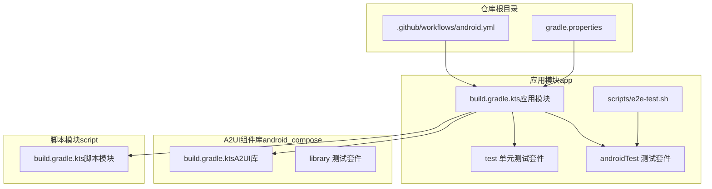
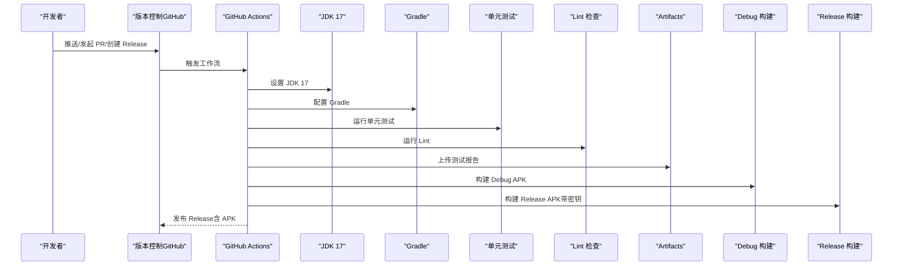
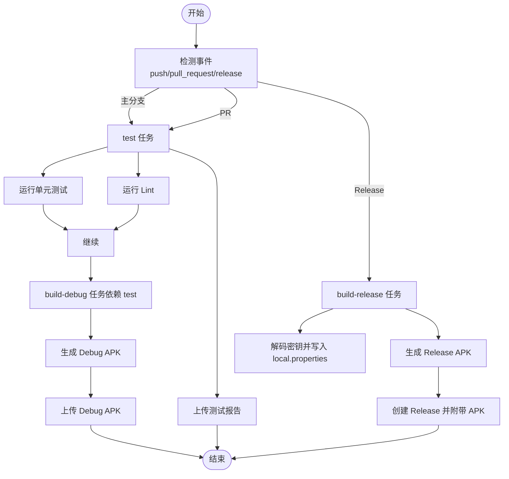
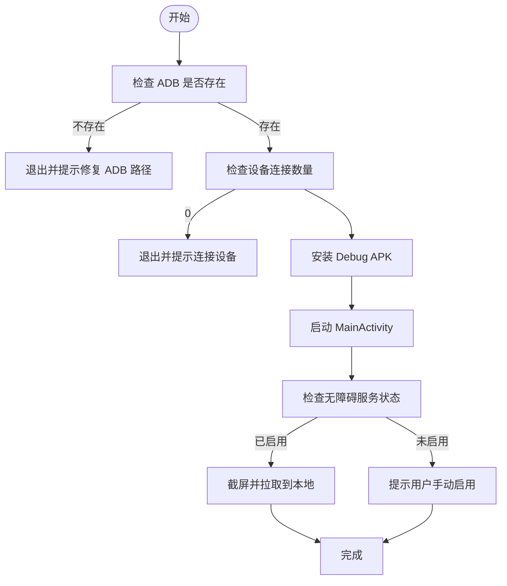
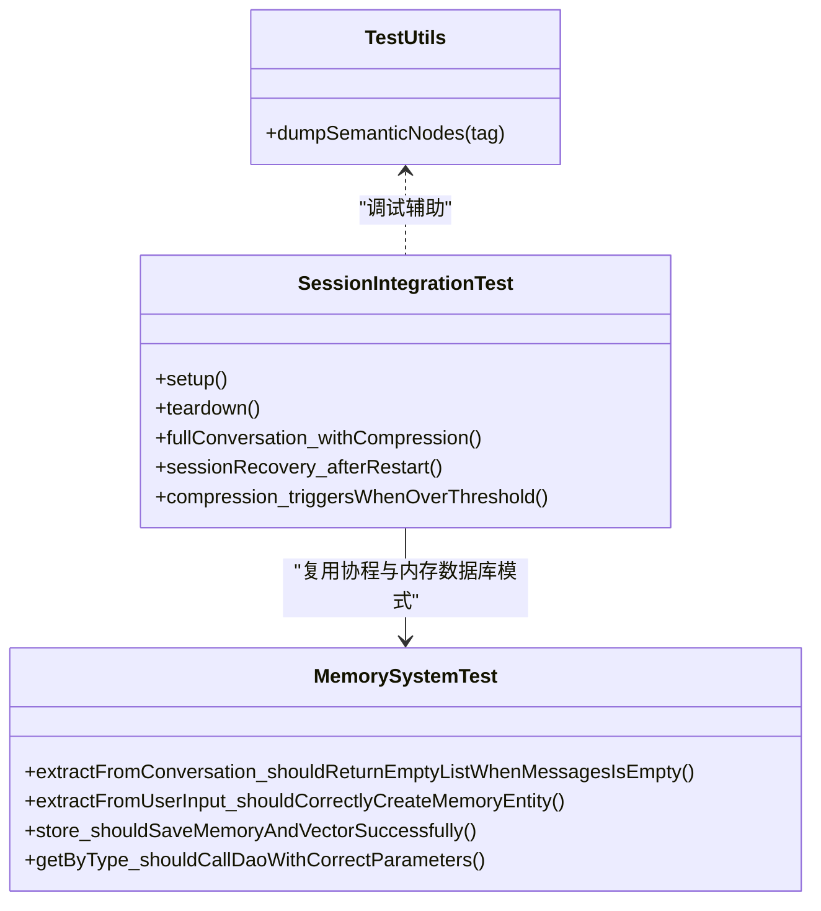
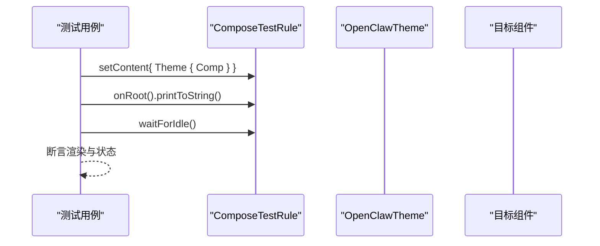
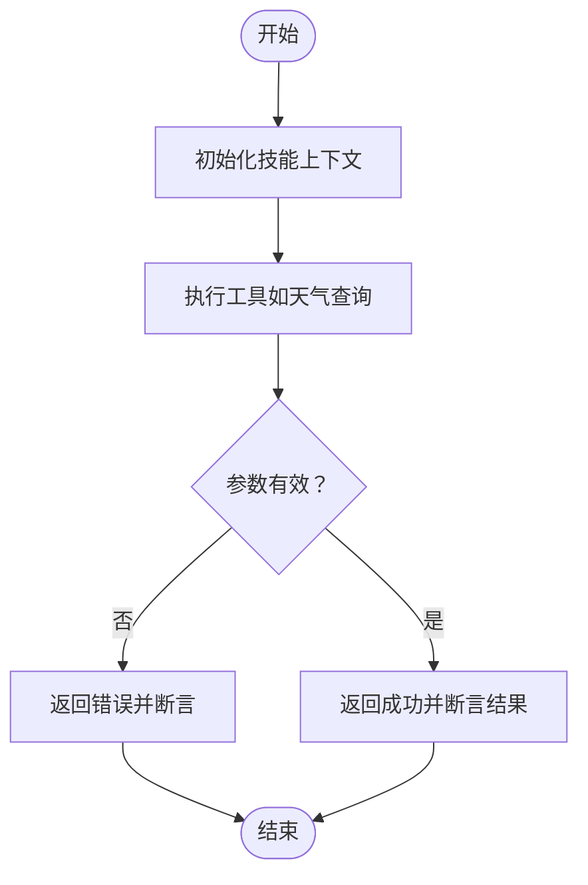
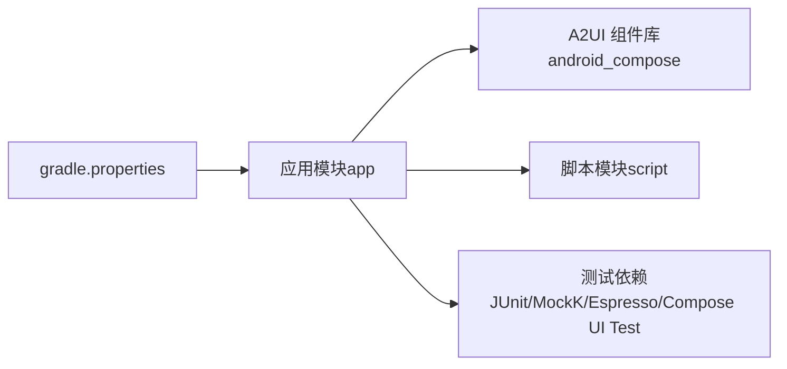

# 测试自动化

<cite>
**本文引用的文件**
- [android.yml](file://.github/workflows/android.yml)
- [e2e-test.sh](file://scripts/e2e-test.sh)
- [TestUtils.kt](file://app/src/androidTest/java/ai/openclaw/android/TestUtils.kt)
- [build.gradle.kts（应用模块）](file://app/build.gradle.kts)
- [build.gradle.kts（A2UI库）](file://android_compose/build.gradle.kts)
- [build.gradle.kts（脚本模块）](file://script/build.gradle.kts)
- [gradle.properties](file://gradle.properties)
- [ChatScreenTest.kt](file://app/src/androidTest/java/ai/openclaw/android/ChatScreenTest.kt)
- [SessionIntegrationTest.kt](file://app/src/androidTest/java/ai/openclaw/android/session/SessionIntegrationTest.kt)
- [WeatherSkillTest.kt](file://app/src/test/java/ai/openclaw/android/skill/builtin/WeatherSkillTest.kt)
- [MemorySystemTest.kt](file://app/src/test/java/ai/openclaw/android/domain/memory/MemorySystemTest.kt)
- [EnergyBarTest.kt](file://app/src/androidTest/java/ai/openclaw/android/ui/components/EnergyBarTest.kt)
</cite>

## 目录
1. [引言](#引言)
2. [项目结构](#项目结构)
3. [核心组件](#核心组件)
4. [架构总览](#架构总览)
5. [详细组件分析](#详细组件分析)
6. [依赖关系分析](#依赖关系分析)
7. [性能考量](#性能考量)
8. [故障排查指南](#故障排查指南)
9. [结论](#结论)
10. [附录](#附录)

## 引言
本文件面向测试自动化与持续集成/持续部署（CI/CD）场景，系统性梳理本项目的测试自动化配置与流水线设计，覆盖以下主题：
- GitHub Actions 工作流的实现与测试流水线设计
- 端到端测试脚本的编写与执行策略
- 测试报告生成与质量门禁机制
- 自动化测试的监控与告警建议
- 测试环境的容器化与并行执行优化
- 测试数据管理与测试资源复用策略

## 项目结构
本项目采用多模块结构，测试相关能力分布在应用模块、A2UI组件库与脚本模块中，并通过 Gradle 进行统一构建与测试编排。关键测试依赖与运行时配置集中在应用模块的构建脚本中。

**图表来源**
- [.github/workflows/android.yml:1-130](file://.github/workflows/android.yml#L1-L130)
- [gradle.properties:1-11](file://gradle.properties#L1-L11)
- [build.gradle.kts（应用模块）:1-217](file://app/build.gradle.kts#L1-L217)
- [build.gradle.kts（A2UI库）:1-84](file://android_compose/build.gradle.kts#L1-L84)
- [build.gradle.kts（脚本模块）:1-41](file://script/build.gradle.kts#L1-L41)

**章节来源**
- [.github/workflows/android.yml:1-130](file://.github/workflows/android.yml#L1-L130)
- [gradle.properties:1-11](file://gradle.properties#L1-L11)
- [build.gradle.kts（应用模块）:1-217](file://app/build.gradle.kts#L1-L217)
- [build.gradle.kts（A2UI库）:1-84](file://android_compose/build.gradle.kts#L1-L84)
- [build.gradle.kts（脚本模块）:1-41](file://script/build.gradle.kts#L1-L41)

## 核心组件
- GitHub Actions 工作流：定义了单元测试、Lint、构建 Debug/Release APK 的流水线，并在 PR 与主分支推送时触发。
- 端到端测试脚本：提供基于 ADB 的设备连接、安装 APK、启动应用、检查无障碍服务与截图等流程。
- 测试套件：
  - 应用模块的 Android Instrumentation 测试（UI、集成、领域模型）
  - 应用模块的单元测试（业务逻辑、技能工具）
  - A2UI 组件库的单元测试（组件渲染与内存泄漏）
- 构建与依赖：
  - 应用模块统一配置测试运行器、签名配置、ABI 过滤、Compose 支持与测试依赖。
  - Gradle 属性开启并行、缓存与配置缓存，提升构建性能。

**章节来源**
- [.github/workflows/android.yml:11-130](file://.github/workflows/android.yml#L11-L130)
- [scripts/e2e-test.sh:1-108](file://scripts/e2e-test.sh#L1-L108)
- [build.gradle.kts（应用模块）:43, 104-108, 193-216](file://app/build.gradle.kts#L43,L104-L108,L193-L216)
- [gradle.properties:8-11](file://gradle.properties#L8-L11)

## 架构总览
下图展示了从代码提交到产物发布的测试与构建路径，以及测试报告的归档与发布流程。

**图表来源**
- [.github/workflows/android.yml:12-130](file://.github/workflows/android.yml#L12-L130)

## 详细组件分析

### GitHub Actions 工作流（CI/CD 测试流水线）
- 触发条件：主分支推送、PR、Release 创建。
- 任务划分：
  - test：运行单元测试与 Lint，无论成功与否均上传测试报告。
  - build-debug：依赖 test 成功后构建 Debug APK 并上传制品。
  - build-release：依赖 test 成功且标签前缀为 v 时构建 Release APK，解码密钥、写入 local.properties，上传制品并创建 Release。
- 质量门禁：当前工作流未显式设置失败即停止或阈值校验；可扩展为“只要任一步骤失败则中断”。

**图表来源**
- [.github/workflows/android.yml:3-130](file://.github/workflows/android.yml#L3-L130)

**章节来源**
- [.github/workflows/android.yml:1-130](file://.github/workflows/android.yml#L1-L130)

### 端到端测试脚本（e2e-test.sh）
- 设备与路径适配：针对 WSL 环境将路径转换为 Windows 可用路径，确保 ADB 与 APK 安装路径正确。
- 步骤清单：
  - 检查 ADB 与设备连接数
  - 安装 Debug APK（需先构建）
  - 启动应用 MainActivity
  - 检查无障碍服务是否启用（手动提示）
  - 截图并拉取至本地临时目录
- 执行建议：在 CI 中结合 Android Emulator 或物理设备，确保无障碍服务与权限已配置。

**图表来源**
- [scripts/e2e-test.sh:23-108](file://scripts/e2e-test.sh#L23-L108)

**章节来源**
- [scripts/e2e-test.sh:1-108](file://scripts/e2e-test.sh#L1-L108)

### 测试报告生成与质量门禁
- 当前工作流：test 任务结束后无论结果如何均上传 app/build/reports/ 目录下的测试报告。
- 质量门禁建议：
  - 在 test 任务中增加“只要测试失败即终止”的策略。
  - 对关键模块（如 app、android_compose、script）分别统计通过率与失败数，设定阈值。
  - 将报告上传为 GitHub Artifacts，便于 PR/Issue 附件下载与审计。

**章节来源**
- [.github/workflows/android.yml:38-43](file://.github/workflows/android.yml#L38-L43)

### 测试数据管理与资源复用
- 内存数据库（Room in-memory）：在集成测试中使用内存数据库，避免磁盘副作用，测试结束后关闭数据库实例。
- 协程测试：使用协程测试入口运行异步逻辑，确保状态收敛后再断言。
- 组件测试工具：提供 Compose 语义树打印工具，辅助调试 UI 渲染问题。

**图表来源**
- [SessionIntegrationTest.kt:26-112](file://app/src/androidTest/java/ai/openclaw/android/session/SessionIntegrationTest.kt#L26-L112)
- [MemorySystemTest.kt:15-103](file://app/src/test/java/ai/openclaw/android/domain/memory/MemorySystemTest.kt#L15-L103)
- [TestUtils.kt:14-16](file://app/src/androidTest/java/ai/openclaw/android/TestUtils.kt#L14-L16)

**章节来源**
- [SessionIntegrationTest.kt:26-112](file://app/src/androidTest/java/ai/openclaw/android/session/SessionIntegrationTest.kt#L26-L112)
- [MemorySystemTest.kt:15-103](file://app/src/test/java/ai/openclaw/android/domain/memory/MemorySystemTest.kt#L15-L103)
- [TestUtils.kt:14-16](file://app/src/androidTest/java/ai/openclaw/android/TestUtils.kt#L14-L16)

### UI 组件测试与策略
- Compose UI 测试：通过 ComposeTestRule 构建最小化 UI 场景，验证渲染、交互与状态变化。
- 示例测试：
  - 能量条组件渲染与动画状态切换
  - 聊天界面的消息列表、输入框与发送按钮交互
- 调试辅助：使用 dumpSemanticNodes 输出语义树，定位节点与可访问性描述。

**图表来源**
- [EnergyBarTest.kt:25-59](file://app/src/androidTest/java/ai/openclaw/android/ui/components/EnergyBarTest.kt#L25-L59)
- [ChatScreenTest.kt:25-84](file://app/src/androidTest/java/ai/openclaw/android/ChatScreenTest.kt#L25-L84)
- [TestUtils.kt:14-16](file://app/src/androidTest/java/ai/openclaw/android/TestUtils.kt#L14-L16)

**章节来源**
- [EnergyBarTest.kt:15-59](file://app/src/androidTest/java/ai/openclaw/android/ui/components/EnergyBarTest.kt#L15-L59)
- [ChatScreenTest.kt:18-124](file://app/src/androidTest/java/ai/openclaw/android/ChatScreenTest.kt#L18-L124)
- [TestUtils.kt:14-16](file://app/src/androidTest/java/ai/openclaw/android/TestUtils.kt#L14-L16)

### 技能与业务逻辑测试
- 技能工具参数校验：对缺失参数、空参数、未初始化客户端等情况进行断言，保证错误路径可预期。
- 元数据与工具参数：验证技能 ID、名称、版本与工具参数的类型与必填项。
- 协程与异步：使用协程测试入口运行异步逻辑，确保断言在任务完成后执行。

**图表来源**
- [WeatherSkillTest.kt:28-115](file://app/src/test/java/ai/openclaw/android/skill/builtin/WeatherSkillTest.kt#L28-L115)

**章节来源**
- [WeatherSkillTest.kt:15-115](file://app/src/test/java/ai/openclaw/android/skill/builtin/WeatherSkillTest.kt#L15-L115)

## 依赖关系分析
- 模块依赖：
  - 应用模块依赖 A2UI 组件库与脚本模块，形成 UI 与脚本能力的统一测试入口。
  - A2UI 库与脚本模块各自维护独立的测试套件，减少耦合。
- 构建与测试依赖：
  - 应用模块集中声明 JUnit、MockK、Mockito、Coroutines Test、Espresso、Compose UI Test 等依赖。
  - Gradle 属性开启并行、缓存与配置缓存，缩短构建时间。

**图表来源**
- [build.gradle.kts（应用模块）:189-216](file://app/build.gradle.kts#L189-L216)
- [build.gradle.kts（A2UI库）:41-76](file://android_compose/build.gradle.kts#L41-L76)
- [build.gradle.kts（脚本模块）:27-40](file://script/build.gradle.kts#L27-L40)
- [gradle.properties:8-11](file://gradle.properties#L8-L11)

**章节来源**
- [build.gradle.kts（应用模块）:189-216](file://app/build.gradle.kts#L189-L216)
- [build.gradle.kts（A2UI库）:41-76](file://android_compose/build.gradle.kts#L41-L76)
- [build.gradle.kts（脚本模块）:27-40](file://script/build.gradle.kts#L27-L40)
- [gradle.properties:8-11](file://gradle.properties#L8-L11)

## 性能考量
- 构建加速：
  - 并行构建、构建缓存与配置缓存已在 Gradle 属性中启用，建议保持默认以获得最佳收益。
- ABI 优化：
  - 应用模块仅保留 arm64-v8a，减少 APK 体积与安装时间，仅在需要模拟器时考虑其他架构。
- 测试执行：
  - 使用内存数据库与轻量级依赖，缩短集成测试时长。
  - UI 测试尽量最小化组合场景，优先断言关键交互路径。

**章节来源**
- [gradle.properties:8-11](file://gradle.properties#L8-L11)
- [build.gradle.kts（应用模块）:38-41](file://app/build.gradle.kts#L38-L41)

## 故障排查指南
- ADB 与设备问题：
  - 确认 ADB 路径与设备连接数；若无设备，按提示连接并启用 USB 调试。
- APK 安装失败：
  - 确保已先执行构建命令生成 Debug APK；检查 APK 路径与权限。
- 无障碍服务未启用：
  - 按提示在系统设置中手动启用无障碍服务。
- 截图失败：
  - 检查设备存储空间与 ADB 权限；确认截图拉取路径与 WSL/Windows 路径映射。
- 测试报告缺失：
  - 确认工作流中上传测试报告步骤已执行；检查 artifacts 下载链接。

**章节来源**
- [scripts/e2e-test.sh:23-108](file://scripts/e2e-test.sh#L23-L108)
- [.github/workflows/android.yml:38-43](file://.github/workflows/android.yml#L38-L43)

## 结论
本项目已具备完善的 CI 流水线与多层级测试能力：单元测试、集成测试与 UI 测试协同工作，配合端到端脚本与报告归档，形成了从提交到发布的闭环。为进一步提升稳定性与效率，建议引入质量门禁阈值、容器化测试环境与并行执行策略，并完善监控与告警机制。

## 附录
- 测试覆盖率与报告：可在现有上传 Artifacts 基础上扩展 JaCoCo 或其他覆盖率工具，并在工作流中输出 HTML 报告。
- 容器化与并行：使用 Docker 承载 Android SDK 与 Gradle 环境，结合 GitHub Hosted Runner 或自托管 Runner 实现并行作业。
- 告警：在工作流中集成 Slack/Teams Webhook，在测试失败或报告异常时自动通知。