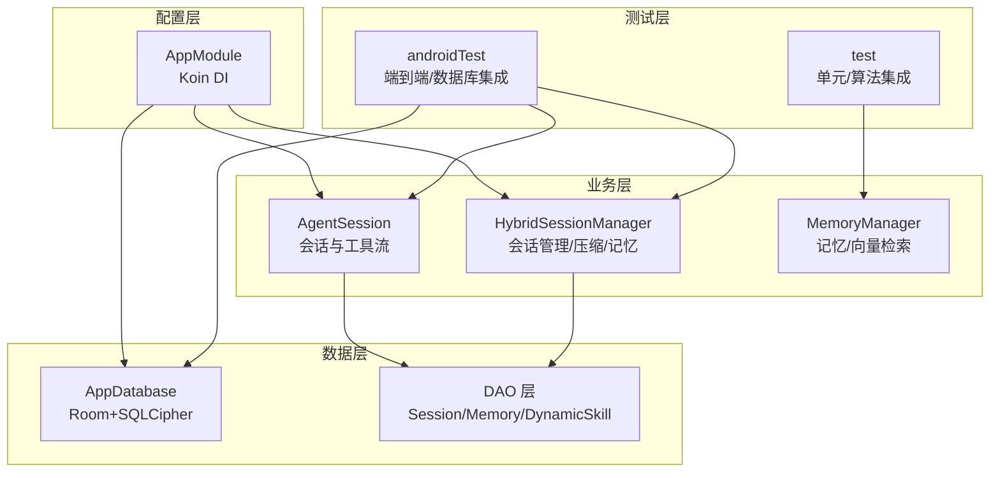
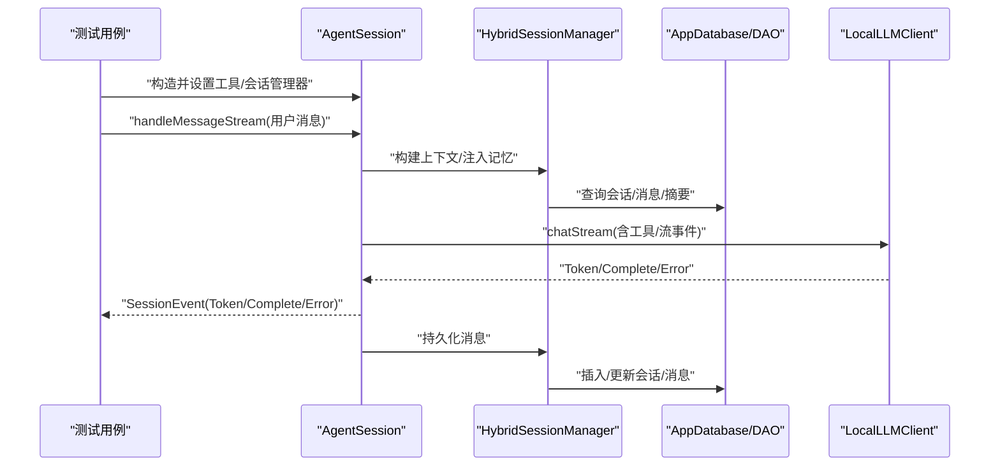
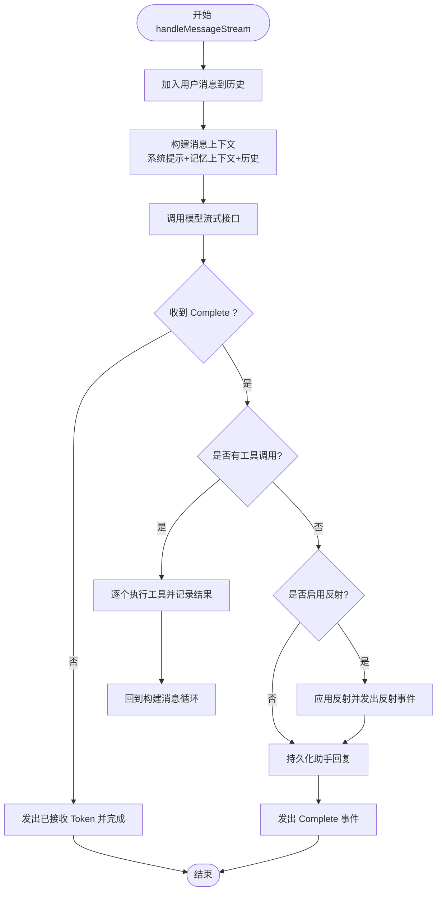
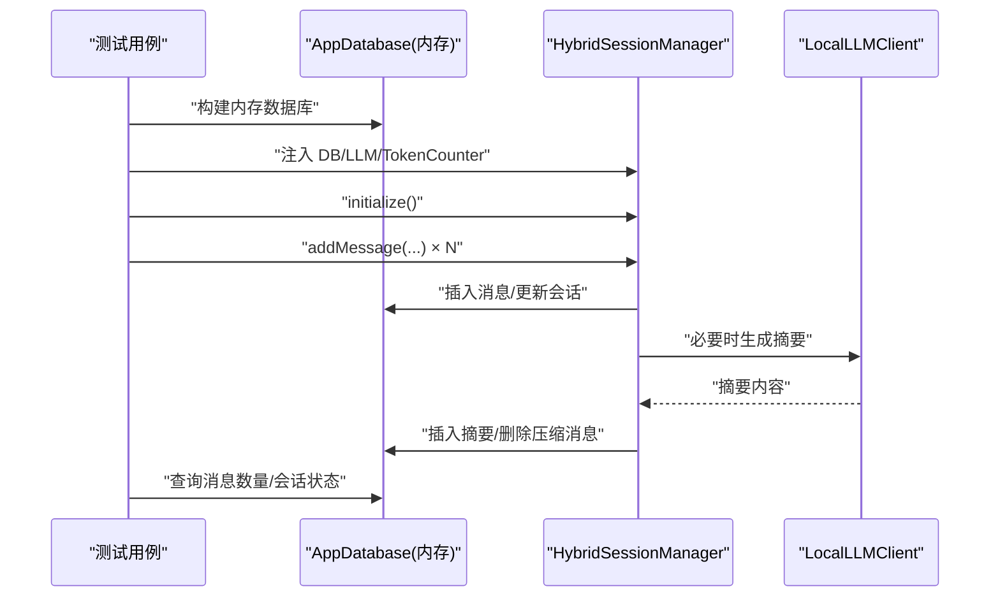
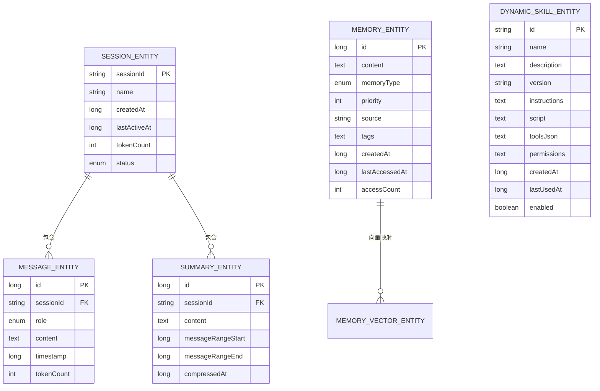
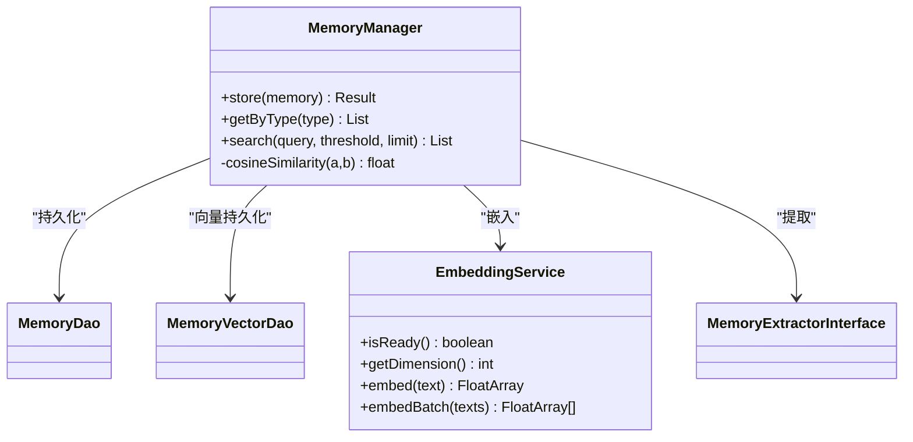
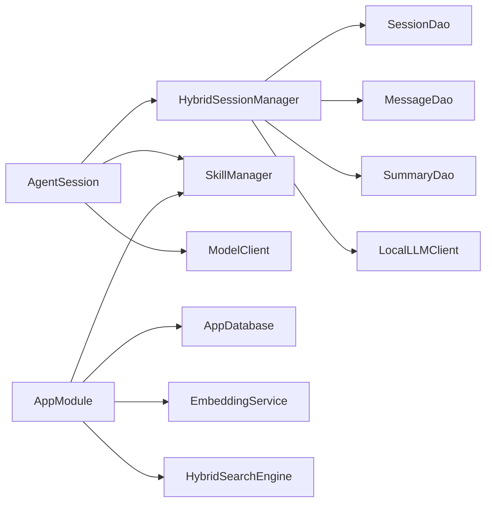

# 集成测试

<cite>
**本文引用的文件**
- [AgentSessionTest.kt](file://app/src/androidTest/java/ai/openclaw/android/agent/AgentSessionTest.kt)
- [SessionIntegrationTest.kt](file://app/src/androidTest/java/ai/openclaw/android/session/SessionIntegrationTest.kt)
- [DynamicSkillDaoTest.kt](file://app/src/androidTest/java/ai/openclaw/android/data/DynamicSkillDaoTest.kt)
- [MemoryDaoTest.kt](file://app/src/androidTest/java/ai/openclaw/android/data/MemoryDaoTest.kt)
- [SessionDaoTest.kt](file://app/src/androidTest/java/ai/openclaw/android/data/SessionDaoTest.kt)
- [HybridSessionManagerTest.kt](file://app/src/androidTest/java/ai/openclaw/android/domain/session/HybridSessionManagerTest.kt)
- [TfLiteEmbeddingServiceTest.kt](file://app/src/androidTest/java/ai/openclaw/android/ml/TfLiteEmbeddingServiceTest.kt)
- [MemorySystemTest.kt](file://app/src/test/java/ai/openclaw/android/domain/memory/MemorySystemTest.kt)
- [VectorSearchTest.kt](file://app/src/test/java/ai/openclaw/android/domain/memory/VectorSearchTest.kt)
- [FeishuClientTest.kt](file://app/src/test/java/ai/openclaw/android/feishu/FeishuClientTest.kt)
- [TestUtils.kt](file://app/src/androidTest/java/ai/openclaw/android/TestUtils.kt)
- [AppModule.kt](file://app/src/main/java/ai/openclaw/android/di/AppModule.kt)
- [AppDatabase.kt](file://app/src/main/java/ai/openclaw/android/data/local/AppDatabase.kt)
- [HybridSessionManager.kt](file://app/src/main/java/ai/openclaw/android/domain/session/HybridSessionManager.kt)
- [AgentSession.kt](file://app/src/main/java/ai/openclaw/android/agent/AgentSession.kt)
</cite>

## 目录
1. [简介](#简介)
2. [项目结构](#项目结构)
3. [核心组件](#核心组件)
4. [架构总览](#架构总览)
5. [详细组件分析](#详细组件分析)
6. [依赖关系分析](#依赖关系分析)
7. [性能考量](#性能考量)
8. [故障排除指南](#故障排除指南)
9. [结论](#结论)
10. [附录](#附录)

## 简介
本文件面向集成测试，系统性阐述跨模块集成测试的设计与实现方法，覆盖端到端测试场景（如 AgentSessionTest、SessionIntegrationTest）、数据库集成测试、网络客户端测试策略、测试环境搭建与依赖注入配置、测试数据准备与清理机制、调试与故障排除技巧，以及测试隔离与并发测试处理方案。目标是帮助读者快速理解并高效扩展该工程的集成测试体系。

## 项目结构
本项目采用按模块与层次划分的组织方式：
- androidTest：端到端与数据库集成测试，使用 Room 内存数据库与真实业务组件（如 HybridSessionManager、AgentSession）进行集成验证。
- test：单元测试与部分集成测试（如内存系统与向量检索），通过 Mockk 模拟外部依赖，聚焦算法与流程正确性。
- main：核心业务逻辑与依赖注入配置，提供真实组件实例（如 AppDatabase、AppModule）。

图表来源
- [AppModule.kt:24-79](file://app/src/main/java/ai/openclaw/android/di/AppModule.kt#L24-L79)
- [AppDatabase.kt:31-41](file://app/src/main/java/ai/openclaw/android/data/local/AppDatabase.kt#L31-L41)
- [HybridSessionManager.kt:31-38](file://app/src/main/java/ai/openclaw/android/domain/session/HybridSessionManager.kt#L31-L38)
- [AgentSession.kt:35-40](file://app/src/main/java/ai/openclaw/android/agent/AgentSession.kt#L35-L40)

章节来源
- [AppModule.kt:24-79](file://app/src/main/java/ai/openclaw/android/di/AppModule.kt#L24-L79)
- [AppDatabase.kt:31-41](file://app/src/main/java/ai/openclaw/android/data/local/AppDatabase.kt#L31-L41)

## 核心组件
- 依赖注入（Koin）：集中管理数据库、技能管理器、嵌入服务、混合搜索等单例，确保测试与生产一致的组件装配。
- 数据库（Room + SQLCipher）：提供内存数据库与磁盘数据库两种模式，支持迁移与全文检索虚拟表。
- 会话管理（HybridSessionManager）：负责会话初始化、消息持久化、上下文构建、摘要压缩、跨轮次记忆注入。
- 代理会话（AgentSession）：封装与模型客户端交互、工具调用、流式输出、反射优化与历史修剪。
- 内存系统（MemoryManager + 向量检索）：基于嵌入服务与余弦相似度的向量检索，支持阈值过滤与限制返回数量。

章节来源
- [AppModule.kt:24-79](file://app/src/main/java/ai/openclaw/android/di/AppModule.kt#L24-L79)
- [AppDatabase.kt:31-41](file://app/src/main/java/ai/openclaw/android/data/local/AppDatabase.kt#L31-L41)
- [HybridSessionManager.kt:31-38](file://app/src/main/java/ai/openclaw/android/domain/session/HybridSessionManager.kt#L31-L38)
- [AgentSession.kt:35-40](file://app/src/main/java/ai/openclaw/android/agent/AgentSession.kt#L35-L40)

## 架构总览
下图展示集成测试中各模块的交互路径与数据流向，重点体现端到端测试（AgentSessionTest、SessionIntegrationTest）与数据库测试（DAO 层）的协作关系。

图表来源
- [AgentSessionTest.kt:34-50](file://app/src/androidTest/java/ai/openclaw/android/agent/AgentSessionTest.kt#L34-L50)
- [SessionIntegrationTest.kt:33-40](file://app/src/androidTest/java/ai/openclaw/android/session/SessionIntegrationTest.kt#L33-L40)
- [HybridSessionManager.kt:155-202](file://app/src/main/java/ai/openclaw/android/domain/session/HybridSessionManager.kt#L155-L202)
- [AgentSession.kt:451-556](file://app/src/main/java/ai/openclaw/android/agent/AgentSession.kt#L451-L556)

## 详细组件分析

### AgentSession 端到端流式测试（AgentSessionTest）
- 设计要点
  - 使用“假模型客户端”（不依赖外部服务）模拟流式响应，覆盖文本流、工具调用、finish_reason 回归、空流错误、多轮历史维护、模型错误传播等场景。
  - 通过协程测试框架 runTest 进行异步断言，保证事件顺序与完整性。
- 关键测试场景
  - 文本流：校验 Token 与 Complete 事件的拼接与最终文本一致性。
  - 工具调用：校验 ToolExecuting、ToolResult 与后续 Complete 的组合行为。
  - finish_reason 回归：确保 tool_calls 场景能正确触发工具执行。
  - 空流错误：确保在无 Complete 的情况下发出错误事件。
  - 多轮历史：验证历史累积与消息保留策略。
  - 模型错误：验证错误事件透传。
- 断言与期望
  - 事件类型与数量断言（Token/Complete/Error/ToolExecuting/ToolResult）。
  - 历史长度与内容断言。
  - 错误消息断言。

图表来源
- [AgentSessionTest.kt:54-141](file://app/src/androidTest/java/ai/openclaw/android/agent/AgentSessionTest.kt#L54-L141)
- [AgentSession.kt:451-556](file://app/src/main/java/ai/openclaw/android/agent/AgentSession.kt#L451-L556)

章节来源
- [AgentSessionTest.kt:34-282](file://app/src/androidTest/java/ai/openclaw/android/agent/AgentSessionTest.kt#L34-L282)
- [AgentSession.kt:451-556](file://app/src/main/java/ai/openclaw/android/agent/AgentSession.kt#L451-L556)

### 会话管理集成测试（SessionIntegrationTest）
- 设计要点
  - 使用 Room 内存数据库构建 AppDatabase 实例，注入 HybridSessionManager，验证会话初始化、消息持久化、会话恢复、压缩触发等端到端流程。
  - 通过 runTest 保证协程场景下的可预测性。
- 关键测试场景
  - 完整对话与上下文构建：验证消息写入与上下文大小。
  - 会话恢复：重启后仍能恢复同一会话 ID 与上下文。
  - 压缩触发：大量消息写入后，消息数量应小于阈值（摘要替代）。
- 断言与期望
  - 会话 ID 一致性。
  - 消息数量与压缩效果。
  - 上下文包含预期内容。

图表来源
- [SessionIntegrationTest.kt:26-46](file://app/src/androidTest/java/ai/openclaw/android/session/SessionIntegrationTest.kt#L26-L46)
- [HybridSessionManager.kt:236-299](file://app/src/main/java/ai/openclaw/android/domain/session/HybridSessionManager.kt#L236-L299)

章节来源
- [SessionIntegrationTest.kt:48-112](file://app/src/androidTest/java/ai/openclaw/android/session/SessionIntegrationTest.kt#L48-L112)
- [HybridSessionManager.kt:236-299](file://app/src/main/java/ai/openclaw/android/domain/session/HybridSessionManager.kt#L236-L299)

### 数据库集成测试（DAO 层）
- DynamicSkillDaoTest
  - 验证动态技能实体的插入、查询、禁用、删除、冲突替换、排序等行为。
  - 使用内存数据库与破坏性迁移，确保测试隔离与一致性。
- MemoryDaoTest
  - 验证记忆实体的插入、按类型查询、高优先级查询、访问信息更新、删除等。
- SessionDaoTest
  - 验证会话实体的插入、查询、更新、删除、默认会话名称为空等。

图表来源
- [DynamicSkillDaoTest.kt:40-188](file://app/src/androidTest/java/ai/openclaw/android/data/DynamicSkillDaoTest.kt#L40-L188)
- [MemoryDaoTest.kt:33-142](file://app/src/androidTest/java/ai/openclaw/android/data/MemoryDaoTest.kt#L33-L142)
- [SessionDaoTest.kt:33-123](file://app/src/androidTest/java/ai/openclaw/android/data/SessionDaoTest.kt#L33-L123)

章节来源
- [DynamicSkillDaoTest.kt:40-229](file://app/src/androidTest/java/ai/openclaw/android/data/DynamicSkillDaoTest.kt#L40-L229)
- [MemoryDaoTest.kt:33-166](file://app/src/androidTest/java/ai/openclaw/android/data/MemoryDaoTest.kt#L33-L166)
- [SessionDaoTest.kt:33-154](file://app/src/androidTest/java/ai/openclaw/android/data/SessionDaoTest.kt#L33-L154)

### 内存系统与向量检索（单元/集成）
- MemorySystemTest
  - 验证记忆提取器与 MemoryManager 的行为：空输入返回空、用户输入记忆创建、存储成功、按类型查询等。
  - 通过 Mockk 模拟嵌入服务与 DAO，确保流程正确性。
- VectorSearchTest
  - 验证余弦相似度计算边界条件与维度一致性；通过 MockEmbeddingService 提供确定性向量，测试检索阈值过滤、限制返回数量、缺失记忆的容错等。

图表来源
- [MemorySystemTest.kt:44-103](file://app/src/test/java/ai/openclaw/android/domain/memory/MemorySystemTest.kt#L44-L103)
- [VectorSearchTest.kt:159-291](file://app/src/test/java/ai/openclaw/android/domain/memory/VectorSearchTest.kt#L159-L291)

章节来源
- [MemorySystemTest.kt:15-103](file://app/src/test/java/ai/openclaw/android/domain/memory/MemorySystemTest.kt#L15-L103)
- [VectorSearchTest.kt:159-291](file://app/src/test/java/ai/openclaw/android/domain/memory/VectorSearchTest.kt#L159-L291)

### 网络客户端测试策略（FeishuClient）
- 通过序列化/反序列化测试模型结构的正确性，验证事件结构与字段映射。
- 对 OkHttpFeishuClient 的接口实现进行存在性检查，便于后续引入网络测试（如结合 MockWebServer）。

章节来源
- [FeishuClientTest.kt:22-149](file://app/src/test/java/ai/openclaw/android/feishu/FeishuClientTest.kt#L22-L149)

### 模型嵌入服务测试（TfLiteEmbeddingService）
- 验证嵌入维度与就绪状态（初始化前为 false）。
- 完整测试需模型文件，当前作为占位以指导后续完善。

章节来源
- [TfLiteEmbeddingServiceTest.kt:20-31](file://app/src/androidTest/java/ai/openclaw/android/ml/TfLiteEmbeddingServiceTest.kt#L20-L31)

### 依赖注入与测试环境配置
- AppModule：集中声明数据库、技能管理器、嵌入服务、混合搜索等单例，确保测试与生产一致。
- AppDatabase：支持内存数据库与磁盘数据库（SQLCipher），并提供迁移与回调（FTS 虚拟表）。
- 在 androidTest 中通过 ApplicationProvider 获取 Context，Room.inMemoryDatabaseBuilder 构建内存数据库实例，避免污染与并发干扰。

章节来源
- [AppModule.kt:24-79](file://app/src/main/java/ai/openclaw/android/di/AppModule.kt#L24-L79)
- [AppDatabase.kt:42-156](file://app/src/main/java/ai/openclaw/android/data/local/AppDatabase.kt#L42-L156)
- [SessionIntegrationTest.kt:26-46](file://app/src/androidTest/java/ai/openclaw/android/session/SessionIntegrationTest.kt#L26-L46)

## 依赖关系分析
- 组件耦合
  - AgentSession 依赖 SkillManager、ModelClient、PermissionManager 与 HybridSessionManager；HybridSessionManager 依赖 DAO 层与 LocalLLMClient。
  - AppModule 为上述组件提供统一注入入口，降低测试中重复装配成本。
- 外部依赖
  - Room/SQLCipher：本地持久化与加密。
  - Koin：依赖注入。
  - 协程：异步测试与流式处理。
- 潜在循环依赖
  - 当前结构清晰，未发现直接循环依赖；注意在测试中避免直接依赖注入容器，优先通过构造函数注入。

图表来源
- [AgentSession.kt:35-40](file://app/src/main/java/ai/openclaw/android/agent/AgentSession.kt#L35-L40)
- [HybridSessionManager.kt:31-38](file://app/src/main/java/ai/openclaw/android/domain/session/HybridSessionManager.kt#L31-L38)
- [AppModule.kt:24-79](file://app/src/main/java/ai/openclaw/android/di/AppModule.kt#L24-L79)

章节来源
- [AgentSession.kt:35-40](file://app/src/main/java/ai/openclaw/android/agent/AgentSession.kt#L35-L40)
- [HybridSessionManager.kt:31-38](file://app/src/main/java/ai/openclaw/android/domain/session/HybridSessionManager.kt#L31-L38)
- [AppModule.kt:24-79](file://app/src/main/java/ai/openclaw/android/di/AppModule.kt#L24-L79)

## 性能考量
- 流式处理与事件收集：在 AgentSession 的流式 API 中，建议在测试中控制事件数量与超时时间，避免长时间等待。
- 压缩阈值与上下文长度：HybridSessionManager 的压缩阈值直接影响性能与内存占用，测试中可通过大量消息触发压缩，验证吞吐与延迟。
- 向量检索：向量维度与批量嵌入会影响检索性能，建议在测试中固定维度与小批量数据，逐步扩大规模。
- 数据库事务：批量插入与删除应在事务内执行，避免频繁 IO 导致测试不稳定。

## 故障排除指南
- 测试卡顿或超时
  - 检查协程调度与超时设置，确保 runTest 正确包裹异步流程。
  - 减少一次性插入的数据量，分批写入。
- 数据库异常
  - 确认内存数据库在每个测试后关闭，避免跨用例污染。
  - 检查迁移脚本与虚拟表创建回调是否正确执行。
- 工具执行失败
  - 校验工具前缀过滤与权限检查逻辑，确保测试中提供正确的工具集合与权限。
- 流式事件缺失
  - 确保假模型客户端正确发出 Token/Complete/Error 事件，必要时在测试中显式断言事件队列。

章节来源
- [AgentSessionTest.kt:219-229](file://app/src/androidTest/java/ai/openclaw/android/agent/AgentSessionTest.kt#L219-L229)
- [SessionIntegrationTest.kt:43-46](file://app/src/androidTest/java/ai/openclaw/android/session/SessionIntegrationTest.kt#L43-L46)
- [AppDatabase.kt:132-156](file://app/src/main/java/ai/openclaw/android/data/local/AppDatabase.kt#L132-L156)

## 结论
本项目的集成测试体系以 Koin 依赖注入为核心，结合 Room 内存数据库与真实业务组件，实现了从端到端到数据库层面的全面覆盖。AgentSessionTest 与 SessionIntegrationTest 分别验证了流式交互与会话管理的正确性，DAO 层测试保障了数据持久化的可靠性，内存系统与向量检索测试则聚焦算法与流程稳定性。通过规范的测试数据准备与清理、调试工具与故障排除方法，能够有效支撑持续集成与迭代演进。

## 附录
- 测试数据准备与清理
  - 使用 Room.inMemoryDatabaseBuilder 构建内存数据库，测试结束后关闭数据库。
  - 在 DAO 测试中使用 runBlocking/runTest，确保事务与流式操作的可预测性。
- 调试方法
  - 使用 ComposeTestRule.dumpSemanticNodes 辅助 UI 相关测试的节点调试。
  - 在 AgentSession 流式测试中，逐步断言事件序列，定位问题发生阶段。
- 并发测试处理
  - 使用协程作用域与 SupervisorJob 管理任务生命周期，避免任务泄漏。
  - 在工具执行处使用互斥锁，防止并发工具调用导致的状态竞争。

章节来源
- [TestUtils.kt:11-16](file://app/src/androidTest/java/ai/openclaw/android/TestUtils.kt#L11-L16)
- [AgentSession.kt:262-262](file://app/src/main/java/ai/openclaw/android/agent/AgentSession.kt#L262-L262)
- [HybridSessionManager.kt:41-42](file://app/src/main/java/ai/openclaw/android/domain/session/HybridSessionManager.kt#L41-L42)