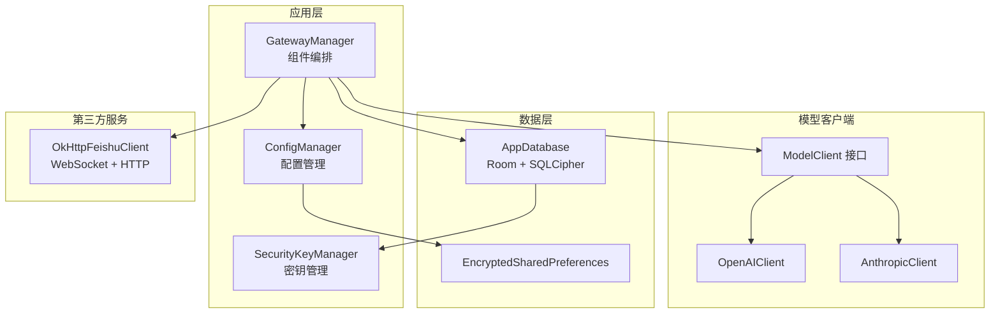
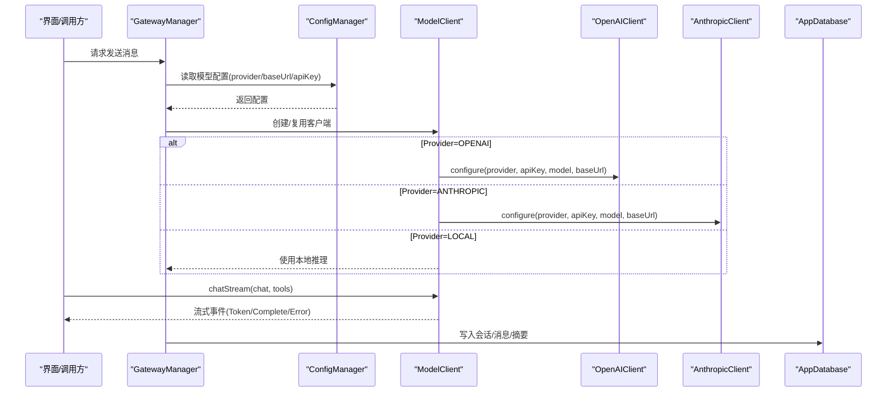
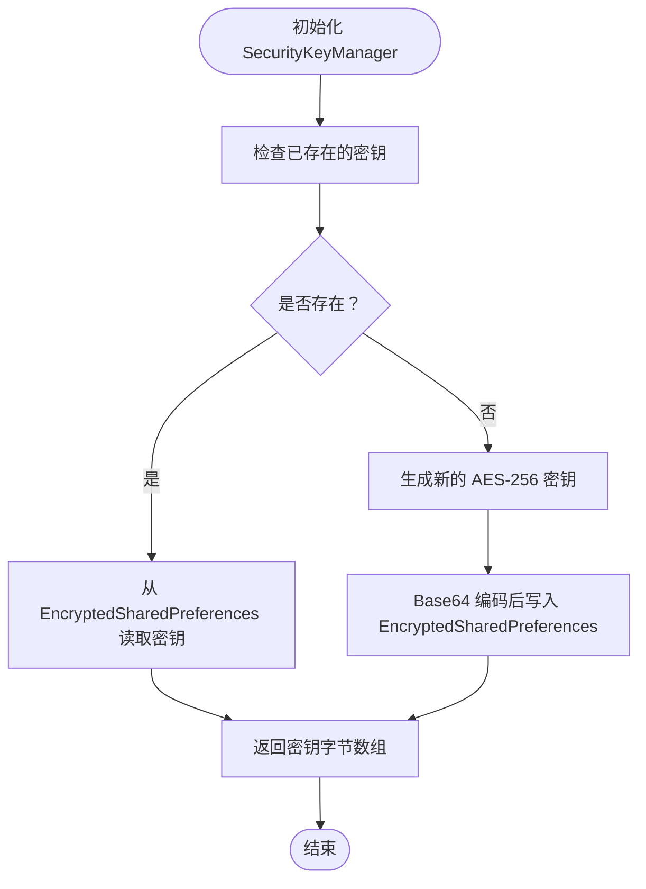
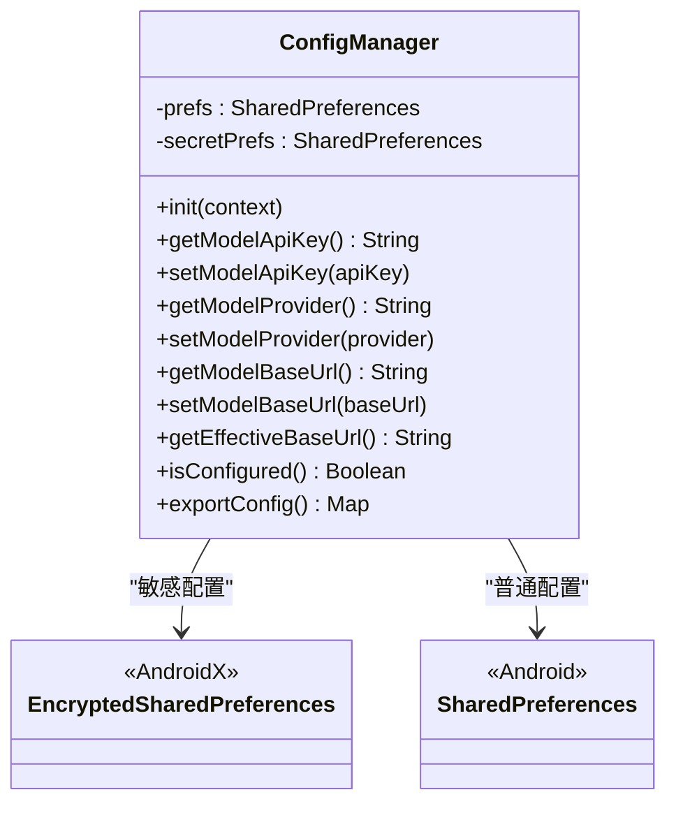
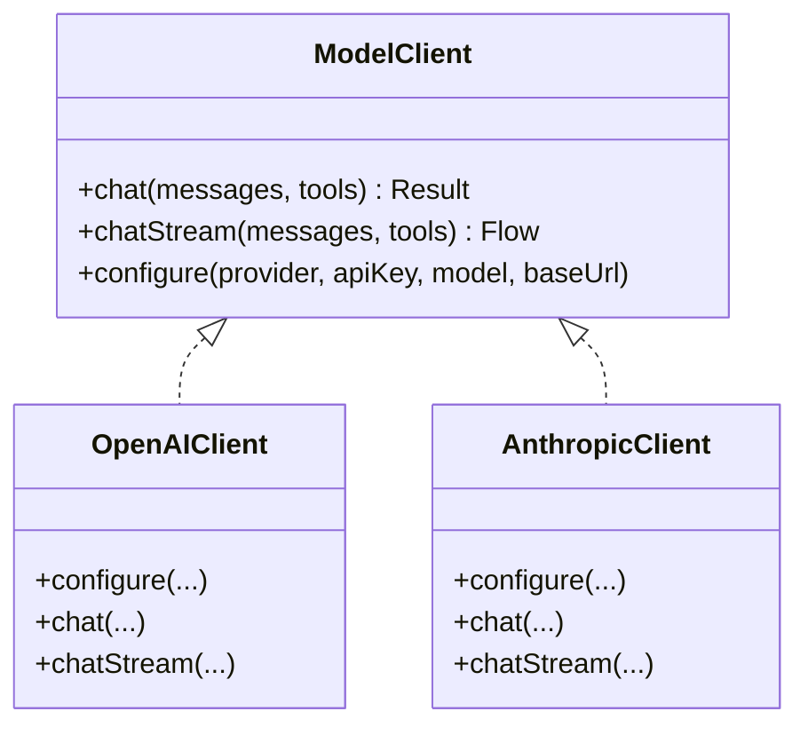
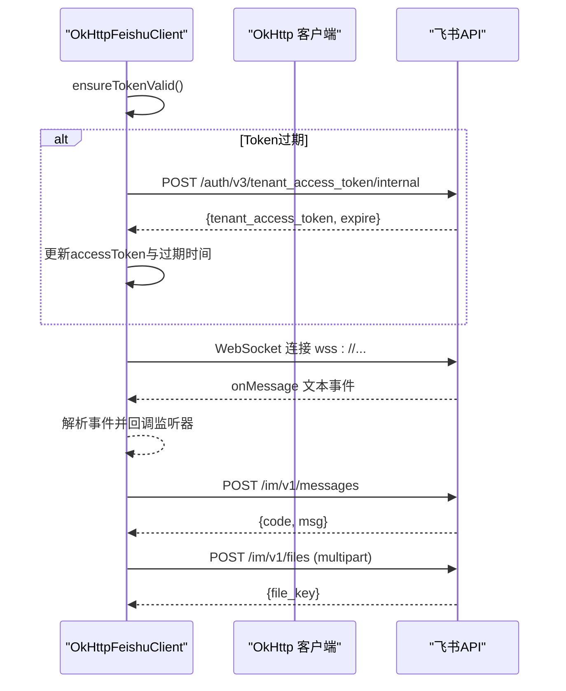
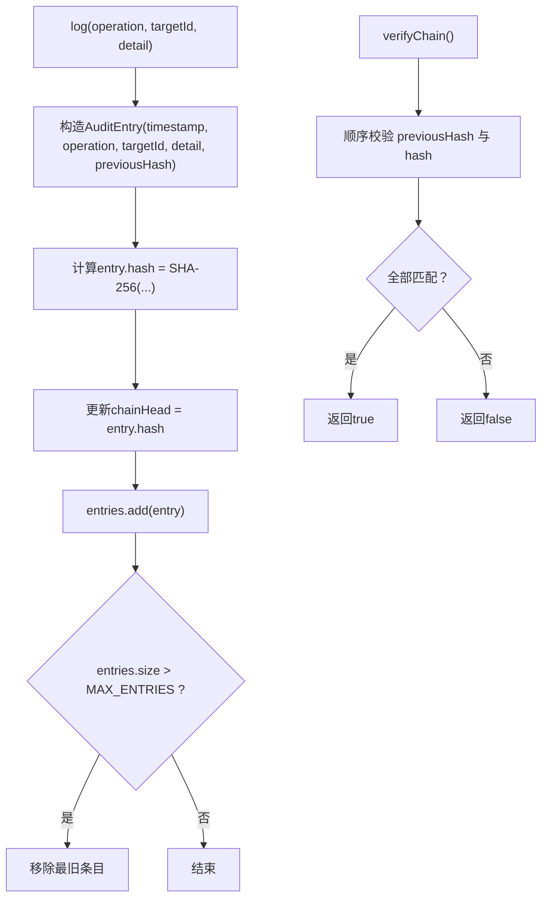
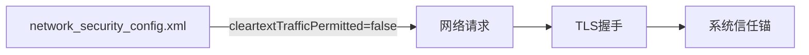
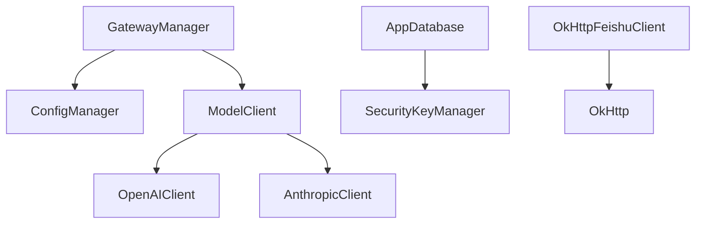

# API认证与安全

<cite>
**本文档引用的文件**
- [SecurityKeyManager.kt](file://app/src/main/java/ai/openclaw/android/security/SecurityKeyManager.kt)
- [ConfigManager.kt](file://app/src/main/java/ai/openclaw/android/ConfigManager.kt)
- [GatewayManager.kt](file://app/src/main/java/ai/openclaw/android/GatewayManager.kt)
- [OpenAIClient.kt](file://app/src/main/java/ai/openclaw/android/model/OpenAIClient.kt)
- [AnthropicClient.kt](file://app/src/main/java/ai/openclaw/android/model/AnthropicClient.kt)
- [OkHttpFeishuClient.kt](file://app/src/main/java/ai/openclaw/android/feishu/OkHttpFeishuClient.kt)
- [AuditLogger.kt](file://app/src/main/java/ai/openclaw/android/security/AuditLogger.kt)
- [AppDatabase.kt](file://app/src/main/java/ai/openclaw/android/data/local/AppDatabase.kt)
- [network_security_config.xml](file://app/src/main/res/xml/network_security_config.xml)
- [ModelClient.kt](file://app/src/main/java/ai/openclaw/android/model/ModelClient.kt)
</cite>

## 目录
1. [简介](#简介)
2. [项目结构](#项目结构)
3. [核心组件](#核心组件)
4. [架构总览](#架构总览)
5. [详细组件分析](#详细组件分析)
6. [依赖关系分析](#依赖关系分析)
7. [性能考虑](#性能考虑)
8. [故障排除指南](#故障排除指南)
9. [结论](#结论)
10. [附录](#附录)

## 简介
本文件面向Android平台的API认证与安全，围绕以下主题展开：
- API密钥管理与安全存储
- 配置管理器的实现原理与加载流程
- 安全密钥管理器的加密存储与访问控制
- 多API提供商的认证方式与令牌管理（OpenAI、Anthropic、飞书）
- HTTPS配置与证书验证机制
- 安全审计与最佳实践
- 自定义认证方案的扩展指导

## 项目结构
本项目在应用层通过统一的网关管理器协调多个子系统，安全相关能力主要分布在以下模块：
- 安全存储与数据库加密：安全密钥管理器、加密SharedPreferences、Room数据库集成SQLCipher
- 配置管理：集中式配置管理器，区分明文与加密配置
- API客户端：OpenAI与Anthropic客户端，统一接口抽象
- 第三方服务集成：飞书WebSocket与HTTP客户端，内置令牌刷新与断线重连
- 网络安全：基于系统信任锚的网络配置，禁止明文流量

**图表来源**
- [GatewayManager.kt](file://app/src/main/java/ai/openclaw/android/GatewayManager.kt)
- [ConfigManager.kt](file://app/src/main/java/ai/openclaw/android/ConfigManager.kt)
- [SecurityKeyManager.kt](file://app/src/main/java/ai/openclaw/android/security/SecurityKeyManager.kt)
- [OpenAIClient.kt](file://app/src/main/java/ai/openclaw/android/model/OpenAIClient.kt)
- [AnthropicClient.kt](file://app/src/main/java/ai/openclaw/android/model/AnthropicClient.kt)
- [AppDatabase.kt](file://app/src/main/java/ai/openclaw/android/data/local/AppDatabase.kt)
- [OkHttpFeishuClient.kt](file://app/src/main/java/ai/openclaw/android/feishu/OkHttpFeishuClient.kt)

**章节来源**
- [GatewayManager.kt](file://app/src/main/java/ai/openclaw/android/GatewayManager.kt)
- [ConfigManager.kt](file://app/src/main/java/ai/openclaw/android/ConfigManager.kt)
- [SecurityKeyManager.kt](file://app/src/main/java/ai/openclaw/android/security/SecurityKeyManager.kt)
- [OpenAIClient.kt](file://app/src/main/java/ai/openclaw/android/model/OpenAIClient.kt)
- [AnthropicClient.kt](file://app/src/main/java/ai/openclaw/android/model/AnthropicClient.kt)
- [AppDatabase.kt](file://app/src/main/java/ai/openclaw/android/data/local/AppDatabase.kt)
- [OkHttpFeishuClient.kt](file://app/src/main/java/ai/openclaw/android/feishu/OkHttpFeishuClient.kt)

## 核心组件
- 安全密钥管理器：负责生成、存储与复用数据库加密密钥，结合Android Keystore与EncryptedSharedPreferences实现强保护。
- 配置管理器：区分普通配置与敏感配置，分别存储于普通SharedPreferences与EncryptedSharedPreferences，提供统一读写接口。
- 模型客户端：统一ModelClient接口，分别对接OpenAI与Anthropic，支持流式与非流式请求。
- 飞书客户端：基于OkHttp的WebSocket与HTTP客户端，内置令牌刷新与断线重连策略。
- 数据库：Room数据库集成SQLCipher，使用动态生成的密钥进行加密。

**章节来源**
- [SecurityKeyManager.kt](file://app/src/main/java/ai/openclaw/android/security/SecurityKeyManager.kt)
- [ConfigManager.kt](file://app/src/main/java/ai/openclaw/android/ConfigManager.kt)
- [ModelClient.kt](file://app/src/main/java/ai/openclaw/android/model/ModelClient.kt)
- [OkHttpFeishuClient.kt](file://app/src/main/java/ai/openclaw/android/feishu/OkHttpFeishuClient.kt)
- [AppDatabase.kt](file://app/src/main/java/ai/openclaw/android/data/local/AppDatabase.kt)

## 架构总览
下图展示从配置加载到API调用再到数据持久化的整体流程，以及安全控制点：

**图表来源**
- [GatewayManager.kt](file://app/src/main/java/ai/openclaw/android/GatewayManager.kt)
- [ConfigManager.kt](file://app/src/main/java/ai/openclaw/android/ConfigManager.kt)
- [OpenAIClient.kt](file://app/src/main/java/ai/openclaw/android/model/OpenAIClient.kt)
- [AnthropicClient.kt](file://app/src/main/java/ai/openclaw/android/model/AnthropicClient.kt)
- [AppDatabase.kt](file://app/src/main/java/ai/openclaw/android/data/local/AppDatabase.kt)

## 详细组件分析

### 安全密钥管理器（数据库加密）
- 密钥生成与存储：通过Android Keystore生成AES-256密钥，使用EncryptedSharedPreferences以Base64形式存储密钥。
- 生命周期：首次运行生成密钥并持久化；后续启动直接读取，确保数据库解密一致性。
- 与数据库集成：AppDatabase在构建时通过SupportOpenHelperFactory注入密钥，实现Room数据库的透明加密。

**图表来源**
- [SecurityKeyManager.kt](file://app/src/main/java/ai/openclaw/android/security/SecurityKeyManager.kt)
- [AppDatabase.kt](file://app/src/main/java/ai/openclaw/android/data/local/AppDatabase.kt)

**章节来源**
- [SecurityKeyManager.kt](file://app/src/main/java/ai/openclaw/android/security/SecurityKeyManager.kt)
- [AppDatabase.kt](file://app/src/main/java/ai/openclaw/android/data/local/AppDatabase.kt)

### 配置管理器（加密配置与加载流程）
- 分层存储：普通配置（如模型名称、提供商标识、基础URL）存储于普通SharedPreferences；敏感配置（API Key、飞书AppId/Secret）存储于EncryptedSharedPreferences。
- 加载与校验：启动时初始化两个SharedPreferences；提供hasModelCredentials、hasFeishuCredentials等校验方法；getEffectiveBaseUrl根据提供者与用户配置返回最终URL。
- 批量操作：clearAll清空配置；exportConfig导出非敏感配置用于调试。

**图表来源**
- [ConfigManager.kt](file://app/src/main/java/ai/openclaw/android/ConfigManager.kt)

**章节来源**
- [ConfigManager.kt](file://app/src/main/java/ai/openclaw/android/ConfigManager.kt)

### 模型客户端（OpenAI与Anthropic）
- 统一接口：ModelClient定义chat与chatStream，支持工具调用与流式输出。
- OpenAI客户端：支持SSE流式传输，构建消息数组（含图片时采用数组格式），设置Authorization头为Bearer Token。
- Anthropic客户端：适配Anthropic Messages API，处理content blocks与tool_use事件，支持SSE事件解析与工具调用聚合。

**图表来源**
- [ModelClient.kt](file://app/src/main/java/ai/openclaw/android/model/ModelClient.kt)
- [OpenAIClient.kt](file://app/src/main/java/ai/openclaw/android/model/OpenAIClient.kt)
- [AnthropicClient.kt](file://app/src/main/java/ai/openclaw/android/model/AnthropicClient.kt)

**章节来源**
- [ModelClient.kt](file://app/src/main/java/ai/openclaw/android/model/ModelClient.kt)
- [OpenAIClient.kt](file://app/src/main/java/ai/openclaw/android/model/OpenAIClient.kt)
- [AnthropicClient.kt](file://app/src/main/java/ai/openclaw/android/model/AnthropicClient.kt)

### 飞书客户端（WebSocket与HTTP）
- WebSocket连接：建立wss://open.feishu.cn连接，携带Authorization头。
- HTTP消息发送：POST /open-apis/im/v1/messages，使用Bearer Token鉴权。
- 文件上传：multipart/form-data上传至 /open-apis/im/v1/files，解析响应提取file_key。
- 令牌管理：定时刷新tenant_access_token，基于过期时间提前刷新；失败时调度指数退避重连。

**图表来源**
- [OkHttpFeishuClient.kt](file://app/src/main/java/ai/openclaw/android/feishu/OkHttpFeishuClient.kt)

**章节来源**
- [OkHttpFeishuClient.kt](file://app/src/main/java/ai/openclaw/android/feishu/OkHttpFeishuClient.kt)

### 安全审计日志
- 审计条目：记录操作类型、目标ID、详情与前一哈希，形成链式校验。
- 哈希链：每个条目包含前一哈希，链头初始为固定值，支持完整性校验。
- 导出与验证：提供导出文本与verifyChain校验方法，便于离线审计。

**图表来源**
- [AuditLogger.kt](file://app/src/main/java/ai/openclaw/android/security/AuditLogger.kt)

**章节来源**
- [AuditLogger.kt](file://app/src/main/java/ai/openclaw/android/security/AuditLogger.kt)

### HTTPS配置与证书验证
- 网络安全配置：禁用明文流量，仅信任系统证书锚点，提升传输层安全性。
- 客户端行为：OkHttp客户端默认使用系统信任链，配合网络配置确保TLS握手与证书验证。

**图表来源**
- [network_security_config.xml](file://app/src/main/res/xml/network_security_config.xml)

**章节来源**
- [network_security_config.xml](file://app/src/main/res/xml/network_security_config.xml)

## 依赖关系分析
- 组件耦合：
  - GatewayManager依赖ConfigManager与ModelClient接口，实现对多提供商的统一接入。
  - AppDatabase依赖SecurityKeyManager获取数据库密钥，实现端到端加密。
  - OkHttpFeishuClient依赖OkHttp与JSON解析，内部维护令牌状态与重连逻辑。
- 外部依赖：
  - AndroidX Security Crypto（EncryptedSharedPreferences）
  - Room + SQLCipher（数据库加密）
  - OkHttp（HTTP与WebSocket）

**图表来源**
- [GatewayManager.kt](file://app/src/main/java/ai/openclaw/android/GatewayManager.kt)
- [ConfigManager.kt](file://app/src/main/java/ai/openclaw/android/ConfigManager.kt)
- [OpenAIClient.kt](file://app/src/main/java/ai/openclaw/android/model/OpenAIClient.kt)
- [AnthropicClient.kt](file://app/src/main/java/ai/openclaw/android/model/AnthropicClient.kt)
- [AppDatabase.kt](file://app/src/main/java/ai/openclaw/android/data/local/AppDatabase.kt)
- [OkHttpFeishuClient.kt](file://app/src/main/java/ai/openclaw/android/feishu/OkHttpFeishuClient.kt)

**章节来源**
- [GatewayManager.kt](file://app/src/main/java/ai/openclaw/android/GatewayManager.kt)
- [AppDatabase.kt](file://app/src/main/java/ai/openclaw/android/data/local/AppDatabase.kt)

## 性能考虑
- 流式处理：模型客户端采用SSE流式传输，避免大响应一次性加载，降低内存峰值。
- 令牌估算：会话管理器使用轻量估算减少不必要的计算开销。
- 数据库加密：SQLCipher在保证安全的同时增加CPU开销，建议在设备能力范围内合理配置迁移与压缩策略。
- 网络超时：OkHttp设置合理的读/写/连接超时，避免阻塞影响用户体验。

## 故障排除指南
- 配置不完整导致启动失败：检查ConfigManager.isConfigured与hasModelCredentials，确保提供者、模型名与API Key配置齐全。
- 数据库无法打开：确认SecurityKeyManager生成的密钥可正常读取，AppDatabase构建时密钥传递无误。
- 飞书连接异常：检查令牌刷新流程与WebSocket监听器回调，关注断线重连延迟与最大退避时间。
- 网络请求失败：核对network_security_config.xml是否禁用明文，确保TLS证书链有效。

**章节来源**
- [ConfigManager.kt](file://app/src/main/java/ai/openclaw/android/ConfigManager.kt)
- [AppDatabase.kt](file://app/src/main/java/ai/openclaw/android/data/local/AppDatabase.kt)
- [OkHttpFeishuClient.kt](file://app/src/main/java/ai/openclaw/android/feishu/OkHttpFeishuClient.kt)

## 结论
本项目通过分层的安全存储（EncryptedSharedPreferences）、数据库加密（SQLCipher）、统一的配置管理与模型客户端抽象，实现了对多API提供商的安全接入。飞书客户端内置令牌刷新与断线重连，配合网络安全配置，构建了较为完善的移动端API认证与安全体系。建议在生产环境中持续完善安全审计、密钥轮换与证书监控机制，并为自定义认证方案预留扩展点。

## 附录

### OAuth与JWT处理建议
- OAuth流程：若未来接入OAuth，建议在ConfigManager中新增授权码与刷新令牌字段，并在GatewayManager中引入授权中间件，统一处理授权头注入与令牌刷新。
- JWT处理：对于需要签名验证的场景，可在客户端引入轻量JWT解析库，对关键声明进行校验（如iss、aud、exp），并在ConfigManager中存储公钥或密钥材料。

### 会话管理与令牌生命周期
- 会话状态：通过SessionEntity与SessionStatus管理会话生命周期，结合HybridSessionManager实现上下文压缩与记忆注入。
- 令牌生命周期：飞书客户端内置令牌过期检测与刷新，建议在ConfigManager中为各提供商统一抽象令牌管理接口，集中处理刷新与失效恢复。

### 安全最佳实践清单
- 密钥与证书
  - 使用Android Keystore与EncryptedSharedPreferences存储敏感配置。
  - 禁用明文网络，仅信任系统证书。
- 认证与授权
  - 为每个API提供商定义独立的配置项与校验逻辑。
  - 对外部服务的访问令牌进行周期性刷新与错误重试。
- 数据保护
  - 数据库存储启用SQLCipher加密，定期备份并验证完整性。
  - 审计日志记录关键操作，定期导出与离线校验。
- 日志与监控
  - 限制日志中敏感信息输出，必要时脱敏。
  - 对异常与失败场景进行统计与告警。