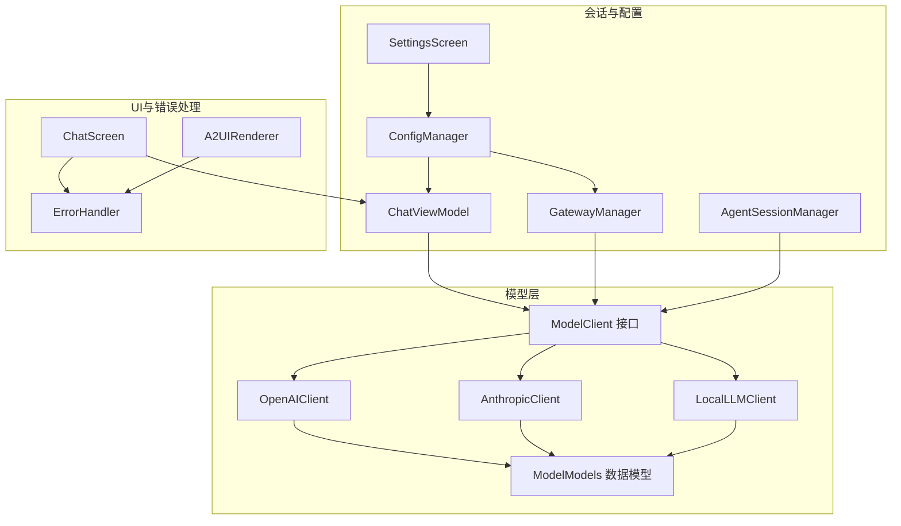
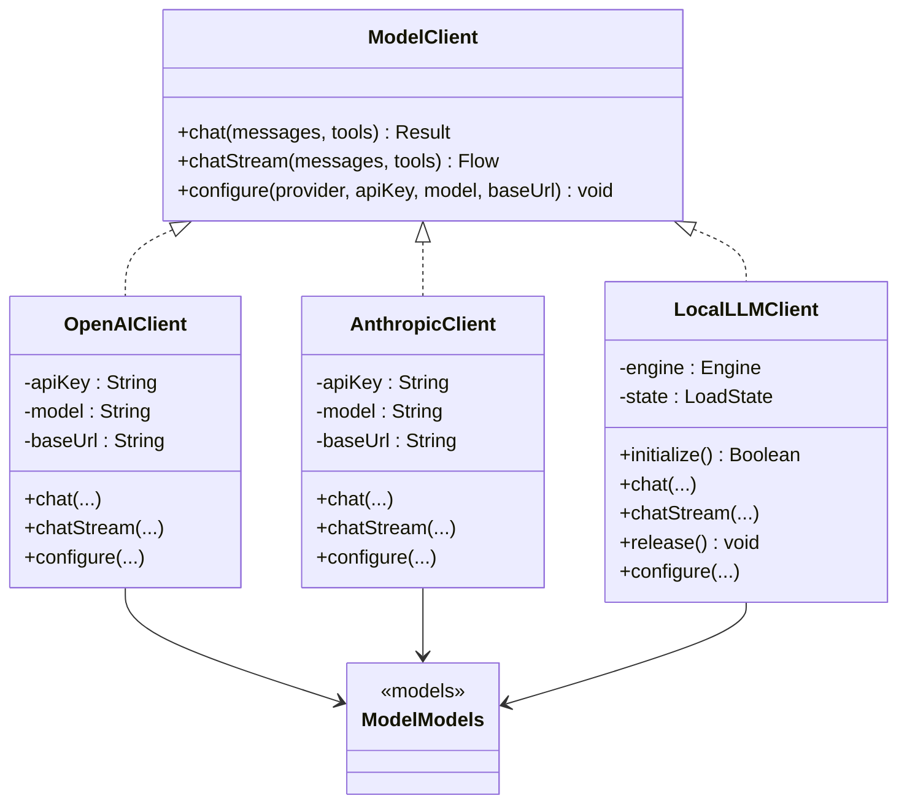
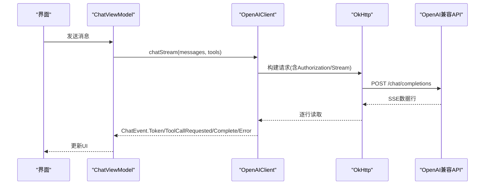
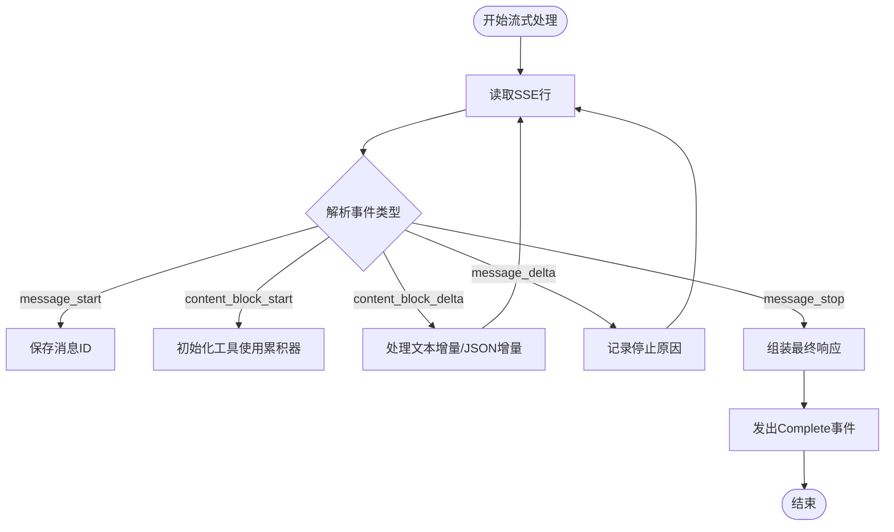
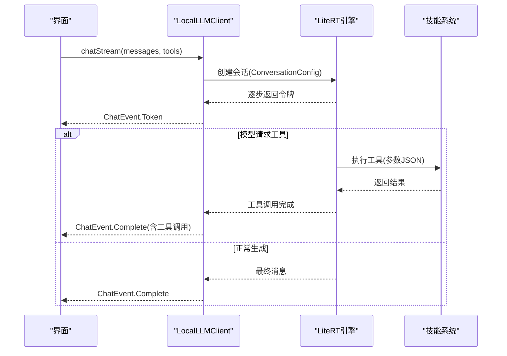
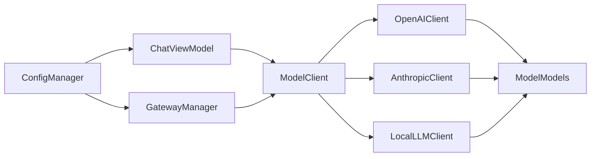

# LLM客户端实现

<cite>
**本文档引用的文件**
- [ModelClient.kt](file://app/src/main/java/ai/openclaw/android/model/ModelClient.kt)
- [OpenAIClient.kt](file://app/src/main/java/ai/openclaw/android/model/OpenAIClient.kt)
- [AnthropicClient.kt](file://app/src/main/java/ai/openclaw/android/model/AnthropicClient.kt)
- [LocalLLMClient.kt](file://app/src/main/java/ai/openclaw/android/model/LocalLLMClient.kt)
- [ModelModels.kt](file://app/src/main/java/ai/openclaw/android/model/ModelModels.kt)
- [ChatViewModel.kt](file://app/src/main/java/ai/openclaw/android/viewmodel/ChatViewModel.kt)
- [GatewayManager.kt](file://app/src/main/java/ai/openclaw/android/GatewayManager.kt)
- [AgentSessionManager.kt](file://app/src/main/java/ai/openclaw/android/domain/agent/AgentSessionManager.kt)
- [ConfigManager.kt](file://app/src/main/java/ai/openclaw/android/ConfigManager.kt)
- [SettingsScreen.kt](file://app/src/main/java/ai/openclaw/android/ui/SettingsScreen.kt)
- [ChatScreen.kt](file://app/src/main/java/ai/openclaw/android/ChatScreen.kt)
- [ErrorHandler.kt](file://android_compose/src/main/java/org/a2ui/compose/error/ErrorHandler.kt)
- [A2UIRenderer.kt](file://android_compose/src/main/java/org/a2ui/compose/rendering/A2UIRenderer.kt)
</cite>

## 目录
1. [简介](#简介)
2. [项目结构](#项目结构)
3. [核心组件](#核心组件)
4. [架构总览](#架构总览)
5. [详细组件分析](#详细组件分析)
6. [依赖关系分析](#依赖关系分析)
7. [性能考虑](#性能考虑)
8. [故障排除指南](#故障排除指南)
9. [结论](#结论)
10. [附录](#附录)

## 简介
本文件系统性梳理了Android项目中的LLM客户端实现，重点围绕统一ModelClient接口设计、OpenAI与Anthropic云模型客户端、以及本地LiteRT-LM推理客户端的实现细节展开。文档涵盖以下主题：
- 统一接口设计与事件流模型
- OpenAI客户端的API集成、认证与请求参数
- Anthropic Claude客户端的格式转换与SSE事件处理
- 本地LLM客户端的LiteRT-LM集成、工具执行桥接与资源管理
- 模型配置管理、错误处理与UI反馈
- 性能优化建议与资源管理最佳实践
- 不同客户端的适用场景与选择标准

## 项目结构
LLM客户端位于应用模块的model包下，采用接口驱动的多实现架构，并通过视图模型与网关管理器进行装配与调度。

**图表来源**
- [ModelClient.kt:10-59](file://app/src/main/java/ai/openclaw/android/model/ModelClient.kt#L10-L59)
- [OpenAIClient.kt:25-249](file://app/src/main/java/ai/openclaw/android/model/OpenAIClient.kt#L25-L249)
- [AnthropicClient.kt:37-490](file://app/src/main/java/ai/openclaw/android/model/AnthropicClient.kt#L37-L490)
- [LocalLLMClient.kt:48-777](file://app/src/main/java/ai/openclaw/android/model/LocalLLMClient.kt#L48-L777)
- [ModelModels.kt:1-168](file://app/src/main/java/ai/openclaw/android/model/ModelModels.kt#L1-L168)
- [ChatViewModel.kt:45-495](file://app/src/main/java/ai/openclaw/android/viewmodel/ChatViewModel.kt#L45-L495)
- [GatewayManager.kt:64-676](file://app/src/main/java/ai/openclaw/android/GatewayManager.kt#L64-L676)
- [AgentSessionManager.kt:32-196](file://app/src/main/java/ai/openclaw/android/domain/agent/AgentSessionManager.kt#L32-L196)
- [ConfigManager.kt:11-171](file://app/src/main/java/ai/openclaw/android/ConfigManager.kt#L11-L171)
- [SettingsScreen.kt:147-179](file://app/src/main/java/ai/openclaw/android/ui/SettingsScreen.kt#L147-L179)
- [ChatScreen.kt:1157-1190](file://app/src/main/java/ai/openclaw/android/ChatScreen.kt#L1157-L1190)
- [ErrorHandler.kt:40-244](file://android_compose/src/main/java/org/a2ui/compose/error/ErrorHandler.kt#L40-L244)
- [A2UIRenderer.kt:173-208](file://android_compose/src/main/java/org/a2ui/compose/rendering/A2UIRenderer.kt#L173-L208)

**章节来源**
- [ModelClient.kt:10-59](file://app/src/main/java/ai/openclaw/android/model/ModelClient.kt#L10-L59)
- [OpenAIClient.kt:25-249](file://app/src/main/java/ai/openclaw/android/model/OpenAIClient.kt#L25-L249)
- [AnthropicClient.kt:37-490](file://app/src/main/java/ai/openclaw/android/model/AnthropicClient.kt#L37-L490)
- [LocalLLMClient.kt:48-777](file://app/src/main/java/ai/openclaw/android/model/LocalLLMClient.kt#L48-L777)
- [ModelModels.kt:1-168](file://app/src/main/java/ai/openclaw/android/model/ModelModels.kt#L1-L168)

## 核心组件
- 统一接口ModelClient：定义非流式与流式对话、配置方法，屏蔽不同提供商差异。
- 数据模型ModelModels：统一消息、工具、响应与SSE分片的数据结构。
- OpenAI客户端：支持SSE流式输出与工具调用，兼容多种OpenAI兼容后端。
- Anthropic客户端：处理Anthropic Messages API的消息块与工具使用事件。
- 本地LLM客户端：基于LiteRT-LM框架，支持Gem模型端侧推理、工具桥接与多后端优先级。
- 配置管理ConfigManager：集中管理模型提供商、API Key、模型名与基础URL。
- 会话与装配：ChatViewModel与GatewayManager负责客户端创建、生命周期管理与工具注入。
- 错误处理：ErrorHandler与A2UIRenderer提供统一错误收集与UI展示。

**章节来源**
- [ModelClient.kt:10-59](file://app/src/main/java/ai/openclaw/android/model/ModelClient.kt#L10-L59)
- [ModelModels.kt:1-168](file://app/src/main/java/ai/openclaw/android/model/ModelModels.kt#L1-L168)
- [OpenAIClient.kt:25-249](file://app/src/main/java/ai/openclaw/android/model/OpenAIClient.kt#L25-L249)
- [AnthropicClient.kt:37-490](file://app/src/main/java/ai/openclaw/android/model/AnthropicClient.kt#L37-L490)
- [LocalLLMClient.kt:48-777](file://app/src/main/java/ai/openclaw/android/model/LocalLLMClient.kt#L48-L777)
- [ConfigManager.kt:11-171](file://app/src/main/java/ai/openclaw/android/ConfigManager.kt#L11-L171)
- [ChatViewModel.kt:45-495](file://app/src/main/java/ai/openclaw/android/viewmodel/ChatViewModel.kt#L45-L495)
- [GatewayManager.kt:64-676](file://app/src/main/java/ai/openclaw/android/GatewayManager.kt#L64-L676)
- [ErrorHandler.kt:40-244](file://android_compose/src/main/java/org/a2ui/compose/error/ErrorHandler.kt#L40-L244)
- [A2UIRenderer.kt:173-208](file://android_compose/src/main/java/org/a2ui/compose/rendering/A2UIRenderer.kt#L173-L208)

## 架构总览
统一接口与多实现的分层架构确保了跨提供商的一致体验。视图模型与网关管理器负责根据配置动态创建合适的客户端实例，并在运行时注入工具执行器与内存上下文。

**图表来源**
- [ModelClient.kt:10-59](file://app/src/main/java/ai/openclaw/android/model/ModelClient.kt#L10-L59)
- [OpenAIClient.kt:25-249](file://app/src/main/java/ai/openclaw/android/model/OpenAIClient.kt#L25-L249)
- [AnthropicClient.kt:37-490](file://app/src/main/java/ai/openclaw/android/model/AnthropicClient.kt#L37-L490)
- [LocalLLMClient.kt:48-777](file://app/src/main/java/ai/openclaw/android/model/LocalLLMClient.kt#L48-L777)
- [ModelModels.kt:1-168](file://app/src/main/java/ai/openclaw/android/model/ModelModels.kt#L1-L168)

## 详细组件分析

### 统一ModelClient接口设计
- 设计目标：抽象不同提供商的差异，统一非流式与流式对话、工具调用与配置流程。
- 关键方法：
  - chat：非流式请求，返回统一结果封装。
  - chatStream：流式请求，以事件流形式推送Token、工具调用、完成与错误。
  - configure：按提供商设置API Key、模型名与基础URL。
- 事件模型：ChatEvent以密封类区分Token、ToolCallRequested、Complete与Error，便于UI增量渲染与工具执行。

**章节来源**
- [ModelClient.kt:10-59](file://app/src/main/java/ai/openclaw/android/model/ModelClient.kt#L10-L59)

### OpenAI客户端实现
- 认证与基础URL：通过Authorization头携带Bearer Token；默认基础URL适配多家OpenAI兼容服务。
- 请求构建：序列化消息与工具定义，设置温度、最大token与流式标志。
- 流式处理：解析SSE数据行，累积内容与工具调用增量，组装完整响应事件。
- 错误处理：捕获网络异常与解析异常，记录日志并返回错误事件。

**图表来源**
- [OpenAIClient.kt:71-87](file://app/src/main/java/ai/openclaw/android/model/OpenAIClient.kt#L71-L87)
- [OpenAIClient.kt:148-239](file://app/src/main/java/ai/openclaw/android/model/OpenAIClient.kt#L148-L239)
- [ChatViewModel.kt:248-327](file://app/src/main/java/ai/openclaw/android/viewmodel/ChatViewModel.kt#L248-L327)

**章节来源**
- [OpenAIClient.kt:25-249](file://app/src/main/java/ai/openclaw/android/model/OpenAIClient.kt#L25-L249)
- [ModelModels.kt:127-168](file://app/src/main/java/ai/openclaw/android/model/ModelModels.kt#L127-L168)
- [ChatViewModel.kt:248-327](file://app/src/main/java/ai/openclaw/android/viewmodel/ChatViewModel.kt#L248-L327)

### Anthropic Claude客户端实现
- 认证与版本：通过x-api-key与anthropic-version头部；系统消息独立于消息数组。
- 消息格式转换：将通用消息转换为Anthropic的内容块数组，支持文本与工具使用块。
- 工具定义转换：将通用工具Schema转换为Anthropic的input_schema格式。
- 流式处理：解析content_block_start/delta/stop与message_delta/stop事件，累积文本与工具调用JSON增量。
- 响应转换：将Anthropic响应映射为统一ModelResponse，包含结束原因与用量统计。

**图表来源**
- [AnthropicClient.kt:358-481](file://app/src/main/java/ai/openclaw/android/model/AnthropicClient.kt#L358-L481)

**章节来源**
- [AnthropicClient.kt:37-490](file://app/src/main/java/ai/openclaw/android/model/AnthropicClient.kt#L37-L490)
- [ModelModels.kt:67-104](file://app/src/main/java/ai/openclaw/android/model/ModelModels.kt#L67-L104)

### 本地LLM客户端（LiteRT-LM）
- 引擎初始化：根据设备硬件自动选择后端优先级（NPU/GPU/CPU），带超时与崩溃防护。
- 会话配置：构建对话配置，包括系统指令、初始消息、采样参数与工具列表。
- 工具桥接：将LiteRT内部工具调用转发至技能系统或无障碍工具，支持幂等与安全策略。
- 流式生成：异步收集令牌增量，最终封装为统一响应事件。
- 错误恢复：当LiteRT无法解析工具调用时，从错误文本中提取工具调用并回退。
- 资源管理：提供状态跟踪、引擎释放与GPU崩溃标记重置。

**图表来源**
- [LocalLLMClient.kt:335-388](file://app/src/main/java/ai/openclaw/android/model/LocalLLMClient.kt#L335-L388)
- [LocalLLMClient.kt:430-476](file://app/src/main/java/ai/openclaw/android/model/LocalLLMClient.kt#L430-L476)
- [LocalLLMClient.kt:478-525](file://app/src/main/java/ai/openclaw/android/model/LocalLLMClient.kt#L478-L525)

**章节来源**
- [LocalLLMClient.kt:48-777](file://app/src/main/java/ai/openclaw/android/model/LocalLLMClient.kt#L48-L777)

### 模型配置管理
- 配置项：提供商、API Key、模型名、基础URL、服务开关、飞书凭证等。
- 加密存储：敏感信息使用加密SharedPreferences存储。
- 默认值与回退：未配置时提供合理默认值；本地模式无需API Key。
- 动态生效：网关管理器与视图模型在运行时根据配置重建客户端与会话。

**章节来源**
- [ConfigManager.kt:11-171](file://app/src/main/java/ai/openclaw/android/ConfigManager.kt#L11-L171)
- [GatewayManager.kt:142-173](file://app/src/main/java/ai/openclaw/android/GatewayManager.kt#L142-L173)
- [ChatViewModel.kt:382-410](file://app/src/main/java/ai/openclaw/android/viewmodel/ChatViewModel.kt#L382-L410)

### 请求与错误处理
- 统一错误事件：各客户端在异常时发出ChatEvent.Error，由UI层统一展示。
- UI错误聚合：ErrorHandler维护错误队列，支持可恢复性判断与重试提示。
- 渲染错误处理：A2UIRenderer在渲染过程中捕获错误并转交ErrorHandler。

**章节来源**
- [OpenAIClient.kt:83-87](file://app/src/main/java/ai/openclaw/android/model/OpenAIClient.kt#L83-L87)
- [AnthropicClient.kt:96-100](file://app/src/main/java/ai/openclaw/android/model/AnthropicClient.kt#L96-L100)
- [LocalLLMClient.kt:374-388](file://app/src/main/java/ai/openclaw/android/model/LocalLLMClient.kt#L374-L388)
- [ErrorHandler.kt:40-244](file://android_compose/src/main/java/org/a2ui/compose/error/ErrorHandler.kt#L40-L244)
- [A2UIRenderer.kt:173-208](file://android_compose/src/main/java/org/a2ui/compose/rendering/A2UIRenderer.kt#L173-L208)

## 依赖关系分析
- 组件耦合：ModelClient作为抽象，具体实现仅依赖OkHttp与LiteRT库；数据模型独立于实现。
- 配置耦合：视图模型与网关管理器通过ConfigManager解耦配置变更对业务的影响。
- 工具耦合：本地客户端通过工具桥接将模型内生工具调用与技能系统解耦。

**图表来源**
- [ConfigManager.kt:11-171](file://app/src/main/java/ai/openclaw/android/ConfigManager.kt#L11-L171)
- [ChatViewModel.kt:45-495](file://app/src/main/java/ai/openclaw/android/viewmodel/ChatViewModel.kt#L45-L495)
- [GatewayManager.kt:64-676](file://app/src/main/java/ai/openclaw/android/GatewayManager.kt#L64-L676)
- [ModelClient.kt:10-59](file://app/src/main/java/ai/openclaw/android/model/ModelClient.kt#L10-L59)
- [OpenAIClient.kt:25-249](file://app/src/main/java/ai/openclaw/android/model/OpenAIClient.kt#L25-L249)
- [AnthropicClient.kt:37-490](file://app/src/main/java/ai/openclaw/android/model/AnthropicClient.kt#L37-L490)
- [LocalLLMClient.kt:48-777](file://app/src/main/java/ai/openclaw/android/model/LocalLLMClient.kt#L48-L777)
- [ModelModels.kt:1-168](file://app/src/main/java/ai/openclaw/android/model/ModelModels.kt#L1-L168)

**章节来源**
- [AgentSessionManager.kt:142-175](file://app/src/main/java/ai/openclaw/android/domain/agent/AgentSessionManager.kt#L142-L175)

## 性能考虑
- 后端选择与初始化超时：本地模型根据设备特性自动选择后端优先级，并设置NPU/GPU/CPU不同超时，避免长时间阻塞。
- 会话并发控制：使用互斥锁保护会话创建与消息发送，防止并发冲突。
- 流式传输：UI按Token增量渲染，降低首帧延迟与内存峰值。
- 资源回收：提供显式release方法与状态跟踪，避免引擎泄漏。
- UI渲染优化：结合Compose渲染优化组件，减少不必要的重组与绘制。

**章节来源**
- [LocalLLMClient.kt:129-171](file://app/src/main/java/ai/openclaw/android/model/LocalLLMClient.kt#L129-L171)
- [LocalLLMClient.kt:309-333](file://app/src/main/java/ai/openclaw/android/model/LocalLLMClient.kt#L309-L333)
- [LocalLLMClient.kt:288-297](file://app/src/main/java/ai/openclaw/android/model/LocalLLMClient.kt#L288-L297)

## 故障排除指南
- 本地模型初始化失败：
  - 检查模型文件是否存在与命名是否匹配。
  - 查看后端初始化日志与崩溃标记，必要时重置GPU崩溃标记。
  - 回退到云端模型或切换到CPU后端。
- 云端模型请求失败：
  - 核对API Key与基础URL配置。
  - 检查网络连通性与SSE流式支持。
  - 查看HTTP状态码与错误体，定位服务端问题。
- 工具调用异常：
  - 本地模型：若LiteRT解析失败，检查错误文本中的工具调用模式并回退解析。
  - 云端模型：确认工具定义Schema与参数完整性。
- UI错误展示：
  - 使用错误栏与重试按钮进行用户引导。
  - 对网络错误提供可恢复性提示。

**章节来源**
- [LocalLLMClient.kt:175-286](file://app/src/main/java/ai/openclaw/android/model/LocalLLMClient.kt#L175-L286)
- [OpenAIClient.kt:58-69](file://app/src/main/java/ai/openclaw/android/model/OpenAIClient.kt#L58-L69)
- [AnthropicClient.kt:68-82](file://app/src/main/java/ai/openclaw/android/model/AnthropicClient.kt#L68-L82)
- [ChatScreen.kt:1157-1190](file://app/src/main/java/ai/openclaw/android/ChatScreen.kt#L1157-L1190)
- [ErrorHandler.kt:40-244](file://android_compose/src/main/java/org/a2ui/compose/error/ErrorHandler.kt#L40-L244)

## 结论
该实现通过统一接口与清晰的分层架构，有效屏蔽了OpenAI与Anthropic云模型以及本地LiteRT-LM推理之间的差异。配合完善的配置管理、工具桥接与错误处理机制，既满足云端高吞吐与丰富工具生态的需求，又能在本地实现隐私保护与低延迟推理。建议在生产环境中进一步完善重试策略、可观测性与资源监控，以提升稳定性与用户体验。

## 附录

### 不同客户端的适用场景与选择标准
- OpenAI兼容云模型：
  - 适用：需要强大工具生态与高推理质量的场景。
  - 注意：需配置API Key与基础URL；网络不稳定时可考虑本地回退。
- Anthropic Claude：
  - 适用：对工具使用与内容块格式有特定需求的场景。
  - 注意：认证头与版本号要求，消息与工具格式转换。
- 本地LiteRT-LM：
  - 适用：强调隐私、离线与低延迟的场景。
  - 注意：模型文件管理、后端选择与初始化超时；工具调用回退解析。

**章节来源**
- [ConfigManager.kt:142-149](file://app/src/main/java/ai/openclaw/android/ConfigManager.kt#L142-L149)
- [SettingsScreen.kt:147-179](file://app/src/main/java/ai/openclaw/android/ui/SettingsScreen.kt#L147-L179)
- [AgentSessionManager.kt:142-175](file://app/src/main/java/ai/openclaw/android/domain/agent/AgentSessionManager.kt#L142-L175)