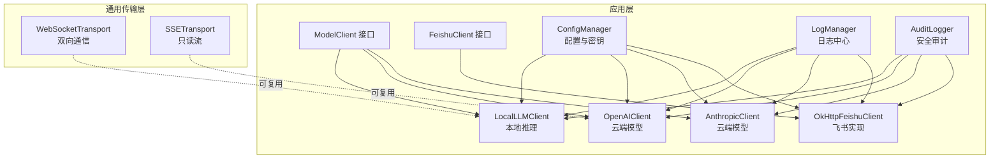
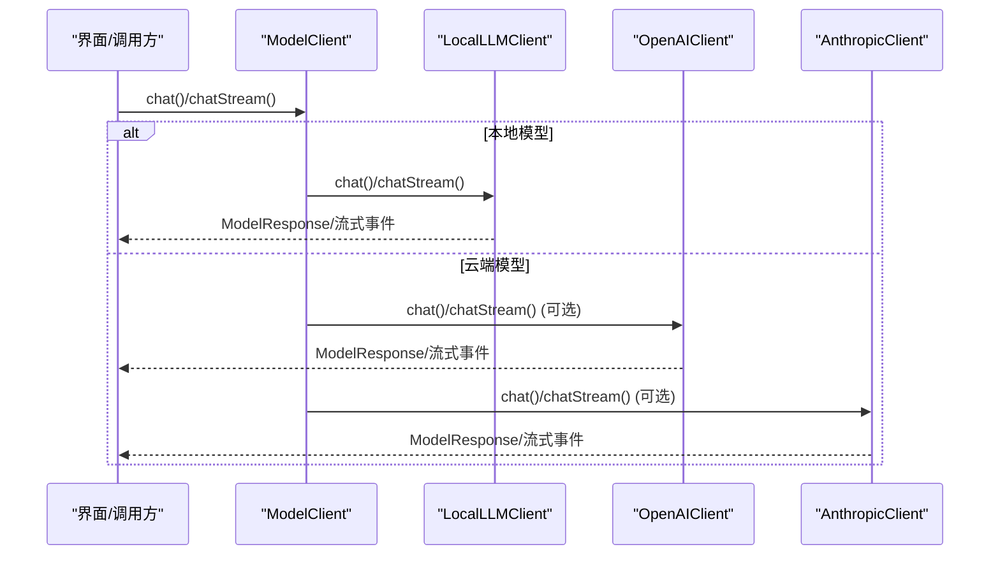
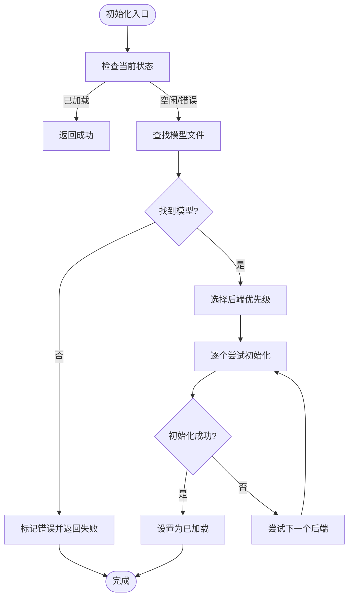
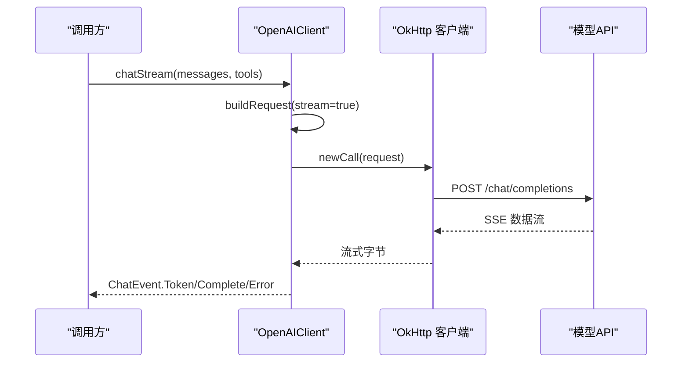
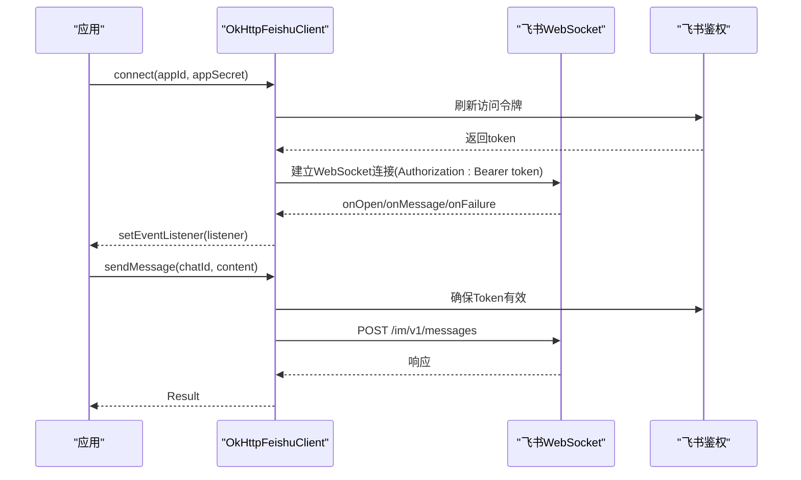
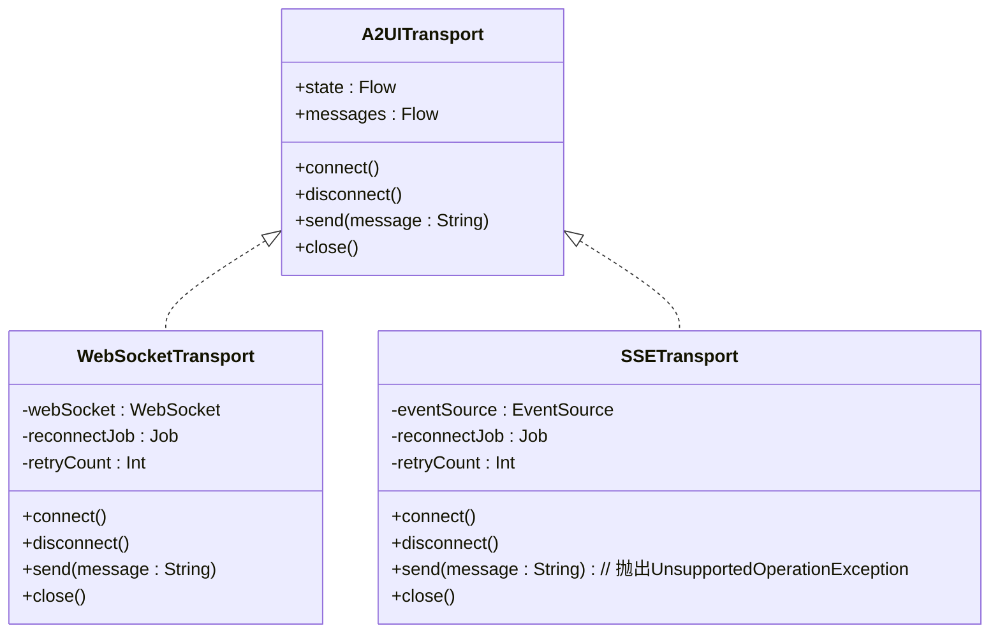
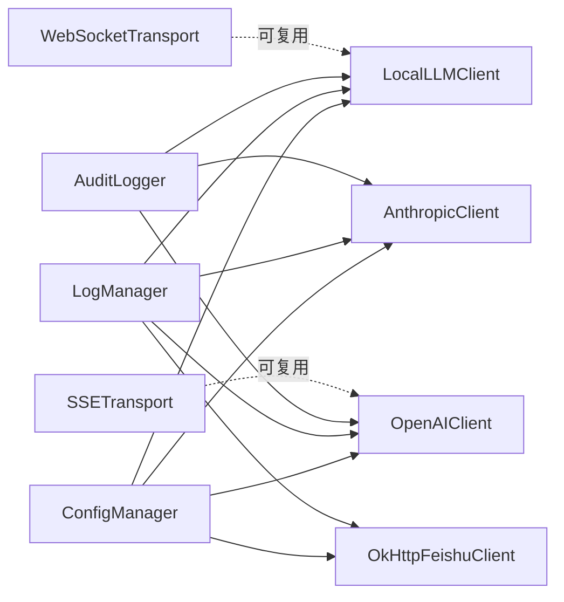

# 网络与API集成

<cite>
**本文引用的文件**
- [LocalLLMClient.kt](file://app/src/main/java/ai/openclaw/android/model/LocalLLMClient.kt)
- [OpenAIClient.kt](file://app/src/main/java/ai/openclaw/android/model/OpenAIClient.kt)
- [AnthropicClient.kt](file://app/src/main/java/ai/openclaw/android/model/AnthropicClient.kt)
- [ModelClient.kt](file://app/src/main/java/ai/openclaw/android/model/ModelClient.kt)
- [ModelModels.kt](file://app/src/main/java/ai/openclaw/android/model/ModelModels.kt)
- [FeishuClient.kt](file://app/src/main/java/ai/openclaw/android/feishu/FeishuClient.kt)
- [OkHttpFeishuClient.kt](file://app/src/main/java/ai/openclaw/android/feishu/OkHttpFeishuClient.kt)
- [FeishuModels.kt](file://app/src/main/java/ai/openclaw/android/feishu/FeishuModels.kt)
- [NetworkTransport.kt](file://android_compose/src/main/java/org/a2ui/compose/transport/NetworkTransport.kt)
- [ConfigManager.kt](file://app/src/main/java/ai/openclaw/android/ConfigManager.kt)
- [LogManager.kt](file://app/src/main/java/ai/openclaw/android/LogManager.kt)
- [AuditLogger.kt](file://app/src/main/java/ai/openclaw/android/security/AuditLogger.kt)
</cite>

## 目录
1. [简介](#简介)
2. [项目结构](#项目结构)
3. [核心组件](#核心组件)
4. [架构总览](#架构总览)
5. [详细组件分析](#详细组件分析)
6. [依赖关系分析](#依赖关系分析)
7. [性能考量](#性能考量)
8. [故障排查指南](#故障排查指南)
9. [结论](#结论)
10. [附录](#附录)

## 简介
本文件面向网络与API集成的技术文档，聚焦于以下目标：
- 统一本地推理与云端模型的LLM客户端架构
- 各类API客户端的设计模式与认证机制
- 网络传输层的实现原理与错误处理策略
- 飞书机器人集成的消息处理与实时通信
- API调用的性能优化与重试机制
- 网络请求的监控与调试工具
- API集成的安全考虑与最佳实践
- 第三方API集成的扩展指导

## 项目结构
本项目采用模块化组织，网络与API相关能力主要分布在以下模块：
- 应用层模型与客户端：LLM客户端、API客户端、配置管理、日志与审计
- 通用传输层：WebSocket与SSE传输抽象，统一状态与重连策略
- 飞书集成：接口定义与基于OkHttp的实现

**图表来源**
- [ModelClient.kt:10-32](file://app/src/main/java/ai/openclaw/android/model/ModelClient.kt#L10-L32)
- [LocalLLMClient.kt:48-777](file://app/src/main/java/ai/openclaw/android/model/LocalLLMClient.kt#L48-L777)
- [OpenAIClient.kt:25-249](file://app/src/main/java/ai/openclaw/android/model/OpenAIClient.kt#L25-L249)
- [AnthropicClient.kt:37-490](file://app/src/main/java/ai/openclaw/android/model/AnthropicClient.kt#L37-L490)
- [FeishuClient.kt:6-36](file://app/src/main/java/ai/openclaw/android/feishu/FeishuClient.kt#L6-L36)
- [OkHttpFeishuClient.kt:14-280](file://app/src/main/java/ai/openclaw/android/feishu/OkHttpFeishuClient.kt#L14-L280)
- [NetworkTransport.kt:28-341](file://android_compose/src/main/java/org/a2ui/compose/transport/NetworkTransport.kt#L28-L341)
- [ConfigManager.kt:11-171](file://app/src/main/java/ai/openclaw/android/ConfigManager.kt#L11-L171)
- [LogManager.kt:16-65](file://app/src/main/java/ai/openclaw/android/LogManager.kt#L16-L65)
- [AuditLogger.kt:16-100](file://app/src/main/java/ai/openclaw/android/security/AuditLogger.kt#L16-L100)

**章节来源**
- [ModelClient.kt:10-59](file://app/src/main/java/ai/openclaw/android/model/ModelClient.kt#L10-L59)
- [NetworkTransport.kt:28-341](file://android_compose/src/main/java/org/a2ui/compose/transport/NetworkTransport.kt#L28-L341)

## 核心组件
- 统一接口 ModelClient：定义聊天、流式聊天与配置方法，屏蔽本地与云端差异
- 本地LLM客户端 LocalLLMClient：基于LiteRT-LM框架，支持多后端优先级与GPU/NPU/CPU回退
- 云端模型客户端 OpenAIClient / AnthropicClient：分别适配不同API格式，统一输出内部响应模型
- 飞书客户端 FeishuClient / OkHttpFeishuClient：WebSocket长连接与HTTP消息发送/文件上传
- 传输层 NetworkTransport：WebSocket/SSE通用传输，内置指数退避与资源回收
- 配置与安全 ConfigManager / AuditLogger：集中配置、加密存储、审计链校验
- 日志中心 LogManager：统一日志收集与UI展示

**章节来源**
- [LocalLLMClient.kt:48-777](file://app/src/main/java/ai/openclaw/android/model/LocalLLMClient.kt#L48-L777)
- [OpenAIClient.kt:25-249](file://app/src/main/java/ai/openclaw/android/model/OpenAIClient.kt#L25-L249)
- [AnthropicClient.kt:37-490](file://app/src/main/java/ai/openclaw/android/model/AnthropicClient.kt#L37-L490)
- [FeishuClient.kt:6-36](file://app/src/main/java/ai/openclaw/android/feishu/FeishuClient.kt#L6-L36)
- [OkHttpFeishuClient.kt:14-280](file://app/src/main/java/ai/openclaw/android/feishu/OkHttpFeishuClient.kt#L14-L280)
- [NetworkTransport.kt:28-341](file://android_compose/src/main/java/org/a2ui/compose/transport/NetworkTransport.kt#L28-L341)
- [ConfigManager.kt:11-171](file://app/src/main/java/ai/openclaw/android/ConfigManager.kt#L11-L171)
- [LogManager.kt:16-65](file://app/src/main/java/ai/openclaw/android/LogManager.kt#L16-L65)
- [AuditLogger.kt:16-100](file://app/src/main/java/ai/openclaw/android/security/AuditLogger.kt#L16-L100)

## 架构总览
统一的LLM客户端通过ModelClient接口对外提供一致能力；本地与云端客户端分别封装底层实现细节。网络传输层为实时场景提供稳定连接，API客户端负责HTTP请求与SSE流式解析。配置与安全模块贯穿全链路，确保凭据安全与行为可审计。

**图表来源**
- [ModelClient.kt:10-32](file://app/src/main/java/ai/openclaw/android/model/ModelClient.kt#L10-L32)
- [LocalLLMClient.kt:301-333](file://app/src/main/java/ai/openclaw/android/model/LocalLLMClient.kt#L301-L333)
- [OpenAIClient.kt:55-87](file://app/src/main/java/ai/openclaw/android/model/OpenAIClient.kt#L55-L87)
- [AnthropicClient.kt:68-100](file://app/src/main/java/ai/openclaw/android/model/AnthropicClient.kt#L68-L100)

## 详细组件分析

### 本地LLM客户端（LiteRT-LM）
- 生命周期与状态：加载中/已加载/错误，支持恢复初始化
- 多后端优先级：按设备品牌与硬件选择NPU/GPU/CPU，并在GPU失败时自动降级
- 会话与并发：使用互斥锁保证会话串行，避免引擎竞争
- 工具调用桥接：将模型内生工具调用转发至技能系统，支持回退解析
- 响应包装：统一为内部ModelResponse，便于上层无感切换

**图表来源**
- [LocalLLMClient.kt:175-286](file://app/src/main/java/ai/openclaw/android/model/LocalLLMClient.kt#L175-L286)

**章节来源**
- [LocalLLMClient.kt:48-777](file://app/src/main/java/ai/openclaw/android/model/LocalLLMClient.kt#L48-L777)

### 云端模型客户端（OpenAI与Anthropic）
- 共同点：均实现ModelClient，支持非流式与SSE流式两种调用
- OpenAI客户端：构建兼容模式请求，解析标准响应或SSE块
- Anthropic客户端：转换消息与工具格式，解析SSE事件流，组装工具使用信息

**图表来源**
- [OpenAIClient.kt:71-87](file://app/src/main/java/ai/openclaw/android/model/OpenAIClient.kt#L71-L87)
- [OpenAIClient.kt:148-239](file://app/src/main/java/ai/openclaw/android/model/OpenAIClient.kt#L148-L239)

**章节来源**
- [OpenAIClient.kt:25-249](file://app/src/main/java/ai/openclaw/android/model/OpenAIClient.kt#L25-L249)
- [AnthropicClient.kt:37-490](file://app/src/main/java/ai/openclaw/android/model/AnthropicClient.kt#L37-L490)

### 飞书机器人集成
- 接口职责：连接/断开、事件监听、消息发送、文件上传
- 认证与心跳：WebSocket鉴权，定时刷新访问令牌，断线指数退避重连
- 事件处理：解析文本事件，回调上层业务逻辑
- 文件上传：构造multipart表单，解析file_key返回

**图表来源**
- [FeishuClient.kt:6-36](file://app/src/main/java/ai/openclaw/android/feishu/FeishuClient.kt#L6-L36)
- [OkHttpFeishuClient.kt:31-73](file://app/src/main/java/ai/openclaw/android/feishu/OkHttpFeishuClient.kt#L31-L73)
- [OkHttpFeishuClient.kt:89-124](file://app/src/main/java/ai/openclaw/android/feishu/OkHttpFeishuClient.kt#L89-L124)
- [OkHttpFeishuClient.kt:176-231](file://app/src/main/java/ai/openclaw/android/feishu/OkHttpFeishuClient.kt#L176-L231)

**章节来源**
- [FeishuClient.kt:6-36](file://app/src/main/java/ai/openclaw/android/feishu/FeishuClient.kt#L6-L36)
- [OkHttpFeishuClient.kt:14-280](file://app/src/main/java/ai/openclaw/android/feishu/OkHttpFeishuClient.kt#L14-L280)
- [FeishuModels.kt:8-54](file://app/src/main/java/ai/openclaw/android/feishu/FeishuModels.kt#L8-L54)

### 通用传输层（WebSocket/SSE）
- 状态管理：Disconnection/Connecting/Connected/Error
- 重连策略：指数退避，最大重试次数控制
- 资源清理：实现AutoCloseable，取消协程、关闭连接池
- 适用场景：WebSocket双向通信、SSE只读事件流

**图表来源**
- [NetworkTransport.kt:28-178](file://android_compose/src/main/java/org/a2ui/compose/transport/NetworkTransport.kt#L28-L178)
- [NetworkTransport.kt:195-341](file://android_compose/src/main/java/org/a2ui/compose/transport/NetworkTransport.kt#L195-L341)

**章节来源**
- [NetworkTransport.kt:28-341](file://android_compose/src/main/java/org/a2ui/compose/transport/NetworkTransport.kt#L28-L341)

## 依赖关系分析
- ModelClient作为统一抽象，被本地与云端客户端实现
- 配置管理器提供凭据与基础URL，影响客户端行为
- 日志与审计贯穿各组件，保障可观测性与可追溯性
- 传输层可被任意需要网络通信的模块复用

**图表来源**
- [ConfigManager.kt:11-171](file://app/src/main/java/ai/openclaw/android/ConfigManager.kt#L11-L171)
- [LocalLLMClient.kt:48-777](file://app/src/main/java/ai/openclaw/android/model/LocalLLMClient.kt#L48-L777)
- [OpenAIClient.kt:25-249](file://app/src/main/java/ai/openclaw/android/model/OpenAIClient.kt#L25-L249)
- [AnthropicClient.kt:37-490](file://app/src/main/java/ai/openclaw/android/model/AnthropicClient.kt#L37-L490)
- [OkHttpFeishuClient.kt:14-280](file://app/src/main/java/ai/openclaw/android/feishu/OkHttpFeishuClient.kt#L14-L280)
- [LogManager.kt:16-65](file://app/src/main/java/ai/openclaw/android/LogManager.kt#L16-L65)
- [AuditLogger.kt:16-100](file://app/src/main/java/ai/openclaw/android/security/AuditLogger.kt#L16-L100)
- [NetworkTransport.kt:28-341](file://android_compose/src/main/java/org/a2ui/compose/transport/NetworkTransport.kt#L28-L341)

**章节来源**
- [ModelClient.kt:10-59](file://app/src/main/java/ai/openclaw/android/model/ModelClient.kt#L10-L59)
- [ModelModels.kt:6-168](file://app/src/main/java/ai/openclaw/android/model/ModelModels.kt#L6-L168)

## 性能考量
- 本地推理
  - 后端优先级与回退：依据设备特性自动选择最优后端，降低冷启动失败率
  - 会话互斥：避免并发对话导致引擎状态混乱
  - 文本截断：按预算截断历史消息，平衡上下文长度与性能
- 云端模型
  - SSE流式：边到边输出，降低首token延迟
  - 参数裁剪：温度、最大token等参数按需配置
- 传输层
  - 指数退避：快速恢复与避免风暴
  - 资源回收：及时释放连接与协程，防止泄漏
- 飞书
  - Token预刷新：提前5分钟刷新，避免请求中断
  - 断线重连：指数退避，上限保护

**章节来源**
- [LocalLLMClient.kt:225-273](file://app/src/main/java/ai/openclaw/android/model/LocalLLMClient.kt#L225-L273)
- [OpenAIClient.kt:71-87](file://app/src/main/java/ai/openclaw/android/model/OpenAIClient.kt#L71-L87)
- [NetworkTransport.kt:110-128](file://android_compose/src/main/java/org/a2ui/compose/transport/NetworkTransport.kt#L110-L128)
- [OkHttpFeishuClient.kt:236-250](file://app/src/main/java/ai/openclaw/android/feishu/OkHttpFeishuClient.kt#L236-L250)

## 故障排查指南
- 本地模型初始化失败
  - 检查模型文件是否存在与命名匹配
  - 查看后端优先级与回退记录，确认是否因GPU崩溃被跳过
  - 清理GPU崩溃标记或等待自动重试窗口
- 云端模型流式异常
  - 检查SSE解析与工具调用累积逻辑
  - 若解析失败，尝试从错误消息中提取工具调用信息
- 飞书连接问题
  - 核对鉴权参数与Token有效期
  - 观察断线重连日志，确认指数退避是否生效
  - 检查事件监听器是否正确设置
- 配置与安全
  - 使用导出配置功能核对当前有效配置
  - 审计日志验证链完整性，定位篡改风险

**章节来源**
- [LocalLLMClient.kt:185-196](file://app/src/main/java/ai/openclaw/android/model/LocalLLMClient.kt#L185-L196)
- [OpenAIClient.kt:234-238](file://app/src/main/java/ai/openclaw/android/model/OpenAIClient.kt#L234-L238)
- [OkHttpFeishuClient.kt:67-71](file://app/src/main/java/ai/openclaw/android/feishu/OkHttpFeishuClient.kt#L67-L71)
- [ConfigManager.kt:162-171](file://app/src/main/java/ai/openclaw/android/ConfigManager.kt#L162-L171)
- [AuditLogger.kt:69-78](file://app/src/main/java/ai/openclaw/android/security/AuditLogger.kt#L69-L78)

## 结论
本项目通过统一的ModelClient接口实现了本地与云端模型的一致体验；借助通用传输层与完善的错误处理、重试与资源回收机制，保证了网络通信的稳定性；飞书集成提供了可靠的实时消息通道；配置与安全模块贯穿始终，确保凭据安全与行为可审计。上述设计为第三方API集成提供了清晰的扩展路径。

## 附录

### API客户端设计模式与认证机制
- 设计模式
  - 统一接口 + 多实现：ModelClient抽象，本地/云端具体实现
  - 工厂/配置注入：通过ConfigManager注入凭据与基础URL
  - 流式处理：SSE事件解析与工具调用累积
- 认证机制
  - 本地模型：无需API Key
  - OpenAI：Authorization Bearer
  - Anthropic：x-api-key + anthropic-version
  - 飞书：tenant_access_token + WebSocket鉴权

**章节来源**
- [ModelClient.kt:10-59](file://app/src/main/java/ai/openclaw/android/model/ModelClient.kt#L10-L59)
- [OpenAIClient.kt:49-53](file://app/src/main/java/ai/openclaw/android/model/OpenAIClient.kt#L49-L53)
- [AnthropicClient.kt:62-66](file://app/src/main/java/ai/openclaw/android/model/AnthropicClient.kt#L62-L66)
- [OkHttpFeishuClient.kt:35-41](file://app/src/main/java/ai/openclaw/android/feishu/OkHttpFeishuClient.kt#L35-L41)

### 网络传输层实现原理与错误处理
- WebSocketTransport
  - 状态流转：Disconnected → Connecting → Connected → Disconnected/Error
  - 重连策略：指数退避，最大重试次数控制
  - 资源回收：关闭WebSocket、取消协程、释放连接池
- SSETransport
  - 只读传输，自动重连与事件分发
  - 失败回调触发重连

**章节来源**
- [NetworkTransport.kt:28-178](file://android_compose/src/main/java/org/a2ui/compose/transport/NetworkTransport.kt#L28-L178)
- [NetworkTransport.kt:195-341](file://android_compose/src/main/java/org/a2ui/compose/transport/NetworkTransport.kt#L195-L341)

### 飞书机器人消息处理与实时通信
- WebSocket事件：onOpen/onMessage/onFailure/onClosed
- 事件解析：JSON反序列化为事件模型
- 重连机制：指数退避，上限保护
- 文件上传：multipart表单，解析file_key

**章节来源**
- [OkHttpFeishuClient.kt:43-73](file://app/src/main/java/ai/openclaw/android/feishu/OkHttpFeishuClient.kt#L43-L73)
- [OkHttpFeishuClient.kt:236-250](file://app/src/main/java/ai/openclaw/android/feishu/OkHttpFeishuClient.kt#L236-L250)
- [FeishuModels.kt:8-54](file://app/src/main/java/ai/openclaw/android/feishu/FeishuModels.kt#L8-L54)

### API调用性能优化与重试机制
- 本地推理
  - 后端优先级与回退、会话互斥、文本截断
- 云端模型
  - SSE流式、参数裁剪
- 传输层
  - 指数退避、最大重试次数
- 飞书
  - Token预刷新、断线重连

**章节来源**
- [LocalLLMClient.kt:225-273](file://app/src/main/java/ai/openclaw/android/model/LocalLLMClient.kt#L225-L273)
- [OpenAIClient.kt:71-87](file://app/src/main/java/ai/openclaw/android/model/OpenAIClient.kt#L71-L87)
- [NetworkTransport.kt:110-128](file://android_compose/src/main/java/org/a2ui/compose/transport/NetworkTransport.kt#L110-L128)
- [OkHttpFeishuClient.kt:236-250](file://app/src/main/java/ai/openclaw/android/feishu/OkHttpFeishuClient.kt#L236-L250)

### 网络请求监控与调试工具
- 日志中心：集中记录并提供UI展示
- 导出配置：导出非敏感配置用于诊断
- 审计日志：哈希链校验，检测篡改

**章节来源**
- [LogManager.kt:16-65](file://app/src/main/java/ai/openclaw/android/LogManager.kt#L16-L65)
- [ConfigManager.kt:162-171](file://app/src/main/java/ai/openclaw/android/ConfigManager.kt#L162-L171)
- [AuditLogger.kt:69-78](file://app/src/main/java/ai/openclaw/android/security/AuditLogger.kt#L69-L78)

### API集成的安全考虑与最佳实践
- 凭据存储：使用加密SharedPreferences保存敏感配置
- 行为审计：审计日志记录关键操作，维护不可篡改链
- 最小权限：仅在必要时暴露网络能力
- 错误隔离：统一异常处理与日志记录，避免敏感信息泄露

**章节来源**
- [ConfigManager.kt:38-46](file://app/src/main/java/ai/openclaw/android/ConfigManager.kt#L38-L46)
- [AuditLogger.kt:16-100](file://app/src/main/java/ai/openclaw/android/security/AuditLogger.kt#L16-L100)

### 第三方API集成扩展指导
- 新增客户端
  - 实现ModelClient接口，遵循统一响应模型
  - 处理认证头与基础URL配置
  - 支持非流式与流式两种调用
- 新增传输
  - 复用WebSocketTransport/SSETransport，保持状态与重连一致性
  - 明确发送/接收方向与错误处理
- 配置与安全
  - 通过ConfigManager注册新键值
  - 对敏感字段使用加密存储
  - 记录审计日志以追踪变更

**章节来源**
- [ModelClient.kt:10-59](file://app/src/main/java/ai/openclaw/android/model/ModelClient.kt#L10-L59)
- [NetworkTransport.kt:28-341](file://android_compose/src/main/java/org/a2ui/compose/transport/NetworkTransport.kt#L28-L341)
- [ConfigManager.kt:11-171](file://app/src/main/java/ai/openclaw/android/ConfigManager.kt#L11-L171)
- [AuditLogger.kt:16-100](file://app/src/main/java/ai/openclaw/android/security/AuditLogger.kt#L16-L100)