# 网络传输层

<cite>
**本文档引用的文件**
- [A2UITransport.kt](file://android_compose/src/main/java/org/a2ui/compose/transport/A2UITransport.kt)
- [NetworkTransport.kt](file://android_compose/src/main/java/org/a2ui/compose/transport/NetworkTransport.kt)
- [A2UIMessage.kt](file://android_compose/src/main/java/org/a2ui/compose/data/A2UIMessage.kt)
- [OkHttpFeishuClient.kt](file://app/src/main/java/ai/openclaw/android/feishu/OkHttpFeishuClient.kt)
- [GatewayManager.kt](file://app/src/main/java/ai/openclaw/android/GatewayManager.kt)
- [GatewayService.kt](file://app/src/main/java/ai/openclaw/android/GatewayService.kt)
- [network_security_config.xml](file://app/src/main/res/xml/network_security_config.xml)
- [LogManager.kt](file://app/src/main/java/ai/openclaw/android/LogManager.kt)
- [NetworkTransportMemoryLeakTest.kt](file://android_compose/src/test/java/org/a2ui/compose/transport/NetworkTransportMemoryLeakTest.kt)
</cite>

## 目录
1. [简介](#简介)
2. [项目结构](#项目结构)
3. [核心组件](#核心组件)
4. [架构概览](#架构概览)
5. [详细组件分析](#详细组件分析)
6. [依赖关系分析](#依赖关系分析)
7. [性能考虑](#性能考虑)
8. [故障排除指南](#故障排除指南)
9. [结论](#结论)
10. [附录](#附录)

## 简介

OpenClaw Android 项目的网络传输层是一个高度模块化和可扩展的系统，专门设计用于支持 A2UI 协议的实时通信。该系统提供了多种传输方式，包括 WebSocket、Server-Sent Events (SSE) 以及 HTTP 客户端，以满足不同场景下的通信需求。

本网络传输层的核心目标是：
- 提供统一的传输抽象接口
- 支持自动重连和指数退避策略
- 实现心跳检测和连接池管理
- 提供完整的错误处理和监控机制
- 支持 SSL/TLS 安全传输
- 兼容 A2UI 协议的数据格式规范

## 项目结构

网络传输层主要分布在以下目录中：

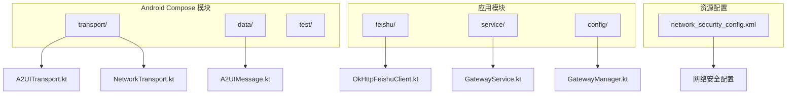

**图表来源**
- [A2UITransport.kt:1-41](file://android_compose/src/main/java/org/a2ui/compose/transport/A2UITransport.kt#L1-L41)
- [NetworkTransport.kt:1-341](file://android_compose/src/main/java/org/a2ui/compose/transport/NetworkTransport.kt#L1-L341)
- [A2UIMessage.kt:1-314](file://android_compose/src/main/java/org/a2ui/compose/data/A2UIMessage.kt#L1-L314)

**章节来源**
- [A2UITransport.kt:1-41](file://android_compose/src/main/java/org/a2ui/compose/transport/A2UITransport.kt#L1-L41)
- [NetworkTransport.kt:1-341](file://android_compose/src/main/java/org/a2ui/compose/transport/NetworkTransport.kt#L1-L341)

## 核心组件

### 传输接口抽象

网络传输层采用接口驱动的设计模式，提供了统一的传输抽象：

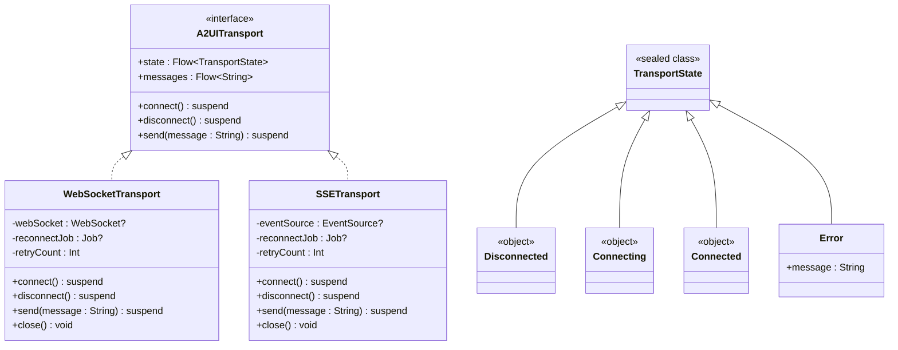

**图表来源**
- [A2UITransport.kt:7-21](file://android_compose/src/main/java/org/a2ui/compose/transport/A2UITransport.kt#L7-L21)
- [NetworkTransport.kt:28-178](file://android_compose/src/main/java/org/a2ui/compose/transport/NetworkTransport.kt#L28-L178)

### HTTP 客户端工厂

系统实现了共享的 HTTP 客户端工厂，提供统一的 OkHttp 配置：

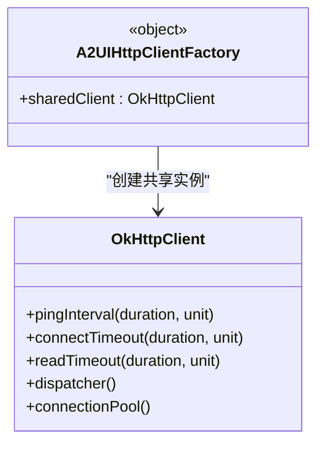

**图表来源**
- [A2UITransport.kt:32-40](file://android_compose/src/main/java/org/a2ui/compose/transport/A2UITransport.kt#L32-L40)

**章节来源**
- [A2UITransport.kt:14-40](file://android_compose/src/main/java/org/a2ui/compose/transport/A2UITransport.kt#L14-L40)

## 架构概览

网络传输层的整体架构采用分层设计，从上到下分别为：

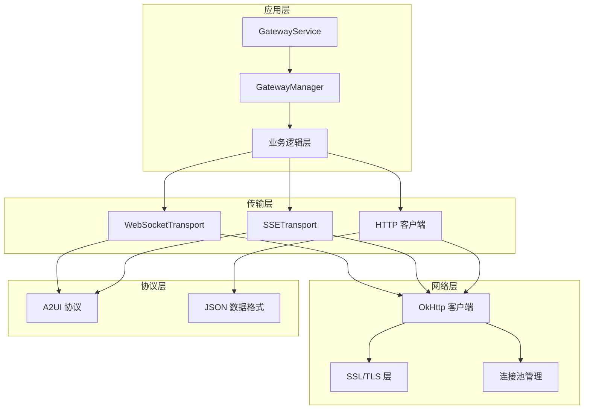

**图表来源**
- [GatewayService.kt:31-234](file://app/src/main/java/ai/openclaw/android/GatewayService.kt#L31-L234)
- [GatewayManager.kt:65-677](file://app/src/main/java/ai/openclaw/android/GatewayManager.kt#L65-L677)
- [NetworkTransport.kt:1-341](file://android_compose/src/main/java/org/a2ui/compose/transport/NetworkTransport.kt#L1-L341)

## 详细组件分析

### WebSocket 传输实现

WebSocketTransport 是网络传输层的核心组件，提供了完整的双向通信能力：

#### 连接管理机制

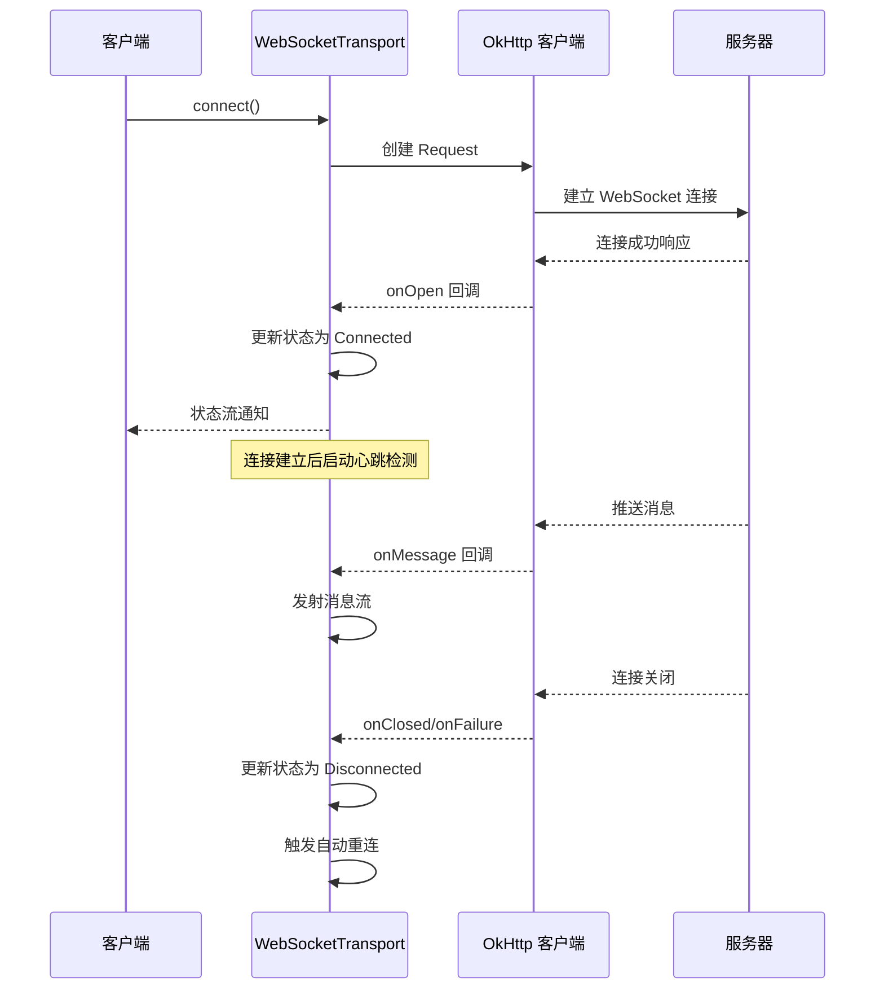

**图表来源**
- [NetworkTransport.kt:53-108](file://android_compose/src/main/java/org/a2ui/compose/transport/NetworkTransport.kt#L53-L108)

#### 自动重连策略

系统实现了智能的指数退避重连机制：

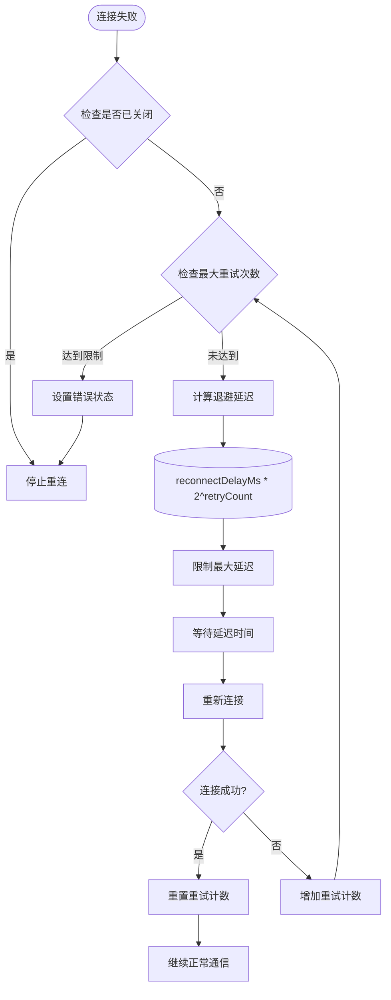

**图表来源**
- [NetworkTransport.kt:110-128](file://android_compose/src/main/java/org/a2ui/compose/transport/NetworkTransport.kt#L110-L128)

#### 资源管理与生命周期

WebSocketTransport 实现了完整的资源管理：

**章节来源**
- [NetworkTransport.kt:28-178](file://android_compose/src/main/java/org/a2ui/compose/transport/NetworkTransport.kt#L28-L178)

### SSE 传输实现

SSETransport 提供了只读的消息推送功能：

#### SSE 连接流程

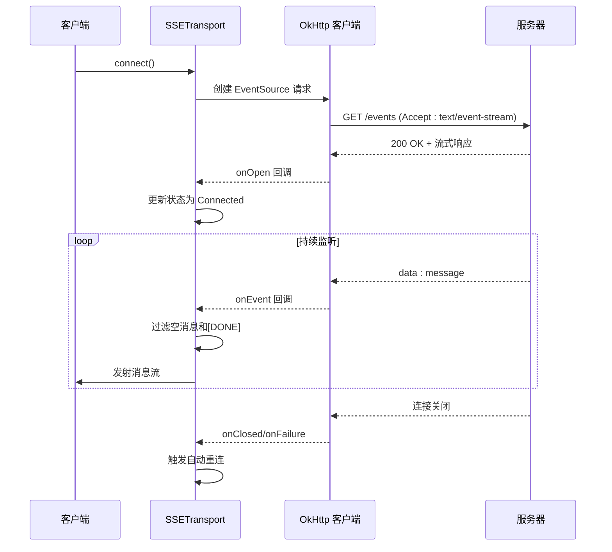

**图表来源**
- [NetworkTransport.kt:220-277](file://android_compose/src/main/java/org/a2ui/compose/transport/NetworkTransport.kt#L220-L277)

**章节来源**
- [NetworkTransport.kt:195-340](file://android_compose/src/main/java/org/a2ui/compose/transport/NetworkTransport.kt#L195-L340)

### A2UI 协议实现

A2UI 协议定义了完整的数据交换格式和消息规范：

#### 消息类型定义

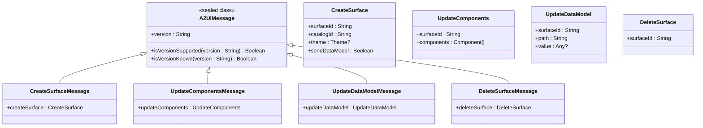

**图表来源**
- [A2UIMessage.kt:10-77](file://android_compose/src/main/java/org/a2ui/compose/data/A2UIMessage.kt#L10-L77)

#### 组件数据模型

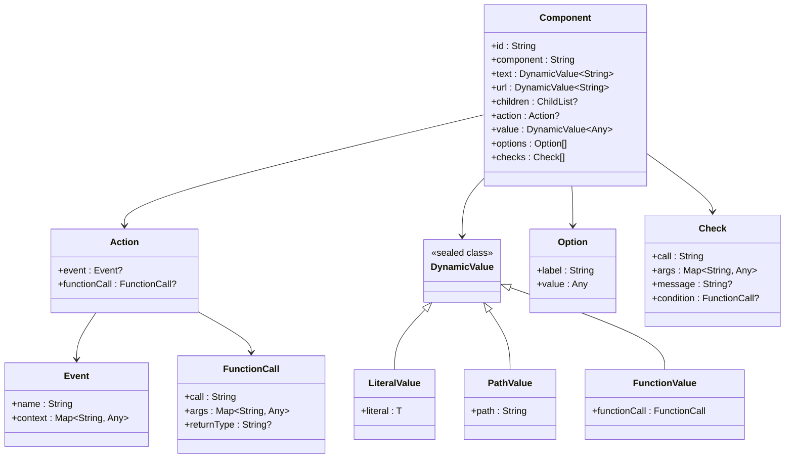

**图表来源**
- [A2UIMessage.kt:210-314](file://android_compose/src/main/java/org/a2ui/compose/data/A2UIMessage.kt#L210-L314)

**章节来源**
- [A2UIMessage.kt:1-314](file://android_compose/src/main/java/org/a2ui/compose/data/A2UIMessage.kt#L1-L314)

### Feishu 集成客户端

OkHttpFeishuClient 提供了与飞书平台的完整集成：

#### WebSocket 连接流程

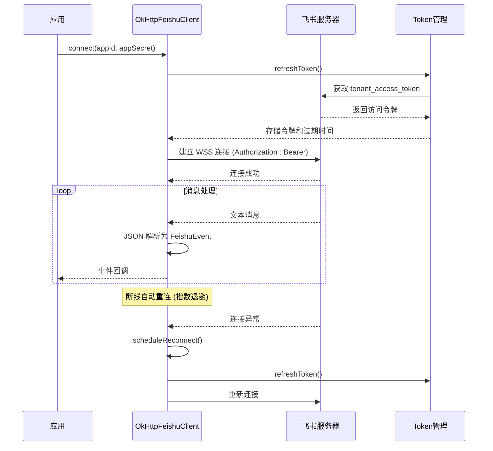

**图表来源**
- [OkHttpFeishuClient.kt:31-73](file://app/src/main/java/ai/openclaw/android/feishu/OkHttpFeishuClient.kt#L31-L73)

**章节来源**
- [OkHttpFeishuClient.kt:14-262](file://app/src/main/java/ai/openclaw/android/feishu/OkHttpFeishuClient.kt#L14-L262)

## 依赖关系分析

网络传输层的依赖关系呈现清晰的分层结构：

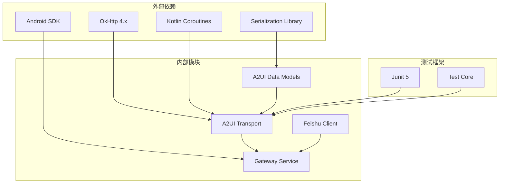

**图表来源**
- [A2UITransport.kt:3-5](file://android_compose/src/main/java/org/a2ui/compose/transport/A2UITransport.kt#L3-L5)
- [NetworkTransport.kt:3-9](file://android_compose/src/main/java/org/a2ui/compose/transport/NetworkTransport.kt#L3-L9)

### 关键依赖特性

1. **OkHttp 集成**: 提供高性能的 HTTP/HTTPS 通信能力
2. **协程支持**: 基于 Kotlin Coroutines 的异步编程模型
3. **序列化支持**: 使用 kotlinx.serialization 处理 JSON 数据
4. **测试覆盖**: 完整的单元测试确保代码质量

**章节来源**
- [NetworkTransportMemoryLeakTest.kt:1-231](file://android_compose/src/test/java/org/a2ui/compose/transport/NetworkTransportMemoryLeakTest.kt#L1-L231)

## 性能考虑

### 连接池管理

系统通过共享的 OkHttpClient 实例实现高效的连接池管理：

- **连接复用**: 同一客户端实例复用 HTTP/2 连接
- **线程池优化**: 自动管理后台线程执行
- **内存控制**: 通过 evictAll() 清理闲置连接
- **超时配置**: 精确控制连接和读取超时

### 内存泄漏防护

测试用例验证了关键的内存泄漏防护机制：

```mermaid
flowchart LR
A[传输层创建] --> B[启动协程任务]
B --> C[建立网络连接]
C --> D[用户调用 close()]
D --> E[取消所有协程]
E --> F[关闭网络连接]
F --> G[释放客户端资源]
G --> H[防止内存泄漏]
subgraph "测试验证"
I[多次 close 调用安全]
J[发送消息抛出异常]
K[状态正确更新]
end
H --> I
H --> J
H --> K
```

**图表来源**
- [NetworkTransportMemoryLeakTest.kt:11-36](file://android_compose/src/test/java/org/a2ui/compose/transport/NetworkTransportMemoryLeakTest.kt#L11-L36)

### 性能监控

系统集成了多种性能监控机制：

- **日志管理**: 中央化的日志收集和实时显示
- **渲染监控**: 帧率和渲染性能跟踪
- **数据质量**: 流式数据的丢包率和更新频率统计

**章节来源**
- [LogManager.kt:16-65](file://app/src/main/java/ai/openclaw/android/LogManager.kt#L16-L65)

## 故障排除指南

### 常见问题诊断

#### 连接问题排查

1. **检查网络配置**
   - 验证 `network_security_config.xml` 设置
   - 确认 HTTPS 证书有效性
   - 检查防火墙和代理设置

2. **查看连接状态**
   ```kotlin
   // 监听传输状态变化
   transport.state.collect { state ->
       when (state) {
           is TransportState.Disconnected -> log("Disconnected")
           is TransportState.Connecting -> log("Connecting...")
           is TransportState.Connected -> log("Connected")
           is TransportState.Error -> log("Error: ${state.message}")
       }
   }
   ```

3. **启用详细日志**
   - 查看 GatewayService 日志
   - 监控 OkHttp 事件
   - 检查自动重连行为

#### 错误处理策略

系统提供了多层次的错误处理机制：

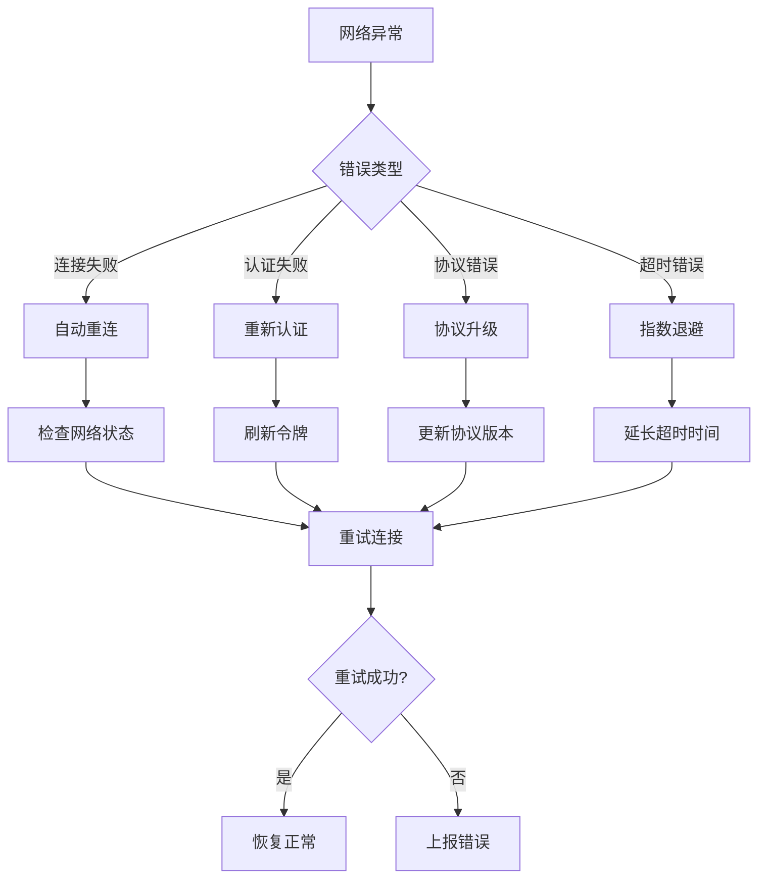

**图表来源**
- [NetworkTransport.kt:92-107](file://android_compose/src/main/java/org/a2ui/compose/transport/NetworkTransport.kt#L92-L107)

### 调试工具使用

#### 日志系统

```kotlin
// 获取全局日志管理器
val logManager = LogManager.shared

// 添加日志条目
logManager.log("INFO", "Transport", "连接状态变更")

// 监听日志流
lifecycleScope.launch {
    logManager.logs.collect { logs ->
        // 更新 UI 显示
    }
}
```

#### 性能监控

- **渲染性能**: 监控 FPS 和帧时间方差
- **数据质量**: 跟踪流式数据的丢包率
- **连接健康**: 监控重连次数和成功率

**章节来源**
- [GatewayService.kt:170-211](file://app/src/main/java/ai/openclaw/android/GatewayService.kt#L170-L211)

## 结论

OpenClaw Android 项目的网络传输层展现了现代 Android 应用的优秀实践：

### 主要优势

1. **模块化设计**: 清晰的接口抽象和分层架构
2. **高可用性**: 完善的自动重连和错误恢复机制
3. **性能优化**: 高效的连接池管理和内存控制
4. **安全性**: 强制 HTTPS 和严格的证书验证
5. **可观测性**: 全面的日志记录和性能监控

### 技术亮点

- **A2UI 协议**: 专为 UI 交互优化的数据格式
- **协程集成**: 基于 Kotlin Coroutines 的异步编程
- **测试覆盖**: 完整的单元测试确保代码质量
- **扩展性**: 易于添加新的传输方式和协议

### 改进建议

1. **监控增强**: 添加更详细的性能指标收集
2. **配置管理**: 提供动态配置热更新
3. **安全加固**: 支持自定义证书验证
4. **文档完善**: 补充 API 使用示例和最佳实践

## 附录

### SSL/TLS 配置

系统采用严格的 SSL/TLS 配置：

```xml
<network-security-config>
    <base-config cleartextTrafficPermitted="false">
        <trust-anchors>
            <certificates src="system" />
        </trust-anchors>
    </base-config>
</network-security-config>
```

### 超时设置

- **连接超时**: 10 秒
- **读取超时**: 无限制 (0 毫秒)
- **心跳间隔**: 30 秒
- **重连延迟**: 3 秒初始值

### 扩展指导

#### 自定义传输适配器

```kotlin
class CustomTransport(
    private val url: String,
    private val config: CustomConfig
) : A2UITransport {
    
    override val state: Flow<TransportState> = MutableStateFlow(TransportState.Disconnected)
    override val messages: Flow<String> = MutableSharedFlow()
    
    override suspend fun connect() {
        // 实现自定义连接逻辑
    }
    
    override suspend fun disconnect() {
        // 实现自定义断开逻辑
    }
    
    override suspend fun send(message: String) {
        // 实现自定义发送逻辑
    }
}
```

#### 中间件机制

```kotlin
class TransportMiddleware(
    private val transport: A2UITransport,
    private val interceptors: List<Interceptor>
) : A2UITransport {
    
    override val state: Flow<TransportState> = transport.state
    override val messages: Flow<String> = transport.messages
    
    override suspend fun connect() {
        interceptors.forEach { it.preConnect() }
        transport.connect()
        interceptors.forEach { it.postConnect() }
    }
    
    override suspend fun send(message: String) {
        val interceptedMessage = interceptors.fold(message) { msg, interceptor ->
            interceptor.intercept(msg)
        }
        transport.send(interceptedMessage)
    }
}
```