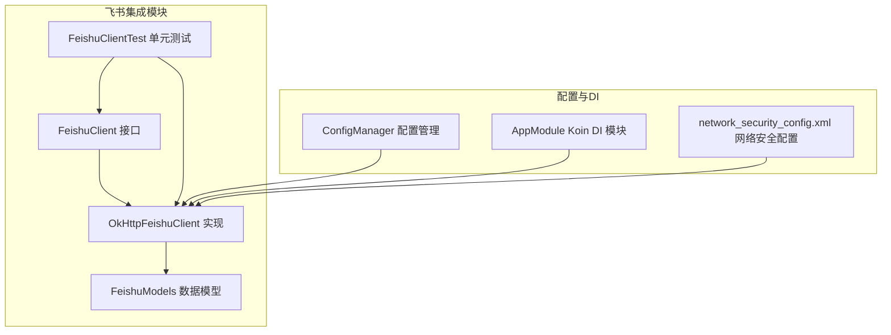
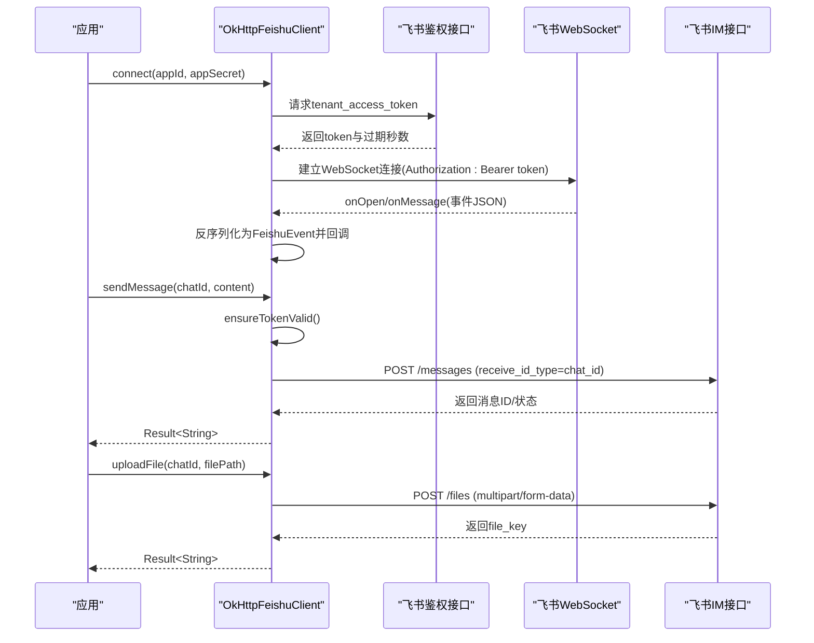
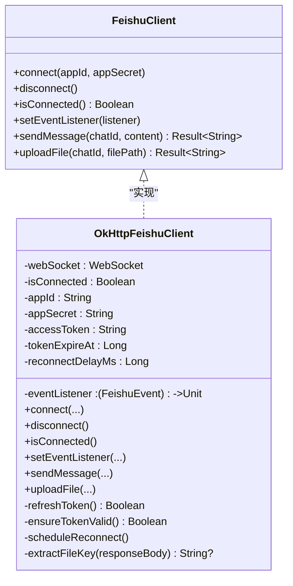
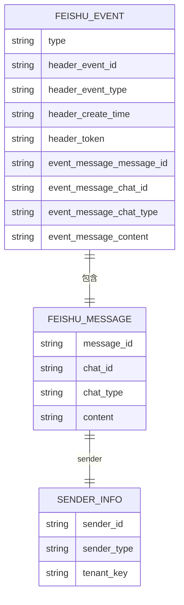
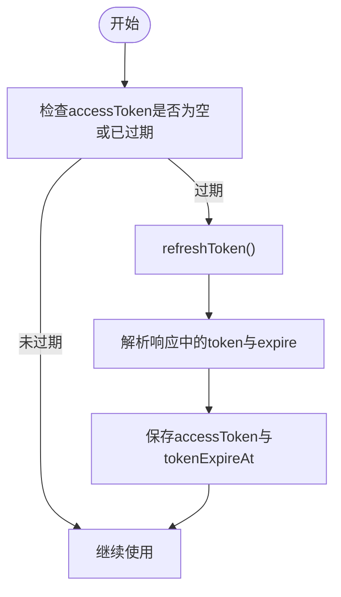
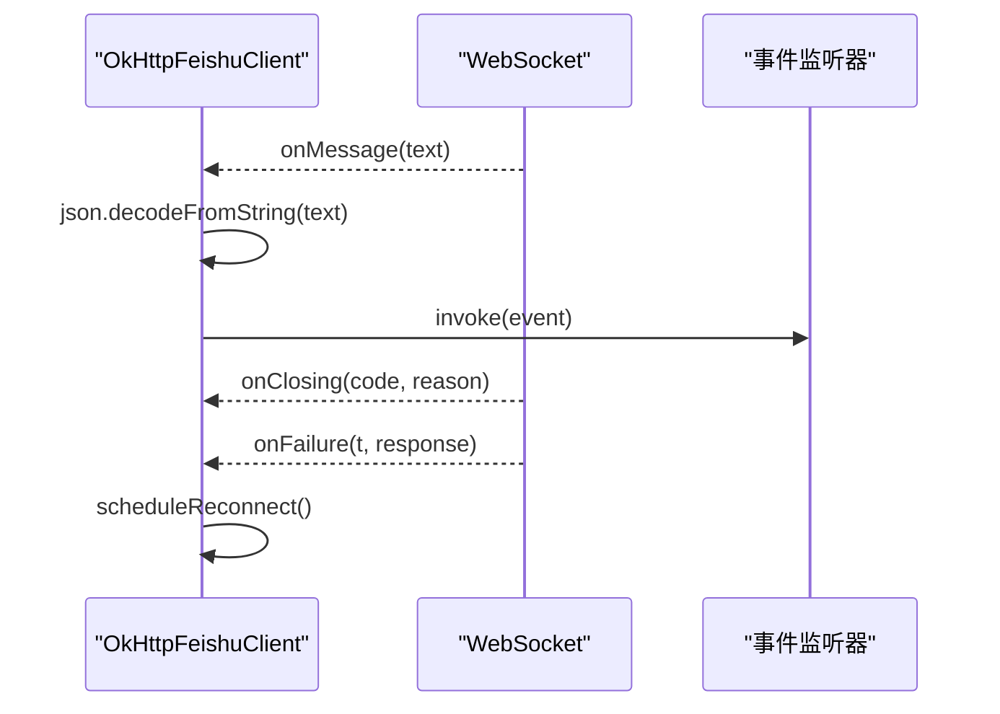
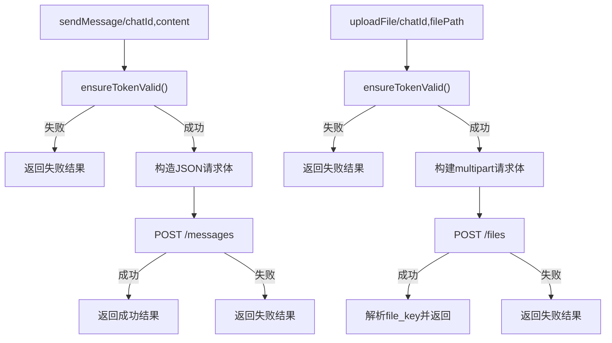
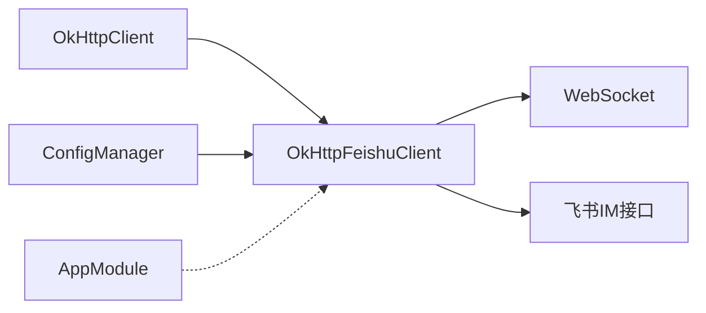

# 飞书集成

<cite>
**本文引用的文件列表**
- [FeishuClient.kt](file://app/src/main/java/ai/openclaw/android/feishu/FeishuClient.kt)
- [FeishuModels.kt](file://app/src/main/java/ai/openclaw/android/feishu/FeishuModels.kt)
- [OkHttpFeishuClient.kt](file://app/src/main/java/ai/openclaw/android/feishu/OkHttpFeishuClient.kt)
- [FeishuClientTest.kt](file://app/src/test/java/ai/openclaw/android/feishu/FeishuClientTest.kt)
- [ConfigManager.kt](file://app/src/main/java/ai/openclaw/android/ConfigManager.kt)
- [AppModule.kt](file://app/src/main/java/ai/openclaw/android/di/AppModule.kt)
- [network_security_config.xml](file://app/src/main/res/xml/network_security_config.xml)
</cite>

## 目录
1. [简介](#简介)
2. [项目结构](#项目结构)
3. [核心组件](#核心组件)
4. [架构总览](#架构总览)
5. [详细组件分析](#详细组件分析)
6. [依赖关系分析](#依赖关系分析)
7. [性能与可靠性](#性能与可靠性)
8. [故障排查指南](#故障排查指南)
9. [结论](#结论)
10. [附录](#附录)

## 简介
本文件面向飞书集成的技术实现，基于仓库中的飞书客户端代码，系统性梳理飞书机器人API的集成架构、认证流程、消息收发与处理、WebSocket实时通信、消息格式与富文本支持、交互式卡片实现、错误处理与重试策略、限流控制、配置与权限管理最佳实践，以及调试与问题排查方法。同时提供可复用的集成模板，便于迁移到其他企业微信平台。

## 项目结构
飞书集成相关代码位于应用模块的 feishu 包下，采用接口+实现分离的设计，配合配置管理与Koin依赖注入模块，形成清晰的职责边界与可测试性。

图表来源
- [FeishuClient.kt:1-36](file://app/src/main/java/ai/openclaw/android/feishu/FeishuClient.kt#L1-L36)
- [OkHttpFeishuClient.kt:1-280](file://app/src/main/java/ai/openclaw/android/feishu/OkHttpFeishuClient.kt#L1-L280)
- [FeishuModels.kt:1-54](file://app/src/main/java/ai/openclaw/android/feishu/FeishuModels.kt#L1-L54)
- [FeishuClientTest.kt:1-149](file://app/src/test/java/ai/openclaw/android/feishu/FeishuClientTest.kt#L1-L149)
- [ConfigManager.kt:1-136](file://app/src/main/java/ai/openclaw/android/ConfigManager.kt#L1-L136)
- [AppModule.kt:1-79](file://app/src/main/java/ai/openclaw/android/di/AppModule.kt#L1-L79)
- [network_security_config.xml:1-8](file://app/src/main/res/xml/network_security_config.xml#L1-L8)

章节来源
- [FeishuClient.kt:1-36](file://app/src/main/java/ai/openclaw/android/feishu/FeishuClient.kt#L1-L36)
- [OkHttpFeishuClient.kt:1-280](file://app/src/main/java/ai/openclaw/android/feishu/OkHttpFeishuClient.kt#L1-L280)
- [FeishuModels.kt:1-54](file://app/src/main/java/ai/openclaw/android/feishu/FeishuModels.kt#L1-L54)
- [FeishuClientTest.kt:1-149](file://app/src/test/java/ai/openclaw/android/feishu/FeishuClientTest.kt#L1-L149)
- [ConfigManager.kt:1-136](file://app/src/main/java/ai/openclaw/android/ConfigManager.kt#L1-L136)
- [AppModule.kt:1-79](file://app/src/main/java/ai/openclaw/android/di/AppModule.kt#L1-L79)
- [network_security_config.xml:1-8](file://app/src/main/res/xml/network_security_config.xml#L1-L8)

## 核心组件
- 接口层：定义飞书客户端能力边界，包括连接、断开、事件监听、消息发送、文件上传等。
- 实现层：基于OkHttp与WebSocket实现，内置Token刷新、过期保护、断线重连与指数退避。
- 数据模型：序列化/反序列化飞书事件与消息体，支撑实时消息处理。
- 配置管理：集中存储飞书应用ID与密钥，支持加密存储与存在性校验。
- 测试：接口契约验证、数据模型序列化一致性、基础行为覆盖。

章节来源
- [FeishuClient.kt:6-36](file://app/src/main/java/ai/openclaw/android/feishu/FeishuClient.kt#L6-L36)
- [OkHttpFeishuClient.kt:14-280](file://app/src/main/java/ai/openclaw/android/feishu/OkHttpFeishuClient.kt#L14-L280)
- [FeishuModels.kt:8-54](file://app/src/main/java/ai/openclaw/android/feishu/FeishuModels.kt#L8-L54)
- [ConfigManager.kt:102-122](file://app/src/main/java/ai/openclaw/android/ConfigManager.kt#L102-L122)
- [FeishuClientTest.kt:22-31](file://app/src/test/java/ai/openclaw/android/feishu/FeishuClientTest.kt#L22-L31)

## 架构总览
飞书集成采用“接口抽象 + OkHttp + WebSocket”的架构：
- 认证：通过内部租户访问令牌接口获取tenant_access_token，并在过期前刷新。
- 实时通信：建立WebSocket连接，订阅飞书事件；事件到达后反序列化为模型并回调上层。
- 消息发送：通过IM消息接口发送文本消息；支持文件上传并返回file_key。
- 错误处理：统一Result封装，异常捕获与失败返回；WebSocket断线指数退避重连。

图表来源
- [OkHttpFeishuClient.kt:31-73](file://app/src/main/java/ai/openclaw/android/feishu/OkHttpFeishuClient.kt#L31-L73)
- [OkHttpFeishuClient.kt:89-124](file://app/src/main/java/ai/openclaw/android/feishu/OkHttpFeishuClient.kt#L89-L124)
- [OkHttpFeishuClient.kt:126-170](file://app/src/main/java/ai/openclaw/android/feishu/OkHttpFeishuClient.kt#L126-L170)
- [OkHttpFeishuClient.kt:176-221](file://app/src/main/java/ai/openclaw/android/feishu/OkHttpFeishuClient.kt#L176-L221)

## 详细组件分析

### 接口与实现：FeishuClient 与 OkHttpFeishuClient
- 接口职责：暴露连接、断开、事件监听、消息发送、文件上传等方法，确保上层不依赖具体实现。
- 实现要点：
  - WebSocket连接与事件分发：onOpen/onMessage/onFailure/onClosing 生命周期处理。
  - 认证与过期保护：refreshToken + ensureTokenValid，过期前刷新。
  - 指数退避重连：scheduleReconnect，最大延迟上限。
  - 消息发送：构造JSON请求体，携带Authorization与Content-Type。
  - 文件上传：multipart/form-data，提取file_key用于后续消息引用。

图表来源
- [FeishuClient.kt:6-36](file://app/src/main/java/ai/openclaw/android/feishu/FeishuClient.kt#L6-L36)
- [OkHttpFeishuClient.kt:14-280](file://app/src/main/java/ai/openclaw/android/feishu/OkHttpFeishuClient.kt#L14-L280)

章节来源
- [FeishuClient.kt:6-36](file://app/src/main/java/ai/openclaw/android/feishu/FeishuClient.kt#L6-L36)
- [OkHttpFeishuClient.kt:14-280](file://app/src/main/java/ai/openclaw/android/feishu/OkHttpFeishuClient.kt#L14-L280)

### 数据模型：事件与消息
- FeishuEvent：包含事件类型、头部信息与事件主体。
- EventHeader：事件ID、事件类型、创建时间、token。
- EventBody：消息体，包含FeishuMessage。
- FeishuMessage：消息ID、聊天ID、聊天类型(p2p/group)、内容、发送者信息。
- SenderInfo：发送者ID、发送者类型、租户标识。

图表来源
- [FeishuModels.kt:8-54](file://app/src/main/java/ai/openclaw/android/feishu/FeishuModels.kt#L8-L54)

章节来源
- [FeishuModels.kt:8-54](file://app/src/main/java/ai/openclaw/android/feishu/FeishuModels.kt#L8-L54)

### 认证与Token管理
- 使用内部租户访问令牌接口获取tenant_access_token，并记录过期时间。
- ensureTokenValid在过期前自动刷新，避免请求失败。
- 日志输出便于调试与监控。

图表来源
- [OkHttpFeishuClient.kt:176-221](file://app/src/main/java/ai/openclaw/android/feishu/OkHttpFeishuClient.kt#L176-L221)
- [OkHttpFeishuClient.kt:226-231](file://app/src/main/java/ai/openclaw/android/feishu/OkHttpFeishuClient.kt#L226-L231)

章节来源
- [OkHttpFeishuClient.kt:176-231](file://app/src/main/java/ai/openclaw/android/feishu/OkHttpFeishuClient.kt#L176-L231)

### 实时通信与事件处理
- WebSocket连接建立后，onMessage中将文本消息反序列化为FeishuEvent并回调给上层。
- onClosing与onFailure触发断线标记与重连调度。
- 事件监听器通过setEventListener注册，便于业务侧订阅消息。

图表来源
- [OkHttpFeishuClient.kt:43-72](file://app/src/main/java/ai/openclaw/android/feishu/OkHttpFeishuClient.kt#L43-L72)
- [OkHttpFeishuClient.kt:236-250](file://app/src/main/java/ai/openclaw/android/feishu/OkHttpFeishuClient.kt#L236-L250)

章节来源
- [OkHttpFeishuClient.kt:43-72](file://app/src/main/java/ai/openclaw/android/feishu/OkHttpFeishuClient.kt#L43-L72)
- [OkHttpFeishuClient.kt:236-250](file://app/src/main/java/ai/openclaw/android/feishu/OkHttpFeishuClient.kt#L236-L250)

### 消息发送与文件上传
- 文本消息：构造JSON请求体，设置receive_id_type=chat_id，Authorization携带token。
- 文件上传：multipart/form-data，解析响应提取file_key，供后续消息引用。
- 统一Result封装，异常捕获与失败返回。

图表来源
- [OkHttpFeishuClient.kt:89-124](file://app/src/main/java/ai/openclaw/android/feishu/OkHttpFeishuClient.kt#L89-L124)
- [OkHttpFeishuClient.kt:126-170](file://app/src/main/java/ai/openclaw/android/feishu/OkHttpFeishuClient.kt#L126-L170)

章节来源
- [OkHttpFeishuClient.kt:89-170](file://app/src/main/java/ai/openclaw/android/feishu/OkHttpFeishuClient.kt#L89-L170)

### 飞书消息格式、富文本与交互式卡片
- 当前实现以文本消息为主，消息体字段包含消息ID、聊天ID、聊天类型、内容与发送者信息。
- 富文本与交互式卡片需结合飞书官方消息格式扩展，建议在content中使用飞书支持的JSON结构（如富文本段落、按钮、选择器等），并在上层解析渲染。
- 本仓库未包含富文本与卡片的具体实现细节，建议参考飞书开放平台文档进行扩展。

章节来源
- [FeishuModels.kt:38-44](file://app/src/main/java/ai/openclaw/android/feishu/FeishuModels.kt#L38-L44)

### 配置与权限管理
- 飞书应用ID与密钥通过ConfigManager进行加密存储与读取，支持hasFeishuCredentials统一校验。
- AppModule中未直接声明飞书客户端单例，可在需要的地方通过Koin注入或直接构造OkHttpFeishuClient实例。
- 网络安全配置禁止明文流量，确保HTTPS传输。

章节来源
- [ConfigManager.kt:102-122](file://app/src/main/java/ai/openclaw/android/ConfigManager.kt#L102-L122)
- [network_security_config.xml:1-8](file://app/src/main/res/xml/network_security_config.xml#L1-L8)

### 测试与契约验证
- 单元测试验证接口方法存在性、数据模型序列化/反序列化正确性。
- 建议补充对网络请求、WebSocket事件、Token刷新、重连逻辑的集成测试。

章节来源
- [FeishuClientTest.kt:22-31](file://app/src/test/java/ai/openclaw/android/feishu/FeishuClientTest.kt#L22-L31)
- [FeishuClientTest.kt:34-85](file://app/src/test/java/ai/openclaw/android/feishu/FeishuClientTest.kt#L34-L85)

## 依赖关系分析
- OkHttpFeishuClient依赖OkHttp客户端与WebSocket，负责网络与实时通信。
- ConfigManager提供配置读写，确保敏感信息加密存储。
- AppModule未直接绑定飞书客户端，建议在业务模块中按需注入或构造。

图表来源
- [OkHttpFeishuClient.kt:14](file://app/src/main/java/ai/openclaw/android/feishu/OkHttpFeishuClient.kt#L14)
- [ConfigManager.kt:102-122](file://app/src/main/java/ai/openclaw/android/ConfigManager.kt#L102-L122)
- [AppModule.kt:24-79](file://app/src/main/java/ai/openclaw/android/di/AppModule.kt#L24-L79)

章节来源
- [OkHttpFeishuClient.kt:14](file://app/src/main/java/ai/openclaw/android/feishu/OkHttpFeishuClient.kt#L14)
- [ConfigManager.kt:102-122](file://app/src/main/java/ai/openclaw/android/ConfigManager.kt#L102-L122)
- [AppModule.kt:24-79](file://app/src/main/java/ai/openclaw/android/di/AppModule.kt#L24-L79)

## 性能与可靠性
- Token过期保护：提前5分钟刷新，减少请求失败概率。
- 指数退避重连：避免频繁重连造成抖动，最大延迟上限防止雪崩。
- 异步网络：基于OkHttp的异步调用，配合suspend扩展函数提升协程友好性。
- 结果封装：统一Result返回，便于上层处理成功/失败分支。

章节来源
- [OkHttpFeishuClient.kt:204-207](file://app/src/main/java/ai/openclaw/android/feishu/OkHttpFeishuClient.kt#L204-L207)
- [OkHttpFeishuClient.kt:236-250](file://app/src/main/java/ai/openclaw/android/feishu/OkHttpFeishuClient.kt#L236-L250)
- [OkHttpFeishuClient.kt:265-280](file://app/src/main/java/ai/openclaw/android/feishu/OkHttpFeishuClient.kt#L265-L280)

## 故障排查指南
- 认证失败
  - 检查ConfigManager中是否正确保存了飞书App ID与Secret。
  - 观察日志中token刷新与过期时间记录，确认是否提前刷新。
- WebSocket断线
  - 查看onFailure/onClosing日志，确认是否触发scheduleReconnect。
  - 检查网络策略与证书信任配置。
- 消息发送失败
  - 校验Authorization头与Content-Type。
  - 检查receive_id_type与chat_id是否正确。
- 文件上传失败
  - 确认文件路径存在且可读。
  - 检查响应体中file_key提取逻辑与JSON格式。

章节来源
- [ConfigManager.kt:102-122](file://app/src/main/java/ai/openclaw/android/ConfigManager.kt#L102-L122)
- [OkHttpFeishuClient.kt:67-71](file://app/src/main/java/ai/openclaw/android/feishu/OkHttpFeishuClient.kt#L67-L71)
- [OkHttpFeishuClient.kt:115-120](file://app/src/main/java/ai/openclaw/android/feishu/OkHttpFeishuClient.kt#L115-L120)
- [OkHttpFeishuClient.kt:164-166](file://app/src/main/java/ai/openclaw/android/feishu/OkHttpFeishuClient.kt#L164-L166)

## 结论
该飞书集成以接口抽象与OkHttp/WebSocket实现为核心，具备完善的认证、实时通信、消息发送与文件上传能力，并通过加密配置与指数退避重连保障稳定性。建议在现有基础上扩展富文本与交互式卡片支持，并完善网络与限流策略的配置化与可观测性。

## 附录
- 集成模板（迁移至其他企业微信平台）
  - 定义平台无关接口，抽象认证、WebSocket、消息发送、文件上传等能力。
  - 平台特定实现类中替换URL、请求头、消息体结构与错误码映射。
  - 保持统一的Result封装与日志输出，便于统一测试与监控。
  - 在ConfigManager中增加平台配置项，支持多平台切换。