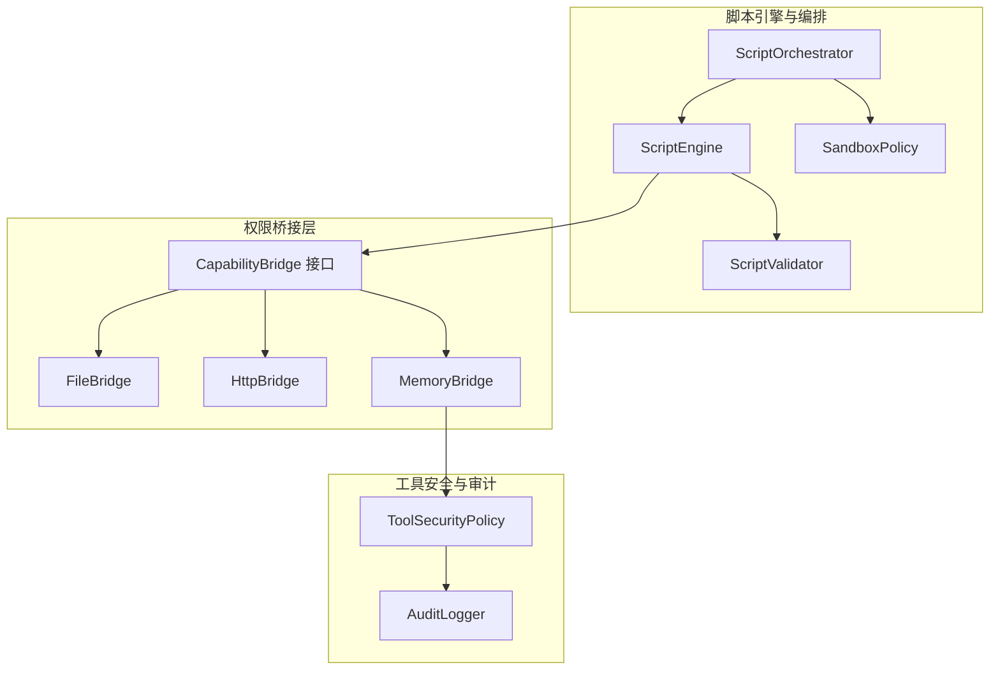
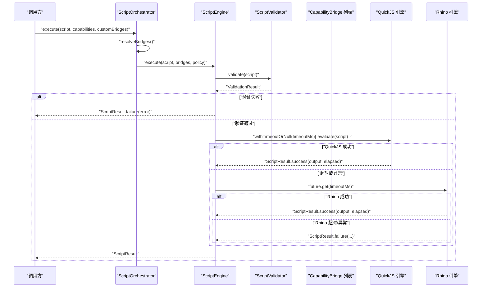
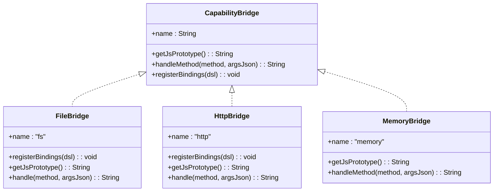
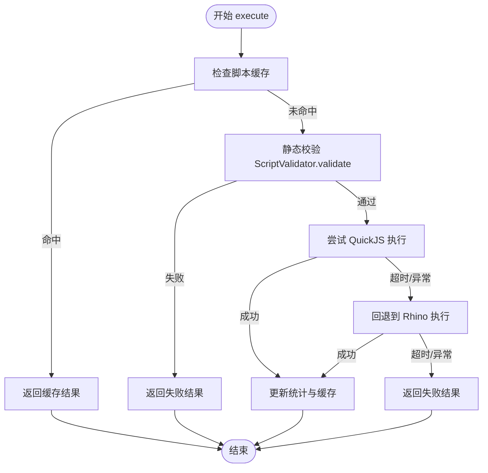
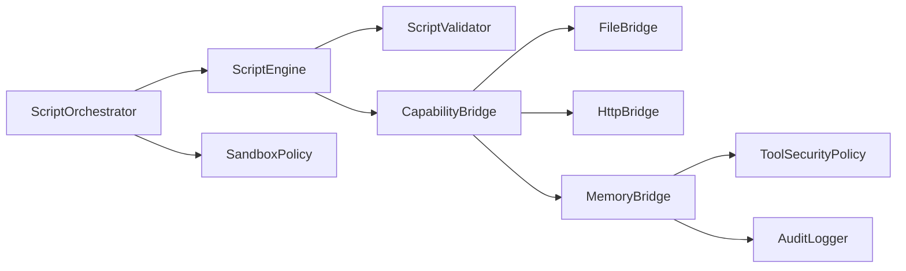

# 沙箱安全策略

<cite>
**本文引用的文件**
- [SandboxPolicy.kt](file://script/src/main/java/ai/openclaw/script/SandboxPolicy.kt)
- [CapabilityBridge.kt](file://script/src/main/java/ai/openclaw/script/CapabilityBridge.kt)
- [ScriptEngine.kt](file://script/src/main/java/ai/openclaw/script/ScriptEngine.kt)
- [ScriptOrchestrator.kt](file://script/src/main/java/ai/openclaw/script/ScriptOrchestrator.kt)
- [FileBridge.kt](file://script/src/main/java/ai/openclaw/script/bridge/FileBridge.kt)
- [HttpBridge.kt](file://script/src/main/java/ai/openclaw/script/bridge/HttpBridge.kt)
- [MemoryBridge.kt](file://script/src/main/java/ai/openclaw/script/bridge/MemoryBridge.kt)
- [ScriptValidator.kt](file://script/src/main/java/ai/openclaw/script/ScriptValidator.kt)
- [ToolSecurityPolicy.kt](file://app/src/main/java/ai/openclaw/android/skill/ToolSecurityPolicy.kt)
- [AuditLogger.kt](file://app/src/main/java/ai/openclaw/android/security/AuditLogger.kt)
- [ScriptSkill.kt](file://app/src/main/java/ai/openclaw/android/skill/builtin/ScriptSkill.kt)
- [FileBridgeTest.kt](file://script/src/test/java/ai/openclaw/script/bridge/FileBridgeTest.kt)
- [HttpBridgeTest.kt](file://script/src/test/java/ai/openclaw/script/bridge/HttpBridgeTest.kt)
- [SandboxPolicyTest.kt](file://script/src/test/java/ai/openclaw/script/SandboxPolicyTest.kt)
- [CapabilityBridgeTest.kt](file://script/src/test/java/ai/openclaw/script/CapabilityBridgeTest.kt)
</cite>

## 目录
1. [简介](#简介)
2. [项目结构](#项目结构)
3. [核心组件](#核心组件)
4. [架构总览](#架构总览)
5. [详细组件分析](#详细组件分析)
6. [依赖关系分析](#依赖关系分析)
7. [性能考量](#性能考量)
8. [故障排查指南](#故障排查指南)
9. [结论](#结论)
10. [附录](#附录)

## 简介
本文件面向“脚本执行环境的安全隔离与权限控制”主题，系统化梳理 OpenClaw Android 项目中脚本沙箱的设计与实现。重点包括：
- SandboxPolicy 的策略定义与实施方式
- CapabilityBridge 的权限桥接与 API 暴露控制
- 资源限制与访问控制（超时、内存、路径穿越防护、网络域白名单等）
- 安全策略的配置管理与动态调整机制
- 安全威胁分析与防护措施
- 安全审计与日志记录方案
- 性能影响与优化建议

## 项目结构
围绕脚本沙箱与安全策略的相关模块主要分布在以下位置：
- 脚本引擎与编排：script 模块下的 ScriptEngine、ScriptOrchestrator、SandboxPolicy、ScriptValidator
- 权限桥接层：script 模块下的 CapabilityBridge 接口及 FileBridge、HttpBridge、MemoryBridge 实现
- 工具安全策略与审计：app 模块下的 ToolSecurityPolicy、AuditLogger
- 内置脚本技能：app 模块下的 ScriptSkill，将脚本能力接入技能体系

图表来源
- [ScriptOrchestrator.kt:13-54](file://script/src/main/java/ai/openclaw/script/ScriptOrchestrator.kt#L13-L54)
- [ScriptEngine.kt:22-99](file://script/src/main/java/ai/openclaw/script/ScriptEngine.kt#L22-L99)
- [SandboxPolicy.kt:8-15](file://script/src/main/java/ai/openclaw/script/SandboxPolicy.kt#L8-L15)
- [ScriptValidator.kt:8-59](file://script/src/main/java/ai/openclaw/script/ScriptValidator.kt#L8-L59)
- [CapabilityBridge.kt:13-32](file://script/src/main/java/ai/openclaw/script/CapabilityBridge.kt#L13-L32)
- [FileBridge.kt:20-120](file://script/src/main/java/ai/openclaw/script/bridge/FileBridge.kt#L20-L120)
- [HttpBridge.kt:18-87](file://script/src/main/java/ai/openclaw/script/bridge/HttpBridge.kt#L18-L87)
- [MemoryBridge.kt:14-49](file://script/src/main/java/ai/openclaw/script/bridge/MemoryBridge.kt#L14-L49)
- [ToolSecurityPolicy.kt:6-71](file://app/src/main/java/ai/openclaw/android/skill/ToolSecurityPolicy.kt#L6-L71)
- [AuditLogger.kt:16-99](file://app/src/main/java/ai/openclaw/android/security/AuditLogger.kt#L16-L99)

章节来源
- [ScriptOrchestrator.kt:13-54](file://script/src/main/java/ai/openclaw/script/ScriptOrchestrator.kt#L13-L54)
- [ScriptEngine.kt:22-99](file://script/src/main/java/ai/openclaw/script/ScriptEngine.kt#L22-L99)
- [SandboxPolicy.kt:8-15](file://script/src/main/java/ai/openclaw/script/SandboxPolicy.kt#L8-L15)
- [ScriptValidator.kt:8-59](file://script/src/main/java/ai/openclaw/script/ScriptValidator.kt#L8-L59)
- [CapabilityBridge.kt:13-32](file://script/src/main/java/ai/openclaw/script/CapabilityBridge.kt#L13-L32)
- [FileBridge.kt:20-120](file://script/src/main/java/ai/openclaw/script/bridge/FileBridge.kt#L20-L120)
- [HttpBridge.kt:18-87](file://script/src/main/java/ai/openclaw/script/bridge/HttpBridge.kt#L18-L87)
- [MemoryBridge.kt:14-49](file://script/src/main/java/ai/openclaw/script/bridge/MemoryBridge.kt#L14-L49)
- [ToolSecurityPolicy.kt:6-71](file://app/src/main/java/ai/openclaw/android/skill/ToolSecurityPolicy.kt#L6-L71)
- [AuditLogger.kt:16-99](file://app/src/main/java/ai/openclaw/android/security/AuditLogger.kt#L16-L99)

## 核心组件
- SandboxPolicy：定义脚本执行的资源与访问限制，包括超时、最大内存、沙箱目录、网络与文件写入许可、允许域名白名单等。
- CapabilityBridge：统一的桥接接口，用于将 Android 能力以受控方式暴露给 JS 脚本；支持 QuickJS 与 Rhino 两种模式。
- ScriptEngine：脚本执行引擎，负责初始化、缓存、超时控制、回退机制、统计与错误处理。
- ScriptOrchestrator：执行入口，负责能力解析、沙箱目录准备与策略装配。
- FileBridge/HttpBridge/MemoryBridge：具体能力实现，分别提供文件读写、HTTP 请求与记忆系统桥接。
- ScriptValidator：静态校验器，在执行前拦截潜在危险模式。
- ToolSecurityPolicy：工具安全策略与用户审批偏好，用于对非幂等或高风险操作进行二次确认。
- AuditLogger：安全审计日志，记录关键操作并维护哈希链以检测篡改。

章节来源
- [SandboxPolicy.kt:8-15](file://script/src/main/java/ai/openclaw/script/SandboxPolicy.kt#L8-L15)
- [CapabilityBridge.kt:13-32](file://script/src/main/java/ai/openclaw/script/CapabilityBridge.kt#L13-L32)
- [ScriptEngine.kt:22-99](file://script/src/main/java/ai/openclaw/script/ScriptEngine.kt#L22-L99)
- [ScriptOrchestrator.kt:13-54](file://script/src/main/java/ai/openclaw/script/ScriptOrchestrator.kt#L13-L54)
- [FileBridge.kt:20-120](file://script/src/main/java/ai/openclaw/script/bridge/FileBridge.kt#L20-L120)
- [HttpBridge.kt:18-87](file://script/src/main/java/ai/openclaw/script/bridge/HttpBridge.kt#L18-L87)
- [MemoryBridge.kt:14-49](file://script/src/main/java/ai/openclaw/script/bridge/MemoryBridge.kt#L14-L49)
- [ScriptValidator.kt:8-59](file://script/src/main/java/ai/openclaw/script/ScriptValidator.kt#L8-L59)
- [ToolSecurityPolicy.kt:6-71](file://app/src/main/java/ai/openclaw/android/skill/ToolSecurityPolicy.kt#L6-L71)
- [AuditLogger.kt:16-99](file://app/src/main/java/ai/openclaw/android/security/AuditLogger.kt#L16-L99)

## 架构总览
下图展示从调用方到脚本执行、能力桥接与安全控制的整体流程。

图表来源
- [ScriptOrchestrator.kt:31-39](file://script/src/main/java/ai/openclaw/script/ScriptOrchestrator.kt#L31-L39)
- [ScriptEngine.kt:45-99](file://script/src/main/java/ai/openclaw/script/ScriptEngine.kt#L45-L99)
- [ScriptValidator.kt:42-58](file://script/src/main/java/ai/openclaw/script/ScriptValidator.kt#L42-L58)

## 详细组件分析

### SandboxPolicy：策略定义与实施
- 关键属性
  - 超时时间：毫秒级，防止长时间阻塞
  - 最大内存：MB 级，限制脚本运行内存占用
  - 沙箱目录：限定文件操作范围
  - 网络开关：允许/禁止网络访问
  - 文件写入开关：允许/禁止文件写入
  - 允许域名白名单：仅允许访问指定域名（可为空表示不限制）
- 实施方式
  - ScriptEngine 在执行时通过 withTimeoutOrNull 应用超时控制
  - FileBridge 对所有文件操作进行路径规范化与沙箱目录前缀校验，阻止路径穿越
  - HttpBridge 当前未直接应用 allowedDomains 白名单，但可通过策略扩展实现
- 动态调整
  - 通过构建新的 SandboxPolicy 实例传入 ScriptEngine.execute，即可动态切换策略

章节来源
- [SandboxPolicy.kt:8-15](file://script/src/main/java/ai/openclaw/script/SandboxPolicy.kt#L8-L15)
- [ScriptEngine.kt:120-142](file://script/src/main/java/ai/openclaw/script/ScriptEngine.kt#L120-L142)
- [FileBridge.kt:82-86](file://script/src/main/java/ai/openclaw/script/bridge/FileBridge.kt#L82-L86)

### CapabilityBridge：权限桥接与 API 暴露控制
- 设计目标
  - 将 Android 能力以最小化、可控的方式暴露给 JS
  - 支持 QuickJS 与 Rhino 两种模式，确保兼容性与安全性
- QuickJS 模式
  - 通过 ObjectBindingScope DSL 注册函数，参数以 JSON 字符串传递，避免直接反射调用
  - 由 ScriptEngine.dispatchBridge 分发到具体 Bridge 的 handle 或 handleMethod
- Rhino 模式
  - 通过 __nativeCall 机制将方法名与参数 JSON 传递至桥接层
  - 通过移除危险全局对象（如 java、Packages 等）降低风险
- API 暴露控制
  - 仅暴露显式声明的方法（如 fs.readFile、http.get、memory.recall 等）
  - 所有方法均返回 JSON 字符串，便于前端解析与错误传播

图表来源
- [CapabilityBridge.kt:13-32](file://script/src/main/java/ai/openclaw/script/CapabilityBridge.kt#L13-L32)
- [FileBridge.kt:20-120](file://script/src/main/java/ai/openclaw/script/bridge/FileBridge.kt#L20-L120)
- [HttpBridge.kt:18-87](file://script/src/main/java/ai/openclaw/script/bridge/HttpBridge.kt#L18-L87)
- [MemoryBridge.kt:14-49](file://script/src/main/java/ai/openclaw/script/bridge/MemoryBridge.kt#L14-L49)

章节来源
- [CapabilityBridge.kt:13-32](file://script/src/main/java/ai/openclaw/script/CapabilityBridge.kt#L13-L32)
- [ScriptEngine.kt:120-225](file://script/src/main/java/ai/openclaw/script/ScriptEngine.kt#L120-L225)
- [FileBridge.kt:31-80](file://script/src/main/java/ai/openclaw/script/bridge/FileBridge.kt#L31-L80)
- [HttpBridge.kt:26-64](file://script/src/main/java/ai/openclaw/script/bridge/HttpBridge.kt#L26-L64)
- [MemoryBridge.kt:18-48](file://script/src/main/java/ai/openclaw/script/bridge/MemoryBridge.kt#L18-L48)

### ScriptEngine：执行控制与资源限制
- 初始化与缓存
  - 每次执行创建独立 QuickJS 实例并在完成后释放，确保隔离
  - 基于脚本哈希的轻量缓存，命中则直接返回上次耗时
- 超时与回退
  - 使用 withTimeoutOrNull 控制执行时间
  - QuickJS 失败时自动回退到 Rhino，并记录警告
- 统计信息
  - 记录总执行次数、成功/失败次数、平均耗时、缓存大小与当前引擎类型
- 错误处理
  - 捕获异常并返回标准化 ScriptResult，避免泄漏内部细节

图表来源
- [ScriptEngine.kt:45-99](file://script/src/main/java/ai/openclaw/script/ScriptEngine.kt#L45-L99)
- [ScriptValidator.kt:42-58](file://script/src/main/java/ai/openclaw/script/ScriptValidator.kt#L42-L58)

章节来源
- [ScriptEngine.kt:22-231](file://script/src/main/java/ai/openclaw/script/ScriptEngine.kt#L22-L231)

### ScriptOrchestrator：能力解析与策略装配
- 能力解析
  - 支持 fs/file、http/network 等内置能力，未识别的能力通过自定义桥接扩展
- 策略装配
  - 默认使用 ScriptOrchestrator 内部创建的沙箱目录，结合 SandboxPolicy 构建执行策略
- 执行入口
  - 调用方仅需提供脚本与能力列表，即可完成从校验到执行的全流程

章节来源
- [ScriptOrchestrator.kt:13-54](file://script/src/main/java/ai/openclaw/script/ScriptOrchestrator.kt#L13-L54)

### FileBridge：文件操作与路径穿越防护
- API 暴露
  - readFile、writeFile、list、exists
- 安全控制
  - resolveSafe：基于 canonicalPath 与沙箱目录前缀校验，阻止路径穿越
  - 写入前确保父目录存在，避免越界创建
- 返回格式
  - 统一返回 JSON 字符串，包含成功状态、字节数、条目列表或存在性判断

章节来源
- [FileBridge.kt:20-120](file://script/src/main/java/ai/openclaw/script/bridge/FileBridge.kt#L20-L120)

### HttpBridge：HTTP 请求桥接
- API 暴露
  - get、post
- 安全控制
  - 使用 OkHttp 客户端，设置连接与读取超时
  - 当前未应用 allowedDomains 白名单，建议在策略层扩展
- 返回格式
  - 统一返回 JSON 字符串，包含状态码与响应体

章节来源
- [HttpBridge.kt:18-87](file://script/src/main/java/ai/openclaw/script/bridge/HttpBridge.kt#L18-L87)

### MemoryBridge：记忆系统桥接
- API 暴露
  - recall、store
- 安全控制
  - 通过 MemoryProvider 回调注入实际能力，避免直接访问底层存储
  - JS 端通过 __nativeCall 与 handleMethod 进行方法分发
- 与工具安全策略联动
  - 记忆系统的使用可结合 ToolSecurityPolicy 进行用户审批与策略判定

章节来源
- [MemoryBridge.kt:14-49](file://script/src/main/java/ai/openclaw/script/bridge/MemoryBridge.kt#L14-L49)
- [ToolSecurityPolicy.kt:6-71](file://app/src/main/java/ai/openclaw/android/skill/ToolSecurityPolicy.kt#L6-L71)

### ScriptValidator：静态安全校验
- 校验规则
  - 脚本大小上限
  - 禁止模块加载、动态求值、定时器、原型污染、Java/Android 访问、浏览器/全局对象等
- 作用点
  - 在 ScriptEngine.execute 前执行，避免进入执行阶段后再拦截

章节来源
- [ScriptValidator.kt:8-59](file://script/src/main/java/ai/openclaw/script/ScriptValidator.kt#L8-L59)

### 工具安全策略与用户审批
- ToolSecurityPolicy
  - AUTO_EXECUTE：幂等操作自动执行
  - ASK_USER：首次非幂等操作询问用户
  - DENY：用户已拒绝
- UserApprovalPreference
  - 记录用户对特定工具的审批偏好（总是允许/总是拒绝/每次都问）
- 与脚本技能集成
  - ScriptSkill 在执行脚本前可根据工具属性与用户偏好决定是否放行

章节来源
- [ToolSecurityPolicy.kt:6-71](file://app/src/main/java/ai/openclaw/android/skill/ToolSecurityPolicy.kt#L6-L71)
- [ScriptSkill.kt:64-132](file://app/src/main/java/ai/openclaw/android/skill/builtin/ScriptSkill.kt#L64-L132)

### 安全审计与日志记录
- AuditLogger
  - 记录关键操作（如存储、删除、合并、同步），包含时间戳、操作类型、目标 ID、详情与前一哈希
  - 维护哈希链，支持完整性校验与导出
  - 通过 LogManager 输出日志，便于统一收集与检索

章节来源
- [AuditLogger.kt:16-99](file://app/src/main/java/ai/openclaw/android/security/AuditLogger.kt#L16-L99)

## 依赖关系分析
- 组件耦合
  - ScriptOrchestrator 依赖 ScriptEngine 与 SandboxPolicy
  - ScriptEngine 依赖 ScriptValidator 与多种 CapabilityBridge 实现
  - FileBridge/HttpBridge/MemoryBridge 均实现 CapabilityBridge 接口
  - MemoryBridge 与 ToolSecurityPolicy 协作，用于工具安全策略
- 外部依赖
  - QuickJS-kt 与 Rhino（Mozilla JavaScript）
  - OkHttp 用于 HTTP 请求
  - Kotlinx Serialization 用于 JSON 解析

图表来源
- [ScriptOrchestrator.kt:13-54](file://script/src/main/java/ai/openclaw/script/ScriptOrchestrator.kt#L13-L54)
- [ScriptEngine.kt:22-99](file://script/src/main/java/ai/openclaw/script/ScriptEngine.kt#L22-L99)
- [FileBridge.kt:20-120](file://script/src/main/java/ai/openclaw/script/bridge/FileBridge.kt#L20-L120)
- [HttpBridge.kt:18-87](file://script/src/main/java/ai/openclaw/script/bridge/HttpBridge.kt#L18-L87)
- [MemoryBridge.kt:14-49](file://script/src/main/java/ai/openclaw/script/bridge/MemoryBridge.kt#L14-L49)
- [ToolSecurityPolicy.kt:6-71](file://app/src/main/java/ai/openclaw/android/skill/ToolSecurityPolicy.kt#L6-L71)
- [AuditLogger.kt:16-99](file://app/src/main/java/ai/openclaw/android/security/AuditLogger.kt#L16-L99)

## 性能考量
- 执行引擎
  - QuickJS 优先，具备更好的性能与内存表现；失败时自动回退 Rhino
  - withTimeoutOrNull 提供硬性超时保障，避免长时间阻塞
- 缓存策略
  - 基于脚本哈希的轻量缓存，命中即返回上次耗时，减少重复编译开销
- I/O 与网络
  - 文件操作严格限制在沙箱目录内，避免跨分区访问
  - HTTP 客户端设置连接/读取超时，防止阻塞
- 建议优化
  - 为 HttpBridge 增加 allowedDomains 白名单与连接池复用
  - 对频繁调用的能力（如 fs.list）增加本地缓存
  - 在策略层引入 maxMemoryMB 的更细粒度监控与回收

[本节为通用性能讨论，无需列出章节来源]

## 故障排查指南
- 常见问题与定位
  - 超时：检查 ScriptEngine 的 timeoutMs 设置与脚本复杂度
  - 静态校验失败：查看 ScriptValidator 的错误信息，确认是否包含被禁用的关键字
  - 文件路径错误：确认 FileBridge 的 resolveSafe 是否阻止了路径穿越
  - HTTP 请求失败：检查 URL 有效性与网络可达性
  - 能力未找到：确认 capabilities 列表与自定义桥接是否正确注册
- 日志与审计
  - 使用 ScriptEngine 的统计信息辅助定位性能瓶颈
  - 使用 AuditLogger 的 verifyChain 校验日志完整性
- 单元测试参考
  - SandboxPolicyTest：验证默认与自定义策略字段
  - CapabilityBridgeTest：验证桥接名称、JS 原型与方法分发
  - FileBridgeTest：验证文件读写、列表、存在性与路径穿越防护
  - HttpBridgeTest：验证注册方法存在与未知方法错误返回

章节来源
- [SandboxPolicyTest.kt:8-21](file://script/src/test/java/ai/openclaw/script/SandboxPolicyTest.kt#L8-L21)
- [CapabilityBridgeTest.kt:8-38](file://script/src/test/java/ai/openclaw/script/CapabilityBridgeTest.kt#L8-L38)
- [FileBridgeTest.kt:11-87](file://script/src/test/java/ai/openclaw/script/bridge/FileBridgeTest.kt#L11-L87)
- [HttpBridgeTest.kt:9-32](file://script/src/test/java/ai/openclaw/script/bridge/HttpBridgeTest.kt#L9-L32)
- [ScriptEngine.kt:104-111](file://script/src/main/java/ai/openclaw/script/ScriptEngine.kt#L104-L111)
- [AuditLogger.kt:69-78](file://app/src/main/java/ai/openclaw/android/security/AuditLogger.kt#L69-L78)

## 结论
本设计通过“策略驱动 + 桥接控制 + 静态校验 + 审计日志”的多层安全机制，实现了对脚本执行环境的强隔离与细粒度权限控制。SandboxPolicy 明确资源边界，CapabilityBridge 将能力以最小化接口暴露，ScriptValidator 在执行前拦截高危模式，AuditLogger 提供不可篡改的审计证据。整体架构兼顾安全性与可扩展性，适合在复杂业务场景中安全地执行动态脚本。

[本节为总结性内容，无需列出章节来源]

## 附录
- 配置与扩展建议
  - 策略管理：通过构建不同 SandboxPolicy 实例实现按场景差异化配置
  - 能力扩展：新增 CapabilityBridge 实现，遵循 JSON 参数约定与最小暴露原则
  - 审计增强：在关键节点（如脚本执行前后）记录上下文信息，提升可追溯性
- 测试清单
  - 覆盖静态校验、超时、路径穿越、HTTP 请求、能力桥接与缓存命中等场景

[本节为补充内容，无需列出章节来源]