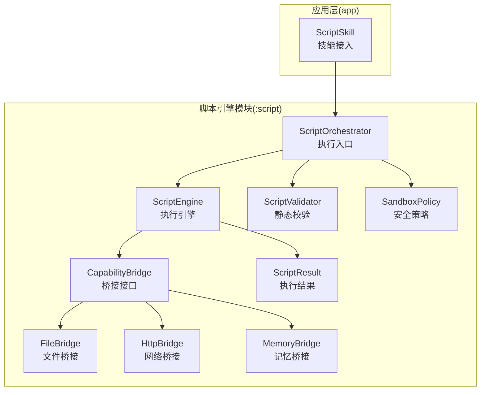
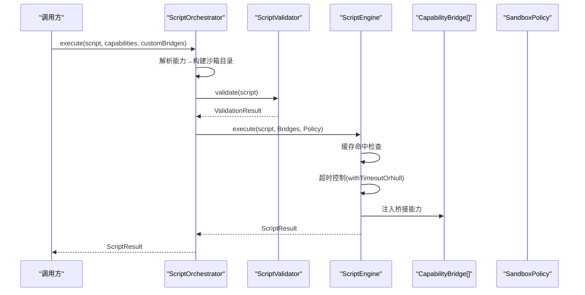
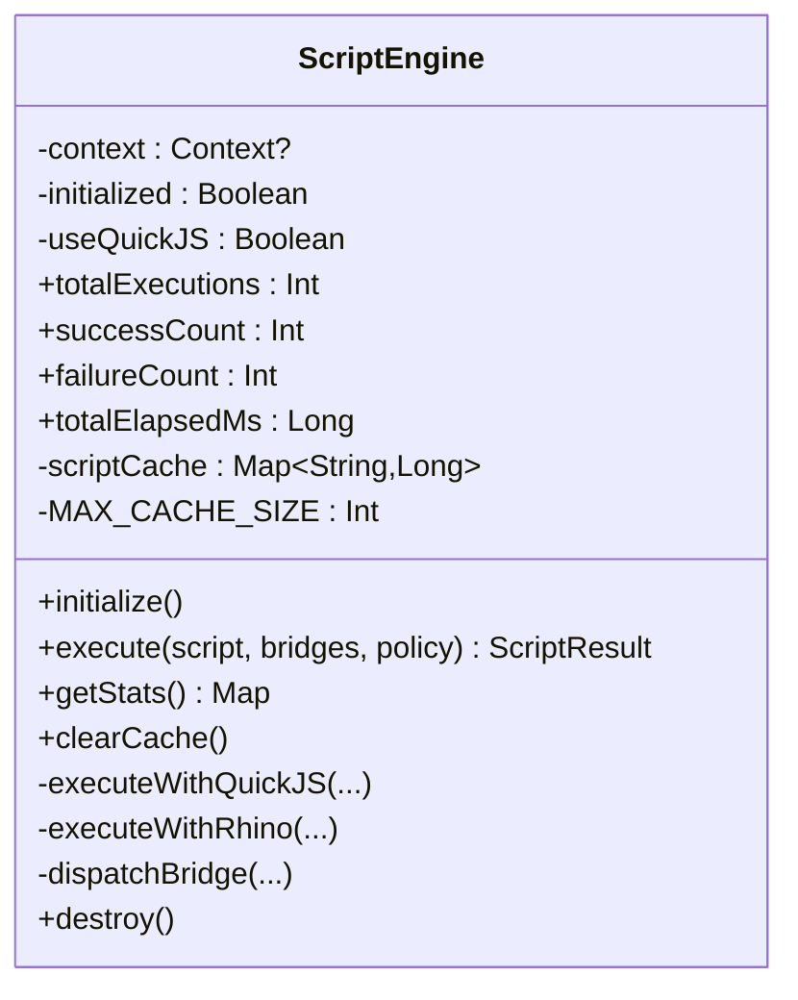
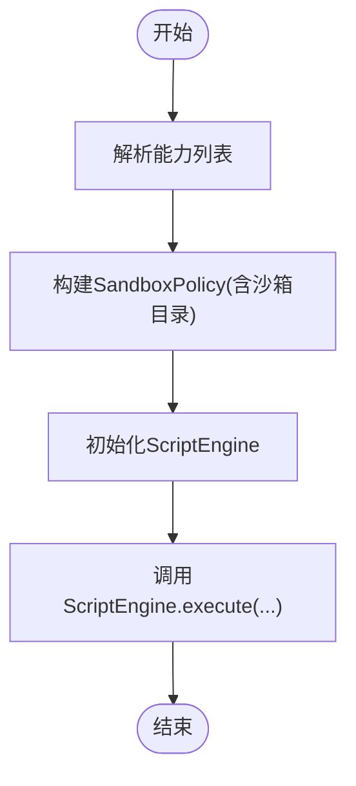
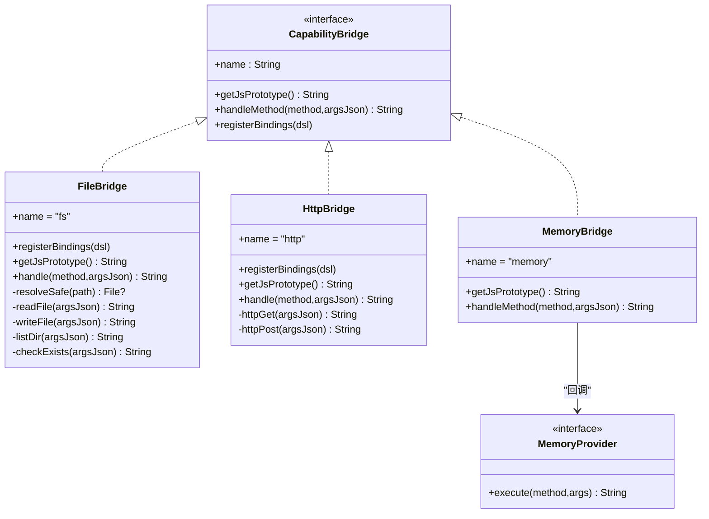
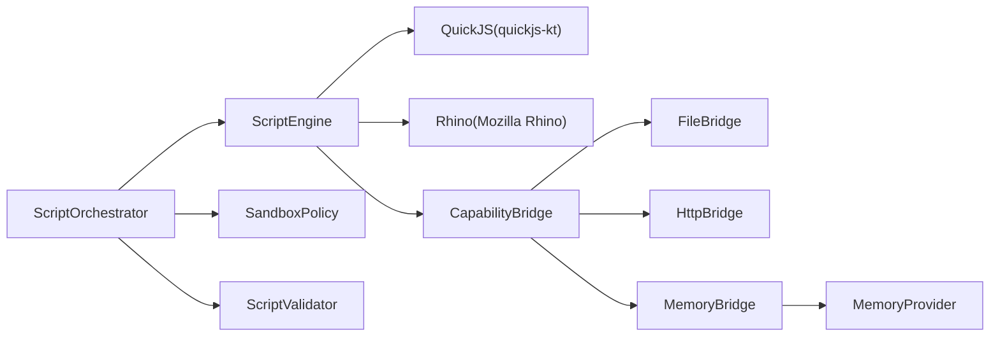

# 脚本引擎系统

<cite>
**本文引用的文件**
- [ScriptEngine.kt](file://script/src/main/java/ai/openclaw/script/ScriptEngine.kt)
- [ScriptOrchestrator.kt](file://script/src/main/java/ai/openclaw/script/ScriptOrchestrator.kt)
- [SandboxPolicy.kt](file://script/src/main/java/ai/openclaw/script/SandboxPolicy.kt)
- [ScriptValidator.kt](file://script/src/main/java/ai/openclaw/script/ScriptValidator.kt)
- [CapabilityBridge.kt](file://script/src/main/java/ai/openclaw/script/CapabilityBridge.kt)
- [ScriptResult.kt](file://script/src/main/java/ai/openclaw/script/ScriptResult.kt)
- [FileBridge.kt](file://script/src/main/java/ai/openclaw/script/bridge/FileBridge.kt)
- [HttpBridge.kt](file://script/src/main/java/ai/openclaw/script/bridge/HttpBridge.kt)
- [MemoryBridge.kt](file://script/src/main/java/ai/openclaw/script/bridge/MemoryBridge.kt)
- [ScriptSkill.kt](file://app/src/main/java/ai/openclaw/android/skill/builtin/ScriptSkill.kt)
- [script-engine.md](file://docs/script-engine.md)
- [design-weather-script-sandbox.md](file://docs/design-weather-script-sandbox.md)
</cite>

## 目录
1. [简介](#简介)
2. [项目结构](#项目结构)
3. [核心组件](#核心组件)
4. [架构总览](#架构总览)
5. [组件详解](#组件详解)
6. [依赖关系分析](#依赖关系分析)
7. [性能与资源管理](#性能与资源管理)
8. [故障排查指南](#故障排查指南)
9. [结论](#结论)
10. [附录](#附录)

## 简介
本文件面向“脚本引擎系统”的全面技术文档，围绕动态脚本执行环境展开，重点涵盖：
- 架构设计与QuickJS集成方案
- 沙箱策略与安全隔离机制
- 脚本桥接接口设计与API暴露机制
- 脚本验证、编译与执行流程
- 性能优化与资源管理
- 开发最佳实践与调试技巧
- 扩展与自定义开发指导
- 安全考虑与风险控制

该系统以独立的Android Library模块形式存在，对外提供统一的脚本执行入口，并通过“桥接器”将JS脚本与Android平台能力（文件、网络、记忆、UI渲染等）进行受控连接。

## 项目结构
脚本引擎模块位于script子工程，核心代码集中在ai.openclaw.script包下；能力桥接位于bridge子包；应用层通过ScriptSkill将其接入技能体系。

图示来源
- [ScriptOrchestrator.kt:13-54](file://script/src/main/java/ai/openclaw/script/ScriptOrchestrator.kt#L13-L54)
- [ScriptEngine.kt:22-99](file://script/src/main/java/ai/openclaw/script/ScriptEngine.kt#L22-L99)
- [ScriptValidator.kt:8-59](file://script/src/main/java/ai/openclaw/script/ScriptValidator.kt#L8-L59)
- [SandboxPolicy.kt:8-15](file://script/src/main/java/ai/openclaw/script/SandboxPolicy.kt#L8-L15)
- [CapabilityBridge.kt:13-32](file://script/src/main/java/ai/openclaw/script/CapabilityBridge.kt#L13-L32)
- [FileBridge.kt:20-120](file://script/src/main/java/ai/openclaw/script/bridge/FileBridge.kt#L20-L120)
- [HttpBridge.kt:18-87](file://script/src/main/java/ai/openclaw/script/bridge/HttpBridge.kt#L18-L87)
- [MemoryBridge.kt:14-48](file://script/src/main/java/ai/openclaw/script/bridge/MemoryBridge.kt#L14-L48)
- [ScriptResult.kt:6-19](file://script/src/main/java/ai/openclaw/script/ScriptResult.kt#L6-L19)
- [ScriptSkill.kt:19-132](file://app/src/main/java/ai/openclaw/android/skill/builtin/ScriptSkill.kt#L19-L132)

章节来源
- [script-engine.md:36-51](file://docs/script-engine.md#L36-L51)

## 核心组件
- ScriptOrchestrator：脚本执行入口，负责能力解析、沙箱策略构建与引擎委派。
- ScriptEngine：执行引擎，支持QuickJS与Rhino双栈，具备缓存、统计、超时控制与回退机制。
- ScriptValidator：静态校验器，在执行前阻断高危模式与超长脚本。
- SandboxPolicy：安全策略数据类，控制超时、内存、网络与文件写入等。
- CapabilityBridge及其子类：桥接接口及实现，提供文件、HTTP、记忆、UI渲染等能力。
- ScriptResult：统一的执行结果封装。

章节来源
- [ScriptOrchestrator.kt:13-54](file://script/src/main/java/ai/openclaw/script/ScriptOrchestrator.kt#L13-L54)
- [ScriptEngine.kt:22-118](file://script/src/main/java/ai/openclaw/script/ScriptEngine.kt#L22-L118)
- [ScriptValidator.kt:8-59](file://script/src/main/java/ai/openclaw/script/ScriptValidator.kt#L8-L59)
- [SandboxPolicy.kt:8-15](file://script/src/main/java/ai/openclaw/script/SandboxPolicy.kt#L8-L15)
- [CapabilityBridge.kt:13-32](file://script/src/main/java/ai/openclaw/script/CapabilityBridge.kt#L13-L32)
- [ScriptResult.kt:6-19](file://script/src/main/java/ai/openclaw/script/ScriptResult.kt#L6-L19)

## 架构总览
脚本引擎采用“编排器-引擎-桥接器-策略”的分层设计。编排器负责组装执行上下文，引擎负责执行与隔离，桥接器提供受控能力，策略提供安全边界。

图示来源
- [ScriptOrchestrator.kt:31-39](file://script/src/main/java/ai/openclaw/script/ScriptOrchestrator.kt#L31-L39)
- [ScriptEngine.kt:45-99](file://script/src/main/java/ai/openclaw/script/ScriptEngine.kt#L45-L99)
- [ScriptValidator.kt:42-58](file://script/src/main/java/ai/openclaw/script/ScriptValidator.kt#L42-L58)

## 组件详解

### ScriptEngine 执行引擎
- 双栈支持：优先使用QuickJS（通过quickjs-kt），失败则回退至Rhino。
- 隔离与销毁：每次执行创建独立实例并在完成后销毁，确保状态隔离。
- 缓存与统计：基于脚本哈希的轻量缓存与执行统计（总数、成功数、失败数、平均耗时、缓存大小、当前引擎）。
- 超时控制：统一的超时策略，避免长时间运行。
- 桥接分发：根据方法名路由到具体桥接器，支持FileBridge、HttpBridge与通用方法处理。

图示来源
- [ScriptEngine.kt:22-231](file://script/src/main/java/ai/openclaw/script/ScriptEngine.kt#L22-L231)

章节来源
- [ScriptEngine.kt:22-118](file://script/src/main/java/ai/openclaw/script/ScriptEngine.kt#L22-L118)
- [ScriptEngine.kt:120-225](file://script/src/main/java/ai/openclaw/script/ScriptEngine.kt#L120-L225)

### ScriptOrchestrator 编排器
- 能力解析：根据capabilities参数选择内置桥接器（fs/http），或使用自定义桥接器。
- 沙箱目录：在应用filesDir下创建script_sandbox目录，作为文件操作的根目录。
- 执行委派：将脚本、桥接器与策略传入引擎执行。

图示来源
- [ScriptOrchestrator.kt:31-39](file://script/src/main/java/ai/openclaw/script/ScriptOrchestrator.kt#L31-L39)
- [ScriptOrchestrator.kt:41-53](file://script/src/main/java/ai/openclaw/script/ScriptOrchestrator.kt#L41-L53)

章节来源
- [ScriptOrchestrator.kt:13-54](file://script/src/main/java/ai/openclaw/script/ScriptOrchestrator.kt#L13-L54)

### SandboxPolicy 安全策略
- 超时：默认10秒，可按策略调整。
- 内存：预留内存上限（整型MB）。
- 文件写入：可开关。
- 网络：可开关，默认允许。
- 域名白名单：可选限制允许访问的域名集合。
- 沙箱目录：限定文件操作根目录。

章节来源
- [SandboxPolicy.kt:8-15](file://script/src/main/java/ai/openclaw/script/SandboxPolicy.kt#L8-L15)

### ScriptValidator 静态校验
- 空脚本与长度限制（默认50KB）。
- 禁止模式：import/require、eval/new Function、定时器、原型污染相关、Java/Android访问、系统对象（process/global/window/document）等。
- 返回校验结果（有效/无效与错误信息）。

章节来源
- [ScriptValidator.kt:8-59](file://script/src/main/java/ai/openclaw/script/ScriptValidator.kt#L8-L59)

### CapabilityBridge 与桥接器
- CapabilityBridge：定义桥接器的名称、JS原型代码与方法分发接口。
- FileBridge：提供fs.readFile/writeFile/list/exists，所有操作限制在沙箱目录，路径穿越检测。
- HttpBridge：提供http.get/post，基于OkHttp实现，设置连接/读取超时。
- MemoryBridge：提供memory.recall/store，通过MemoryProvider回调实现，由主工程注入真实能力。
- UiBridge：提供ui.renderCard/renderToast/showConfirm，由主工程注入UiProvider实现卡片渲染与交互。

图示来源
- [CapabilityBridge.kt:13-32](file://script/src/main/java/ai/openclaw/script/CapabilityBridge.kt#L13-L32)
- [FileBridge.kt:20-120](file://script/src/main/java/ai/openclaw/script/bridge/FileBridge.kt#L20-L120)
- [HttpBridge.kt:18-87](file://script/src/main/java/ai/openclaw/script/bridge/HttpBridge.kt#L18-L87)
- [MemoryBridge.kt:14-48](file://script/src/main/java/ai/openclaw/script/bridge/MemoryBridge.kt#L14-L48)

章节来源
- [FileBridge.kt:9-120](file://script/src/main/java/ai/openclaw/script/bridge/FileBridge.kt#L9-L120)
- [HttpBridge.kt:11-87](file://script/src/main/java/ai/openclaw/script/bridge/HttpBridge.kt#L11-L87)
- [MemoryBridge.kt:5-48](file://script/src/main/java/ai/openclaw/script/bridge/MemoryBridge.kt#L5-L48)

### ScriptResult 执行结果
- 结果结构：success、output、error、executionTimeMs。
- 工厂方法：success/failure便捷构造。

章节来源
- [ScriptResult.kt:6-19](file://script/src/main/java/ai/openclaw/script/ScriptResult.kt#L6-L19)

### 应用层集成：ScriptSkill
- 将脚本引擎接入Skill体系，提供execute_script工具。
- 支持capabilities参数（默认fs,http），并可注入MemoryBridge。
- 将ScriptResult映射为SkillResult返回给上层。

章节来源
- [ScriptSkill.kt:19-132](file://app/src/main/java/ai/openclaw/android/skill/builtin/ScriptSkill.kt#L19-L132)

## 依赖关系分析
- ScriptEngine依赖QuickJS（quickjs-kt）与Rhino（Mozilla Rhino）两种JS引擎，具备自动回退能力。
- FileBridge依赖Android上下文与沙箱目录，实现路径穿越防护。
- HttpBridge依赖OkHttp进行网络请求。
- MemoryBridge通过MemoryProvider回调与主工程记忆系统解耦。
- ScriptOrchestrator依赖ScriptEngine与SandboxPolicy，负责能力解析与沙箱目录准备。

图示来源
- [ScriptEngine.kt:7-12](file://script/src/main/java/ai/openclaw/script/ScriptEngine.kt#L7-L12)
- [FileBridge.kt:3-7](file://script/src/main/java/ai/openclaw/script/bridge/FileBridge.kt#L3-L7)
- [HttpBridge.kt:6-9](file://script/src/main/java/ai/openclaw/script/bridge/HttpBridge.kt#L6-L9)
- [MemoryBridge.kt:3-4](file://script/src/main/java/ai/openclaw/script/bridge/MemoryBridge.kt#L3-L4)
- [ScriptOrchestrator.kt:20-22](file://script/src/main/java/ai/openclaw/script/ScriptOrchestrator.kt#L20-L22)

## 性能与资源管理
- 快速回退：QuickJS失败时自动切换到Rhino，保障可用性。
- 执行缓存：基于脚本哈希的轻量缓存，减少重复编译开销。
- 统计指标：记录总执行次数、成功/失败次数、总耗时与平均耗时，便于监控与优化。
- 资源隔离：每次执行创建独立实例并在完成后销毁，避免状态泄漏。
- 超时控制：统一的超时策略，防止长时间运行导致资源占用。
- 网络与IO：HttpBridge设置连接/读取超时；FileBridge限制在沙箱目录，避免跨目录IO。

章节来源
- [ScriptEngine.kt:33-118](file://script/src/main/java/ai/openclaw/script/ScriptEngine.kt#L33-L118)
- [ScriptEngine.kt:120-142](file://script/src/main/java/ai/openclaw/script/ScriptEngine.kt#L120-L142)
- [HttpBridge.kt:40-45](file://script/src/main/java/ai/openclaw/script/bridge/HttpBridge.kt#L40-L45)
- [FileBridge.kt:82-86](file://script/src/main/java/ai/openclaw/script/bridge/FileBridge.kt#L82-L86)

## 故障排查指南
- 脚本被拒绝执行
  - 检查是否触发静态校验规则（空脚本、超长、包含禁用模式）。
  - 查看ScriptResult.error与校验错误信息。
- 执行超时
  - 调整SandboxPolicy.timeoutMs或优化脚本逻辑。
  - 确认是否存在阻塞操作（如大量计算、未终止的循环）。
- 文件操作失败
  - 确认路径是否位于沙箱目录内，避免路径穿越。
  - 检查写入权限与父目录创建。
- 网络请求异常
  - 检查URL合法性与网络可达性。
  - 确认域名白名单策略与超时设置。
- 记忆能力未生效
  - 确认MemoryBridge已注入且MemoryProvider正确实现。
  - 检查参数格式与返回JSON结构。
- 引擎回退
  - QuickJS失败会自动回退到Rhino，若持续失败，检查QuickJS依赖与设备兼容性。

章节来源
- [ScriptValidator.kt:42-58](file://script/src/main/java/ai/openclaw/script/ScriptValidator.kt#L42-L58)
- [ScriptEngine.kt:88-98](file://script/src/main/java/ai/openclaw/script/ScriptEngine.kt#L88-L98)
- [FileBridge.kt:88-119](file://script/src/main/java/ai/openclaw/script/bridge/FileBridge.kt#L88-L119)
- [HttpBridge.kt:66-86](file://script/src/main/java/ai/openclaw/script/bridge/HttpBridge.kt#L66-L86)
- [MemoryBridge.kt:25-48](file://script/src/main/java/ai/openclaw/script/bridge/MemoryBridge.kt#L25-L48)

## 结论
脚本引擎系统通过清晰的分层设计与严格的沙箱策略，实现了对JS脚本的动态执行与安全隔离。QuickJS与Rhino的双栈支持提升了可用性与性能，而桥接器机制则将Android能力以受控方式暴露给脚本。配合静态校验、超时控制与缓存机制，系统在功能灵活性与安全性之间取得了良好平衡。未来可进一步完善UI桥接、脚本市场与性能分析等能力。

## 附录

### 安全设计要点
- 静态校验：禁止模块加载、eval/new Function、定时器、原型污染、系统对象与Java/Android访问。
- 运行时隔离：Rhino使用安全标准对象初始化并删除危险全局对象；每次执行独立上下文与线程。
- 文件沙箱：路径穿越检测与沙箱目录限制。
- 策略化控制：超时、内存、网络与文件写入开关。

章节来源
- [script-engine.md:151-168](file://docs/script-engine.md#L151-L168)
- [ScriptValidator.kt:12-35](file://script/src/main/java/ai/openclaw/script/ScriptValidator.kt#L12-L35)
- [ScriptEngine.kt:144-209](file://script/src/main/java/ai/openclaw/script/ScriptEngine.kt#L144-L209)
- [FileBridge.kt:82-86](file://script/src/main/java/ai/openclaw/script/bridge/FileBridge.kt#L82-L86)

### API参考与最佳实践
- JS API
  - 文件：fs.readFile/fs.writeFile/fs.list/fs.exists
  - 网络：http.get/http.post
  - 记忆：memory.recall/memory.store
  - UI：ui.renderCard/ui.renderToast/ui.showConfirm
- 最佳实践
  - 严格控制脚本长度与复杂度，避免长时间运行。
  - 使用沙箱目录进行文件操作，避免路径穿越。
  - 合理设置超时与内存上限，防止资源耗尽。
  - 通过capabilities参数最小化能力暴露，遵循最小权限原则。
  - 利用缓存减少重复编译，但注意缓存失效策略。
- 调试技巧
  - 通过ScriptResult.executionTimeMs观察执行耗时。
  - 使用getStats()查看缓存命中与引擎状态。
  - 在应用层打印错误信息，结合日志定位问题。

章节来源
- [script-engine.md:169-203](file://docs/script-engine.md#L169-L203)
- [ScriptEngine.kt:104-111](file://script/src/main/java/ai/openclaw/script/ScriptEngine.kt#L104-L111)

### 与A2UI卡片系统的集成
- ScriptEngine生成的卡片与Skill返回的卡片共享同一渲染器，实现统一的UI体验。
- 通过UiBridge将卡片JSON传递给主工程渲染器，确保安全隔离与类型约束。

章节来源
- [script-engine.md:300-315](file://docs/script-engine.md#L300-L315)

### 从硬编码到脚本沙箱的迁移示例
- 将WeatherSkill的HTTP逻辑迁移到assets/scripts/weather.js，通过ScriptOrchestrator执行，验证脚本沙箱的可行性与兼容性。

章节来源
- [design-weather-script-sandbox.md:1-41](file://docs/design-weather-script-sandbox.md#L1-L41)