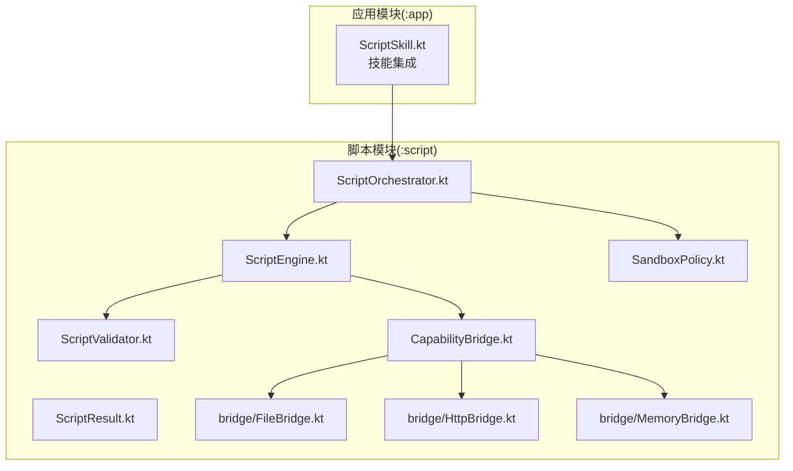
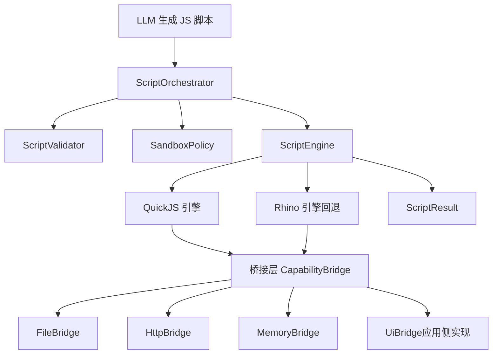
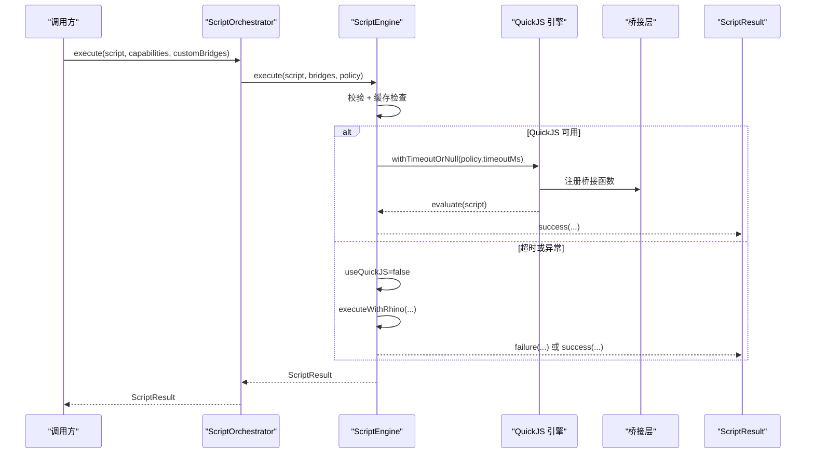
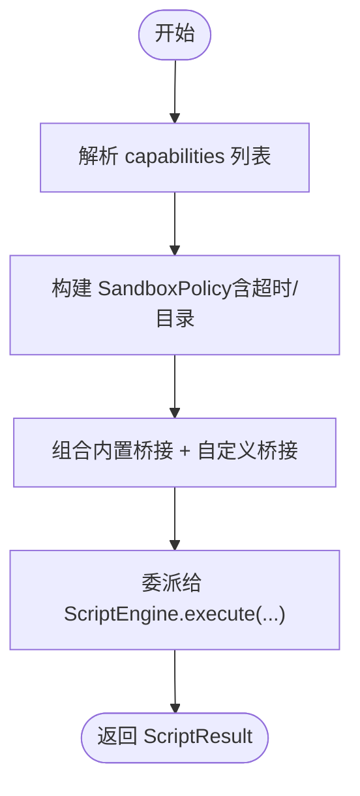
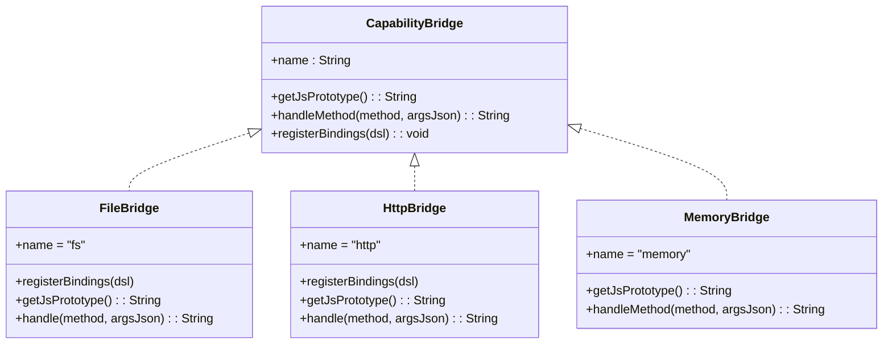
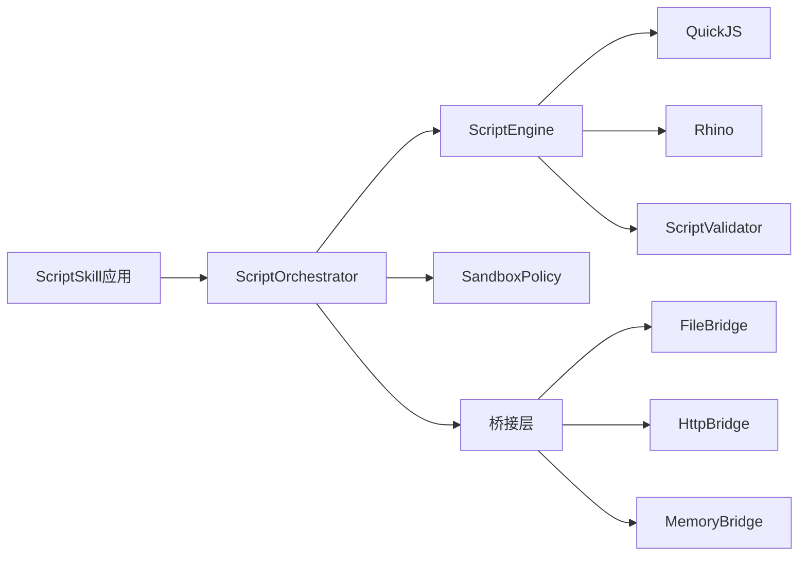

# 脚本执行引擎

<cite>
**本文引用的文件**
- [ScriptEngine.kt](file://script/src/main/java/ai/openclaw/script/ScriptEngine.kt)
- [ScriptOrchestrator.kt](file://script/src/main/java/ai/openclaw/script/ScriptOrchestrator.kt)
- [ScriptResult.kt](file://script/src/main/java/ai/openclaw/script/ScriptResult.kt)
- [SandboxPolicy.kt](file://script/src/main/java/ai/openclaw/script/SandboxPolicy.kt)
- [CapabilityBridge.kt](file://script/src/main/java/ai/openclaw/script/CapabilityBridge.kt)
- [FileBridge.kt](file://script/src/main/java/ai/openclaw/script/bridge/FileBridge.kt)
- [HttpBridge.kt](file://script/src/main/java/ai/openclaw/script/bridge/HttpBridge.kt)
- [MemoryBridge.kt](file://script/src/main/java/ai/openclaw/script/bridge/MemoryBridge.kt)
- [ScriptValidator.kt](file://script/src/main/java/ai/openclaw/script/ScriptValidator.kt)
- [ScriptEngineTest.kt](file://script/src/test/java/ai/openclaw/script/ScriptEngineTest.kt)
- [ScriptOrchestratorIntegrationTest.kt](file://script/src/test/java/ai/openclaw/script/ScriptOrchestratorIntegrationTest.kt)
- [ScriptSkillQuickJsTest.kt](file://app/src/test/java/ai/openclaw/android/skill/builtin/ScriptSkillQuickJsTest.kt)
- [script-engine.md](file://docs/script-engine.md)
- [2026-04-14-quickjs-integration.md](file://docs/plans/2026-04-14-quickjs-integration.md)
- [2026-04-14-scriptengine-production.md](file://docs/plans/2026-04-14-scriptengine-production.md)
</cite>

## 目录
1. [简介](#简介)
2. [项目结构](#项目结构)
3. [核心组件](#核心组件)
4. [架构总览](#架构总览)
5. [组件详解](#组件详解)
6. [依赖关系分析](#依赖关系分析)
7. [性能与资源管理](#性能与资源管理)
8. [调试与故障排除](#调试与故障排除)
9. [结论](#结论)
10. [附录](#附录)

## 简介
本文件面向“脚本执行引擎”模块，系统化阐述基于 QuickJS 的脚本执行架构与实现细节，包括引擎初始化、脚本编译与执行、结果处理、任务编排与并发控制、数据模型与错误处理、性能监控与资源管理、调试与故障排除以及超时与内存限制等主题。文档同时给出关键流程的时序图与类图，帮助读者快速理解与落地集成。

## 项目结构
脚本执行引擎位于独立的 Android Library 模块中，核心代码集中在 script/src/main/java/ai/openclaw/script 及其 bridge 子包；配套测试位于 script/src/test；应用层集成与文档位于 app 与 docs 目录。

**图表来源**
- [ScriptOrchestrator.kt](file://script/src/main/java/ai/openclaw/script/ScriptOrchestrator.kt)
- [ScriptEngine.kt](file://script/src/main/java/ai/openclaw/script/ScriptEngine.kt)
- [CapabilityBridge.kt](file://script/src/main/java/ai/openclaw/script/CapabilityBridge.kt)
- [FileBridge.kt](file://script/src/main/java/ai/openclaw/script/bridge/FileBridge.kt)
- [HttpBridge.kt](file://script/src/main/java/ai/openclaw/script/bridge/HttpBridge.kt)
- [MemoryBridge.kt](file://script/src/main/java/ai/openclaw/script/bridge/MemoryBridge.kt)
- [SandboxPolicy.kt](file://script/src/main/java/ai/openclaw/script/SandboxPolicy.kt)
- [ScriptValidator.kt](file://script/src/main/java/ai/openclaw/script/ScriptValidator.kt)

**章节来源**
- [ScriptOrchestrator.kt](file://script/src/main/java/ai/openclaw/script/ScriptOrchestrator.kt)
- [ScriptEngine.kt](file://script/src/main/java/ai/openclaw/script/ScriptEngine.kt)
- [script-engine.md](file://docs/script-engine.md)

## 核心组件
- ScriptOrchestrator：脚本执行入口，负责能力解析、沙箱策略构建与引擎委派。
- ScriptEngine：双引擎执行器（QuickJS 优先，Rhino 回退），提供脚本校验、超时控制、统计与缓存。
- CapabilityBridge 及其实现：桥接 JS 与 Android 能力（文件、HTTP、记忆、UI 等）。
- SandboxPolicy：超时、内存、网络与文件写入等策略。
- ScriptResult：统一的结果封装与工厂方法。
- ScriptValidator：静态规则校验，阻断危险模式与过大脚本。

**章节来源**
- [ScriptOrchestrator.kt](file://script/src/main/java/ai/openclaw/script/ScriptOrchestrator.kt)
- [ScriptEngine.kt](file://script/src/main/java/ai/openclaw/script/ScriptEngine.kt)
- [ScriptResult.kt](file://script/src/main/java/ai/openclaw/script/ScriptResult.kt)
- [SandboxPolicy.kt](file://script/src/main/java/ai/openclaw/script/SandboxPolicy.kt)
- [ScriptValidator.kt](file://script/src/main/java/ai/openclaw/script/ScriptValidator.kt)
- [CapabilityBridge.kt](file://script/src/main/java/ai/openclaw/script/CapabilityBridge.kt)

## 架构总览
QuickJS 引擎作为主执行器，通过桥接层向 JS 暴露受控能力；ScriptOrchestrator 负责组装能力与策略，ScriptEngine 负责执行与回退，ScriptValidator 提前阻断风险，SandboxPolicy 提供运行时约束。

**图表来源**
- [script-engine.md](file://docs/script-engine.md)
- [ScriptEngine.kt](file://script/src/main/java/ai/openclaw/script/ScriptEngine.kt)
- [ScriptOrchestrator.kt](file://script/src/main/java/ai/openclaw/script/ScriptOrchestrator.kt)
- [FileBridge.kt](file://script/src/main/java/ai/openclaw/script/bridge/FileBridge.kt)
- [HttpBridge.kt](file://script/src/main/java/ai/openclaw/script/bridge/HttpBridge.kt)
- [MemoryBridge.kt](file://script/src/main/java/ai/openclaw/script/bridge/MemoryBridge.kt)

## 组件详解

### ScriptEngine：双引擎执行器与生命周期
- 初始化与销毁：按需初始化，支持 destroy 重置状态。
- 执行生命周期：
  - 静态校验（ScriptValidator）
  - 快速缓存命中（基于脚本哈希键）
  - QuickJS 执行（withTimeoutOrNull 控制超时）
  - 失败回退至 Rhino（自动切换 useQuickJS=false）
  - 统计更新（总次数、成功/失败、累计耗时、缓存大小、当前引擎）
- 缓存策略：按脚本哈希键缓存执行耗时，最大容量限制。
- 结果封装：统一返回 ScriptResult，包含 success、output、error、executionTimeMs。

**图表来源**
- [ScriptEngine.kt](file://script/src/main/java/ai/openclaw/script/ScriptEngine.kt)
- [ScriptOrchestrator.kt](file://script/src/main/java/ai/openclaw/script/ScriptOrchestrator.kt)

**章节来源**
- [ScriptEngine.kt](file://script/src/main/java/ai/openclaw/script/ScriptEngine.kt)

### ScriptOrchestrator：任务编排与能力解析
- 懒加载沙箱目录与引擎实例，确保首次使用才创建。
- 能力解析：默认启用 fs 与 http；未知能力会记录警告。
- 策略构建：根据上下文创建 SandboxPolicy，默认超时 10 秒。
- 执行委派：将脚本、桥接集合与策略传入 ScriptEngine。

**图表来源**
- [ScriptOrchestrator.kt](file://script/src/main/java/ai/openclaw/script/ScriptOrchestrator.kt)

**章节来源**
- [ScriptOrchestrator.kt](file://script/src/main/java/ai/openclaw/script/ScriptOrchestrator.kt)

### CapabilityBridge 与桥接实现
- CapabilityBridge：定义桥接名称、JS 原型（Rhino）与 QuickJS 绑定（registerBindings）。
- FileBridge：提供 fs.readFile/writeFile/list/exists，严格限制在沙箱目录，路径穿越检测。
- HttpBridge：提供 http.get/post，基于 OkHttp，超时配置在桥接内部。
- MemoryBridge：提供 memory.recall/store，通过 MemoryProvider 回调由应用层实现。

**图表来源**
- [CapabilityBridge.kt](file://script/src/main/java/ai/openclaw/script/CapabilityBridge.kt)
- [FileBridge.kt](file://script/src/main/java/ai/openclaw/script/bridge/FileBridge.kt)
- [HttpBridge.kt](file://script/src/main/java/ai/openclaw/script/bridge/HttpBridge.kt)
- [MemoryBridge.kt](file://script/src/main/java/ai/openclaw/script/bridge/MemoryBridge.kt)

**章节来源**
- [CapabilityBridge.kt](file://script/src/main/java/ai/openclaw/script/CapabilityBridge.kt)
- [FileBridge.kt](file://script/src/main/java/ai/openclaw/script/bridge/FileBridge.kt)
- [HttpBridge.kt](file://script/src/main/java/ai/openclaw/script/bridge/HttpBridge.kt)
- [MemoryBridge.kt](file://script/src/main/java/ai/openclaw/script/bridge/MemoryBridge.kt)

### ScriptResult：结果数据结构与工厂方法
- 字段：success、output、error、executionTimeMs。
- 工厂方法：success(...)、failure(...)，便于统一构造。

**章节来源**
- [ScriptResult.kt](file://script/src/main/java/ai/openclaw/script/ScriptResult.kt)

### SandboxPolicy：运行时安全策略
- 超时（毫秒，默认 10000）
- 最大内存（MB，默认 16）
- 沙箱目录（强制文件操作限制）
- 网络开关、文件写入开关、域名白名单

**章节来源**
- [SandboxPolicy.kt](file://script/src/main/java/ai/openclaw/script/SandboxPolicy.kt)

### ScriptValidator：静态校验与阻断规则
- 脚本长度上限（默认 50KB）
- 禁止模式：import/require、eval/new Function、定时器、原型污染、Java/Android 访问、系统对象等

**章节来源**
- [ScriptValidator.kt](file://script/src/main/java/ai/openclaw/script/ScriptValidator.kt)

## 依赖关系分析
- ScriptEngine 依赖 QuickJS（主）、Rhino（回退）、桥接层、ScriptValidator、SandboxPolicy。
- ScriptOrchestrator 依赖 ScriptEngine、SandboxPolicy、桥接层。
- 应用层通过 ScriptSkill 与 ScriptOrchestrator 集成，MemoryBridge 通过 MemoryProvider 与记忆系统对接。

**图表来源**
- [ScriptEngine.kt](file://script/src/main/java/ai/openclaw/script/ScriptEngine.kt)
- [ScriptOrchestrator.kt](file://script/src/main/java/ai/openclaw/script/ScriptOrchestrator.kt)
- [FileBridge.kt](file://script/src/main/java/ai/openclaw/script/bridge/FileBridge.kt)
- [HttpBridge.kt](file://script/src/main/java/ai/openclaw/script/bridge/HttpBridge.kt)
- [MemoryBridge.kt](file://script/src/main/java/ai/openclaw/script/bridge/MemoryBridge.kt)

**章节来源**
- [ScriptEngine.kt](file://script/src/main/java/ai/openclaw/script/ScriptEngine.kt)
- [ScriptOrchestrator.kt](file://script/src/main/java/ai/openclaw/script/ScriptOrchestrator.kt)

## 性能与资源管理
- 引擎选择与回退：QuickJS 优先，异常或超时自动切换 Rhino，保障稳定性。
- 超时控制：ScriptEngine 使用 withTimeoutOrNull 控制单次执行，SandboxPolicy.timeoutMs 作为上限。
- 缓存优化：对成功执行的脚本缓存执行耗时，加速重复脚本执行。
- 统计指标：总执行次数、成功/失败计数、平均耗时、缓存大小、当前引擎标识。
- 文件沙箱：FileBridge 严格限制在沙箱目录，路径穿越检测，避免越权访问。
- HTTP 超时：HttpBridge 内部设置连接/读取超时，避免阻塞。
- 内存限制：SandboxPolicy.maxMemoryMB 作为策略项预留，当前实现主要依赖引擎与超时控制。

**章节来源**
- [ScriptEngine.kt](file://script/src/main/java/ai/openclaw/script/ScriptEngine.kt)
- [SandboxPolicy.kt](file://script/src/main/java/ai/openclaw/script/SandboxPolicy.kt)
- [FileBridge.kt](file://script/src/main/java/ai/openclaw/script/bridge/FileBridge.kt)
- [HttpBridge.kt](file://script/src/main/java/ai/openclaw/script/bridge/HttpBridge.kt)

## 调试与故障排除
- 常见错误类型
  - 脚本为空或过长：被 ScriptValidator 拦截，返回 failure 并附带错误信息。
  - 包含禁止模式：如 import/require/eval、Java/Android 访问、定时器等，直接拒绝。
  - 超时：超过 SandboxPolicy.timeoutMs，返回超时错误。
  - QuickJS 异常：自动回退 Rhino，并标记 useQuickJS=false。
  - 路径穿越：FileBridge 拦截非沙箱路径，返回错误。
- 调试建议
  - 使用 ScriptEngine.getStats() 查看执行统计，定位热点与异常。
  - 在 ScriptOrchestrator.execute 中传入自定义桥接，便于隔离问题。
  - 逐步缩小脚本范围，定位具体语句导致的超时或错误。
  - 对照测试用例：参考 ScriptEngineTest 与 ScriptOrchestratorIntegrationTest 的断言与场景。

**章节来源**
- [ScriptEngine.kt](file://script/src/main/java/ai/openclaw/script/ScriptEngine.kt)
- [ScriptEngineTest.kt](file://script/src/test/java/ai/openclaw/script/ScriptEngineTest.kt)
- [ScriptOrchestratorIntegrationTest.kt](file://script/src/test/java/ai/openclaw/script/ScriptOrchestratorIntegrationTest.kt)

## 结论
该脚本执行引擎以 QuickJS 为主、Rhino 为回退，结合严格的静态校验与运行时沙箱策略，提供了可控、可观测且可扩展的脚本执行能力。通过桥接层与策略配置，引擎既能满足基础文件与网络能力需求，又能为 UI 渲染与记忆系统提供扩展点。配合完善的测试与统计接口，便于在生产环境中进行性能监控与问题排查。

## 附录

### API 设计与使用要点
- ScriptOrchestrator.execute(script, capabilities, customBridges)：统一入口，返回 ScriptResult。
- ScriptEngine.execute(script, bridges, policy)：底层执行，支持超时与回退。
- Bridge API（示例）
  - fs.readFile(path)/writeFile(path, content)/list(dir)/exists(path)
  - http.get(url)/post(url, body)
  - memory.recall(query, limit)/store(content)
- 超时与内存
  - SandboxPolicy.timeoutMs 控制执行时限
  - maxMemoryMB 作为策略预留项

**章节来源**
- [ScriptOrchestrator.kt](file://script/src/main/java/ai/openclaw/script/ScriptOrchestrator.kt)
- [ScriptEngine.kt](file://script/src/main/java/ai/openclaw/script/ScriptEngine.kt)
- [FileBridge.kt](file://script/src/main/java/ai/openclaw/script/bridge/FileBridge.kt)
- [HttpBridge.kt](file://script/src/main/java/ai/openclaw/script/bridge/HttpBridge.kt)
- [MemoryBridge.kt](file://script/src/main/java/ai/openclaw/script/bridge/MemoryBridge.kt)
- [SandboxPolicy.kt](file://script/src/main/java/ai/openclaw/script/SandboxPolicy.kt)