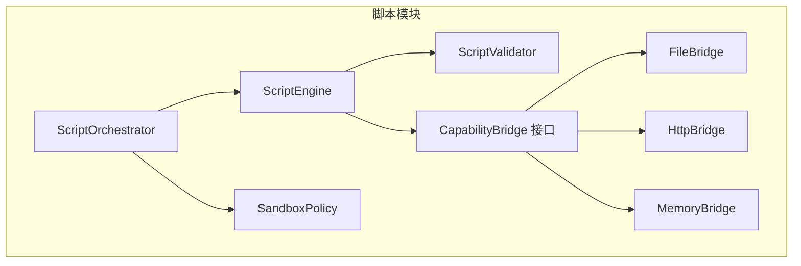
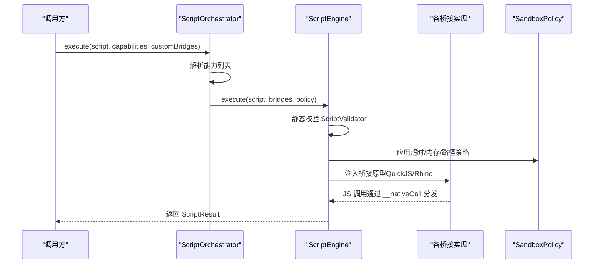
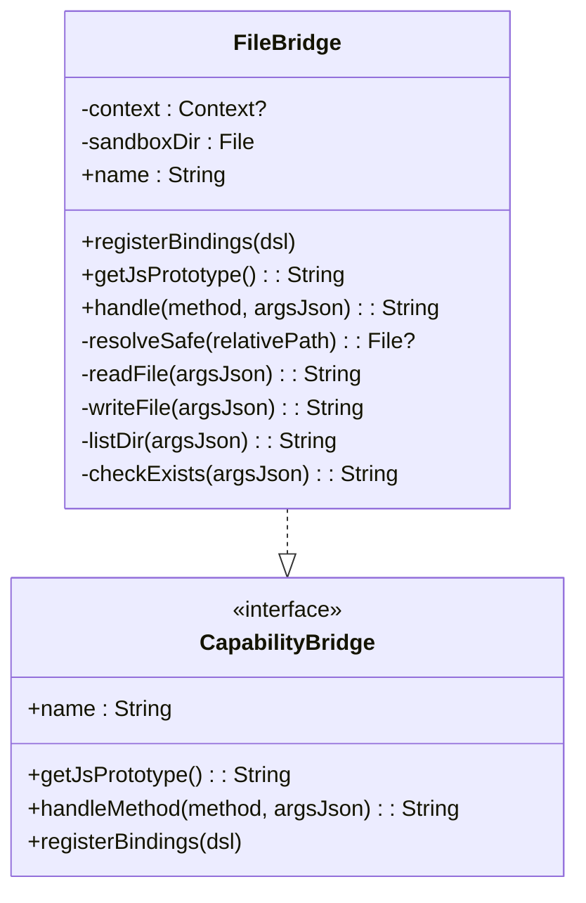
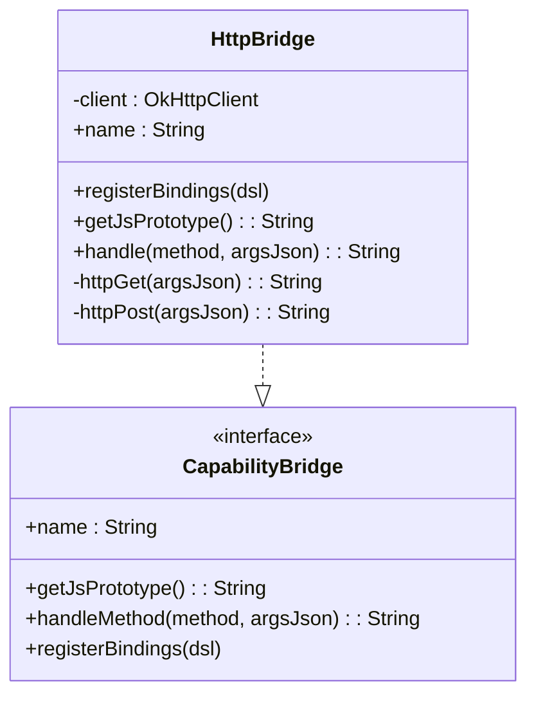
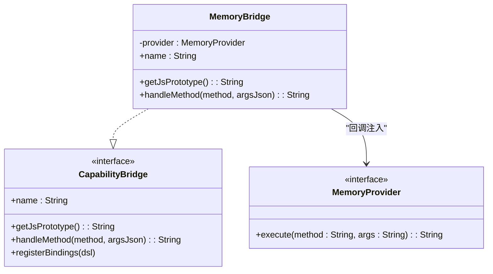
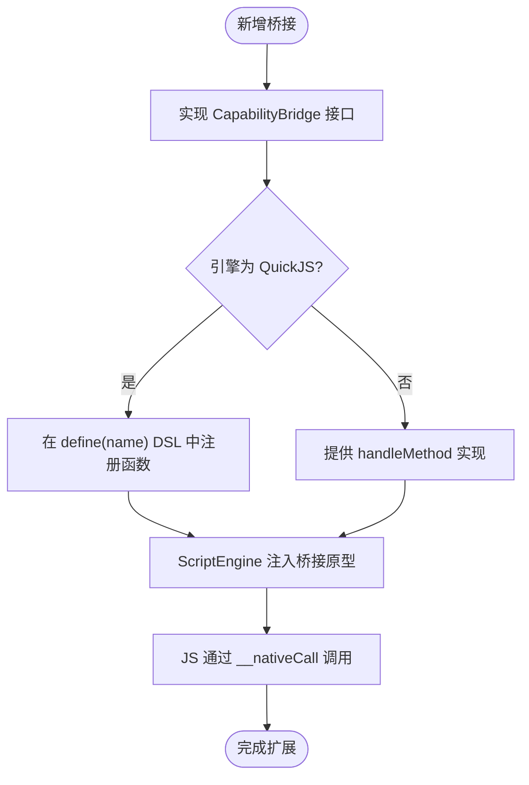
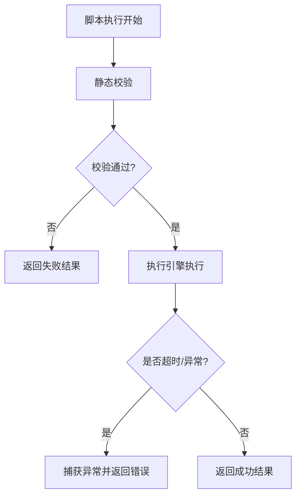
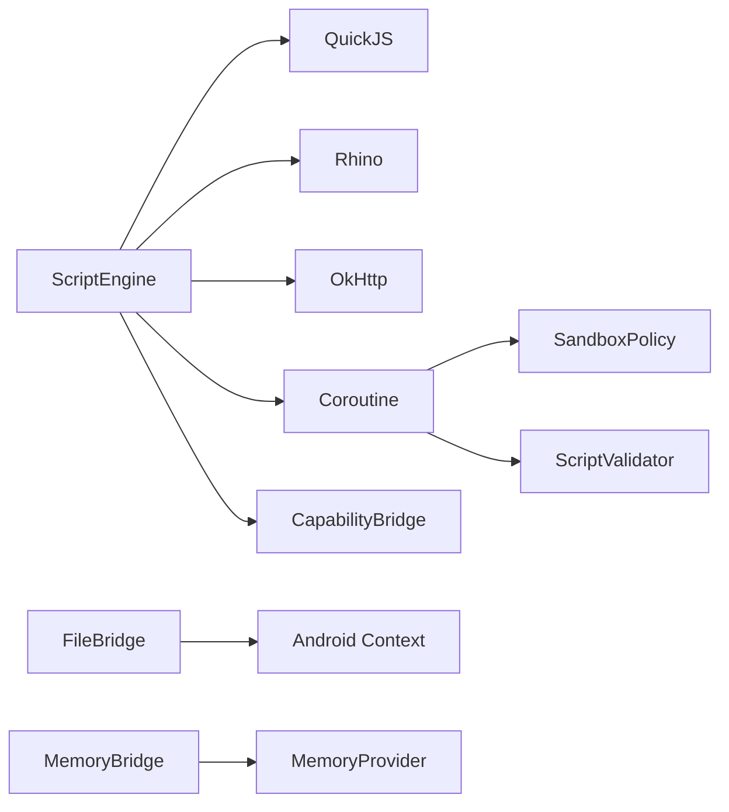

# 脚本桥接接口

<cite>
**本文引用的文件**
- [FileBridge.kt](file://script/src/main/java/ai/openclaw/script/bridge/FileBridge.kt)
- [HttpBridge.kt](file://script/src/main/java/ai/openclaw/script/bridge/HttpBridge.kt)
- [MemoryBridge.kt](file://script/src/main/java/ai/openclaw/script/bridge/MemoryBridge.kt)
- [CapabilityBridge.kt](file://script/src/main/java/ai/openclaw/script/CapabilityBridge.kt)
- [ScriptEngine.kt](file://script/src/main/java/ai/openclaw/script/ScriptEngine.kt)
- [ScriptOrchestrator.kt](file://script/src/main/java/ai/openclaw/script/ScriptOrchestrator.kt)
- [SandboxPolicy.kt](file://script/src/main/java/ai/openclaw/script/SandboxPolicy.kt)
- [ScriptValidator.kt](file://script/src/main/java/ai/openclaw/script/ScriptValidator.kt)
- [ScriptResult.kt](file://script/src/main/java/ai/openclaw/script/ScriptResult.kt)
- [ScriptSkill.kt](file://app/src/main/java/ai/openclaw/android/skill/builtin/ScriptSkill.kt)
- [FileBridgeTest.kt](file://script/src/test/java/ai/openclaw/script/bridge/FileBridgeTest.kt)
- [HttpBridgeTest.kt](file://script/src/test/java/ai/openclaw/script/bridge/HttpBridgeTest.kt)
- [script-engine.md](file://docs/script-engine.md)
</cite>

## 目录
1. [简介](#简介)
2. [项目结构](#项目结构)
3. [核心组件](#核心组件)
4. [架构总览](#架构总览)
5. [详细组件分析](#详细组件分析)
6. [依赖关系分析](#依赖关系分析)
7. [性能考量](#性能考量)
8. [故障排查指南](#故障排查指南)
9. [结论](#结论)
10. [附录](#附录)

## 简介
本文件面向脚本桥接接口的设计与实现，围绕三类桥接能力进行深入解析：文件系统桥接（FileBridge）、网络请求桥接（HttpBridge）、内存数据桥接（MemoryBridge）。文档同时阐述桥接接口的统一抽象与扩展机制、错误处理与异常传播、性能优化与缓存策略，并给出使用示例与最佳实践，以及安全考虑与权限验证要点。

## 项目结构
脚本桥接位于独立的脚本模块中，采用“能力桥接 + 执行引擎 + 安全策略”的分层组织：
- 能力桥接：FileBridge、HttpBridge、MemoryBridge 实现统一的 CapabilityBridge 接口
- 执行引擎：ScriptEngine 支持 QuickJS 与 Rhino 双引擎，负责脚本执行、超时控制与桥接分发
- 安全策略：SandboxPolicy 定义超时、内存、路径与网络访问等策略
- 编排器：ScriptOrchestrator 负责能力解析、沙箱目录准备与执行入口

**图示来源**
- [ScriptOrchestrator.kt:13-54](file://script/src/main/java/ai/openclaw/script/ScriptOrchestrator.kt#L13-L54)
- [ScriptEngine.kt:22-231](file://script/src/main/java/ai/openclaw/script/ScriptEngine.kt#L22-L231)
- [CapabilityBridge.kt:13-33](file://script/src/main/java/ai/openclaw/script/CapabilityBridge.kt#L13-L33)
- [FileBridge.kt:19-120](file://script/src/main/java/ai/openclaw/script/bridge/FileBridge.kt#L19-L120)
- [HttpBridge.kt:18-87](file://script/src/main/java/ai/openclaw/script/bridge/HttpBridge.kt#L18-L87)
- [MemoryBridge.kt:14-54](file://script/src/main/java/ai/openclaw/script/bridge/MemoryBridge.kt#L14-L54)

**章节来源**
- [ScriptOrchestrator.kt:13-54](file://script/src/main/java/ai/openclaw/script/ScriptOrchestrator.kt#L13-L54)
- [ScriptEngine.kt:22-231](file://script/src/main/java/ai/openclaw/script/ScriptEngine.kt#L22-L231)
- [CapabilityBridge.kt:13-33](file://script/src/main/java/ai/openclaw/script/CapabilityBridge.kt#L13-L33)

## 核心组件
- 统一桥接接口：CapabilityBridge 定义 name、JS 原型注入与方法处理的统一契约；QuickJS 模式通过 registerBindings 注册函数，Rhino 模式通过 handleMethod 分发
- 执行引擎：ScriptEngine 支持 QuickJS 与 Rhino，内置脚本缓存、超时控制与统计信息
- 安全策略：SandboxPolicy 提供超时、内存限制、沙箱目录、网络开关与域名白名单
- 静态校验：ScriptValidator 在执行前阻断危险模式与超长脚本
- 结果封装：ScriptResult 统一封装成功/失败、输出与错误信息、执行耗时

**章节来源**
- [CapabilityBridge.kt:13-33](file://script/src/main/java/ai/openclaw/script/CapabilityBridge.kt#L13-L33)
- [ScriptEngine.kt:22-231](file://script/src/main/java/ai/openclaw/script/ScriptEngine.kt#L22-L231)
- [SandboxPolicy.kt:8-15](file://script/src/main/java/ai/openclaw/script/SandboxPolicy.kt#L8-L15)
- [ScriptValidator.kt:8-59](file://script/src/main/java/ai/openclaw/script/ScriptValidator.kt#L8-L59)
- [ScriptResult.kt:6-19](file://script/src/main/java/ai/openclaw/script/ScriptResult.kt#L6-L19)

## 架构总览
脚本执行流程如下：编排器根据能力列表解析桥接，注入到引擎；引擎在 QuickJS/Rhino 中注册桥接原型；JS 调用通过 __nativeCall 分发至具体桥接；桥接执行受限于沙箱策略与超时控制。

**图示来源**
- [ScriptOrchestrator.kt:31-53](file://script/src/main/java/ai/openclaw/script/ScriptOrchestrator.kt#L31-L53)
- [ScriptEngine.kt:45-99](file://script/src/main/java/ai/openclaw/script/ScriptEngine.kt#L45-L99)
- [ScriptValidator.kt:42-58](file://script/src/main/java/ai/openclaw/script/ScriptValidator.kt#L42-L58)
- [SandboxPolicy.kt:8-15](file://script/src/main/java/ai/openclaw/script/SandboxPolicy.kt#L8-L15)

## 详细组件分析

### FileBridge 文件系统桥接
- 设计目标：在沙箱目录内提供文件读取、写入、目录枚举与存在性检查的受限能力
- JS API：fs.readFile(path)、fs.writeFile(path, content)、fs.list(dir)、fs.exists(path)
- 安全控制：
  - 路径解析采用 canonicalPath 并与沙箱根比较，阻断路径穿越
  - 写入前确保父目录存在
- 错误处理：对未知方法、非法路径、文件不存在等情况返回结构化错误
- JSON 工具：内置 extractField 与 jsonEscape，避免引入额外 JSON 依赖

**图示来源**
- [FileBridge.kt:19-120](file://script/src/main/java/ai/openclaw/script/bridge/FileBridge.kt#L19-L120)
- [CapabilityBridge.kt:13-33](file://script/src/main/java/ai/openclaw/script/CapabilityBridge.kt#L13-L33)

**章节来源**
- [FileBridge.kt:9-120](file://script/src/main/java/ai/openclaw/script/bridge/FileBridge.kt#L9-L120)
- [FileBridgeTest.kt:21-79](file://script/src/test/java/ai/openclaw/script/bridge/FileBridgeTest.kt#L21-L79)

### HttpBridge 网络请求桥接
- 设计目标：提供受限的 HTTP GET/POST 能力，基于 OkHttp 实现
- JS API：http.get(url)、http.post(url, body)
- 安全控制：
  - 通过 SandboxPolicy.allowNetwork 控制网络开关
  - allowedDomains 可选白名单（策略类提供，具体校验可在主工程实现）
- 错误处理：对空 URL、未知方法、网络异常返回结构化错误
- 超时控制：OkHttp 客户端设置连接/读取超时

**图示来源**
- [HttpBridge.kt:18-87](file://script/src/main/java/ai/openclaw/script/bridge/HttpBridge.kt#L18-L87)
- [CapabilityBridge.kt:13-33](file://script/src/main/java/ai/openclaw/script/CapabilityBridge.kt#L13-L33)

**章节来源**
- [HttpBridge.kt:11-87](file://script/src/main/java/ai/openclaw/script/bridge/HttpBridge.kt#L11-L87)
- [HttpBridgeTest.kt:17-28](file://script/src/test/java/ai/openclaw/script/bridge/HttpBridgeTest.kt#L17-L28)

### MemoryBridge 内存数据桥接
- 设计目标：为脚本提供记忆检索与存储的接口，具体实现由主工程通过 MemoryProvider 注入
- JS API：memory.recall(query, limit)、memory.store(content)
- 同步机制：MemoryBridge 使用协程阻塞等待主工程异步实现完成，确保 JS 调用语义一致
- 错误处理：对未知方法、空内容、主工程异常返回结构化错误

**图示来源**
- [MemoryBridge.kt:14-54](file://script/src/main/java/ai/openclaw/script/bridge/MemoryBridge.kt#L14-L54)
- [CapabilityBridge.kt:13-33](file://script/src/main/java/ai/openclaw/script/CapabilityBridge.kt#L13-L33)

**章节来源**
- [MemoryBridge.kt:6-54](file://script/src/main/java/ai/openclaw/script/bridge/MemoryBridge.kt#L6-L54)
- [ScriptSkill.kt:89-131](file://app/src/main/java/ai/openclaw/android/skill/builtin/ScriptSkill.kt#L89-L131)

### 统一抽象与扩展机制
- 统一抽象：所有桥接均实现 CapabilityBridge，提供 name、JS 原型注入与方法分发
- QuickJS 扩展：通过 registerBindings 在 define(name) DSL 中注册函数，JS 侧通过 __nativeCall 调用
- Rhino 扩展：通过 handleMethod 与自定义 __nativeCall 函数对接
- 扩展点：新增桥接仅需实现 CapabilityBridge，并在 ScriptOrchestrator 中解析或由调用方传入 customBridges

**图示来源**
- [CapabilityBridge.kt:13-33](file://script/src/main/java/ai/openclaw/script/CapabilityBridge.kt#L13-L33)
- [ScriptEngine.kt:120-225](file://script/src/main/java/ai/openclaw/script/ScriptEngine.kt#L120-L225)

**章节来源**
- [CapabilityBridge.kt:13-33](file://script/src/main/java/ai/openclaw/script/CapabilityBridge.kt#L13-L33)
- [ScriptEngine.kt:120-225](file://script/src/main/java/ai/openclaw/script/ScriptEngine.kt#L120-L225)

### 错误处理与异常传播
- 静态校验：ScriptValidator 在执行前阻断危险模式与超长脚本
- 运行时错误：各桥接捕获异常并返回结构化错误 JSON
- 超时控制：ScriptEngine 使用 withTimeoutOrNull 与线程池超时，防止长时间阻塞
- 引擎降级：QuickJS 失败自动回退 Rhino，并记录日志

**图示来源**
- [ScriptValidator.kt:42-58](file://script/src/main/java/ai/openclaw/script/ScriptValidator.kt#L42-L58)
- [ScriptEngine.kt:68-98](file://script/src/main/java/ai/openclaw/script/ScriptEngine.kt#L68-L98)

**章节来源**
- [ScriptValidator.kt:8-59](file://script/src/main/java/ai/openclaw/script/ScriptValidator.kt#L8-L59)
- [ScriptEngine.kt:68-98](file://script/src/main/java/ai/openclaw/script/ScriptEngine.kt#L68-L98)

## 依赖关系分析
- ScriptEngine 依赖 QuickJS/Rhino、OkHttp、协程库，负责执行与桥接分发
- ScriptOrchestrator 负责能力解析与沙箱目录准备
- 各桥接依赖 Android 上下文（FileBridge）或通过 MemoryProvider 注入（MemoryBridge）

**图示来源**
- [ScriptEngine.kt:45-231](file://script/src/main/java/ai/openclaw/script/ScriptEngine.kt#L45-L231)
- [FileBridge.kt:19-120](file://script/src/main/java/ai/openclaw/script/bridge/FileBridge.kt#L19-L120)
- [MemoryBridge.kt:14-54](file://script/src/main/java/ai/openclaw/script/bridge/MemoryBridge.kt#L14-L54)

**章节来源**
- [ScriptEngine.kt:45-231](file://script/src/main/java/ai/openclaw/script/ScriptEngine.kt#L45-L231)
- [ScriptOrchestrator.kt:41-53](file://script/src/main/java/ai/openclaw/script/ScriptOrchestrator.kt#L41-L53)

## 性能考量
- 引擎选择：QuickJS JNI 作为正式引擎，相较 Rhino 具备更小体积与更高性能
- 脚本缓存：ScriptEngine 维护按脚本哈希的执行时间缓存，命中则直接返回缓存结果
- 统计指标：维护总执行次数、成功/失败计数、平均耗时与缓存大小
- 超时控制：默认 10 秒，可通过 SandboxPolicy.timeoutMs 调整
- 线程模型：Rhino 使用单线程执行，避免并发问题；QuickJS 在 Dispatchers.Default 执行

**章节来源**
- [ScriptEngine.kt:33-118](file://script/src/main/java/ai/openclaw/script/ScriptEngine.kt#L33-L118)
- [script-engine.md:245-246](file://docs/script-engine.md#L245-L246)

## 故障排查指南
- 静态校验失败：检查脚本是否包含被禁用的关键字或超过长度限制
- 路径穿越错误：确认文件路径未包含 “../” 等越权片段
- 网络请求失败：检查 URL 是否为空、域名是否在白名单内、网络是否可用
- 超时错误：适当提高 SandboxPolicy.timeoutMs，或优化脚本逻辑
- 引擎回退：若 QuickJS 失败，系统会自动切换到 Rhino，可关注日志提示

**章节来源**
- [ScriptValidator.kt:42-58](file://script/src/main/java/ai/openclaw/script/ScriptValidator.kt#L42-L58)
- [FileBridge.kt:82-90](file://script/src/main/java/ai/openclaw/script/bridge/FileBridge.kt#L82-L90)
- [HttpBridge.kt:66-72](file://script/src/main/java/ai/openclaw/script/bridge/HttpBridge.kt#L66-L72)
- [ScriptEngine.kt:88-98](file://script/src/main/java/ai/openclaw/script/ScriptEngine.kt#L88-L98)

## 结论
脚本桥接接口以 CapabilityBridge 为核心抽象，统一了 QuickJS 与 Rhino 的桥接模式，结合静态校验、运行时沙箱与超时控制，提供了安全可控的脚本执行环境。FileBridge、HttpBridge、MemoryBridge 分别覆盖文件系统、网络与记忆能力，配合主工程的 Provider 回调实现，既保证了扩展性，也确保了安全性与性能。

## 附录

### 使用示例与最佳实践
- 基本执行：通过 ScriptOrchestrator.execute(script, capabilities) 启动脚本执行
- 能力选择：capabilities 支持 "fs"/"file"、"http"/"network"，默认启用 fs 与 http
- 自定义桥接：通过 customBridges 传入 MemoryBridge 等自定义实现
- 最佳实践：
  - 优先使用 QuickJS 引擎，确保性能与体积优势
  - 合理设置 SandboxPolicy.timeoutMs 与 allowedDomains
  - 对 MemoryBridge 的 MemoryProvider 实现进行异步与幂等设计
  - 在主工程中对 UI 渲染通过专用 Bridge 实现，避免脚本直接操作 UI

**章节来源**
- [ScriptOrchestrator.kt:31-53](file://script/src/main/java/ai/openclaw/script/ScriptOrchestrator.kt#L31-L53)
- [ScriptSkill.kt:72-87](file://app/src/main/java/ai/openclaw/android/skill/builtin/ScriptSkill.kt#L72-L87)
- [script-engine.md:256-278](file://docs/script-engine.md#L256-L278)

### 安全考虑与权限验证
- 静态校验：禁止 import/require/eval/new Function、定时器、原型污染与访问 java/android/process/global/window/document 等关键字
- 运行时隔离：Rhino 使用安全标准对象初始化并移除危险全局对象；每次执行创建独立上下文与线程
- 文件沙箱：FileBridge 严格限制在沙箱目录内，路径穿越检测阻断越权访问
- 网络控制：通过 SandboxPolicy.allowNetwork 与 allowedDomains 控制网络访问范围
- 记忆访问：MemoryBridge 通过 MemoryProvider 回调，主工程自行决定权限与鉴权

**章节来源**
- [ScriptValidator.kt:12-35](file://script/src/main/java/ai/openclaw/script/ScriptValidator.kt#L12-L35)
- [ScriptEngine.kt:144-209](file://script/src/main/java/ai/openclaw/script/ScriptEngine.kt#L144-L209)
- [FileBridge.kt:82-90](file://script/src/main/java/ai/openclaw/script/bridge/FileBridge.kt#L82-L90)
- [SandboxPolicy.kt:8-15](file://script/src/main/java/ai/openclaw/script/SandboxPolicy.kt#L8-L15)
- [MemoryBridge.kt:12-13](file://script/src/main/java/ai/openclaw/script/bridge/MemoryBridge.kt#L12-L13)