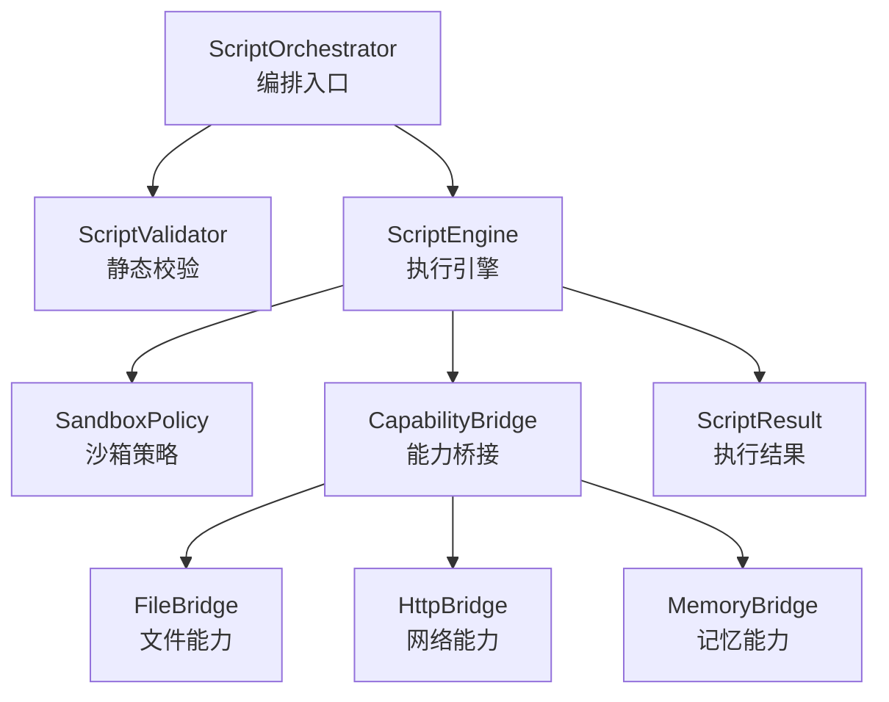
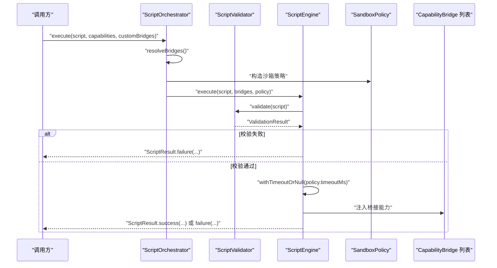
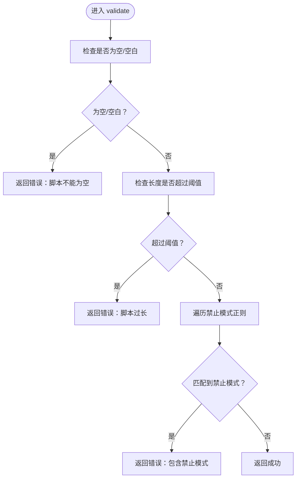
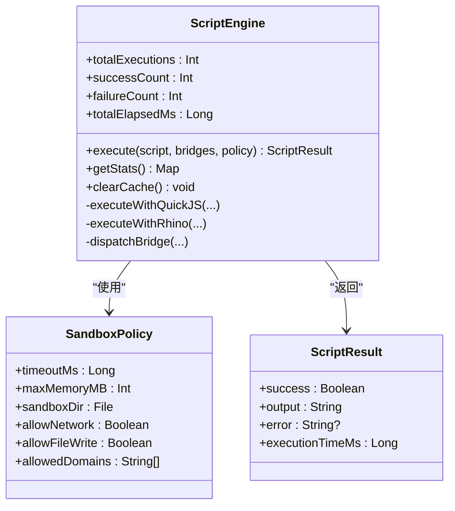
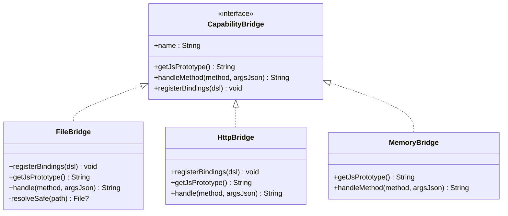
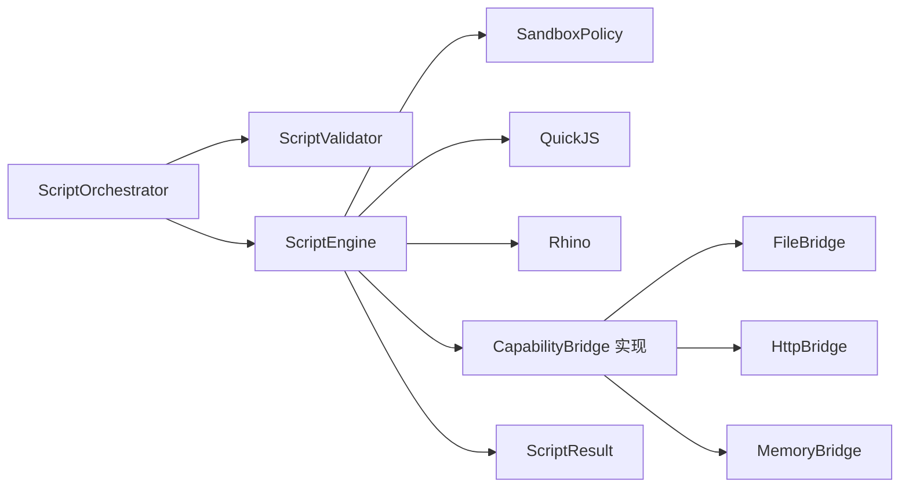

# 脚本验证系统

<cite>
**本文引用的文件**
- [ScriptValidator.kt](file://script/src/main/java/ai/openclaw/script/ScriptValidator.kt)
- [ScriptEngine.kt](file://script/src/main/java/ai/openclaw/script/ScriptEngine.kt)
- [ScriptOrchestrator.kt](file://script/src/main/java/ai/openclaw/script/ScriptOrchestrator.kt)
- [SandboxPolicy.kt](file://script/src/main/java/ai/openclaw/script/SandboxPolicy.kt)
- [ScriptResult.kt](file://script/src/main/java/ai/openclaw/script/ScriptResult.kt)
- [CapabilityBridge.kt](file://script/src/main/java/ai/openclaw/script/CapabilityBridge.kt)
- [FileBridge.kt](file://script/src/main/java/ai/openclaw/script/bridge/FileBridge.kt)
- [HttpBridge.kt](file://script/src/main/java/ai/openclaw/script/bridge/HttpBridge.kt)
- [MemoryBridge.kt](file://script/src/main/java/ai/openclaw/script/bridge/MemoryBridge.kt)
- [ScriptValidatorTest.kt](file://script/src/test/java/ai/openclaw/script/ScriptValidatorTest.kt)
- [ScriptEngineTest.kt](file://script/src/test/java/ai/openclaw/script/ScriptEngineTest.kt)
- [weather.js](file://app/src/main/assets/scripts/weather.js)
- [search.js](file://app/src/main/assets/scripts/search.js)
- [script-engine.md](file://docs/script-engine.md)
</cite>

## 目录
1. [简介](#简介)
2. [项目结构](#项目结构)
3. [核心组件](#核心组件)
4. [架构总览](#架构总览)
5. [详细组件分析](#详细组件分析)
6. [依赖关系分析](#依赖关系分析)
7. [性能考量](#性能考量)
8. [故障排查指南](#故障排查指南)
9. [结论](#结论)
10. [附录](#附录)

## 简介
本文件面向“脚本验证系统”的全面技术文档，聚焦于脚本语法验证与语义分析的实现机制，深入解析 ScriptValidator 的验证规则与检查策略；阐述脚本复杂度评估与潜在风险检测；说明脚本注入攻击的预防与防护机制；解释验证规则的配置管理与动态更新；并提供常见脚本错误的诊断与修复建议，以及脚本质量评估与安全扫描的实现方案与性能优化策略。

## 项目结构
脚本验证系统位于独立的 Android Library 模块中，核心由以下层次构成：
- 入口与编排层：ScriptOrchestrator
- 验证层：ScriptValidator
- 执行层：ScriptEngine（双引擎：QuickJS 与 Rhino 原型）
- 桥接层：CapabilityBridge 及其具体实现（FileBridge、HttpBridge、MemoryBridge）
- 策略层：SandboxPolicy
- 结果模型：ScriptResult

图示来源
- [ScriptOrchestrator.kt:13-54](file://script/src/main/java/ai/openclaw/script/ScriptOrchestrator.kt#L13-L54)
- [ScriptValidator.kt:8-59](file://script/src/main/java/ai/openclaw/script/ScriptValidator.kt#L8-L59)
- [ScriptEngine.kt:22-231](file://script/src/main/java/ai/openclaw/script/ScriptEngine.kt#L22-L231)
- [SandboxPolicy.kt:8-15](file://script/src/main/java/ai/openclaw/script/SandboxPolicy.kt#L8-L15)
- [CapabilityBridge.kt:13-32](file://script/src/main/java/ai/openclaw/script/CapabilityBridge.kt#L13-L32)
- [FileBridge.kt:20-120](file://script/src/main/java/ai/openclaw/script/bridge/FileBridge.kt#L20-L120)
- [HttpBridge.kt:18-87](file://script/src/main/java/ai/openclaw/script/bridge/HttpBridge.kt#L18-L87)
- [MemoryBridge.kt:14-54](file://script/src/main/java/ai/openclaw/script/bridge/MemoryBridge.kt#L14-L54)
- [ScriptResult.kt:6-19](file://script/src/main/java/ai/openclaw/script/ScriptResult.kt#L6-L19)

章节来源
- [ScriptOrchestrator.kt:13-54](file://script/src/main/java/ai/openclaw/script/ScriptOrchestrator.kt#L13-L54)
- [ScriptEngine.kt:22-231](file://script/src/main/java/ai/openclaw/script/ScriptEngine.kt#L22-L231)
- [script-engine.md:1-315](file://docs/script-engine.md#L1-L315)

## 核心组件
- ScriptValidator：对脚本进行静态语法与语义层面的快速筛查，阻断高危模式与异常输入。
- ScriptEngine：双引擎执行环境，负责注入桥接能力、应用沙箱策略、统计执行信息与回退机制。
- ScriptOrchestrator：统一入口，负责能力解析、沙箱目录准备与执行编排。
- CapabilityBridge 及其实现：将 Android 能力以受控方式暴露给 JS 脚本。
- SandboxPolicy：超时、内存、路径与网络权限等策略配置。
- ScriptResult：标准化执行结果与耗时统计。

章节来源
- [ScriptValidator.kt:8-59](file://script/src/main/java/ai/openclaw/script/ScriptValidator.kt#L8-L59)
- [ScriptEngine.kt:22-231](file://script/src/main/java/ai/openclaw/script/ScriptEngine.kt#L22-L231)
- [ScriptOrchestrator.kt:13-54](file://script/src/main/java/ai/openclaw/script/ScriptOrchestrator.kt#L13-L54)
- [SandboxPolicy.kt:8-15](file://script/src/main/java/ai/openclaw/script/SandboxPolicy.kt#L8-L15)
- [ScriptResult.kt:6-19](file://script/src/main/java/ai/openclaw/script/ScriptResult.kt#L6-L19)

## 架构总览
下图展示了从调用方到脚本执行与结果返回的完整流程，并标注关键的安全控制点。

图示来源
- [ScriptOrchestrator.kt:31-39](file://script/src/main/java/ai/openclaw/script/ScriptOrchestrator.kt#L31-L39)
- [ScriptEngine.kt:45-99](file://script/src/main/java/ai/openclaw/script/ScriptEngine.kt#L45-L99)
- [ScriptValidator.kt:42-58](file://script/src/main/java/ai/openclaw/script/ScriptValidator.kt#L42-L58)

## 详细组件分析

### ScriptValidator：验证规则与检查策略
- 输入约束
  - 空脚本与空白脚本拒绝。
  - 脚本长度上限（默认 50KB），防止资源滥用。
- 禁止模式清单（正则匹配，大小写不敏感）
  - 模块加载：import、require
  - 动态求值：eval、new Function
  - 定时器：setTimeout、setInterval
  - 原型污染：__proto__、constructor.prototype、constructor.xxx
  - 平台对象：java.、android.、Packages、process、global、globalThis、window、document
- 输出
  - 成功：返回合法状态
  - 失败：返回错误信息，包含触发的模式描述

图示来源
- [ScriptValidator.kt:42-58](file://script/src/main/java/ai/openclaw/script/ScriptValidator.kt#L42-L58)

章节来源
- [ScriptValidator.kt:8-59](file://script/src/main/java/ai/openclaw/script/ScriptValidator.kt#L8-L59)
- [ScriptValidatorTest.kt:8-55](file://script/src/test/java/ai/openclaw/script/ScriptValidatorTest.kt#L8-L55)

### ScriptEngine：执行与安全控制
- 双引擎架构
  - 主引擎：QuickJS（JNI，性能高）
  - 备用引擎：Rhino（原型，自动降级）
- 执行流程
  - 缓存命中：直接返回缓存耗时与提示
  - 静态校验：调用 ScriptValidator
  - 注入桥接：按能力注册全局对象或原型函数
  - 超时控制：withTimeoutOrNull 或线程池超时
  - 统计更新：执行次数、成功/失败计数、总耗时、缓存大小
  - 引擎回退：QuickJS 失败时自动切换到 Rhino
- 沙箱策略
  - 超时（默认 10 秒）、可配置
  - 缓存（基于哈希键，最大容量 50）
  - 统计信息：总执行次数、成功/失败次数、平均耗时、当前活跃引擎

图示来源
- [ScriptEngine.kt:22-231](file://script/src/main/java/ai/openclaw/script/ScriptEngine.kt#L22-L231)
- [SandboxPolicy.kt:8-15](file://script/src/main/java/ai/openclaw/script/SandboxPolicy.kt#L8-L15)
- [ScriptResult.kt:6-19](file://script/src/main/java/ai/openclaw/script/ScriptResult.kt#L6-L19)

章节来源
- [ScriptEngine.kt:22-231](file://script/src/main/java/ai/openclaw/script/ScriptEngine.kt#L22-L231)
- [ScriptEngineTest.kt:16-148](file://script/src/test/java/ai/openclaw/script/ScriptEngineTest.kt#L16-L148)

### ScriptOrchestrator：编排入口
- 负责能力解析（fs、http 等），准备沙箱目录，创建 ScriptEngine 并发起执行。
- 默认能力集合为 ["fs", "http"]，未知能力会记录警告。

章节来源
- [ScriptOrchestrator.kt:13-54](file://script/src/main/java/ai/openclaw/script/ScriptOrchestrator.kt#L13-L54)

### CapabilityBridge 及其实现：受控能力暴露
- CapabilityBridge：定义桥接接口，QuickJS 使用 registerBindings 注册函数；Rhino 使用 getJsPrototype 与 handleMethod。
- FileBridge：仅限沙箱目录内读写、列出与存在性检查，内置路径穿越检测。
- HttpBridge：基于 OkHttp 的 GET/POST，支持超时配置。
- MemoryBridge：通过 MemoryProvider 回调实现记忆检索与存储。

图示来源
- [CapabilityBridge.kt:13-32](file://script/src/main/java/ai/openclaw/script/CapabilityBridge.kt#L13-L32)
- [FileBridge.kt:20-120](file://script/src/main/java/ai/openclaw/script/bridge/FileBridge.kt#L20-L120)
- [HttpBridge.kt:18-87](file://script/src/main/java/ai/openclaw/script/bridge/HttpBridge.kt#L18-L87)
- [MemoryBridge.kt:14-54](file://script/src/main/java/ai/openclaw/script/bridge/MemoryBridge.kt#L14-L54)

章节来源
- [FileBridge.kt:20-120](file://script/src/main/java/ai/openclaw/script/bridge/FileBridge.kt#L20-L120)
- [HttpBridge.kt:18-87](file://script/src/main/java/ai/openclaw/script/bridge/HttpBridge.kt#L18-L87)
- [MemoryBridge.kt:14-54](file://script/src/main/java/ai/openclaw/script/bridge/MemoryBridge.kt#L14-L54)

### 示例脚本：天气与搜索
- weather.js：通过 http.get 获取天气摘要并返回 JSON。
- search.js：轮询多个 SearXNG 实例，聚合搜索结果并返回 JSON。

章节来源
- [weather.js:1-16](file://app/src/main/assets/scripts/weather.js#L1-L16)
- [search.js:1-39](file://app/src/main/assets/scripts/search.js#L1-L39)

## 依赖关系分析
- 组件耦合
  - ScriptOrchestrator 依赖 ScriptEngine 与 ScriptValidator，负责编排与能力解析。
  - ScriptEngine 依赖 SandboxPolicy、Bridge 实现与 ScriptValidator。
  - Bridge 实现依赖 CapabilityBridge 接口与外部库（OkHttp、QuickJS 绑定等）。
- 外部依赖
  - QuickJS（JNI）与 Rhino（原型）作为 JS 引擎。
  - OkHttp 用于 HTTP Bridge。
  - Kotlin 协程用于异步与超时控制。

图示来源
- [ScriptOrchestrator.kt:13-54](file://script/src/main/java/ai/openclaw/script/ScriptOrchestrator.kt#L13-L54)
- [ScriptEngine.kt:22-231](file://script/src/main/java/ai/openclaw/script/ScriptEngine.kt#L22-L231)
- [FileBridge.kt:20-120](file://script/src/main/java/ai/openclaw/script/bridge/FileBridge.kt#L20-L120)
- [HttpBridge.kt:18-87](file://script/src/main/java/ai/openclaw/script/bridge/HttpBridge.kt#L18-L87)
- [MemoryBridge.kt:14-54](file://script/src/main/java/ai/openclaw/script/bridge/MemoryBridge.kt#L14-L54)

章节来源
- [script-engine.md:237-246](file://docs/script-engine.md#L237-L246)

## 性能考量
- 执行性能
  - 快速路径：缓存命中直接返回，避免重复编译与执行。
  - 引擎选择：优先 QuickJS（JNI），失败自动回退 Rhino。
  - 超时控制：统一的超时策略，防止长时间阻塞。
- 内存与资源
  - 脚本长度限制与缓存容量限制，避免内存膨胀。
  - 沙箱目录隔离与路径穿越检测，降低 I/O 风险。
- 统计指标
  - ScriptEngine 提供执行次数、成功/失败计数、平均耗时与缓存大小，便于性能监控与优化。

章节来源
- [ScriptEngine.kt:28-118](file://script/src/main/java/ai/openclaw/script/ScriptEngine.kt#L28-L118)
- [ScriptEngineTest.kt:133-137](file://script/src/test/java/ai/openclaw/script/ScriptEngineTest.kt#L133-L137)

## 故障排查指南
- 常见错误与定位
  - 空脚本/空白脚本：校验阶段直接失败，错误信息明确。
  - 脚本过长：超过 50KB 限制，需精简或拆分。
  - 包含禁止模式：import/require/eval/new Function/定时器/平台对象/原型污染等，需移除或改用桥接能力。
  - 超时：设置合理超时时间，避免死循环或阻塞操作。
  - 路径穿越：FileBridge 会拦截越权路径，检查相对路径与沙箱根目录。
- 诊断步骤
  - 使用 ScriptValidator.validate() 快速判断语法与模式问题。
  - 通过 ScriptEngine.getStats() 查看执行统计与活跃引擎。
  - 在测试中参考现有用例，逐步缩小问题范围。
- 修复建议
  - 移除动态模块加载与动态求值。
  - 使用 http/fs/memory 等受控桥接替代原生平台能力。
  - 将长脚本拆分为多个短脚本，利用缓存与并发控制。
  - 对 I/O 操作增加超时与重试策略。

章节来源
- [ScriptValidatorTest.kt:21-55](file://script/src/test/java/ai/openclaw/script/ScriptValidatorTest.kt#L21-L55)
- [ScriptEngineTest.kt:94-129](file://script/src/test/java/ai/openclaw/script/ScriptEngineTest.kt#L94-L129)
- [FileBridge.kt:82-86](file://script/src/main/java/ai/openclaw/script/bridge/FileBridge.kt#L82-L86)

## 结论
该脚本验证系统通过“静态校验 + 双引擎执行 + 桥接能力 + 沙箱策略”的组合，实现了对动态 JS 脚本的安全可控执行。ScriptValidator 覆盖了常见的注入与滥用模式，ScriptEngine 提供高性能与可回退的执行环境，Bridge 将 Android 能力以最小权限暴露给脚本。配合统计与缓存机制，系统在安全性与性能之间取得平衡。后续可在规则配置化、复杂度评估与更丰富的安全扫描方面持续演进。

## 附录

### 验证规则配置与动态更新
- 当前规则为硬编码清单，可通过扩展 ScriptValidator 的规则集实现动态更新（例如从远程配置加载正则列表与阈值）。
- 建议引入规则版本与灰度发布机制，确保变更的可追溯与可回滚。

章节来源
- [ScriptValidator.kt:10-35](file://script/src/main/java/ai/openclaw/script/ScriptValidator.kt#L10-L35)

### 脚本复杂度评估与潜在风险检测
- 复杂度维度建议
  - 代码规模：字符数/行数（已有长度限制）
  - 控制流复杂度：循环嵌套、分支数量
  - I/O 次数：文件读写、网络请求
  - 能力使用：桥接能力调用频率与参数规模
- 风险等级
  - 高风险：动态求值、定时器、原型污染、平台对象访问
  - 中风险：大量 I/O、深层递归、长时阻塞
  - 低风险：纯计算与轻量 I/O
- 建议
  - 引入静态分析工具（AST/CFG）量化复杂度
  - 对高风险脚本启用更强的超时与内存限制

章节来源
- [ScriptValidator.kt:12-35](file://script/src/main/java/ai/openclaw/script/ScriptValidator.kt#L12-L35)
- [ScriptEngine.kt:126-142](file://script/src/main/java/ai/openclaw/script/ScriptEngine.kt#L126-L142)

### 脚本注入攻击的预防与防护
- 静态防护
  - 禁止模块加载、动态求值、定时器、原型污染与平台对象访问
  - 长度限制与空白检测
- 运行时防护
  - Rhino 初始化安全对象并删除危险全局变量
  - QuickJS 注入受控桥接对象，避免直接暴露宿主 API
  - 超时与缓存双重限制
- 文件沙箱
  - 严格路径解析与越权拦截

章节来源
- [ScriptEngine.kt:120-209](file://script/src/main/java/ai/openclaw/script/ScriptEngine.kt#L120-L209)
- [FileBridge.kt:82-119](file://script/src/main/java/ai/openclaw/script/bridge/FileBridge.kt#L82-L119)

### 脚本质量评估与安全扫描实现方案
- 质量评估
  - 规范性：命名、缩进、注释、异常处理
  - 可维护性：函数长度、嵌套深度、重复代码
  - 性能：I/O 次数、循环复杂度、缓存命中率
- 安全扫描
  - 关键正则匹配：模块加载、动态求值、定时器、原型污染、平台对象
  - 能力滥用：高频调用、大参数、跨域请求
- 工具化
  - 集成静态分析与规则引擎，输出质量报告与风险评分

章节来源
- [ScriptValidator.kt:12-35](file://script/src/main/java/ai/openclaw/script/ScriptValidator.kt#L12-L35)
- [script-engine.md:151-168](file://docs/script-engine.md#L151-L168)