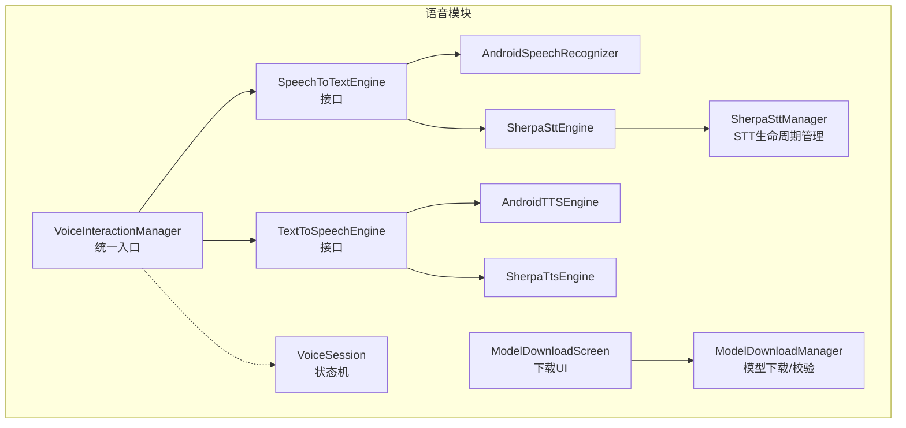
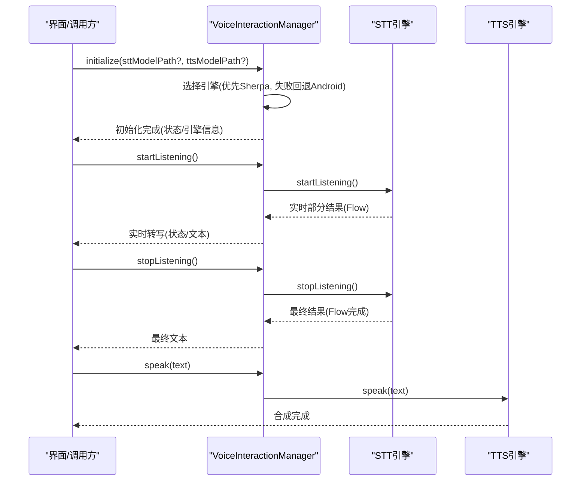
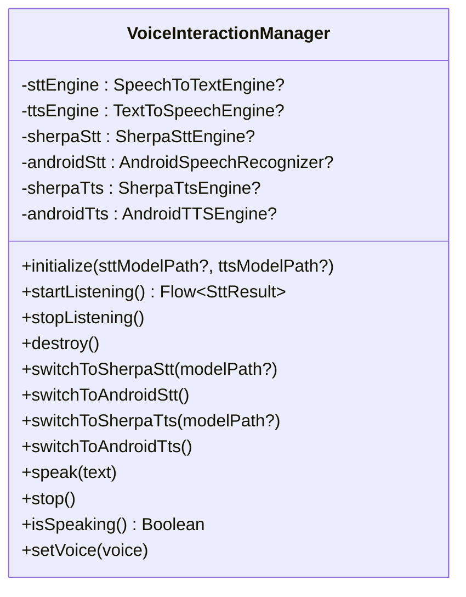
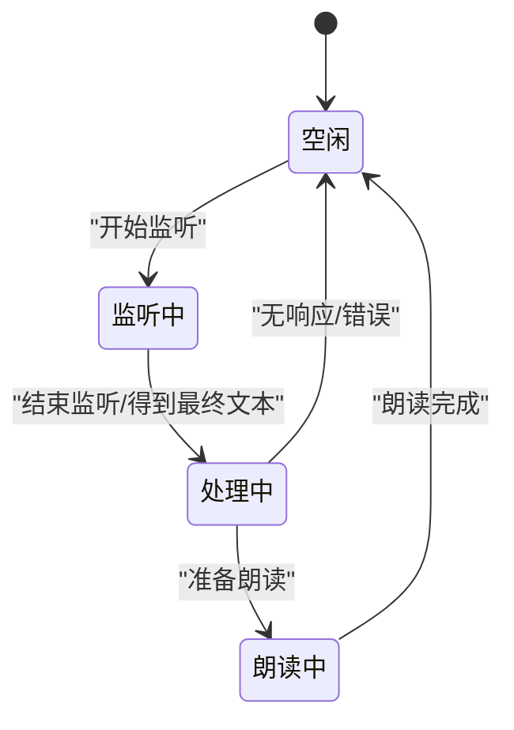
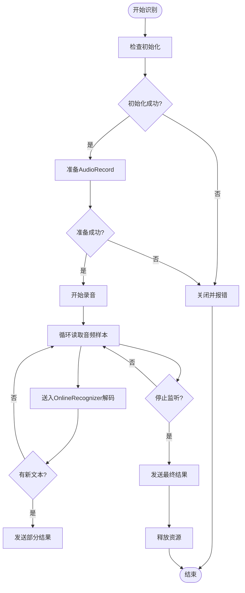
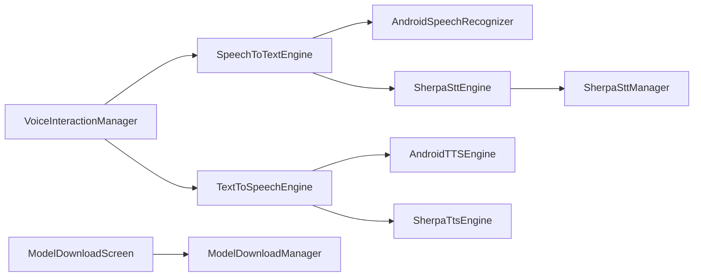

# 语音交互系统

<cite>
**本文引用的文件**
- [VoiceInteractionManager.kt](file://app/src/main/java/ai/openclaw/android/voice/VoiceInteractionManager.kt)
- [VoiceSession.kt](file://app/src/main/java/ai/openclaw/android/voice/VoiceSession.kt)
- [SpeechToTextEngine.kt](file://app/src/main/java/ai/openclaw/android/voice/stt/SpeechToTextEngine.kt)
- [AndroidSpeechRecognizer.kt](file://app/src/main/java/ai/openclaw/android/voice/stt/AndroidSpeechRecognizer.kt)
- [SherpaSttEngine.kt](file://app/src/main/java/ai/openclaw/android/voice/stt/SherpaSttEngine.kt)
- [SherpaSttManager.kt](file://app/src/main/java/ai/openclaw/android/voice/stt/SherpaSttManager.kt)
- [TextToSpeechEngine.kt](file://app/src/main/java/ai/openclaw/android/voice/tts/TextToSpeechEngine.kt)
- [AndroidTTSEngine.kt](file://app/src/main/java/ai/openclaw/android/voice/tts/AndroidTTSEngine.kt)
- [SherpaTtsEngine.kt](file://app/src/main/java/ai/openclaw/android/voice/tts/SherpaTtsEngine.kt)
- [ModelDownloadScreen.kt](file://app/src/main/java/ai/openclaw/android/voice/ui/ModelDownloadScreen.kt)
- [ModelDownloadManager.kt](file://app/src/main/java/ai/openclaw/android/voice/ModelDownloadManager.kt)
- [SHERPA_INTEGRATION.md](file://SHERPA_INTEGRATION.md)
- [download-sherpa-onnx.sh](file://scripts/download-sherpa-onnx.sh)
- [MainActivity.kt](file://app/src/main/java/ai/openclaw/android/MainActivity.kt)
</cite>

## 目录
1. [简介](#简介)
2. [项目结构](#项目结构)
3. [核心组件](#核心组件)
4. [架构总览](#架构总览)
5. [详细组件分析](#详细组件分析)
6. [依赖关系分析](#依赖关系分析)
7. [性能考虑](#性能考虑)
8. [故障排查指南](#故障排查指南)
9. [结论](#结论)
10. [附录](#附录)

## 简介
本文件面向语音交互系统的技术文档，围绕语音识别（STT）与语音合成（TTS）两大能力，系统阐述以下主题：
- STT引擎实现：Android原生SpeechRecognizer与Sherpa-ONNX在线识别的对比与集成
- TTS引擎实现：Android系统TTS与Sherpa-ONNX离线合成的对比与集成
- 引擎选择策略与运行时切换机制
- 语音会话管理的状态控制与音频处理细节
- STT/TTS模型的下载、校验与本地化部署
- 延迟优化与准确性提升策略
- 使用示例与调试指导
- 可扩展性与定制化能力

## 项目结构
语音相关模块集中于app/src/main/java/ai/openclaw/android/voice目录，采用“接口 + 多实现 + 管理器”的分层设计：
- 接口层：定义统一的STT/TTS接口与结果数据结构
- 实现层：Android原生与Sherpa-ONNX两种实现
- 管理层：引擎生命周期与模型路径管理
- UI层：模型下载界面与进度反馈
- 集成层：在主界面中以统一入口管理语音交互

**图表来源**
- [VoiceInteractionManager.kt:45-280](file://app/src/main/java/ai/openclaw/android/voice/VoiceInteractionManager.kt#L45-L280)
- [SpeechToTextEngine.kt:21-47](file://app/src/main/java/ai/openclaw/android/voice/stt/SpeechToTextEngine.kt#L21-L47)
- [AndroidSpeechRecognizer.kt:24-114](file://app/src/main/java/ai/openclaw/android/voice/stt/AndroidSpeechRecognizer.kt#L24-L114)
- [SherpaSttEngine.kt:20-234](file://app/src/main/java/ai/openclaw/android/voice/stt/SherpaSttEngine.kt#L20-L234)
- [SherpaSttManager.kt:22-124](file://app/src/main/java/ai/openclaw/android/voice/stt/SherpaSttManager.kt#L22-L124)
- [TextToSpeechEngine.kt:6-33](file://app/src/main/java/ai/openclaw/android/voice/tts/TextToSpeechEngine.kt#L6-L33)
- [AndroidTTSEngine.kt:16-89](file://app/src/main/java/ai/openclaw/android/voice/tts/AndroidTTSEngine.kt#L16-L89)
- [SherpaTtsEngine.kt:21-195](file://app/src/main/java/ai/openclaw/android/voice/tts/SherpaTtsEngine.kt#L21-L195)
- [ModelDownloadScreen.kt:26-271](file://app/src/main/java/ai/openclaw/android/voice/ui/ModelDownloadScreen.kt#L26-L271)
- [ModelDownloadManager.kt:25-316](file://app/src/main/java/ai/openclaw/android/voice/ModelDownloadManager.kt#L25-L316)

**章节来源**
- [VoiceInteractionManager.kt:45-280](file://app/src/main/java/ai/openclaw/android/voice/VoiceInteractionManager.kt#L45-L280)
- [ModelDownloadScreen.kt:26-271](file://app/src/main/java/ai/openclaw/android/voice/ui/ModelDownloadScreen.kt#L26-L271)
- [ModelDownloadManager.kt:25-316](file://app/src/main/java/ai/openclaw/android/voice/ModelDownloadManager.kt#L25-L316)

## 核心组件
- 统一入口：VoiceInteractionManager负责引擎初始化、状态管理、会话控制与引擎切换
- 会话状态：VoiceSession提供一次完整语音交互的有限状态机
- STT接口与实现：统一接口抽象，Android与Sherpa-ONNX两种实现
- TTS接口与实现：统一接口抽象，Android与Sherpa-ONNX两种实现
- 模型下载与校验：ModelDownloadManager提供断点续传、进度与完整性校验
- 下载UI：ModelDownloadScreen展示模型列表、下载进度与操作按钮

**章节来源**
- [VoiceSession.kt:16-78](file://app/src/main/java/ai/openclaw/android/voice/VoiceSession.kt#L16-L78)
- [SpeechToTextEngine.kt:21-47](file://app/src/main/java/ai/openclaw/android/voice/stt/SpeechToTextEngine.kt#L21-L47)
- [TextToSpeechEngine.kt:6-33](file://app/src/main/java/ai/openclaw/android/voice/tts/TextToSpeechEngine.kt#L6-L33)
- [ModelDownloadScreen.kt:26-271](file://app/src/main/java/ai/openclaw/android/voice/ui/ModelDownloadScreen.kt#L26-L271)
- [ModelDownloadManager.kt:25-316](file://app/src/main/java/ai/openclaw/android/voice/ModelDownloadManager.kt#L25-L316)

## 架构总览
系统采用“接口抽象 + 多实现 + 管理器 + UI”的架构，核心流程如下：
- 初始化阶段：优先尝试Sherpa-ONNX引擎（STT/TTS），若模型不可用则回退至Android原生引擎
- 会话阶段：通过VoiceSession驱动状态流转，VoiceInteractionManager统一调度
- 引擎切换：运行时可按需切换STT/TTS引擎，满足不同场景需求
- 模型管理：首次运行时通过ModelDownloadScreen引导下载，ModelDownloadManager负责下载与校验

**图表来源**
- [VoiceInteractionManager.kt:98-141](file://app/src/main/java/ai/openclaw/android/voice/VoiceInteractionManager.kt#L98-L141)
- [VoiceInteractionManager.kt:155-188](file://app/src/main/java/ai/openclaw/android/voice/VoiceInteractionManager.kt#L155-L188)
- [AndroidSpeechRecognizer.kt:31-92](file://app/src/main/java/ai/openclaw/android/voice/stt/AndroidSpeechRecognizer.kt#L31-L92)
- [AndroidTTSEngine.kt:52-66](file://app/src/main/java/ai/openclaw/android/voice/tts/AndroidTTSEngine.kt#L52-L66)

## 详细组件分析

### 统一入口：VoiceInteractionManager
- 职责
  - 引擎初始化：优先Sherpa-ONNX，失败回退Android
  - 会话控制：开始/停止监听，状态与文本流管理
  - 引擎切换：运行时切换STT/TTS引擎
  - 资源释放：销毁时释放Sherpa与Android引擎资源
- 关键点
  - 使用协程与Flow进行异步与流式处理
  - 内部持有多个引擎实例，按需切换
  - 提供状态流与文本流，便于UI订阅

**图表来源**
- [VoiceInteractionManager.kt:45-280](file://app/src/main/java/ai/openclaw/android/voice/VoiceInteractionManager.kt#L45-L280)

**章节来源**
- [VoiceInteractionManager.kt:98-141](file://app/src/main/java/ai/openclaw/android/voice/VoiceInteractionManager.kt#L98-L141)
- [VoiceInteractionManager.kt:155-200](file://app/src/main/java/ai/openclaw/android/voice/VoiceInteractionManager.kt#L155-L200)
- [VoiceInteractionManager.kt:224-269](file://app/src/main/java/ai/openclaw/android/voice/VoiceInteractionManager.kt#L224-L269)

### 会话状态：VoiceSession
- 状态机定义：Idle → Listening → Processing → Speaking → Idle
- 作用：封装一次完整语音交互的生命周期，确保状态有序流转
- 数据：转写文本、响应文本、错误状态等

**图表来源**
- [VoiceSession.kt:16-78](file://app/src/main/java/ai/openclaw/android/voice/VoiceSession.kt#L16-L78)

**章节来源**
- [VoiceSession.kt:26-78](file://app/src/main/java/ai/openclaw/android/voice/VoiceSession.kt#L26-L78)

### STT接口与实现

#### 接口：SpeechToTextEngine
- 能力：开始/停止监听；流式返回识别结果（部分/最终）
- 可用性检测：isSpeechRecognitionAvailable用于判断系统是否具备识别服务

**章节来源**
- [SpeechToTextEngine.kt:13-19](file://app/src/main/java/ai/openclaw/android/voice/stt/SpeechToTextEngine.kt#L13-L19)
- [SpeechToTextEngine.kt:21-47](file://app/src/main/java/ai/openclaw/android/voice/stt/SpeechToTextEngine.kt#L21-L47)

#### 实现A：AndroidSpeechRecognizer
- 特点：基于Android原生SpeechRecognizer，需主线程创建实例
- 行为：开启识别后回调部分/最终结果，错误码映射
- 适用：系统具备识别服务的设备

**章节来源**
- [AndroidSpeechRecognizer.kt:24-114](file://app/src/main/java/ai/openclaw/android/voice/stt/AndroidSpeechRecognizer.kt#L24-L114)

#### 实现B：SherpaSttEngine
- 特点：基于Sherpa-ONNX在线识别，本地推理，支持多模型类型
- 配置：特征参数、端点检测规则、解码策略、线程数等
- 音频采集：AudioRecord采集PCM，按采样率与缓冲区大小读取
- 模型检测：根据模型目录文件存在性自动识别模型类型

**图表来源**
- [SherpaSttEngine.kt:55-107](file://app/src/main/java/ai/openclaw/android/voice/stt/SherpaSttEngine.kt#L55-L107)

**章节来源**
- [SherpaSttEngine.kt:20-234](file://app/src/main/java/ai/openclaw/android/voice/stt/SherpaSttEngine.kt#L20-L234)

#### 管理器：SherpaSttManager
- 职责：单例管理SherpaSttEngine生命周期，懒加载与预初始化
- 路径：默认模型路径位于外部存储，支持自定义路径
- 能力：检查模型是否存在、释放引擎

**章节来源**
- [SherpaSttManager.kt:22-124](file://app/src/main/java/ai/openclaw/android/voice/stt/SherpaSttManager.kt#L22-L124)

### TTS接口与实现

#### 接口：TextToSpeechEngine
- 能力：同步朗读文本、停止、查询是否正在朗读、设置语音参数
- 语音配置：语言、语速、音高

**章节来源**
- [TextToSpeechEngine.kt:6-33](file://app/src/main/java/ai/openclaw/android/voice/tts/TextToSpeechEngine.kt#L6-L33)

#### 实现A：AndroidTTSEngine
- 特点：基于Android系统TTS，需初始化后方可使用
- 行为：等待引擎就绪、设置语音参数、朗读与停止
- 适用：系统TTS可用的设备

**章节来源**
- [AndroidTTSEngine.kt:16-89](file://app/src/main/java/ai/openclaw/android/voice/tts/AndroidTTSEngine.kt#L16-L89)

#### 实现B：SherpaTtsEngine
- 特点：基于Sherpa-ONNX离线TTS，支持VITS/Melo等模型
- 音频播放：AudioTrack流式播放浮点样本
- 配置：模型配置、线程数、Provider等
- 能力：初始化、释放、停止、查询是否正在朗读、设置语音参数

**章节来源**
- [SherpaTtsEngine.kt:21-195](file://app/src/main/java/ai/openclaw/android/voice/tts/SherpaTtsEngine.kt#L21-L195)

### 模型下载与UI

#### ModelDownloadManager
- 功能：模型下载（断点续传）、解压（tar.bz2）、完整性校验、删除
- 存储：默认外部存储，避免占用应用内部空间
- 状态：下载中/提取中/校验中/完成/失败

**章节来源**
- [ModelDownloadManager.kt:25-316](file://app/src/main/java/ai/openclaw/android/voice/ModelDownloadManager.kt#L25-L316)

#### ModelDownloadScreen
- 功能：展示可用模型、下载进度、WiFi提示、删除操作
- 体验：首次运行时引导下载，完成后回调通知

**章节来源**
- [ModelDownloadScreen.kt:26-271](file://app/src/main/java/ai/openclaw/android/voice/ui/ModelDownloadScreen.kt#L26-L271)

## 依赖关系分析
- 引擎选择与初始化
  - VoiceInteractionManager在初始化时优先尝试Sherpa-ONNX，若失败则回退Android原生
  - STT/TTS分别独立选择，互不影响
- 引擎切换
  - 运行时可通过方法切换STT/TTS引擎，满足不同场景需求
- 模型路径
  - 默认模型路径位于外部存储，支持自定义路径
- UI与业务
  - MainActivity中通过VoiceInteractionManager统一接入语音功能，并在音量键长按场景触发

**图表来源**
- [VoiceInteractionManager.kt:98-141](file://app/src/main/java/ai/openclaw/android/voice/VoiceInteractionManager.kt#L98-L141)
- [SherpaSttManager.kt:60-82](file://app/src/main/java/ai/openclaw/android/voice/stt/SherpaSttManager.kt#L60-L82)
- [ModelDownloadScreen.kt:30-51](file://app/src/main/java/ai/openclaw/android/voice/ui/ModelDownloadScreen.kt#L30-L51)

**章节来源**
- [VoiceInteractionManager.kt:98-141](file://app/src/main/java/ai/openclaw/android/voice/VoiceInteractionManager.kt#L98-L141)
- [SherpaSttManager.kt:60-82](file://app/src/main/java/ai/openclaw/android/voice/stt/SherpaSttManager.kt#L60-L82)
- [MainActivity.kt:251-263](file://app/src/main/java/ai/openclaw/android/MainActivity.kt#L251-L263)

## 性能考虑
- 延迟优化
  - STT：Sherpa-ONNX采用流式解码与端点检测，减少等待时间；Android原生依赖网络，延迟受网络影响
  - TTS：Sherpa-ONNX离线合成，避免网络往返；Android系统TTS可能受系统负载影响
  - 音频缓冲：Sherpa-ONNX按采样率与缓冲区大小读取，避免过小导致频繁阻塞
- 准确性提升
  - 选择更高质量模型（如双语Paraformer）可提升识别准确率
  - 适当调整端点检测规则与解码参数可改善稳定性
- 资源管理
  - 及时释放AudioRecord与AudioTrack，避免资源泄漏
  - 初始化与销毁时清理Sherpa-ONNX与Android引擎资源

[本节为通用性能讨论，不直接分析具体文件]

## 故障排查指南
- 初始化失败
  - STT：检查模型目录是否存在、Sherpa-ONNX AAR是否正确引入
  - TTS：确认模型文件完整性与路径正确
- 运行时错误
  - Android原生：检查识别服务是否可用、权限是否授予
  - Sherpa-ONNX：查看日志输出，确认初始化与音频采集是否成功
- 下载问题
  - 检查网络连通性、存储空间与外部存储权限
  - 断点续传与完整性校验失败时，重新下载或删除后重试

**章节来源**
- [AndroidSpeechRecognizer.kt:101-112](file://app/src/main/java/ai/openclaw/android/voice/stt/AndroidSpeechRecognizer.kt#L101-L112)
- [SherpaSttEngine.kt:37-51](file://app/src/main/java/ai/openclaw/android/voice/stt/SherpaSttEngine.kt#L37-L51)
- [SherpaTtsEngine.kt:37-52](file://app/src/main/java/ai/openclaw/android/voice/tts/SherpaTtsEngine.kt#L37-L52)
- [ModelDownloadManager.kt:156-263](file://app/src/main/java/ai/openclaw/android/voice/ModelDownloadManager.kt#L156-L263)

## 结论
本语音交互系统通过统一入口与接口抽象，实现了STT/TTS双引擎并存与动态切换，既保证了在无Google服务设备上的可用性，又提供了高质量的本地化语音能力。结合完善的模型下载与校验机制，系统在易用性、可扩展性与定制化方面具备良好基础。

[本节为总结性内容，不直接分析具体文件]

## 附录

### 使用示例与调试指导
- 在MainActivity中，通过VoiceInteractionManager统一接入语音功能
  - 初始化：传入模型路径后调用initialize
  - 开始监听：收集startListening返回的Flow以获取实时转写
  - 停止监听：调用stopListening并取消收集
  - 朗读：调用speak(text)
- 音量键长按触发语音输入：在dispatchKeyEvent中拦截音量键，按住触发开始，松开触发停止并弹出确认框
- 调试要点：关注日志输出、权限状态、模型路径与下载状态

**章节来源**
- [MainActivity.kt:199-207](file://app/src/main/java/ai/openclaw/android/MainActivity.kt#L199-L207)
- [MainActivity.kt:528-596](file://app/src/main/java/ai/openclaw/android/MainActivity.kt#L528-L596)
- [VoiceInteractionManager.kt:98-141](file://app/src/main/java/ai/openclaw/android/voice/VoiceInteractionManager.kt#L98-L141)
- [VoiceInteractionManager.kt:155-188](file://app/src/main/java/ai/openclaw/android/voice/VoiceInteractionManager.kt#L155-L188)

### 引擎选择策略与切换机制
- 初始化策略
  - STT：优先Sherpa-ONNX，若模型存在则使用；否则检查系统可用性，可用则回退Android
  - TTS：优先Sherpa-ONNX，若模型存在则使用；否则回退Android系统TTS
- 运行时切换
  - 提供switchToSherpaStt/switchToAndroidStt与switchToSherpaTts/switchToAndroidTts方法
  - 切换后立即生效，适用于不同场景下的性能与质量权衡

**章节来源**
- [VoiceInteractionManager.kt:98-141](file://app/src/main/java/ai/openclaw/android/voice/VoiceInteractionManager.kt#L98-L141)
- [VoiceInteractionManager.kt:224-269](file://app/src/main/java/ai/openclaw/android/voice/VoiceInteractionManager.kt#L224-L269)
- [SHERPA_INTEGRATION.md:106-136](file://SHERPA_INTEGRATION.md#L106-L136)

### STT/TTS模型集成与部署
- 模型类型
  - STT：Zipformer zh-14M、Streaming Paraformer Bilingual
  - TTS：VITS/Melo TTS
- 部署方式
  - 通过ModelDownloadScreen引导下载，或手动放置至默认模型目录
  - 使用download-sherpa-onnx.sh脚本下载Sherpa-ONNX AAR

**章节来源**
- [SHERPA_INTEGRATION.md:55-86](file://SHERPA_INTEGRATION.md#L55-L86)
- [download-sherpa-onnx.sh:19-63](file://scripts/download-sherpa-onnx.sh#L19-L63)
- [ModelDownloadManager.kt:72-124](file://app/src/main/java/ai/openclaw/android/voice/ModelDownloadManager.kt#L72-L124)