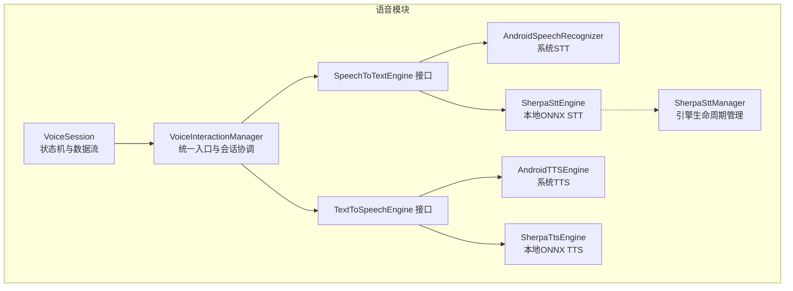
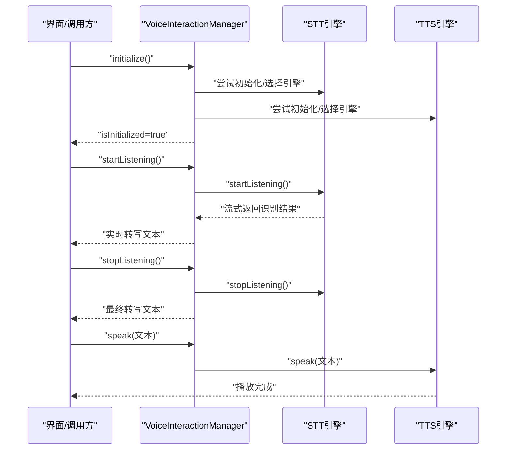
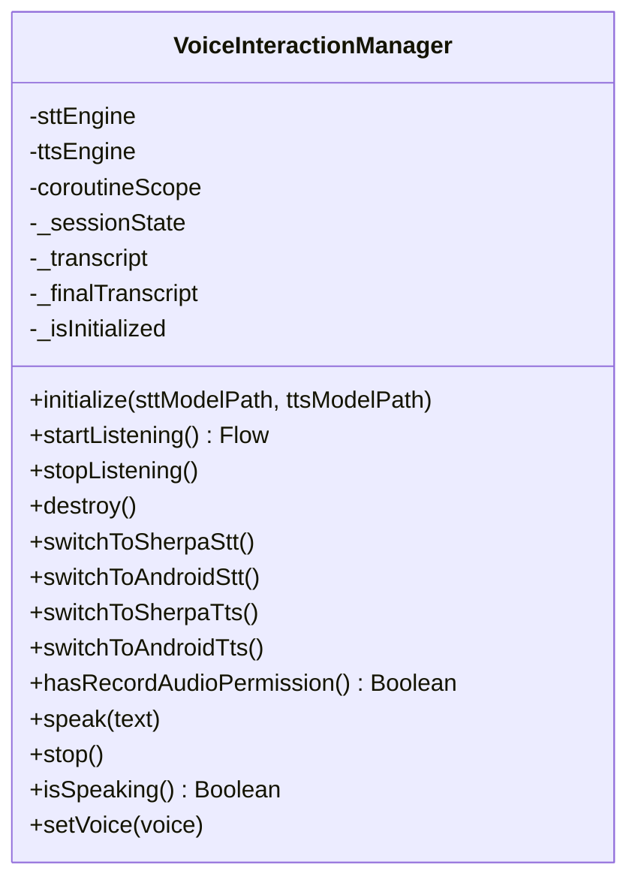
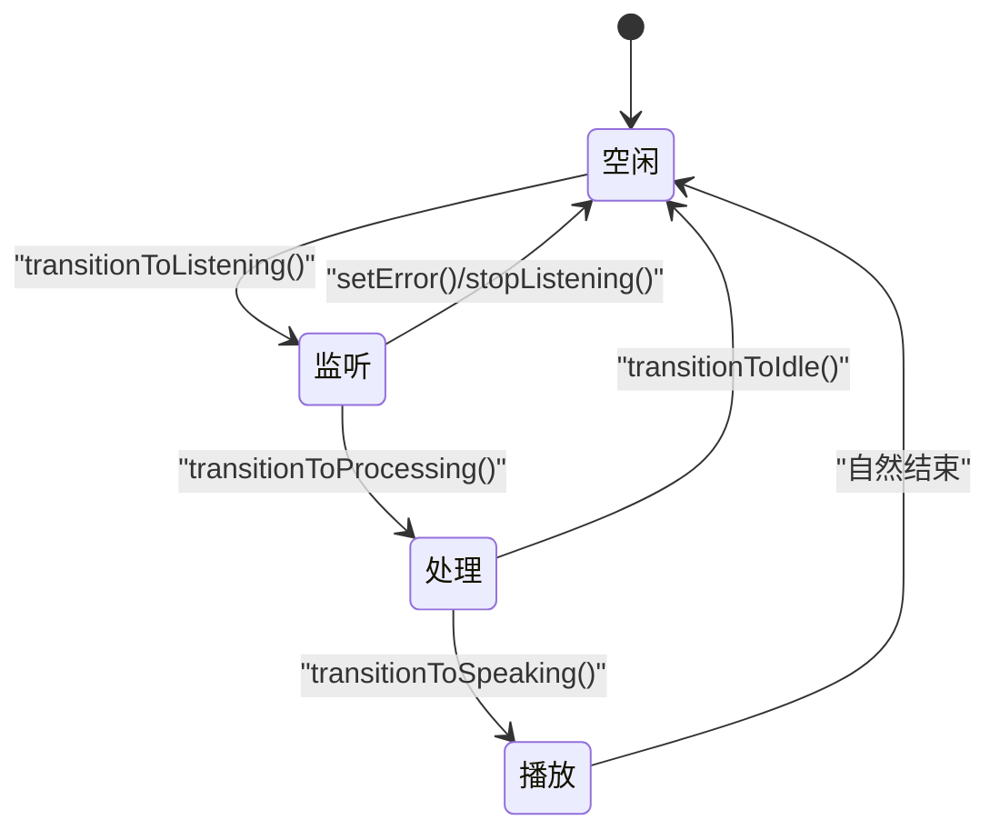
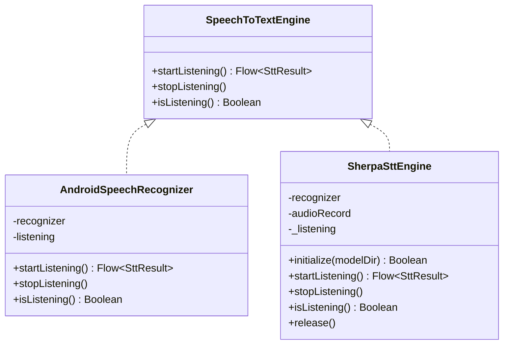
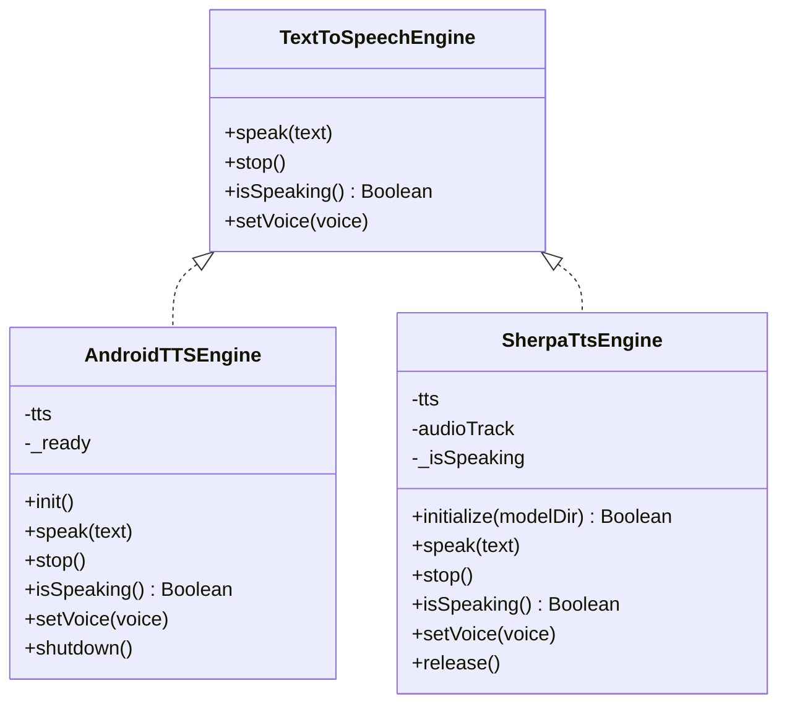
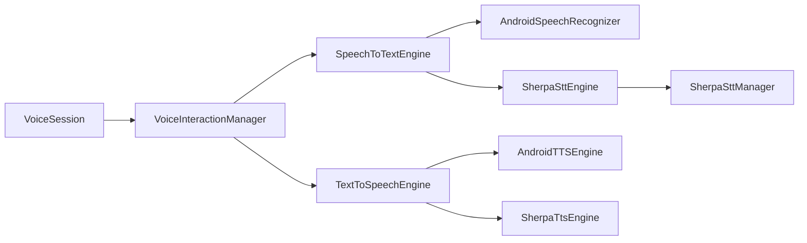

# 语音会话管理

<cite>
**本文引用的文件**
- [VoiceInteractionManager.kt](file://app/src/main/java/ai/openclaw/android/voice/VoiceInteractionManager.kt)
- [VoiceSession.kt](file://app/src/main/java/ai/openclaw/android/voice/VoiceSession.kt)
- [SpeechToTextEngine.kt](file://app/src/main/java/ai/openclaw/android/voice/stt/SpeechToTextEngine.kt)
- [AndroidSpeechRecognizer.kt](file://app/src/main/java/ai/openclaw/android/voice/stt/AndroidSpeechRecognizer.kt)
- [SherpaSttEngine.kt](file://app/src/main/java/ai/openclaw/android/voice/stt/SherpaSttEngine.kt)
- [SherpaSttManager.kt](file://app/src/main/java/ai/openclaw/android/voice/stt/SherpaSttManager.kt)
- [TextToSpeechEngine.kt](file://app/src/main/java/ai/openclaw/android/voice/tts/TextToSpeechEngine.kt)
- [AndroidTTSEngine.kt](file://app/src/main/java/ai/openclaw/android/voice/tts/AndroidTTSEngine.kt)
- [SherpaTtsEngine.kt](file://app/src/main/java/ai/openclaw/android/voice/tts/SherpaTtsEngine.kt)
- [2026-04-06-session-mechanism-design.md](file://docs/plans/2026-04-06-session-mechanism-design.md)
- [MainActivity.kt](file://app/src/main/java/ai/openclaw/android/MainActivity.kt)
</cite>

## 目录
1. [引言](#引言)
2. [项目结构](#项目结构)
3. [核心组件](#核心组件)
4. [架构总览](#架构总览)
5. [详细组件分析](#详细组件分析)
6. [依赖关系分析](#依赖关系分析)
7. [性能考量](#性能考量)
8. [故障排查指南](#故障排查指南)
9. [结论](#结论)
10. [附录](#附录)

## 引言
本文件面向语音会话管理系统，聚焦以下目标：
- 深入解释语音会话的状态机设计与生命周期管理
- 详述 VoiceInteractionManager 的会话协调机制与资源调度
- 阐明 VoiceSession 的数据结构与状态转换逻辑
- 解释并发控制与线程安全保障
- 提供会话超时与异常恢复策略
- 给出监控指标与性能分析方法
- 说明会话数据的持久化与恢复机制
- 解释语音会话与其他系统组件的集成接口

## 项目结构
语音能力位于 app/src/main/java/ai/openclaw/android/voice 下，分为 STT、TTS 两套引擎实现，以及统一入口的 VoiceInteractionManager 和会话状态机 VoiceSession。文档还引用了会话持久化与压缩的设计说明。

图表来源
- [VoiceInteractionManager.kt:45-280](file://app/src/main/java/ai/openclaw/android/voice/VoiceInteractionManager.kt#L45-L280)
- [VoiceSession.kt:26-78](file://app/src/main/java/ai/openclaw/android/voice/VoiceSession.kt#L26-L78)
- [SpeechToTextEngine.kt:21-47](file://app/src/main/java/ai/openclaw/android/voice/stt/SpeechToTextEngine.kt#L21-L47)
- [AndroidSpeechRecognizer.kt:24-114](file://app/src/main/java/ai/openclaw/android/voice/stt/AndroidSpeechRecognizer.kt#L24-L114)
- [SherpaSttEngine.kt:20-234](file://app/src/main/java/ai/openclaw/android/voice/stt/SherpaSttEngine.kt#L20-L234)
- [SherpaSttManager.kt:22-124](file://app/src/main/java/ai/openclaw/android/voice/stt/SherpaSttManager.kt#L22-L124)
- [TextToSpeechEngine.kt:6-33](file://app/src/main/java/ai/openclaw/android/voice/tts/TextToSpeechEngine.kt#L6-L33)
- [AndroidTTSEngine.kt:16-89](file://app/src/main/java/ai/openclaw/android/voice/tts/AndroidTTSEngine.kt#L16-L89)
- [SherpaTtsEngine.kt:21-195](file://app/src/main/java/ai/openclaw/android/voice/tts/SherpaTtsEngine.kt#L21-L195)

章节来源
- [VoiceInteractionManager.kt:1-280](file://app/src/main/java/ai/openclaw/android/voice/VoiceInteractionManager.kt#L1-L280)
- [VoiceSession.kt:1-78](file://app/src/main/java/ai/openclaw/android/voice/VoiceSession.kt#L1-L78)

## 核心组件
- VoiceInteractionManager：统一入口，负责 STT/TTS 初始化、引擎选择与切换、会话生命周期控制、权限检查、资源释放与状态暴露。
- VoiceSession：独立于 UI 的状态机，描述一次“听-处理-说”的完整交互循环。
- STT 接口与实现：抽象接口定义流式识别行为；系统 AndroidSpeechRecognizer 与本地 Sherpa-ONNX SherpaSttEngine 两种实现。
- TTS 接口与实现：抽象接口定义语音播放行为；系统 AndroidTTSEngine 与本地 Sherpa-ONNX SherpaTtsEngine 两种实现。
- SherpaSttManager：Sherpa STT 引擎的生命周期管理器，支持懒加载、预初始化、模型路径管理与释放。

章节来源
- [VoiceInteractionManager.kt:45-280](file://app/src/main/java/ai/openclaw/android/voice/VoiceInteractionManager.kt#L45-L280)
- [VoiceSession.kt:16-78](file://app/src/main/java/ai/openclaw/android/voice/VoiceSession.kt#L16-L78)
- [SpeechToTextEngine.kt:21-47](file://app/src/main/java/ai/openclaw/android/voice/stt/SpeechToTextEngine.kt#L21-L47)
- [AndroidSpeechRecognizer.kt:24-114](file://app/src/main/java/ai/openclaw/android/voice/stt/AndroidSpeechRecognizer.kt#L24-L114)
- [SherpaSttEngine.kt:20-234](file://app/src/main/java/ai/openclaw/android/voice/stt/SherpaSttEngine.kt#L20-L234)
- [SherpaSttManager.kt:22-124](file://app/src/main/java/ai/openclaw/android/voice/stt/SherpaSttManager.kt#L22-L124)
- [TextToSpeechEngine.kt:6-33](file://app/src/main/java/ai/openclaw/android/voice/tts/TextToSpeechEngine.kt#L6-L33)
- [AndroidTTSEngine.kt:16-89](file://app/src/main/java/ai/openclaw/android/voice/tts/AndroidTTSEngine.kt#L16-L89)
- [SherpaTtsEngine.kt:21-195](file://app/src/main/java/ai/openclaw/android/voice/tts/SherpaTtsEngine.kt#L21-L195)

## 架构总览
语音交互采用“统一入口 + 双引擎 + 状态机”的分层设计：
- 统一入口：VoiceInteractionManager 负责初始化、引擎选择、会话控制与资源回收。
- 引擎层：STT/TTS 各自通过接口抽象，支持系统与本地两种实现，具备可插拔与热切换能力。
- 会话层：VoiceSession 以状态机形式表达一次交互的生命周期，便于 UI 与业务逻辑解耦。
- 持久化与上下文：会话机制设计文档定义了基于 SQLite/Room 的长期持久会话、分层压缩与摘要存储方案，为后续扩展提供依据。

图表来源
- [VoiceInteractionManager.kt:98-141](file://app/src/main/java/ai/openclaw/android/voice/VoiceInteractionManager.kt#L98-L141)
- [VoiceInteractionManager.kt:155-188](file://app/src/main/java/ai/openclaw/android/voice/VoiceInteractionManager.kt#L155-L188)
- [VoiceInteractionManager.kt:203-221](file://app/src/main/java/ai/openclaw/android/voice/VoiceInteractionManager.kt#L203-L221)
- [SpeechToTextEngine.kt:27-34](file://app/src/main/java/ai/openclaw/android/voice/stt/SpeechToTextEngine.kt#L27-L34)
- [TextToSpeechEngine.kt:10-10](file://app/src/main/java/ai/openclaw/android/voice/tts/TextToSpeechEngine.kt#L10-L10)

## 详细组件分析

### VoiceInteractionManager：会话协调与资源调度
- 初始化与引擎选择
  - 支持优先使用本地 Sherpa-ONNX STT/TTS，若不可用则回退至系统引擎。
  - 初始化过程在 IO 协程调度，避免阻塞主线程。
- 会话生命周期
  - startListening：重置转写缓存，进入 Listening 状态，返回识别流；流完成后回到 Idle。
  - stopListening：停止当前识别，取消会话任务，复位状态。
  - destroy：释放所有资源，包括引擎与管理器实例，标记未初始化。
- 引擎切换
  - 提供 STT/TTS 的动态切换接口，支持指定模型路径或回退到系统引擎。
- 状态与数据
  - 暴露 sessionState、transcript、finalTranscript、isInitialized 等状态流，便于 UI 订阅。
  - 提供 activeSttEngine/activeTtsEngine 用于诊断当前引擎。

图表来源
- [VoiceInteractionManager.kt:45-280](file://app/src/main/java/ai/openclaw/android/voice/VoiceInteractionManager.kt#L45-L280)

章节来源
- [VoiceInteractionManager.kt:98-141](file://app/src/main/java/ai/openclaw/android/voice/VoiceInteractionManager.kt#L98-L141)
- [VoiceInteractionManager.kt:155-188](file://app/src/main/java/ai/openclaw/android/voice/VoiceInteractionManager.kt#L155-L188)
- [VoiceInteractionManager.kt:191-200](file://app/src/main/java/ai/openclaw/android/voice/VoiceInteractionManager.kt#L191-L200)
- [VoiceInteractionManager.kt:224-269](file://app/src/main/java/ai/openclaw/android/voice/VoiceInteractionManager.kt#L224-L269)

### VoiceSession：状态机与数据结构
- 状态机
  - Idle → Listening → Processing → Speaking → Idle，支持错误回退到 Idle。
- 数据流
  - transcript：当前识别文本（可能为部分结果）。
  - responseText：正在播报的回复文本。
  - error：错误对象，触发后回退到 Idle。
- 线程安全
  - 使用协程状态流，内部通过检查确保状态转换合法性，避免竞态。

图表来源
- [VoiceSession.kt:16-78](file://app/src/main/java/ai/openclaw/android/voice/VoiceSession.kt#L16-L78)

章节来源
- [VoiceSession.kt:26-78](file://app/src/main/java/ai/openclaw/android/voice/VoiceSession.kt#L26-L78)

### STT 引擎：接口与实现
- 接口契约
  - startListening 返回识别流，支持部分与最终结果；stopListening 停止识别；isListening 查询状态。
- AndroidSpeechRecognizer
  - 在主线程创建 SpeechRecognizer，每次识别新建实例，避免状态泄漏。
  - 支持部分结果与最终结果回调，错误码映射便于诊断。
- SherpaSttEngine
  - 基于 Sherpa-ONNX 的本地识别，支持多种模型类型与端点检测配置。
  - 通过 AudioRecord 实时采集音频，流式解码并产出部分/最终文本。

图表来源
- [SpeechToTextEngine.kt:21-47](file://app/src/main/java/ai/openclaw/android/voice/stt/SpeechToTextEngine.kt#L21-L47)
- [AndroidSpeechRecognizer.kt:24-114](file://app/src/main/java/ai/openclaw/android/voice/stt/AndroidSpeechRecognizer.kt#L24-L114)
- [SherpaSttEngine.kt:20-234](file://app/src/main/java/ai/openclaw/android/voice/stt/SherpaSttEngine.kt#L20-L234)

章节来源
- [SpeechToTextEngine.kt:13-47](file://app/src/main/java/ai/openclaw/android/voice/stt/SpeechToTextEngine.kt#L13-L47)
- [AndroidSpeechRecognizer.kt:31-92](file://app/src/main/java/ai/openclaw/android/voice/stt/AndroidSpeechRecognizer.kt#L31-L92)
- [SherpaSttEngine.kt:36-122](file://app/src/main/java/ai/openclaw/android/voice/stt/SherpaSttEngine.kt#L36-L122)

### TTS 引擎：接口与实现
- 接口契约
  - speak 播放文本，suspend 至完成或被 stop 中断；stop 立即停止；isSpeaking 查询状态；setVoice 设置语音参数。
- AndroidTTSEngine
  - 通过 TextToSpeech 初始化，init 等待就绪；speak 使用 UtteranceProgressListener 监听完成；支持设置语言、语速、音调。
- SherpaTtsEngine
  - 基于 Sherpa-ONNX 的本地合成，使用 AudioTrack 播放浮点采样；支持 VITS/Melo 等模型配置。

图表来源
- [TextToSpeechEngine.kt:6-33](file://app/src/main/java/ai/openclaw/android/voice/tts/TextToSpeechEngine.kt#L6-L33)
- [AndroidTTSEngine.kt:16-89](file://app/src/main/java/ai/openclaw/android/voice/tts/AndroidTTSEngine.kt#L16-L89)
- [SherpaTtsEngine.kt:21-195](file://app/src/main/java/ai/openclaw/android/voice/tts/SherpaTtsEngine.kt#L21-L195)

章节来源
- [TextToSpeechEngine.kt:6-33](file://app/src/main/java/ai/openclaw/android/voice/tts/TextToSpeechEngine.kt#L6-L33)
- [AndroidTTSEngine.kt:40-87](file://app/src/main/java/ai/openclaw/android/voice/tts/AndroidTTSEngine.kt#L40-L87)
- [SherpaTtsEngine.kt:36-107](file://app/src/main/java/ai/openclaw/android/voice/tts/SherpaTtsEngine.kt#L36-L107)

### SherpaSttManager：引擎生命周期管理
- 单例管理：getInstance 提供线程安全的单例，支持清除实例。
- 懒加载与预初始化：getEngine 首次使用时初始化；preInitialize 可提前准备。
- 模型路径：defaultModelPath 自动选择外部或内部存储目录。
- 释放：release 释放引擎与资源，便于内存回收与切换。

章节来源
- [SherpaSttManager.kt:34-124](file://app/src/main/java/ai/openclaw/android/voice/stt/SherpaSttManager.kt#L34-L124)

### 会话持久化与恢复机制（设计说明）
- 长期持久会话：支持命名会话与默认会话，记录创建时间、最后活跃时间、token 数与状态。
- 分层压缩：当 token 超阈值时，保留最近若干条消息，其余压缩为摘要并删除，降低上下文成本。
- 存储方案：SQLite/Room，包含 sessions、messages、summaries 表。
- 管理器：HybridSessionManager 负责初始化、消息添加、上下文获取、压缩与会话切换。
- Token 计数与预算：提供粗估与精确计数策略，合理分配上下文预算。
- 错误处理：涵盖数据库错误、压缩失败、Token 硬限制、应用重启恢复等场景。

章节来源
- [2026-04-06-session-mechanism-design.md:20-124](file://docs/plans/2026-04-06-session-mechanism-design.md#L20-L124)
- [2026-04-06-session-mechanism-design.md:61-91](file://docs/plans/2026-04-06-session-mechanism-design.md#L61-L91)
- [2026-04-06-session-mechanism-design.md:128-146](file://docs/plans/2026-04-06-session-mechanism-design.md#L128-L146)
- [2026-04-06-session-mechanism-design.md:200-219](file://docs/plans/2026-04-06-session-mechanism-design.md#L200-L219)

### 与系统组件的集成接口
- MainActivity 对音量键长按进行拦截，触发语音输入流程，体现与系统输入事件的集成。
- VoiceInteractionManager 通过权限检查与引擎初始化，确保在系统服务/Activity 生命周期内正确工作。

章节来源
- [MainActivity.kt:166-200](file://app/src/main/java/ai/openclaw/android/MainActivity.kt#L166-L200)
- [VoiceInteractionManager.kt:144-147](file://app/src/main/java/ai/openclaw/android/voice/VoiceInteractionManager.kt#L144-L147)

## 依赖关系分析
- 组件耦合
  - VoiceInteractionManager 依赖 STT/TTS 接口与具体实现，通过接口隔离实现细节。
  - SherpaSttManager 与 SherpaSttEngine 解耦，便于生命周期管理与资源回收。
- 外部依赖
  - STT/TTS 引擎依赖系统服务或本地 ONNX 运行时，需注意权限与模型路径。
- 潜在环路
  - 当前结构无明显循环依赖；状态机 VoiceSession 仅依赖状态流，不反向依赖管理器。

图表来源
- [VoiceInteractionManager.kt:45-280](file://app/src/main/java/ai/openclaw/android/voice/VoiceInteractionManager.kt#L45-L280)
- [VoiceSession.kt:26-78](file://app/src/main/java/ai/openclaw/android/voice/VoiceSession.kt#L26-L78)
- [SherpaSttManager.kt:22-124](file://app/src/main/java/ai/openclaw/android/voice/stt/SherpaSttManager.kt#L22-L124)

## 性能考量
- 流式处理
  - STT 采用 channelFlow 与协程流，边录边识，降低端到端延迟。
- 线程调度
  - 初始化与识别分别在 IO/Main 线程执行，避免阻塞 UI。
- 本地推理
  - Sherpa 引擎本地化部署，减少网络抖动影响，但需关注 CPU/内存占用。
- 采样与缓冲
  - SherpaSttEngine 使用固定采样率与缓冲区大小，平衡实时性与资源消耗。
- 建议
  - 在高负载设备上适当降低线程数与采样率；对频繁切换场景增加预初始化策略。

## 故障排查指南
- 无法初始化 STT/TTS
  - 检查模型路径是否存在；确认 hasRecordAudioPermission；必要时回退到系统引擎。
- 识别无结果或静音
  - AndroidSpeechRecognizer 将在无匹配或超时时优雅关闭流；检查麦克风权限与设备可用性。
- 识别错误码
  - AndroidSpeechRecognizer 提供错误码映射，定位网络、音频、客户端等问题。
- 会话异常
  - VoiceSession 的状态转换检查可帮助定位非法调用；setError 会回退到空闲状态。
- 资源泄漏
  - 确保在 Activity/Service 销毁时调用 destroy 或 stopListening；Sherpa 引擎需 release。

章节来源
- [VoiceInteractionManager.kt:144-147](file://app/src/main/java/ai/openclaw/android/voice/VoiceInteractionManager.kt#L144-L147)
- [AndroidSpeechRecognizer.kt:72-80](file://app/src/main/java/ai/openclaw/android/voice/stt/AndroidSpeechRecognizer.kt#L72-L80)
- [VoiceSession.kt:44-76](file://app/src/main/java/ai/openclaw/android/voice/VoiceSession.kt#L44-L76)
- [SherpaSttEngine.kt:109-114](file://app/src/main/java/ai/openclaw/android/voice/stt/SherpaSttEngine.kt#L109-L114)

## 结论
本系统以 VoiceInteractionManager 为核心，结合 STT/TTS 双引擎与 VoiceSession 状态机，实现了可插拔、可切换、可扩展的语音会话框架。配合会话持久化与压缩设计，可在保证实时性的前提下维持长期对话的上下文有效性。通过权限检查、错误处理与资源回收机制，系统具备良好的稳定性与可维护性。

## 附录
- 监控指标建议
  - STT：识别延迟、最终文本耗时、错误率、端点检测命中率。
  - TTS：首字节延迟、播放时长、中断次数、音频质量（采样率/通道）。
  - 会话：平均 token 使用率、压缩触发频率、摘要长度分布。
- 性能分析方法
  - 使用 systrace/Perfetto 分析主线程阻塞；使用 MethodTracing 定位热点；结合日志统计关键路径耗时。
- 会话超时与异常恢复
  - 识别超时由引擎内部处理；应用层在 UI 层面提供“长按取消”与“松手发送”策略；异常时回退到空闲状态并提示用户重试。