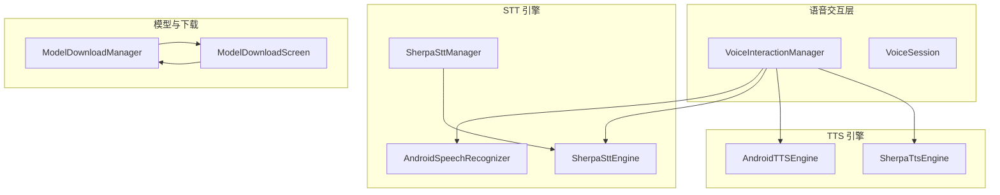
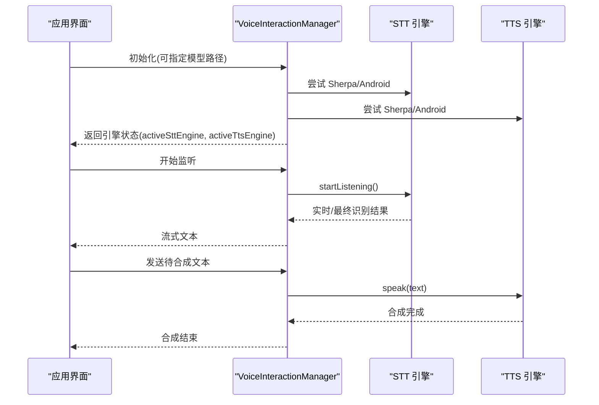
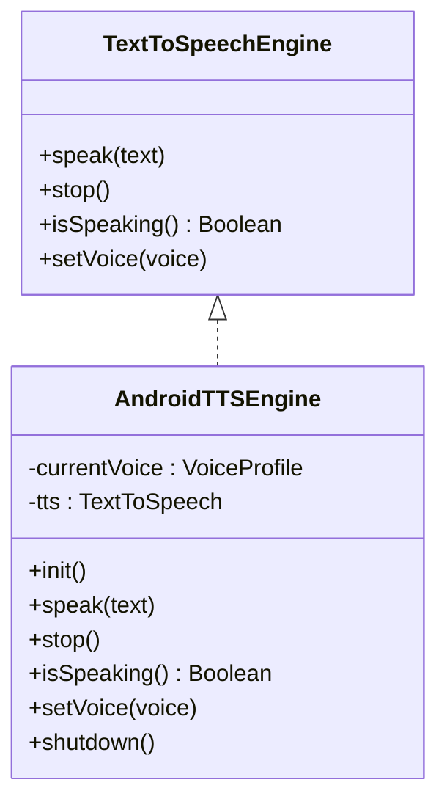
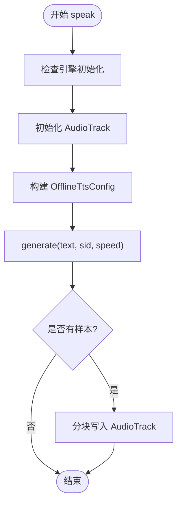
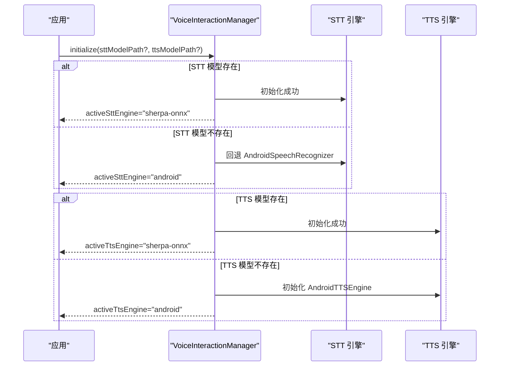
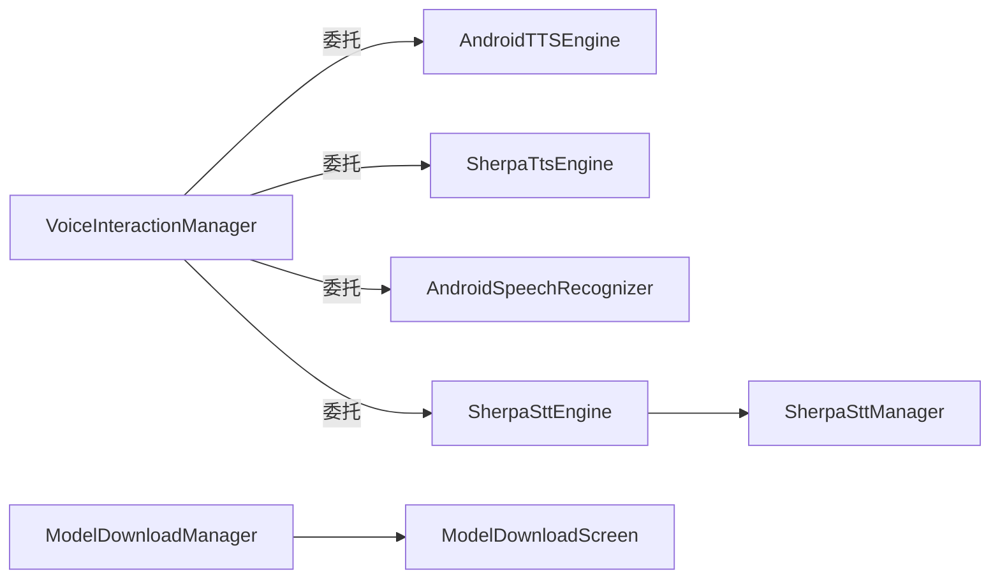

# 语音合成系统

<cite>
**本文引用的文件**
- [AndroidTTSEngine.kt](file://app/src/main/java/ai/openclaw/android/voice/tts/AndroidTTSEngine.kt)
- [SherpaTtsEngine.kt](file://app/src/main/java/ai/openclaw/android/voice/tts/SherpaTtsEngine.kt)
- [TextToSpeechEngine.kt](file://app/src/main/java/ai/openclaw/android/voice/tts/TextToSpeechEngine.kt)
- [VoiceInteractionManager.kt](file://app/src/main/java/ai/openclaw/android/voice/VoiceInteractionManager.kt)
- [VoiceSession.kt](file://app/src/main/java/ai/openclaw/android/voice/VoiceSession.kt)
- [AndroidSpeechRecognizer.kt](file://app/src/main/java/ai/openclaw/android/voice/stt/AndroidSpeechRecognizer.kt)
- [SherpaSttEngine.kt](file://app/src/main/java/ai/openclaw/android/voice/stt/SherpaSttEngine.kt)
- [SherpaSttManager.kt](file://app/src/main/java/ai/openclaw/android/voice/stt/SherpaSttManager.kt)
- [SpeechToTextEngine.kt](file://app/src/main/java/ai/openclaw/android/voice/stt/SpeechToTextEngine.kt)
- [ModelDownloadManager.kt](file://app/src/main/java/ai/openclaw/android/voice/ModelDownloadManager.kt)
- [ModelDownloadScreen.kt](file://app/src/main/java/ai/openclaw/android/voice/ui/ModelDownloadScreen.kt)
- [SHERPA_INTEGRATION.md](file://SHERPA_INTEGRATION.md)
- [download-sherpa-onnx.sh](file://scripts/download-sherpa-onnx.sh)
- [MainActivity.kt](file://app/src/main/java/ai/openclaw/android/MainActivity.kt)
</cite>

## 目录
1. [引言](#引言)
2. [项目结构](#项目结构)
3. [核心组件](#核心组件)
4. [架构总览](#架构总览)
5. [详细组件分析](#详细组件分析)
6. [依赖关系分析](#依赖关系分析)
7. [性能考量](#性能考量)
8. [故障排查指南](#故障排查指南)
9. [结论](#结论)
10. [附录](#附录)

## 引言
本文件面向语音合成系统的技术文档，围绕 Android 平台的 TTS 引擎设计与实现展开，重点覆盖以下方面：
- TTS 引擎的系统级集成与两种实现路径：Android 原生与 Sherpa-ONNX 本地引擎
- 语音参数调节（语速、音高、语言）与音色选择策略
- Sherpa-ONNX 的部署配置、模型管理与音质优化
- 语音合成质量评估与延迟优化、并发处理机制
- 不同应用场景下的引擎选择指南与个性化定制、多语言支持

## 项目结构
语音合成相关模块主要位于 app/src/main/java/ai/openclaw/android/voice 目录下，采用“接口 + 多实现 + 统一管理”的分层设计：
- 接口层：TextToSpeechEngine、SpeechToTextEngine
- 实现层：AndroidTTSEngine、SherpaTtsEngine、AndroidSpeechRecognizer、SherpaSttEngine
- 生命周期与切换：VoiceInteractionManager、SherpaSttManager
- 模型管理与下载：ModelDownloadManager、ModelDownloadScreen
- 会话状态：VoiceSession
- 集成说明：SHERPA_INTEGRATION.md
- 脚本：download-sherpa-onnx.sh

图表来源
- [VoiceInteractionManager.kt:45-280](file://app/src/main/java/ai/openclaw/android/voice/VoiceInteractionManager.kt#L45-L280)
- [AndroidSpeechRecognizer.kt:24-114](file://app/src/main/java/ai/openclaw/android/voice/stt/AndroidSpeechRecognizer.kt#L24-L114)
- [SherpaSttEngine.kt:20-234](file://app/src/main/java/ai/openclaw/android/voice/stt/SherpaSttEngine.kt#L20-L234)
- [SherpaSttManager.kt:22-124](file://app/src/main/java/ai/openclaw/android/voice/stt/SherpaSttManager.kt#L22-L124)
- [AndroidTTSEngine.kt:16-89](file://app/src/main/java/ai/openclaw/android/voice/tts/AndroidTTSEngine.kt#L16-L89)
- [SherpaTtsEngine.kt:21-195](file://app/src/main/java/ai/openclaw/android/voice/tts/SherpaTtsEngine.kt#L21-L195)
- [ModelDownloadManager.kt:25-316](file://app/src/main/java/ai/openclaw/android/voice/ModelDownloadManager.kt#L25-L316)
- [ModelDownloadScreen.kt:26-271](file://app/src/main/java/ai/openclaw/android/voice/ui/ModelDownloadScreen.kt#L26-L271)

章节来源
- [VoiceInteractionManager.kt:45-280](file://app/src/main/java/ai/openclaw/android/voice/VoiceInteractionManager.kt#L45-L280)
- [SHERPA_INTEGRATION.md:1-173](file://SHERPA_INTEGRATION.md#L1-L173)

## 核心组件
- TextToSpeechEngine 与 SpeechToTextEngine：定义统一的异步语音能力接口，支持挂起等待、停止、状态查询与语音参数设置。
- VoiceProfile：封装语言、语速、音高等语音参数，用于驱动具体引擎的发音行为。
- VoiceSession：定义一次完整语音交互的状态机（空闲 → 监听 → 处理 → 合成 → 空闲），便于 UI 与业务流程对齐。
- VoiceInteractionManager：统一入口，负责 STT/TTS 引擎初始化、可用性检测、运行时切换与资源释放；同时暴露 TextToSpeechEngine 接口以供上层直接调用。

章节来源
- [TextToSpeechEngine.kt:6-32](file://app/src/main/java/ai/openclaw/android/voice/tts/TextToSpeechEngine.kt#L6-L32)
- [SpeechToTextEngine.kt:21-47](file://app/src/main/java/ai/openclaw/android/voice/stt/SpeechToTextEngine.kt#L21-L47)
- [VoiceSession.kt:26-78](file://app/src/main/java/ai/openclaw/android/voice/VoiceSession.kt#L26-L78)
- [VoiceInteractionManager.kt:45-280](file://app/src/main/java/ai/openclaw/android/voice/VoiceInteractionManager.kt#L45-L280)

## 架构总览
系统采用“接口抽象 + 多实现 + 管理器协调”的架构：
- 初始化阶段：优先尝试本地 Sherpa-ONNX 引擎（STT/TTS），若模型缺失或不可用则回退至 Android 原生引擎。
- 运行时：通过 VoiceInteractionManager 统一调度，支持动态切换引擎与参数调整。
- 模型管理：ModelDownloadManager 提供可恢复下载、解压与完整性校验；ModelDownloadScreen 提供用户交互界面。

图表来源
- [VoiceInteractionManager.kt:98-141](file://app/src/main/java/ai/openclaw/android/voice/VoiceInteractionManager.kt#L98-L141)
- [AndroidSpeechRecognizer.kt:31-92](file://app/src/main/java/ai/openclaw/android/voice/stt/AndroidSpeechRecognizer.kt#L31-L92)
- [AndroidTTSEngine.kt:52-66](file://app/src/main/java/ai/openclaw/android/voice/tts/AndroidTTSEngine.kt#L52-L66)

## 详细组件分析

### AndroidTTSEngine（系统级 TTS）
- 设计要点
  - 基于 Android TextToSpeech，初始化完成后应用当前 VoiceProfile（语言、语速、音高）。
  - speak 使用队列刷新与取消回调，确保协程挂起直至完成或被取消。
  - 提供 isSpeaking 与 stop，shutdown 释放资源。
- 适用场景
  - 无需本地模型、快速集成；依赖系统 TTS 引擎与语言包。
- 参数映射
  - 语言：通过 Locale 设置
  - 语速：TextToSpeech.setSpeechRate
  - 音高：TextToSpeech.setPitch

图表来源
- [TextToSpeechEngine.kt:6-20](file://app/src/main/java/ai/openclaw/android/voice/tts/TextToSpeechEngine.kt#L6-L20)
- [AndroidTTSEngine.kt:16-89](file://app/src/main/java/ai/openclaw/android/voice/tts/AndroidTTSEngine.kt#L16-L89)

章节来源
- [AndroidTTSEngine.kt:16-89](file://app/src/main/java/ai/openclaw/android/voice/tts/AndroidTTSEngine.kt#L16-L89)
- [TextToSpeechEngine.kt:6-32](file://app/src/main/java/ai/openclaw/android/voice/tts/TextToSpeechEngine.kt#L6-L32)

### SherpaTtsEngine（本地 TTS 引擎）
- 设计要点
  - 基于 Sherpa-ONNX OfflineTts，支持 VITS 与 Matcha 模型族。
  - 初始化时构建 OfflineTtsConfig，根据模型目录存在性自动选择模型类型。
  - 使用 AudioTrack 流式播放生成的 PCM float 样本，支持停止与状态查询。
  - 语速由引擎内部参数控制，当前实现使用 VoiceProfile.speed 传递给生成函数。
- 音质与性能
  - 采样率与声道在初始化时确定；音频格式为 PCM_FLOAT 单声道。
  - 分块写入（chunk size=4096）降低内存峰值与阻塞风险。
- 配置与部署
  - 支持绝对路径模型（如 SD 卡）与 Asset 模型；注意 AssetManager 的兼容性要求。
  - 通过 ModelDownloadManager 下载并放置模型文件，遵循 SHERPA_INTEGRATION.md 的目录规范。

图表来源
- [SherpaTtsEngine.kt:59-84](file://app/src/main/java/ai/openclaw/android/voice/tts/SherpaTtsEngine.kt#L59-L84)
- [SherpaTtsEngine.kt:134-144](file://app/src/main/java/ai/openclaw/android/voice/tts/SherpaTtsEngine.kt#L134-L144)
- [SherpaTtsEngine.kt:146-193](file://app/src/main/java/ai/openclaw/android/voice/tts/SherpaTtsEngine.kt#L146-L193)

章节来源
- [SherpaTtsEngine.kt:21-195](file://app/src/main/java/ai/openclaw/android/voice/tts/SherpaTtsEngine.kt#L21-L195)
- [SHERPA_INTEGRATION.md:137-146](file://SHERPA_INTEGRATION.md#L137-L146)

### VoiceInteractionManager（统一入口与切换）
- 设计要点
  - 初始化：优先尝试 Sherpa 引擎（STT/TTS），若模型缺失则回退 Android 引擎。
  - 运行时：暴露 TextToSpeechEngine 接口，内部委托具体引擎；提供 isSpeaking 与 stop 的多态实现。
  - 切换：支持在运行时切换 STT/TTS 引擎，便于对比与降级。
  - 生命周期：destroy 时释放所有资源，避免泄漏。
- 并发与状态
  - 使用协程作用域与 IO 调度器进行初始化与识别；会话状态通过 StateFlow 暴露。

图表来源
- [VoiceInteractionManager.kt:98-141](file://app/src/main/java/ai/openclaw/android/voice/VoiceInteractionManager.kt#L98-L141)

章节来源
- [VoiceInteractionManager.kt:45-280](file://app/src/main/java/ai/openclaw/android/voice/VoiceInteractionManager.kt#L45-L280)

### STT 组件（AndroidSpeechRecognizer 与 SherpaSttEngine）
- AndroidSpeechRecognizer
  - 基于系统 SpeechRecognizer，主线程创建实例，通道流返回部分/最终结果。
  - 错误码映射与优雅关闭，避免状态泄漏。
- SherpaSttEngine
  - 基于 OnlineRecognizer，流式读取麦克风音频，实时解码并输出文本。
  - 支持多种模型类型（Zipformer、Streaming Paraformer 等），端点检测提升稳定性。
  - 提供模型类型探测与配置构建，支持绝对路径模型。

章节来源
- [AndroidSpeechRecognizer.kt:24-114](file://app/src/main/java/ai/openclaw/android/voice/stt/AndroidSpeechRecognizer.kt#L24-L114)
- [SherpaSttEngine.kt:20-234](file://app/src/main/java/ai/openclaw/android/voice/stt/SherpaSttEngine.kt#L20-L234)
- [SpeechToTextEngine.kt:21-47](file://app/src/main/java/ai/openclaw/android/voice/stt/SpeechToTextEngine.kt#L21-L47)

### 模型下载与管理（ModelDownloadManager 与 ModelDownloadScreen）
- ModelDownloadManager
  - 提供 STT/TTS 模型注册表、下载进度状态、断点续传、解压与完整性校验。
  - 存储位置：外部存储 app/files/models/{stt|tts}，避免占用应用内部空间。
- ModelDownloadScreen
  - Compose 屏幕，展示模型列表、下载进度、错误提示与删除操作。
  - 首次启动时引导用户下载所需模型。

章节来源
- [ModelDownloadManager.kt:25-316](file://app/src/main/java/ai/openclaw/android/voice/ModelDownloadManager.kt#L25-L316)
- [ModelDownloadScreen.kt:26-271](file://app/src/main/java/ai/openclaw/android/voice/ui/ModelDownloadScreen.kt#L26-L271)
- [SHERPA_INTEGRATION.md:51-103](file://SHERPA_INTEGRATION.md#L51-L103)

## 依赖关系分析
- 组件耦合
  - VoiceInteractionManager 对 STT/TTS 引擎采用组合与委托，降低耦合度，便于切换。
  - 引擎实现均实现 TextToSpeechEngine/SpeechToTextEngine 接口，保持一致的调用契约。
- 外部依赖
  - Sherpa-ONNX AAR：通过脚本下载并集成，包含 Java API 与原生库。
  - Android 系统服务：TextToSpeech、SpeechRecognizer、AudioTrack、AudioRecord。
- 潜在循环依赖
  - 未发现直接循环依赖；Manager 与 Engine 之间为单向依赖。

图表来源
- [VoiceInteractionManager.kt:45-280](file://app/src/main/java/ai/openclaw/android/voice/VoiceInteractionManager.kt#L45-L280)
- [SherpaSttManager.kt:22-124](file://app/src/main/java/ai/openclaw/android/voice/stt/SherpaSttManager.kt#L22-L124)
- [ModelDownloadManager.kt:25-316](file://app/src/main/java/ai/openclaw/android/voice/ModelDownloadManager.kt#L25-L316)

章节来源
- [VoiceInteractionManager.kt:45-280](file://app/src/main/java/ai/openclaw/android/voice/VoiceInteractionManager.kt#L45-L280)
- [SherpaSttManager.kt:22-124](file://app/src/main/java/ai/openclaw/android/voice/stt/SherpaSttManager.kt#L22-L124)
- [ModelDownloadManager.kt:25-316](file://app/src/main/java/ai/openclaw/android/voice/ModelDownloadManager.kt#L25-L316)

## 性能考量
- 合成延迟优化
  - Sherpa-ONNX：采用流式 AudioTrack 写入，分块传输（chunk size=4096）减少首包延迟与卡顿。
  - 语速参数：SherpaTtsEngine 使用速度参数影响生成速率，需在音质与延迟间权衡。
  - 端点检测：Sherpa STT 的端点规则可减少无效片段，缩短整体往返时间。
- 并发处理
  - 初始化与识别在 IO 协程调度器执行，避免阻塞主线程。
  - 会话状态使用 StateFlow，保证 UI 与业务线程安全。
- 资源管理
  - stop 与 destroy 显式释放 AudioTrack、AudioRecord、Sherpa 引擎句柄，防止资源泄漏。
- 存储与网络
  - 模型下载支持断点续传与解压，建议在 WiFi 环境进行，避免流量与耗电。

章节来源
- [SherpaTtsEngine.kt:109-144](file://app/src/main/java/ai/openclaw/android/voice/tts/SherpaTtsEngine.kt#L109-L144)
- [SherpaSttEngine.kt:55-107](file://app/src/main/java/ai/openclaw/android/voice/stt/SherpaSttEngine.kt#L55-L107)
- [VoiceInteractionManager.kt:190-200](file://app/src/main/java/ai/openclaw/android/voice/VoiceInteractionManager.kt#L190-L200)
- [SHERPA_INTEGRATION.md:147-152](file://SHERPA_INTEGRATION.md#L147-L152)

## 故障排查指南
- 初始化失败
  - STT/TTS 引擎初始化日志包含失败原因；检查模型是否存在、路径是否正确、权限是否授予。
- 无法下载模型
  - 确认网络连通性与存储权限；查看 ModelDownloadScreen 的错误信息；必要时重试或清理缓存。
- 合成无声或卡顿
  - 检查 AudioTrack 初始化与缓冲区大小；确认未被其他音频应用抢占；适当增大 chunk size。
- 识别不稳定
  - 调整端点规则与采样率；在安静环境下使用；考虑切换到更高质量的模型。
- 引擎切换异常
  - 确保切换前释放旧引擎资源；切换后检查 activeSttEngine/activeTtsEngine 状态。

章节来源
- [VoiceInteractionManager.kt:102-141](file://app/src/main/java/ai/openclaw/android/voice/VoiceInteractionManager.kt#L102-L141)
- [ModelDownloadManager.kt:156-263](file://app/src/main/java/ai/openclaw/android/voice/ModelDownloadManager.kt#L156-L263)
- [AndroidSpeechRecognizer.kt:72-80](file://app/src/main/java/ai/openclaw/android/voice/stt/AndroidSpeechRecognizer.kt#L72-L80)
- [SherpaSttEngine.kt:40-51](file://app/src/main/java/ai/openclaw/android/voice/stt/SherpaSttEngine.kt#L40-L51)

## 结论
本语音合成系统通过接口抽象与多实现策略，在保证易用性的同时提供了灵活的部署选项。Sherpa-ONNX 本地引擎在隐私保护与离线可用性方面具有优势，适合对数据安全与稳定性有较高要求的应用场景；Android 原生引擎则提供即插即用的便捷性。结合完善的模型下载与管理、运行时切换与资源释放机制，系统能够在不同设备与网络条件下稳定工作，并为后续的音质优化与功能扩展奠定基础。

## 附录

### 语音参数与音色选择策略
- 语速与音高
  - Android：通过 TextToSpeech API 设置；范围通常为 0.5–2.0。
  - Sherpa：通过生成函数的速度参数控制；需结合模型特性与硬件性能权衡。
- 语言与音色
  - 语言标签：使用标准语言代码（如 zh-CN、en-US）；Android 会据此选择语言包。
  - 音色：Sherpa 模型内置音色集合；可通过 sid 或模型配置切换（视具体模型而定）。

章节来源
- [AndroidTTSEngine.kt:76-81](file://app/src/main/java/ai/openclaw/android/voice/tts/AndroidTTSEngine.kt#L76-L81)
- [SherpaTtsEngine.kt:73-74](file://app/src/main/java/ai/openclaw/android/voice/tts/SherpaTtsEngine.kt#L73-L74)
- [TextToSpeechEngine.kt:25-32](file://app/src/main/java/ai/openclaw/android/voice/tts/TextToSpeechEngine.kt#L25-L32)

### 质量评估与指标
- 识别准确率：基于最终文本与参考文本的相似度（编辑距离、BLEU 等）。
- 合成自然度：主观评测（MOS）与客观指标（频谱距离、基波周期一致性）。
- 延迟：从开始说话到首包可播放的时间（TTFP）、端到端时延（ETE）。
- 资源占用：CPU、内存、电量与存储占用。

章节来源
- [SpeechToTextEngine.kt:39-46](file://app/src/main/java/ai/openclaw/android/voice/stt/SpeechToTextEngine.kt#L39-L46)
- [SherpaTtsEngine.kt:134-144](file://app/src/main/java/ai/openclaw/android/voice/tts/SherpaTtsEngine.kt#L134-L144)

### 引擎选择指南
- 优先使用 Sherpa-ONNX（STT/TTS）当：
  - 需要完全离线、隐私敏感、设备无 GMS（如华为）。
  - 对音质与可控性有更高要求。
- 回退使用 Android 原生引擎当：
  - 快速集成、无需额外模型；或 Sherpa 模型尚未准备就绪。

章节来源
- [VoiceInteractionManager.kt:98-141](file://app/src/main/java/ai/openclaw/android/voice/VoiceInteractionManager.kt#L98-L141)
- [SHERPA_INTEGRATION.md:104-136](file://SHERPA_INTEGRATION.md#L104-L136)

### 个性化定制与多语言支持
- 个性化：通过 VoiceProfile 调整语速与音高；Sherpa 模型可选择不同音色（取决于模型文件）。
- 多语言：Android 侧依赖系统语言包；Sherpa 侧依赖对应模型（如中英双语模型）。

章节来源
- [TextToSpeechEngine.kt:25-32](file://app/src/main/java/ai/openclaw/android/voice/tts/TextToSpeechEngine.kt#L25-L32)
- [SHERPA_INTEGRATION.md:137-146](file://SHERPA_INTEGRATION.md#L137-L146)