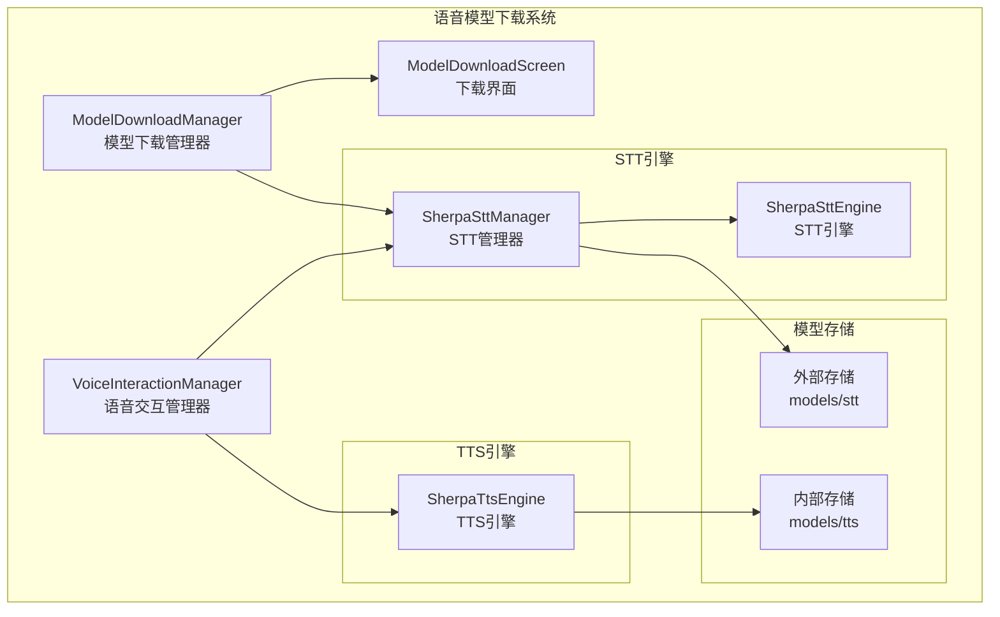
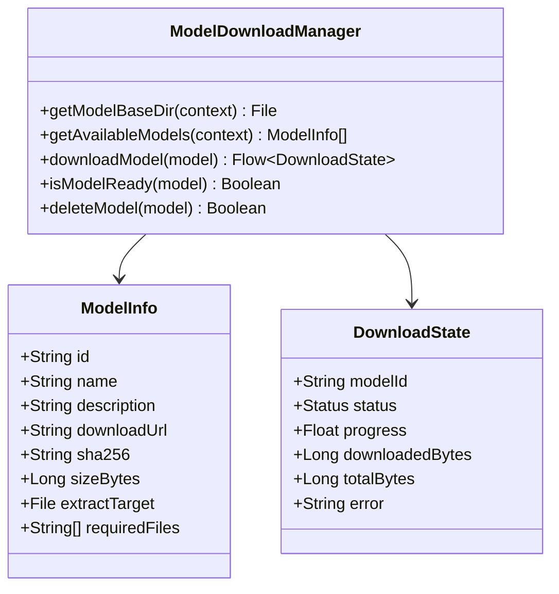
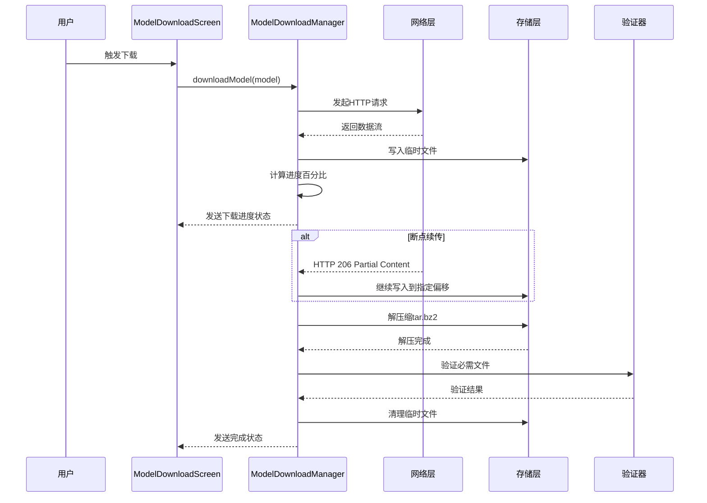
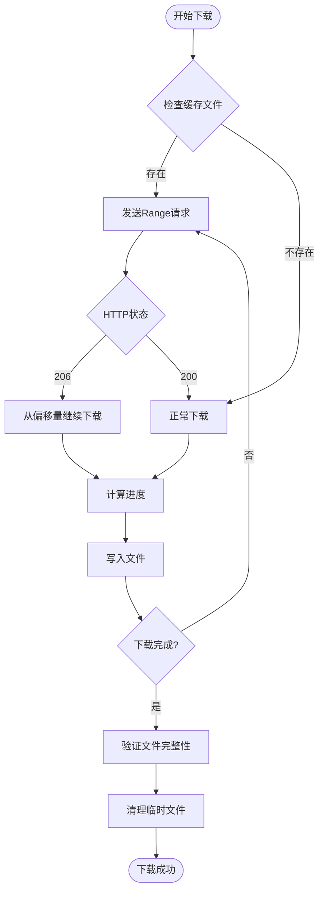
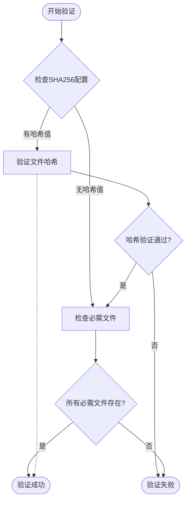
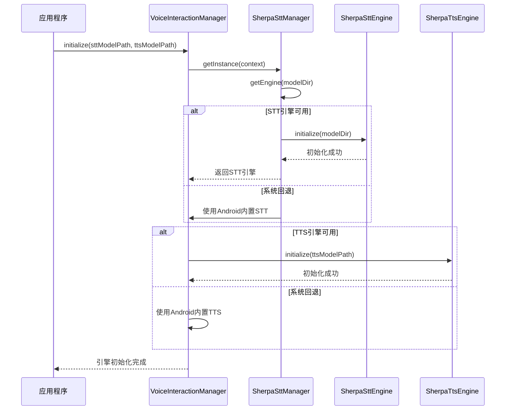
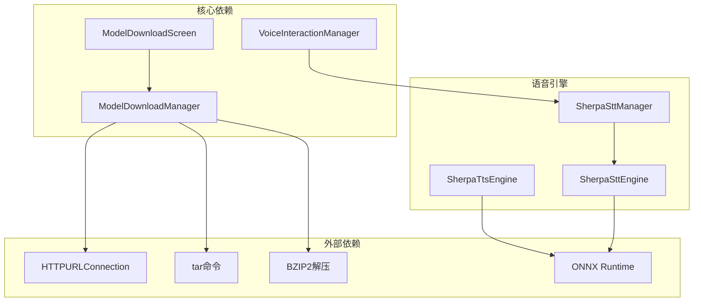

# 语音模型下载管理系统

<cite>
**本文档引用的文件**
- [ModelDownloadManager.kt](file://app/src/main/java/ai/openclaw/android/voice/ModelDownloadManager.kt)
- [ModelDownloadScreen.kt](file://app/src/main/java/ai/openclaw/android/voice/ui/ModelDownloadScreen.kt)
- [VoiceInteractionManager.kt](file://app/src/main/java/ai/openclaw/android/voice/VoiceInteractionManager.kt)
- [SherpaSttManager.kt](file://app/src/main/java/ai/openclaw/android/voice/stt/SherpaSttManager.kt)
- [SherpaSttEngine.kt](file://app/src/main/java/ai/openclaw/android/voice/stt/SherpaSttEngine.kt)
- [SherpaTtsEngine.kt](file://app/src/main/java/ai/openclaw/android/voice/tts/SherpaTtsEngine.kt)
- [MainActivity.kt](file://app/src/main/java/ai/openclaw/android/MainActivity.kt)
- [VoiceSession.kt](file://app/src/main/java/ai/openclaw/android/voice/VoiceSession.kt)
- [EmbeddingModel.kt](file://app/src/main/java/ai/openclaw/android/memory/EmbeddingModel.kt)
- [TfLiteEmbeddingService.kt](file://app/src/main/java/ai/openclaw/android/ml/TfLiteEmbeddingService.kt)
</cite>

## 目录
1. [简介](#简介)
2. [项目结构](#项目结构)
3. [核心组件](#核心组件)
4. [架构概览](#架构概览)
5. [详细组件分析](#详细组件分析)
6. [依赖关系分析](#依赖关系分析)
7. [性能考虑](#性能考虑)
8. [故障排除指南](#故障排除指南)
9. [结论](#结论)

## 简介

语音模型下载管理系统是OpenClaw Android应用中的关键组件，负责管理Sherpa-ONNX语音模型的下载、缓存、验证和加载。该系统支持离线语音识别和合成，确保所有处理都在设备本地完成，无需网络连接。

系统采用模块化设计，包含以下主要功能：
- 多种语音模型的下载管理（STT和TTS）
- 断点续传和进度跟踪
- 文件完整性验证
- 离线模型存储和加载优化
- 用户友好的下载界面
- 自动更新和手动更新流程

## 项目结构

语音模型下载管理系统位于应用的voice包中，采用分层架构设计：



**图表来源**
- [ModelDownloadManager.kt:1-316](file://app/src/main/java/ai/openclaw/android/voice/ModelDownloadManager.kt#L1-L316)
- [ModelDownloadScreen.kt:1-271](file://app/src/main/java/ai/openclaw/android/voice/ui/ModelDownloadScreen.kt#L1-L271)
- [VoiceInteractionManager.kt:1-280](file://app/src/main/java/ai/openclaw/android/voice/VoiceInteractionManager.kt#L1-L280)

**章节来源**
- [ModelDownloadManager.kt:1-316](file://app/src/main/java/ai/openclaw/android/voice/ModelDownloadManager.kt#L1-L316)
- [ModelDownloadScreen.kt:1-271](file://app/src/main/java/ai/openclaw/android/voice/ui/ModelDownloadScreen.kt#L1-L271)
- [VoiceInteractionManager.kt:1-280](file://app/src/main/java/ai/openclaw/android/voice/VoiceInteractionManager.kt#L1-L280)

## 核心组件

### ModelDownloadManager - 模型下载管理器

ModelDownloadManager是整个系统的核心组件，负责管理语音模型的完整生命周期：

**主要功能特性：**
- 支持多种Sherpa-ONNX模型类型
- 断点续传下载（HTTP Range请求）
- 实时进度跟踪和状态报告
- 文件完整性验证
- 模型目录管理

**数据结构：**


**图表来源**
- [ModelDownloadManager.kt:35-124](file://app/src/main/java/ai/openclaw/android/voice/ModelDownloadManager.kt#L35-L124)
- [ModelDownloadManager.kt:55-64](file://app/src/main/java/ai/openclaw/android/voice/ModelDownloadManager.kt#L55-L64)

**章节来源**
- [ModelDownloadManager.kt:25-316](file://app/src/main/java/ai/openclaw/android/voice/ModelDownloadManager.kt#L25-L316)

### ModelDownloadScreen - 下载界面

提供直观的用户界面来管理模型下载：

**界面特性：**
- 实时进度显示（圆形进度指示器和线性进度条）
- 模型状态可视化（已就绪、下载中、失败状态）
- 存储空间显示和警告
- WiFi环境提示
- 错误处理和重试机制

**章节来源**
- [ModelDownloadScreen.kt:26-143](file://app/src/main/java/ai/openclaw/android/voice/ui/ModelDownloadScreen.kt#L26-L143)

### VoiceInteractionManager - 语音交互管理器

统一管理语音引擎的初始化和切换：

**核心功能：**
- STT和TTS引擎的自动选择和初始化
- 引擎状态管理和生命周期控制
- 语音会话状态跟踪
- 引擎切换机制

**章节来源**
- [VoiceInteractionManager.kt:45-280](file://app/src/main/java/ai/openclaw/android/voice/VoiceInteractionManager.kt#L45-L280)

## 架构概览

系统采用分层架构，确保各组件职责清晰分离：

```mermaid
graph TB
subgraph "用户界面层"
UI[ModelDownloadScreen]
MainUI[MainActivity]
end
subgraph "业务逻辑层"
VIM[VoiceInteractionManager]
MDM[ModelDownloadManager]
end
subgraph "引擎层"
SSM[SherpaSttManager]
SSE[SherpaSttEngine]
STE[SherpaTtsEngine]
end
subgraph "存储层"
EXT[外部存储(models/)]
INT[内部存储(files/)]
end
subgraph "网络层"
HTTP[HTTP连接]
BZ2[BZIP2解压]
end
UI --> MDM
MainUI --> VIM
VIM --> SSM
MDM --> HTTP
MDM --> BZ2
SSM --> SSE
SSM --> EXT
STE --> INT
```

**图表来源**
- [MainActivity.kt:251-263](file://app/src/main/java/ai/openclaw/android/MainActivity.kt#L251-L263)
- [VoiceInteractionManager.kt:104-141](file://app/src/main/java/ai/openclaw/android/voice/VoiceInteractionManager.kt#L104-L141)

## 详细组件分析

### 模型下载流程

系统实现了完整的模型下载、验证和安装流程：



**图表来源**
- [ModelDownloadManager.kt:156-263](file://app/src/main/java/ai/openclaw/android/voice/ModelDownloadManager.kt#L156-L263)
- [ModelDownloadScreen.kt:117-132](file://app/src/main/java/ai/openclaw/android/voice/ui/ModelDownloadScreen.kt#L117-L132)

### 断点续传机制

系统支持智能断点续传，提高下载效率：



**图表来源**
- [ModelDownloadManager.kt:166-212](file://app/src/main/java/ai/openclaw/android/voice/ModelDownloadManager.kt#L166-L212)

**章节来源**
- [ModelDownloadManager.kt:156-263](file://app/src/main/java/ai/openclaw/android/voice/ModelDownloadManager.kt#L156-L263)

### 模型验证机制

系统实现多层次的模型验证确保文件完整性：



**图表来源**
- [ModelDownloadManager.kt:235-250](file://app/src/main/java/ai/openclaw/android/voice/ModelDownloadManager.kt#L235-L250)

**章节来源**
- [ModelDownloadManager.kt:220-250](file://app/src/main/java/ai/openclaw/android/voice/ModelDownloadManager.kt#L220-L250)

### 引擎初始化流程

语音引擎的初始化采用延迟加载策略：



**图表来源**
- [VoiceInteractionManager.kt:98-141](file://app/src/main/java/ai/openclaw/android/voice/VoiceInteractionManager.kt#L98-L141)
- [SherpaSttManager.kt:60-82](file://app/src/main/java/ai/openclaw/android/voice/stt/SherpaSttManager.kt#L60-L82)

**章节来源**
- [VoiceInteractionManager.kt:98-141](file://app/src/main/java/ai/openclaw/android/voice/VoiceInteractionManager.kt#L98-L141)
- [SherpaSttManager.kt:60-82](file://app/src/main/java/ai/openclaw/android/voice/stt/SherpaSttManager.kt#L60-L82)

### 存储管理策略

系统采用混合存储策略优化模型文件管理：

```mermaid
graph LR
subgraph "外部存储(models/)"
STT_ST[STT模型目录]
TTS_ST[TTS模型目录]
CACHE_ST[缓存文件(.download)]
end
subgraph "内部存储(files/)"
STT_INT[STT模型目录]
TTS_INT[TTS模型目录]
CACHE_INT[缓存文件(.download)]
end
subgraph "默认路径"
DEF_EXT[外部存储默认路径]
DEF_INT[内部存储默认路径]
end
DEF_EXT -.-> STT_ST
DEF_EXT -.-> TTS_ST
DEF_INT -.-> STT_INT
DEF_INT -.-> TTS_INT
STT_ST -.-> CACHE_ST
TTS_ST -.-> CACHE_ST
STT_INT -.-> CACHE_INT
TTS_INT -.-> CACHE_INT
```

**图表来源**
- [SherpaSttManager.kt:40-48](file://app/src/main/java/ai/openclaw/android/voice/stt/SherpaSttManager.kt#L40-L48)
- [VoiceInteractionManager.kt:271-278](file://app/src/main/java/ai/openclaw/android/voice/VoiceInteractionManager.kt#L271-L278)

**章节来源**
- [SherpaSttManager.kt:40-48](file://app/src/main/java/ai/openclaw/android/voice/stt/SherpaSttManager.kt#L40-L48)
- [VoiceInteractionManager.kt:271-278](file://app/src/main/java/ai/openclaw/android/voice/VoiceInteractionManager.kt#L271-L278)

## 依赖关系分析

系统组件间的依赖关系清晰明确：



**图表来源**
- [ModelDownloadManager.kt:15-17](file://app/src/main/java/ai/openclaw/android/voice/ModelDownloadManager.kt#L15-L17)
- [SherpaSttEngine.kt:8](file://app/src/main/java/ai/openclaw/android/voice/stt/SherpaSttEngine.kt#L8)

**章节来源**
- [ModelDownloadManager.kt:15-17](file://app/src/main/java/ai/openclaw/android/voice/ModelDownloadManager.kt#L15-L17)
- [SherpaSttEngine.kt:8](file://app/src/main/java/ai/openclaw/android/voice/stt/SherpaSttEngine.kt#L8)

## 性能考虑

### 下载性能优化

系统实现了多项性能优化策略：

1. **缓冲区优化**：使用8KB缓冲区进行网络读取
2. **异步处理**：所有I/O操作在IO调度器上执行
3. **内存管理**：及时释放网络连接和文件句柄
4. **进度计算**：避免频繁的状态更新

### 存储性能优化

1. **外部存储优先**：模型文件存储在外部存储避免占用应用内部空间
2. **并行处理**：下载和解压过程可以并行进行
3. **增量更新**：支持断点续传减少重复下载

### 内存使用优化

1. **流式处理**：网络数据采用流式读取，避免大文件一次性加载
2. **及时清理**：下载完成后立即清理临时文件
3. **资源管理**：正确关闭所有打开的文件和网络连接

## 故障排除指南

### 常见问题及解决方案

**下载失败**
- 检查网络连接和权限
- 验证存储空间是否充足
- 查看错误日志获取具体原因

**模型验证失败**
- 确认模型文件完整性
- 检查必需文件是否存在
- 验证文件权限设置

**引擎初始化失败**
- 确认模型路径正确
- 检查模型文件格式
- 验证系统兼容性

**章节来源**
- [ModelDownloadManager.kt:255-262](file://app/src/main/java/ai/openclaw/android/voice/ModelDownloadManager.kt#L255-L262)

### 调试技巧

1. **启用详细日志**：查看TAG为"ModelDownloadManager"的日志输出
2. **监控存储空间**：定期检查可用存储空间
3. **验证文件完整性**：使用SHA256校验码确认文件正确性
4. **测试网络连接**：确保能够访问模型下载源

## 结论

语音模型下载管理系统提供了完整的离线语音处理解决方案。系统具有以下优势：

1. **可靠性**：支持断点续传和多重验证机制
2. **用户体验**：提供直观的下载界面和实时进度反馈
3. **性能优化**：采用多种优化策略确保高效运行
4. **可扩展性**：模块化设计便于添加新的语音模型

该系统为OpenClaw Android应用提供了强大的语音处理能力，确保用户能够在离线环境下享受高质量的语音交互体验。通过合理的架构设计和完善的错误处理机制，系统能够在各种设备和网络条件下稳定运行。