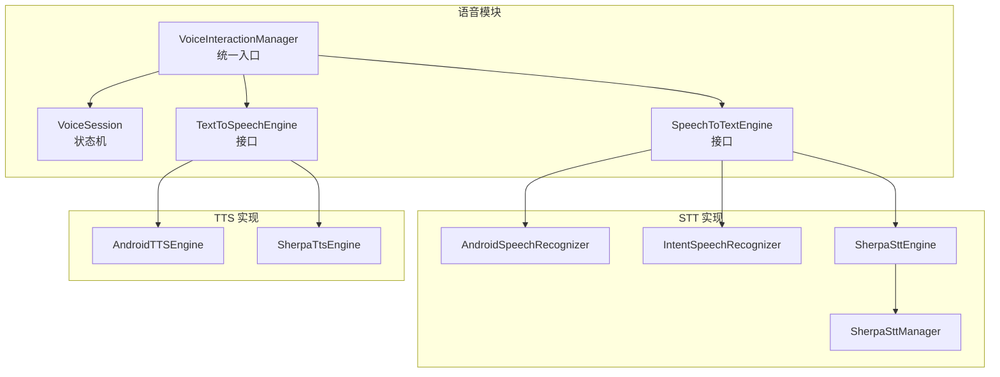
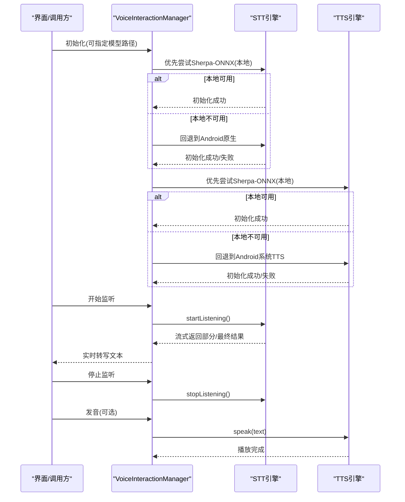
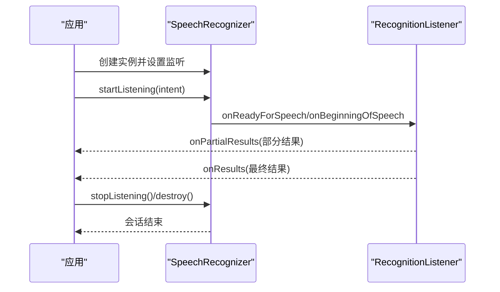
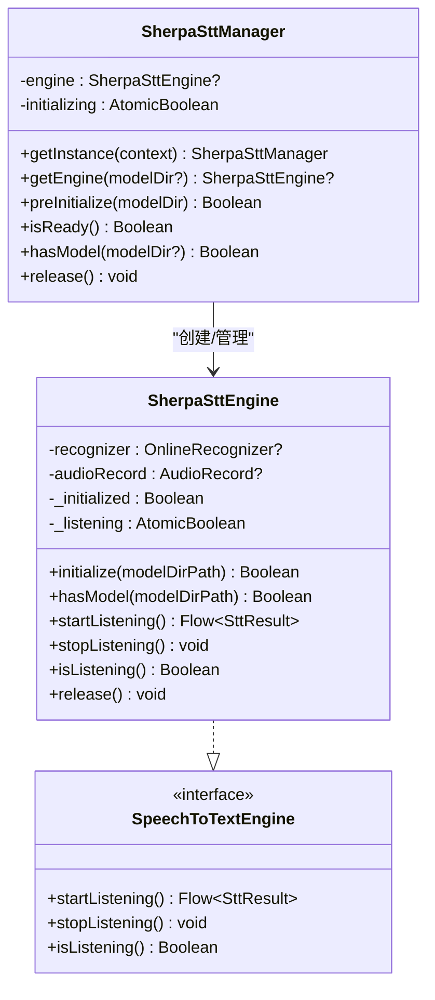
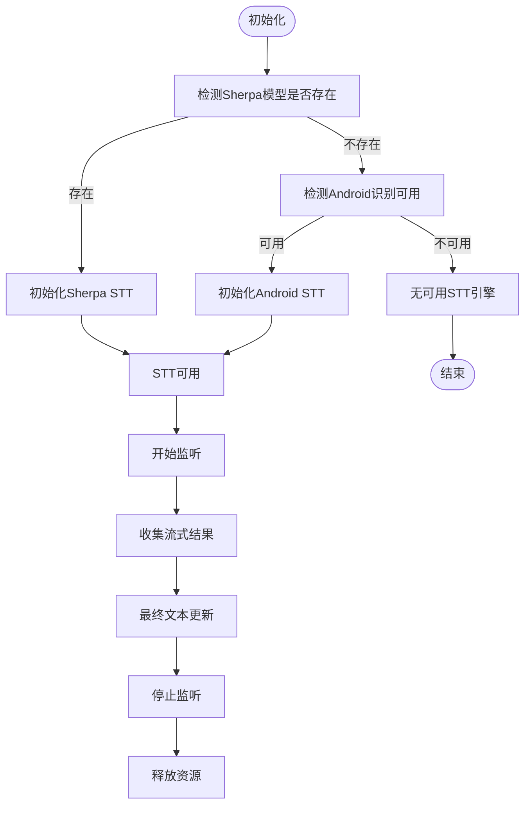
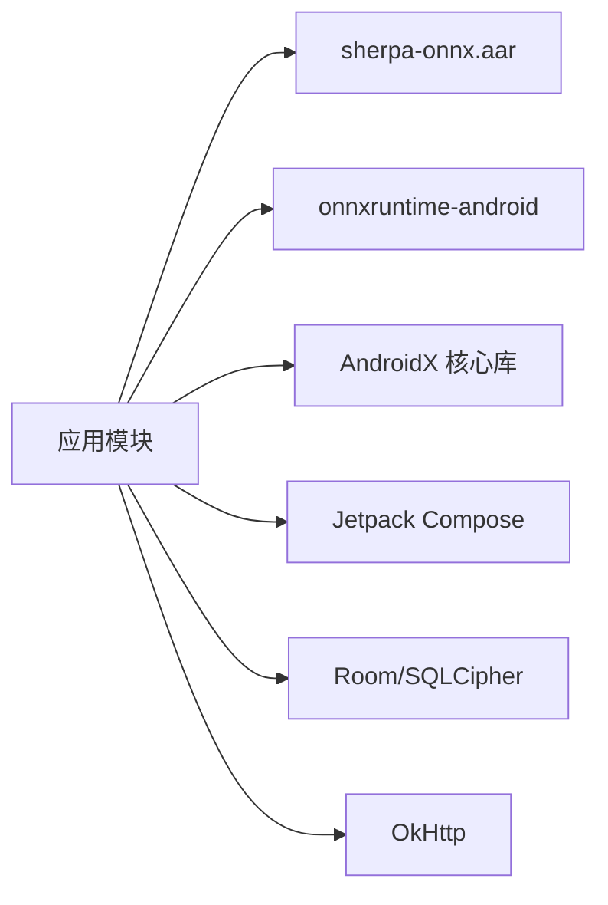

# 语音识别系统

<cite>
**本文引用的文件**
- [SpeechToTextEngine.kt](file://app/src/main/java/ai/openclaw/android/voice/stt/SpeechToTextEngine.kt)
- [AndroidSpeechRecognizer.kt](file://app/src/main/java/ai/openclaw/android/voice/stt/AndroidSpeechRecognizer.kt)
- [IntentSpeechRecognizer.kt](file://app/src/main/java/ai/openclaw/android/voice/stt/IntentSpeechRecognizer.kt)
- [SherpaSttEngine.kt](file://app/src/main/java/ai/openclaw/android/voice/stt/SherpaSttEngine.kt)
- [SherpaSttManager.kt](file://app/src/main/java/ai/openclaw/android/voice/stt/SherpaSttManager.kt)
- [VoiceInteractionManager.kt](file://app/src/main/java/ai/openclaw/android/voice/VoiceInteractionManager.kt)
- [VoiceSession.kt](file://app/src/main/java/ai/openclaw/android/voice/VoiceSession.kt)
- [TextToSpeechEngine.kt](file://app/src/main/java/ai/openclaw/android/voice/tts/TextToSpeechEngine.kt)
- [AndroidTTSEngine.kt](file://app/src/main/java/ai/openclaw/android/voice/tts/AndroidTTSEngine.kt)
- [SHERPA_INTEGRATION.md](file://SHERPA_INTEGRATION.md)
- [download-sherpa-onnx.sh](file://scripts/download-sherpa-onnx.sh)
- [AndroidManifest.xml](file://app/src/main/AndroidManifest.xml)
- [build.gradle.kts](file://app/build.gradle.kts)
- [proguard-rules.pro](file://app/proguard-rules.pro)
</cite>

## 目录
1. [简介](#简介)
2. [项目结构](#项目结构)
3. [核心组件](#核心组件)
4. [架构总览](#架构总览)
5. [详细组件分析](#详细组件分析)
6. [依赖关系分析](#依赖关系分析)
7. [性能考量](#性能考量)
8. [故障排查指南](#故障排查指南)
9. [结论](#结论)
10. [附录](#附录)

## 简介
本文件面向语音识别系统的技术文档，聚焦于STT（语音转文本）引擎的架构设计与多种识别方案实现，涵盖：
- Android原生语音识别（SpeechRecognizer）的集成与使用
- 云端识别能力的说明与边界
- Intent方式的语音识别调用
- Sherpa-ONNX本地语音识别引擎的部署、配置与优化
- 识别结果的后处理与错误恢复机制
- 准确率提升策略与延迟优化技巧
- 引擎性能对比与选型建议

## 项目结构
语音识别相关代码主要位于 app/src/main/java/ai/openclaw/android/voice 目录下，按职责划分为：
- stt：语音转文本引擎接口与实现（Android、Intent、Sherpa-ONNX）
- tts：语音合成引擎接口与实现（Android、Sherpa-ONNX）
- VoiceInteractionManager：统一的语音交互入口与引擎生命周期管理
- VoiceSession：一次完整语音交互的状态机

图示来源
- [VoiceInteractionManager.kt:45-280](file://app/src/main/java/ai/openclaw/android/voice/VoiceInteractionManager.kt#L45-L280)
- [SpeechToTextEngine.kt:21-46](file://app/src/main/java/ai/openclaw/android/voice/stt/SpeechToTextEngine.kt#L21-L46)
- [AndroidSpeechRecognizer.kt:24-114](file://app/src/main/java/ai/openclaw/android/voice/stt/AndroidSpeechRecognizer.kt#L24-L114)
- [IntentSpeechRecognizer.kt:35-57](file://app/src/main/java/ai/openclaw/android/voice/stt/IntentSpeechRecognizer.kt#L35-L57)
- [SherpaSttEngine.kt:20-234](file://app/src/main/java/ai/openclaw/android/voice/stt/SherpaSttEngine.kt#L20-L234)
- [SherpaSttManager.kt:22-124](file://app/src/main/java/ai/openclaw/android/voice/stt/SherpaSttManager.kt#L22-L124)
- [TextToSpeechEngine.kt:6-20](file://app/src/main/java/ai/openclaw/android/voice/tts/TextToSpeechEngine.kt#L6-L20)
- [AndroidTTSEngine.kt:16-89](file://app/src/main/java/ai/openclaw/android/voice/tts/AndroidTTSEngine.kt#L16-L89)

章节来源
- [VoiceInteractionManager.kt:45-280](file://app/src/main/java/ai/openclaw/android/voice/VoiceInteractionManager.kt#L45-L280)
- [build.gradle.kts:126-217](file://app/build.gradle.kts#L126-L217)

## 核心组件
- 语音转文本接口与结果模型
  - 接口定义了开始监听、停止监听、查询监听状态的能力，并以流的形式返回部分与最终识别结果
  - 结果模型包含文本、是否最终、置信度等字段
- Android原生语音识别
  - 基于系统SpeechRecognizer，支持部分结果与最终结果回调，具备错误码映射与优雅关闭
- Intent语音识别
  - 通过系统意图启动任意安装的语音识别应用，兼容无Google服务设备
- Sherpa-ONNX本地识别
  - 基于Sherpa-ONNX的流式在线识别，支持多模型类型，本地推理，无需网络
- 统一语音交互管理器
  - 负责引擎初始化、选择与切换、状态管理、资源释放
- 语音会话状态机
  - 描述从“空闲”到“监听”再到“处理/说话”的状态流转

章节来源
- [SpeechToTextEngine.kt:21-46](file://app/src/main/java/ai/openclaw/android/voice/stt/SpeechToTextEngine.kt#L21-L46)
- [AndroidSpeechRecognizer.kt:24-114](file://app/src/main/java/ai/openclaw/android/voice/stt/AndroidSpeechRecognizer.kt#L24-L114)
- [IntentSpeechRecognizer.kt:35-57](file://app/src/main/java/ai/openclaw/android/voice/stt/IntentSpeechRecognizer.kt#L35-L57)
- [SherpaSttEngine.kt:20-234](file://app/src/main/java/ai/openclaw/android/voice/stt/SherpaSttEngine.kt#L20-L234)
- [SherpaSttManager.kt:22-124](file://app/src/main/java/ai/openclaw/android/voice/stt/SherpaSttManager.kt#L22-L124)
- [VoiceInteractionManager.kt:45-280](file://app/src/main/java/ai/openclaw/android/voice/VoiceInteractionManager.kt#L45-L280)
- [VoiceSession.kt:16-78](file://app/src/main/java/ai/openclaw/android/voice/VoiceSession.kt#L16-L78)

## 架构总览
系统采用“接口抽象 + 多实现 + 统一管理 + 状态机”的分层架构：
- 接口层：STT/TTS统一接口，屏蔽具体实现差异
- 实现层：Android、Intent、Sherpa-ONNX三种STT实现；Android、Sherpa-ONNX两种TTS实现
- 管理层：VoiceInteractionManager负责引擎选择、初始化、切换与资源回收
- 展示层：VoiceSession驱动UI状态与业务流程

图示来源
- [VoiceInteractionManager.kt:98-141](file://app/src/main/java/ai/openclaw/android/voice/VoiceInteractionManager.kt#L98-L141)
- [VoiceInteractionManager.kt:155-177](file://app/src/main/java/ai/openclaw/android/voice/VoiceInteractionManager.kt#L155-L177)
- [VoiceInteractionManager.kt:203-221](file://app/src/main/java/ai/openclaw/android/voice/VoiceInteractionManager.kt#L203-L221)

## 详细组件分析

### STT接口与结果模型
- 接口职责
  - startListening：返回流式结果，支持部分结果与最终结果
  - stopListening：主动结束当前会话
  - isListening：查询当前监听状态
- 结果模型
  - text：当前识别文本
  - isFinal：是否为稳定最终结果
  - confidence：置信度（0~1，不可用时为-1）

章节来源
- [SpeechToTextEngine.kt:21-46](file://app/src/main/java/ai/openclaw/android/voice/stt/SpeechToTextEngine.kt#L21-L46)

### Android原生语音识别（SpeechRecognizer）
- 特性
  - 使用系统SpeechRecognizer进行识别，支持部分结果与最终结果
  - 错误码映射，区分静音/无匹配/超时等场景
  - 在主线程创建实例，每次会话新建实例避免状态泄漏
- 数据流
  - onPartialResults：发送部分结果
  - onResults：发送最终结果并结束会话
  - onError：根据错误类型优雅关闭或抛出异常

图示来源
- [AndroidSpeechRecognizer.kt:31-92](file://app/src/main/java/ai/openclaw/android/voice/stt/AndroidSpeechRecognizer.kt#L31-L92)
- [AndroidSpeechRecognizer.kt:101-112](file://app/src/main/java/ai/openclaw/android/voice/stt/AndroidSpeechRecognizer.kt#L101-L112)

章节来源
- [AndroidSpeechRecognizer.kt:24-114](file://app/src/main/java/ai/openclaw/android/voice/stt/AndroidSpeechRecognizer.kt#L24-L114)

### Intent语音识别
- 适用场景
  - 兼容无Google服务设备，可调用任意安装的语音识别应用
- 行为
  - 通过系统意图启动识别，返回结果解析为统一的SpeechResult类型
  - 成功、错误、取消三种结果封装

章节来源
- [IntentSpeechRecognizer.kt:35-57](file://app/src/main/java/ai/openclaw/android/voice/stt/IntentSpeechRecognizer.kt#L35-L57)

### Sherpa-ONNX本地语音识别引擎
- 设计要点
  - 基于Sherpa-ONNX的流式在线识别，采样率16kHz、单声道、PCM16位
  - 支持多种模型类型（Zipformer、Streaming Paraformer等），自动检测模型目录
  - 通过endpoint规则实现端点检测，减少无效片段
- 初始化与生命周期
  - 通过SherpaSttManager单例管理，惰性初始化与预初始化
  - 提供hasModel检测、release释放资源
- 识别流程
  - 初始化识别器与音频录制
  - 循环读取音频缓冲，转换为浮点样本输入识别流
  - 不断检查识别器就绪状态并解码，实时输出部分结果
  - 停止录音时输出最终结果

图示来源
- [SherpaSttEngine.kt:20-234](file://app/src/main/java/ai/openclaw/android/voice/stt/SherpaSttEngine.kt#L20-L234)
- [SherpaSttManager.kt:22-124](file://app/src/main/java/ai/openclaw/android/voice/stt/SherpaSttManager.kt#L22-L124)
- [SpeechToTextEngine.kt:21-34](file://app/src/main/java/ai/openclaw/android/voice/stt/SpeechToTextEngine.kt#L21-L34)

章节来源
- [SherpaSttEngine.kt:20-234](file://app/src/main/java/ai/openclaw/android/voice/stt/SherpaSttEngine.kt#L20-L234)
- [SherpaSttManager.kt:22-124](file://app/src/main/java/ai/openclaw/android/voice/stt/SherpaSttManager.kt#L22-L124)

### 统一语音交互管理器
- 职责
  - 引擎选择：优先Sherpa-ONNX（本地），否则回退Android原生
  - 初始化：异步初始化STT/TTS引擎，标记初始化状态
  - 会话管理：startListening返回流式结果，stopListening结束会话
  - 引擎切换：运行时可在Sherpa与Android之间切换
  - 资源释放：destroy统一释放
- 状态与数据流
  - sessionState：Idle/Listening/Processing/Speaking
  - transcript/finalTranscript：实时与最终文本
  - isInitialized：初始化完成标志

图示来源
- [VoiceInteractionManager.kt:98-141](file://app/src/main/java/ai/openclaw/android/voice/VoiceInteractionManager.kt#L98-L141)
- [VoiceInteractionManager.kt:155-177](file://app/src/main/java/ai/openclaw/android/voice/VoiceInteractionManager.kt#L155-L177)
- [VoiceSession.kt:26-78](file://app/src/main/java/ai/openclaw/android/voice/VoiceSession.kt#L26-L78)

章节来源
- [VoiceInteractionManager.kt:45-280](file://app/src/main/java/ai/openclaw/android/voice/VoiceInteractionManager.kt#L45-L280)
- [VoiceSession.kt:16-78](file://app/src/main/java/ai/openclaw/android/voice/VoiceSession.kt#L16-L78)

### 云端识别能力说明
- 本项目中，云端识别能力由系统SpeechRecognizer承载（Android原生），并非自研云端服务
- 若设备无系统识别服务或识别服务不可用，则回退至其他可用引擎
- 云端识别的稳定性与网络状况相关，本地Sherpa-ONNX可规避网络依赖

章节来源
- [AndroidSpeechRecognizer.kt:13-19](file://app/src/main/java/ai/openclaw/android/voice/stt/AndroidSpeechRecognizer.kt#L13-L19)
- [VoiceInteractionManager.kt:112-118](file://app/src/main/java/ai/openclaw/android/voice/VoiceInteractionManager.kt#L112-L118)

### TTS引擎与语音会话
- TTS接口
  - speak：异步播放文本，支持停止与查询是否在播
  - setVoice：设置语言、语速、音高等语音参数
- Android系统TTS
  - 初始化需等待引擎就绪，支持语音参数设置
- 语音会话
  - VoiceSession描述一次完整交互的生命周期，便于UI与业务流程控制

章节来源
- [TextToSpeechEngine.kt:6-33](file://app/src/main/java/ai/openclaw/android/voice/tts/TextToSpeechEngine.kt#L6-L33)
- [AndroidTTSEngine.kt:16-89](file://app/src/main/java/ai/openclaw/android/voice/tts/AndroidTTSEngine.kt#L16-L89)
- [VoiceSession.kt:16-78](file://app/src/main/java/ai/openclaw/android/voice/VoiceSession.kt#L16-L78)

## 依赖关系分析
- 外部依赖
  - sherpa-onnx AAR：本地推理核心，包含Java API与原生库
  - ONNX Runtime：Sherpa-ONNX依赖的推理引擎
- 构建与打包
  - build.gradle.kts中声明依赖与ABI过滤
  - proguard-rules.pro保留Sherpa-ONNX类与原生方法签名
- 权限与安全
  - AndroidManifest.xml声明RECORD_AUDIO、INTERNET、存储访问等权限

图示来源
- [build.gradle.kts:126-217](file://app/build.gradle.kts#L126-L217)
- [proguard-rules.pro:56-61](file://app/proguard-rules.pro#L56-L61)
- [AndroidManifest.xml:42-42](file://app/src/main/AndroidManifest.xml#L42-L42)

章节来源
- [build.gradle.kts:126-217](file://app/build.gradle.kts#L126-L217)
- [proguard-rules.pro:56-61](file://app/proguard-rules.pro#L56-L61)
- [AndroidManifest.xml:42-42](file://app/src/main/AndroidManifest.xml#L42-L42)

## 性能考量
- 本地识别优势
  - 无网络依赖，延迟低，隐私安全
  - 通过endpoint规则减少无效片段，降低解码开销
- 模型选择建议
  - 中文流式识别：优先Zipformer zh-14M（轻量）
  - 中英双语：Streaming Paraformer（更高质量）
  - 小型CTC模型：Zipformer Small CTC Zh（单文件，适合极简部署）
- 延迟优化技巧
  - 降低缓冲区大小与采样率（需权衡质量）
  - 合理设置线程数与解码策略
  - 使用端点检测提前结束，减少无效解码
- 资源管理
  - 会话结束后及时释放AudioRecord与识别器
  - 预初始化避免首帧延迟

章节来源
- [SHERPA_INTEGRATION.md:55-86](file://SHERPA_INTEGRATION.md#L55-L86)
- [SherpaSttEngine.kt:142-207](file://app/src/main/java/ai/openclaw/android/voice/stt/SherpaSttEngine.kt#L142-L207)
- [VoiceInteractionManager.kt:191-200](file://app/src/main/java/ai/openclaw/android/voice/VoiceInteractionManager.kt#L191-L200)

## 故障排查指南
- 常见问题与定位
  - 无可用STT引擎：检查设备是否安装识别服务或模型是否存在
  - 初始化失败：确认模型目录结构正确、文件存在、权限充足
  - 录音权限缺失：确保RECORD_AUDIO权限已授予
  - 本地AAR问题：确认已下载真实AAR而非stub版本
- 日志与错误码
  - Android原生识别：错误码映射到可读字符串，区分静音/无匹配/超时等
  - 本地识别：捕获异常并记录日志，确保资源释放
- 恢复机制
  - 会话异常时主动停止监听并释放资源
  - 切换引擎时先验证目标引擎可用性

章节来源
- [AndroidSpeechRecognizer.kt:72-82](file://app/src/main/java/ai/openclaw/android/voice/stt/AndroidSpeechRecognizer.kt#L72-L82)
- [AndroidSpeechRecognizer.kt:101-112](file://app/src/main/java/ai/openclaw/android/voice/stt/AndroidSpeechRecognizer.kt#L101-L112)
- [VoiceInteractionManager.kt:191-200](file://app/src/main/java/ai/openclaw/android/voice/VoiceInteractionManager.kt#L191-L200)
- [SHERPA_INTEGRATION.md:147-151](file://SHERPA_INTEGRATION.md#L147-L151)

## 结论
本系统通过接口抽象与统一管理器，实现了对多种STT/TTS引擎的无缝接入与动态切换。Sherpa-ONNX提供了可靠的本地识别能力，显著降低了对外部服务的依赖；Android原生与Intent方式作为兼容性保障，在不同设备与场景下提供稳健的回退路径。结合端点检测、模型选择与资源管理策略，可在准确率与延迟之间取得良好平衡。

## 附录

### 引擎选择与部署建议
- 优先使用Sherpa-ONNX（本地）
  - 优点：离线、低延迟、隐私安全
  - 适用：华为等无GMS设备、弱网环境、对隐私敏感场景
- 回退到Android原生或Intent
  - 优点：系统成熟、生态丰富
  - 适用：设备具备识别服务且网络可用

章节来源
- [VoiceInteractionManager.kt:104-141](file://app/src/main/java/ai/openclaw/android/voice/VoiceInteractionManager.kt#L104-L141)
- [SHERPA_INTEGRATION.md:104-136](file://SHERPA_INTEGRATION.md#L104-L136)

### 模型下载与部署脚本
- 下载Sherpa-ONNX AAR（包含原生库）
- 解压STT/TTS模型到默认目录（外部存储或内部存储）
- 构建APK并安装到设备

章节来源
- [SHERPA_INTEGRATION.md:34-102](file://SHERPA_INTEGRATION.md#L34-L102)
- [download-sherpa-onnx.sh:1-63](file://scripts/download-sherpa-onnx.sh#L1-L63)