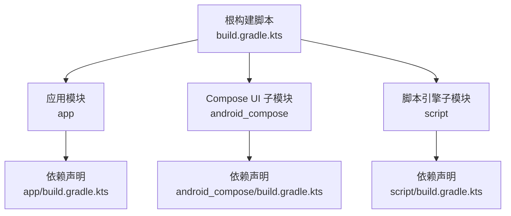
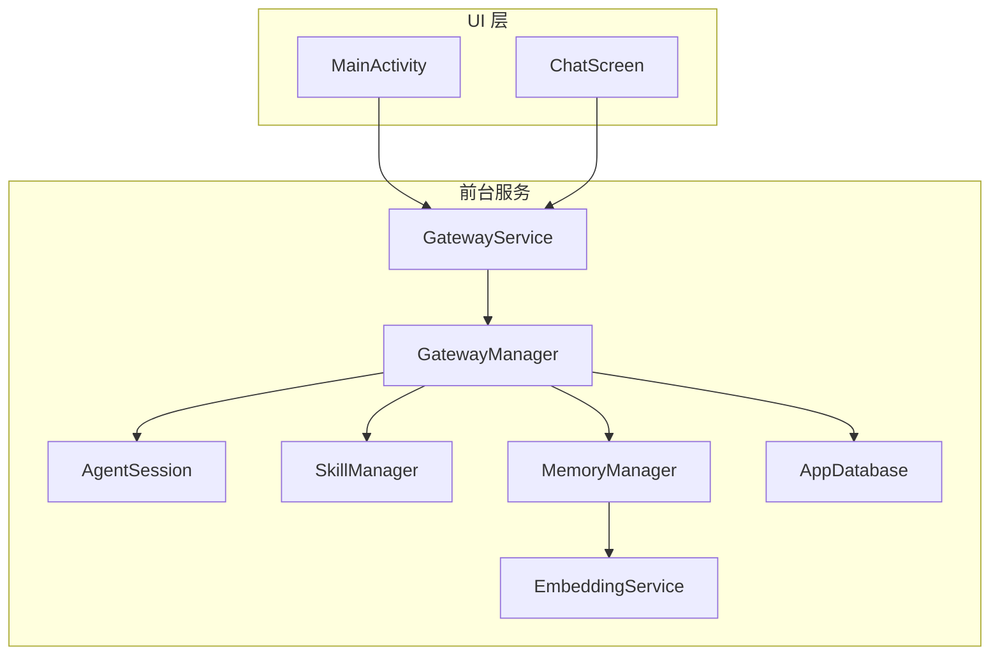
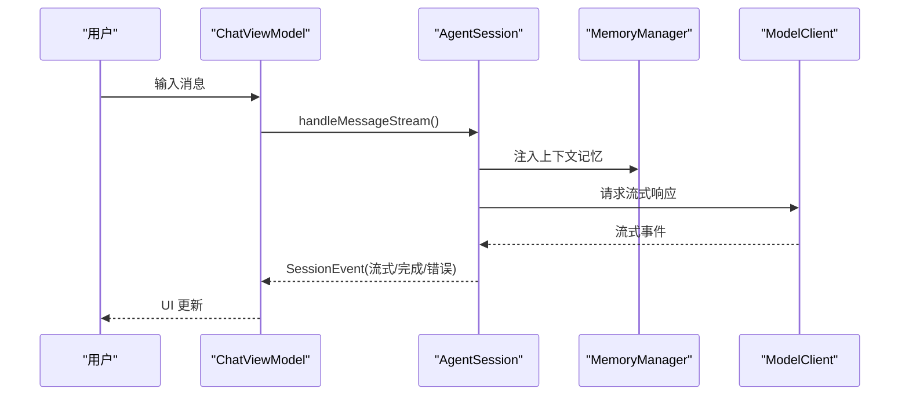
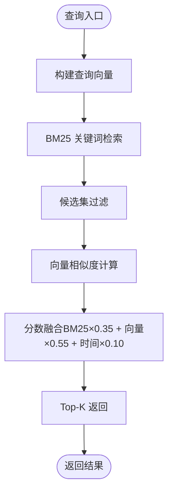
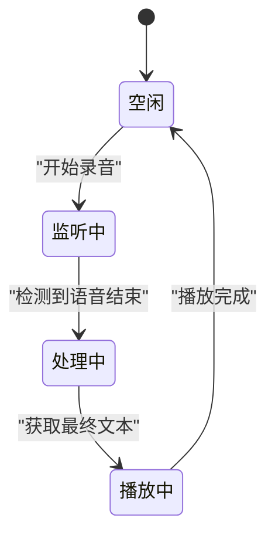
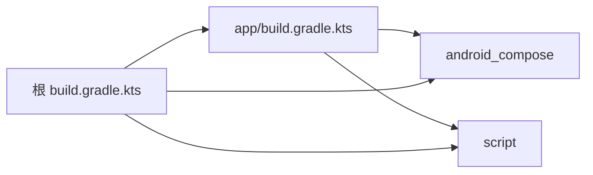

# 贡献指南

<cite>
**本文引用的文件**
- [README.md](file://README.md)
- [PROJECT.md](file://PROJECT.md)
- [CLAUDE.md](file://CLAUDE.md)
- [TEST-GUIDE.md](file://TEST-GUIDE.md)
- [.github/workflows/android.yml](file://.github/workflows/android.yml)
- [build.gradle.kts](file://build.gradle.kts)
- [settings.gradle.kts](file://settings.gradle.kts)
- [gradle.properties](file://gradle.properties)
- [app/build.gradle.kts](file://app/build.gradle.kts)
- [docs/PROJECT-CONTEXT.md](file://docs/PROJECT-CONTEXT.md)
- [docs/CURRENT-STATUS-2026-04-21.md](file://docs/CURRENT-STATUS-2026-04-21.md)
- [docs/GAP_ANALYSIS.md](file://docs/GAP_ANALYSIS.md)
- [docs/TODO-LIST.md](file://docs/TODO-LIST.md)
- [docs/CODE-REVIEW-2026-04-22.md](file://docs/CODE-REVIEW-2026-04-22.md)
</cite>

## 目录
1. [简介](#简介)
2. [项目结构](#项目结构)
3. [核心组件](#核心组件)
4. [架构总览](#架构总览)
5. [详细组件分析](#详细组件分析)
6. [依赖关系分析](#依赖关系分析)
7. [性能与质量要求](#性能与质量要求)
8. [测试与验证](#测试与验证)
9. [开发与调试指南](#开发与调试指南)
10. [代码风格与提交规范](#代码风格与提交规范)
11. [分支管理与发布流程](#分支管理与发布流程)
12. [Pull Request 审查与合并](#pull-request-审查与合并)
13. [新功能开发与现有功能改进流程](#新功能开发与现有功能改进流程)
14. [文档更新与知识沉淀](#文档更新与知识沉淀)
15. [社区参与与沟通渠道](#社区参与与沟通渠道)
16. [故障排查与常见问题](#故障排查与常见问题)
17. [结语](#结语)

## 简介
本指南面向开源贡献者，系统说明 OpenClaw-Android 的开发流程、代码贡献规范、分支与发布策略、PR 审查与合并标准、开发与调试方式、测试与验证要求、文档更新规范以及社区协作方式。目标是帮助贡献者快速上手、高质量交付并持续演进项目。

## 项目结构
项目采用多模块结构，核心模块包括应用主模块、Compose UI 子模块与脚本引擎子模块。根构建脚本统一管理插件版本，settings 脚本声明模块包含关系。应用模块负责 UI、业务与数据层，Compose 子模块提供 A2UI 协议渲染组件，Script 子模块提供动态脚本执行能力。

图表来源
- [build.gradle.kts:1-9](file://build.gradle.kts#L1-L9)
- [settings.gradle.kts:21-24](file://settings.gradle.kts#L21-L24)
- [app/build.gradle.kts:126-216](file://app/build.gradle.kts#L126-L216)

章节来源
- [README.md:89-152](file://README.md#L89-L152)
- [PROJECT.md:105-175](file://PROJECT.md#L105-L175)
- [build.gradle.kts:1-9](file://build.gradle.kts#L1-L9)
- [settings.gradle.kts:21-24](file://settings.gradle.kts#L21-L24)

## 核心组件
- GatewayService 与 GatewayManager：作为“单一可信源”，承载核心组件并在前台服务中运行，Activity 仅作为纯 UI 层。
- AgentSession：对话编排中心，支持工具调用循环、流式响应与多轮反思策略。
- Skill 系统：内置技能与动态技能（JS 脚本），统一工具定义与安全策略。
- 记忆系统：混合检索（BM25 + 向量 + 时间衰减）、冷启动管理、加密存储与审计日志。
- 语音交互：统一 VoiceInteractionManager，支持 STT/TTS 与状态机。
- UI 层：Jetpack Compose + A2UI 协议，支持富 UI 渲染与 Markdown 渲染。

章节来源
- [README.md:7-48](file://README.md#L7-L48)
- [PROJECT.md:190-238](file://PROJECT.md#L190-L238)
- [PROJECT.md:240-292](file://PROJECT.md#L240-L292)
- [PROJECT.md:295-351](file://PROJECT.md#L295-L351)
- [PROJECT.md:421-434](file://PROJECT.md#L421-L434)
- [PROJECT.md:437-450](file://PROJECT.md#L437-L450)

## 架构总览
项目采用“前台服务 + 纯 UI”的 Gateway 架构，Activity 通过 Binder 接口与服务通信，核心组件生命周期独立于 UI，确保模型与会话状态稳定。

图表来源
- [README.md:7-48](file://README.md#L7-L48)
- [PROJECT.md:177-184](file://PROJECT.md#L177-L184)

章节来源
- [README.md:7-48](file://README.md#L7-L48)
- [PROJECT.md:177-184](file://PROJECT.md#L177-L184)

## 详细组件分析

### AgentSession 与多轮反思
- 职责：对话编排、工具调用循环（最多若干轮）、流式响应、Token 估算与历史截断。
- 新增：多轮自我反思策略（NONE/SINGLE/DOUBLE），角色切换提升回答质量。
- 影响：UI 层显示反思状态，配置层新增反射策略字段。

图表来源
- [docs/CURRENT-STATUS-2026-04-21.md:10-18](file://docs/CURRENT-STATUS-2026-04-21.md#L10-L18)
- [docs/CURRENT-STATUS-2026-04-21.md:22-25](file://docs/CURRENT-STATUS-2026-04-21.md#L22-L25)

章节来源
- [docs/CURRENT-STATUS-2026-04-21.md:5-34](file://docs/CURRENT-STATUS-2026-04-21.md#L5-L34)

### 记忆系统与混合检索
- 三层记忆：感知记忆（即时上下文）、摘要记忆（持久化向量）、过程记忆（任务状态）。
- 混合检索：BM25（35%）+ 向量（55%）+ 时间衰减（10%），支持冷启动与遗忘曲线。
- 安全：SQLCipher + Keystore，审计日志防篡改。

图表来源
- [PROJECT.md:317-331](file://PROJECT.md#L317-L331)

章节来源
- [PROJECT.md:295-351](file://PROJECT.md#L295-L351)

### 语音交互与状态机
- 统一入口：VoiceInteractionManager，状态机：Idle → Listening → Processing → Speaking。
- STT/TTS 引擎：Sherpa（本地）与 Android 原生降级方案。
- API 变更：新 API 使用 Flow 实时返回识别结果，长按模式触发录音与确认弹窗。

图表来源
- [docs/PROJECT-CONTEXT.md:107-125](file://docs/PROJECT-CONTEXT.md#L107-L125)

章节来源
- [docs/PROJECT-CONTEXT.md:107-125](file://docs/PROJECT-CONTEXT.md#L107-L125)

### A2UI 协议与富 UI 渲染
- 协议格式：[A2UI]...[/A2UI]，支持 weather/location/reminder/translation/search/generic 等类型。
- 保障机制：系统提示词强制、自动生成兜底、UI 渲染器在 Compose 子模块实现。

章节来源
- [PROJECT.md:437-450](file://PROJECT.md#L437-L450)

## 依赖关系分析
- 构建插件：Android Application/Kotlin/Serialization/Compose/KSP 在根脚本统一版本。
- 模块依赖：app 依赖 android_compose 与 script；android_compose 与 script 为独立模块。
- 运行时依赖：Compose BOM、OkHttp、Room、LiteRT/LiteRT-LM、ONNX Runtime、SQLCipher、Koin 等。

图表来源
- [settings.gradle.kts:21-24](file://settings.gradle.kts#L21-L24)
- [build.gradle.kts:1-9](file://build.gradle.kts#L1-L9)

章节来源
- [settings.gradle.kts:21-24](file://settings.gradle.kts#L21-L24)
- [build.gradle.kts:1-9](file://build.gradle.kts#L1-L9)
- [app/build.gradle.kts:126-216](file://app/build.gradle.kts#L126-L216)

## 性能与质量要求
- 性能优化：嵌入缓存（LRU）、异步模型加载、语音组件复用；向量搜索暴力扫描需优化。
- 安全加固：加密存储、证书锁定（建议）、日志脱敏、权限最小化。
- 可维护性：减少重复代码、拆分长函数、统一 ViewModel 架构。

章节来源
- [docs/CODE-REVIEW-2026-04-22.md:145-160](file://docs/CODE-REVIEW-2026-04-22.md#L145-L160)
- [docs/CODE-REVIEW-2026-04-22.md:179-188](file://docs/CODE-REVIEW-2026-04-22.md#L179-L188)

## 测试与验证
- 必须通过的测试：单元测试（app + android_compose）、仪器测试编译、Debug 构建成功。
- 测试覆盖：序列化、Token 计数、技能逻辑、记忆 CRUD、向量搜索、会话压缩、Agent 流式行为、数据库 DAO、嵌入服务等。
- 手动测试：会话创建/持久化/跨天保持/Token 计数/压缩触发；数据库验证与日志观察。

章节来源
- [CLAUDE.md:194-232](file://CLAUDE.md#L194-L232)
- [TEST-GUIDE.md:1-68](file://TEST-GUIDE.md#L1-L68)

## 开发与调试指南
- 构建命令：设置 JAVA_HOME（JBR 21），构建 Debug/Release、运行单元测试、仪器测试、安装 APK、清理构建。
- 安装与调试：通过 ADB 安装 Debug APK，使用 logcat 观察关键日志，数据库验证使用 sqlite3。
- 已知坑与注意事项：Compose 导入路径、协程 Flow 使用、Git 换行符、WSL2 路径映射、ChatScreen 语音逻辑 API 变更。

章节来源
- [CLAUDE.md:5-42](file://CLAUDE.md#L5-L42)
- [docs/PROJECT-CONTEXT.md:34-56](file://docs/PROJECT-CONTEXT.md#L34-L56)
- [docs/PROJECT-CONTEXT.md:58-103](file://docs/PROJECT-CONTEXT.md#L58-L103)

## 代码风格与提交规范
- TDD：重要功能先写测试。
- 最小改动：不在任务范围内修改其他文件。
- 频繁提交：每次功能完成后提交，保持提交粒度小而清晰。
- 文档同步：修改代码的同时必须更新 docs 下的设计文档；架构/接口/UI/语音模块变更分别更新相应文档。
- 编译验证：每次改动后运行 Debug 构建，确保 BUILD SUCCESSFUL。

章节来源
- [docs/PROJECT-CONTEXT.md:128-141](file://docs/PROJECT-CONTEXT.md#L128-L141)

## 分支管理与发布流程
- 分支策略：master/main 为主干，PR 从功能分支发起；发布通过标签打 Tag。
- CI/CD：GitHub Actions 自动运行测试、Lint、构建 Debug APK；Release 仅在 Tag 上触发，自动签名并上传产物。
- 签名：Release 通过 local.properties 读取 keystore 信息；Debug 使用统一调试 keystore。

章节来源
- [.github/workflows/android.yml:1-130](file://.github/workflows/android.yml#L1-L130)
- [app/build.gradle.kts:49-91](file://app/build.gradle.kts#L49-L91)

## Pull Request 审查与合并
- 审查范围：全项目 120+ Kotlin 文件，人工逐模块审查。
- P0 必修：稳定性/崩溃风险（如强制拆包、双重初始化、内存泄漏）。
- P1 建议修复：功能/体验问题（如内存搜索暴力扫描、通知管理空回调、动态脚本默认放行）。
- P2 改进建议：架构/维护性（重复代码、方法过长、重复注册）。
- 合并前提：所有测试通过、构建成功、文档同步更新、审查意见闭环。

章节来源
- [docs/CODE-REVIEW-2026-04-22.md:1-234](file://docs/CODE-REVIEW-2026-04-22.md#L1-L234)

## 新功能开发与现有功能改进流程
- 新功能开发
  - 设计先行：在 docs 下更新设计文档，明确接口/流程/安全策略。
  - TDD：先写单元/仪器测试，再实现功能，确保测试驱动。
  - 模块化：遵循现有模块边界（app/android_compose/script），避免耦合。
  - 安全与性能：遵循加密存储、权限最小化、性能优化建议。
- 现有功能改进
  - 问题定位：依据 TODO-LIST 与 GAP 分析，明确改进目标与验收标准。
  - 逐步迭代：拆分长函数、减少重复代码、优化向量搜索、完善通知分类。
  - 回归验证：确保既有测试通过，新增场景覆盖。

章节来源
- [docs/TODO-LIST.md:1-83](file://docs/TODO-LIST.md#L1-L83)
- [docs/GAP_ANALYSIS.md:85-260](file://docs/GAP_ANALYSIS.md#L85-L260)

## 文档更新与知识沉淀
- 文档索引：PROJECT.md 汇总全局视图，各子文档记录细节设计与进展。
- 更新规范：架构变更 → 更新架构文档；API 变更 → 更新 API 文档/本文档；UI 变更 → 更新 UI 文档；语音模块变更 → 更新 PROJECT-CONTEXT。
- 状态跟踪：CURRENT-STATUS 文档记录阶段性成果与下一步计划。

章节来源
- [PROJECT.md:692-716](file://PROJECT.md#L692-L716)
- [docs/PROJECT-CONTEXT.md:128-141](file://docs/PROJECT-CONTEXT.md#L128-L141)
- [docs/CURRENT-STATUS-2026-04-21.md:1-39](file://docs/CURRENT-STATUS-2026-04-21.md#L1-L39)

## 社区参与与沟通渠道
- 仓库与文档：通过 GitHub 仓库与 docs 目录获取项目背景、现状与规划。
- 提交流程：遵循 PR 审查与合并标准，确保测试与文档同步更新。
- 反馈与协作：在 Issues/PR 中讨论设计与实现，保持沟通透明与高效。

[本节为概念性说明，不直接分析具体文件]

## 故障排查与常见问题
- 构建失败：检查 JAVA_HOME 是否指向 JBR 21，确认 Gradle Wrapper 可用。
- 测试失败：关注单元/仪器测试编译与运行，确保本地环境满足依赖。
- 运行异常：使用 ADB 观察日志，定位关键组件（会话管理、AgentSession、语音模块）。
- 已知坑：Compose 导入路径、协程 Flow 使用、Git 换行符污染、WSL2 路径映射、ChatScreen 语音逻辑 API 变更。

章节来源
- [CLAUDE.md:5-42](file://CLAUDE.md#L5-L42)
- [docs/PROJECT-CONTEXT.md:58-103](file://docs/PROJECT-CONTEXT.md#L58-L103)

## 结语
本指南提供了从开发环境搭建、代码贡献、测试验证到 PR 审查与发布的全流程规范。请在贡献过程中严格遵循测试与文档同步要求，确保代码质量与项目可持续演进。