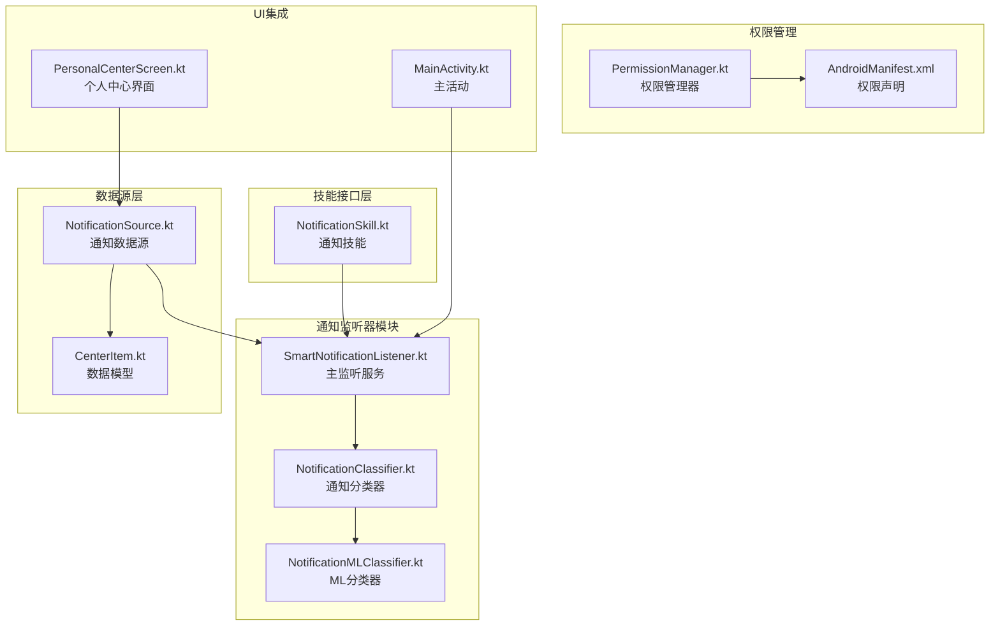
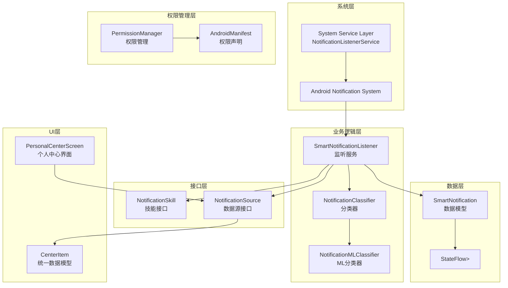
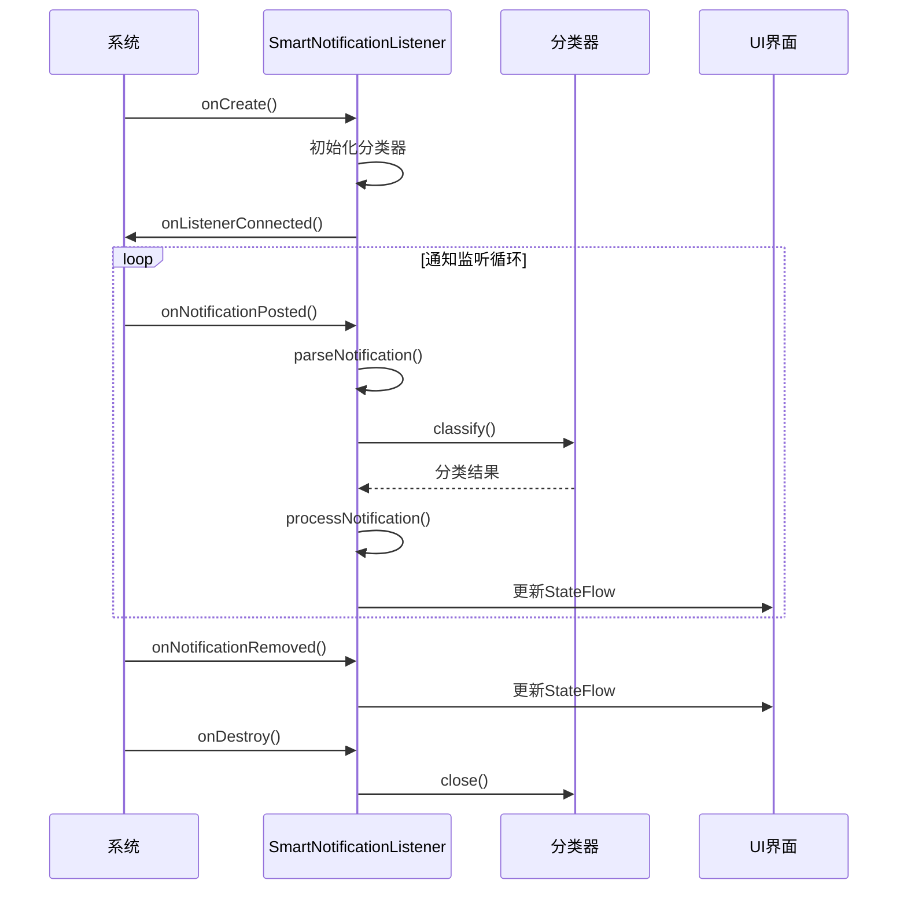
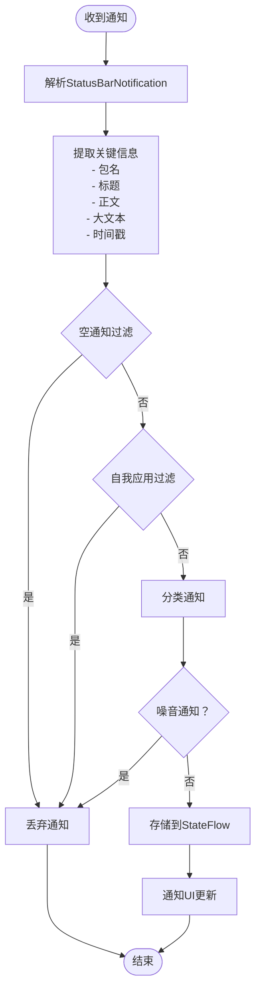
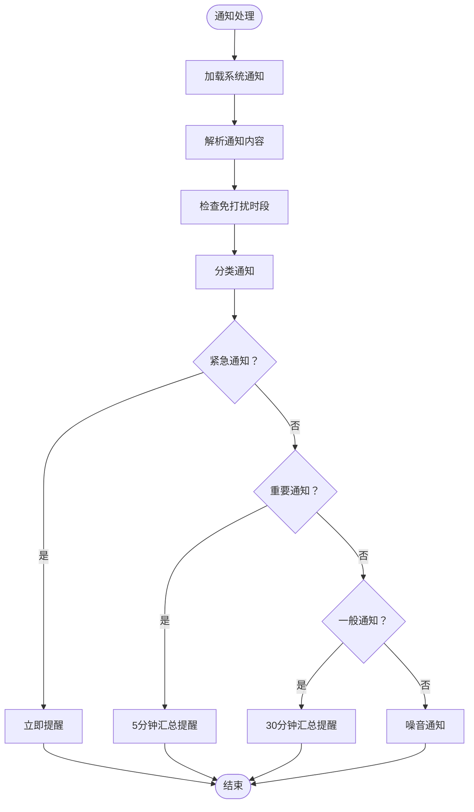
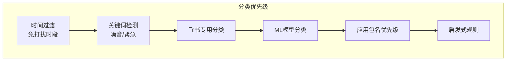
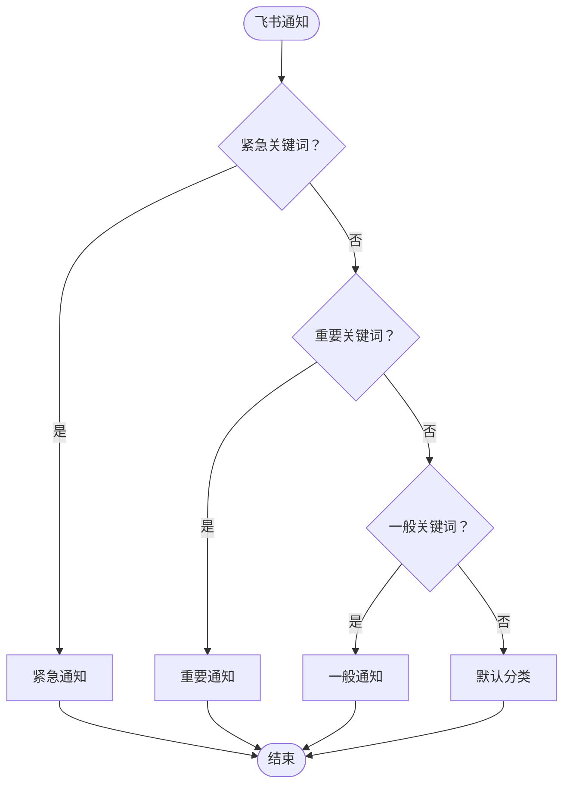
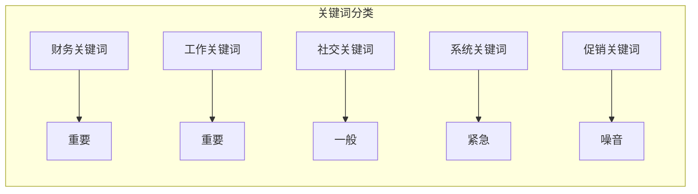
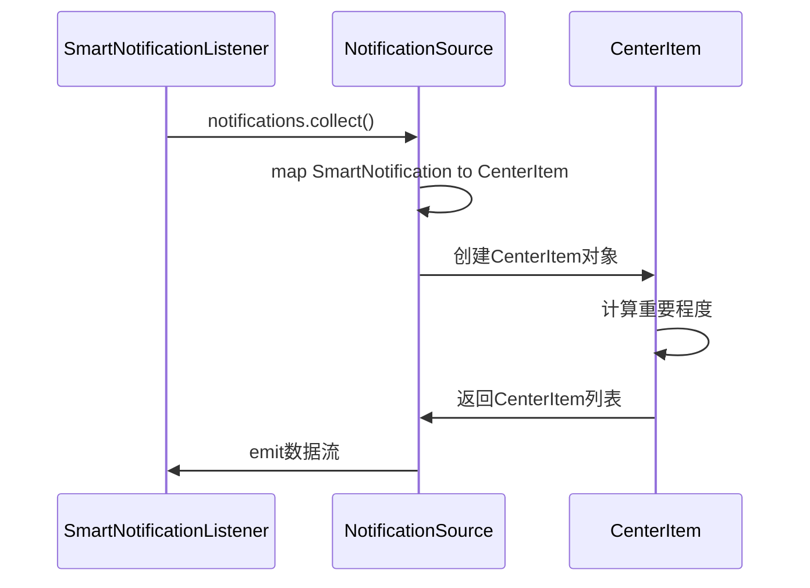
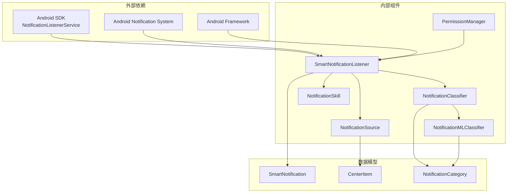

# 智能通知监听器

<cite>
**本文档引用的文件**
- [SmartNotificationListener.kt](file://app/src/main/java/ai/openclaw/android/notification/SmartNotificationListener.kt)
- [NotificationClassifier.kt](file://app/src/main/java/ai/openclaw/android/notification/NotificationClassifier.kt)
- [NotificationMLClassifier.kt](file://app/src/main/java/ai/openclaw/android/notification/NotificationMLClassifier.kt)
- [NotificationSkill.kt](file://app/src/main/java/ai/openclaw/android/skill/builtin/NotificationSkill.kt)
- [NotificationSource.kt](file://app/src/main/java/ai/openclaw/android/personalcenter/sources/NotificationSource.kt)
- [PermissionManager.kt](file://app/src/main/java/ai/openclaw/android/permission/PermissionManager.kt)
- [AndroidManifest.xml](file://app/src/main/AndroidManifest.xml)
- [MainActivity.kt](file://app/src/main/java/ai/openclaw/android/MainActivity.kt)
- [CenterItem.kt](file://app/src/main/java/ai/openclaw/android/personalcenter/models/CenterItem.kt)
- [PersonalCenterScreen.kt](file://app/src/main/java/ai/openclaw/android/personalcenter/PersonalCenterScreen.kt)
</cite>

## 目录
1. [简介](#简介)
2. [项目结构](#项目结构)
3. [核心组件](#核心组件)
4. [架构概览](#架构概览)
5. [详细组件分析](#详细组件分析)
6. [依赖关系分析](#依赖关系分析)
7. [性能考虑](#性能考虑)
8. [故障排除指南](#故障排除指南)
9. [结论](#结论)
10. [附录](#附录)

## 简介

智能通知监听器是 OpenClaw Android 应用中的核心组件，负责系统级通知的捕获、分类和管理。该系统实现了完整的通知监听机制，包括通知监听器的注册、权限申请和生命周期管理，以及通知数据的提取和解析过程。

该组件通过继承 Android 的 `NotificationListenerService`，实现了对系统通知的实时监听，并提供了智能分类功能，能够根据通知内容、应用来源和时间上下文自动分类通知为紧急、重要、一般和噪音等不同级别。

## 项目结构

智能通知监听器相关的代码主要分布在以下目录和文件中：



**图表来源**
- [SmartNotificationListener.kt:1-460](file://app/src/main/java/ai/openclaw/android/notification/SmartNotificationListener.kt#L1-L460)
- [NotificationClassifier.kt:1-476](file://app/src/main/java/ai/openclaw/android/notification/NotificationClassifier.kt#L1-L476)
- [NotificationSkill.kt:1-216](file://app/src/main/java/ai/openclaw/android/skill/builtin/NotificationSkill.kt#L1-L216)

**章节来源**
- [AndroidManifest.xml:44-104](file://app/src/main/AndroidManifest.xml#L44-L104)
- [SmartNotificationListener.kt:19-155](file://app/src/main/java/ai/openclaw/android/notification/SmartNotificationListener.kt#L19-L155)

## 核心组件

智能通知监听器系统包含以下核心组件：

### 1. SmartNotificationListener 主监听服务
- 继承自 `NotificationListenerService`
- 实现系统级通知监听
- 提供通知状态流供 UI 订阅
- 管理通知分类和存储

### 2. NotificationClassifier 通知分类器
- 基于规则的智能分类系统
- 支持时间上下文感知
- 包含紧急、重要、一般、噪音四个分类级别
- 集成飞书等特定应用的专用分类逻辑

### 3. NotificationMLClassifier ML分类器
- 基于规则的轻量级分类器
- 支持包名白名单快速匹配
- 关键词匹配和启发式规则
- 作为 TFLite 模型的兜底实现

### 4. NotificationSkill 通知技能
- 为 AI Agent 提供通知管理能力
- 支持获取通知列表、发送本地通知、删除通知等功能
- 实现技能接口规范

**章节来源**
- [SmartNotificationListener.kt:19-460](file://app/src/main/java/ai/openclaw/android/notification/SmartNotificationListener.kt#L19-L460)
- [NotificationClassifier.kt:20-476](file://app/src/main/java/ai/openclaw/android/notification/NotificationClassifier.kt#L20-L476)
- [NotificationMLClassifier.kt:14-218](file://app/src/main/java/ai/openclaw/android/notification/NotificationMLClassifier.kt#L14-L218)
- [NotificationSkill.kt:14-216](file://app/src/main/java/ai/openclaw/android/skill/builtin/NotificationSkill.kt#L14-L216)

## 架构概览

智能通知监听器采用分层架构设计，实现了松耦合和高内聚的系统结构：



**图表来源**
- [SmartNotificationListener.kt:19-460](file://app/src/main/java/ai/openclaw/android/notification/SmartNotificationListener.kt#L19-L460)
- [NotificationClassifier.kt:20-476](file://app/src/main/java/ai/openclaw/android/notification/NotificationClassifier.kt#L20-L476)
- [NotificationSkill.kt:14-216](file://app/src/main/java/ai/openclaw/android/skill/builtin/NotificationSkill.kt#L14-L216)
- [NotificationSource.kt:22-74](file://app/src/main/java/ai/openclaw/android/personalcenter/sources/NotificationSource.kt#L22-L74)

## 详细组件分析

### SmartNotificationListener 主监听服务

SmartNotificationListener 是整个通知系统的核心，负责监听系统通知并进行处理：

#### 生命周期管理



**图表来源**
- [SmartNotificationListener.kt:139-188](file://app/src/main/java/ai/openclaw/android/notification/SmartNotificationListener.kt#L139-L188)
- [SmartNotificationListener.kt:190-225](file://app/src/main/java/ai/openclaw/android/notification/SmartNotificationListener.kt#L190-L225)

#### 通知数据提取和解析

SmartNotificationListener 实现了完整的通知数据提取和解析过程：



**图表来源**
- [SmartNotificationListener.kt:297-328](file://app/src/main/java/ai/openclaw/android/notification/SmartNotificationListener.kt#L297-L328)
- [SmartNotificationListener.kt:333-353](file://app/src/main/java/ai/openclaw/android/notification/SmartNotificationListener.kt#L333-L353)

#### 通知分类处理流程



**图表来源**
- [SmartNotificationListener.kt:358-378](file://app/src/main/java/ai/openclaw/android/notification/SmartNotificationListener.kt#L358-L378)

**章节来源**
- [SmartNotificationListener.kt:19-460](file://app/src/main/java/ai/openclaw/android/notification/SmartNotificationListener.kt#L19-L460)

### NotificationClassifier 通知分类器

NotificationClassifier 实现了基于规则的智能分类系统，支持多层级的分类逻辑：

#### 分类优先级体系



**图表来源**
- [NotificationClassifier.kt:8-19](file://app/src/main/java/ai/openclaw/android/notification/NotificationClassifier.kt#L8-L19)

#### 飞书应用专用分类

NotificationClassifier 对飞书应用实现了专门的分类逻辑：



**图表来源**
- [NotificationClassifier.kt:358-380](file://app/src/main/java/ai/openclaw/android/notification/NotificationClassifier.kt#L358-L380)

**章节来源**
- [NotificationClassifier.kt:20-476](file://app/src/main/java/ai/openclaw/android/notification/NotificationClassifier.kt#L20-L476)

### NotificationMLClassifier ML分类器

NotificationMLClassifier 作为基于规则的轻量级分类器，提供了完整的分类逻辑：

#### 包名白名单分类

| 分类 | 包名集合 | 关键词集合 |
|------|----------|------------|
| 紧急 | 通讯应用 | - |
| 重要 | 工作应用 | 财务、工作、物流 |
| 一般 | 社交应用 | 社交、娱乐 |
| 噪音 | 购物应用、推广应用 | 促销、广告 |

#### 关键词分类映射



**图表来源**
- [NotificationMLClassifier.kt:78-115](file://app/src/main/java/ai/openclaw/android/notification/NotificationMLClassifier.kt#L78-L115)

**章节来源**
- [NotificationMLClassifier.kt:14-218](file://app/src/main/java/ai/openclaw/android/notification/NotificationMLClassifier.kt#L14-L218)

### NotificationSkill 通知技能

NotificationSkill 为 AI Agent 提供了完整的通知管理能力：

#### 技能工具集

| 工具名称 | 功能描述 | 参数 |
|----------|----------|------|
| list_notifications | 获取通知列表 | packageName(可选), limit(可选), includeRead(可选) |
| send_notification | 发送本地通知 | title(必需), text(必需), importance(可选) |
| delete_notification | 删除指定通知 | notificationId(必需) |
| clear_notifications | 清空所有通知 | packageName(可选) |
| mark_notification_read | 标记通知为已读 | notificationId(必需) |

**章节来源**
- [NotificationSkill.kt:14-216](file://app/src/main/java/ai/openclaw/android/skill/builtin/NotificationSkill.kt#L14-L216)

### NotificationSource 数据源

NotificationSource 作为通知数据源，包装了现有的 SmartNotificationListener 并提供统一的数据模型：

#### 数据转换流程



**图表来源**
- [NotificationSource.kt:26-45](file://app/src/main/java/ai/openclaw/android/personalcenter/sources/NotificationSource.kt#L26-L45)

**章节来源**
- [NotificationSource.kt:22-74](file://app/src/main/java/ai/openclaw/android/personalcenter/sources/NotificationSource.kt#L22-L74)

## 依赖关系分析

智能通知监听器系统的依赖关系如下：



**图表来源**
- [SmartNotificationListener.kt:19-460](file://app/src/main/java/ai/openclaw/android/notification/SmartNotificationListener.kt#L19-L460)
- [NotificationClassifier.kt:20-476](file://app/src/main/java/ai/openclaw/android/notification/NotificationClassifier.kt#L20-L476)
- [NotificationMLClassifier.kt:14-218](file://app/src/main/java/ai/openclaw/android/notification/NotificationMLClassifier.kt#L14-L218)

**章节来源**
- [SmartNotificationListener.kt:19-460](file://app/src/main/java/ai/openclaw/android/notification/SmartNotificationListener.kt#L19-L460)
- [NotificationClassifier.kt:20-476](file://app/src/main/java/ai/openclaw/android/notification/NotificationClassifier.kt#L20-L476)

## 性能考虑

智能通知监听器在设计时充分考虑了性能优化和资源管理：

### 1. 内存管理优化

- 使用 `StateFlow` 替代传统的观察者模式，提供更好的内存管理
- 限制通知列表大小为 100 条，防止内存泄漏
- 在 `onDestroy()` 中正确关闭分类器资源

### 2. 异步处理优化

- 所有通知处理都运行在协程中，避免阻塞主线程
- 使用 `SupervisorJob` 确保子协程异常不影响父协程
- 实现重试机制处理系统通知获取失败的情况

### 3. 网络和I/O优化

- 分类器资源在 `onDestroy()` 中及时释放
- 使用 `Dispatchers.Default` 处理 CPU 密集型任务
- 避免不必要的字符串操作和对象创建

### 4. 电池优化

- 免打扰时段自动降级非紧急通知
- 合理的重试间隔，避免频繁访问系统服务
- 按需加载通知数据，减少不必要的系统调用

**章节来源**
- [SmartNotificationListener.kt:137-155](file://app/src/main/java/ai/openclaw/android/notification/SmartNotificationListener.kt#L137-L155)
- [SmartNotificationListener.kt:231-292](file://app/src/main/java/ai/openclaw/android/notification/SmartNotificationListener.kt#L231-L292)

## 故障排除指南

### 1. 通知监听权限问题

**症状**: 无法获取任何通知或出现 SecurityException

**解决方案**:
- 检查 AndroidManifest.xml 中的权限声明
- 确认用户已在系统设置中启用了通知监听权限
- 验证服务声明正确配置

**章节来源**
- [AndroidManifest.xml:44-46](file://app/src/main/AndroidManifest.xml#L44-L46)
- [SmartNotificationListener.kt:162-172](file://app/src/main/java/ai/openclaw/android/notification/SmartNotificationListener.kt#L162-L172)

### 2. 通知获取失败

**症状**: `getActiveNotifications()` 返回空列表

**可能原因**:
- 监听器尚未连接
- 系统服务暂时不可用
- 用户拒绝了通知监听权限

**解决方案**:
- 实现重试机制，最多重试 5 次
- 延迟 5 秒后再尝试获取通知
- 检查 `isConnected` 状态

**章节来源**
- [SmartNotificationListener.kt:53-84](file://app/src/main/java/ai/openclaw/android/notification/SmartNotificationListener.kt#L53-L84)
- [SmartNotificationListener.kt:231-292](file://app/src/main/java/ai/openclaw/android/notification/SmartNotificationListener.kt#L231-L292)

### 3. 分类结果不符合预期

**症状**: 通知被错误分类

**排查步骤**:
- 检查分类器配置是否正确
- 验证关键词库是否包含相关词汇
- 确认应用包名是否在正确的分类组中

**章节来源**
- [NotificationClassifier.kt:298-356](file://app/src/main/java/ai/openclaw/android/notification/NotificationClassifier.kt#L298-L356)

### 4. UI 更新延迟

**症状**: 界面显示的通知不是最新状态

**解决方案**:
- 确保使用 `StateFlow` 正确订阅通知流
- 检查协程作用域是否正确管理
- 验证 UI 层是否正确响应状态变化

**章节来源**
- [SmartNotificationListener.kt:24-26](file://app/src/main/java/ai/openclaw/android/notification/SmartNotificationListener.kt#L24-L26)

## 结论

智能通知监听器系统是一个设计精良、功能完整的 Android 通知管理系统。它成功实现了以下目标：

1. **完整的系统级通知监听**: 通过继承 `NotificationListenerService` 实现了对系统通知的实时监听
2. **智能分类机制**: 基于规则和时间上下文的多层级分类系统
3. **良好的架构设计**: 分层架构确保了组件间的松耦合和高内聚
4. **性能优化**: 通过协程、内存管理和资源控制确保了系统的高效运行
5. **用户体验**: 提供了直观的 UI 界面和灵活的配置选项

该系统为 AI Agent 提供了强大的通知管理能力，能够有效地帮助用户管理来自各种应用的通知信息，提高信息处理效率和用户体验。

## 附录

### 配置示例

#### AndroidManifest.xml 权限配置

```xml
<!-- 通知监听权限 -->
<uses-permission android:name="android.permission.BIND_NOTIFICATION_LISTENER_SERVICE" />

<!-- 通知监听服务声明 -->
<service
    android:name=".notification.SmartNotificationListener"
    android:enabled="true"
    android:exported="true"
    android:permission="android.permission.BIND_NOTIFICATION_LISTENER_SERVICE">
    <intent-filter>
        <action android:name="android.service.notification.NotificationListenerService" />
    </intent-filter>
</service>
```

#### 通知技能使用示例

```kotlin
// 获取通知列表
val notifications = notificationSkill.list_notifications(mapOf(
    "packageName" to "com.example.app",
    "limit" to 20,
    "includeRead" to false
))

// 发送本地通知
notificationSkill.send_notification(mapOf(
    "title" to "测试通知",
    "text" to "这是测试内容",
    "importance" to "high"
))
```

### 最佳实践建议

1. **权限管理**: 始终检查和请求必要的权限
2. **资源释放**: 在适当的生命周期方法中释放资源
3. **错误处理**: 实现完善的异常处理和重试机制
4. **性能监控**: 定期监控内存使用和处理性能
5. **兼容性**: 考虑不同 Android 版本的兼容性问题