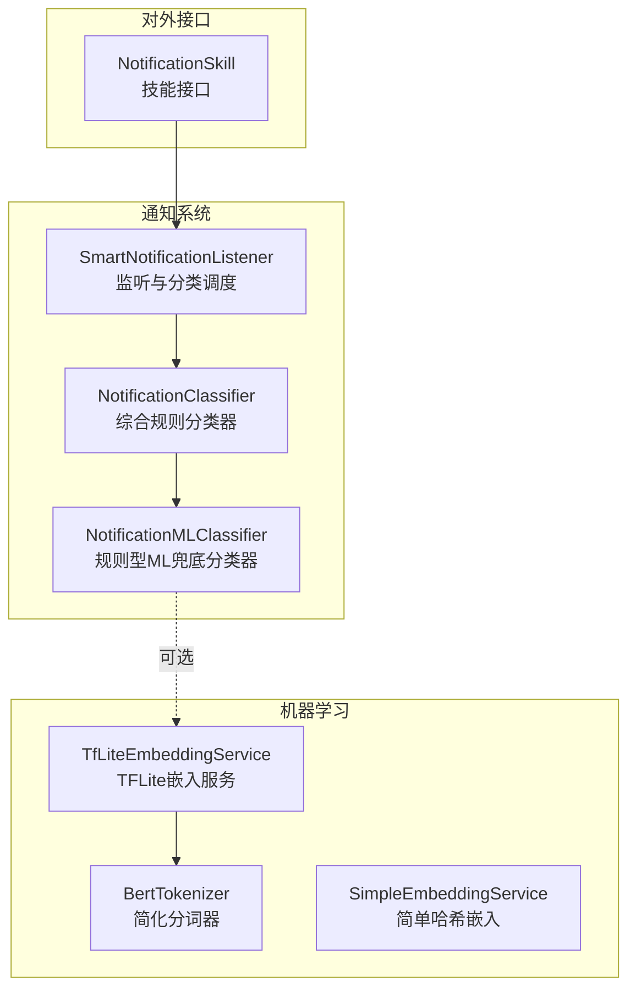
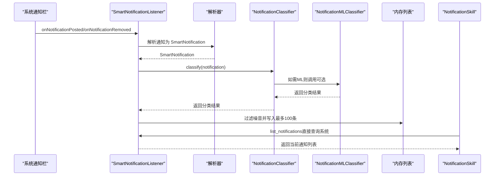
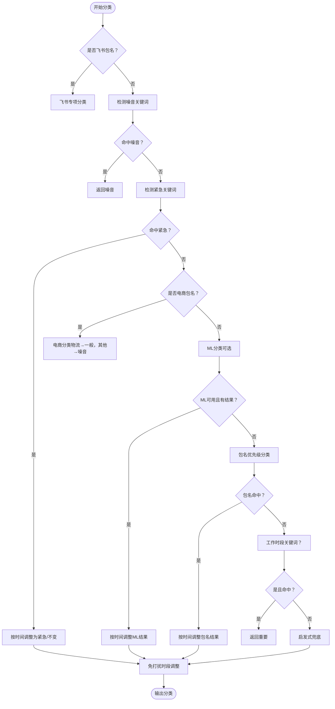
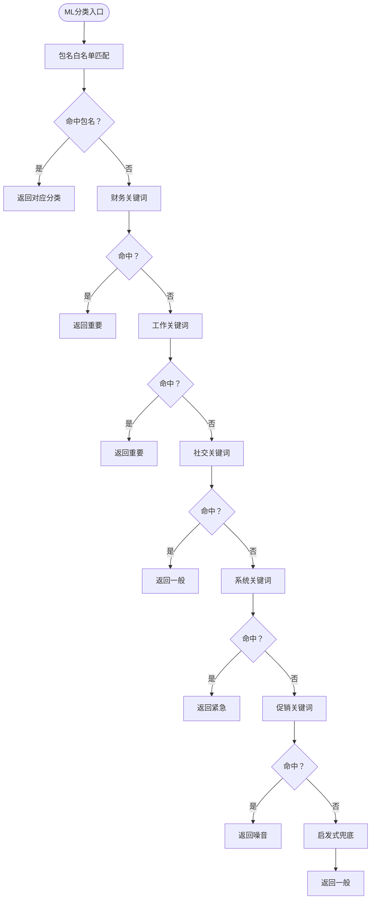
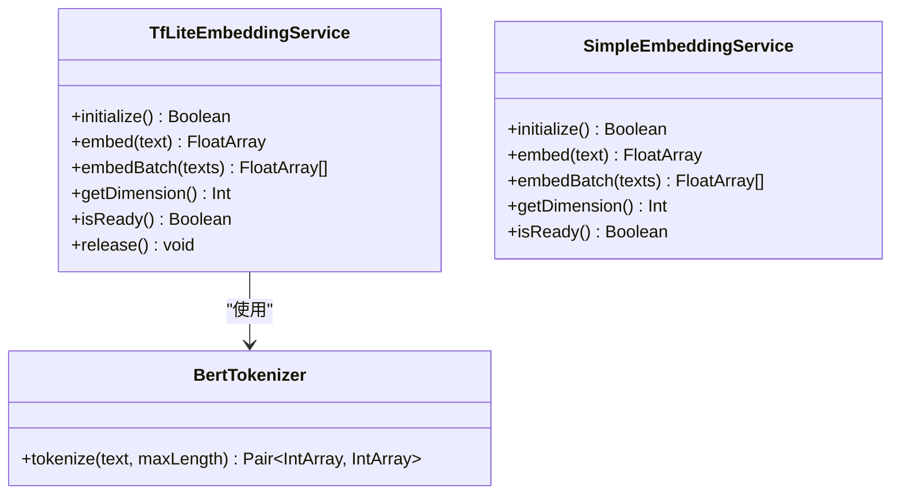
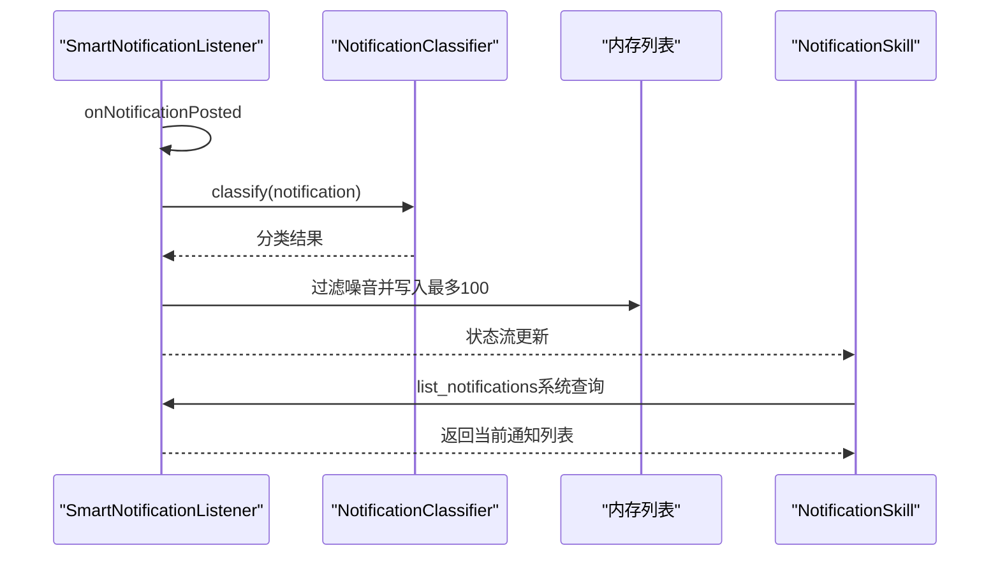
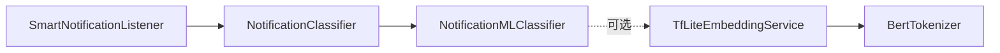

# 通知分类算法

<cite>
**本文引用的文件**
- [NotificationClassifier.kt](file://app/src/main/java/ai/openclaw/android/notification/NotificationClassifier.kt)
- [NotificationMLClassifier.kt](file://app/src/main/java/ai/openclaw/android/notification/NotificationMLClassifier.kt)
- [SmartNotificationListener.kt](file://app/src/main/java/ai/openclaw/android/notification/SmartNotificationListener.kt)
- [NotificationSkill.kt](file://app/src/main/java/ai/openclaw/android/skill/builtin/NotificationSkill.kt)
- [TfLiteEmbeddingService.kt](file://app/src/main/java/ai/openclaw/android/ml/TfLiteEmbeddingService.kt)
- [BertTokenizer.kt](file://app/src/main/java/ai/openclaw/android/ml/BertTokenizer.kt)
- [SimpleEmbeddingService.kt](file://app/src/main/java/ai/openclaw/android/ml/SimpleEmbeddingService.kt)
- [README.md（模型说明）](file://app/src/main/assets/models/README.md)
</cite>

## 目录
1. [简介](#简介)
2. [项目结构](#项目结构)
3. [核心组件](#核心组件)
4. [架构总览](#架构总览)
5. [详细组件分析](#详细组件分析)
6. [依赖关系分析](#依赖关系分析)
7. [性能考量](#性能考量)
8. [故障排查指南](#故障排查指南)
9. [结论](#结论)
10. [附录](#附录)

## 简介
本文件面向通知分类算法的技术文档，系统阐述传统规则分类器与机器学习分类器的实现原理、特征工程、训练与评估、实时推理与批量处理策略、准确率优化与误分类处理机制，以及参数调优与自定义规则扩展方法。该系统以 Android 通知监听服务为基础，结合规则与可选的 TFLite 模型，对通知进行紧急、重要、一般、噪音四类分级，并提供统一的数据模型与对外接口。

## 项目结构
通知分类相关代码主要位于以下模块：
- 通知监听与分类：SmartNotificationListener、NotificationClassifier、NotificationMLClassifier
- 通知技能接口：NotificationSkill（对外提供“列出通知”等能力）
- 机器学习嵌入与分词：TfLiteEmbeddingService、BertTokenizer、SimpleEmbeddingService
- 模型说明与占位：assets/models/README.md（描述模型格式与要求）

图表来源
- [SmartNotificationListener.kt:19-432](file://app/src/main/java/ai/openclaw/android/notification/SmartNotificationListener.kt#L19-L432)
- [NotificationClassifier.kt:20-475](file://app/src/main/java/ai/openclaw/android/notification/NotificationClassifier.kt#L20-L475)
- [NotificationMLClassifier.kt:14-217](file://app/src/main/java/ai/openclaw/android/notification/NotificationMLClassifier.kt#L14-L217)
- [TfLiteEmbeddingService.kt:13-96](file://app/src/main/java/ai/openclaw/android/ml/TfLiteEmbeddingService.kt#L13-L96)
- [BertTokenizer.kt:5-43](file://app/src/main/java/ai/openclaw/android/ml/BertTokenizer.kt#L5-L43)
- [SimpleEmbeddingService.kt:19-106](file://app/src/main/java/ai/openclaw/android/ml/SimpleEmbeddingService.kt#L19-L106)
- [NotificationSkill.kt:14-215](file://app/src/main/java/ai/openclaw/android/skill/builtin/NotificationSkill.kt#L14-L215)

章节来源
- [SmartNotificationListener.kt:19-432](file://app/src/main/java/ai/openclaw/android/notification/SmartNotificationListener.kt#L19-L432)
- [NotificationClassifier.kt:20-475](file://app/src/main/java/ai/openclaw/android/notification/NotificationClassifier.kt#L20-L475)
- [NotificationMLClassifier.kt:14-217](file://app/src/main/java/ai/openclaw/android/notification/NotificationMLClassifier.kt#L14-L217)
- [TfLiteEmbeddingService.kt:13-96](file://app/src/main/java/ai/openclaw/android/ml/TfLiteEmbeddingService.kt#L13-L96)
- [BertTokenizer.kt:5-43](file://app/src/main/java/ai/openclaw/android/ml/BertTokenizer.kt#L5-L43)
- [SimpleEmbeddingService.kt:19-106](file://app/src/main/java/ai/openclaw/android/ml/SimpleEmbeddingService.kt#L19-L106)
- [NotificationSkill.kt:14-215](file://app/src/main/java/ai/openclaw/android/skill/builtin/NotificationSkill.kt#L14-L215)

## 核心组件
- 通知监听与分类调度：SmartNotificationListener 负责监听系统通知、解析、分类、存储与事件发布。
- 综合规则分类器：NotificationClassifier 实现多阶段规则匹配（飞书专项、关键词、电商、ML、包名优先级、启发式、时间调整）。
- 规则型ML兜底分类器：NotificationMLClassifier 在无模型时提供基于包名与关键词的分类。
- 机器学习嵌入：TfLiteEmbeddingService 与 BertTokenizer 提供文本嵌入能力；SimpleEmbeddingService 提供降级方案。
- 对外接口：NotificationSkill 提供“列出通知”等技能，内部直接调用监听器的系统查询能力。

章节来源
- [SmartNotificationListener.kt:19-432](file://app/src/main/java/ai/openclaw/android/notification/SmartNotificationListener.kt#L19-L432)
- [NotificationClassifier.kt:20-475](file://app/src/main/java/ai/openclaw/android/notification/NotificationClassifier.kt#L20-L475)
- [NotificationMLClassifier.kt:14-217](file://app/src/main/java/ai/openclaw/android/notification/NotificationMLClassifier.kt#L14-L217)
- [TfLiteEmbeddingService.kt:13-96](file://app/src/main/java/ai/openclaw/android/ml/TfLiteEmbeddingService.kt#L13-L96)
- [BertTokenizer.kt:5-43](file://app/src/main/java/ai/openclaw/android/ml/BertTokenizer.kt#L5-L43)
- [SimpleEmbeddingService.kt:19-106](file://app/src/main/java/ai/openclaw/android/ml/SimpleEmbeddingService.kt#L19-L106)
- [NotificationSkill.kt:14-215](file://app/src/main/java/ai/openclaw/android/skill/builtin/NotificationSkill.kt#L14-L215)

## 架构总览
系统采用“监听-解析-分类-存储-接口”的流水线式架构。监听服务负责从系统通知栏抓取通知，解析为统一数据模型，交由规则分类器进行多级判定，最终将非噪音通知写入内存列表并可触发后续动作或事件。若存在 TFLite 模型，可在规则之后进行二次分类。

图表来源
- [SmartNotificationListener.kt:190-353](file://app/src/main/java/ai/openclaw/android/notification/SmartNotificationListener.kt#L190-L353)
- [NotificationClassifier.kt:298-356](file://app/src/main/java/ai/openclaw/android/notification/NotificationClassifier.kt#L298-L356)
- [NotificationMLClassifier.kt:121-169](file://app/src/main/java/ai/openclaw/android/notification/NotificationMLClassifier.kt#L121-L169)
- [NotificationSkill.kt:71-103](file://app/src/main/java/ai/openclaw/android/skill/builtin/NotificationSkill.kt#L71-L103)

## 详细组件分析

### 传统规则分类器（NotificationClassifier）
- 分类优先级链路：
  1) 飞书专项分类（紧急/重要/一般/噪音）
  2) 噪音关键词检测（命中即噪音）
  3) 紧急关键词检测（命中则紧急，受免打扰时段影响）
  4) 电商通知特殊处理（物流升级为一般，其他降噪）
  5) ML模型分类（可选，若可用则覆盖）
  6) 包名优先级（噪音/紧急/重要/一般）
  7) 工作时段关键词提升（工作时段内提升为重要）
  8) 启发式兜底（IM消息、系统/平台通知等）
  9) 时间调整（免打扰时段对非紧急降级）
- 关键词与包名库：
  - 噪音关键词、紧急关键词、工作关键词
  - 飞书紧急/重要/一般/噪音关键词
  - 急切应用、重要应用、一般应用、噪音应用、电商应用及物流关键词
- 时间上下文：
  - 免打扰时段（夜间）、工作时段（工作日工作时间），用于动态调整分类结果
- 特征工程要点：
  - 文本预处理：统一转小写，拼接标题与正文
  - 关键词匹配：大小写无关的包含匹配
  - 正则表达式：IM消息的冒号/AT匹配
  - 包名映射：按应用类别快速分流
- 错误处理与健壮性：
  - 包名解析异常回退
  - ML不可用时自动降级至规则分类
  - 免打扰时段强制降级策略

图表来源
- [NotificationClassifier.kt:298-413](file://app/src/main/java/ai/openclaw/android/notification/NotificationClassifier.kt#L298-L413)

章节来源
- [NotificationClassifier.kt:20-475](file://app/src/main/java/ai/openclaw/android/notification/NotificationClassifier.kt#L20-L475)

### 规则型ML兜底分类器（NotificationMLClassifier）
- 设计目标：在无模型时提供稳定分类，避免空指针或错误返回。
- 分类流程：
  1) 包名白名单快速匹配（系统/工作/金融/社交/购物/促销）
  2) 关键词匹配（财务>工作>社交>系统>促销）
  3) 启发式兜底（冒号/链接等启发式规则）
- 关键词优先级与包名映射均内置，便于快速响应与低开销运行。

图表来源
- [NotificationMLClassifier.kt:121-205](file://app/src/main/java/ai/openclaw/android/notification/NotificationMLClassifier.kt#L121-L205)

章节来源
- [NotificationMLClassifier.kt:14-217](file://app/src/main/java/ai/openclaw/android/notification/NotificationMLClassifier.kt#L14-L217)

### 机器学习分类器（TFLite + 嵌入）
- 模型说明与占位：
  - assets/models/README.md 描述了模型格式（BertNLClassifier兼容TFLite）、输入输出、训练数据特征与降级策略。
  - 当模型文件不存在时，系统优雅降级至规则分类，不抛出运行时异常。
- 嵌入服务与分词：
  - TfLiteEmbeddingService：加载模型与词表，提供文本嵌入与批处理能力。
  - BertTokenizer：简化版分词器，生成 input_ids 与 attention_mask。
  - SimpleEmbeddingService：无模型时的降级替代，基于一致性哈希生成向量。
- 训练与评估建议（基于模型说明）：
  - 输入特征：应用包名、通知标题、通知正文
  - 输出类别：紧急、重要、一般、噪音（带置信度）
  - 评估指标：准确率、召回率、F1、混淆矩阵（建议在离线数据集上计算）
  - 训练数据准备：标注样本需覆盖四大类，尤其关注跨应用的通用关键词与上下文差异

图表来源
- [TfLiteEmbeddingService.kt:13-96](file://app/src/main/java/ai/openclaw/android/ml/TfLiteEmbeddingService.kt#L13-L96)
- [BertTokenizer.kt:5-43](file://app/src/main/java/ai/openclaw/android/ml/BertTokenizer.kt#L5-L43)
- [SimpleEmbeddingService.kt:19-106](file://app/src/main/java/ai/openclaw/android/ml/SimpleEmbeddingService.kt#L19-L106)

章节来源
- [README.md（模型说明）:1-26](file://app/src/main/assets/models/README.md#L1-L26)
- [TfLiteEmbeddingService.kt:13-96](file://app/src/main/java/ai/openclaw/android/ml/TfLiteEmbeddingService.kt#L13-L96)
- [BertTokenizer.kt:5-43](file://app/src/main/java/ai/openclaw/android/ml/BertTokenizer.kt#L5-L43)
- [SimpleEmbeddingService.kt:19-106](file://app/src/main/java/ai/openclaw/android/ml/SimpleEmbeddingService.kt#L19-L106)

### 通知监听与实时推理（SmartNotificationListener）
- 实时监听：
  - onNotificationPosted：解析、分类、过滤噪音、写入内存列表（最多100条）
  - onNotificationRemoved：同步移除
- 批量处理策略：
  - 启动时延迟拉取系统通知，重试机制保障稳定性
  - 直接从系统查询接口返回最新通知列表，供技能调用
- 事件发布：
  - 分类完成后发布触发事件，供规则引擎使用
- 状态管理：
  - 使用协程与状态流维护通知列表，支持标记已读、删除、清空等操作

图表来源
- [SmartNotificationListener.kt:190-353](file://app/src/main/java/ai/openclaw/android/notification/SmartNotificationListener.kt#L190-L353)
- [NotificationSkill.kt:71-103](file://app/src/main/java/ai/openclaw/android/skill/builtin/NotificationSkill.kt#L71-L103)

章节来源
- [SmartNotificationListener.kt:19-432](file://app/src/main/java/ai/openclaw/android/notification/SmartNotificationListener.kt#L19-L432)
- [NotificationSkill.kt:62-103](file://app/src/main/java/ai/openclaw/android/skill/builtin/NotificationSkill.kt#L62-L103)

## 依赖关系分析
- 组件耦合：
  - SmartNotificationListener 依赖 NotificationClassifier；NotificationClassifier 内部组合 NotificationMLClassifier
  - 机器学习路径可选，TfLiteEmbeddingService 与 BertTokenizer 仅在模型可用时启用
- 外部依赖：
  - Android NotificationListenerService
  - Tensorflow Lite Interpreter
  - Android 系统通知栏 API

图表来源
- [SmartNotificationListener.kt:19-143](file://app/src/main/java/ai/openclaw/android/notification/SmartNotificationListener.kt#L19-L143)
- [NotificationClassifier.kt:34-34](file://app/src/main/java/ai/openclaw/android/notification/NotificationClassifier.kt#L34-L34)
- [NotificationMLClassifier.kt:14-14](file://app/src/main/java/ai/openclaw/android/notification/NotificationMLClassifier.kt#L14-L14)
- [TfLiteEmbeddingService.kt:13-24](file://app/src/main/java/ai/openclaw/android/ml/TfLiteEmbeddingService.kt#L13-L24)

章节来源
- [SmartNotificationListener.kt:19-143](file://app/src/main/java/ai/openclaw/android/notification/SmartNotificationListener.kt#L19-L143)
- [NotificationClassifier.kt:34-34](file://app/src/main/java/ai/openclaw/android/notification/NotificationClassifier.kt#L34-L34)
- [NotificationMLClassifier.kt:14-14](file://app/src/main/java/ai/openclaw/android/notification/NotificationMLClassifier.kt#L14-L14)
- [TfLiteEmbeddingService.kt:13-24](file://app/src/main/java/ai/openclaw/android/ml/TfLiteEmbeddingService.kt#L13-L24)

## 性能考量
- 实时推理：
  - 规则匹配为 O(k)（k 为关键词/包名集合规模），常数小，适合高频实时分类
  - ML 路径在无模型时完全跳过，避免额外开销
- 批量处理：
  - 启动时系统查询采用重试与延迟策略，降低冷启动失败概率
  - 内存列表上限控制在 100 条，避免内存膨胀
- 机器学习：
  - 嵌入服务初始化失败时自动降级，不影响主线流程
  - 建议在后台线程执行嵌入与推理，避免阻塞 UI

## 故障排查指南
- 无通知显示或分类异常：
  - 检查通知监听权限是否授予
  - 查看启动时系统查询日志与重试记录
- ML 分类不可用：
  - 确认模型文件是否存在；若缺失，系统将自动降级
- 分类结果不符合预期：
  - 检查关键词库与包名映射是否覆盖目标应用
  - 调整免打扰时段与工作时段配置
- 性能问题：
  - 关注规则匹配耗时与系统查询重试次数
  - 适当减少内存列表上限或优化关键词集合

章节来源
- [SmartNotificationListener.kt:157-181](file://app/src/main/java/ai/openclaw/android/notification/SmartNotificationListener.kt#L157-L181)
- [README.md（模型说明）:22-25](file://app/src/main/assets/models/README.md#L22-L25)

## 结论
该通知分类系统以规则为主、ML为辅，兼顾实时性与鲁棒性。通过多层次规则与时间上下文调整，能够有效区分紧急、重要、一般与噪音通知；在具备模型时可进一步提升语义理解能力。系统提供清晰的扩展点（关键词库、包名映射、时间阈值）与降级策略，便于持续优化与定制。

## 附录

### 分类特征工程清单
- 文本预处理
  - 统一转小写、拼接标题与正文
  - 截断长文本（如 bigText）
- 关键词提取
  - 噪音/紧急/工作/飞书/电商等关键词库
  - 金融、工作、社交、系统、促销等主题关键词
- 正则表达式匹配
  - IM 消息冒号/AT 表达式
- 包名优先级
  - 噪音/紧急/重要/一般应用集合
- 时间上下文
  - 免打扰时段、工作时段、周末判断

章节来源
- [NotificationClassifier.kt:270-291](file://app/src/main/java/ai/openclaw/android/notification/NotificationClassifier.kt#L270-L291)
- [NotificationMLClassifier.kt:174-184](file://app/src/main/java/ai/openclaw/android/notification/NotificationMLClassifier.kt#L174-L184)

### 机器学习训练与评估要点
- 训练数据准备
  - 标注样本需覆盖四大类，涵盖不同应用与场景
  - 特征包括：包名、标题、正文
- 模型选择
  - BertNLClassifier 兼容的 TFLite 模型
- 性能评估
  - 指标：准确率、召回率、F1、混淆矩阵
  - 建议离线评估与 A/B 对比

章节来源
- [README.md（模型说明）:15-21](file://app/src/main/assets/models/README.md#L15-L21)

### 实时推理与批量处理策略
- 实时推理
  - onNotificationPosted 中即时分类与过滤
- 批量处理
  - 启动时系统查询 + 重试机制
  - 技能接口直接查询系统通知栏

章节来源
- [SmartNotificationListener.kt:231-292](file://app/src/main/java/ai/openclaw/android/notification/SmartNotificationListener.kt#L231-L292)
- [NotificationSkill.kt:71-103](file://app/src/main/java/ai/openclaw/android/skill/builtin/NotificationSkill.kt#L71-L103)

### 准确率优化与误分类处理
- 误分类处理
  - 噪音关键词优先级最高，命中即过滤
  - 免打扰时段对非紧急降级，避免打扰
- 优化建议
  - 动态调整关键词权重与阈值
  - 引入反馈机制（如用户标记）回流训练
  - 增加跨应用通用关键词与领域特定关键词

章节来源
- [NotificationClassifier.kt:312-413](file://app/src/main/java/ai/openclaw/android/notification/NotificationClassifier.kt#L312-L413)

### 参数调优与自定义规则扩展
- 关键词库与包名映射
  - 新增应用或场景时，扩展对应集合
- 时间阈值
  - 调整免打扰时段与工作时段边界
- 正则表达式
  - 扩展 IM/链接等启发式规则
- ML 模型
  - 替换/更新模型文件，确保格式兼容
  - 评估模型在目标数据集上的表现

章节来源
- [NotificationClassifier.kt:36-202](file://app/src/main/java/ai/openclaw/android/notification/NotificationClassifier.kt#L36-L202)
- [NotificationMLClassifier.kt:17-115](file://app/src/main/java/ai/openclaw/android/notification/NotificationMLClassifier.kt#L17-L115)
- [README.md（模型说明）:1-26](file://app/src/main/assets/models/README.md#L1-L26)