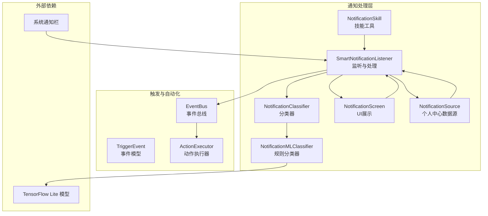
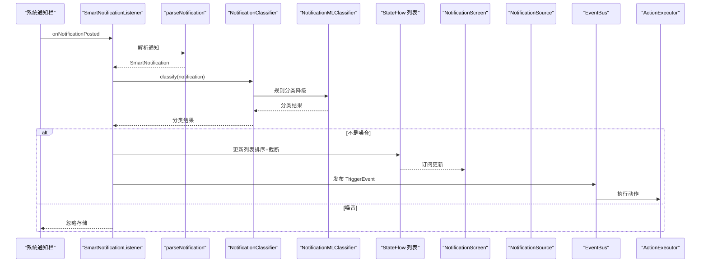
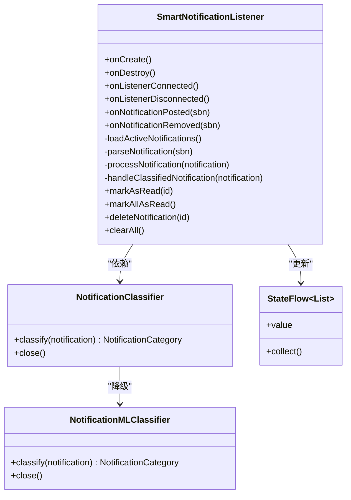
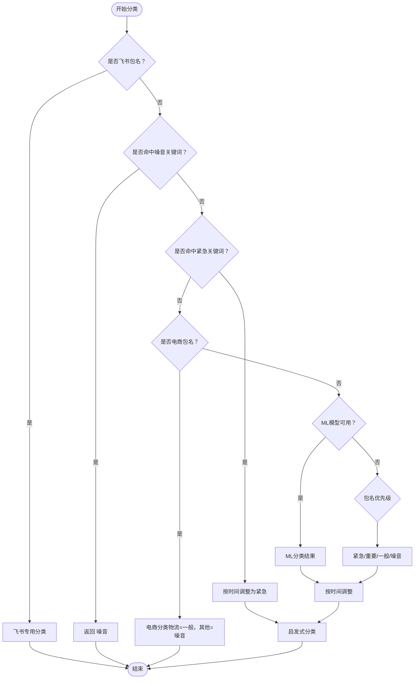
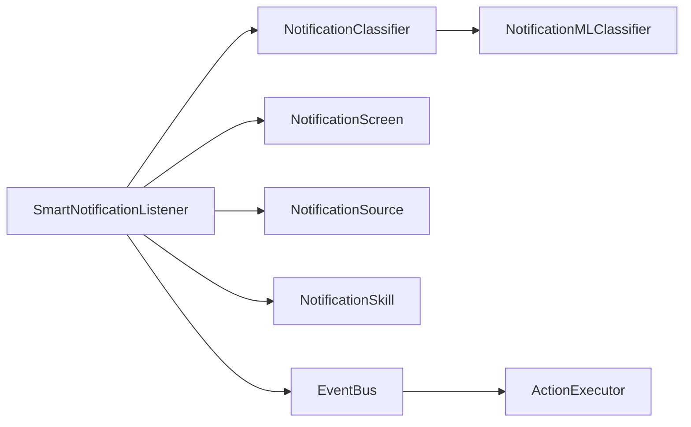

# 通知处理流程

<cite>
**本文引用的文件**
- [SmartNotificationListener.kt](file://app/src/main/java/ai/openclaw/android/notification/SmartNotificationListener.kt)
- [NotificationClassifier.kt](file://app/src/main/java/ai/openclaw/android/notification/NotificationClassifier.kt)
- [NotificationMLClassifier.kt](file://app/src/main/java/ai/openclaw/android/notification/NotificationMLClassifier.kt)
- [NotificationScreen.kt](file://app/src/main/java/ai/openclaw/android/notification/NotificationScreen.kt)
- [NotificationSource.kt](file://app/src/main/java/ai/openclaw/android/personalcenter/sources/NotificationSource.kt)
- [NotificationSkill.kt](file://app/src/main/java/ai/openclaw/android/skill/builtin/NotificationSkill.kt)
- [README.md](file://app/src/main/assets/models/README.md)
- [TriggerEvent.kt](file://docs/plans/2026-04-16-cron-event-trigger-plan.md)
- [EventBus.kt](file://docs/plans/2026-04-16-cron-event-trigger-plan.md)
- [ActionExecutor.kt](file://app/src/main/java/ai/openclaw/android/trigger/ActionExecutor.kt)
</cite>

## 目录
1. [简介](#简介)
2. [项目结构](#项目结构)
3. [核心组件](#核心组件)
4. [架构总览](#架构总览)
5. [详细组件分析](#详细组件分析)
6. [依赖关系分析](#依赖关系分析)
7. [性能考虑](#性能考虑)
8. [故障排查指南](#故障排查指南)
9. [结论](#结论)
10. [附录](#附录)

## 简介
本技术文档围绕通知处理的完整生命周期进行深入解析，涵盖从系统通知捕获、解析、分类、存储、展示到后续触发自动化动作的全过程。文档重点说明以下方面：
- 状态管理：通知状态流、UI订阅与更新机制
- 处理队列与并发控制：协程作用域、SupervisorJob、Dispatchers.Default
- 优先级调度与资源分配：分类优先级、时间上下文调整、容量限制
- 错误处理与异常恢复：权限检查、重试机制、降级策略
- 异步执行与回调管理：StateFlow、事件总线、技能工具链
- 性能监控与瓶颈分析：日志记录、超时与重试、内存与CPU占用
- 配置选项与扩展指导：模型文件放置、规则配置、自定义处理逻辑

## 项目结构
通知处理相关模块主要分布在以下路径：
- 通知监听与处理：SmartNotificationListener
- 分类器：NotificationClassifier、NotificationMLClassifier
- UI 展示：NotificationScreen
- 数据源包装：NotificationSource
- 技能工具：NotificationSkill
- 触发与自动化：TriggerEvent、EventBus、ActionExecutor
- 模型说明：assets/models/README.md

图表来源
- [SmartNotificationListener.kt:19-432](file://app/src/main/java/ai/openclaw/android/notification/SmartNotificationListener.kt#L19-L432)
- [NotificationClassifier.kt:20-476](file://app/src/main/java/ai/openclaw/android/notification/NotificationClassifier.kt#L20-L476)
- [NotificationMLClassifier.kt:14-218](file://app/src/main/java/ai/openclaw/android/notification/NotificationMLClassifier.kt#L14-L218)
- [NotificationScreen.kt:35-407](file://app/src/main/java/ai/openclaw/android/notification/NotificationScreen.kt#L35-L407)
- [NotificationSource.kt:22-74](file://app/src/main/java/ai/openclaw/android/personalcenter/sources/NotificationSource.kt#L22-L74)
- [NotificationSkill.kt:14-216](file://app/src/main/java/ai/openclaw/android/skill/builtin/NotificationSkill.kt#L14-L216)
- [TriggerEvent.kt:128-142](file://docs/plans/2026-04-16-cron-event-trigger-plan.md#L128-L142)
- [EventBus.kt:144-164](file://docs/plans/2026-04-16-cron-event-trigger-plan.md#L144-L164)
- [ActionExecutor.kt:113-191](file://app/src/main/java/ai/openclaw/android/trigger/ActionExecutor.kt#L113-L191)

章节来源
- [SmartNotificationListener.kt:19-432](file://app/src/main/java/ai/openclaw/android/notification/SmartNotificationListener.kt#L19-L432)
- [NotificationClassifier.kt:20-476](file://app/src/main/java/ai/openclaw/android/notification/NotificationClassifier.kt#L20-L476)
- [NotificationMLClassifier.kt:14-218](file://app/src/main/java/ai/openclaw/android/notification/NotificationMLClassifier.kt#L14-L218)
- [NotificationScreen.kt:35-407](file://app/src/main/java/ai/openclaw/android/notification/NotificationScreen.kt#L35-L407)
- [NotificationSource.kt:22-74](file://app/src/main/java/ai/openclaw/android/personalcenter/sources/NotificationSource.kt#L22-L74)
- [NotificationSkill.kt:14-216](file://app/src/main/java/ai/openclaw/android/skill/builtin/NotificationSkill.kt#L14-L216)
- [README.md:1-26](file://app/src/main/assets/models/README.md#L1-L26)

## 核心组件
- SmartNotificationListener：继承 NotificationListenerService，负责监听系统通知、解析、分类、存储、UI同步与触发自动化事件。
- NotificationClassifier：主分类器，结合关键词、包名优先级、时间上下文与ML模型进行综合分类。
- NotificationMLClassifier：基于规则的轻量分类器，作为ML模型不可用时的降级方案。
- NotificationScreen：Compose UI，展示通知列表、状态栏与操作入口。
- NotificationSource：将通知流转换为个人中心通用数据项。
- NotificationSkill：技能工具，提供列出、发送、删除、清空、标记已读通知的能力。
- TriggerEvent/EventBus/ActionExecutor：事件模型、事件总线与动作执行器，用于将通知事件转化为自动化动作。

章节来源
- [SmartNotificationListener.kt:19-432](file://app/src/main/java/ai/openclaw/android/notification/SmartNotificationListener.kt#L19-L432)
- [NotificationClassifier.kt:20-476](file://app/src/main/java/ai/openclaw/android/notification/NotificationClassifier.kt#L20-L476)
- [NotificationMLClassifier.kt:14-218](file://app/src/main/java/ai/openclaw/android/notification/NotificationMLClassifier.kt#L14-L218)
- [NotificationScreen.kt:35-407](file://app/src/main/java/ai/openclaw/android/notification/NotificationScreen.kt#L35-L407)
- [NotificationSource.kt:22-74](file://app/src/main/java/ai/openclaw/android/personalcenter/sources/NotificationSource.kt#L22-L74)
- [NotificationSkill.kt:14-216](file://app/src/main/java/ai/openclaw/android/skill/builtin/NotificationSkill.kt#L14-L216)
- [TriggerEvent.kt:128-142](file://docs/plans/2026-04-16-cron-event-trigger-plan.md#L128-L142)
- [EventBus.kt:144-164](file://docs/plans/2026-04-16-cron-event-trigger-plan.md#L144-L164)
- [ActionExecutor.kt:113-191](file://app/src/main/java/ai/openclaw/android/trigger/ActionExecutor.kt#L113-L191)

## 架构总览
通知从系统通知栏进入，经过解析与分类，写入状态流并驱动UI；同时通过事件总线触发自动化动作，技能工具提供对外能力接口。

图表来源
- [SmartNotificationListener.kt:190-353](file://app/src/main/java/ai/openclaw/android/notification/SmartNotificationListener.kt#L190-L353)
- [NotificationClassifier.kt:298-356](file://app/src/main/java/ai/openclaw/android/notification/NotificationClassifier.kt#L298-L356)
- [NotificationMLClassifier.kt:121-169](file://app/src/main/java/ai/openclaw/android/notification/NotificationMLClassifier.kt#L121-L169)
- [TriggerEvent.kt:128-142](file://docs/plans/2026-04-16-cron-event-trigger-plan.md#L128-L142)
- [EventBus.kt:144-164](file://docs/plans/2026-04-16-cron-event-trigger-plan.md#L144-L164)
- [ActionExecutor.kt:113-191](file://app/src/main/java/ai/openclaw/android/trigger/ActionExecutor.kt#L113-L191)

## 详细组件分析

### SmartNotificationListener 组件分析
- 监听与解析：覆盖 onNotificationPosted/onNotificationRemoved，解析系统通知为 SmartNotification。
- 分类与存储：调用 NotificationClassifier 进行分类，过滤噪音，限制列表大小，更新 StateFlow。
- 异步与并发：使用 Dispatchers.Default + SupervisorJob 的作用域，保证异常不影响整体协程树。
- 权限与重连：启动时延迟加载系统通知，检查权限；连接/断开状态影响 getActiveNotifications() 的可用性。
- 事件发布：将通知事件发布到 EventBus，供触发规则使用。
- 技能集成：提供 markAsRead/markAllAsRead/deleteNotification/clearAll 等操作，供 NotificationSkill 使用。

图表来源
- [SmartNotificationListener.kt:19-432](file://app/src/main/java/ai/openclaw/android/notification/SmartNotificationListener.kt#L19-L432)
- [NotificationClassifier.kt:20-476](file://app/src/main/java/ai/openclaw/android/notification/NotificationClassifier.kt#L20-L476)
- [NotificationMLClassifier.kt:14-218](file://app/src/main/java/ai/openclaw/android/notification/NotificationMLClassifier.kt#L14-L218)

章节来源
- [SmartNotificationListener.kt:19-432](file://app/src/main/java/ai/openclaw/android/notification/SmartNotificationListener.kt#L19-L432)

### NotificationClassifier 组件分析
- 分类优先级：时间过滤（免打扰时段）、关键词检测（噪音/紧急）、飞书专用分类、ML模型分类、包名优先级、启发式规则。
- 时间上下文：根据小时、周末、免打扰时段、工作时段动态调整分类结果。
- 包名优先级：紧急/重要/一般/噪音应用集合，电商通知特殊处理（物流升级为一般，其他降为噪音）。
- 关键词库：噪音/紧急/工作相关关键词，支持中英文。
- 启发式规则：即时通讯、系统应用、标题格式等启发式判断。
- ML 降级：当模型不可用时，走规则分类器。

图表来源
- [NotificationClassifier.kt:298-356](file://app/src/main/java/ai/openclaw/android/notification/NotificationClassifier.kt#L298-L356)
- [NotificationMLClassifier.kt:121-169](file://app/src/main/java/ai/openclaw/android/notification/NotificationMLClassifier.kt#L121-L169)

章节来源
- [NotificationClassifier.kt:20-476](file://app/src/main/java/ai/openclaw/android/notification/NotificationClassifier.kt#L20-L476)
- [NotificationMLClassifier.kt:14-218](file://app/src/main/java/ai/openclaw/android/notification/NotificationMLClassifier.kt#L14-L218)

### NotificationScreen 组件分析
- 状态栏：显示未读计数与紧急计数，提供“全部已读”“清空”操作。
- 列表：LazyColumn 展示通知项，支持长按菜单（标记已读/删除）。
- 应用名解析：通过 NotificationClassifier 获取应用名称。
- 权限提示：无权限时展示引导卡片，跳转设置。

章节来源
- [NotificationScreen.kt:35-407](file://app/src/main/java/ai/openclaw/android/notification/NotificationScreen.kt#L35-L407)

### NotificationSource 组件分析
- 将 SmartNotificationListener.notifications 转换为中心项列表，附加打开意图与重要性计算。
- 使用原子计数器生成 PendingIntent 请求码，避免冲突。
- 无法获取启动意图时返回空，避免崩溃。

章节来源
- [NotificationSource.kt:22-74](file://app/src/main/java/ai/openclaw/android/personalcenter/sources/NotificationSource.kt#L22-L74)

### NotificationSkill 组件分析
- 工具清单：list_notifications、send_notification、delete_notification、clear_notifications、mark_notification_read。
- list_notifications：直接从系统通知栏获取最新列表，支持包名过滤、数量限制、是否包含已读。
- send_notification：创建通知渠道并发送本地通知，支持重要性级别。
- delete_notification：尝试取消系统通知并从内存列表删除。
- clear_notifications：清空系统通知与内存列表。
- mark_notification_read：标记指定通知为已读。

章节来源
- [NotificationSkill.kt:14-216](file://app/src/main/java/ai/openclaw/android/skill/builtin/NotificationSkill.kt#L14-L216)

### 触发与自动化（EventBus/ActionExecutor）
- TriggerEvent：封装通知事件的来源、载荷与去重键。
- EventBus：发布事件、注册规则、冷却与去重、异步执行。
- ActionExecutor：执行技能调用、代理查询、通知回复、自定义脚本（占位）。

章节来源
- [TriggerEvent.kt:128-142](file://docs/plans/2026-04-16-cron-event-trigger-plan.md#L128-L142)
- [EventBus.kt:144-164](file://docs/plans/2026-04-16-cron-event-trigger-plan.md#L144-L164)
- [ActionExecutor.kt:113-191](file://app/src/main/java/ai/openclaw/android/trigger/ActionExecutor.kt#L113-L191)

## 依赖关系分析
- SmartNotificationListener 依赖 NotificationClassifier，后者内部依赖 NotificationMLClassifier。
- UI 层依赖 SmartNotificationListener 的 StateFlow 进行数据绑定。
- 个人中心通过 NotificationSource 订阅通知流。
- 技能工具通过 SmartNotificationListener 的伴生对象方法与实例方法进行操作。
- 通知事件通过 EventBus 与 ActionExecutor 实现自动化。

图表来源
- [SmartNotificationListener.kt:19-432](file://app/src/main/java/ai/openclaw/android/notification/SmartNotificationListener.kt#L19-L432)
- [NotificationClassifier.kt:20-476](file://app/src/main/java/ai/openclaw/android/notification/NotificationClassifier.kt#L20-L476)
- [NotificationMLClassifier.kt:14-218](file://app/src/main/java/ai/openclaw/android/notification/NotificationMLClassifier.kt#L14-L218)
- [NotificationScreen.kt:35-407](file://app/src/main/java/ai/openclaw/android/notification/NotificationScreen.kt#L35-L407)
- [NotificationSource.kt:22-74](file://app/src/main/java/ai/openclaw/android/personalcenter/sources/NotificationSource.kt#L22-L74)
- [NotificationSkill.kt:14-216](file://app/src/main/java/ai/openclaw/android/skill/builtin/NotificationSkill.kt#L14-L216)
- [EventBus.kt:144-164](file://docs/plans/2026-04-16-cron-event-trigger-plan.md#L144-L164)
- [ActionExecutor.kt:113-191](file://app/src/main/java/ai/openclaw/android/trigger/ActionExecutor.kt#L113-L191)

章节来源
- [SmartNotificationListener.kt:19-432](file://app/src/main/java/ai/openclaw/android/notification/SmartNotificationListener.kt#L19-L432)
- [NotificationClassifier.kt:20-476](file://app/src/main/java/ai/openclaw/android/notification/NotificationClassifier.kt#L20-L476)
- [NotificationMLClassifier.kt:14-218](file://app/src/main/java/ai/openclaw/android/notification/NotificationMLClassifier.kt#L14-L218)
- [NotificationScreen.kt:35-407](file://app/src/main/java/ai/openclaw/android/notification/NotificationScreen.kt#L35-L407)
- [NotificationSource.kt:22-74](file://app/src/main/java/ai/openclaw/android/personalcenter/sources/NotificationSource.kt#L22-L74)
- [NotificationSkill.kt:14-216](file://app/src/main/java/ai/openclaw/android/skill/builtin/NotificationSkill.kt#L14-L216)
- [EventBus.kt:144-164](file://docs/plans/2026-04-16-cron-event-trigger-plan.md#L144-L164)
- [ActionExecutor.kt:113-191](file://app/src/main/java/ai/openclaw/android/trigger/ActionExecutor.kt#L113-L191)

## 性能考虑
- 协程与并发
  - 使用 Dispatchers.Default + SupervisorJob，确保异常隔离与后台处理。
  - 伴生对象方法通过独立协程作用域执行，避免阻塞主线程。
- 内存与容量
  - 列表截断：最多保留 100 条通知，避免内存膨胀。
  - 字段长度限制：extras Map 中字符串最大 500 字符，防止异常数据导致内存占用过高。
- I/O 与网络
  - ML 模型加载与推理：模型文件需放置在 assets/models 下，缺失时自动降级为规则分类，避免运行时错误。
- 启动与重试
  - 启动时延迟 5 秒再拉取系统通知，等待系统同步完成。
  - loadActiveNotifications 具备重试机制（最多 5 次），指数退避。
- UI 响应
  - 使用 StateFlow 驱动 Compose UI，避免不必要的重组。
  - 列表懒加载与动画优化，减少卡顿。

章节来源
- [SmartNotificationListener.kt:47-98](file://app/src/main/java/ai/openclaw/android/notification/SmartNotificationListener.kt#L47-L98)
- [SmartNotificationListener.kt:231-292](file://app/src/main/java/ai/openclaw/android/notification/SmartNotificationListener.kt#L231-L292)
- [SmartNotificationListener.kt:348-350](file://app/src/main/java/ai/openclaw/android/notification/SmartNotificationListener.kt#L348-L350)
- [NotificationMLClassifier.kt:210-212](file://app/src/main/java/ai/openclaw/android/notification/NotificationMLClassifier.kt#L210-L212)
- [README.md:22-25](file://app/src/main/assets/models/README.md#L22-L25)

## 故障排查指南
- 权限问题
  - 无通知监听权限：getActiveNotifications() 返回空，需引导用户授权。
  - onListenerConnected 中检查 enabled_notification_listeners，确认授权状态。
- 连接状态
  - isConnected 控制 getActiveNotifications() 的可用性；未连接时回退到内存 StateFlow。
- 异常与降级
  - SecurityException：重试 2 次，间隔 2 秒；仍失败则记录错误。
  - ML 模型缺失：自动降级为规则分类，不抛出异常。
- 噪音过滤
  - 分类为 NOISE 的通知不会入库，属于预期行为。
- UI 无数据
  - 启动时延迟加载与重试机制可能导致首次为空，稍后自动填充。

章节来源
- [SmartNotificationListener.kt:157-182](file://app/src/main/java/ai/openclaw/android/notification/SmartNotificationListener.kt#L157-L182)
- [SmartNotificationListener.kt:283-291](file://app/src/main/java/ai/openclaw/android/notification/SmartNotificationListener.kt#L283-L291)
- [SmartNotificationListener.kt:341-344](file://app/src/main/java/ai/openclaw/android/notification/SmartNotificationListener.kt#L341-L344)
- [README.md:22-25](file://app/src/main/assets/models/README.md#L22-L25)

## 结论
该通知处理流程通过“监听-解析-分类-存储-展示-触发”的闭环设计，实现了对系统通知的智能化管理。其关键优势在于：
- 分层清晰：监听、分类、UI、技能、自动化相互解耦。
- 并发友好：协程与 SupervisorJob 提供稳定的异步执行环境。
- 可靠性高：权限检查、重试与降级策略保障在异常场景下的稳定性。
- 可扩展性强：支持 ML 模型与规则配置，便于持续优化分类效果。

## 附录

### 通知处理流程配置选项
- TensorFlow Lite 模型
  - 文件位置：assets/models/notification_classifier.tflite
  - 说明：缺失时自动降级为规则分类，不中断功能。
- 时间与免打扰
  - 免打扰时段：22:00-07:00
  - 工作时段：9:00-18:00（周一至周五）
- 包名优先级与关键词
  - 紧急/重要/一般/噪音应用集合
  - 噪音/紧急/工作相关关键词库
- 列表容量与字段限制
  - 最大保留 100 条通知
  - extras 字符串最大 500 字符

章节来源
- [README.md:1-26](file://app/src/main/assets/models/README.md#L1-L26)
- [NotificationClassifier.kt:25-32](file://app/src/main/java/ai/openclaw/android/notification/NotificationClassifier.kt#L25-L32)
- [NotificationClassifier.kt:76-202](file://app/src/main/java/ai/openclaw/android/notification/NotificationClassifier.kt#L76-L202)
- [NotificationClassifier.kt:227-258](file://app/src/main/java/ai/openclaw/android/notification/NotificationClassifier.kt#L227-L258)
- [SmartNotificationListener.kt:348-350](file://app/src/main/java/ai/openclaw/android/notification/SmartNotificationListener.kt#L348-L350)
- [NotificationMLClassifier.kt:210-212](file://app/src/main/java/ai/openclaw/android/notification/NotificationMLClassifier.kt#L210-L212)

### 自定义处理逻辑扩展指导
- 自定义分类规则
  - 在 NotificationClassifier 中扩展关键词库或包名集合，或新增分类分支。
  - 注意时间上下文调整与启发式规则的协调。
- 自定义自动化动作
  - 在 EventBus 中注册规则，ActionExecutor 中实现对应动作（如通知回复、脚本执行）。
- 技能工具扩展
  - 在 NotificationSkill 中新增工具，定义参数与执行逻辑，并在 GatewayManager 中注册。
- 模型训练与集成
  - 按 README 要求准备训练数据与模型文件，放置于 assets/models 下，重启生效。

章节来源
- [NotificationClassifier.kt:20-476](file://app/src/main/java/ai/openclaw/android/notification/NotificationClassifier.kt#L20-L476)
- [EventBus.kt:144-164](file://docs/plans/2026-04-16-cron-event-trigger-plan.md#L144-L164)
- [ActionExecutor.kt:113-191](file://app/src/main/java/ai/openclaw/android/trigger/ActionExecutor.kt#L113-L191)
- [NotificationSkill.kt:14-216](file://app/src/main/java/ai/openclaw/android/skill/builtin/NotificationSkill.kt#L14-L216)
- [README.md:1-26](file://app/src/main/assets/models/README.md#L1-L26)