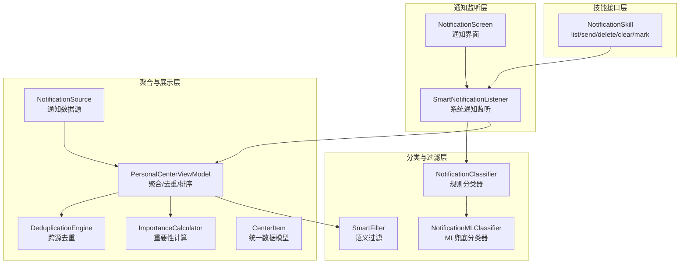
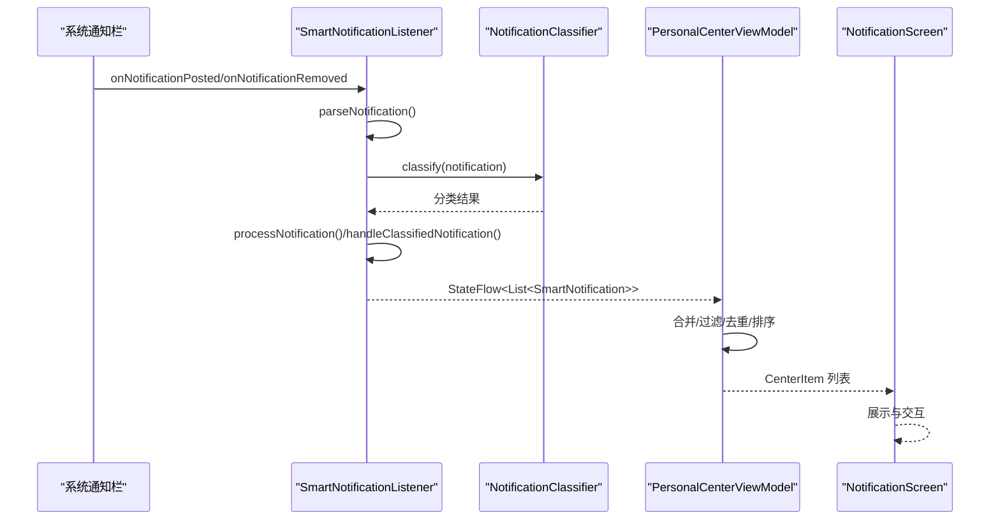
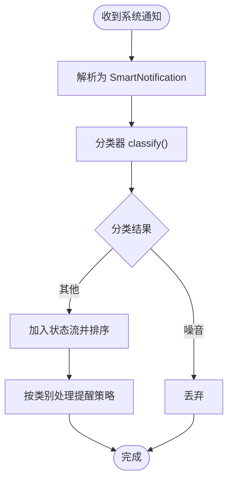
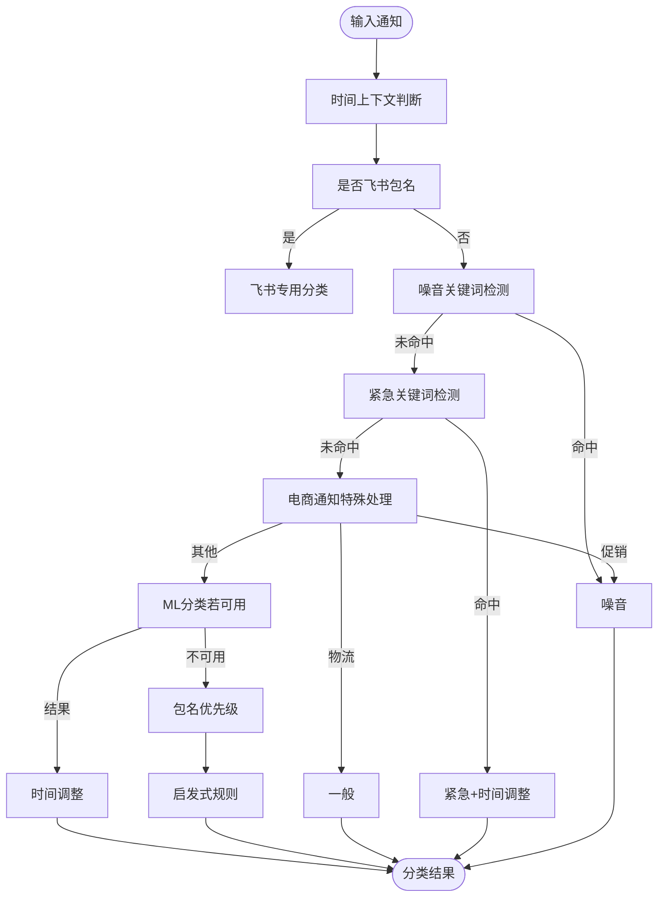
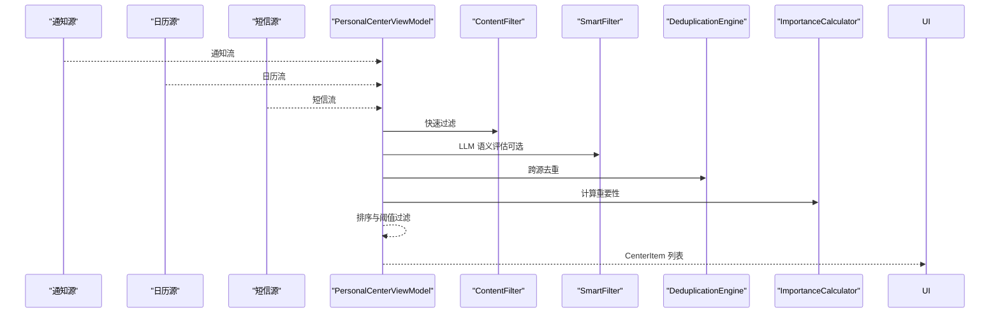
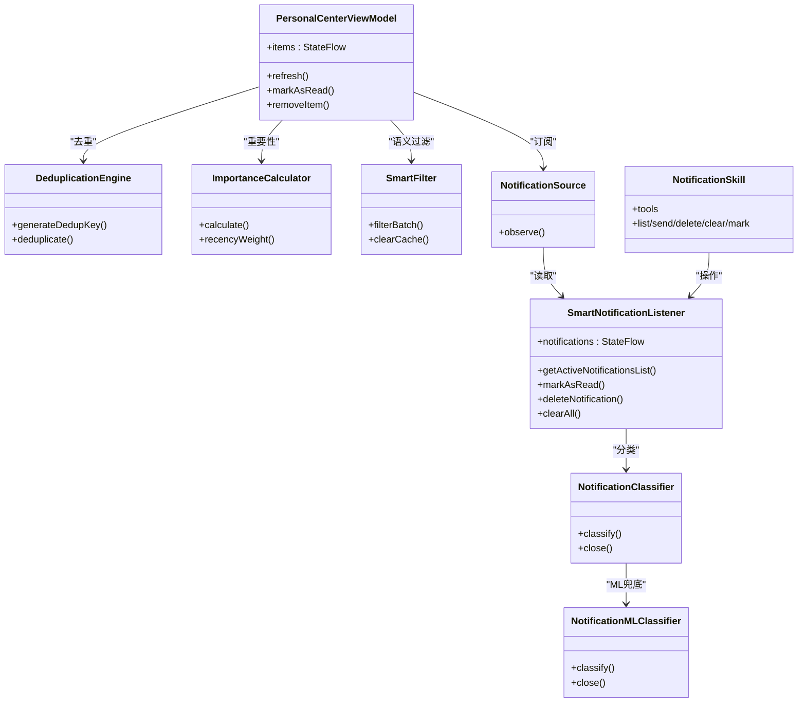

# 通知管理系统

<cite>
**本文档引用的文件**
- [SmartNotificationListener.kt](file://app/src/main/java/ai/openclaw/android/notification/SmartNotificationListener.kt)
- [NotificationClassifier.kt](file://app/src/main/java/ai/openclaw/android/notification/NotificationClassifier.kt)
- [NotificationMLClassifier.kt](file://app/src/main/java/ai/openclaw/android/notification/NotificationMLClassifier.kt)
- [NotificationScreen.kt](file://app/src/main/java/ai/openclaw/android/notification/NotificationScreen.kt)
- [NotificationSkill.kt](file://app/src/main/java/ai/openclaw/android/skill/builtin/NotificationSkill.kt)
- [PersonalCenterViewModel.kt](file://app/src/main/java/ai/openclaw/android/personalcenter/PersonalCenterViewModel.kt)
- [DeduplicationEngine.kt](file://app/src/main/java/ai/openclaw/android/personalcenter/DeduplicationEngine.kt)
- [ImportanceCalculator.kt](file://app/src/main/java/ai/openclaw/android/personalcenter/ImportanceCalculator.kt)
- [SmartFilter.kt](file://app/src/main/java/ai/openclaw/android/personalcenter/SmartFilter.kt)
- [NotificationSource.kt](file://app/src/main/java/ai/openclaw/android/personalcenter/sources/NotificationSource.kt)
- [CenterItem.kt](file://app/src/main/java/ai/openclaw/android/personalcenter/models/CenterItem.kt)
- [2026-04-14-notification-skill.md](file://docs/plans/2026-04-14-notification-skill.md)
- [CURRENT-STATUS-2026-04-14.md](file://docs/CURRENT-STATUS-2026-04-14.md)
</cite>

## 目录
1. [简介](#简介)
2. [项目结构](#项目结构)
3. [核心组件](#核心组件)
4. [架构总览](#架构总览)
5. [详细组件分析](#详细组件分析)
6. [依赖关系分析](#依赖关系分析)
7. [性能与电池优化](#性能与电池优化)
8. [故障排查指南](#故障排查指南)
9. [结论](#结论)
10. [附录](#附录)

## 简介
本通知管理系统围绕 Android NotificationListenerService 实现系统级通知捕获，结合规则与机器学习分类器对通知进行智能分类，并通过个人中心统一聚合展示。系统提供通知去重、重要性计算、个性化过滤、权限管理与 UI 展示，同时支持通过技能接口对外提供通知能力。

## 项目结构
通知相关模块主要分布在以下路径：
- notification：监听、分类、UI 展示与技能接口
- personalcenter：跨源聚合、去重、重要性计算与智能过滤
- skill/builtin：通知技能工具集，提供对外 API

**图表来源**
- [SmartNotificationListener.kt:19-432](file://app/src/main/java/ai/openclaw/android/notification/SmartNotificationListener.kt#L19-L432)
- [NotificationClassifier.kt:20-475](file://app/src/main/java/ai/openclaw/android/notification/NotificationClassifier.kt#L20-L475)
- [NotificationMLClassifier.kt:14-217](file://app/src/main/java/ai/openclaw/android/notification/NotificationMLClassifier.kt#L14-L217)
- [PersonalCenterViewModel.kt:25-263](file://app/src/main/java/ai/openclaw/android/personalcenter/PersonalCenterViewModel.kt#L25-L263)
- [DeduplicationEngine.kt:12-87](file://app/src/main/java/ai/openclaw/android/personalcenter/DeduplicationEngine.kt#L12-L87)
- [ImportanceCalculator.kt:10-109](file://app/src/main/java/ai/openclaw/android/personalcenter/ImportanceCalculator.kt#L10-L109)
- [SmartFilter.kt:15-151](file://app/src/main/java/ai/openclaw/android/personalcenter/SmartFilter.kt#L15-L151)
- [NotificationSource.kt:22-73](file://app/src/main/java/ai/openclaw/android/personalcenter/sources/NotificationSource.kt#L22-L73)
- [CenterItem.kt:10-23](file://app/src/main/java/ai/openclaw/android/personalcenter/models/CenterItem.kt#L10-L23)
- [NotificationSkill.kt:14-215](file://app/src/main/java/ai/openclaw/android/skill/builtin/NotificationSkill.kt#L14-L215)

**章节来源**
- [SmartNotificationListener.kt:19-432](file://app/src/main/java/ai/openclaw/android/notification/SmartNotificationListener.kt#L19-L432)
- [NotificationClassifier.kt:20-475](file://app/src/main/java/ai/openclaw/android/notification/NotificationClassifier.kt#L20-L475)
- [PersonalCenterViewModel.kt:25-263](file://app/src/main/java/ai/openclaw/android/personalcenter/PersonalCenterViewModel.kt#L25-L263)

## 核心组件
- 智能通知监听器：监听系统通知，解析为内部模型，分类并维护状态流
- 通知分类器：基于包名、关键词、时间上下文与 ML 模型进行分类
- 个人中心 ViewModel：聚合通知、日历、短信三源，执行内容过滤、去重与排序
- 去重引擎：跨源去重与合并，提升信息一致性
- 重要性计算器：基于来源与时效的分数计算
- 智能过滤：关键词与 LLM 语义评估的混合策略
- 通知技能：对外提供通知列表、发送、删除、清空、标记已读等工具

**章节来源**
- [SmartNotificationListener.kt:19-432](file://app/src/main/java/ai/openclaw/android/notification/SmartNotificationListener.kt#L19-L432)
- [NotificationClassifier.kt:20-475](file://app/src/main/java/ai/openclaw/android/notification/NotificationClassifier.kt#L20-L475)
- [PersonalCenterViewModel.kt:25-263](file://app/src/main/java/ai/openclaw/android/personalcenter/PersonalCenterViewModel.kt#L25-L263)
- [DeduplicationEngine.kt:12-87](file://app/src/main/java/ai/openclaw/android/personalcenter/DeduplicationEngine.kt#L12-L87)
- [ImportanceCalculator.kt:10-109](file://app/src/main/java/ai/openclaw/android/personalcenter/ImportanceCalculator.kt#L10-L109)
- [SmartFilter.kt:15-151](file://app/src/main/java/ai/openclaw/android/personalcenter/SmartFilter.kt#L15-L151)
- [NotificationSkill.kt:14-215](file://app/src/main/java/ai/openclaw/android/skill/builtin/NotificationSkill.kt#L14-L215)

## 架构总览
系统采用“监听-分类-聚合-展示”的分层架构，监听层负责系统级捕获；分类层提供规则与 ML 双通道；聚合层统一去重与排序；展示层提供 UI 与技能接口。

**图表来源**
- [SmartNotificationListener.kt:190-378](file://app/src/main/java/ai/openclaw/android/notification/SmartNotificationListener.kt#L190-L378)
- [NotificationClassifier.kt:298-356](file://app/src/main/java/ai/openclaw/android/notification/NotificationClassifier.kt#L298-L356)
- [PersonalCenterViewModel.kt:138-206](file://app/src/main/java/ai/openclaw/android/personalcenter/PersonalCenterViewModel.kt#L138-L206)
- [NotificationScreen.kt:37-75](file://app/src/main/java/ai/openclaw/android/notification/NotificationScreen.kt#L37-L75)

## 详细组件分析

### 智能通知监听器（SmartNotificationListener）
- 职责：监听系统通知，解析为 SmartNotification，分类后写入状态流；提供 UI 订阅与外部操作接口
- 关键机制：
  - onListenerConnected：检查权限并延迟拉取系统通知
  - onNotificationPosted：解析并分类，必要时触发事件总线
  - onNotificationRemoved：同步移除
  - getActiveNotificationsList：直接从系统获取最新通知（技能调用）
  - 分类与处理：调用分类器，根据类别决定是否存储与提醒
- 状态管理：使用 StateFlow 维护通知列表，支持标记已读、删除、清空

**图表来源**
- [SmartNotificationListener.kt:297-353](file://app/src/main/java/ai/openclaw/android/notification/SmartNotificationListener.kt#L297-L353)
- [NotificationClassifier.kt:298-356](file://app/src/main/java/ai/openclaw/android/notification/NotificationClassifier.kt#L298-L356)

**章节来源**
- [SmartNotificationListener.kt:19-432](file://app/src/main/java/ai/openclaw/android/notification/SmartNotificationListener.kt#L19-L432)

### 通知分类器（NotificationClassifier）
- 分类优先级：时间上下文 → 关键词 → 飞书专用 → ML 模型 → 包名优先级 → 启发式规则
- 时间上下文：免打扰时段对非紧急通知降级
- 飞书分类：@提及、加急、审批/日程/会议/任务、文档协作等子类型
- 包名优先级：通讯类（紧急）、办公类（重要）、社交/资讯（一般）、推广（噪音）
- 电商通知：物流相关保留为一般，其他促销降噪
- ML 分类：兜底分类器基于包名与关键词映射，后续可替换为 TFLite 模型

**图表来源**
- [NotificationClassifier.kt:298-356](file://app/src/main/java/ai/openclaw/android/notification/NotificationClassifier.kt#L298-L356)
- [NotificationMLClassifier.kt:121-169](file://app/src/main/java/ai/openclaw/android/notification/NotificationMLClassifier.kt#L121-L169)

**章节来源**
- [NotificationClassifier.kt:20-475](file://app/src/main/java/ai/openclaw/android/notification/NotificationClassifier.kt#L20-L475)
- [NotificationMLClassifier.kt:14-217](file://app/src/main/java/ai/openclaw/android/notification/NotificationMLClassifier.kt#L14-L217)

### 个人中心聚合与展示（PersonalCenterViewModel）
- 职责：聚合通知、日历、短信三源；内容过滤（关键词+LLM）；跨源去重；按重要性排序
- 流程：combine 三个 Flow → 内容过滤 → LLM 语义过滤（可选）→ 去重 → 最低阈值过滤 → 输出
- 去重策略：30 分钟时间桶 + 关键词指纹；保留重要性最高的主条目并累加合并数
- 重要性计算：来源基础分 × 时效衰减权重

**图表来源**
- [PersonalCenterViewModel.kt:138-206](file://app/src/main/java/ai/openclaw/android/personalcenter/PersonalCenterViewModel.kt#L138-L206)
- [DeduplicationEngine.kt:18-55](file://app/src/main/java/ai/openclaw/android/personalcenter/DeduplicationEngine.kt#L18-L55)
- [ImportanceCalculator.kt:14-74](file://app/src/main/java/ai/openclaw/android/personalcenter/ImportanceCalculator.kt#L14-L74)
- [SmartFilter.kt:63-108](file://app/src/main/java/ai/openclaw/android/personalcenter/SmartFilter.kt#L63-L108)

**章节来源**
- [PersonalCenterViewModel.kt:25-263](file://app/src/main/java/ai/openclaw/android/personalcenter/PersonalCenterViewModel.kt#L25-L263)
- [DeduplicationEngine.kt:12-87](file://app/src/main/java/ai/openclaw/android/personalcenter/DeduplicationEngine.kt#L12-L87)
- [ImportanceCalculator.kt:10-109](file://app/src/main/java/ai/openclaw/android/personalcenter/ImportanceCalculator.kt#L10-L109)
- [SmartFilter.kt:15-151](file://app/src/main/java/ai/openclaw/android/personalcenter/SmartFilter.kt#L15-L151)
- [NotificationSource.kt:22-73](file://app/src/main/java/ai/openclaw/android/personalcenter/sources/NotificationSource.kt#L22-L73)
- [CenterItem.kt:10-23](file://app/src/main/java/ai/openclaw/android/personalcenter/models/CenterItem.kt#L10-L23)

### 通知 UI 展示（NotificationScreen）
- 提供权限请求卡片、顶部状态栏（未读/紧急计数）、通知列表与长按菜单
- 支持“全部已读”、“清空”、“标记已读”、“删除”等操作
- 通过分类器动态显示应用名称与时间格式化

**章节来源**
- [NotificationScreen.kt:37-407](file://app/src/main/java/ai/openclaw/android/notification/NotificationScreen.kt#L37-L407)

### 通知技能接口（NotificationSkill）
- 工具：list_notifications、send_notification、delete_notification、clear_notifications、mark_notification_read
- 数据来源：list_notifications 直接从系统拉取（绕过内存状态流）
- 通知通道：创建专用通知渠道，支持高/中/低重要性
- 与监听器联动：删除/清空/标记已读同步更新监听器状态流

**章节来源**
- [NotificationSkill.kt:14-215](file://app/src/main/java/ai/openclaw/android/skill/builtin/NotificationSkill.kt#L14-L215)
- [2026-04-14-notification-skill.md:13-244](file://docs/plans/2026-04-14-notification-skill.md#L13-L244)

## 依赖关系分析
- SmartNotificationListener 依赖 NotificationClassifier 进行分类，依赖 EventBus 发布触发事件
- PersonalCenterViewModel 依赖 NotificationSource、CalendarSource、SmsSource，内部组合 DeduplicationEngine、ImportanceCalculator、SmartFilter
- NotificationSource 将 SmartNotification 转换为 CenterItem，并计算重要性
- NotificationSkill 依赖 SmartNotificationListener 与 NotificationManager

**图表来源**
- [SmartNotificationListener.kt:19-432](file://app/src/main/java/ai/openclaw/android/notification/SmartNotificationListener.kt#L19-L432)
- [NotificationClassifier.kt:20-475](file://app/src/main/java/ai/openclaw/android/notification/NotificationClassifier.kt#L20-L475)
- [NotificationMLClassifier.kt:14-217](file://app/src/main/java/ai/openclaw/android/notification/NotificationMLClassifier.kt#L14-L217)
- [PersonalCenterViewModel.kt:25-263](file://app/src/main/java/ai/openclaw/android/personalcenter/PersonalCenterViewModel.kt#L25-L263)
- [DeduplicationEngine.kt:12-87](file://app/src/main/java/ai/openclaw/android/personalcenter/DeduplicationEngine.kt#L12-L87)
- [ImportanceCalculator.kt:10-109](file://app/src/main/java/ai/openclaw/android/personalcenter/ImportanceCalculator.kt#L10-L109)
- [SmartFilter.kt:15-151](file://app/src/main/java/ai/openclaw/android/personalcenter/SmartFilter.kt#L15-L151)
- [NotificationSource.kt:22-73](file://app/src/main/java/ai/openclaw/android/personalcenter/sources/NotificationSource.kt#L22-L73)
- [NotificationSkill.kt:14-215](file://app/src/main/java/ai/openclaw/android/skill/builtin/NotificationSkill.kt#L14-L215)

**章节来源**
- [SmartNotificationListener.kt:19-432](file://app/src/main/java/ai/openclaw/android/notification/SmartNotificationListener.kt#L19-L432)
- [PersonalCenterViewModel.kt:25-263](file://app/src/main/java/ai/openclaw/android/personalcenter/PersonalCenterViewModel.kt#L25-L263)

## 性能与电池优化
- 分类与处理：
  - 分类器在监听器内部协程中执行，避免阻塞主线程
  - 分类结果写入 StateFlow，UI 侧响应式更新
- 去重与排序：
  - 去重采用时间桶 + 关键词指纹，复杂度 O(n)
  - 重要性计算与排序在 ViewModel 中集中处理，减少 UI 重绘
- 通知拉取：
  - 直接从系统拉取（技能）与内存状态流（UI）分离，降低耦合
- 电池与权限：
  - 监听器连接后才主动拉取，避免空转
  - 免打扰时段自动降级非紧急通知，减少唤醒频率

[本节为通用性能建议，无需特定文件引用]

## 故障排查指南
- 无通知显示：
  - 检查通知监听权限是否授予
  - 观察 onListenerConnected 日志与 getActiveNotificationsList 结果
- 分类异常：
  - 查看分类器日志，确认包名/关键词/时间上下文是否命中预期
  - 若 ML 不可用，确认兜底分类器是否覆盖目标包名
- 去重失效：
  - 确认 dedupKey 生成逻辑与指纹截断是否一致
  - 检查合并计数是否正确累加
- 重要性异常：
  - 核对来源基础分与时效衰减权重
  - 检查关键词库是否覆盖目标内容
- 技能调用失败：
  - 确认通知通道已创建
  - 检查通知 ID 类型与系统取消逻辑

**章节来源**
- [SmartNotificationListener.kt:157-182](file://app/src/main/java/ai/openclaw/android/notification/SmartNotificationListener.kt#L157-L182)
- [NotificationClassifier.kt:298-356](file://app/src/main/java/ai/openclaw/android/notification/NotificationClassifier.kt#L298-L356)
- [DeduplicationEngine.kt:18-55](file://app/src/main/java/ai/openclaw/android/personalcenter/DeduplicationEngine.kt#L18-L55)
- [ImportanceCalculator.kt:55-74](file://app/src/main/java/ai/openclaw/android/personalcenter/ImportanceCalculator.kt#L55-L74)
- [NotificationSkill.kt:48-60](file://app/src/main/java/ai/openclaw/android/skill/builtin/NotificationSkill.kt#L48-L60)

## 结论
该通知管理系统以 NotificationListenerService 为基础，结合规则与 ML 的双通道分类，配合个人中心的去重与重要性计算，形成从“捕获-分类-聚合-展示”的完整闭环。系统具备良好的扩展性：分类器可替换为更强大的 ML 模型；个人中心可接入更多数据源；技能接口便于对外提供能力。

[本节为总结性内容，无需特定文件引用]

## 附录

### 使用示例与配置指导
- 获取通知列表（技能）：调用 list_notifications，支持包名过滤、数量限制、是否包含已读
- 发送本地通知：调用 send_notification，支持高/中/低重要性
- 删除/清空/标记已读：对应 delete_notification、clear_notifications、mark_notification_read
- UI 展示：在页面中订阅 SmartNotificationListener.notifications，绑定到 NotificationScreen

**章节来源**
- [NotificationSkill.kt:62-215](file://app/src/main/java/ai/openclaw/android/skill/builtin/NotificationSkill.kt#L62-L215)
- [NotificationScreen.kt:37-75](file://app/src/main/java/ai/openclaw/android/notification/NotificationScreen.kt#L37-L75)
- [2026-04-14-notification-skill.md:86-244](file://docs/plans/2026-04-14-notification-skill.md#L86-L244)

### 扩展与定制化
- 分类器扩展：新增包名映射、关键词库或时间策略
- 去重策略：调整时间桶大小、关键词提取规则或指纹长度
- 重要性计算：增加来源类型或调整权重
- 语义过滤：接入更强的 LLM 评估器，完善缓存与降级策略
- UI 定制：在 NotificationScreen 中扩展展示样式与交互

**章节来源**
- [NotificationClassifier.kt:20-475](file://app/src/main/java/ai/openclaw/android/notification/NotificationClassifier.kt#L20-L475)
- [DeduplicationEngine.kt:18-87](file://app/src/main/java/ai/openclaw/android/personalcenter/DeduplicationEngine.kt#L18-L87)
- [ImportanceCalculator.kt:14-109](file://app/src/main/java/ai/openclaw/android/personalcenter/ImportanceCalculator.kt#L14-L109)
- [SmartFilter.kt:15-151](file://app/src/main/java/ai/openclaw/android/personalcenter/SmartFilter.kt#L15-L151)
- [NotificationScreen.kt:37-407](file://app/src/main/java/ai/openclaw/android/notification/NotificationScreen.kt#L37-L407)