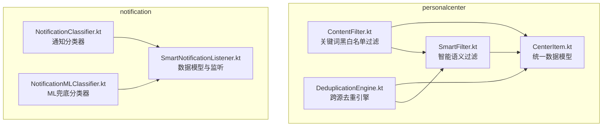
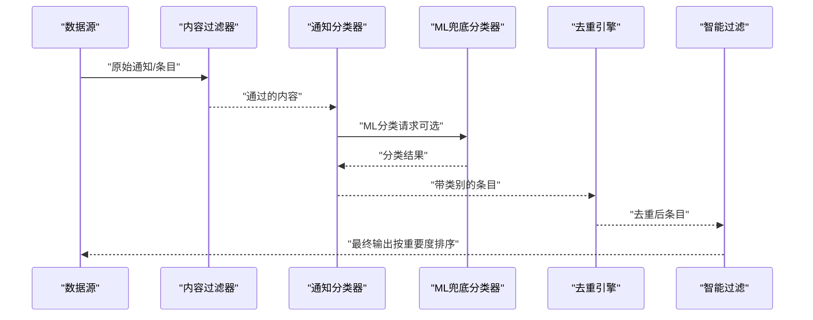
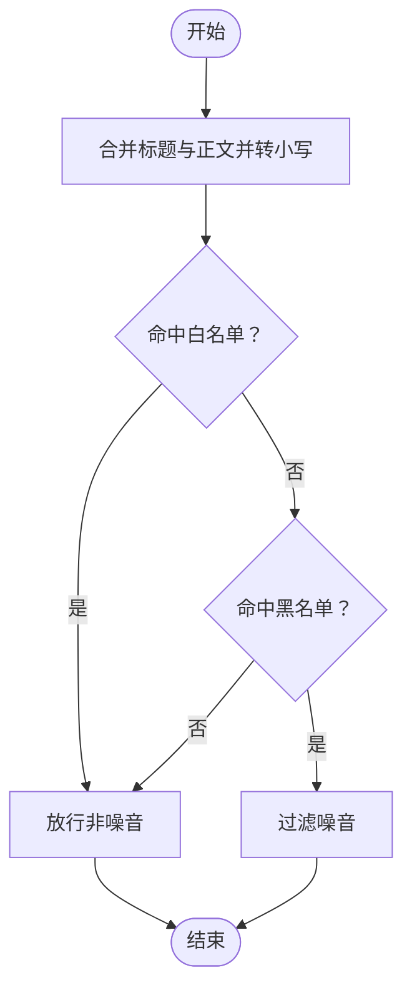
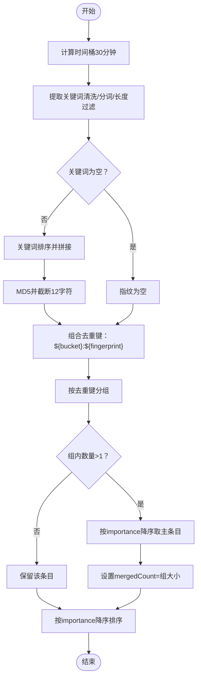
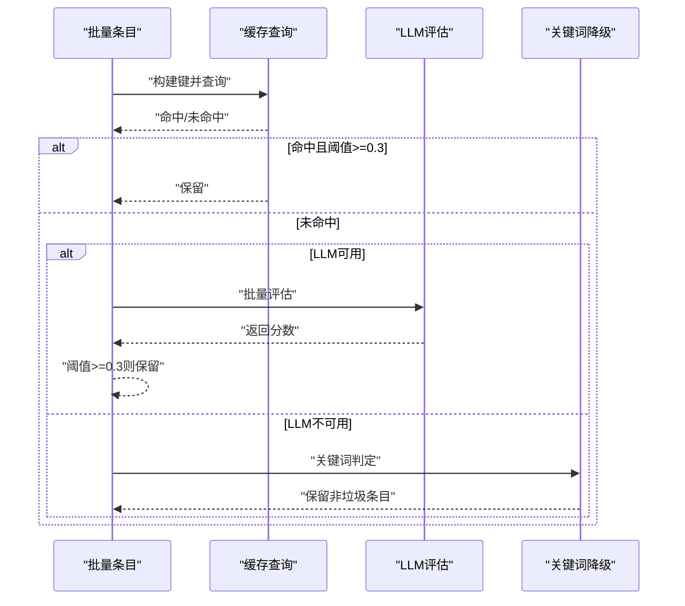
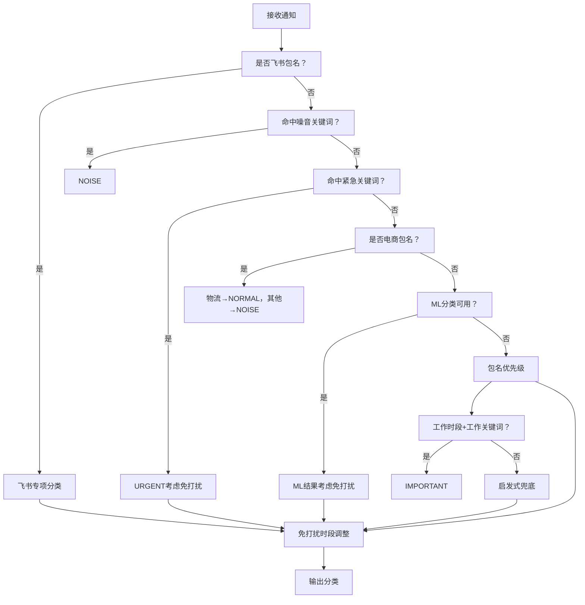
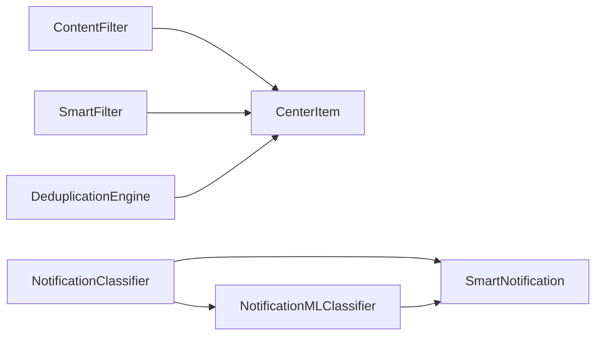

# 通知过滤机制

<cite>
**本文引用的文件**
- [ContentFilter.kt](file://app/src/main/java/ai/openclaw/android/personalcenter/ContentFilter.kt)
- [DeduplicationEngine.kt](file://app/src/main/java/ai/openclaw/android/personalcenter/DeduplicationEngine.kt)
- [SmartFilter.kt](file://app/src/main/java/ai/openclaw/android/personalcenter/SmartFilter.kt)
- [NotificationClassifier.kt](file://app/src/main/java/ai/openclaw/android/notification/NotificationClassifier.kt)
- [NotificationMLClassifier.kt](file://app/src/main/java/ai/openclaw/android/notification/NotificationMLClassifier.kt)
- [SmartNotificationListener.kt](file://app/src/main/java/ai/openclaw/android/notification/SmartNotificationListener.kt)
- [CenterItem.kt](file://app/src/main/java/ai/openclaw/android/personalcenter/models/CenterItem.kt)
</cite>

## 目录
1. [简介](#简介)
2. [项目结构](#项目结构)
3. [核心组件](#核心组件)
4. [架构总览](#架构总览)
5. [组件详解](#组件详解)
6. [依赖关系分析](#依赖关系分析)
7. [性能与缓存优化](#性能与缓存优化)
8. [故障排查指南](#故障排查指南)
9. [结论](#结论)
10. [附录](#附录)

## 简介
本文件系统性阐述通知过滤机制的设计与实现，覆盖以下方面：
- 通知去重引擎：基于时间桶与关键词指纹的跨源去重策略，以及相似度比较与合并逻辑
- 内容过滤器：关键词过滤、正则表达式匹配与白名单/黑名单管理
- 智能过滤引擎：基于 LLM 的语义评估与缓存降级策略
- 性能优化与缓存：热点命中率提升、批量处理与降级路径
- 规则配置与服务端同步：规则集中化与动态下发思路
- 使用示例与自定义规则开发指导

## 项目结构
通知过滤相关代码主要分布在 personalcenter 与 notification 两个包中，并通过统一数据模型 CenterItem 进行跨源聚合。

**图表来源**
- [ContentFilter.kt:1-76](file://app/src/main/java/ai/openclaw/android/personalcenter/ContentFilter.kt#L1-L76)
- [DeduplicationEngine.kt:1-88](file://app/src/main/java/ai/openclaw/android/personalcenter/DeduplicationEngine.kt#L1-L88)
- [SmartFilter.kt:1-152](file://app/src/main/java/ai/openclaw/android/personalcenter/SmartFilter.kt#L1-L152)
- [NotificationClassifier.kt:1-476](file://app/src/main/java/ai/openclaw/android/notification/NotificationClassifier.kt#L1-L476)
- [NotificationMLClassifier.kt:1-218](file://app/src/main/java/ai/openclaw/android/notification/NotificationMLClassifier.kt#L1-L218)
- [SmartNotificationListener.kt:430-460](file://app/src/main/java/ai/openclaw/android/notification/SmartNotificationListener.kt#L430-L460)
- [CenterItem.kt:1-24](file://app/src/main/java/ai/openclaw/android/personalcenter/models/CenterItem.kt#L1-L24)

**章节来源**
- [ContentFilter.kt:1-76](file://app/src/main/java/ai/openclaw/android/personalcenter/ContentFilter.kt#L1-L76)
- [DeduplicationEngine.kt:1-88](file://app/src/main/java/ai/openclaw/android/personalcenter/DeduplicationEngine.kt#L1-L88)
- [SmartFilter.kt:1-152](file://app/src/main/java/ai/openclaw/android/personalcenter/SmartFilter.kt#L1-L152)
- [NotificationClassifier.kt:1-476](file://app/src/main/java/ai/openclaw/android/notification/NotificationClassifier.kt#L1-L476)
- [NotificationMLClassifier.kt:1-218](file://app/src/main/java/ai/openclaw/android/notification/NotificationMLClassifier.kt#L1-L218)
- [SmartNotificationListener.kt:430-460](file://app/src/main/java/ai/openclaw/android/notification/SmartNotificationListener.kt#L430-L460)
- [CenterItem.kt:1-24](file://app/src/main/java/ai/openclaw/android/personalcenter/models/CenterItem.kt#L1-L24)

## 核心组件
- 内容过滤器（ContentFilter）：基于预置的中文/英文关键词集合进行快速黑白名单过滤，优先放行白名单，再过滤黑名单
- 去重引擎（DeduplicationEngine）：以 30 分钟时间桶 + 关键词指纹（MD5 截断）生成去重键，对同一事件多源聚合
- 智能过滤（SmartFilter）：支持 LLM 语义评估与缓存；LLM 不可用时降级为关键词模式
- 通知分类器（NotificationClassifier）：综合包名优先级、关键词、飞书专项、ML 模型与时间上下文进行分类
- ML 兜底分类器（NotificationMLClassifier）：规则驱动的轻量分类器，作为 TFLite 模型就绪前的过渡方案
- 统一数据模型（CenterItem）：跨源统一结构，承载去重键、重要度、来源等字段

**章节来源**
- [ContentFilter.kt:9-76](file://app/src/main/java/ai/openclaw/android/personalcenter/ContentFilter.kt#L9-L76)
- [DeduplicationEngine.kt:12-88](file://app/src/main/java/ai/openclaw/android/personalcenter/DeduplicationEngine.kt#L12-L88)
- [SmartFilter.kt:15-152](file://app/src/main/java/ai/openclaw/android/personalcenter/SmartFilter.kt#L15-L152)
- [NotificationClassifier.kt:20-356](file://app/src/main/java/ai/openclaw/android/notification/NotificationClassifier.kt#L20-L356)
- [NotificationMLClassifier.kt:14-169](file://app/src/main/java/ai/openclaw/android/notification/NotificationMLClassifier.kt#L14-L169)
- [CenterItem.kt:10-23](file://app/src/main/java/ai/openclaw/android/personalcenter/models/CenterItem.kt#L10-L23)

## 架构总览
通知过滤的整体流程如下：
- 输入：来自系统通知、日程、短信等多源的 SmartNotification 或 CenterItem
- 预处理：内容过滤器快速筛除明显噪音
- 分类：通知分类器结合包名、关键词、ML 模型与时间上下文给出类别
- 去重：跨源去重引擎按时间桶与关键词指纹合并同类事件
- 智能过滤：对剩余条目进行 LLM 语义评估或关键词降级
- 输出：按重要度排序后的最终列表

**图表来源**
- [ContentFilter.kt:60-75](file://app/src/main/java/ai/openclaw/android/personalcenter/ContentFilter.kt#L60-L75)
- [NotificationClassifier.kt:298-356](file://app/src/main/java/ai/openclaw/android/notification/NotificationClassifier.kt#L298-L356)
- [NotificationMLClassifier.kt:121-169](file://app/src/main/java/ai/openclaw/android/notification/NotificationMLClassifier.kt#L121-L169)
- [DeduplicationEngine.kt:35-55](file://app/src/main/java/ai/openclaw/android/personalcenter/DeduplicationEngine.kt#L35-L55)
- [SmartFilter.kt:63-108](file://app/src/main/java/ai/openclaw/android/personalcenter/SmartFilter.kt#L63-L108)

## 组件详解

### 内容过滤器（关键词/正则/黑白名单）
- 职责：对输入条目进行快速噪音识别，采用“白名单优先放行、黑名单直接过滤”的策略
- 关键词库：
  - 黑名单：广告/营销/系统噪音（中英文）
  - 白名单：验证码、银行金融、来电、政务/医疗/保险等高价值场景
- 过滤逻辑：
  - 若命中白名单关键词 → 直接放行
  - 若命中黑名单关键词 → 过滤掉
  - 否则默认放行
- 正则匹配：当前版本未使用正则表达式，建议扩展时采用安全正则校验器

**图表来源**
- [ContentFilter.kt:60-75](file://app/src/main/java/ai/openclaw/android/personalcenter/ContentFilter.kt#L60-L75)

**章节来源**
- [ContentFilter.kt:9-76](file://app/src/main/java/ai/openclaw/android/personalcenter/ContentFilter.kt#L9-L76)

### 去重引擎（哈希计算/相似度/合并策略）
- 去重键生成：
  - 时间桶：以毫秒为单位的时间戳整除 30 分钟，形成 30 分钟窗口
  - 关键词提取：清洗文本、分词、筛选长度≥2的词，优先取 3+ 字符词，不足时补充 2 字词，最多取 4 个
  - MD5 截断：对关键词排序后拼接并做 MD5，取前 12 位作为指纹
  - 组合键：`${时间桶}:${指纹}`
- 去重与合并：
  - 按去重键分组，若组内仅一个条目则直接保留
  - 多条目时按 importance 降序，取最高重要度条目为主条目，设置 mergedCount 为组大小
- 相似度比较：
  - 采用关键词指纹近似，避免完全相等的严格匹配
  - 通过时间桶限制跨时间段的误判

**图表来源**
- [DeduplicationEngine.kt:18-55](file://app/src/main/java/ai/openclaw/android/personalcenter/DeduplicationEngine.kt#L18-L55)
- [DeduplicationEngine.kt:60-79](file://app/src/main/java/ai/openclaw/android/personalcenter/DeduplicationEngine.kt#L60-L79)
- [DeduplicationEngine.kt:81-86](file://app/src/main/java/ai/openclaw/android/personalcenter/DeduplicationEngine.kt#L81-L86)

**章节来源**
- [DeduplicationEngine.kt:12-88](file://app/src/main/java/ai/openclaw/android/personalcenter/DeduplicationEngine.kt#L12-L88)
- [CenterItem.kt:10-23](file://app/src/main/java/ai/openclaw/android/personalcenter/models/CenterItem.kt#L10-L23)

### 智能过滤引擎（LLM 语义评估与缓存）
- 架构要点：
  - 通过回调注入 LLM 评估能力，避免直接依赖全局单例
  - 缓存：以来源+标题+正文片段为键，1 小时 TTL，命中则直接放行或丢弃
  - 降级：LLM 异常或不可用时退回关键词模式，白名单优先，其余命中垃圾关键词则过滤
- 过滤流程：
  - 先查缓存，命中阈值以上则保留
  - 未命中则批量送入 LLM 评估，根据阈值（0.3）决定保留
  - LLM 失败时走关键词降级，保留非垃圾条目
- 关键词库：
  - 垃圾关键词：广告/营销/推广/垃圾应用/游戏推送/英文 spam
  - 白名单：验证码、银行/交易、来电/通话、政务/医疗/保险

**图表来源**
- [SmartFilter.kt:63-108](file://app/src/main/java/ai/openclaw/android/personalcenter/SmartFilter.kt#L63-L108)
- [SmartFilter.kt:113-122](file://app/src/main/java/ai/openclaw/android/personalcenter/SmartFilter.kt#L113-L122)
- [SmartFilter.kt:126-146](file://app/src/main/java/ai/openclaw/android/personalcenter/SmartFilter.kt#L126-L146)

**章节来源**
- [SmartFilter.kt:15-152](file://app/src/main/java/ai/openclaw/android/personalcenter/SmartFilter.kt#L15-L152)

### 通知分类器（规则/ML/时间上下文）
- 分类优先级：
  1) 飞书专项分类（@提及/加急/审批/会议/文档协作/推荐/活动）
  2) 噪音关键词检测
  3) 紧急关键词检测
  4) 电商通知特殊处理（物流升级为一般，其他降噪）
  5) ML 模型分类（可用时）
  6) 包名优先级（紧急/重要/一般/噪音）
  7) 工作时段关键词提升
  8) 启发式兜底
- 时间上下文：
  - 免打扰时段（夜间）：非紧急降级
  - 工作时段：工作相关关键词提升为重要
- 包名优先级：
  - 紧急：即时通讯、电话/短信、安全类
  - 重要：办公协作、日历/邮件、文档/效率、网盘/存储
  - 一般：浏览器、社交媒体、短视频、资讯/阅读
  - 噪音：应用商店、系统搜索、清理/安全/应用宝等

**图表来源**
- [NotificationClassifier.kt:298-356](file://app/src/main/java/ai/openclaw/android/notification/NotificationClassifier.kt#L298-L356)
- [NotificationClassifier.kt:305-316](file://app/src/main/java/ai/openclaw/android/notification/NotificationClassifier.kt#L305-L316)
- [NotificationClassifier.kt:318-322](file://app/src/main/java/ai/openclaw/android/notification/NotificationClassifier.kt#L318-L322)
- [NotificationClassifier.kt:324-327](file://app/src/main/java/ai/openclaw/android/notification/NotificationClassifier.kt#L324-L327)
- [NotificationClassifier.kt:329-334](file://app/src/main/java/ai/openclaw/android/notification/NotificationClassifier.kt#L329-L334)
- [NotificationClassifier.kt:336-347](file://app/src/main/java/ai/openclaw/android/notification/NotificationClassifier.kt#L336-L347)
- [NotificationClassifier.kt:349-352](file://app/src/main/java/ai/openclaw/android/notification/NotificationClassifier.kt#L349-L352)
- [NotificationClassifier.kt:354-356](file://app/src/main/java/ai/openclaw/android/notification/NotificationClassifier.kt#L354-L356)
- [NotificationClassifier.kt:397-413](file://app/src/main/java/ai/openclaw/android/notification/NotificationClassifier.kt#L397-L413)

**章节来源**
- [NotificationClassifier.kt:20-476](file://app/src/main/java/ai/openclaw/android/notification/NotificationClassifier.kt#L20-L476)
- [NotificationMLClassifier.kt:14-218](file://app/src/main/java/ai/openclaw/android/notification/NotificationMLClassifier.kt#L14-L218)
- [SmartNotificationListener.kt:439-460](file://app/src/main/java/ai/openclaw/android/notification/SmartNotificationListener.kt#L439-L460)

## 依赖关系分析
- 组件耦合：
  - ContentFilter 与 SmartFilter：均依赖 CenterItem 的文本字段
  - DeduplicationEngine 与 SmartFilter：共享 CenterItem 的 importance 字段用于合并主条目
  - NotificationClassifier 与 NotificationMLClassifier：共同面向 SmartNotification 数据模型
- 外部依赖：
  - Android PackageManager：用于获取应用名与安装状态
  - LLM 评估回调：通过接口注入，便于测试与替换
- 潜在循环依赖：
  - 当前模块间为单向依赖，无循环

**图表来源**
- [ContentFilter.kt:3-4](file://app/src/main/java/ai/openclaw/android/personalcenter/ContentFilter.kt#L3-L4)
- [SmartFilter.kt:3-4](file://app/src/main/java/ai/openclaw/android/personalcenter/SmartFilter.kt#L3-L4)
- [DeduplicationEngine.kt:3-4](file://app/src/main/java/ai/openclaw/android/personalcenter/DeduplicationEngine.kt#L3-L4)
- [NotificationClassifier.kt:3-6](file://app/src/main/java/ai/openclaw/android/notification/NotificationClassifier.kt#L3-L6)
- [NotificationMLClassifier.kt:3-6](file://app/src/main/java/ai/openclaw/android/notification/NotificationMLClassifier.kt#L3-L6)
- [SmartNotificationListener.kt:439-449](file://app/src/main/java/ai/openclaw/android/notification/SmartNotificationListener.kt#L439-L449)

**章节来源**
- [CenterItem.kt:10-23](file://app/src/main/java/ai/openclaw/android/personalcenter/models/CenterItem.kt#L10-L23)
- [SmartNotificationListener.kt:439-460](file://app/src/main/java/ai/openclaw/android/notification/SmartNotificationListener.kt#L439-L460)

## 性能与缓存优化
- 去重性能：
  - 时间桶 O(1) 计算，关键词提取线性复杂度，MD5 常数时间
  - 分组与排序在组内条目较少时开销可控
- 智能过滤缓存：
  - ConcurrentHashMap + TTL，避免重复调用 LLM
  - 键包含来源、标题哈希与正文片段哈希，兼顾命中率与一致性
- 批量处理：
  - 智能过滤支持批量评估，减少 LLM 调用次数
- 降级策略：
  - LLM 失败时快速退回关键词模式，保证稳定性
- 建议优化：
  - 对高频来源建立本地规则索引
  - 对超长正文进行分片或摘要化处理
  - 在 UI 层对去重后的条目进行懒加载渲染

[本节为通用性能讨论，无需列出具体文件来源]

## 故障排查指南
- LLM 评估异常：
  - 现象：智能过滤抛出异常并触发关键词降级
  - 处理：检查回调注入与网络状态；查看日志标签
- 去重误判：
  - 现象：同一事件被拆分为多条或未合并
  - 处理：检查时间桶边界与关键词提取逻辑；确认去重键生成一致
- 分类偏差：
  - 现象：飞书/电商/工作时段分类不符合预期
  - 处理：核对关键词库与包名优先级配置；确认时间上下文计算
- 白名单/黑名单误伤：
  - 现象：高价值内容被过滤
  - 处理：扩大白名单或调整关键词匹配策略；必要时引入正则表达式

**章节来源**
- [SmartFilter.kt:87-96](file://app/src/main/java/ai/openclaw/android/personalcenter/SmartFilter.kt#L87-L96)
- [NotificationClassifier.kt:270-291](file://app/src/main/java/ai/openclaw/android/notification/NotificationClassifier.kt#L270-L291)

## 结论
通知过滤机制通过“快速关键词过滤 + 通知分类 + 跨源去重 + 智能语义评估”的多层体系，在保证实时性的同时提升了准确性与用户体验。去重引擎以时间桶与关键词指纹为核心，有效解决多源重复问题；智能过滤在 LLM 可用时提供语义增强，不可用时可靠降级。建议后续引入正则表达式校验器、规则集中化与服务端同步能力，进一步提升可维护性与可扩展性。

[本节为总结性内容，无需列出具体文件来源]

## 附录

### 使用示例
- 快速过滤噪音：
  - 输入：CenterItem 列表
  - 步骤：调用内容过滤器的 isNoise 判断，过滤掉返回 true 的条目
- 去重与合并：
  - 输入：CenterItem 列表（可带去重键或自动计算）
  - 步骤：调用去重引擎的 deduplicate，得到按重要度排序的条目
- 智能过滤：
  - 输入：CenterItem 列表
  - 步骤：注入 LLM 评估回调，调用智能过滤的 filterBatch，得到最终保留条目
- 通知分类：
  - 输入：SmartNotification
  - 步骤：调用通知分类器的 classify，得到分类结果并结合时间上下文调整

**章节来源**
- [ContentFilter.kt:60-75](file://app/src/main/java/ai/openclaw/android/personalcenter/ContentFilter.kt#L60-L75)
- [DeduplicationEngine.kt:35-55](file://app/src/main/java/ai/openclaw/android/personalcenter/DeduplicationEngine.kt#L35-L55)
- [SmartFilter.kt:63-108](file://app/src/main/java/ai/openclaw/android/personalcenter/SmartFilter.kt#L63-L108)
- [NotificationClassifier.kt:298-356](file://app/src/main/java/ai/openclaw/android/notification/NotificationClassifier.kt#L298-L356)

### 自定义过滤规则开发指导
- 新增关键词规则：
  - 在内容过滤器或智能过滤的关键词集合中添加新词条，注意中英文区分与大小写处理
- 引入正则表达式：
  - 建议复用现有安全正则校验器，避免性能与安全风险
- 扩展去重策略：
  - 在去重引擎中增加更细粒度的特征（如来源应用、事件类型），调整指纹生成逻辑
- 配置管理与服务端同步：
  - 设计规则配置中心，支持远程下发关键词、包名优先级与时间阈值
  - 增加版本控制与灰度发布机制，确保平滑演进
- 性能监控：
  - 记录各阶段耗时与命中率，定期评估规则效果并迭代优化

[本节为实践指导，无需列出具体文件来源]